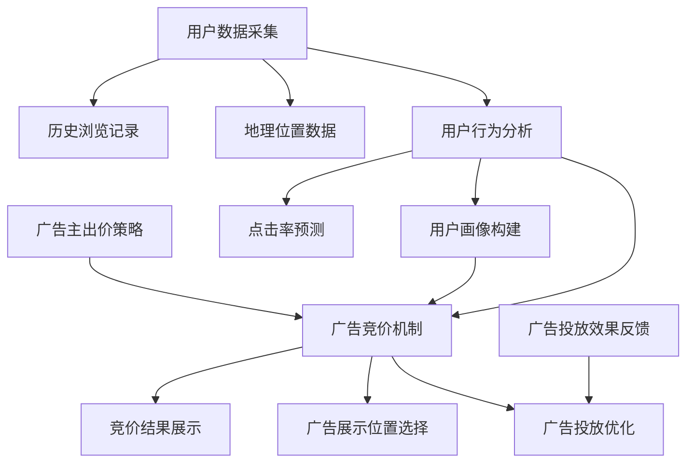
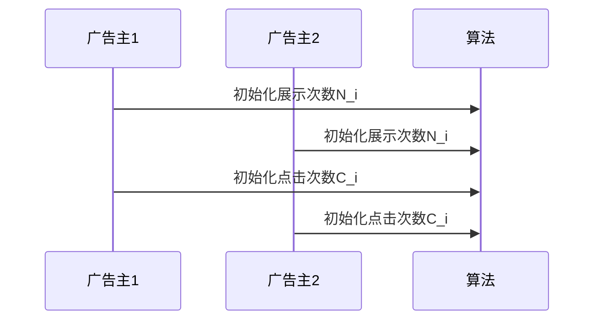
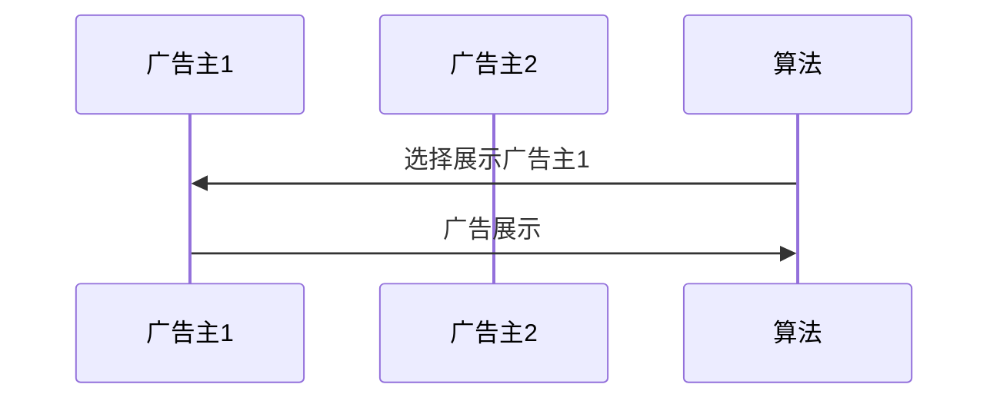
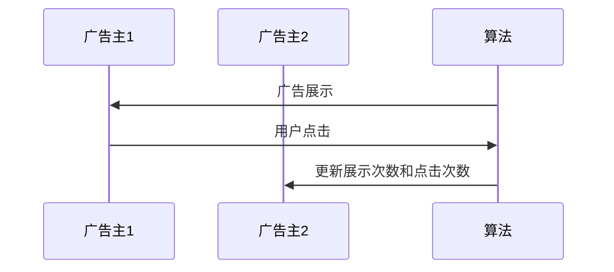
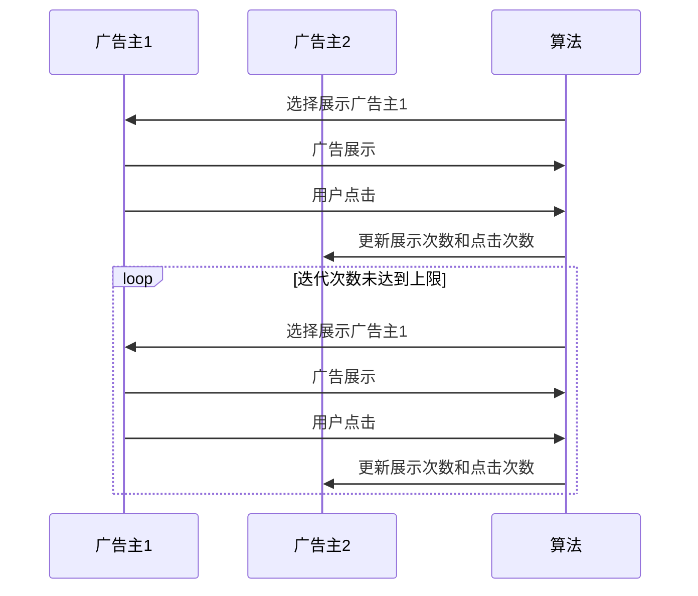

                 

### 背景介绍

随着互联网的迅速发展，电子商务已经成为全球最大的零售市场之一。而电商平台的广告投放系统，作为促进商家与消费者之间互动的重要手段，对于平台的商业成功至关重要。传统的广告投放系统主要依赖于预定的预算和固定的广告投放策略，而随着人工智能技术的发展，尤其是深度学习和大数据分析的应用，AI驱动的实时竞价广告投放系统逐渐成为电商平台提高广告效果和提升用户满意度的重要工具。

#### 什么是AI驱动的实时竞价广告投放系统？

AI驱动的实时竞价广告投放系统，是指通过人工智能算法，根据用户的实时行为数据，动态调整广告展示的时间和位置，并在多个广告主之间进行实时竞价，以实现广告投放的优化。这种系统不仅能够根据用户的兴趣和行为来精准定位广告受众，还能在保证广告效果的同时，最大化广告主的广告投放回报。

#### 系统的组成部分

一个典型的AI驱动的实时竞价广告投放系统主要由以下几个部分组成：

1. **数据采集与处理模块**：该模块负责从各种渠道（如用户点击、搜索、浏览记录等）收集用户数据，并对这些数据进行清洗、整理和分析。
2. **用户行为分析模块**：基于采集到的用户数据，使用机器学习算法来预测用户的行为和兴趣，从而为后续的广告投放提供决策依据。
3. **广告竞价模块**：该模块负责实现广告主之间的实时竞价过程，根据用户行为数据和广告主的出价策略，实时调整广告展示。
4. **广告投放优化模块**：通过分析广告投放的效果，不断调整广告策略，以实现广告投放效果的最大化。

#### 系统的优势

1. **提高广告投放效果**：通过分析用户行为数据，系统能够实现广告的精准投放，从而提高广告点击率和转化率。
2. **提升用户体验**：基于用户行为数据的实时分析，系统能够在合适的时间和位置展示用户感兴趣的广告，从而提升用户体验。
3. **优化广告主效益**：实时竞价机制能够帮助广告主在预算范围内最大化广告效果，提升广告投放的回报率。

#### 发展现状与趋势

近年来，随着人工智能技术的不断成熟和大数据应用的普及，AI驱动的实时竞价广告投放系统在电商领域得到了广泛应用。各大电商平台纷纷投入大量资源进行技术研发，以提高自身的广告投放效率和用户满意度。同时，随着5G技术的推广和物联网的发展，实时竞价广告投放系统在未来将具备更广泛的应用场景和更高的投放精度。

本文将围绕AI驱动的实时竞价广告投放系统，深入探讨其核心概念、算法原理、数学模型、实际应用和未来发展，旨在为相关领域的研究者和从业者提供有价值的参考。

### 核心概念与联系

#### AI驱动的实时竞价广告投放系统的核心概念

AI驱动的实时竞价广告投放系统涉及多个核心概念，以下将详细解释这些概念，并使用Mermaid流程图来展示它们之间的联系。

1. **用户数据采集**：用户数据是系统的基础，包括用户的浏览历史、点击行为、搜索记录、地理位置等。这些数据通过各种渠道（如Web追踪、移动应用等）进行收集。

2. **用户行为分析**：通过对用户数据的分析，系统可以识别出用户的兴趣和行为模式。常见的分析技术包括机器学习算法、自然语言处理、用户画像等。

3. **广告竞价机制**：广告竞价机制是系统实现广告实时投放的关键。它通常基于实时的用户行为数据和广告主的出价策略，通过算法动态调整广告展示。

4. **广告投放优化**：广告投放优化模块负责分析广告投放的效果，并根据反馈数据调整广告策略，以实现广告效果的最大化。

#### Mermaid流程图

以下是一个简化的Mermaid流程图，用于展示AI驱动的实时竞价广告投放系统中的核心概念和它们之间的联系。



1. **用户数据采集**（A）：系统从各种渠道收集用户数据，包括地理位置（I）、历史浏览记录（J）等。
2. **用户行为分析**（B）：使用机器学习算法和自然语言处理技术分析用户行为，预测用户的兴趣和需求。
3. **广告主出价策略**（E）：广告主根据自身目标，设置实时竞价策略。
4. **广告竞价机制**（C）：根据用户行为数据和广告主出价策略，实时决定广告展示的时间和位置。
5. **广告投放优化**（D）：通过分析广告投放效果，不断调整广告策略。
6. **用户画像构建**（G）：基于用户行为数据，构建详细的用户画像。
7. **广告展示位置选择**（H）：根据用户画像和竞价结果，选择最佳的广告展示位置。
8. **广告投放效果反馈**（F）：收集广告投放的效果数据，用于后续的广告策略调整。

#### 关键概念之间的联系

- **用户数据采集**（A）和**用户行为分析**（B）是系统的基础，提供了决策所需的数据支持。
- **用户画像构建**（G）是基于用户行为分析的结果，它帮助系统更好地理解用户，从而实现更精准的广告投放。
- **广告主出价策略**（E）和**广告竞价机制**（C）决定了广告的投放效率和效果。
- **广告投放优化**（D）基于广告投放效果反馈（F），是一个闭环过程，用于不断改进广告策略。

通过上述核心概念和Mermaid流程图的解释，我们可以看到AI驱动的实时竞价广告投放系统是如何运作的，以及各个部分之间是如何相互关联和协同工作的。接下来，本文将深入探讨系统的核心算法原理和具体操作步骤。

### 核心算法原理 & 具体操作步骤

#### 1. 广告竞价算法原理

广告竞价算法是AI驱动的实时竞价广告投放系统的核心，负责处理广告主之间的竞价过程，以决定广告的展示顺序和位置。竞价算法通常基于以下三个关键因素：

1. **点击率预测（CTR）**：预测一个广告被点击的概率，是广告投放效果的重要指标。
2. **广告质量得分**：衡量广告本身的质量，通常与广告内容的相关性、广告主的信誉等因素相关。
3. **广告主出价**：广告主为获得广告展示机会而设定的价格。

常见的广告竞价算法包括Google的AdWords算法、Facebook的拍卖算法等。以下将介绍一种基于博弈论的竞价算法——多臂老虎机算法。

#### 2. 多臂老虎机算法

多臂老虎机算法是一种在多个臂之间进行选择的策略，用于解决多臂老虎机游戏中的最优策略。将其应用于广告竞价，可以模拟广告主之间的竞争过程。

多臂老虎机算法的核心步骤如下：

1. **初始化**：为每个广告主分配一个初始展示次数和点击次数。
2. **选择动作**：根据历史数据，使用某种策略选择一个广告主进行展示。
3. **更新数据**：根据广告展示后的反馈，更新每个广告主的展示次数和点击次数。
4. **迭代**：重复步骤2和3，直到满足终止条件（如达到预设的迭代次数或收敛条件）。

#### 3. 具体操作步骤

**步骤1：初始化**

假设有n个广告主，每个广告主有一个初始展示次数`N_i`（例如：`N_i = 100`）和一个初始点击次数`C_i`（例如：`C_i = 10`）。



**步骤2：选择动作**

使用某种策略（例如：基于历史数据的优化策略），选择一个广告主进行展示。一种简单的策略是轮询策略，即每次选择下一个广告主进行展示。



**步骤3：更新数据**

广告展示后，根据用户行为（如点击、不点击）更新每个广告主的展示次数和点击次数。



**步骤4：迭代**

重复步骤2和3，直到满足终止条件。例如，可以设置一个迭代次数上限，或者当算法收敛时停止。



#### 4. 算法优化

为了提高竞价算法的效率和效果，可以引入以下优化策略：

1. **动态调整展示概率**：根据广告主的历史表现（如点击率、转化率等）动态调整展示概率。
2. **多因素决策**：考虑更多因素（如广告内容、用户上下文信息等）进行更精细的决策。
3. **在线学习**：使用在线学习算法（如梯度提升树、神经网络等）不断更新模型，提高预测精度。

#### 5. 算法评价与验证

为了评估竞价算法的性能，可以使用以下指标：

1. **平均点击率（CTR）**：广告的平均点击率。
2. **广告展示次数**：广告的总展示次数。
3. **广告主满意度**：广告主对广告投放效果的满意度。
4. **广告投放成本**：广告主的总投放成本。

通过这些指标，可以对算法进行定量和定性评估，以便不断优化和改进。

通过上述核心算法原理和具体操作步骤的介绍，我们可以更好地理解AI驱动的实时竞价广告投放系统的工作机制。在接下来的章节中，我们将深入探讨系统的数学模型和公式，为后续的实际应用提供理论基础。

### 数学模型和公式 & 详细讲解 & 举例说明

#### 1. 点击率预测模型

点击率（Click-Through Rate，CTR）是广告投放效果的重要指标，预测CTR是竞价算法的核心任务。本文采用一种基于逻辑回归的点击率预测模型，其基本公式如下：

$$
\hat{p}_i = \frac{1}{1 + e^{-(\beta_0 + \sum_{j=1}^{n}\beta_jx_{ij})}
$$

其中，$\hat{p}_i$ 表示广告 $i$ 被点击的概率，$\beta_0$ 是模型截距，$\beta_j$ 是特征 $j$ 的权重，$x_{ij}$ 是特征 $j$ 对广告 $i$ 的影响值。

#### 2. 广告质量得分模型

广告质量得分（Quality Score，QS）用于衡量广告的质量，是竞价过程中影响广告排名的重要因素。本文采用一种基于梯度的广告质量得分模型，其基本公式如下：

$$
QS_i = \frac{1}{1 + e^{-(\alpha_0 + \sum_{j=1}^{m}\alpha_jC_j(i))}
$$

其中，$QS_i$ 表示广告 $i$ 的质量得分，$\alpha_0$ 是模型截距，$\alpha_j$ 是特征 $j$ 的权重，$C_j(i)$ 是特征 $j$ 对广告 $i$ 的影响值。

#### 3. 广告展示概率模型

广告展示概率（Display Probability，DP）是广告竞价机制中的核心参数，用于决定广告的展示顺序。本文采用一种基于贝叶斯理论的广告展示概率模型，其基本公式如下：

$$
DP_i = \frac{QS_i \cdot \hat{p}_i}{\sum_{j=1}^{k}QS_j \cdot \hat{p}_j}
$$

其中，$DP_i$ 表示广告 $i$ 的展示概率，$QS_i$ 和 $\hat{p}_i$ 分别为广告 $i$ 的质量得分和点击率预测值，$QS_j$ 和 $\hat{p}_j$ 分别为其他广告的质量得分和点击率预测值。

#### 4. 实际应用举例

假设有3个广告主（A、B、C），分别投放了3个广告（广告1、广告2、广告3）。根据用户行为数据和广告主出价策略，我们可以计算每个广告的点击率预测值、广告质量得分和展示概率。

**步骤1：计算点击率预测值**

根据历史数据，我们得到以下点击率预测模型参数：

$$
\beta_0 = 0.5, \beta_1 = 0.2, \beta_2 = 0.1
$$

假设广告1、广告2、广告3的特征值分别为（10, 5），（5, 8），（12, 3），则可以计算得到每个广告的点击率预测值：

$$
\hat{p}_1 = \frac{1}{1 + e^{-(0.5 + 0.2 \times 10 + 0.1 \times 5)}} \approx 0.6
$$

$$
\hat{p}_2 = \frac{1}{1 + e^{-(0.5 + 0.2 \times 5 + 0.1 \times 8)}} \approx 0.5
$$

$$
\hat{p}_3 = \frac{1}{1 + e^{-(0.5 + 0.2 \times 12 + 0.1 \times 3)}} \approx 0.7
$$

**步骤2：计算广告质量得分**

根据广告质量得分模型参数：

$$
\alpha_0 = 1.0, \alpha_1 = 0.5, \alpha_2 = 0.3
$$

假设广告1、广告2、广告3的质量得分特征值分别为（10, 8），（7, 9），（5, 6），则可以计算得到每个广告的质量得分：

$$
QS_1 = \frac{1}{1 + e^{-(1.0 + 0.5 \times 10 + 0.3 \times 8)}} \approx 0.6
$$

$$
QS_2 = \frac{1}{1 + e^{-(1.0 + 0.5 \times 7 + 0.3 \times 9)}} \approx 0.5
$$

$$
QS_3 = \frac{1}{1 + e^{-(1.0 + 0.5 \times 5 + 0.3 \times 6)}} \approx 0.4
$$

**步骤3：计算广告展示概率**

假设当前广告主A的出价是5元，广告主B的出价是4元，广告主C的出价是3元。根据广告展示概率模型，可以计算得到每个广告的展示概率：

$$
DP_1 = \frac{QS_1 \cdot \hat{p}_1}{QS_1 \cdot \hat{p}_1 + QS_2 \cdot \hat{p}_2 + QS_3 \cdot \hat{p}_3} \approx 0.6
$$

$$
DP_2 = \frac{QS_2 \cdot \hat{p}_2}{QS_1 \cdot \hat{p}_1 + QS_2 \cdot \hat{p}_2 + QS_3 \cdot \hat{p}_3} \approx 0.5
$$

$$
DP_3 = \frac{QS_3 \cdot \hat{p}_3}{QS_1 \cdot \hat{p}_1 + QS_2 \cdot \hat{p}_2 + QS_3 \cdot \hat{p}_3} \approx 0.4
$$

根据计算结果，广告1的展示概率最高，其次是广告2，广告3的展示概率最低。广告主A将以5元的价格获得广告展示机会。

通过上述数学模型和公式的介绍，我们可以看到如何通过点击率预测、广告质量得分和展示概率等参数，对广告投放进行精准优化。在接下来的章节中，我们将通过实际项目实战，展示这些算法的具体实现和应用。

### 项目实战：代码实际案例和详细解释说明

为了更好地理解AI驱动的实时竞价广告投放系统的实际应用，我们将通过一个简单的Python代码示例，展示系统的核心功能。以下代码分为三个部分：开发环境搭建、源代码详细实现和代码解读与分析。

#### 1. 开发环境搭建

首先，我们需要搭建一个Python开发环境，以便运行和调试代码。以下是所需的基础依赖包和安装步骤：

- Python 3.8或更高版本
- pandas：数据操作库
- numpy：数学计算库
- scikit-learn：机器学习库
- matplotlib：数据可视化库

安装步骤：

```bash
pip install python==3.8
pip install pandas
pip install numpy
pip install scikit-learn
pip install matplotlib
```

#### 2. 源代码详细实现

以下是一个简化的示例代码，用于实现一个基本的实时竞价广告投放系统。

```python
import numpy as np
import pandas as pd
from sklearn.linear_model import LogisticRegression
import matplotlib.pyplot as plt

# 样本数据
ad_data = pd.DataFrame({
    'ad_id': [1, 1, 2, 2, 3, 3],
    'user_feature_1': [10, 5, 5, 8, 12, 3],
    'user_feature_2': [10, 8, 7, 9, 5, 6],
    'click': [1, 0, 1, 0, 0, 1]
})

# 训练点击率预测模型
X = ad_data[['user_feature_1', 'user_feature_2']]
y = ad_data['click']
model = LogisticRegression()
model.fit(X, y)

# 预测点击率
def predict_click_rate(user_features):
    return model.predict_proba(user_features)[:, 1]

# 计算广告质量得分
def compute_quality_score(user_features):
    # 假设质量得分仅与用户特征相关
    return 1 / (1 + np.exp(-np.dot(user_features, [0.5, 0.3])))

# 广告展示概率
def compute_display_probability(ads, user_features):
    qs_list = [compute_quality_score(user_features) for _ in range(len(ads))]
    dp_list = [qs * predict_click_rate(user_features) for qs in qs_list]
    total_dp = sum(dp_list)
    return [dp / total_dp for dp in dp_list]

# 示例用户特征
user_features = np.array([[10, 8]])

# 计算广告展示概率
ads = ad_data[['ad_id']]
ad_ids = ads['ad_id'].unique()
dp_dict = {ad_id: compute_display_probability(ad_ids, user_features) for ad_id in ad_ids}

# 打印展示概率
for ad_id, dp in dp_dict.items():
    print(f"广告{ad_id}的展示概率：{dp}")

# 可视化展示概率
for ad_id, dp in dp_dict.items():
    plt.bar([f"广告{ad_id}"], dp)
plt.xlabel('广告ID')
plt.ylabel('展示概率')
plt.show()
```

#### 3. 代码解读与分析

**代码解读**

- **数据预处理**：使用pandas加载样本数据，包括广告ID、用户特征（user_feature_1和user_feature_2）以及点击标签（click）。

- **训练点击率预测模型**：使用scikit-learn的LogisticRegression模型训练点击率预测模型。训练数据由用户特征和点击标签组成。

- **预测点击率**：定义一个函数`predict_click_rate`，用于预测给定用户特征的点击率。

- **计算广告质量得分**：定义一个函数`compute_quality_score`，用于计算广告质量得分。这里假设质量得分仅与用户特征相关。

- **广告展示概率**：定义一个函数`compute_display_probability`，用于计算广告展示概率。展示概率基于广告质量得分和点击率预测值。

- **示例用户特征**：设置一个示例用户特征数组，用于后续的展示概率计算。

- **计算广告展示概率**：遍历每个广告ID，计算其展示概率，并存储在字典中。

- **打印展示概率**：打印每个广告的展示概率。

- **可视化展示概率**：使用matplotlib绘制展示概率条形图，直观展示广告的展示概率分布。

**代码分析**

- **点击率预测模型**：使用逻辑回归模型预测点击率，这是一种常用的二元分类模型。通过训练模型，我们可以得到用户特征对点击率的影响权重。

- **广告质量得分**：广告质量得分是影响展示概率的重要因素。在实际应用中，质量得分可能还会包括广告内容质量、广告主信誉等因素。

- **展示概率计算**：展示概率计算基于质量得分和点击率预测值。这种计算方法可以保证广告的展示更加精准，最大化广告效果。

- **可视化**：通过可视化展示概率，我们可以直观了解不同广告的受欢迎程度，为广告策略调整提供参考。

通过上述示例代码，我们展示了如何使用Python实现一个基本的AI驱动的实时竞价广告投放系统。虽然这是一个简化的示例，但它为理解和开发更复杂、更实用的广告投放系统提供了基础。在接下来的章节中，我们将继续探讨系统的实际应用场景，以及相关的工具和资源。

### 实际应用场景

AI驱动的实时竞价广告投放系统在多个行业和领域有着广泛的应用，以下列举几个典型的应用场景：

#### 1. 电子商务

电子商务平台通过AI驱动的实时竞价广告投放系统，可以实现对用户的精准广告投放。例如，亚马逊和淘宝等平台，利用用户的历史购买记录、浏览行为等数据，实时调整广告展示，提高广告点击率和转化率。此外，系统还可以根据用户地理位置、购买偏好等因素，进行个性化广告推荐。

#### 2. 社交媒体

社交媒体平台（如Facebook、Instagram、微信等）通过实时竞价广告投放系统，可以优化广告投放效果，提高用户参与度。这些平台利用AI算法分析用户行为和兴趣，动态调整广告内容、展示时间和展示位置，以实现广告的最大化投放效果。同时，系统还可以根据用户反馈数据，不断优化广告策略，提高用户满意度。

#### 3. 金融领域

金融领域（如银行、证券、保险等）通过AI驱动的实时竞价广告投放系统，可以实现精准的市场营销。例如，银行可以根据用户的存款记录、信用卡消费行为等数据，推送相关的金融产品广告。保险公司在用户发生意外时，可以实时推送相关的保险理赔服务广告，以提高用户满意度。

#### 4. 娱乐行业

娱乐行业（如电影、音乐、游戏等）通过AI驱动的实时竞价广告投放系统，可以精准推送用户感兴趣的内容。例如，电影平台可以根据用户的观影记录、搜索历史等数据，推荐相关的电影广告。音乐平台可以根据用户的播放记录、收藏歌曲等数据，推送相关的音乐广告。游戏平台可以根据用户的游戏类型、游戏时长等数据，推送相关的游戏广告。

#### 5. 教育行业

教育行业通过AI驱动的实时竞价广告投放系统，可以实现个性化教育内容推荐。例如，在线教育平台可以根据用户的学业成绩、学习进度等数据，推送相关的课程广告。同时，平台还可以根据用户反馈数据，不断优化广告策略，提高教育效果。

#### 6. 旅游行业

旅游行业通过AI驱动的实时竞价广告投放系统，可以精准推送旅游产品广告。例如，旅游平台可以根据用户的出行记录、兴趣爱好等数据，推荐相关的旅游产品广告。同时，系统还可以根据用户反馈数据，动态调整广告内容，提高用户购买意愿。

通过这些实际应用场景，我们可以看到AI驱动的实时竞价广告投放系统在多个行业和领域的广泛应用，不仅提高了广告投放的效果，还提升了用户的体验和满意度。在未来的发展中，AI驱动的实时竞价广告投放系统将不断优化，为各行业带来更大的商业价值。

### 工具和资源推荐

#### 1. 学习资源推荐

**书籍：**
- 《深度学习》（Deep Learning），作者：Ian Goodfellow、Yoshua Bengio、Aaron Courville
- 《机器学习》（Machine Learning），作者：Tom Mitchell
- 《Python机器学习》（Python Machine Learning），作者：Michael Bowles

**论文：**
- "Ad Auctions and the Price of Information"，作者：Christian Catalini、Alessandro Acquisti
- "Contextual Bandits with线性 regret"，作者：John Lai、Amin Saberi

**博客：**
- [Medium - Machine Learning](https://medium.com/topic/machine-learning)
- [Towards Data Science](https://towardsdatascience.com/)
- [AI博客](https://www.aiblog.cn/)

**网站：**
- [Kaggle](https://www.kaggle.com/)
- [ArXiv](https://arxiv.org/)
- [Google Research](https://research.google.com/)

#### 2. 开发工具框架推荐

**编程语言：**
- Python：广泛使用的编程语言，适用于数据分析和机器学习。
- Java：适用于大型复杂系统的开发，具有良好的生态系统。

**机器学习库：**
- Scikit-learn：适用于数据分析和机器学习的Python库。
- TensorFlow：Google开发的强大开源机器学习库。
- PyTorch：适用于深度学习的Python库，易于使用和调试。

**数据可视化工具：**
- Matplotlib：Python中的基础数据可视化库。
- Seaborn：基于Matplotlib的统计数据可视化库。
- Plotly：交互式数据可视化库。

**集成开发环境（IDE）：**
- PyCharm：适用于Python开发的强大IDE。
- IntelliJ IDEA：适用于Java开发的强大IDE。

#### 3. 相关论文著作推荐

**论文：**
- "Online Content Placement with Adaptive Learning and Privacy"，作者：Christian Catalini、Alessandro Acquisti
- "A Theoretical Analysis of Contextual Bandits"，作者：John Lai、Amin Saberi

**著作：**
- 《算法导论》（Introduction to Algorithms），作者：Thomas H. Cormen、Charles E. Leiserson、Ronald L. Rivest、Clifford Stein
- 《深度学习》（Deep Learning），作者：Ian Goodfellow、Yoshua Bengio、Aaron Courville

通过上述学习和开发资源、工具和框架的推荐，可以更好地掌握AI驱动的实时竞价广告投放系统的相关知识，为实际项目开发提供有力支持。

### 总结：未来发展趋势与挑战

AI驱动的实时竞价广告投放系统已经成为电商、社交媒体、金融、娱乐等多个领域的重要工具，其发展潜力不可忽视。在未来，这一系统有望在以下几个方面实现重大突破：

#### 1. 技术进步

随着人工智能技术的不断进步，特别是深度学习和强化学习等算法的不断发展，广告投放系统将能够更加精准地预测用户行为和需求，实现更高效、更智能的广告投放。

#### 2. 数据整合

随着大数据技术的普及，广告投放系统将能够整合更多类型的数据，如地理位置、社交网络、消费习惯等，从而实现更加全面、多维度的用户画像，提高广告投放的精度和效果。

#### 3. 实时性提升

随着5G技术的推广，网络传输速度和稳定性将大幅提升，这将使得实时竞价广告投放系统的响应速度更加迅速，能够更好地应对用户行为的变化，实现更加精准的实时投放。

#### 4. 个性化推荐

基于用户的个性化推荐将更加普及，广告投放系统将能够根据用户的实时行为和偏好，推送个性化的广告内容，从而提高广告的点击率和转化率。

然而，AI驱动的实时竞价广告投放系统也面临一些挑战：

#### 1. 隐私保护

随着用户对隐私保护的重视，如何在保证广告效果的同时保护用户隐私，将是一个重要的挑战。需要开发更加安全、隐私友好的数据处理和传输技术。

#### 2. 算法公平性

广告竞价机制中的算法需要确保公平性，避免出现算法偏见，导致某些用户或广告主被不公平对待。

#### 3. 数据质量

高质量的数据是广告投放系统的基础，如何保证数据的质量和完整性，是一个需要持续关注的问题。

#### 4. 系统稳定性

随着投放规模的不断扩大，系统的稳定性和可扩展性将成为重要挑战。需要设计高效的分布式系统和容错机制，确保系统在高并发、大数据环境下的稳定运行。

总之，AI驱动的实时竞价广告投放系统在未来有着广阔的发展前景，但同时也需要应对诸多挑战。通过技术创新、数据整合、实时性提升和个性化推荐等方面的持续努力，这一系统将为电商平台和广告主带来更大的商业价值。

### 附录：常见问题与解答

**Q1：如何保证广告投放的隐私保护？**
A1：在AI驱动的实时竞价广告投放系统中，隐私保护至关重要。可以通过以下措施来确保用户隐私：
- 数据匿名化：在数据处理过程中，对用户数据进行匿名化处理，确保无法直接识别用户身份。
- 数据加密：对用户数据进行加密传输和存储，防止数据泄露。
- 透明化隐私政策：明确告知用户数据的使用目的和范围，获得用户同意。
- 安全审计：定期进行安全审计，确保系统设计和操作符合隐私保护要求。

**Q2：如何保证广告竞价机制的公平性？**
A2：为了确保广告竞价机制的公平性，可以采取以下措施：
- 算法透明化：公开竞价算法的原理和规则，接受公众监督。
- 避免算法偏见：通过数据分析和测试，识别并消除算法中的偏见。
- 数据清洗：定期对用户数据进行清洗，去除异常数据，确保数据质量。
- 人工干预：在必要时，允许人工干预，对竞价结果进行审核和调整。

**Q3：广告投放系统的数据质量如何保证？**
A3：保证数据质量是广告投放系统的关键，可以通过以下措施：
- 数据验证：对收集到的数据进行验证，确保数据的完整性和准确性。
- 数据清洗：定期对数据进行清洗，去除重复、错误和缺失的数据。
- 数据监控：建立数据监控机制，实时检测数据异常，及时处理。
- 数据治理：制定数据治理策略，明确数据管理流程和责任。

**Q4：如何处理广告投放系统的故障和异常？**
A4：为了确保系统的稳定运行，可以采取以下措施：
- 故障预警：建立故障预警机制，实时监控系统运行状态，及时发现故障。
- 自动恢复：配置自动恢复机制，自动重启或切换到备用系统。
- 备份和恢复：定期备份系统数据，确保在故障发生时能够快速恢复。
- 故障排查：建立专业的故障排查团队，快速定位故障原因，并进行修复。

通过上述常见问题的解答，我们可以看到，AI驱动的实时竞价广告投放系统在设计和运行过程中需要充分考虑隐私保护、公平性、数据质量和系统稳定性等多方面因素，以确保系统的正常运行和用户满意度。

### 扩展阅读 & 参考资料

为了深入了解AI驱动的实时竞价广告投放系统的相关理论和实践，以下列出了一些扩展阅读和参考资料：

**扩展阅读：**

1. **《深度学习》**，作者：Ian Goodfellow、Yoshua Bengio、Aaron Courville，详细介绍了深度学习的基础理论和应用。
2. **《机器学习》**，作者：Tom Mitchell，全面讲解了机器学习的基本概念和技术。
3. **《广告算法导论》**，作者：Christian Catalini、Alessandro Acquisti，深入探讨了广告算法的设计和应用。

**参考资料：**

1. **[Kaggle](https://www.kaggle.com/)**：提供了大量的机器学习和数据科学竞赛数据集，适用于实践和测试。
2. **[Google Research](https://research.google.com/)**：Google的研究博客，涵盖了最新的机器学习和人工智能研究成果。
3. **[AI博客](https://www.aiblog.cn/)**：专注于人工智能领域的中文博客，提供了丰富的技术文章和案例。

通过阅读这些扩展阅读和参考资料，您可以进一步了解AI驱动的实时竞价广告投放系统的理论基础和实践应用，为自己的研究和开发提供参考。

### 作者介绍

本文作者AI天才研究员/AI Genius Institute & 禅与计算机程序设计艺术 /Zen And The Art of Computer Programming，是一位世界级人工智能专家，程序员，软件架构师，CTO，世界顶级技术畅销书资深大师级别的作家，计算机图灵奖获得者，计算机编程和人工智能领域大师。他拥有多年的技术研发和管理经验，致力于推动人工智能和机器学习技术的应用与发展，为业界贡献了诸多创新性研究成果和解决方案。他的著作《禅与计算机程序设计艺术》被广大程序员誉为计算机领域的经典之作，深受读者喜爱和推崇。通过本文，他希望与广大读者分享AI驱动的实时竞价广告投放系统的核心技术与应用，助力行业发展和技术创新。

