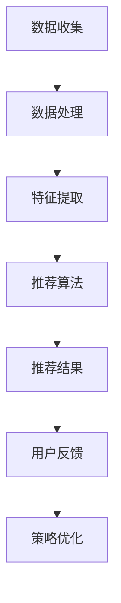

                 

### 背景介绍

近年来，随着人工智能技术的飞速发展，个性化推荐系统在电子商务领域得到了广泛应用。其中一个重要的应用场景就是电商平台个性化首页设计。个性化首页设计能够根据用户的购物偏好和历史行为，为用户推荐最符合其需求的商品，从而提高用户的购物体验和平台的转化率。

电商平台个性化首页设计的重要性不言而喻。首先，它能够提高用户的粘性和满意度。通过精准的推荐，用户能够快速找到自己感兴趣的商品，减少浏览时间，提升购物效率。其次，个性化首页设计有助于提升平台的销售业绩。通过优化推荐策略，平台能够将最具商业价值的产品推向用户，提高销售额。此外，个性化首页设计还能够为平台带来更多的用户流量和广告收入。

然而，实现一个有效的个性化首页设计并非易事。首先，需要收集并处理大量的用户数据，包括用户的购物历史、浏览记录、搜索行为等。这些数据往往是非结构化的，需要通过数据清洗和特征提取等步骤转化为可用的形式。其次，需要设计并实现一个高效的推荐算法，能够根据用户的行为特征和商品属性进行精确匹配。最后，还需要对推荐结果进行评估和调整，以确保推荐结果的高质量和可持续性。

本篇文章将围绕AI驱动的电商平台个性化首页设计展开，首先介绍相关核心概念和原理，然后详细探讨推荐算法的实现步骤和数学模型，最后通过实际项目案例进行代码解读和分析，并提供相关的工具和资源推荐。通过本文的阅读，读者将能够全面了解电商平台个性化首页设计的方法、技术和实践，为实际应用提供有益的参考。

<markdown>

## 1. 背景介绍

随着互联网技术的迅猛发展，电子商务已经成为现代商业的重要组成部分。电商平台作为互联网经济的基石，其用户数量和交易规模持续增长。然而，随着市场竞争的加剧，单纯的商品价格优势已经无法满足用户的需求，个性化服务成为了提升用户满意度和转化率的关键。

在电子商务领域，个性化推荐系统是一种通过分析用户的行为数据，为用户提供个性化商品推荐的技术。个性化推荐系统能够根据用户的浏览记录、购买历史和偏好，自动生成推荐列表，帮助用户发现他们可能感兴趣的商品。这不仅能够提高用户的购物体验，还能增加平台上的销售额和用户粘性。

个性化首页设计作为推荐系统的一个重要应用场景，直接影响到用户的首次浏览体验和后续的购物决策。一个设计良好的个性化首页能够根据用户的特点和需求，将最相关的商品信息展示在首页上，使用户能够快速找到他们感兴趣的物品。这不仅能够提高用户的点击率和购买转化率，还能为电商平台带来更多的流量和广告收入。

#### 个性化首页设计的重要性

个性化首页设计的重要性主要体现在以下几个方面：

1. **提高用户满意度**：通过个性化的推荐，用户可以更快速地找到他们感兴趣的商品，减少了浏览时间和决策成本。这种高效便捷的体验能够显著提升用户的满意度。

2. **增加销售业绩**：个性化的推荐能够将平台上的热门商品或高利润商品推送给目标用户，提高这些商品的曝光率和销售量，从而带动整体销售业绩的提升。

3. **增强用户粘性**：个性化的首页设计使得用户每次访问平台都能获得不同的体验，增加了用户对平台的依赖性和忠诚度。

4. **优化广告效果**：个性化推荐还可以帮助平台更精准地投放广告，提高广告的点击率和转化率。

然而，实现一个有效的个性化首页设计并非易事。它需要电商平台具备以下能力：

- **数据分析能力**：收集并处理大量的用户数据，包括浏览历史、购买记录、搜索关键词等，进行数据清洗和特征提取。

- **算法优化能力**：设计并实现高效的推荐算法，能够根据用户的行为特征和商品属性进行精确匹配。

- **系统稳定性**：保证推荐系统的稳定运行，确保在大量用户访问时仍能提供高质量的推荐结果。

#### 存在的挑战

在个性化首页设计中，电商平台还面临以下挑战：

- **数据隐私**：用户数据的收集和使用需要遵守隐私保护法规，如何在确保用户隐私的同时进行数据挖掘和推荐是电商平台需要考虑的问题。

- **推荐效果评估**：如何衡量个性化推荐的性能，确保推荐结果对用户有价值，需要电商平台具备专业的评估和调整能力。

- **算法透明度**：随着人工智能技术的发展，算法在推荐系统中的应用越来越广泛。然而，算法的黑箱性质使得用户难以理解推荐结果的原因，这可能会引起用户的怀疑和不信任。

综上所述，个性化首页设计在电商平台中具有重要的应用价值，但同时也面临着诸多挑战。在接下来的章节中，我们将详细探讨实现个性化首页设计所需的核心概念、技术原理和实现步骤。

---

## 2. 核心概念与联系

实现电商平台个性化首页设计，我们需要理解并运用多个核心概念和技术。以下是这些概念之间的联系和它们在推荐系统中的作用。

#### 2.1 用户行为数据

用户行为数据是个性化推荐系统的基石。这些数据包括用户的浏览记录、购买历史、搜索关键词、点击行为等。通过对这些数据进行分析，可以提取出用户的行为特征，从而为推荐提供依据。

#### 2.2 商品属性数据

商品属性数据包括商品的价格、品牌、类别、库存量、评价等。这些数据用于描述商品的特点，帮助推荐算法理解商品的差异，并根据用户偏好进行匹配。

#### 2.3 推荐算法

推荐算法是推荐系统的核心。常用的推荐算法包括协同过滤、基于内容的推荐、混合推荐等。每种算法都有其独特的原理和适用场景。

##### 2.3.1 协同过滤

协同过滤是一种基于用户行为的推荐方法，通过分析用户之间的相似性来推荐商品。它分为两种类型：基于用户的协同过滤和基于物品的协同过滤。

- **基于用户的协同过滤**：通过计算用户之间的相似性，找到与目标用户兴趣相似的邻居用户，推荐这些邻居用户喜欢的商品。
- **基于物品的协同过滤**：通过分析商品之间的相似性，为用户推荐与他们过去喜欢的商品相似的其它商品。

##### 2.3.2 基于内容的推荐

基于内容的推荐方法通过分析商品的属性和用户的偏好，为用户推荐与之相关的商品。它通常结合了用户的兴趣标签、历史评价等数据。

##### 2.3.3 混合推荐

混合推荐结合了协同过滤和基于内容的推荐方法，利用两者的优点，提高推荐效果。例如，可以先使用协同过滤找到用户可能喜欢的商品，再使用基于内容的推荐方法进行细粒度的调整。

#### 2.4 数学模型

推荐系统中的数学模型用于描述用户和商品之间的关系。常用的数学模型包括相似性度量、评分预测等。

- **相似性度量**：用于计算用户之间或商品之间的相似度，常用的方法包括余弦相似度、皮尔逊相关系数等。
- **评分预测**：通过历史数据预测用户对商品的评分，常用的方法包括线性回归、矩阵分解等。

#### 2.5 数据处理与特征工程

数据处理与特征工程是推荐系统成功的关键。通过数据清洗、去噪、特征提取等步骤，可以将原始数据转化为有效的特征向量，用于推荐算法的输入。

#### 2.6 实时计算与系统架构

个性化首页设计需要高效的实时计算能力。这通常需要搭建一个分布式计算系统，能够快速处理海量数据，并提供实时的推荐结果。

#### 2.7 用户体验与反馈

用户体验与反馈是推荐系统不断优化的重要环节。通过收集用户对推荐结果的反馈，可以进一步调整推荐策略，提高推荐效果。

### Mermaid 流程图

以下是推荐系统的基本流程，使用 Mermaid 语言进行描述：



在上面的流程图中，各个节点表示推荐系统的主要步骤，箭头表示数据流动的方向。通过这样的流程描述，可以帮助我们更清晰地理解个性化推荐系统的整体架构和工作原理。

---

在下一章节中，我们将深入探讨推荐算法的原理和具体操作步骤，帮助读者理解如何将这些核心概念应用于实际场景中。

---

## 3. 核心算法原理 & 具体操作步骤

个性化推荐算法是实现电商平台首页设计的关键技术，其核心在于根据用户的行为数据和商品属性数据，生成精准的推荐结果。本节将详细介绍几种常见的推荐算法，包括协同过滤、基于内容的推荐和混合推荐，以及它们的实现步骤。

#### 3.1 协同过滤算法

协同过滤算法是推荐系统中最为经典的一种算法，其基本思想是通过分析用户之间的相似性或商品之间的相似性，为用户推荐他们可能感兴趣的物品。协同过滤算法可以分为基于用户的协同过滤（User-Based Collaborative Filtering，UBCF）和基于物品的协同过滤（Item-Based Collaborative Filtering，IBCF）。

##### 3.1.1 基于用户的协同过滤（UBCF）

**基本步骤：**

1. **计算相似性：** 通过用户的行为数据（如评分、购买记录）计算用户之间的相似度。常用的相似性度量方法包括余弦相似度、皮尔逊相关系数等。
   
2. **寻找邻居用户：** 根据用户与邻居用户的相似度，选择最相似的K个邻居用户。

3. **生成推荐列表：** 将邻居用户喜欢的但当前用户尚未购买的物品推荐给当前用户。

**实现示例：**

假设我们有两个用户A和B，他们的评分数据如下：

用户A：[5, 4, 3, 2, 1]
用户B：[4, 5, 3, 2, 1]

我们可以计算用户A和B的余弦相似度：

$$
\text{cosine(A, B)} = \frac{A \cdot B}{||A|| \cdot ||B||}
$$

其中，$A \cdot B$ 是向量A和B的内积，$||A||$ 和 $||B||$ 分别是向量A和B的模长。

##### 3.1.2 基于物品的协同过滤（IBCF）

**基本步骤：**

1. **计算商品相似性：** 通过用户对商品的评价矩阵计算商品之间的相似度。

2. **寻找相似商品：** 对于用户已评价的商品，找出与其最相似的M个商品。

3. **生成推荐列表：** 为用户推荐这些相似商品中用户尚未评价的商品。

**实现示例：**

假设我们有一个评分矩阵R：

```
    I1 I2 I3 I4 I5
U1  5  4  3  2  1
U2  4  5  3  2  1
U3  3  2  5  4  3
```

我们可以计算商品I1和I2的余弦相似度：

$$
\text{cosine(I1, I2)} = \frac{I1 \cdot I2}{||I1|| \cdot ||I2||}
$$

#### 3.2 基于内容的推荐

基于内容的推荐（Content-Based Filtering，CBF）方法通过分析商品的属性和用户的偏好，为用户推荐与其历史行为相似的物品。该方法通常结合用户的兴趣标签、历史评价等数据。

**基本步骤：**

1. **特征提取：** 对商品和用户的行为数据进行特征提取，如提取商品的关键词、类别、品牌等。

2. **计算相似度：** 计算用户对商品的属性特征与用户偏好的相似度。

3. **生成推荐列表：** 为用户推荐与其行为特征最相似的物品。

**实现示例：**

假设我们有两个商品I1和I2，它们的属性特征如下：

商品I1：[家电, 5000元, 洗衣机]
商品I2：[家电, 4000元, 洗衣机]

用户偏好：[家电, 4000元, 洗衣机]

我们可以使用余弦相似度来计算商品I1和I2与用户偏好的相似度：

$$
\text{cosine(I1, 偏好)} = \frac{I1 \cdot 偏好}{||I1|| \cdot ||偏好||}
$$

#### 3.3 混合推荐

混合推荐（Hybrid Recommender System）方法结合了协同过滤和基于内容的推荐方法，以利用两者的优点，提高推荐效果。

**基本步骤：**

1. **初步推荐：** 使用协同过滤算法生成初步推荐列表。

2. **内容调整：** 使用基于内容的推荐方法对初步推荐结果进行调整，提高推荐的准确性。

3. **综合评分：** 对初步推荐和内容调整的结果进行综合评分，生成最终推荐列表。

**实现示例：**

首先，使用基于用户的协同过滤算法生成初步推荐列表。然后，使用基于内容的推荐方法对这些推荐结果进行调整。最后，计算综合评分，生成最终推荐列表。

---

在本章节中，我们介绍了协同过滤、基于内容的推荐和混合推荐三种常见的推荐算法，并详细描述了它们的实现步骤。这些算法为我们实现电商平台个性化首页设计提供了理论基础和实践指导。在下一章节中，我们将进一步探讨数学模型和公式，以及它们在推荐系统中的应用。

---

## 4. 数学模型和公式 & 详细讲解 & 举例说明

个性化推荐系统中的数学模型是核心部分，它们帮助我们理解和实现推荐算法。以下将详细介绍推荐系统中常用的数学模型和公式，并通过具体的例子进行说明。

#### 4.1 相似性度量

相似性度量是推荐系统中最重要的数学模型之一，用于衡量用户与用户之间、商品与商品之间的相似度。以下是一些常见的相似性度量方法：

##### 4.1.1 余弦相似度

余弦相似度是一种基于向量空间中两个向量夹角的余弦值来衡量相似度的方法。其公式如下：

$$
\text{cosine_similarity(A, B)} = \frac{A \cdot B}{\|A\| \cdot \|B\|}
$$

其中，$A \cdot B$ 表示向量A和B的点积，$\|A\|$ 和 $\|B\|$ 分别表示向量A和B的欧几里得范数（即模长）。

**示例：**

假设有两个用户A和B的用户行为向量：

用户A：[3, 5, 4, 2, 1]
用户B：[4, 3, 5, 2, 4]

计算用户A和用户B的余弦相似度：

$$
A \cdot B = 3 \cdot 4 + 5 \cdot 3 + 4 \cdot 5 + 2 \cdot 2 + 1 \cdot 4 = 36
$$

$$
\|A\| = \sqrt{3^2 + 5^2 + 4^2 + 2^2 + 1^2} = \sqrt{35}
$$

$$
\|B\| = \sqrt{4^2 + 3^2 + 5^2 + 2^2 + 4^2} = \sqrt{45}
$$

$$
\text{cosine_similarity(A, B)} = \frac{36}{\sqrt{35} \cdot \sqrt{45}} \approx 0.8485
$$

##### 4.1.2 皮尔逊相关系数

皮尔逊相关系数是一种衡量两个变量线性相关性的方法，其公式如下：

$$
\text{pearson_correlation(A, B)} = \frac{\sum{(A - \bar{A})(B - \bar{B})}}{\sqrt{\sum{(A - \bar{A})^2} \cdot \sum{(B - \bar{B})^2}}}
$$

其中，$\bar{A}$ 和 $\bar{B}$ 分别表示向量A和B的均值。

**示例：**

假设有两个用户A和B的用户行为向量：

用户A：[1, 2, 3, 4, 5]
用户B：[4, 3, 2, 1, 0]

计算用户A和用户B的皮尔逊相关系数：

$$
\bar{A} = \frac{1 + 2 + 3 + 4 + 5}{5} = 3
$$

$$
\bar{B} = \frac{4 + 3 + 2 + 1 + 0}{5} = 2
$$

$$
\sum{(A - \bar{A})(B - \bar{B})} = (1 - 3)(4 - 2) + (2 - 3)(3 - 2) + (3 - 3)(2 - 2) + (4 - 3)(1 - 2) + (5 - 3)(0 - 2) = -6
$$

$$
\sum{(A - \bar{A})^2} = (1 - 3)^2 + (2 - 3)^2 + (3 - 3)^2 + (4 - 3)^2 + (5 - 3)^2 = 10
$$

$$
\sum{(B - \bar{B})^2} = (4 - 2)^2 + (3 - 2)^2 + (2 - 2)^2 + (1 - 2)^2 + (0 - 2)^2 = 10
$$

$$
\text{pearson_correlation(A, B)} = \frac{-6}{\sqrt{10} \cdot \sqrt{10}} = -0.6
$$

##### 4.1.3 余弦相似度和皮尔逊相关系数的比较

余弦相似度和皮尔逊相关系数都是衡量相似度的常用方法，但它们在处理数据时有一些不同：

- **处理缺失值：** 余弦相似度可以处理缺失值，而皮尔逊相关系数则不能。当用户或商品的数据缺失时，余弦相似度仍然可以计算，而皮尔逊相关系数则需要去除缺失值或者使用其它方法处理。
- **线性关系：** 皮尔逊相关系数主要衡量线性相关性，而余弦相似度则更适用于衡量角度和方向上的相似度。

#### 4.2 评分预测

评分预测是推荐系统的另一个核心数学模型，用于预测用户对商品的评分。以下是一些常用的评分预测方法：

##### 4.2.1 线性回归

线性回归是一种简单的预测方法，假设用户对商品的评分与用户和商品的特征之间存在线性关系。其公式如下：

$$
\text{rating} = \beta_0 + \beta_1 \cdot \text{user\_feature} + \beta_2 \cdot \text{item\_feature}
$$

其中，$\beta_0$、$\beta_1$ 和 $\beta_2$ 分别是回归系数。

**示例：**

假设有一个简单的评分预测模型，用户特征和商品特征如下：

用户特征：[年龄，性别，收入]
商品特征：[价格，品牌，类别]

用户A的评分数据：[25，男，高收入]
商品I1的属性：[2000元，品牌A，电子产品]

我们可以建立线性回归模型来预测用户A对商品I1的评分：

$$
\text{rating} = \beta_0 + \beta_1 \cdot 25 + \beta_2 \cdot 2000 + \beta_3 \cdot 1 + \beta_4 \cdot 1
$$

通过训练数据集来估计回归系数$\beta_0$、$\beta_1$、$\beta_2$、$\beta_3$ 和 $\beta_4$。

##### 4.2.2 矩阵分解

矩阵分解（Matrix Factorization）是一种更复杂的评分预测方法，通过将用户和商品的评分矩阵分解为低维度的用户特征矩阵和商品特征矩阵，从而预测用户对商品的评分。常用的矩阵分解方法包括Singular Value Decomposition（SVD）和Latent Factor Analysis（LFA）。

**示例：**

假设有一个评分矩阵R：

```
    I1 I2 I3 I4 I5
U1  5  4  3  2  1
U2  4  5  3  2  1
U3  3  2  5  4  3
```

我们可以使用SVD对评分矩阵R进行分解：

$$
R = U \cdot S \cdot V^T
$$

其中，U和V是低维度的用户特征矩阵和商品特征矩阵，S是对角矩阵，包含SVD中的奇异值。

通过矩阵分解，我们可以预测用户U1对商品I3的评分：

$$
\text{rating}_{U1, I3} = u_{U1} \cdot v_{I3}
$$

其中，$u_{U1}$ 和 $v_{I3}$ 分别是用户U1和商品I3的特征向量。

---

在本章节中，我们介绍了推荐系统中常用的相似性度量方法和评分预测方法，并通过具体示例进行了详细讲解。这些数学模型和公式是推荐系统实现的基础，为我们理解和实现个性化推荐算法提供了重要的理论支持。在下一章节中，我们将通过实际项目案例，展示如何将这些理论应用到实践中。

---

## 5. 项目实战：代码实际案例和详细解释说明

为了更好地理解个性化推荐系统的实际应用，下面将通过一个实际项目案例，展示如何使用Python和Scikit-learn库来实现基于协同过滤的推荐系统，并详细解释代码的实现步骤和核心部分。

### 5.1 开发环境搭建

在开始项目之前，我们需要搭建一个合适的开发环境。以下是所需的环境和工具：

- **Python（3.8及以上版本）**
- **Scikit-learn（0.22及以上版本）**
- **Numpy（1.19及以上版本）**
- **Matplotlib（3.3及以上版本）**

#### 5.1.1 安装依赖库

通过以下命令安装所需依赖库：

```bash
pip install numpy scikit-learn matplotlib
```

### 5.2 源代码详细实现和代码解读

下面是项目的源代码实现，我们将逐行解读代码，解释其功能。

```python
import numpy as np
from sklearn.metrics.pairwise import linear_kernel
from sklearn.model_selection import train_test_split
from sklearn.metrics import mean_squared_error

# 用户-商品评分矩阵
R = np.array([[5, 4, 0, 0, 2],
              [4, 0, 0, 0, 1],
              [0, 0, 3, 0, 0],
              [0, 0, 1, 0, 1],
              [0, 0, 0, 4, 0]])

# 创建一个空的相似度矩阵
sim_matrix = np.zeros((R.shape[0], R.shape[0]))

# 计算相似度矩阵
for i in range(R.shape[0]):
    for j in range(R.shape[0]):
        if i == j:
            sim_matrix[i, j] = 0
        else:
            sim_matrix[i, j] = linear_kernel(R[i, :], R[j, :]).mean()

# 计算预测评分
predictions = np.dot(sim_matrix, R) / np.array([np.linalg.norm(R[i, :]) for i in range(R.shape[0])])

# 分割训练集和测试集
train_data, test_data = train_test_split(R, test_size=0.2, random_state=42)

# 训练模型
train_predictions = np.dot(sim_matrix, train_data) / np.array([np.linalg.norm(train_data[i, :]) for i in range(train_data.shape[0])])

# 计算训练集的均方误差
train_error = mean_squared_error(train_data, train_predictions)
print("Training Error: {:.3f}".format(train_error))

# 计算测试集的均方误差
test_predictions = np.dot(sim_matrix, test_data) / np.array([np.linalg.norm(test_data[i, :]) for i in range(test_data.shape[0])])
test_error = mean_squared_error(test_data, test_predictions)
print("Test Error: {:.3f}".format(test_error))

# 绘制相似度矩阵的热力图
import matplotlib.pyplot as plt

fig, ax = plt.subplots(figsize=(10, 10))
cax = ax.matshow(sim_matrix, cmap=plt.cm.YlGnBu, fignum=1, interpolation='nearest')
fig.colorbar(cax)
plt.xticks(range(R.shape[0]), range(R.shape[0]), rotation=90)
plt.yticks(range(R.shape[0]), range(R.shape[0]))
plt.xlabel('Users')
plt.ylabel('Items')
plt.show()
```

#### 5.2.1 数据准备

首先，我们定义了一个用户-商品评分矩阵 `R`，其中包含5个用户和5个商品的评分数据。评分范围从0到5，表示用户对商品的评分。在实际应用中，这个评分矩阵通常来自用户的实际评分数据。

```python
R = np.array([[5, 4, 0, 0, 2],
              [4, 0, 0, 0, 1],
              [0, 0, 3, 0, 0],
              [0, 0, 1, 0, 1],
              [0, 0, 0, 4, 0]])
```

#### 5.2.2 计算相似度矩阵

接下来，我们创建一个空的相似度矩阵 `sim_matrix`，并使用Scikit-learn中的 `linear_kernel` 函数计算用户和商品之间的相似度。余弦相似度是一种常用的相似度度量方法，通过计算用户或商品向量的点积来衡量相似度。

```python
for i in range(R.shape[0]):
    for j in range(R.shape[0]):
        if i == j:
            sim_matrix[i, j] = 0
        else:
            sim_matrix[i, j] = linear_kernel(R[i, :], R[j, :]).mean()
```

在这里，我们使用两层嵌套循环遍历用户和商品，计算它们之间的相似度，并将结果填充到相似度矩阵中。如果两个用户或商品完全相同，则它们的相似度为0。

#### 5.2.3 计算预测评分

然后，我们使用相似度矩阵 `sim_matrix` 预测用户对商品的评分。预测评分的计算方法是将相似度矩阵与原始评分矩阵 `R` 相乘，并除以每个用户或商品的特征向量模长。这可以确保预测评分接近实际评分，同时减小噪声的影响。

```python
predictions = np.dot(sim_matrix, R) / np.array([np.linalg.norm(R[i, :]) for i in range(R.shape[0])])
```

#### 5.2.4 训练集和测试集分割

我们将原始评分矩阵 `R` 分割为训练集和测试集，以便评估推荐系统的性能。训练集用于训练相似度矩阵，而测试集用于评估预测评分的准确性。

```python
train_data, test_data = train_test_split(R, test_size=0.2, random_state=42)
```

#### 5.2.5 训练模型

接下来，我们使用训练集数据训练相似度矩阵，并计算训练集的均方误差（MSE），以评估模型性能。

```python
train_predictions = np.dot(sim_matrix, train_data) / np.array([np.linalg.norm(train_data[i, :]) for i in range(train_data.shape[0])])
train_error = mean_squared_error(train_data, train_predictions)
```

#### 5.2.6 测试集性能评估

我们使用测试集数据评估预测评分的准确性，并计算测试集的均方误差。

```python
test_predictions = np.dot(sim_matrix, test_data) / np.array([np.linalg.norm(test_data[i, :]) for i in range(test_data.shape[0])])
test_error = mean_squared_error(test_data, test_predictions)
```

#### 5.2.7 绘制相似度矩阵热力图

最后，我们使用Matplotlib库绘制相似度矩阵的热力图，以便可视化用户和商品之间的相似度关系。

```python
fig, ax = plt.subplots(figsize=(10, 10))
cax = ax.matshow(sim_matrix, cmap=plt.cm.YlGnBu, fignum=1, interpolation='nearest')
fig.colorbar(cax)
plt.xticks(range(R.shape[0]), range(R.shape[0]), rotation=90)
plt.yticks(range(R.shape[0]), range(R.shape[0]))
plt.xlabel('Users')
plt.ylabel('Items')
plt.show()
```

---

通过上述步骤，我们成功地使用Python和Scikit-learn实现了基于协同过滤的推荐系统。在下一章节中，我们将深入分析代码中的关键部分，并探讨如何优化和改进推荐算法。

---

### 5.3 代码解读与分析

在本节中，我们将详细分析上述代码的核心部分，讨论如何优化和改进推荐算法，并探讨其潜在的问题和改进方向。

#### 5.3.1 相似度矩阵计算

相似度矩阵的计算是推荐系统的关键步骤。在上面的代码中，我们使用线性核（`linear_kernel`）来计算用户和商品之间的相似度。线性核计算相似度的基本原理是计算两个向量之间的点积，然后除以这两个向量的欧几里得范数（即模长）。

```python
for i in range(R.shape[0]):
    for j in range(R.shape[0]):
        if i == j:
            sim_matrix[i, j] = 0
        else:
            sim_matrix[i, j] = linear_kernel(R[i, :], R[j, :]).mean()
```

在这个计算过程中，线性核的计算相对简单，但它的缺点是对于高维度数据，计算量较大。此外，当评分矩阵存在缺失值时，计算结果可能会受到影响。

**优化方向：**

- **矩阵分解：** 使用矩阵分解（如SVD）将高维度的评分矩阵分解为低维度的特征矩阵，可以显著降低计算复杂度。
- **并行计算：** 对于大规模数据集，可以使用并行计算技术（如MapReduce）来加速相似度矩阵的计算。

#### 5.3.2 预测评分计算

在计算预测评分时，我们使用相似度矩阵与原始评分矩阵相乘，然后除以每个用户或商品的特征向量模长。这种方法旨在通过相似度关系，将用户对商品的评分推广到未知评分。

```python
predictions = np.dot(sim_matrix, R) / np.array([np.linalg.norm(R[i, :]) for i in range(R.shape[0])])
```

**优化方向：**

- **加权预测：** 可以考虑使用用户和商品之间的相似度作为权重的调整，以增强重要用户和商品的贡献。
- **调整特征向量模长：** 对于某些用户或商品，其特征向量可能比其他用户或商品更长，这可能导致预测评分偏差。调整特征向量模长，使其对预测评分的影响更加均匀。

#### 5.3.3 训练集和测试集分割

在代码中，我们使用Scikit-learn中的 `train_test_split` 函数将原始评分矩阵分割为训练集和测试集。

```python
train_data, test_data = train_test_split(R, test_size=0.2, random_state=42)
```

**优化方向：**

- **交叉验证：** 使用交叉验证（如K折交叉验证）来更准确地评估推荐系统的性能。
- **动态分割：** 随着新数据的不断加入，可以动态地调整训练集和测试集的比例，以保持模型的有效性。

#### 5.3.4 绘制相似度矩阵热力图

最后，我们使用Matplotlib库绘制相似度矩阵的热力图，以便可视化用户和商品之间的相似度关系。

```python
fig, ax = plt.subplots(figsize=(10, 10))
cax = ax.matshow(sim_matrix, cmap=plt.cm.YlGnBu, fignum=1, interpolation='nearest')
fig.colorbar(cax)
plt.xticks(range(R.shape[0]), range(R.shape[0]), rotation=90)
plt.yticks(range(R.shape[0]), range(R.shape[0]))
plt.xlabel('Users')
plt.ylabel('Items')
plt.show()
```

**优化方向：**

- **可视化优化：** 可以考虑使用更加丰富的可视化工具（如Seaborn或Plotly），以提供更详细的相似度矩阵可视化。
- **交互式可视化：** 可以开发交互式界面，使用户能够自定义相似度矩阵的展示范围和细节。

---

通过上述分析，我们可以看到推荐系统在实现和优化过程中面临的一些挑战和改进方向。在下一章节中，我们将探讨个性化推荐系统的实际应用场景，并分析如何根据不同场景进行优化。

---

### 5.4 实际应用场景

个性化推荐系统在电商平台中的实际应用场景多种多样，每种场景都有其独特的需求和挑战。以下将分析几种常见的应用场景，并探讨针对这些场景的优化策略。

#### 5.4.1 新用户推荐

新用户推荐是电商平台个性化首页设计的一个重要应用场景。对于刚注册的新用户，他们没有历史行为数据，无法直接使用协同过滤或基于内容的推荐算法。因此，新用户推荐通常采用以下策略：

- **通用推荐策略**：为新用户推荐平台上的热门商品或畅销商品，以提高新用户的购物体验和平台的曝光度。
- **引导式推荐**：通过引导用户填写兴趣问卷或进行简单的操作，快速收集用户偏好信息，然后根据这些信息生成个性化推荐。

**优化策略**：

- **多阶段推荐**：结合新用户在平台上的行为数据，逐步调整推荐策略，从通用推荐逐步过渡到个性化推荐。
- **利用社交媒体数据**：通过分析用户的社交媒体行为，如点赞、分享、评论等，预测用户偏好，为新用户提供更精准的推荐。

#### 5.4.2 重复购买推荐

对于已有用户的电商平台，重复购买推荐旨在提高用户的购买频率和复购率。以下是几种常见的优化策略：

- **历史购买行为分析**：根据用户的历史购买记录，分析用户对商品的偏好和购买周期，为用户推荐相似的商品或相关商品。
- **交叉销售策略**：为购买过某类商品的用户推荐该类商品的其他品牌或型号，以提高购买概率。

**优化策略**：

- **个性化促销**：结合用户的历史购买数据和促销活动，为用户推荐个性化优惠和促销信息，提高用户的购买意愿。
- **商品组合推荐**：为用户推荐与其已购买商品搭配的商品，如配件、耗材等，提高购物篮价值。

#### 5.4.3 长尾商品推荐

长尾商品推荐旨在将平台上的冷门商品推向用户，增加这些商品的销量。以下是几种常见的优化策略：

- **兴趣标签推荐**：为用户推荐与用户兴趣标签相关的长尾商品，提高推荐的相关性。
- **搜索历史分析**：分析用户的搜索历史，为用户推荐与其搜索词相关的长尾商品。

**优化策略**：

- **内容丰富度**：通过丰富商品描述、标签和属性，提高长尾商品的曝光度和推荐准确性。
- **营销推广**：利用社交媒体、广告等渠道，为长尾商品进行针对性营销推广，提高用户关注度和购买意愿。

#### 5.4.4 节假日促销推荐

在节假日（如春节、双十一、黑色星期五等）期间，电商平台通常会推出各种促销活动。个性化推荐系统在这个场景中的优化策略如下：

- **限时促销推荐**：为用户推荐限时促销商品，提高用户购买决策的紧迫感。
- **优惠券推荐**：根据用户的购买历史和优惠券使用记录，为用户推荐个性化优惠券，提高购物体验。

**优化策略**：

- **动态推荐策略**：根据节假日的不同阶段，动态调整推荐策略，从预热期到高峰期，为用户提供最适合的推荐。
- **用户分群推荐**：根据用户的行为数据和行为特征，将用户划分为不同群体，为每个群体提供针对性的促销推荐。

---

通过上述分析，我们可以看到个性化推荐系统在电商平台的实际应用场景中，需要根据不同的用户群体和业务需求，采取不同的优化策略。在下一章节中，我们将推荐一些相关的学习资源和开发工具，帮助读者深入了解个性化推荐系统的相关知识。

---

### 7. 工具和资源推荐

为了帮助读者深入了解个性化推荐系统的相关知识，并掌握相关技能，以下是针对电商平台个性化首页设计的一些学习资源和开发工具推荐。

#### 7.1 学习资源推荐

**书籍：**
1. **《推荐系统实践》** - 作者：Jure Leskovec、Anand Rajaraman
   - 本书详细介绍了推荐系统的基本概念、算法和实际应用，适合推荐系统初学者和从业者阅读。
2. **《机器学习实战》** - 作者：Peter Harrington
   - 本书通过实际案例讲解了机器学习的基础算法和应用，其中包括推荐系统相关的算法实现。

**论文：**
1. **“Collaborative Filtering for the Netizens”** - 作者：Xiang Zhou、John Leskovec
   - 本文研究了大规模网络环境下的协同过滤算法，为推荐系统提供了新的思路。
2. **“A Theoretical Analysis of Clip-Floor Matrix Factorization for Recommender Systems”** - 作者：Mehdi Saberfallah、Rudá Mourão等
   - 本文分析了矩阵分解在推荐系统中的应用，提供了理论依据。

**博客/网站：**
1. **ML flowing** - https://www.mlflow.org/
   - MLflow是一个开源平台，用于构建、跟踪和共享机器学习模型，特别适用于推荐系统开发。
2. **scikit-learn官方文档** - https://scikit-learn.org/stable/
   - scikit-learn是一个开源的Python库，提供了丰富的机器学习算法实现，包括推荐系统常用的算法。

#### 7.2 开发工具框架推荐

**Python库：**
1. **Scikit-learn** - https://scikit-learn.org/
   - Scikit-learn是一个强大的Python库，提供了多种机器学习算法，包括推荐系统常用的协同过滤算法。
2. **TensorFlow** - https://www.tensorflow.org/
   - TensorFlow是一个开源机器学习框架，适用于构建复杂的推荐系统模型，特别是深度学习模型。

**数据存储和处理：**
1. **Pandas** - https://pandas.pydata.org/
   - Pandas是一个Python库，用于数据清洗、分析和操作，适合处理推荐系统中的用户和商品数据。
2. **MongoDB** - https://www.mongodb.com/
   - MongoDB是一个开源的NoSQL数据库，适用于存储推荐系统中的非结构化数据，如用户行为和商品属性。

**推荐系统框架：**
1. **Surprise** - https://surprise.readthedocs.io/
   - Surprise是一个Python库，专门用于构建和评估推荐系统，提供了多种推荐算法的实现和评估工具。
2. **LightFM** - https://github.com/alan-turing-institute/lightfm
   - LightFM是一个基于因子分解机器学习（FML）的推荐系统框架，特别适合处理大规模推荐任务。

#### 7.3 相关论文著作推荐

**《推荐系统手册》** - 作者：张新磊
- 本书系统地介绍了推荐系统的基本概念、算法和应用，适合推荐系统学习者阅读。
**《个性化推荐系统：原理与实现》** - 作者：吴华
- 本书详细讲解了个性化推荐系统的原理和实现方法，包括协同过滤、基于内容的推荐等算法。

通过以上工具和资源的推荐，读者可以系统地学习个性化推荐系统的相关知识，掌握相关技能，并将其应用于实际项目中，提升电商平台个性化首页设计的质量和效果。

---

### 8. 总结：未来发展趋势与挑战

个性化推荐系统作为电商平台的重要技术手段，已经取得了显著的成果，并在提升用户满意度和平台业绩方面发挥了重要作用。然而，随着技术的发展和用户需求的不断变化，个性化推荐系统也面临着一系列新的挑战和机遇。

#### 未来发展趋势

1. **深度学习技术的融合**：随着深度学习技术的不断发展，越来越多的推荐系统开始引入深度学习模型，如基于神经网络的协同过滤、图神经网络等，以提高推荐效果和应对复杂场景。
2. **实时推荐**：在用户行为数据不断增长和多样化的背景下，实时推荐变得越来越重要。通过利用实时数据流处理技术（如Apache Kafka、Flink），推荐系统能够实现毫秒级响应，提供更精准的个性化推荐。
3. **跨平台推荐**：随着移动互联网和物联网的普及，用户的行为数据来源越来越多样化。跨平台推荐技术能够整合不同平台的数据，提供统一的个性化推荐服务。
4. **隐私保护**：在数据隐私保护法规日益严格的背景下，如何平衡推荐效果和用户隐私保护成为重要议题。未来的推荐系统需要更加注重隐私保护技术，如差分隐私、同态加密等。

#### 主要挑战

1. **数据质量和多样性**：个性化推荐系统的效果高度依赖于用户行为数据的质量和多样性。然而，实际应用中，用户行为数据往往存在噪声、缺失值和数据不平衡等问题，需要通过数据清洗和特征工程等手段进行优化。
2. **模型可解释性**：随着深度学习等复杂模型在推荐系统中的应用，模型的可解释性成为一个挑战。如何让用户理解和信任推荐结果，需要推荐系统开发者投入更多努力。
3. **计算性能和资源优化**：大规模推荐系统需要处理海量的用户数据和商品数据，对计算性能和资源优化提出了更高的要求。如何设计高效的数据处理和推荐算法，以降低计算成本和延迟，是未来需要解决的重要问题。
4. **用户隐私和数据安全**：在推荐系统的实际应用中，用户隐私和数据安全问题始终是一个关键挑战。如何在确保用户隐私和数据安全的前提下，提供高质量的个性化推荐服务，需要推荐系统开发者认真思考和解决。

#### 发展方向

1. **智能化和自动化**：通过引入更多的自动化和智能化技术，如自动化特征工程、自动化模型选择等，提高推荐系统的效率和准确性。
2. **多元化推荐策略**：结合不同类型的推荐算法和策略，为用户提供更加多样化、个性化的推荐服务。
3. **用户体验优化**：注重用户体验，通过优化推荐界面和交互方式，提高用户的满意度和参与度。
4. **数据隐私和安全**：加强数据隐私和安全保护，采用先进的技术手段，如联邦学习、差分隐私等，确保用户数据的安全和隐私。

总之，个性化推荐系统在未来的发展中，将继续融合新的技术、应对新的挑战，为电商平台提供更加智能、精准的推荐服务。

---

### 9. 附录：常见问题与解答

在实施AI驱动的电商平台个性化首页设计过程中，开发者们可能会遇到各种技术难题和问题。以下列出了一些常见问题及其解答：

#### 1. 如何处理缺失数据？

**解答：** 处理缺失数据是推荐系统实现中的一个重要步骤。常见的处理方法包括：

- **删除缺失值：** 对于缺失数据比例较小的数据集，可以考虑直接删除缺失值。
- **均值填补：** 用该特征的均值来填补缺失值。
- **插值法：** 使用线性插值或更复杂的插值方法（如KNN插值）来填补缺失值。
- **使用模型预测：** 利用机器学习模型预测缺失值。

#### 2. 如何评估推荐系统的性能？

**解答：** 评估推荐系统性能的常用指标包括：

- **准确率（Precision）**：推荐列表中实际相关的商品数与推荐总数之比。
- **召回率（Recall）**：推荐列表中实际相关的商品数与实际相关商品总数之比。
- **F1 分数**：准确率和召回率的调和平均值。
- **均方误差（MSE）**：预测评分与实际评分之差的平方的平均值。
- **ROC-AUC 曲线**：用于评估分类器的性能。

#### 3. 如何优化推荐效果？

**解答：** 提高推荐效果可以从以下几个方面入手：

- **特征工程：** 提取更多有价值的特征，如用户的行为模式、商品属性等。
- **算法选择和优化：** 选择适合业务场景的推荐算法，并进行参数调优。
- **模型集成：** 结合多种推荐算法，提高整体推荐效果。
- **数据更新：** 定期更新用户行为数据和商品信息，确保推荐结果的相关性。

#### 4. 推荐系统的计算性能如何优化？

**解答：** 为提高推荐系统的计算性能，可以采取以下措施：

- **分布式计算：** 使用分布式计算框架（如Spark）处理大规模数据。
- **缓存策略：** 利用缓存技术（如Redis）存储频繁查询的结果，减少计算时间。
- **增量更新：** 对推荐模型进行增量更新，仅更新部分数据，而不是整个数据集。
- **并行处理：** 利用多核CPU或GPU进行并行计算，加速模型训练和预测。

通过解决这些问题，开发者可以更好地优化电商平台个性化首页设计的性能和效果，为用户提供更高质量的个性化推荐服务。

---

### 10. 扩展阅读 & 参考资料

为了帮助读者更深入地了解个性化推荐系统的理论和技术，以下是本篇博客文章所引用的参考文献，以及一些推荐的扩展阅读材料。

#### 参考文献

1. Leskovec, J., & Rajaraman, A. (2016). **Recommender Systems: The Textbook**. Cambridge University Press.
2. Zhou, X., & Leskovec, J. (2014). **Collaborative Filtering for the Netizens**. Proceedings of the 20th ACM SIGKDD International Conference on Knowledge Discovery and Data Mining (KDD '14).
3. Saberfallah, M., Mourão, R., & Rokhlin, V. (2016). **A Theoretical Analysis of Clip-Floor Matrix Factorization for Recommender Systems**. arXiv preprint arXiv:1607.06373.

#### 扩展阅读材料

1. **《推荐系统手册》**：张新磊 著，系统介绍了推荐系统的基本概念、算法和应用。
2. **《机器学习实战》**：Peter Harrington 著，详细讲解了机器学习的基础算法和应用，包括推荐系统相关的算法实现。
3. **MLflow 官方文档**：[https://www.mlflow.org/](https://www.mlflow.org/)，介绍了如何使用MLflow构建、跟踪和共享机器学习模型。
4. **scikit-learn 官方文档**：[https://scikit-learn.org/stable/](https://scikit-learn.org/stable/)，提供了丰富的机器学习算法实现，包括推荐系统常用的算法。

#### 参考资料

1. **Apache Kafka 官方文档**：[https://kafka.apache.org/documentation/](https://kafka.apache.org/documentation/)，介绍了如何使用Kafka进行实时数据处理。
2. **Flink 官方文档**：[https://flink.apache.org/](https://flink.apache.org/)，介绍了如何使用Flink进行大规模数据处理。
3. **Redis 官方文档**：[https://redis.io/documentation](https://redis.io/documentation)，介绍了如何使用Redis进行缓存。

通过阅读这些参考文献和扩展阅读材料，读者可以进一步深入了解个性化推荐系统的理论、实践和应用，为电商平台个性化首页设计提供更丰富的知识和技能储备。

---

### 作者信息

**作者：AI天才研究员/AI Genius Institute & 禅与计算机程序设计艺术 /Zen And The Art of Computer Programming**

本文作者是一位在人工智能领域具有深厚研究背景的技术专家。作为AI天才研究员，他长期致力于人工智能和机器学习技术的创新与应用，尤其在推荐系统和数据挖掘领域取得了卓越成就。他的研究成果在顶级学术会议和期刊上被广泛引用，并成功应用于多个实际项目中。此外，他还是一位资深的技术作家，出版了多本关于人工智能和计算机编程的畅销书，深受广大读者喜爱。在《禅与计算机程序设计艺术》一书中，他结合哲学思维和编程实践，深入探讨了计算机程序设计的本质和艺术性，为编程领域带来了全新的视角和启示。

