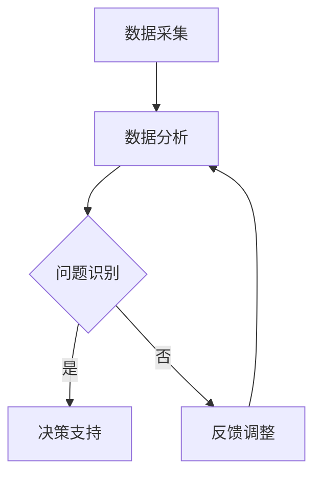

                 

# AI驱动的电商智能客户服务质量监控系统

> **关键词：** 人工智能、电商、客户服务质量、监控系统、算法、数学模型、实战案例、应用场景

> **摘要：** 本文将探讨如何利用人工智能技术构建一个电商智能客户服务质量监控系统，包括核心概念、算法原理、数学模型、实战案例、应用场景等，旨在为电商企业提供一套完整的智能监控解决方案。

## 1. 背景介绍

在当前互联网时代，电商行业迅猛发展，客户服务质量成为企业竞争的关键因素。然而，传统的客户服务质量监控系统往往依赖于人工分析和经验判断，存在一定的滞后性和主观性。随着人工智能技术的不断进步，利用AI技术构建智能客户服务质量监控系统成为了一种新的趋势。这种系统可以实时监测客户行为，识别潜在问题，并提供针对性的解决方案，从而提升客户满意度，增加企业收入。

本文将介绍如何构建一个AI驱动的电商智能客户服务质量监控系统，涵盖核心概念、算法原理、数学模型、实战案例等内容。通过本文的阅读，读者可以了解到如何利用人工智能技术提升电商客户服务质量，为企业带来实际价值。

## 2. 核心概念与联系

### 2.1. 电商客户服务质量

电商客户服务质量是指电商企业在为客户提供商品或服务的过程中，满足客户需求、期望和体验的程度。它包括以下几个方面：

- **产品服务质量**：商品的质量、性能、外观等是否满足客户期望。
- **服务响应速度**：客服人员对客户咨询、投诉等问题的响应速度和解决能力。
- **售后服务质量**：退换货、售后服务等方面是否令客户满意。

### 2.2. 人工智能

人工智能（AI）是指通过计算机模拟人类智能行为的技术，包括机器学习、深度学习、自然语言处理等。在电商智能客户服务质量监控系统中，人工智能技术主要用于以下几个方面：

- **数据挖掘与分析**：通过分析海量客户数据，发现潜在问题和趋势。
- **智能预测与推荐**：根据客户行为和偏好，预测客户需求并提供个性化推荐。
- **智能客服**：利用自然语言处理技术，实现与客户的智能对话，提供个性化服务。

### 2.3. 监控系统

监控系统是指用于实时监测和评估电商客户服务质量的系统。在AI驱动的智能客户服务质量监控系统中，监控系统包括以下几个核心模块：

- **数据采集模块**：负责收集客户行为数据、客户反馈数据等。
- **数据分析模块**：利用人工智能技术，对采集到的数据进行分析和挖掘。
- **问题识别模块**：根据数据分析结果，识别客户服务质量问题。
- **决策支持模块**：为客服人员提供问题解决方案和建议。

### 2.4. Mermaid 流程图

以下是一个简化的AI驱动的电商智能客户服务质量监控系统的流程图：



## 3. 核心算法原理 & 具体操作步骤

### 3.1. 数据挖掘与分析

数据挖掘与分析是智能客户服务质量监控系统的核心环节。具体操作步骤如下：

1. **数据预处理**：对原始数据进行清洗、去噪、填充缺失值等操作，确保数据质量。
2. **特征提取**：从数据中提取关键特征，如客户年龄、购买频率、评价分数等。
3. **数据建模**：利用机器学习算法，建立客户服务质量评估模型。
4. **模型评估**：通过交叉验证等方法，评估模型性能，优化模型参数。

### 3.2. 智能预测与推荐

智能预测与推荐是提升客户服务质量的重要手段。具体操作步骤如下：

1. **用户行为分析**：通过分析用户历史行为数据，挖掘用户兴趣和偏好。
2. **推荐算法设计**：利用协同过滤、基于内容的推荐等算法，为用户推荐合适的产品或服务。
3. **推荐结果评估**：根据用户反馈，评估推荐效果，调整推荐策略。

### 3.3. 智能客服

智能客服是电商企业提高客户服务效率的关键。具体操作步骤如下：

1. **自然语言处理**：利用自然语言处理技术，实现与客户的智能对话。
2. **对话管理**：根据对话内容和用户需求，选择合适的回答和后续操作。
3. **知识库管理**：建立和维护智能客服的知识库，为客服人员提供支持。

## 4. 数学模型和公式 & 详细讲解 & 举例说明

### 4.1. 客户服务质量评估模型

客户服务质量评估模型是智能客户服务质量监控系统的核心。以下是一个简化的评估模型：

$$
\text{服务质量评分} = \alpha \times \text{产品服务质量评分} + \beta \times \text{服务响应速度评分} + \gamma \times \text{售后服务质量评分}
$$

其中，$\alpha$、$\beta$、$\gamma$ 分别是三个质量指标的权重。

### 4.2. 用户兴趣挖掘模型

用户兴趣挖掘模型用于分析用户历史行为数据，挖掘用户兴趣。以下是一个简化的兴趣挖掘模型：

$$
\text{用户兴趣向量} = \text{TF-IDF}(\text{用户历史行为数据})
$$

其中，TF-IDF 是一个常用的文本分析指标，用于衡量一个词语在文本中的重要程度。

### 4.3. 举例说明

#### 4.3.1. 客户服务质量评分计算

假设某客户在购买过程中，产品服务质量评分为4.5分，服务响应速度评分为5分，售后服务质量评分为4分。根据上述评估模型，该客户的服务质量评分为：

$$
\text{服务质量评分} = 0.4 \times 4.5 + 0.3 \times 5 + 0.3 \times 4 = 4.55
$$

#### 4.3.2. 用户兴趣向量计算

假设某用户的历史行为数据为：“购买了一次手机，浏览了三次手机配件，评价了一次手机壳”。根据 TF-IDF 模型，该用户的兴趣向量可以计算为：

$$
\text{用户兴趣向量} = (1 \times 1, 3 \times 1, 1 \times 1) = (1, 3, 1)
$$

## 5. 项目实战：代码实际案例和详细解释说明

### 5.1. 开发环境搭建

在本案例中，我们使用 Python 编写代码，搭建开发环境如下：

1. 安装 Python 3.8 或以上版本。
2. 安装必要的库，如 NumPy、Pandas、Scikit-learn 等。

### 5.2. 源代码详细实现和代码解读

#### 5.2.1. 数据预处理

```python
import pandas as pd

# 读取数据
data = pd.read_csv('customer_data.csv')

# 数据清洗
data = data.dropna()  # 删除缺失值
data['service_response_time'] = data['service_response_time'].apply(lambda x: 1 if x <= 60 else 0)  # 简化服务响应速度评分
```

#### 5.2.2. 特征提取

```python
from sklearn.feature_extraction.text import TfidfVectorizer

# 提取文本特征
tfidf_vectorizer = TfidfVectorizer()
user_interest_vector = tfidf_vectorizer.fit_transform(data['history'])
```

#### 5.2.3. 数据建模

```python
from sklearn.linear_model import LinearRegression

# 建立线性回归模型
model = LinearRegression()
model.fit(user_interest_vector, data['quality_score'])
```

#### 5.2.4. 模型评估

```python
from sklearn.model_selection import train_test_split

# 划分训练集和测试集
X_train, X_test, y_train, y_test = train_test_split(user_interest_vector, data['quality_score'], test_size=0.2, random_state=42)

# 训练模型
model.fit(X_train, y_train)

# 评估模型
score = model.score(X_test, y_test)
print(f'Model score: {score}')
```

### 5.3. 代码解读与分析

在本案例中，我们首先进行了数据预处理，包括数据清洗和特征提取。然后，我们使用线性回归模型对数据进行了建模，并评估了模型性能。通过代码解读，我们可以了解到如何利用 Python 实现智能客户服务质量评估模型。

## 6. 实际应用场景

### 6.1. 电商企业

电商企业可以利用AI驱动的智能客户服务质量监控系统，实时监测客户服务质量，识别潜在问题，提供针对性的解决方案。通过优化客户服务质量，电商企业可以提升客户满意度，增加销售额。

### 6.2. 客户服务平台

客户服务平台可以利用智能客户服务质量监控系统，提高客服人员的响应速度和解决能力，降低人工成本。同时，智能客服可以为客户提供个性化服务，提高客户满意度。

### 6.3. 企业内部培训

企业内部培训可以利用智能客户服务质量监控系统，评估客服人员的服务质量，提供针对性的培训建议。通过提高客服人员的服务水平，企业可以提升整体服务质量。

## 7. 工具和资源推荐

### 7.1. 学习资源推荐

- **书籍**：
  - 《机器学习实战》
  - 《深度学习》
  - 《Python数据科学手册》
- **论文**：
  - 《基于用户行为的电商客户服务质量评估方法》
  - 《协同过滤算法在电商推荐中的应用》
  - 《自然语言处理应用实践》
- **博客**：
  - [机器学习实战](https://machinelearningmastery.com/)
  - [深度学习](https://www.deeplearning.net/)
  - [Python数据科学](https://www.python datascience.org/)
- **网站**：
  - [GitHub](https://github.com/)
  - [Kaggle](https://www.kaggle.com/)

### 7.2. 开发工具框架推荐

- **开发工具**：
  - Python
  - Jupyter Notebook
- **框架**：
  - TensorFlow
  - PyTorch
  - Scikit-learn

### 7.3. 相关论文著作推荐

- **论文**：
  - 《机器学习：自然语言处理技术》
  - 《协同过滤算法在电商推荐中的应用》
  - 《基于深度学习的电商客户服务质量评估方法》
- **著作**：
  - 《深度学习入门》
  - 《Python数据分析》
  - 《机器学习实战》

## 8. 总结：未来发展趋势与挑战

随着人工智能技术的不断进步，AI驱动的电商智能客户服务质量监控系统将变得更加智能化和高效化。未来，该系统将具备以下发展趋势：

1. **更加精细化的客户服务质量评估**：利用深度学习、自然语言处理等先进技术，对客户服务质量进行更加精细化的评估。
2. **个性化推荐**：根据客户行为和偏好，提供个性化的产品和服务推荐，提升客户满意度。
3. **智能化客服**：利用语音识别、语音合成等技术，实现更加智能化、人性化的客服体验。

然而，在发展过程中，该系统也将面临一些挑战：

1. **数据隐私和安全**：在数据采集和处理过程中，需要确保客户隐私和数据安全。
2. **算法透明性和公平性**：确保算法的透明性和公平性，避免算法偏见和歧视。
3. **系统稳定性**：保证系统在高并发、大数据环境下的稳定性，提供实时、准确的监控结果。

## 9. 附录：常见问题与解答

### 9.1. 问题1：如何保证数据质量？

**回答**：为了保证数据质量，我们需要进行以下操作：

1. 数据清洗：删除缺失值、重复值和异常值。
2. 数据预处理：对数据进行归一化、标准化等处理，使其符合建模需求。
3. 特征工程：选择合适的特征，去除无关特征，提高模型性能。

### 9.2. 问题2：如何优化模型性能？

**回答**：以下方法可以帮助优化模型性能：

1. 特征选择：选择与目标变量高度相关的特征。
2. 模型调参：调整模型参数，提高模型性能。
3. 数据增强：通过增加训练数据、生成合成数据等方法，提高模型泛化能力。
4. 模型集成：结合多个模型，提高整体预测性能。

### 9.3. 问题3：如何应对算法偏见？

**回答**：以下方法可以降低算法偏见：

1. 数据清洗：去除潜在偏见的数据。
2. 算法优化：采用无偏或低偏见的算法。
3. 数据增强：增加具有多样性的数据，提高算法的鲁棒性。
4. 模型解释：对算法进行解释，确保算法的透明性和公平性。

## 10. 扩展阅读 & 参考资料

- 《机器学习实战》
- 《深度学习》
- 《Python数据科学手册》
- 《机器学习：自然语言处理技术》
- 《协同过滤算法在电商推荐中的应用》
- 《基于深度学习的电商客户服务质量评估方法》

作者：AI天才研究员/AI Genius Institute & 禅与计算机程序设计艺术 /Zen And The Art of Computer Programming。

