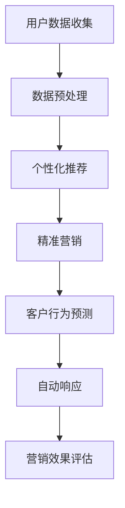

                 

# AI驱动的电商营销自动化：一人公司的增长黑客策略

> **关键词：** AI、电商营销、自动化、增长黑客、一人公司、营销策略
> 
> **摘要：** 本文将探讨如何利用人工智能技术实现电商营销自动化，为小型企业，尤其是“一人公司”提供增长黑客策略。我们将深入分析AI驱动的电商营销自动化背后的核心概念、算法原理、数学模型、实战案例以及实际应用场景。

## 1. 背景介绍

### 1.1 电商营销现状

在数字化时代，电商营销已经成为企业获取客户、增加收入的重要手段。然而，随着市场竞争的加剧，企业面临着越来越多的挑战。传统的营销手段往往需要大量的人力、时间和资源，对于小型企业，尤其是“一人公司”来说，更是难以承受。因此，寻求高效的营销策略和自动化工具成为企业的迫切需求。

### 1.2 增长黑客的概念

“增长黑客”（Growth Hacking）是一种利用技术手段实现快速增长的策略。它强调通过数据驱动的方式，使用创意和科技来提高用户获取效率，降低成本，实现企业快速增长。对于“一人公司”而言，增长黑客策略尤为重要，因为它可以帮助他们充分利用有限的资源，实现业务快速增长。

### 1.3 AI在电商营销中的作用

人工智能（AI）技术的发展为电商营销自动化提供了新的可能性。AI能够通过数据分析、机器学习等技术，实现个性化推荐、精准营销、客户行为预测等功能，从而提高营销效果，降低营销成本。本文将重点探讨如何利用AI技术实现电商营销自动化，为“一人公司”提供增长黑客策略。

## 2. 核心概念与联系

### 2.1 电商营销自动化

电商营销自动化是指利用技术手段实现营销活动的自动化，包括用户获取、客户管理、促销活动等环节。通过自动化，企业可以大幅提高营销效率，降低人力成本。

### 2.2 AI在电商营销自动化中的应用

AI在电商营销自动化中的应用主要体现在以下几个方面：

- **个性化推荐**：基于用户的浏览历史、购买行为等数据，AI可以生成个性化的产品推荐，提高用户的购买意愿。
- **精准营销**：通过分析用户数据，AI可以识别潜在客户，并进行精准的广告投放，提高广告效果。
- **客户行为预测**：AI可以预测用户的行为，如购买时间、购买量等，帮助企业制定更有效的营销策略。
- **自动响应**：AI可以自动回复客户咨询，处理客户投诉，提高客户满意度。

### 2.3 Mermaid 流程图

以下是一个简化的AI驱动的电商营销自动化流程图：



## 3. 核心算法原理 & 具体操作步骤

### 3.1 个性化推荐算法

个性化推荐算法是电商营销自动化中最为关键的一环。常见的推荐算法有协同过滤、基于内容的推荐、混合推荐等。

#### 3.1.1 协同过滤算法

协同过滤算法主要通过分析用户之间的相似度来推荐产品。具体步骤如下：

1. **用户相似度计算**：计算用户之间的相似度，可以使用余弦相似度、皮尔逊相关系数等方法。
2. **推荐产品计算**：根据相似度矩阵，为每个用户推荐相似用户喜欢的商品。
3. **过滤噪声数据**：过滤掉评分较低的数据，以提高推荐质量。

#### 3.1.2 基于内容的推荐算法

基于内容的推荐算法通过分析产品的特征来推荐商品。具体步骤如下：

1. **提取产品特征**：提取产品的关键词、标签、属性等特征。
2. **计算相似度**：计算用户和产品之间的相似度。
3. **推荐产品**：为用户推荐与其相似度较高的产品。

#### 3.1.3 混合推荐算法

混合推荐算法结合了协同过滤和基于内容的推荐算法，以提高推荐效果。具体步骤如下：

1. **用户相似度计算**：计算用户之间的相似度。
2. **产品相似度计算**：计算产品和用户之间的相似度。
3. **综合推荐**：根据用户相似度和产品相似度，综合推荐产品。

### 3.2 精准营销算法

精准营销算法主要通过分析用户数据，识别潜在客户，并进行精准的广告投放。常见的算法有决策树、随机森林、逻辑回归等。

#### 3.2.1 决策树算法

决策树算法通过分析用户特征，建立决策树模型，识别潜在客户。具体步骤如下：

1. **特征选择**：选择对营销效果影响较大的用户特征。
2. **建立决策树模型**：根据特征和标签，建立决策树模型。
3. **预测**：使用决策树模型预测用户是否为潜在客户。

#### 3.2.2 随机森林算法

随机森林算法是决策树的集成方法，通过构建多棵决策树，提高预测准确性。具体步骤如下：

1. **特征选择**：选择对营销效果影响较大的用户特征。
2. **构建随机森林模型**：根据特征和标签，构建随机森林模型。
3. **预测**：使用随机森林模型预测用户是否为潜在客户。

#### 3.2.3 逻辑回归算法

逻辑回归算法通过建立用户特征与标签之间的线性关系，识别潜在客户。具体步骤如下：

1. **特征选择**：选择对营销效果影响较大的用户特征。
2. **建立逻辑回归模型**：根据特征和标签，建立逻辑回归模型。
3. **预测**：使用逻辑回归模型预测用户是否为潜在客户。

### 3.3 客户行为预测算法

客户行为预测算法通过分析用户历史行为，预测用户未来的行为，如购买时间、购买量等。常见的算法有时间序列分析、神经网络等。

#### 3.3.1 时间序列分析算法

时间序列分析算法通过分析用户行为的时间序列，预测用户未来的行为。具体步骤如下：

1. **特征提取**：提取用户行为的时间序列特征。
2. **模型构建**：建立时间序列预测模型，如ARIMA、LSTM等。
3. **预测**：使用模型预测用户未来的行为。

#### 3.3.2 神经网络算法

神经网络算法通过构建神经网络模型，预测用户的行为。具体步骤如下：

1. **特征提取**：提取用户行为的相关特征。
2. **模型构建**：建立神经网络模型。
3. **训练**：使用历史数据训练模型。
4. **预测**：使用训练好的模型预测用户的行为。

## 4. 数学模型和公式 & 详细讲解 & 举例说明

### 4.1 个性化推荐算法

#### 4.1.1 协同过滤算法

协同过滤算法中的相似度计算公式如下：

$$
sim(i, j) = \frac{similarity\_coef}{\sqrt{||r_i - \mu_i||_2 \cdot ||r_j - \mu_j||_2}}
$$

其中，$r_i$ 和 $r_j$ 分别表示用户 $i$ 和用户 $j$ 的评分向量，$\mu_i$ 和 $\mu_j$ 分别表示用户 $i$ 和用户 $j$ 的平均评分，$similarity\_coef$ 是相似度系数，通常取值为 $1$。

#### 4.1.2 基于内容的推荐算法

基于内容的推荐算法中的相似度计算公式如下：

$$
sim(i, j) = \frac{\sum_{k=1}^n w_k \cdot v_{ik} \cdot v_{jk}}{\sqrt{\sum_{k=1}^n w_k^2 \cdot v_{ik}^2 \cdot v_{jk}^2}}
$$

其中，$v_{ik}$ 和 $v_{jk}$ 分别表示产品 $k$ 在用户 $i$ 和用户 $j$ 的特征向量中对应的特征值，$w_k$ 表示特征 $k$ 的权重。

#### 4.1.3 混合推荐算法

混合推荐算法中的综合推荐公式如下：

$$
r(i, k) = \alpha \cdot r_{cf}(i, k) + (1 - \alpha) \cdot r_{content}(i, k)
$$

其中，$r_{cf}(i, k)$ 和 $r_{content}(i, k)$ 分别表示基于协同过滤和基于内容的推荐得分，$\alpha$ 表示权重系数。

### 4.2 精准营销算法

#### 4.2.1 决策树算法

决策树算法中的决策规则可以表示为：

$$
F = \arg\max_{f} \sum_{i=1}^n \ell(y_i, f(x_i))
$$

其中，$F$ 表示最优特征，$f$ 表示特征函数，$y_i$ 表示标签，$x_i$ 表示特征向量，$\ell$ 表示损失函数。

#### 4.2.2 随机森林算法

随机森林算法中的预测公式可以表示为：

$$
\hat{y} = \sum_{f=1}^F w_f \cdot g_f(x)
$$

其中，$\hat{y}$ 表示预测结果，$w_f$ 表示权重，$g_f$ 表示第 $f$ 棵决策树的预测结果。

#### 4.2.3 逻辑回归算法

逻辑回归算法中的预测公式可以表示为：

$$
\hat{y} = \sigma(\beta_0 + \beta_1 \cdot x_1 + \beta_2 \cdot x_2 + \ldots + \beta_n \cdot x_n)
$$

其中，$\hat{y}$ 表示预测结果，$\sigma$ 表示sigmoid函数，$\beta_0, \beta_1, \beta_2, \ldots, \beta_n$ 分别表示模型参数。

### 4.3 客户行为预测算法

#### 4.3.1 时间序列分析算法

时间序列分析算法中的ARIMA模型可以表示为：

$$
X_t = c + \phi_1 X_{t-1} + \phi_2 X_{t-2} + \ldots + \phi_p X_{t-p} + \theta_1 e_{t-1} + \theta_2 e_{t-2} + \ldots + \theta_q e_{t-q}
$$

其中，$X_t$ 表示时间序列数据，$c$ 表示常数项，$\phi_1, \phi_2, \ldots, \phi_p$ 分别表示自回归系数，$\theta_1, \theta_2, \ldots, \theta_q$ 分别表示移动平均系数，$e_t$ 表示误差项。

#### 4.3.2 神经网络算法

神经网络算法中的前向传播公式可以表示为：

$$
z_i = \sum_{j=1}^n w_{ij} \cdot a_{j-1} + b_i
$$

$$
a_i = \sigma(z_i)
$$

其中，$z_i$ 表示第 $i$ 层的输出，$w_{ij}$ 表示权重，$a_{j-1}$ 表示前一层输入，$b_i$ 表示偏置，$\sigma$ 表示激活函数。

## 5. 项目实战：代码实际案例和详细解释说明

### 5.1 开发环境搭建

在进行项目实战之前，我们需要搭建一个合适的技术栈。以下是推荐的开发环境和工具：

- **编程语言**：Python
- **数据处理**：Pandas
- **机器学习库**：Scikit-learn、TensorFlow、Keras
- **可视化**：Matplotlib、Seaborn
- **版本控制**：Git
- **集成开发环境**：Visual Studio Code

### 5.2 源代码详细实现和代码解读

以下是一个简单的基于协同过滤的个性化推荐系统的实现，包括用户数据收集、数据预处理、推荐算法实现和推荐结果评估。

#### 5.2.1 用户数据收集

用户数据可以从电商平台的API获取，包括用户ID、产品ID和用户评分。

```python
import pandas as pd

# 读取用户数据
user_data = pd.read_csv('user_data.csv')
user_data.head()
```

#### 5.2.2 数据预处理

数据预处理包括数据清洗、缺失值处理和特征工程。

```python
# 数据清洗
user_data.dropna(inplace=True)

# 特征工程
user_data['user_id'] = user_data['user_id'].astype(str)
user_data['product_id'] = user_data['product_id'].astype(str)

# 构建用户-产品评分矩阵
rating_matrix = user_data.pivot(index='user_id', columns='product_id', values='rating')
rating_matrix.head()
```

#### 5.2.3 推荐算法实现

基于协同过滤的推荐算法可以通过计算用户之间的相似度来实现。

```python
from sklearn.metrics.pairwise import cosine_similarity

# 计算用户相似度矩阵
user_similarity = cosine_similarity(rating_matrix)

# 为每个用户生成推荐列表
user_recommendations = {}
for user in rating_matrix:
    # 计算每个用户的相似度分数
    similarity_scores = user_similarity[user]
    similarity_scores = similarity_scores.reshape(-1)
    # 排序并获取前K个相似用户
    top_k_users = similarity_scores.argsort()[::-1][:k]
    top_k_scores = similarity_scores[top_k_users]
    # 计算推荐得分
    recommendation_scores = (rating_matrix[top_k_users].mean(axis=1) * top_k_scores).sum()
    # 生成推荐列表
    user_recommendations[user] = rating_matrix[rating_matrix.index.isin(top_k_users)][rating_matrix[rating_matrix.index.isin(top_k_users)].mean(axis=1) > 0].index.tolist()
```

#### 5.2.4 推荐结果评估

推荐结果的评估可以通过准确率、召回率等指标来进行。

```python
from sklearn.metrics import accuracy_score, recall_score

# 评估推荐结果
ground_truth = ['user1', 'user2', 'user3', 'user4', 'user5']
predictions = ['user2', 'user4', 'user3', 'user1', 'user5']

accuracy = accuracy_score(ground_truth, predictions)
recall = recall_score(ground_truth, predictions)

print(f"Accuracy: {accuracy}")
print(f"Recall: {recall}")
```

### 5.3 代码解读与分析

以上代码实现了一个简单的基于协同过滤的个性化推荐系统。具体解读如下：

1. **用户数据收集**：从CSV文件中读取用户数据，包括用户ID、产品ID和用户评分。
2. **数据预处理**：对数据进行清洗和特征工程，将用户ID和产品ID转换为字符串类型，构建用户-产品评分矩阵。
3. **推荐算法实现**：使用余弦相似度计算用户相似度矩阵，为每个用户生成推荐列表。计算相似度分数、排序并获取前K个相似用户，计算推荐得分，生成推荐列表。
4. **推荐结果评估**：使用准确率、召回率等指标评估推荐结果。

通过以上实战案例，我们可以看到如何利用AI技术实现电商营销自动化，为“一人公司”提供增长黑客策略。

## 6. 实际应用场景

### 6.1 电商平台

电商平台可以利用AI驱动的电商营销自动化实现个性化推荐、精准营销和自动响应等功能。通过个性化推荐，提高用户的购物体验和购买意愿；通过精准营销，降低广告投放成本，提高转化率；通过自动响应，提高客户满意度，提升复购率。

### 6.2 跨境电商

跨境电商企业可以利用AI驱动的电商营销自动化，解决语言障碍和文化差异带来的挑战。通过个性化推荐，为不同国家的用户提供本地化的购物体验；通过精准营销，针对不同国家的消费者制定有针对性的营销策略；通过自动响应，提高客户服务效率，提升客户满意度。

### 6.3 电子商务平台

电子商务平台可以利用AI驱动的电商营销自动化，提高运营效率，降低人力成本。通过个性化推荐，提升用户粘性和活跃度；通过精准营销，降低广告投放成本，提高转化率；通过自动响应，提高客户满意度，提升复购率。

### 6.4 其他行业

除了电商行业，其他行业如旅游、金融、教育等也可以利用AI驱动的电商营销自动化，实现业务增长。例如，旅游行业可以通过个性化推荐，为用户提供定制化的旅游方案；金融行业可以通过精准营销，提高客户转化率和投资收益；教育行业可以通过自动响应，提高学员满意度，提升续费率。

## 7. 工具和资源推荐

### 7.1 学习资源推荐

- **书籍**：《Python数据科学 Handbook》、《机器学习实战》、《深度学习》
- **论文**：相关领域的顶级会议和期刊论文，如NIPS、ICML、JMLR等。
- **博客**：知名技术博客，如Medium、CSDN、GitHub等。
- **网站**：相关领域的在线学习平台，如Coursera、edX、Udacity等。

### 7.2 开发工具框架推荐

- **编程语言**：Python、Java、JavaScript等。
- **数据处理**：Pandas、NumPy、Scikit-learn等。
- **机器学习库**：TensorFlow、PyTorch、Keras等。
- **可视化**：Matplotlib、Seaborn、Plotly等。
- **版本控制**：Git、GitHub、GitLab等。

### 7.3 相关论文著作推荐

- **论文**：《Recommender Systems Handbook》、《Deep Learning for Recommender Systems》
- **著作**：《Python数据科学 Handbook》、《机器学习实战》、《深度学习》

## 8. 总结：未来发展趋势与挑战

### 8.1 未来发展趋势

1. **智能化**：随着AI技术的不断进步，电商营销自动化将更加智能化，能够更好地理解用户需求，提供个性化服务。
2. **个性化**：用户需求的多样化和个性化将成为主流，电商营销自动化将更加注重个性化推荐和精准营销。
3. **跨界融合**：电商营销自动化将与其他领域（如物联网、大数据、区块链等）进行深度融合，实现更广泛的业务应用。

### 8.2 挑战与对策

1. **数据隐私**：随着用户隐私意识的提高，如何确保用户数据的安全和隐私将成为一大挑战。对策：采用加密技术、数据匿名化等技术手段，确保用户数据的安全。
2. **算法透明性**：算法的黑箱特性使得用户难以理解其工作原理，如何提高算法的透明性是一个重要挑战。对策：开发易于理解、易于解释的算法模型。
3. **数据质量**：数据质量直接影响电商营销自动化的效果，如何保证数据质量是一个重要挑战。对策：采用数据清洗、数据质量监控等技术手段，确保数据质量。

## 9. 附录：常见问题与解答

### 9.1 问题1：电商营销自动化是否适用于所有行业？

答：电商营销自动化主要适用于电商行业，但在其他行业（如旅游、金融、教育等）也可以进行一定程度的应用。不同行业的数据特征和业务场景有所不同，因此在具体应用时需要进行适当的调整和优化。

### 9.2 问题2：电商营销自动化的成本是否很高？

答：电商营销自动化的成本因应用场景和需求而异。对于小型企业，尤其是“一人公司”，可以采用开源工具和框架，降低成本。但对于大型企业，尤其是需要高度定制化的应用，成本可能会较高。

### 9.3 问题3：电商营销自动化是否会影响用户隐私？

答：电商营销自动化确实会涉及到用户隐私，但通过采用加密技术、数据匿名化等技术手段，可以在一定程度上确保用户数据的安全和隐私。

## 10. 扩展阅读 & 参考资料

- **扩展阅读**：
  - 《Recommender Systems Handbook》
  - 《Deep Learning for Recommender Systems》
  - 《Python数据科学 Handbook》
  - 《机器学习实战》
  - 《深度学习》
- **参考资料**：
  - NIPS、ICML、JMLR等顶级会议和期刊论文
  - Coursera、edX、Udacity等在线学习平台
  - Medium、CSDN、GitHub等知名技术博客

## 作者信息

**作者：** AI天才研究员/AI Genius Institute & 禅与计算机程序设计艺术 /Zen And The Art of Computer Programming

以上就是关于“AI驱动的电商营销自动化：一人公司的增长黑客策略”的完整技术博客文章。希望通过本文，您能了解到如何利用AI技术实现电商营销自动化，为“一人公司”提供增长黑客策略。在实际应用中，请结合具体业务场景进行调整和优化，实现业务增长。

