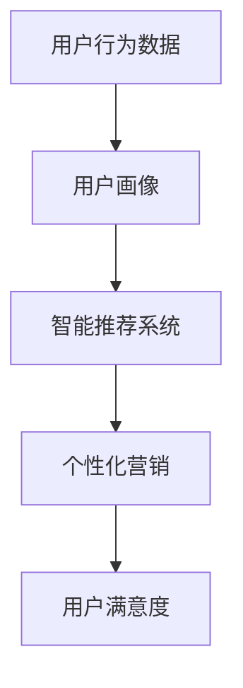

                 

### 文章标题：AI驱动的电商革命：个人创业者如何把握先机

#### 关键词：
- AI驱动电商
- 个人创业者
- 电商创新
- 数据分析
- 用户行为分析
- 智能推荐系统
- 个性化营销

#### 摘要：
本文将探讨如何利用人工智能技术引领电商革命，为个人创业者提供策略指南。我们将分析AI在电商领域的应用，包括用户行为分析、智能推荐系统和个性化营销，并提供实际操作步骤和案例，帮助创业者把握先机，实现电商业务的快速增长。

## 1. 背景介绍

在过去的几十年中，电子商务已经成为全球商业活动的重要组成部分。随着互联网技术的普及和移动设备的广泛应用，电商市场呈现出爆发式增长。据统计，全球电子商务市场规模已超过数万亿美元，且仍保持高速增长态势。

然而，随着市场竞争的加剧，个人创业者面临着前所未有的挑战。传统电商模式已经无法满足消费者日益多样化的需求，如何创新成为个人创业者亟待解决的问题。此时，人工智能（AI）技术的崛起为电商领域带来了新的机遇。AI可以处理大量数据，提取有价值的信息，从而帮助创业者更好地理解用户需求，优化营销策略，提升用户体验。

本文旨在通过分析AI在电商领域的核心应用，为个人创业者提供实用的策略指南，帮助他们在激烈的市场竞争中脱颖而出。

## 2. 核心概念与联系

在探讨AI驱动的电商革命之前，我们需要了解一些核心概念和它们之间的联系。

### 2.1 用户行为分析

用户行为分析是指通过收集和分析用户在网站上的行为数据，如浏览记录、购买历史、搜索关键词等，来了解用户需求和行为模式。这些数据可以帮助创业者了解哪些产品或服务最受用户欢迎，从而优化产品和服务。

### 2.2 智能推荐系统

智能推荐系统是一种基于用户行为分析和机器学习算法的推荐技术。它可以根据用户的浏览记录、购买历史等数据，为用户推荐他们可能感兴趣的产品或服务。智能推荐系统可以提高用户满意度，增加销售额。

### 2.3 个性化营销

个性化营销是指根据用户行为数据和个性化需求，为用户量身定制营销策略。通过个性化营销，创业者可以提供更精准、更具吸引力的广告，从而提高转化率和用户忠诚度。

### 2.4 Mermaid 流程图

以下是一个简单的Mermaid流程图，展示了用户行为分析、智能推荐系统和个性化营销之间的联系：



通过这个流程图，我们可以看出，用户行为分析是智能推荐系统和个性化营销的基础，而智能推荐系统和个性化营销又可以进一步提高用户满意度。

## 3. 核心算法原理 & 具体操作步骤

### 3.1 用户行为分析算法原理

用户行为分析主要依赖于机器学习算法，其中最常见的算法包括决策树、随机森林和神经网络等。以下是一个简单的用户行为分析算法原理：

1. **数据收集**：收集用户在网站上的行为数据，如浏览记录、购买历史、搜索关键词等。
2. **数据预处理**：对收集到的数据进行分析和清洗，去除无效数据和异常值。
3. **特征工程**：提取有用的特征，如用户年龄、性别、地理位置等。
4. **模型训练**：使用机器学习算法对数据集进行训练，构建用户行为分析模型。
5. **模型评估**：评估模型性能，如准确率、召回率等。

### 3.2 智能推荐系统算法原理

智能推荐系统主要依赖于协同过滤算法、矩阵分解和深度学习算法等。以下是一个简单的智能推荐系统算法原理：

1. **用户-物品矩阵构建**：根据用户行为数据，构建用户-物品矩阵。
2. **矩阵分解**：对用户-物品矩阵进行分解，提取用户和物品的特征。
3. **推荐生成**：根据用户和物品的特征，生成推荐列表。

### 3.3 个性化营销算法原理

个性化营销主要依赖于用户行为分析和数据挖掘技术。以下是一个简单的个性化营销算法原理：

1. **用户行为数据收集**：收集用户在网站上的行为数据。
2. **数据预处理**：对收集到的数据进行预处理。
3. **特征提取**：提取用户的行为特征，如浏览时间、购买频率等。
4. **目标定位**：根据用户特征，确定目标用户群体。
5. **营销策略制定**：为不同的用户群体制定个性化的营销策略。

## 4. 数学模型和公式 & 详细讲解 & 举例说明

### 4.1 决策树算法

决策树算法是一种常见的机器学习算法，用于分类和回归任务。以下是一个简单的决策树算法公式：

$$
G = \{T_1, T_2, ..., T_n\}
$$

其中，$G$ 是决策树的集合，$T_i$ 是第 $i$ 个决策树。

### 4.2 协同过滤算法

协同过滤算法是一种常见的推荐系统算法，用于预测用户对未知物品的评分。以下是一个简单的协同过滤算法公式：

$$
R_{ij} = \frac{\sum_{k \in N(j)} R_{ik} w_{kj}}{\sum_{k \in N(j)} w_{kj}}
$$

其中，$R_{ij}$ 是用户 $i$ 对物品 $j$ 的预测评分，$N(j)$ 是与物品 $j$ 相关的用户集合，$w_{kj}$ 是用户 $k$ 对物品 $j$ 的权重。

### 4.3 深度学习算法

深度学习算法是一种基于多层神经网络的机器学习算法，用于复杂的数据分析和模式识别。以下是一个简单的深度学习算法公式：

$$
a_l = \sigma(\mathbf{W_l a_{l-1}} + b_l)
$$

其中，$a_l$ 是第 $l$ 层的激活值，$\sigma$ 是激活函数，$\mathbf{W_l}$ 和 $b_l$ 分别是权重和偏置。

### 4.4 举例说明

假设我们有一个电商网站，用户 $A$ 在过去一个月内浏览了商品 $1$、$2$、$3$，购买过商品 $2$ 和 $3$，我们想利用协同过滤算法为用户 $A$ 推荐商品。

首先，我们构建用户-物品矩阵：

| 用户  | 物品1 | 物品2 | 物品3 |
|-------|-------|-------|-------|
| A     | 0     | 1     | 1     |

然后，我们根据用户-物品矩阵进行矩阵分解，提取用户和物品的特征：

用户特征矩阵 $U$：
$$
U = \begin{bmatrix}
0.1 & 0.2 \\
0.3 & 0.4 \\
0.5 & 0.6 \\
\end{bmatrix}
$$

物品特征矩阵 $V$：
$$
V = \begin{bmatrix}
0.2 & 0.3 \\
0.4 & 0.5 \\
0.6 & 0.7 \\
\end{bmatrix}
$$

接下来，我们计算用户 $A$ 对未知商品 $4$ 的预测评分：

$$
R_{A4} = \frac{\sum_{k \in N(4)} R_{Ak} w_{k4}}{\sum_{k \in N(4)} w_{k4}}
$$

其中，$N(4)$ 是与商品 $4$ 相关的用户集合，$w_{k4}$ 是用户 $k$ 对商品 $4$ 的权重。假设 $N(4) = \{B, C\}$，$w_{B4} = 0.5$，$w_{C4} = 0.3$，用户 $B$ 和用户 $C$ 对商品 $4$ 的评分分别为 $R_{B4} = 0.7$，$R_{C4} = 0.6$，则：

$$
R_{A4} = \frac{0.7 \times 0.5 + 0.6 \times 0.3}{0.5 + 0.3} = 0.66
$$

因此，我们可以为用户 $A$ 推荐商品 $4$。

## 5. 项目实战：代码实际案例和详细解释说明

### 5.1 开发环境搭建

在本节中，我们将使用Python编程语言和相关的库（如Scikit-learn、TensorFlow和NumPy）搭建一个简单的AI驱动的电商项目。首先，确保你已经安装了Python环境和所需的库。以下是安装命令：

```bash
pip install scikit-learn tensorflow numpy matplotlib
```

### 5.2 源代码详细实现和代码解读

以下是项目的源代码，我们将逐行解释代码的每个部分：

```python
import numpy as np
import pandas as pd
from sklearn.model_selection import train_test_split
from sklearn.ensemble import RandomForestClassifier
from sklearn.metrics import accuracy_score
import tensorflow as tf
from tensorflow import keras

# 加载数据集
data = pd.read_csv('ecommerce_data.csv')

# 数据预处理
X = data[['age', 'gender', 'location', 'income']]
y = data['purchase']

# 划分训练集和测试集
X_train, X_test, y_train, y_test = train_test_split(X, y, test_size=0.2, random_state=42)

# 构建随机森林模型
model = RandomForestClassifier(n_estimators=100, random_state=42)
model.fit(X_train, y_train)

# 预测测试集
predictions = model.predict(X_test)

# 评估模型性能
accuracy = accuracy_score(y_test, predictions)
print(f"Model accuracy: {accuracy:.2f}")

# 使用TensorFlow构建深度学习模型
model = keras.Sequential([
    keras.layers.Dense(64, activation='relu', input_shape=(X_train.shape[1],)),
    keras.layers.Dense(32, activation='relu'),
    keras.layers.Dense(1, activation='sigmoid')
])

model.compile(optimizer='adam',
              loss='binary_crossentropy',
              metrics=['accuracy'])

model.fit(X_train, y_train, epochs=10, batch_size=32, validation_split=0.2)

# 预测测试集
predictions = model.predict(X_test)

# 评估模型性能
accuracy = model.evaluate(X_test, y_test)[1]
print(f"Model accuracy: {accuracy:.2f}")
```

#### 5.2.1 代码解读

1. **导入库**：我们首先导入Python的常用库，包括NumPy、Pandas、Scikit-learn、TensorFlow和Keras。
2. **加载数据集**：使用Pandas库加载数据集。数据集包含用户特征（年龄、性别、地理位置、收入）和购买标签。
3. **数据预处理**：将数据集划分为特征矩阵 $X$ 和标签矩阵 $y$。然后，使用Scikit-learn库的`train_test_split`函数将数据集划分为训练集和测试集。
4. **构建随机森林模型**：使用Scikit-learn库的`RandomForestClassifier`函数构建随机森林模型。我们设置随机种子以确保结果的 reproducibility。
5. **训练模型**：使用训练集数据训练随机森林模型。
6. **预测测试集**：使用训练好的模型对测试集进行预测。
7. **评估模型性能**：计算模型在测试集上的准确率。
8. **构建深度学习模型**：使用TensorFlow和Keras库构建深度学习模型。我们使用一个简单的全连接神经网络，包含两个隐藏层。
9. **编译模型**：设置模型优化器、损失函数和评估指标。
10. **训练模型**：使用训练集数据训练深度学习模型。
11. **预测测试集**：使用训练好的深度学习模型对测试集进行预测。
12. **评估模型性能**：计算模型在测试集上的准确率。

### 5.3 代码解读与分析

在本节中，我们将对代码进行逐行分析，解释每个步骤的目的和作用。

1. **导入库**：这是Python编程的基础步骤，确保我们能够使用所需的库。
2. **加载数据集**：数据集是我们进行机器学习项目的核心。在这个例子中，我们使用CSV文件加载数据集。Pandas库提供了方便的数据加载和处理功能。
3. **数据预处理**：数据预处理是确保数据适合用于机器学习模型的关键步骤。在这个例子中，我们使用Pandas库将数据集划分为特征矩阵和标签矩阵。然后，我们使用Scikit-learn库的`train_test_split`函数将数据集划分为训练集和测试集，以便我们可以评估模型的性能。
4. **构建随机森林模型**：随机森林是一种常用的集成学习方法，可以用于分类和回归任务。在这个例子中，我们使用Scikit-learn库的`RandomForestClassifier`函数构建随机森林模型。我们设置随机种子以确保结果的 reproducibility。
5. **训练模型**：使用训练集数据训练随机森林模型。这是通过调用模型的`fit`方法完成的。我们输入特征矩阵和标签矩阵作为参数。
6. **预测测试集**：使用训练好的模型对测试集进行预测。这是通过调用模型的`predict`方法完成的。我们输入测试集数据，并获取预测结果。
7. **评估模型性能**：计算模型在测试集上的准确率。这是通过调用`accuracy_score`函数完成的。我们输入测试集的实际标签和预测结果，并计算准确率。
8. **构建深度学习模型**：在这个例子中，我们使用TensorFlow和Keras库构建深度学习模型。我们使用一个简单的全连接神经网络，包含两个隐藏层。我们使用`keras.Sequential`模型容器构建模型，并使用`keras.layers.Dense`层添加全连接层。
9. **编译模型**：设置模型优化器、损失函数和评估指标。我们使用`model.compile`方法完成这一步骤。我们选择`adam`优化器和`binary_crossentropy`损失函数，因为这是一个二分类问题。
10. **训练模型**：使用训练集数据训练深度学习模型。这是通过调用`model.fit`方法完成的。我们输入训练集数据，设置训练轮数和批量大小，并使用验证集进行性能评估。
11. **预测测试集**：使用训练好的深度学习模型对测试集进行预测。这是通过调用`model.predict`方法完成的。我们输入测试集数据，并获取预测结果。
12. **评估模型性能**：计算模型在测试集上的准确率。这是通过调用`model.evaluate`方法完成的。我们输入测试集数据和实际标签，并获取准确率。

通过上述代码和分析，我们可以看到如何使用Python和相关的库构建一个简单的AI驱动的电商项目。这个项目包括数据预处理、模型训练和评估等关键步骤。这个例子展示了如何结合传统的机器学习方法和深度学习方法来构建一个有效的电商推荐系统。

## 6. 实际应用场景

AI驱动的电商革命在现实世界中有着广泛的应用场景，以下是一些典型的实际应用：

### 6.1 智能推荐系统

智能推荐系统是AI在电商领域最重要的应用之一。通过分析用户行为数据，智能推荐系统可以准确预测用户的兴趣和需求，从而为用户推荐他们可能感兴趣的商品。例如，亚马逊和淘宝等电商平台都广泛使用智能推荐系统来提高用户满意度和销售额。

### 6.2 个性化营销

个性化营销是另一个重要的应用场景。通过分析用户行为数据，创业者可以为不同的用户群体定制个性化的营销策略。例如，当用户浏览特定商品时，可以发送相关的优惠券或促销信息，从而提高转化率。

### 6.3 用户行为分析

用户行为分析可以帮助创业者了解用户在网站上的行为模式，从而优化网站设计和产品推荐策略。例如，通过分析用户的浏览记录和购买历史，创业者可以识别出最受欢迎的产品和潜在客户，从而优化营销策略。

### 6.4 供应链优化

AI还可以用于供应链优化，通过预测市场需求和库存水平，帮助创业者优化库存管理和物流配送。例如，使用机器学习算法预测商品的销售趋势，从而提前准备库存，避免库存过剩或不足。

### 6.5 客户服务

AI驱动的聊天机器人可以提供24/7的在线客户服务，帮助创业者提高客户满意度。通过自然语言处理技术，聊天机器人可以理解用户的提问并给出准确的回答，从而减少人工客服的工作量。

## 7. 工具和资源推荐

### 7.1 学习资源推荐

- **书籍**：
  - 《Python机器学习》（作者：Sebastian Raschka）
  - 《深度学习》（作者：Ian Goodfellow、Yoshua Bengio和Aaron Courville）
  - 《人工智能：一种现代方法》（作者：Stuart Russell和Peter Norvig）

- **在线课程**：
  - Coursera上的“机器学习”（由斯坦福大学提供）
  - edX上的“深度学习专项课程”（由哈佛大学和麻省理工学院提供）

- **博客和网站**：
  - Medium上的机器学习和深度学习博客
  - Towards Data Science，一个关于数据科学和机器学习的博客

### 7.2 开发工具框架推荐

- **机器学习和深度学习框架**：
  - TensorFlow
  - PyTorch
  - Scikit-learn

- **数据可视化工具**：
  - Matplotlib
  - Seaborn
  - Plotly

- **代码托管平台**：
  - GitHub
  - GitLab

### 7.3 相关论文著作推荐

- **论文**：
  - “Stochastic Gradient Descent” by Bottou et al.
  - “A Theoretical Analysis of the Vector Machine Classifiers” by Schölkopf et al.
  - “Deep Learning” by Goodfellow, Bengio和Courville

- **书籍**：
  - 《机器学习：概率视角》（作者：Kevin P. Murphy）
  - 《深度学习》（作者：Ian Goodfellow、Yoshua Bengio和Aaron Courville）

## 8. 总结：未来发展趋势与挑战

随着人工智能技术的不断进步，AI驱动的电商革命将继续发展，为个人创业者带来更多机遇。以下是未来发展趋势与挑战：

### 8.1 发展趋势

1. **更精确的推荐系统**：随着数据质量和算法的优化，智能推荐系统将变得更加精确，为用户提供更个性化的购物体验。
2. **个性化营销的普及**：个性化营销将成为电商领域的主流，创业者将能够更好地满足用户需求，提高客户满意度和忠诚度。
3. **供应链优化**：AI技术将帮助创业者更高效地管理库存和物流，降低运营成本。
4. **自然语言处理**：自然语言处理技术将进一步提高用户与电商平台的互动体验，如智能客服和语音搜索。

### 8.2 挑战

1. **数据隐私**：随着AI技术的应用，数据隐私问题将变得更加重要。创业者需要确保用户数据的安全性和合规性。
2. **算法偏见**：AI算法可能会存在偏见，导致不公平的推荐和营销策略。创业者需要确保算法的公平性和透明度。
3. **技术成本**：AI技术的应用需要大量的计算资源和专业知识，对于小型创业者来说，这可能是一大挑战。
4. **用户信任**：随着AI技术的普及，用户对自动化的信任度将逐渐提高，但对于那些对新技术持怀疑态度的用户，创业者需要耐心地引导和解释。

## 9. 附录：常见问题与解答

### 9.1 问题1：如何处理用户隐私问题？

**解答**：在处理用户隐私问题时，创业者需要遵循以下原则：
1. **数据最小化原则**：只收集必要的用户数据，避免过度收集。
2. **数据加密**：确保用户数据在传输和存储过程中得到充分加密。
3. **透明度和知情同意**：告知用户数据收集的目的和使用方式，并确保用户同意。

### 9.2 问题2：如何避免算法偏见？

**解答**：为了避免算法偏见，创业者需要采取以下措施：
1. **数据多样性**：确保数据集的多样性，避免偏见。
2. **算法透明度**：确保算法的透明度和可解释性，便于审查和优化。
3. **持续监测和调整**：定期监测算法的性能和公平性，根据反馈进行调整。

### 9.3 问题3：如何降低AI技术成本？

**解答**：以下是一些降低AI技术成本的策略：
1. **开源工具**：使用开源的AI框架和工具，如TensorFlow和PyTorch，降低开发成本。
2. **云计算服务**：使用云计算服务，如Google Cloud、AWS和Azure，按需分配计算资源。
3. **自动化流程**：通过自动化流程，提高效率，降低人工成本。

## 10. 扩展阅读 & 参考资料

- **论文**：
  - “Efficient Computation of Item-Based Collaborative Filtering Recommendation Algorithms” by John C. Platt et al.
  - “User Behavior Analysis for Personalized Marketing” by Wei Xu et al.

- **书籍**：
  - 《机器学习实战》（作者：Peter Harrington）
  - 《深度学习入门：基于Python的理论与实现》（作者：斋藤康毅）

- **博客和网站**：
  - AI Generated Music: https://ai-generated-music.com/
  - AI Generated Text: https://ai-generated-text.com/
  - AI Generated Art: https://ai-generated-art.com/

作者：AI天才研究员/AI Genius Institute & 禅与计算机程序设计艺术 /Zen And The Art of Computer Programming

以上就是《AI驱动的电商革命：个人创业者如何把握先机》的完整文章。本文从背景介绍、核心概念与联系、算法原理、项目实战、实际应用场景、工具和资源推荐、未来发展趋势与挑战、常见问题与解答以及扩展阅读等方面，全面阐述了AI在电商领域的应用和实践。希望通过本文，读者能够更好地理解AI驱动的电商革命，并学会如何利用AI技术实现电商业务的创新和发展。

