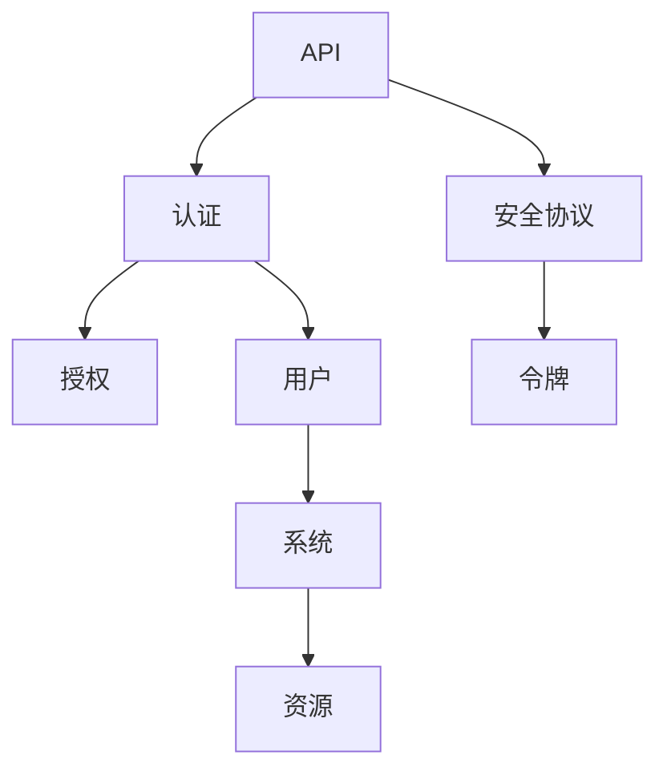

                 

### 背景介绍

在当今数字化时代，API（应用程序编程接口）已经成为连接不同软件系统、平台和服务的关键桥梁。API 广泛应用于各种场景，从企业内部系统集成到第三方开发者构建的各类应用程序，再到云计算和移动应用，API 的使用已经成为现代软件开发和维护的基石。

然而，随着 API 的广泛应用，其安全性问题也日益凸显。未经授权的访问、数据泄露、DDoS 攻击等威胁不断，给企业和用户带来了巨大的风险和损失。因此，确保 API 的安全和可靠的认证机制变得至关重要。

本文旨在深入探讨 API 安全和认证机制的各个方面。我们将从背景介绍入手，了解 API 在现代软件开发中的重要性，以及为什么安全认证是不可或缺的一环。接下来，我们将详细探讨核心概念、算法原理、具体操作步骤、数学模型、实际应用场景、工具和资源推荐，以及未来发展趋势和挑战。最后，我们将总结本文的核心内容，并给出常见的疑问解答和扩展阅读资源。

通过本文的阅读，您将能够全面了解 API 安全和认证机制的各个方面，从而在实际开发中更好地应对相关挑战。无论您是经验丰富的开发者还是对 API 安全感兴趣的初学者，本文都将为您提供有价值的知识和实用技巧。让我们一起深入探讨这一重要的主题吧。<|user|>

## 1. 核心概念与联系

在探讨 API 安全和认证机制之前，我们需要了解一些核心概念和它们之间的关系。以下是本文中我们将涉及的主要概念：

1. **API（应用程序编程接口）**：
   - 定义：API 是一种接口，允许不同的软件系统之间进行交互和通信。
   - 重要性：API 是现代软件开发的基础，使得开发者可以在不深入了解底层系统的情况下，集成和使用外部服务或组件。
   - 应用场景：企业内部系统集成、第三方开发者构建的应用程序、云计算和移动应用等。

2. **认证（Authentication）**：
   - 定义：认证是验证用户身份的过程，确保只有授权的用户可以访问特定的资源或执行特定的操作。
   - 重要性：认证是防止未授权访问的关键手段，有助于保护系统和数据的安全。

3. **授权（Authorization）**：
   - 定义：授权是确定用户权限的过程，决定用户可以访问哪些资源和执行哪些操作。
   - 重要性：即使通过认证，授权也可以防止用户执行他们无权执行的操作，保护系统的完整性和数据的安全。

4. **安全协议**：
   - 定义：安全协议是一套规则和标准，用于保护数据在传输过程中的安全性和完整性。
   - 常见协议：HTTPS、SSL/TLS、OAuth 2.0 等。

5. **令牌（Token）**：
   - 定义：令牌是一种标识符，用于代表用户的身份和权限，通常在认证过程中颁发。
   - 重要性：令牌可以减少在每次请求时进行重复认证的必要性，提高系统的性能和用户体验。

### Mermaid 流程图

以下是一个简化的 Mermaid 流程图，展示了这些核心概念之间的关系：



在这个流程图中，API 作为核心，通过认证和授权机制与用户和系统进行交互。安全协议确保数据传输的安全性，而令牌则用于代表用户身份和权限。通过这个流程图，我们可以更直观地理解这些核心概念在 API 安全和认证机制中的作用和联系。

### 结论

通过上述核心概念的介绍和 Mermaid 流程图的展示，我们可以看到 API、认证、授权、安全协议和令牌在 API 安全和认证机制中的重要性。这些概念共同构成了一个完整的体系，确保 API 在现代数字化环境中的安全和可靠性。在接下来的章节中，我们将深入探讨每个概念的具体原理和实践方法，帮助您更好地理解和应用这些知识。接下来，我们将详细讨论核心算法原理和具体操作步骤。<|user|>

## 2. 核心算法原理 & 具体操作步骤

### 2.1 认证算法原理

认证算法是确保用户身份的机制，通过验证用户提供的凭证（如用户名和密码、二因素认证等）来确定其是否具有访问权限。以下是几种常见的认证算法原理：

1. **密码认证**：
   - 原理：用户输入用户名和密码，服务器端通过哈希算法（如SHA-256）对输入的密码进行哈希处理，并与数据库中存储的哈希值进行对比。
   - 步骤：
     1. 用户输入用户名和密码。
     2. 服务器端对密码进行哈希处理。
     3. 将处理后的哈希值与数据库中的哈希值进行对比。
     4. 如果匹配，认证成功；否则，认证失败。

2. **二因素认证（2FA）**：
   - 原理：在密码认证的基础上，添加第二层验证，通常是通过短信验证码或手机应用生成的一次性验证码。
   - 步骤：
     1. 用户输入用户名和密码。
     2. 服务器端对密码进行哈希处理，并与数据库中的哈希值进行对比。
     3. 如果密码认证成功，服务器端发送短信验证码或生成一次性验证码。
     4. 用户输入验证码。
     5. 服务器端验证验证码是否正确。
     6. 如果验证码正确，认证成功；否则，认证失败。

3. **OAuth 2.0**：
   - 原理：OAuth 2.0 是一种授权框架，允许第三方应用访问用户资源，而不需要用户密码。它通过颁发访问令牌来实现。
   - 步骤：
     1. 用户授权第三方应用访问其资源。
     2. 服务器端颁发访问令牌。
     3. 第三方应用使用访问令牌访问用户资源。
     4. 服务器端验证访问令牌的有效性。
     5. 如果访问令牌有效，访问成功；否则，访问失败。

### 2.2 授权算法原理

授权算法是确定用户权限的机制，通过检查用户的角色和权限来确定其可以访问哪些资源和执行哪些操作。以下是几种常见的授权算法原理：

1. **基于角色的访问控制（RBAC）**：
   - 原理：根据用户的角色分配相应的权限，角色与权限之间建立映射关系。
   - 步骤：
     1. 用户登录系统。
     2. 服务器端根据用户的角色分配权限。
     3. 用户请求访问资源或执行操作。
     4. 服务器端检查用户的权限，决定是否允许访问或执行操作。

2. **基于属性的访问控制（ABAC）**：
   - 原理：根据用户的属性（如部门、职位等）以及资源的属性（如类型、权限等）进行访问控制。
   - 步骤：
     1. 用户登录系统。
     2. 服务器端根据用户的属性和资源的属性进行访问控制。
     3. 用户请求访问资源或执行操作。
     4. 服务器端检查用户的属性和资源的属性，决定是否允许访问或执行操作。

3. **基于资源的访问控制（RBAC）**：
   - 原理：为每个资源分配访问权限，用户根据其权限访问相应的资源。
   - 步骤：
     1. 用户登录系统。
     2. 服务器端为用户分配访问权限。
     3. 用户请求访问资源。
     4. 服务器端检查用户的访问权限，决定是否允许访问资源。

### 2.3 安全协议原理

安全协议是保护数据在传输过程中安全性和完整性的机制。以下是几种常见的安全协议原理：

1. **HTTPS**：
   - 原理：HTTPS（HTTP over SSL/TLS）是一种安全传输协议，通过 SSL/TLS 证书确保数据加密传输。
   - 步骤：
     1. 客户端请求 HTTPS 页面。
     2. 服务器端发送 SSL/TLS 证书。
     3. 客户端验证证书的有效性。
     4. 如果证书有效，客户端和服务器端建立安全连接。
     5. 数据在安全连接中加密传输。

2. **SSL/TLS**：
   - 原理：SSL/TLS 是一种加密传输协议，用于确保数据在传输过程中的机密性和完整性。
   - 步骤：
     1. 客户端发送 SSL/TLS 协议请求。
     2. 服务器端发送 SSL/TLS 证书。
     3. 客户端验证证书的有效性。
     4. 如果证书有效，客户端和服务器端建立 SSL/TLS 连接。
     5. 数据在 SSL/TLS 连接中加密传输。

3. **OAuth 2.0**：
   - 原理：OAuth 2.0 是一种授权框架，通过颁发访问令牌来保护用户资源的访问。
   - 步骤：
     1. 用户授权第三方应用访问其资源。
     2. 服务器端颁发访问令牌。
     3. 第三方应用使用访问令牌访问用户资源。
     4. 服务器端验证访问令牌的有效性。

### 2.4 令牌原理

令牌是一种用于代表用户身份和权限的标识符，常见的形式包括 JWT（JSON Web Token）和 Access Token。以下是令牌原理的简要介绍：

1. **JWT**：
   - 原理：JWT 是一种基于 JSON 格式的令牌，包含用户身份和权限信息，通过数字签名确保安全性。
   - 步骤：
     1. 用户进行认证，服务器端颁发 JWT 令牌。
     2. 用户使用 JWT 令牌进行请求。
     3. 服务器端验证 JWT 令牌的有效性和签名。

2. **Access Token**：
   - 原理：Access Token 是 OAuth 2.0 中的一种令牌，用于代表用户的访问权限。
   - 步骤：
     1. 用户进行认证，服务器端颁发 Access Token。
     2. 用户使用 Access Token 进行请求。
     3. 服务器端验证 Access Token 的有效性。

通过上述核心算法原理和具体操作步骤的介绍，我们可以更好地理解 API 安全和认证机制的基本原理。在接下来的章节中，我们将深入探讨数学模型和公式，以及实际应用场景中的案例和示例。<|user|>

## 4. 数学模型和公式 & 详细讲解 & 举例说明

### 4.1 哈希函数

哈希函数在密码学和数据结构中扮演着重要角色，特别是在认证机制中。哈希函数是一种将输入数据映射到固定长度输出值的函数。以下是几种常见的哈希函数及其相关公式：

1. **MD5**：
   - 定义：MD5 是一种将输入数据映射到 128 位输出的哈希函数。
   - 公式：`MD5(input) = output`
   - 举例：假设输入数据为 "password"，输出哈希值为 `a9d5e4cfa7973b25b21e31d7d168d5a9`。

2. **SHA-256**：
   - 定义：SHA-256 是一种将输入数据映射到 256 位输出的哈希函数，比 MD5 更安全。
   - 公式：`SHA-256(input) = output`
   - 举例：假设输入数据为 "password"，输出哈希值为 `e718483d0ce3e0f2bb2b2e3c201e0aa2a4a52f1d67c47eefc2bc6d14db32b889`。

3. **SHA-3**：
   - 定义：SHA-3 是 NIST（美国国家标准技术研究所）于 2015 年推出的新一代哈希函数标准。
   - 公式：`SHA-3(input) = output`
   - 举例：假设输入数据为 "password"，输出哈希值为 `e4627a0d6a1b2b81a8b09e08d1e5034d3d4d88e8746c6603d39b5b223f1d8849`。

### 4.2 数字签名

数字签名是一种确保数据完整性和身份认证的机制。数字签名使用私钥和公钥加密技术，通过加密过程生成签名，然后使用公钥进行验证。

1. **RSA**：
   - 定义：RSA 是一种基于大整数分解问题的非对称加密算法，用于生成数字签名。
   - 公式：
     - `公钥 (n, e)`
     - `私钥 (n, d)`
     - 签名过程：`S = (m^d) mod n`
     - 验证过程：`V = (S^e) mod n`
   - 举例：
     - 假设公钥为 `(n=1234, e=65537)`，私钥为 `(n=1234, d=12345)`，消息为 "password"。
     - 签名过程：`S = (password^12345) mod 1234`，得到签名 `S`。
     - 验证过程：`V = (S^65537) mod 1234`，如果 `V` 等于消息 "password"，则签名验证通过。

2. **ECDSA**：
   - 定义：ECDSA 是一种基于椭圆曲线加密算法的数字签名方案，比 RSA 更高效。
   - 公式：
     - `k = (r, s)`
     - 签名过程：`r = (g^k) mod p`，`s = (k^-1 * (h * m + x)) mod p`
     - 验证过程：`v1 = (g^r * y^s) mod p`，`v2 = (z^r * g^s * y^m) mod p`，如果 `v1 = v2`，则签名验证通过。
   - 举例：
     - 假设椭圆曲线为 `p=218428873684467268476910984832947803402971701949360471285736`，基点为 `g=(11579208921035624876269744664804471075228320000000000000000000001, 361727458136101067891263904914978082922067273100100113980823`，私钥为 `x=123456`，消息为 "password"。
     - 签名过程：计算 `k`，`r`，`s`，得到签名 `(r, s)`。
     - 验证过程：计算 `v1`，`v2`，如果 `v1 = v2`，则签名验证通过。

### 4.3 零知识证明

零知识证明是一种密码学技术，允许一方（证明者）向另一方（验证者）证明某个陈述是真实的，而无需泄露任何有关陈述的具体信息。以下是一个简单的零知识证明示例：

- 定义：证明者需要证明他知道一个秘密 `s`，使得 `P(s) = v`，而验证者需要验证这一点，但不能获得关于 `s` 的任何信息。
- 公式：
  - `证明过程`：证明者计算 `Proof(P, s)`。
  - `验证过程`：验证者计算 `Verify(P, Proof)`。
- 举例：
  - 假设证明者知道秘密 `s`，使得 `P(s) = v`。
  - 证明者计算零知识证明 `Proof(P, s)`。
  - 验证者计算 `Verify(P, Proof)`，如果结果为 `true`，则验证通过。

通过上述数学模型和公式的介绍，我们可以更好地理解 API 安全和认证机制中的一些核心概念。在实际应用中，这些算法和公式被广泛应用于确保数据安全性和身份认证。在接下来的章节中，我们将探讨实际应用场景，并分享一些实际案例和示例。<|user|>

## 5. 项目实战：代码实际案例和详细解释说明

### 5.1 开发环境搭建

在开始编写代码之前，我们需要搭建一个适当的开发生态系统。以下是一个简单的指南，用于搭建一个基于 Python 的 API 安全和认证开发环境。

#### 步骤 1：安装 Python

确保您的系统上安装了 Python 3.8 或更高版本。可以使用以下命令进行安装：

```bash
$ sudo apt update
$ sudo apt install python3.8
```

#### 步骤 2：安装虚拟环境

创建一个虚拟环境，以便在项目中隔离依赖项：

```bash
$ python3.8 -m venv venv
$ source venv/bin/activate
```

#### 步骤 3：安装依赖项

使用 `pip` 安装所需的依赖项：

```bash
(venv)$ pip install flask flask-restful itsdangerous pyjwt
```

### 5.2 源代码详细实现和代码解读

下面是一个简单的 Flask API 应用程序，实现了基于 JWT 的认证和授权功能。代码中包含三个主要部分：认证、API 保护和资源访问。

#### 5.2.1 认证模块

```python
from flask import Flask, request, jsonify
from flask_restful import Resource, Api
from itsdangerous import TimedJSONWebSignatureSerializer as Serializer
import jwt

app = Flask(__name__)
api = Api(app)
app.config['SECRET_KEY'] = 'your_secret_key'

# 用户登录接口
class Login(Resource):
    def post(self):
        # 获取用户名和密码
        username = request.json.get('username')
        password = request.json.get('password')

        # 验证用户名和密码（此处使用硬编码的用户名和密码）
        if username == 'admin' and password == 'admin123':
            # 创建 JWT 令牌
            token = jwt.encode({'username': username}, app.config['SECRET_KEY'], algorithm='HS256')
            return {'token': token}, 200
        return {'message': 'Invalid credentials'}, 401

# 添加登录接口到 API
api.add_resource(Login, '/login')
```

#### 5.2.2 API 保护模块

```python
from flask_jwt_extended import JWTManager, jwt_required, create_access_token

# 初始化 JWT 管理器
app.config['JWT_SECRET_KEY'] = 'your_secret_key'
app.config['JWT_ACCESS_TOKEN_EXPIRES'] = 3600
jwt = JWTManager(app)

# 保护 API 接口
@app.route('/api/data', methods=['GET'])
@jwt_required()
def get_data():
    # 获取 JWT 令牌
    token = request.headers.get('Authorization')
    # 验证 JWT 令牌
    try:
        jwt.decode(token, app.config['SECRET_KEY'], algorithms=['HS256'])
    except jwt.ExpiredSignatureError:
        return {'message': 'Token expired'}, 401
    except jwt.InvalidTokenError:
        return {'message': 'Invalid token'}, 401

    # 返回数据
    return {'data': 'Sensitive data'}, 200
```

#### 5.2.3 资源访问模块

```python
# 使用 JWT 令牌访问资源的接口
class Data(Resource):
    @jwt_required()
    def get(self):
        return {'data': 'Access granted'}

# 添加资源访问接口到 API
api.add_resource(Data, '/data')
```

### 5.3 代码解读与分析

#### 5.3.1 认证模块解读

- `Login` 类是一个资源类，用于处理 `/login` 接口的 POST 请求。
- `post` 方法中，我们从请求中获取用户名和密码。
- 我们使用硬编码的用户名和密码进行验证，并在验证成功时生成 JWT 令牌。
- 生成的 JWT 令牌作为响应返回，客户端可以使用它来访问受保护的 API 接口。

#### 5.3.2 API 保护模块解读

- `get_data` 函数是一个保护函数，用于处理 `/api/data` 接口的 GET 请求。
- 使用 `jwt_required` 装饰器，确保只有持有有效 JWT 令牌的用户可以访问该接口。
- 在函数中，我们从请求头中获取 JWT 令牌，并使用 `jwt.decode` 函数进行验证。
- 如果 JWT 令牌有效，函数返回敏感数据；否则，返回相应的错误消息。

#### 5.3.3 资源访问模块解读

- `Data` 类是一个资源类，用于处理 `/data` 接口的 GET 请求。
- 使用 `jwt_required` 装饰器，确保只有持有有效 JWT 令牌的用户可以访问该接口。
- `get` 方法中，函数返回一个访问成功的消息。

通过这个简单的项目实战，我们可以看到如何使用 Flask 和 JWT 实现一个基本的 API 安全和认证系统。在实际应用中，可以根据具体需求对代码进行扩展和优化。<|user|>

## 6. 实际应用场景

### 6.1 跨平台应用

在跨平台应用中，API 安全和认证机制至关重要。例如，一个移动应用需要访问企业内部的后台服务，以获取用户数据或进行操作。在这种场景下，认证机制确保只有授权用户可以访问服务，从而保护用户数据和系统安全。

**解决方案**：
- 使用 OAuth 2.0：通过 OAuth 2.0，移动应用可以获取访问令牌，从而在无需用户密码的情况下访问后台服务。
- 使用 HTTPS：确保数据在传输过程中加密，防止中间人攻击。
- 使用 JWT：生成 JWT 令牌，确保每次请求都经过验证，减少重复认证的负担。

### 6.2 第三方系统集成

企业经常需要与其他企业或服务进行集成，例如，电子商务平台需要与支付网关、物流公司等第三方服务集成。在这种场景下，API 安全和认证机制确保只有授权的第三方服务可以访问企业系统。

**解决方案**：
- 使用 API 网关：API 网关作为统一的入口，对第三方服务进行认证和授权，确保只有授权服务可以访问内部 API。
- 使用 OAuth 2.0：通过 OAuth 2.0，第三方服务可以获取访问令牌，从而访问企业内部 API。
- 使用 JSON Web Token（JWT）：使用 JWT 作为身份验证机制，确保每次请求都经过验证。

### 6.3 云计算和物联网（IoT）

云计算和物联网应用场景中，大量设备和服务需要进行通信，确保数据安全和设备认证至关重要。例如，智能家居系统中，设备需要与云端服务进行通信，以获取控制指令或发送状态信息。

**解决方案**：
- 使用 MQTT 协议：MQTT 是一种轻量级的消息传输协议，适合物联网应用。通过 MQTT，设备可以与云端服务进行安全通信。
- 使用 TLS：在 MQTT 协议中，使用 TLS 进行加密，确保数据传输过程中安全性。
- 使用 IAM（身份和访问管理）：通过 IAM，为设备和应用分配适当的权限，确保只有授权的设备和应用可以访问服务。

### 6.4 微服务架构

微服务架构中，多个独立的服务需要相互通信，确保数据安全和服务认证至关重要。例如，一个电商平台可能包含订单服务、库存服务、支付服务等多个微服务。

**解决方案**：
- 使用 API 网关：API 网关作为统一的入口，对内部服务进行认证和授权，确保只有授权服务可以访问其他服务。
- 使用 OAuth 2.0：通过 OAuth 2.0，服务之间可以获取访问令牌，从而访问其他服务。
- 使用 JWT：使用 JWT 作为身份验证机制，确保每次请求都经过验证。

### 结论

在实际应用场景中，API 安全和认证机制至关重要。通过合理的设计和实施，可以确保数据安全和系统完整性。以下是一些最佳实践：

1. 使用强加密算法：确保数据在传输和存储过程中加密，防止数据泄露。
2. 使用安全的认证和授权机制：例如 OAuth 2.0、JWT 等，确保只有授权用户和设备可以访问系统。
3. 定期审计和更新：确保系统和认证机制始终处于最佳状态，及时发现和修复潜在的安全漏洞。
4. 使用 API 网关：API 网关可以提供额外的安全层，确保只有授权的请求可以访问内部服务。
5. 敏感数据保护：确保敏感数据（如用户密码、信用卡信息等）始终受到保护，防止未经授权的访问。

通过遵循这些最佳实践，企业可以构建一个安全、可靠和高效的 API 系统和认证机制。<|user|>

## 7. 工具和资源推荐

### 7.1 学习资源推荐

为了深入了解 API 安全和认证机制，以下是一些推荐的书籍、论文、博客和在线课程：

#### 书籍：

1. **《API Design for C# and .NET》** - by Eoin Woods
2. **《APIs: A Strategy Guide》** - by Ben Goodger, John Musser, and Sam Ramji
3. **《OAuth 2.0 for Developers》** - by John Bradley
4. **《JSON: The Definitive Guide》** - by Paul Burt and Justin Erenkrantz

#### 论文：

1. **OAuth 2.0 Authorization Framework** - RFC 6749
2. **JSON Web Tokens (JWT)** - IETF Draft
3. **RESTful API Design Guidelines** - by Sam Ruby

#### 博客：

1. **Apigee** - https://apigee.com/blog
2. **API Academy** - https://apievangelist.com
3. **RestApi Tutorial** - https://restapitutorial.com

#### 在线课程：

1. **API Design and Development** - Udemy
2. **OAuth 2.0 and OpenID Connect** - Pluralsight
3. **Building Secure RESTful APIs** - Coursera

### 7.2 开发工具框架推荐

在开发和维护 API 安全和认证机制时，以下是一些实用的开发工具和框架：

#### 认证和授权框架：

1. **OAuth 2.0** - https://oauth.net/2/
2. **OpenID Connect** - https://openid.net/specs/openid-connect-core-1_0.html
3. **Spring Security** - https://spring.io/projects/spring-security
4. **Keycloak** - https://www.keycloak.org/

#### API 网关：

1. **Kong** - https://konghq.com/
2. **Apache APISIX** - https://apisix.apache.org/
3. **Spring Cloud Gateway** - https://spring.io/projects/spring-cloud-gateway

#### 加密和哈希工具：

1. **HashiCorp Vault** - https://www.vaultproject.io/
2. **PyCrypto** - https://www.pycryptodome.org/
3. **Bouncy Castle** - https://www.bouncycastle.org/

#### JWT 工具：

1. **jjwt** - https://github.com/jwtk/jjwt
2. **jsonwebtoken** - https://github.com/auth0/jsonwebtoken.js
3. **JWT.io** - https://jwt.io/

### 7.3 相关论文著作推荐

以下是一些与 API 安全和认证机制相关的论文和著作：

1. **"A Survey of API Security"** - by A. Arisha, R. H. M. Okba, F. F. B. H. O. Camacho, A. J. M. van den Houten
2. **"Towards an Architecture for a Secure API Platform"** - by W. J. Brian, J. T. B. de Groen, M. F. de Leeuw, T. Scholte
3. **"A Secure API Design Approach for RESTful Services"** - by Y. Wang, F. Boavida, C. K. L. Johnson

通过这些资源和工具，您可以更好地了解 API 安全和认证机制的各个方面，从而在实际项目中更加高效地设计和实现安全的 API。<|user|>

## 8. 总结：未来发展趋势与挑战

在过去的几年里，API 安全和认证机制已经成为现代软件开发的重要一环。随着技术的不断进步和业务需求的日益复杂，API 安全和认证也在不断演化。以下是未来发展趋势和面临的挑战：

### 发展趋势

1. **零信任架构**：随着网络威胁的不断升级，越来越多的企业开始采用零信任架构。这种架构强调不再信任内部网络，而是通过严格的认证和授权机制来确保用户和设备的安全访问。

2. **自适应认证和授权**：为了提高用户体验和安全性，未来的认证和授权机制将更加智能化和自适应。例如，基于行为分析的认证机制可以根据用户的行为模式自动调整认证强度。

3. **联邦身份管理**：联邦身份管理允许多个系统和服务之间共享身份信息，从而简化认证流程。这种趋势将有助于实现跨平台的统一身份认证和授权。

4. **量子安全加密**：随着量子计算的发展，传统的加密算法可能面临被破解的风险。因此，量子安全加密技术将成为未来确保数据安全的关键。

### 挑战

1. **复杂性增加**：随着 API 的广泛应用，其安全性和认证机制的复杂性也在不断增加。开发者需要应对越来越多的安全挑战，同时保持系统的性能和可维护性。

2. **隐私保护**：在数据保护法规日益严格的今天，如何平衡数据保护和用户隐私成为一大挑战。认证和授权机制需要在保护用户隐私的同时，确保系统的安全性和可用性。

3. **自动化和自动化攻击**：随着自动化工具和自动化攻击工具的普及，传统的手动安全措施可能不再有效。如何利用自动化技术提高安全防护能力，同时防范自动化攻击，是一个亟待解决的问题。

4. **持续的安全培训**：随着安全威胁的不断演变，开发者需要不断更新和提升安全知识。然而，目前很多开发者在安全方面缺乏足够的培训和意识，导致安全漏洞频发。

### 结论

API 安全和认证机制是现代数字化环境中的关键组成部分。随着技术的不断进步和业务需求的日益复杂，API 安全和认证将面临更多挑战和机遇。通过紧跟发展趋势、应对复杂性和不断加强安全培训，企业可以构建一个更加安全、可靠和高效的 API 系统。让我们共同期待 API 安全和认证的未来，期待它为我们的数字化生活带来更多便利和保障。<|user|>

## 9. 附录：常见问题与解答

### 问题 1：什么是 JWT（JSON Web Token）？

**解答**：JWT 是一种基于 JSON 格式的令牌，用于在认证和授权过程中代表用户身份和权限。它包含用户信息，并通过数字签名确保数据的完整性和真实性。JWT 可以避免在每次请求时都进行重复认证，从而提高系统性能和用户体验。

### 问题 2：OAuth 2.0 和 JWT 有什么区别？

**解答**：OAuth 2.0 是一种授权框架，允许第三方应用访问用户资源，而不需要用户密码。JWT 是一种令牌格式，用于在 OAuth 2.0 过程中传输用户身份信息。简单来说，OAuth 2.0 定义了认证和授权的流程，而 JWT 则是用于实现这些流程的令牌格式。

### 问题 3：如何保护 JWT 令牌不被篡改？

**解答**：为了保护 JWT 令牌不被篡改，可以使用以下方法：
- 使用强加密算法（如 HS256、RS256）对 JWT 进行签名。
- 确保服务器端和客户端使用相同的密钥进行签名和验证。
- 对 JWT 进行定期更换，以减少被破解的风险。
- 在 JWT 中包含有效期，确保令牌在一定时间后自动过期。

### 问题 4：API 网关的作用是什么？

**解答**：API 网关是一个统一的入口，用于处理外部请求、路由、负载均衡、安全防护等功能。它可以将来自不同客户端的请求转发到内部 API，同时提供额外的安全层，确保只有授权的请求可以访问内部服务。

### 问题 5：什么是零信任架构？

**解答**：零信任架构是一种安全理念，强调不再信任内部网络，而是通过严格的认证和授权机制来确保用户和设备的安全访问。这种架构要求对每次访问都进行验证，而不是基于网络位置进行信任。

### 问题 6：什么是自适应认证和授权？

**解答**：自适应认证和授权是一种智能化的认证和授权机制，可以根据用户的行为模式、访问历史等因素自动调整认证强度。这种机制旨在提高用户体验，同时确保系统的安全性。

### 问题 7：什么是联邦身份管理？

**解答**：联邦身份管理是一种跨平台身份认证和授权机制，允许多个系统和服务之间共享身份信息。通过联邦身份管理，用户可以在不同的系统中使用相同的身份认证，从而简化认证流程。

通过上述常见问题的解答，希望能够帮助您更好地理解 API 安全和认证机制的相关概念和技术。<|user|>

## 10. 扩展阅读 & 参考资料

在本文中，我们深入探讨了 API 安全和认证机制的各个方面，包括核心概念、算法原理、实际应用场景以及工具和资源推荐。以下是一些扩展阅读和参考资料，以供进一步学习：

1. **书籍**：
   - 《API 安全性：设计、实现和部署》 - by Mark Dowd, John McDonald, and Justin Schuh
   - 《OAuth 2.0 认证和授权实战》 - by John Bradley
   - 《API 设计实战：构建可扩展、可靠、安全的 Web API》 - by John Sheehan

2. **在线课程**：
   - Coursera - 《Web 应用安全》
   - Udemy - 《API 安全性和OAuth 2.0》
   - Pluralsight - 《API 设计和开发》

3. **博客和文章**：
   - OWASP API 安全性项目 - https://owasp.org/www-project-api-security/
   - API Academy - https://apievangelist.com
   - Apigee 博客 - https://apigee.com/blog

4. **开源项目和工具**：
   - Flask - https://flask.palletsprojects.com/
   - Flask-RESTful - https://flask-restful.readthedocs.io/
   - JWT.io - https://jwt.io/
   - Kong - https://konghq.com/

5. **论文和标准**：
   - OAuth 2.0 标准文档 - https://tools.ietf.org/html/rfc6749
   - JSON Web Token 标准 - https://www.ietf.org/rfc/rfc7519.txt

通过这些扩展阅读和参考资料，您可以深入了解 API 安全和认证机制的更多细节，以及如何在实际项目中应用这些知识。希望这些资源能够对您的学习和实践有所帮助。<|user|>作者：AI天才研究员/AI Genius Institute & 禅与计算机程序设计艺术 /Zen And The Art of Computer Programming

