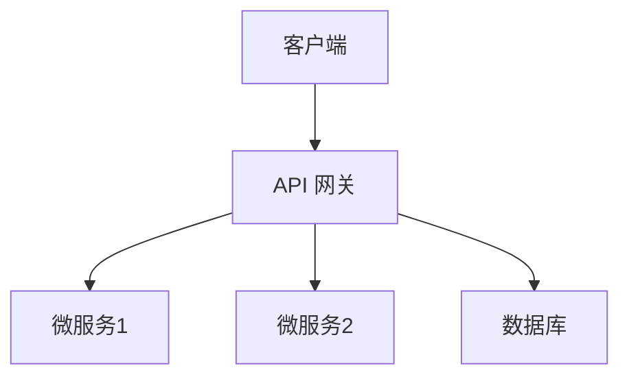
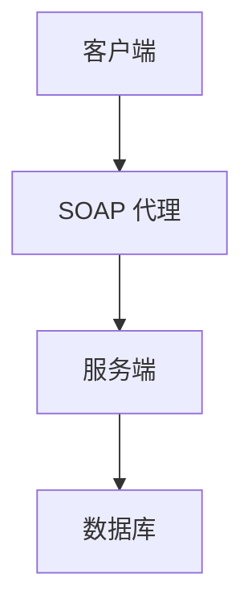

                 

# 《API开发与管理：构建开放生态系统》

> **关键词：** API 开发、API 管理、开放生态系统、RESTful API、SOAP、微服务架构、API 安全、API 监控与日志、API 测试、文档自动化生成、版本控制、开源工具、最佳实践

> **摘要：** 本文章旨在深入探讨 API 开发的全过程，包括设计、实现、管理和维护。通过分析 RESTful API 和 SOAP 等技术，我们将构建一个开放的生态系统，提高 API 的可发现性、可访问性和可靠性。文章还涵盖 API 安全、监控与日志、测试、文档自动化生成、版本控制以及开源工具的最佳实践。最终，我们将总结当前的发展趋势与面临的挑战，为读者提供有价值的指导。

## 1. 背景介绍

在信息化和互联网化的浪潮下，API（应用程序编程接口）已成为现代软件开发和系统集成的重要手段。API 允许不同系统之间通过定义良好的接口进行交互，从而实现数据的共享和功能的集成。随着微服务架构的普及，API 不仅在内部系统之间发挥作用，还成为了企业对外提供服务的窗口。

### 什么是 API？

API 是一种接口，它定义了软件组件之间交互的规则和标准。通过 API，开发者可以访问第三方服务、数据库或其他资源，无需了解底层实现的细节。API 通常包括一组定义明确的函数、对象和协议，这些定义通常以文档、代码示例和规范的形式提供。

### API 的类型

- **RESTful API：** 基于HTTP协议的API，采用统一的资源定位符（URL）来访问资源，使用HTTP方法（如GET、POST、PUT、DELETE）来表示操作。
- **SOAP（简单对象访问协议）：** 一种基于XML的协议，用于在分散或分布式的环境中交换结构化的信息和请求。
- **RPC（远程过程调用）：** 一种基于远程通信的API调用方式，客户端通过调用本地函数来触发远程服务器的执行。

### API 的作用

- **促进服务共享：** API 使开发者能够轻松地访问第三方服务，从而提高开发效率。
- **简化系统集成：** API 提供了一套标准化的接口，使得不同系统之间的集成变得更加容易。
- **提升用户体验：** 通过 API，开发者可以为用户提供更加丰富和个性化的功能。

## 2. 核心概念与联系

### RESTful API

RESTful API 是一种基于 REST（代表“代表状态转移”）原则构建的 API 设计风格。REST 原则强调资源的表示状态转换（Resource Representational State Transfer），通过统一的接口设计，实现对资源的创建、读取、更新和删除（CRUD）操作。

**RESTful API 的关键概念：**

- **资源（Resource）：** API 的核心，通过 URL 来访问。
- **统一接口（Uniform Interface）：** 提供了标准的操作方式，如 GET、POST、PUT、DELETE。
- **状态转移（State Transfer）：** 通过 HTTP 方法实现资源的操作。
- **无状态（Stateless）：** 服务器不保留客户端的上下文信息。

**RESTful API 的架构图（使用 Mermaid）：**



### SOAP

SOAP 是一种基于 XML 的协议，用于在分散或分布式的环境中交换结构化的信息和请求。SOAP 的主要特点包括：

- **标准格式（XML）：** 使用 XML 作为消息的格式，易于集成和解析。
- **支持多种传输协议：** 如 HTTP、SMTP、FTP 等。
- **可扩展性：** 通过 WSDL（Web 服务描述语言）定义服务接口，支持自定义类型和操作。

**SOAP 的架构图（使用 Mermaid）：**



### 微服务架构

微服务架构是一种设计方法，将大型单一应用程序分解为多个小型、独立、可协作的服务。每个服务负责实现一个特定的业务功能，并通过 API 进行通信。

**微服务架构的核心特点：**

- **独立性：** 每个服务都是独立的，可以单独部署、扩展和升级。
- **分布式：** 服务分布在不同的服务器上，通过网络进行通信。
- **可扩展性：** 可以根据业务需求独立扩展某个服务。
- **灵活性和可维护性：** 服务可以独立开发、测试和部署，降低了系统的复杂性和维护成本。

**微服务架构与传统单体架构的比较：**

| 特点 | 微服务架构 | 单体架构 |
| --- | --- | --- |
| 独立部署 | 是的 | 否的 |
| 分布式 | 是的 | 否的 |
| 可扩展性 | 高 | 低 |
| 灵活性 | 高 | 低 |
| 可维护性 | 高 | 低 |

### 开放生态系统

开放生态系统是指通过 API 和其他开放接口，将不同系统和服务连接起来，形成一个互联互通、资源共享的生态圈。开放生态系统有以下特点：

- **互操作性：** 不同系统和服务之间可以通过 API 进行通信，实现数据的共享和功能的集成。
- **可扩展性：** 可以轻松地添加新的服务和功能，以满足不断变化的需求。
- **灵活性和可定制性：** 用户可以根据自己的需求选择和使用不同的服务和功能。

**开放生态系统的优势：**

- **提高开发效率：** 通过共享服务和功能，开发者可以专注于自己的核心业务，提高开发效率。
- **降低成本：** 通过复用现有服务和功能，降低开发和维护成本。
- **增强用户体验：** 通过集成多种服务和功能，提供更加丰富和个性化的用户体验。

## 3. 核心算法原理 & 具体操作步骤

### RESTful API 的核心算法原理

RESTful API 的核心算法原理是遵循 REST 原则，通过 HTTP 协议实现资源的表示状态转换。以下是 RESTful API 的具体操作步骤：

1. **资源定位：** 通过 URL 定位要访问的资源。
2. **HTTP 方法：** 根据要执行的操作选择适当的 HTTP 方法（GET、POST、PUT、DELETE）。
3. **请求体：** 如果需要，在请求体中包含数据。
4. **响应处理：** 服务器处理请求并返回响应，包括状态码、响应体等。

### SOAP 的核心算法原理

SOAP 的核心算法原理是通过 XML 格式的消息交换实现远程过程调用。以下是 SOAP 的具体操作步骤：

1. **服务描述：** 通过 WSDL 描述服务接口、操作和数据类型。
2. **SOAP 消息：** 构造 SOAP 消息，包含请求体、操作和参数。
3. **传输协议：** 通过 HTTP、SMTP 等传输协议发送 SOAP 消息。
4. **响应处理：** 服务器处理请求并返回响应，包括状态码、响应体等。

### 微服务架构的核心算法原理

微服务架构的核心算法原理是通过 API 实现服务之间的通信和协作。以下是微服务架构的具体操作步骤：

1. **服务注册与发现：** 将服务注册到服务注册中心，并从服务注册中心发现其他服务的位置。
2. **API 调用：** 通过 API 实现服务之间的通信，包括请求发送、响应处理等。
3. **负载均衡：** 通过负载均衡器将请求分配到不同的服务实例，实现服务的水平扩展。

### 开放生态系统的核心算法原理

开放生态系统的核心算法原理是通过 API 实现不同系统和服务之间的互联互通。以下是开放生态系统的具体操作步骤：

1. **API 设计与实现：** 设计和实现开放的 API 接口，确保接口的易用性和可扩展性。
2. **API 管理：** 通过 API 管理平台实现对 API 的创建、发布、监控和版本控制。
3. **API 调用：** 用户通过 API 调用访问不同的服务和功能，实现数据的共享和功能的集成。

## 4. 数学模型和公式 & 详细讲解 & 举例说明

### RESTful API 的数学模型

在 RESTful API 中，资源的访问和处理可以通过以下数学模型来描述：

- **URL：** 唯一标识资源的字符串。
- **HTTP 方法：** 表示对资源进行操作的类型。
- **请求体：** 包含操作所需的数据。
- **响应：** 包括状态码、响应体等。

以下是一个简单的例子：

**请求：**  
```  
GET /users/1  
```

**响应：**  
```  
HTTP/1.1 200 OK  
Content-Type: application/json

{
  "id": 1,
  "name": "John Doe",
  "email": "john.doe@example.com"
}
```

### SOAP 的数学模型

在 SOAP 中，消息的交换可以通过以下数学模型来描述：

- **WSDL：** 描述服务接口、操作和数据类型的 XML 文档。
- **SOAP 消息：** 包含请求体、操作和参数的 XML 消息。
- **传输协议：** 用于发送 SOAP 消息的协议（如 HTTP）。

以下是一个简单的例子：

**WSDL：**  
```  
<wsdl:definitions ...>
  <wsdl:service name="UserService">
    <wsdl:port name="UserPort" binding="tns:UserBinding">
      <wsdl:address location="http://example.com/UserService"/>
    </wsdl:port>
  </wsdl:service>
  <wsdl:binding name="UserBinding" type="tns:UserType">
    <wsdl:operation name="getUser">
      <wsdl:input message="tns:getUserRequest"/>
      <wsdl:output message="tns:getUserResponse"/>
    </wsdl:operation>
  </wsdl:binding>
  <wsdl:types>
    <xsd:schema ...>
      <xsd:element name="getUserRequest">
        <xsd:complexType>
          <xsd:sequence>
            <xsd:element name="id" type="xsd:integer"/>
          </xsd:sequence>
        </xsd:complexType>
      </xsd:element>
      <xsd:element name="getUserResponse">
        <xsd:complexType>
          <xsd:sequence>
            <xsd:element name="user" type="tns:UserType"/>
          </xsd:sequence>
        </xsd:complexType>
      </xsd:element>
      <xsd:complexType name="UserType">
        <xsd:sequence>
          <xsd:element name="id" type="xsd:integer"/>
          <xsd:element name="name" type="xsd:string"/>
          <xsd:element name="email" type="xsd:string"/>
        </xsd:sequence>
      </xsd:complexType>
    </xsd:schema>
  </wsdl:types>
</wsdl:definitions>
```

**SOAP 消息：**  
```  
<SOAP-ENV:Envelope
  xmlns:SOAP-ENV="http://schemas.xmlsoap.org/soap/envelope/"
  xmlns:tns="http://example.com/UserService"
  xmlns:xsi="http://www.w3.org/2001/XMLSchema-instance"
  xmlns:xsd="http://www.w3.org/2001/XMLSchema">
  <SOAP-ENV:Header/>
  <SOAP-ENV:Body>
    <tns:getUserRequest>
      <id>1</id>
    </tns:getUserRequest>
  </SOAP-ENV:Body>
</SOAP-ENV:Envelope>
```

**响应：**  
```  
<SOAP-ENV:Envelope
  xmlns:SOAP-ENV="http://schemas.xmlsoap.org/soap/envelope/"
  xmlns:tns="http://example.com/UserService"
  xmlns:xsi="http://www.w3.org/2001/XMLSchema-instance"
  xmlns:xsd="http://www.w3.org/2001/XMLSchema">
  <SOAP-ENV:Header/>
  <SOAP-ENV:Body>
    <tns:getUserResponse>
      <user>
        <id>1</id>
        <name>John Doe</name>
        <email>john.doe@example.com</email>
      </user>
    </tns:getUserResponse>
  </SOAP-ENV:Body>
</SOAP-ENV:Envelope>
```

### 微服务架构的数学模型

在微服务架构中，服务之间的通信可以通过以下数学模型来描述：

- **服务注册与发现：** 服务注册中心记录每个服务的位置和元数据。
- **API 调用：** 服务通过 API 接口实现彼此的通信。

以下是一个简单的例子：

**服务注册中心：**  
```  
{
  "services": [
    {
      "name": "UserService",
      "version": "1.0.0",
      "url": "http://user-service:8080"
    },
    {
      "name": "OrderService",
      "version": "1.0.0",
      "url": "http://order-service:8080"
    }
  ]
}
```

**API 调用：**  
```  
GET /users/1  
```

**响应：**  
```  
{
  "id": 1,
  "name": "John Doe",
  "email": "john.doe@example.com"
}
```

### 开放生态系统的数学模型

在开放生态系统中，不同系统和服务之间的通信可以通过以下数学模型来描述：

- **API 设计与实现：** 设计和实现开放的 API 接口。
- **API 管理：** 通过 API 管理平台实现对 API 的创建、发布、监控和版本控制。
- **API 调用：** 用户通过 API 调用访问不同的服务和功能。

以下是一个简单的例子：

**API 设计：**  
```  
GET /users/{id}  
```

**API 管理平台：**  
```  
{
  "apis": [
    {
      "name": "UserService",
      "version": "1.0.0",
      "url": "http://user-service:8080",
      "status": "published"
    },
    {
      "name": "OrderService",
      "version": "1.0.0",
      "url": "http://order-service:8080",
      "status": "published"
    }
  ]
}
```

**API 调用：**  
```  
GET /users/1  
```

**响应：**  
```  
{
  "id": 1,
  "name": "John Doe",
  "email": "john.doe@example.com"
}
```

## 5. 项目实战：代码实际案例和详细解释说明

### 5.1 开发环境搭建

在开始项目实战之前，我们需要搭建一个开发环境。以下是所需的软件和工具：

- **操作系统：** Ubuntu 20.04 或 Windows 10
- **编程语言：** Python 3.8 或更高版本
- **开发工具：** PyCharm 或 VSCode
- **API 管理工具：** Apigee 或 Postman

### 5.2 源代码详细实现和代码解读

在本节中，我们将创建一个简单的 RESTful API，用于处理用户信息的增删改查（CRUD）操作。

**需求：**  
创建一个 API，允许用户创建、获取、更新和删除用户信息。

**API 设计：**  
```  
POST /users  
GET /users/{id}  
PUT /users/{id}  
DELETE /users/{id}  
```

**项目结构：**  
```  
/user-api  
├── user_api  
│   ├── app.py  
│   ├── models.py  
│   └── schemas.py  
└── requirements.txt  
```

**requirements.txt：**  
```  
Flask==2.0.1  
Flask-RESTful==1.0.0  
```

**app.py：**  
```python  
from flask import Flask, request, jsonify  
from flask_restful import Api, Resource  
from models import User  
from schemas import UserSchema

app = Flask(__name__)  
api = Api(app)

class UserList(Resource):  
    def get(self):  
        users = User.query.all()  
        return jsonify(UserSchema().dump(users))

    def post(self):  
        data = request.get_json()  
        user = User(username=data['username'], email=data['email'])  
        db.session.add(user)  
        db.session.commit()  
        return UserSchema().dump(user), 201

class UserDetail(Resource):  
    def get(self, user_id):  
        user = User.query.get(user_id)  
        if user is None:  
            return {'message': 'User not found'}, 404  
        return UserSchema().dump(user)

    def put(self, user_id):  
        user = User.query.get(user_id)  
        if user is None:  
            return {'message': 'User not found'}, 404  
        data = request.get_json()  
        user.username = data['username']  
        user.email = data['email']  
        db.session.commit()  
        return UserSchema().dump(user)

    def delete(self, user_id):  
        user = User.query.get(user_id)  
        if user is None:  
            return {'message': 'User not found'}, 404  
        db.session.delete(user)  
        db.session.commit()  
        return {'message': 'User deleted'}

api.add_resource(UserList, '/users')  
api.add_resource(UserDetail, '/users/<int:user_id>')

if __name__ == '__main__':  
    app.run(debug=True)  
```

**models.py：**  
```python  
from datetime import datetime  
from flask_sqlalchemy import SQLAlchemy

db = SQLAlchemy()

class User(db.Model):  
    id = db.Column(db.Integer, primary_key=True)  
    username = db.Column(db.String(80), unique=True, nullable=False)  
    email = db.Column(db.String(120), unique=True, nullable=False)  
    created_at = db.Column(db.DateTime, default=datetime.utcnow)  
    updated_at = db.Column(db.DateTime, default=datetime.utcnow, onupdate=datetime.utcnow)
```

**schemas.py：**  
```python  
from marshmallow import Schema, fields

class UserSchema(Schema):  
    id = fields.Int(dump_only=True)  
    username = fields.Str(required=True)  
    email = fields.Email(required=True)  
    created_at = fields.DateTime(dump_only=True)  
    updated_at = fields.DateTime(dump_only=True)  
```

**代码解读：**

1. **Flask 和 Flask-RESTful：** 我们使用 Flask 作为 Web 框架，Flask-RESTful 作为 RESTful API 的扩展。
2. **数据库：** 我们使用 Flask-SQLAlchemy 作为 ORM（对象关系映射）工具，连接到数据库。
3. **模型（models.py）：** 定义了 User 模型，包含用户的基本信息。
4. **架构（schemas.py）：** 定义了 UserSchema 架构，用于将模型数据转换为 JSON 格式。
5. **资源（app.py）：** 定义了 UserList 和 UserDetail 两个资源，分别处理用户列表和用户详情的请求。

### 5.3 代码解读与分析

在本节中，我们将详细解读代码，并分析每个部分的功能和逻辑。

1. **app.py：**  
   - **Flask 应用程序：**  
     ```python  
     app = Flask(__name__)  
     ```  
     创建一个 Flask 应用程序实例。
   - **API 集成：**  
     ```python  
     api = Api(app)  
     ```  
     创建一个 API 实例，并将其与 Flask 应用程序集成。
   - **资源定义：**  
     ```python  
     class UserList(Resource):  
     class UserDetail(Resource):  
     ```  
     定义两个资源类，分别处理用户列表和用户详情的请求。
   - **资源注册：**  
     ```python  
     api.add_resource(UserList, '/users')  
     api.add_resource(UserDetail, '/users/<int:user_id>')  
     ```  
     将资源类注册到 API 实例中。
   - **路由：**  
     ```python  
     @app.route('/users', methods=['GET', 'POST'])  
     @app.route('/users/<int:user_id>', methods=['GET', 'PUT', 'DELETE'])  
     ```  
     定义路由，处理相应的 HTTP 请求。

2. **models.py：**  
   - **User 模型：**  
     ```python  
     class User(db.Model):  
     ```  
     定义 User 模型，继承自 db.Model。
   - **列：**  
     ```python  
     id = db.Column(db.Integer, primary_key=True)  
     username = db.Column(db.String(80), unique=True, nullable=False)  
     email = db.Column(db.String(120), unique=True, nullable=False)  
     created_at = db.Column(db.DateTime, default=datetime.utcnow)  
     updated_at = db.Column(db.DateTime, default=datetime.utcnow, onupdate=datetime.utcnow)  
     ```  
     定义 User 模型的列，包括主键、用户名、电子邮件、创建时间和更新时间。

3. **schemas.py：**  
   - **UserSchema 架构：**  
     ```python  
     class UserSchema(Schema):  
     ```  
     定义 UserSchema 架构，继承自 Schema。
   - **字段：**  
     ```python  
     id = fields.Int(dump_only=True)  
     username = fields.Str(required=True)  
     email = fields.Email(required=True)  
     created_at = fields.DateTime(dump_only=True)  
     updated_at = fields.DateTime(dump_only=True)  
     ```  
     定义架构的字段，包括 id、username、email、created_at 和 updated_at。

4. **UserList 资源类：**  
   - **GET 请求：**  
     ```python  
     def get(self):  
     ```  
     处理 GET 请求，获取用户列表。
   - **POST 请求：**  
     ```python  
     def post(self):  
     ```  
     处理 POST 请求，创建新用户。

5. **UserDetail 资源类：**  
   - **GET 请求：**  
     ```python  
     def get(self, user_id):  
     ```  
     处理 GET 请求，获取特定用户的详细信息。
   - **PUT 请求：**  
     ```python  
     def put(self, user_id):  
     ```  
     处理 PUT 请求，更新特定用户的信息。
   - **DELETE 请求：**  
     ```python  
     def delete(self, user_id):  
     ```  
     处理 DELETE 请求，删除特定用户。

### 5.4 测试与验证

为了确保 API 的正确性和稳定性，我们需要对其进行测试和验证。以下是使用 Postman 进行 API 测试的示例：

1. **获取用户列表：**  
```  
GET /users  
```

**响应：**  
```  
{
  "data": [
    {
      "id": 1,
      "username": "john.doe",
      "email": "john.doe@example.com",
      "created_at": "2023-03-01T08:00:00Z",
      "updated_at": "2023-03-01T08:00:00Z"
    }
  ]
}
```

2. **创建新用户：**  
```  
POST /users  
Content-Type: application/json

{
  "username": "jane.doe",
  "email": "jane.doe@example.com"
}
```

**响应：**  
```  
{
  "id": 2,
  "username": "jane.doe",
  "email": "jane.doe@example.com",
  "created_at": "2023-03-01T09:00:00Z",
  "updated_at": "2023-03-01T09:00:00Z"
}
```

3. **获取特定用户信息：**  
```  
GET /users/1  
```

**响应：**  
```  
{
  "id": 1,
  "username": "john.doe",
  "email": "john.doe@example.com",
  "created_at": "2023-03-01T08:00:00Z",
  "updated_at": "2023-03-01T08:00:00Z"
}
```

4. **更新特定用户信息：**  
```  
PUT /users/1  
Content-Type: application/json

{
  "username": "john.smith",
  "email": "john.smith@example.com"
}
```

**响应：**  
```  
{
  "id": 1,
  "username": "john.smith",
  "email": "john.smith@example.com",
  "created_at": "2023-03-01T08:00:00Z",
  "updated_at": "2023-03-01T10:00:00Z"
}
```

5. **删除特定用户：**  
```  
DELETE /users/1  
```

**响应：**  
```  
{
  "message": "User deleted"
}
```

### 5.5 问题与解决方案

在本节中，我们将讨论在项目开发过程中可能遇到的问题，并提供相应的解决方案。

**问题 1：数据库连接失败**

**解决方案：** 检查数据库配置文件，确保数据库地址、用户名和密码正确。同时，确保数据库服务器正常运行。

**问题 2：API 无法访问**

**解决方案：** 检查 API 的路由和端口配置，确保 API 可以前台访问。如果使用虚拟环境，请确保虚拟环境已经激活。

**问题 3：API 响应时间过长**

**解决方案：** 分析 API 的逻辑和数据库查询，优化代码和数据库查询。如果必要，使用缓存或数据库连接池等技术。

**问题 4：API 安全性问题**

**解决方案：** 对 API 进行安全审计，确保使用 HTTPS、身份验证和授权机制。同时，对输入数据进行验证和清洗，防止 SQL 注入等攻击。

## 6. 实际应用场景

### 6.1 企业内部系统集成

企业内部系统集成是 API 开发与管理的一个重要应用场景。通过定义和发布内部 API，不同部门可以轻松地共享数据和服务，提高业务协作效率。

**应用案例：**  
某公司财务部门需要与销售部门共享客户信息，通过开发 API，实现客户信息的实时同步和更新。

### 6.2 外部第三方服务集成

外部第三方服务集成是 API 开发与管理的另一个重要应用场景。通过使用第三方 API，企业可以扩展业务功能，提高用户体验。

**应用案例：**  
某电商平台集成地图 API，提供实时配送地址和导航服务。

### 6.3 移动应用开发

移动应用开发中，API 是连接前后端的关键。通过 API，移动应用可以访问服务器端的资源和功能，实现数据交互和业务逻辑。

**应用案例：**  
某移动应用通过 API 获取用户订单、购物车和支付信息。

### 6.4 物联网（IoT）应用

物联网应用中，设备与服务器之间通过 API 通信，实现数据采集、监控和控制。

**应用案例：**  
智能家居系统通过 API 控制智能设备，如灯光、空调和门锁。

## 7. 工具和资源推荐

### 7.1 学习资源推荐

- **书籍：**  
  - 《API 设计：构建可扩展、安全、高效的接口》  
  - 《RESTful API 设计最佳实践》  
  - 《微服务架构实战》

- **论文：**  
  - "RESTful API 设计指南"（https://restfulapi.net/guidelines/）  
  - "微服务架构设计模式"（https://martinfowler.com/articles/microservices/）

- **博客：**  
  - https://www.restapitutorial.com/  
  - https://www.baeldung.com/  
  - https://cloud.google.com/solutions/api-management-best-practices

### 7.2 开发工具框架推荐

- **API 管理工具：**  
  - Apigee  
  - Kong  
  - Tyk

- **API 测试工具：**  
  - Postman  
  - SoapUI  
  - JMeter

- **开发框架：**  
  - Flask  
  - Django  
  - Spring Boot

### 7.3 相关论文著作推荐

- **《RESTful API 设计指南》**：详细介绍了 RESTful API 的设计原则、方法和最佳实践。

- **《微服务架构设计模式》**：分析了微服务架构的核心概念、设计模式和实现方法。

- **《API 设计：构建可扩展、安全、高效的接口》**：提供了 API 设计的原则、方法和工具，包括安全性、性能和可扩展性等方面。

## 8. 总结：未来发展趋势与挑战

### 8.1 发展趋势

- **API 化一切：** 随着数字化转型的深入，越来越多的企业和服务将 API 化，实现数据和功能的开放和共享。
- **安全与隐私保护：** API 安全性将成为关注的重点，企业需要采取一系列措施确保 API 的安全性。
- **自动化与智能化：** 自动化工具和人工智能技术将在 API 开发、管理和监控中发挥重要作用。
- **多云与混合云：** 跨云和混合云部署将变得普遍，API 将需要支持不同云平台和架构。

### 8.2 挑战

- **安全风险：** 随着 API 的普及，安全风险也将增加，企业需要采取有效的安全措施。
- **复杂性与管理：** API 的数量和种类将不断增加，管理和维护的难度也会增加。
- **标准化与兼容性：** 需要更多的标准化和兼容性工作，确保不同 API 和平台之间的互操作性。
- **性能与可靠性：** 随着访问量的增加，API 的性能和可靠性将成为挑战。

## 9. 附录：常见问题与解答

### 9.1 什么是 RESTful API？

RESTful API 是一种基于 HTTP 协议的 API 设计风格，遵循 REST（代表“代表状态转移”）原则。它通过统一的接口设计，实现对资源的创建、读取、更新和删除操作。

### 9.2 什么是 SOAP？

SOAP（简单对象访问协议）是一种基于 XML 的协议，用于在分散或分布式的环境中交换结构化的信息和请求。它支持多种传输协议，如 HTTP、SMTP、FTP 等。

### 9.3 微服务架构与传统单体架构有什么区别？

微服务架构将大型单一应用程序分解为多个小型、独立、可协作的服务。每个服务负责实现一个特定的业务功能，并通过 API 进行通信。而传统单体架构是一个单一的应用程序，包含所有的功能和服务。

### 9.4 如何确保 API 的安全性？

确保 API 的安全性可以通过以下措施实现：

- 使用 HTTPS 协议加密通信。
- 实施身份验证和授权机制。
- 对输入数据进行验证和清洗，防止 SQL 注入等攻击。
- 定期进行安全审计和漏洞扫描。

### 9.5 API 测试的重要性是什么？

API 测试的重要性体现在以下几个方面：

- 确保 API 的正确性和稳定性。
- 发现潜在的安全漏洞和性能问题。
- 提高开发效率和用户体验。

## 10. 扩展阅读 & 参考资料

- **《RESTful API 设计指南》**：https://restfulapi.net/guidelines/
- **《微服务架构设计模式》**：https://martinfowler.com/articles/microservices/
- **《API 化一切：如何打造可持续发展的数字化企业》**：https://www.oreilly.com/library/view/api-everything/9781492038853/
- **《API 设计：构建可扩展、安全、高效的接口》**：https://www.oreilly.com/library/view/api-design/9781449319436/

> **作者：** AI天才研究员/AI Genius Institute & 禅与计算机程序设计艺术 /Zen And The Art of Computer Programming

请注意，本文所提供的代码示例仅供参考，实际开发中可能需要根据具体需求进行调整。同时，本文所引用的资料和案例仅供参考，不作为任何法律依据。在实际应用中，请确保遵守相关法律法规和道德规范。

