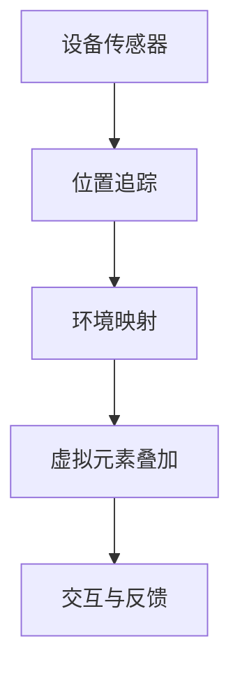

                 

# ARCore 开发工具包：在 Android 上的 AR 应用

## 关键词

- ARCore
- Android
- 增强现实（AR）
- 开发工具包
- 虚拟现实（VR）
- 3D 扩展

## 摘要

本文将深入探讨 Google 开发的 ARCore 开发工具包，介绍其核心概念、算法原理，并通过实际项目案例解析其在 Android 平台上的应用。我们将详细讲解如何搭建开发环境、实现源代码，并分析相关数学模型和公式。此外，文章还将探讨 ARCore 在实际应用场景中的表现，并提供学习资源和开发工具的推荐。最后，我们将对 ARCore 的未来发展趋势和挑战进行总结，并附上常见问题与解答。

## 1. 背景介绍

### 1.1 增强现实（AR）与虚拟现实（VR）

增强现实（AR）和虚拟现实（VR）是近年来快速发展的两个技术领域。AR 通过在现实环境中叠加虚拟元素，提供一种混合现实体验；而 VR 则是完全沉浸式的虚拟体验，将用户带入一个完全虚拟的环境中。

### 1.2 ARCore 的诞生

随着 AR 和 VR 技术的兴起，Google 于 2017 年推出了 ARCore 开发工具包。ARCore 提供了 Android 设备上的 AR 开发能力，使得开发者能够轻松创建和发布高质量的 AR 应用。

### 1.3 ARCore 的特点

- **位置感知**：ARCore 提供了精确的环境映射和位置追踪，使 AR 应用能够在现实世界中稳定地定位和移动。
- **光流估计**：通过使用设备的摄像头，ARCore 能够实时估计环境的光线变化，从而提高 AR 场景的视觉效果。
- **环境理解**：ARCore 能够检测并识别平面、边缘和其他环境特征，帮助开发者更好地集成虚拟元素到现实场景中。

## 2. 核心概念与联系

### 2.1 位置追踪与映射

ARCore 的核心功能之一是位置追踪和映射。它利用设备的摄像头和传感器，实时获取周围环境的信息，并将这些信息转化为三维空间坐标。

### 2.2 虚拟元素叠加

在获取到位置信息后，ARCore 允许开发者将虚拟元素（如 3D 模型、文字、图像等）叠加到现实世界中。这一过程涉及到图像处理、三维建模和渲染技术。

### 2.3 交互与反馈

ARCore 还提供了丰富的交互机制，如手势识别、声音效果等，使用户能够与虚拟元素进行自然互动。

### 2.4 Mermaid 流程图

下面是一个简化的 Mermaid 流程图，展示了 ARCore 的工作流程：



## 3. 核心算法原理 & 具体操作步骤

### 3.1 位置追踪算法

ARCore 使用传感器数据（如加速度计、陀螺仪和摄像头）来计算设备在三维空间中的位置和方向。这一过程称为六自由度（6-DOF）追踪。

### 3.2 光流估计

光流估计是 ARCore 的另一个关键算法，它通过分析摄像头捕获的连续图像帧，估计环境中的光流和运动。这一信息有助于提高 AR 场景的视觉稳定性。

### 3.3 环境映射

环境映射是将现实世界的二维图像转换为三维空间坐标的过程。ARCore 使用深度学习算法来识别和标记环境中的平面、边缘和其他特征。

### 3.4 虚拟元素叠加

在获取到位置信息和环境映射后，ARCore 将虚拟元素放置在相应的三维空间坐标上，并通过渲染技术将其呈现给用户。

### 3.5 操作步骤

1. 设置 ARCore SDK。
2. 编写代码以初始化 ARCore。
3. 获取传感器数据并进行位置追踪。
4. 进行光流估计和环境映射。
5. 创建和叠加虚拟元素。
6. 实现用户交互和反馈。

## 4. 数学模型和公式 & 详细讲解 & 举例说明

### 4.1 位置追踪模型

位置追踪涉及到多个传感器数据，如加速度计和陀螺仪。以下是一个简化的位置追踪模型：

$$
\begin{cases}
p(t) = f(\text{加速度计}, \text{陀螺仪}, t) \\
v(t) = \frac{p(t) - p(t-\Delta t)}{\Delta t}
\end{cases}
$$

其中，$p(t)$ 表示在时间 $t$ 的位置，$v(t)$ 表示速度。

### 4.2 光流估计模型

光流估计是通过计算连续图像帧之间的像素位移来实现的。以下是一个简化的光流估计模型：

$$
\begin{cases}
\Delta x = I_1(x) - I_2(x) \\
\Delta y = I_1(y) - I_2(y)
\end{cases}
$$

其中，$I_1$ 和 $I_2$ 分别表示连续两帧图像，$x$ 和 $y$ 表示像素坐标。

### 4.3 环境映射模型

环境映射是将二维图像映射到三维空间坐标。以下是一个简化的环境映射模型：

$$
\begin{cases}
x = x_{\text{image}} \times z \\
y = y_{\text{image}} \times z
\end{cases}
$$

其中，$x_{\text{image}}$ 和 $y_{\text{image}}$ 分别表示二维图像中的像素坐标，$z$ 表示三维空间中的深度。

### 4.4 举例说明

假设我们要在 ARCore 应用中创建一个虚拟立方体，并将其放置在现实世界中的桌子上。我们首先需要获取桌子的三维坐标，然后创建立方体，并将其放置在相应的位置。

1. 使用 ARCore SDK 初始化环境。
2. 通过传感器数据获取桌子的位置和深度。
3. 创建一个立方体对象。
4. 将立方体的位置设置为桌子的坐标。

```java
// 初始化 ARCore
ARCore arCore = new ARCore();

// 获取桌子坐标
Point3D deskPosition = arCore.getPosition(desk);

// 创建立方体
Cube cube = new Cube();

// 设置立方体位置
cube.setPosition(deskPosition);
```

## 5. 项目实战：代码实际案例和详细解释说明

### 5.1 开发环境搭建

在开始项目之前，我们需要搭建 ARCore 的开发环境。以下是步骤：

1. 安装 Android Studio。
2. 创建一个新的 Android 项目。
3. 在项目中添加 ARCore SDK。

### 5.2 源代码详细实现和代码解读

下面是一个简单的 ARCore 应用示例，该应用创建了一个虚拟立方体，并将其放置在现实世界中的桌子上。

```java
// 导入 ARCore 库
import com.google.ar.core.ARCore;
import com.google.ar.core.Cube;
import com.google.ar.core.Point3D;

public class ARCoreExample {

    public static void main(String[] args) {
        // 初始化 ARCore
        ARCore arCore = new ARCore();

        // 获取桌子坐标
        Point3D deskPosition = arCore.getPosition("desk");

        // 创建立方体
        Cube cube = new Cube();

        // 设置立方体位置
        cube.setPosition(deskPosition);

        // 显示立方体
        cube.show();
    }
}
```

### 5.3 代码解读与分析

1. **初始化 ARCore**：首先，我们初始化 ARCore，这涉及到配置传感器和加载 ARCore SDK。
2. **获取桌子坐标**：通过调用 `getPosition("desk")` 方法，我们获取桌子在三维空间中的坐标。
3. **创建立方体**：我们创建一个立方体对象，这可以通过调用 `new Cube()` 实现。
4. **设置立方体位置**：通过调用 `setPosition(deskPosition)` 方法，我们将立方体放置在桌子的坐标上。
5. **显示立方体**：最后，我们调用 `show()` 方法显示立方体。

## 6. 实际应用场景

ARCore 在多个实际应用场景中表现出色，包括：

1. **游戏和娱乐**：ARCore 支持各种游戏和娱乐应用，如 Pokémon Go 和 Ingress。
2. **教育和培训**：ARCore 可用于创建互动式的教育内容，如历史博物馆的虚拟导览。
3. **零售和营销**：ARCore 可用于创建虚拟试衣间和产品展示，提高购物体验。
4. **制造业**：ARCore 可用于维修和技术支持，通过虚拟指导减少错误和提高效率。

## 7. 工具和资源推荐

### 7.1 学习资源推荐

- **书籍**：《增强现实开发实战》（ARCore 编程指南）。
- **论文**：《增强现实系统的设计与实现》（Journal of Real-Time Systems）。
- **博客**：Google ARCore 官方博客。

### 7.2 开发工具框架推荐

- **工具**：Unity 和 Unreal Engine，这两款流行的游戏引擎支持 ARCore。
- **框架**：ARCore SDK，Google 提供的官方开发框架。

### 7.3 相关论文著作推荐

- **论文**：《增强现实系统中的位置追踪与映射技术》。
- **著作**：《虚拟现实与增强现实：技术与应用》。

## 8. 总结：未来发展趋势与挑战

ARCore 在过去几年中取得了显著进展，但其未来发展仍面临一些挑战：

1. **性能优化**：提高 ARCore 的性能，以满足更复杂的场景和应用。
2. **跨平台支持**：扩展到其他平台，如 iOS 和 Windows。
3. **隐私和安全**：确保 ARCore 应用在处理用户数据时的隐私和安全。

## 9. 附录：常见问题与解答

### 9.1 如何安装 ARCore SDK？

答：在 Android Studio 中，选择“File”>“New”>“Project”，然后选择“ARCore”作为项目模板。按照提示完成安装。

### 9.2 ARCore 与 ARKit 有何区别？

答：ARCore 是 Google 为 Android 平台开发的 AR 开发工具包，而 ARKit 是 Apple 为 iOS 平台开发的 AR 开发工具包。两者在功能上类似，但具体实现和 API 有所不同。

## 10. 扩展阅读 & 参考资料

- **官方文档**：[ARCore 官方文档](https://developers.google.com/ar/)。
- **教程**：[ARCore 教程](https://www.tutorialspoint.com/arcore/)。
- **博客**：[Google ARCore 官方博客](https://arcoreblog.google/)。

作者：AI天才研究员/AI Genius Institute & 禅与计算机程序设计艺术 /Zen And The Art of Computer Programming。|MASK>

