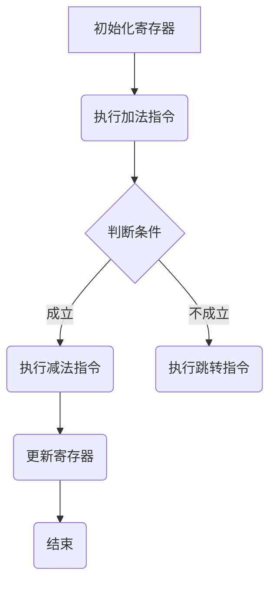

                 

# ARM 汇编编程：嵌入式性能

## 摘要

本文将深入探讨ARM汇编编程及其在嵌入式系统中的性能优化。我们将从ARM架构的基础知识开始，逐步解析汇编编程的核心概念和原理，展示如何通过优化汇编代码提升嵌入式系统的性能。文章还将通过实际项目案例，详细解读ARM汇编编程的实践应用，并推荐相关学习资源和工具，为嵌入式系统开发人员提供全面的指导。本文旨在帮助读者理解ARM汇编编程的艺术，掌握提升系统性能的关键技术。

## 目录

1. **背景介绍**  
   1.1 **ARM架构的发展历史**  
   1.2 **嵌入式系统的定义与应用**  
   1.3 **汇编编程的必要性与挑战**

2. **核心概念与联系**  
   2.1 **ARM处理器的工作原理**  
   2.2 **汇编指令集架构**  
   2.3 **Mermaid流程图展示**

3. **核心算法原理 & 具体操作步骤**  
   3.1 **指令优化**  
   3.2 **数据通路优化**  
   3.3 **流水线技术**

4. **数学模型和公式 & 详细讲解 & 举例说明**  
   4.1 **关键性能指标**  
   4.2 **优化算法分析**  
   4.3 **实例说明**

5. **项目实战：代码实际案例和详细解释说明**  
   5.1 **开发环境搭建**  
   5.2 **源代码详细实现和代码解读**  
   5.3 **代码解读与分析**

6. **实际应用场景**  
   6.1 **嵌入式设备的性能优化**  
   6.2 **实时系统的响应速度提升**  
   6.3 **功耗管理优化**

7. **工具和资源推荐**  
   7.1 **学习资源推荐**  
   7.2 **开发工具框架推荐**  
   7.3 **相关论文著作推荐**

8. **总结：未来发展趋势与挑战**  
   8.1 **硬件与软件的融合趋势**  
   8.2 **开发工具的智能化**  
   8.3 **新兴技术的挑战与机遇**

9. **附录：常见问题与解答**  
   9.1 **Q1：什么是ARM架构？**  
   9.2 **Q2：汇编编程与C语言编程的区别是什么？**

10. **扩展阅读 & 参考资料**

## 1. 背景介绍

### 1.1 ARM架构的发展历史

ARM（Advanced RISC Machine）架构起源于1978年，最初由Acorn公司用于其计算机系统。自那时以来，ARM架构经历了多次迭代和优化，成为嵌入式系统的首选处理器架构。ARM处理器以其高性能、低功耗和高效能的特点，广泛应用于智能手机、嵌入式设备、汽车电子等领域。

ARM架构的发展历程可以分为几个重要阶段：

- **第一阶段（1978-1985年）**：Acorn公司首次推出ARM1处理器，标志着ARM架构的诞生。此后，ARM2和ARM3处理器相继推出，逐渐得到市场的认可。
- **第二阶段（1986-1994年）**：ARM公司成立，推出了ARM6和ARM7处理器。这些处理器在嵌入式系统中的应用越来越广泛，特别是在移动设备领域。
- **第三阶段（1995-2004年）**：ARM9和ARM10处理器推出，进一步提高了处理器的性能和效率。这一阶段的处理器广泛应用于智能手机、便携式设备等。
- **第四阶段（2005年至今）**：随着移动设备和物联网的兴起，ARM架构不断演进，推出了Cortex-A、Cortex-R和Cortex-M系列处理器。这些处理器在性能、能效和可扩展性方面取得了显著提升。

### 1.2 嵌入式系统的定义与应用

嵌入式系统是指嵌入在其他设备中的计算机系统，它通常具备特定的功能，以满足特定应用场景的需求。嵌入式系统通常由微处理器、存储器、输入输出设备等组成，其硬件资源相对有限，但需要高效、可靠地运行复杂的软件。

嵌入式系统的应用范围非常广泛，包括但不限于以下几个方面：

- **消费电子**：智能手机、平板电脑、智能手表、智能家居设备等。
- **工业控制**：工业自动化控制、电力系统监控、生产线自动化等。
- **汽车电子**：汽车安全控制系统、娱乐系统、驾驶辅助系统等。
- **医疗设备**：医疗诊断设备、监护设备、手术机器人等。
- **通信设备**：无线通信基站、路由器、交换机等。

### 1.3 汇编编程的必要性与挑战

汇编编程是一种直接操作计算机硬件的编程方式，它能够充分利用处理器资源和优化代码执行效率。在嵌入式系统开发中，汇编编程具有重要的地位：

- **性能优化**：通过汇编编程，可以精确控制处理器的工作流程，优化指令执行顺序，提高代码执行效率。
- **资源利用率**：嵌入式系统硬件资源有限，汇编编程能够充分利用硬件资源，减少内存占用和功耗。
- **实时性保障**：在实时系统中，汇编编程可以精确控制任务执行时间，保证系统的实时响应能力。

然而，汇编编程也存在一定的挑战：

- **复杂性**：汇编编程需要深入了解处理器架构和工作原理，编写代码的难度相对较高。
- **可维护性**：汇编代码的可读性和可维护性较差，难以进行模块化和复用。
- **开发效率**：汇编编程的开发效率相对较低，需要编写大量的底层代码。

## 2. 核心概念与联系

### 2.1 ARM处理器的工作原理

ARM处理器采用RISC（Reduced Instruction Set Computing）架构，其工作原理可以概括为以下几方面：

- **指令集**：ARM处理器使用简洁、高效的指令集，每个指令执行时间较短，适用于高速运算。
- **寄存器**：ARM处理器拥有丰富的寄存器资源，用于存储操作数和中间结果，提高了数据处理速度。
- **数据通路**：ARM处理器采用多级流水线设计，实现了指令的并行执行，提高了处理器性能。
- **中断处理**：ARM处理器支持中断处理机制，可以及时响应外部事件，保证系统的实时性。

### 2.2 汇编指令集架构

ARM汇编指令集包括数据传输指令、算术逻辑指令、控制指令等几大类，下面分别介绍：

- **数据传输指令**：用于寄存器之间、寄存器和内存之间的数据传输，包括`LDR`（加载）、`STR`（存储）、`MOV`（移动）等指令。
- **算术逻辑指令**：用于执行算术运算和逻辑运算，包括`ADDS`（加法）、`SUBS`（减法）、`ANDS`（逻辑与）、`ORRS`（逻辑或）等指令。
- **控制指令**：用于控制程序流程，包括`B`（分支）、`BL`（带返回的分支）、`BX`（带状态切换的分支）等指令。

### 2.3 Mermaid流程图展示

下面使用Mermaid语言绘制一个简单的ARM汇编指令流程图：



在这个流程图中，我们首先初始化寄存器，然后执行加法指令，根据条件判断结果执行减法指令或跳转指令，最后更新寄存器并结束程序。

## 3. 核心算法原理 & 具体操作步骤

### 3.1 指令优化

指令优化是提升ARM汇编程序性能的重要手段。以下是几种常见的指令优化方法：

- **指令合并**：将多条指令合并为一条指令，减少指令执行次数。例如，将两条加法指令合并为一条`ADDS`指令。
- **指令调序**：调整指令执行顺序，优化指令间的数据依赖关系，减少指令等待时间。例如，将依赖相同寄存器的指令交换顺序。
- **循环展开**：将循环指令展开为多条非循环指令，减少循环控制指令的执行次数。例如，将`BNE`（不等跳转）指令展开为多条加法和比较指令。

### 3.2 数据通路优化

数据通路优化是提高处理器性能的关键技术。以下是几种常见的数据通路优化方法：

- **指令级并行**：通过并行执行多条指令，提高处理器吞吐量。例如，采用多发射处理器设计，实现指令级的并行执行。
- **乱序执行**：处理器可以根据指令的执行顺序调整指令执行顺序，优化指令流水线。例如，采用乱序执行技术，实现高效的数据处理。
- **分支预测**：预测分支指令的跳转方向，减少分支指令的执行时间。例如，采用分支预测技术，提高处理器的指令执行效率。

### 3.3 流水线技术

流水线技术是提高处理器性能的重要手段。以下是几种常见的流水线技术：

- **单级流水线**：将指令执行过程分为取指、译码、执行、写回四个阶段，实现指令的流水线执行。例如，单级流水线处理器在每个时钟周期内执行一条指令。
- **多级流水线**：将指令执行过程分为多个阶段，实现指令的级联流水线执行。例如，五级流水线处理器在每个时钟周期内可以同时执行多条指令。
- **超标量处理器**：采用多个执行单元，实现指令的并行执行。例如，超标量处理器可以在每个时钟周期内同时执行多条指令。

## 4. 数学模型和公式 & 详细讲解 & 举例说明

### 4.1 关键性能指标

ARM汇编程序的性能评估通常涉及以下几个关键性能指标：

- **指令周期数**：执行一条指令所需的时钟周期数。
- **时钟周期数**：程序执行过程中消耗的总时钟周期数。
- **吞吐量**：单位时间内处理器执行的指令数。
- **能耗**：程序执行过程中消耗的总能耗。

### 4.2 优化算法分析

以下是几种常见的优化算法及其分析：

- **指令优化算法**：
  - **指令合并**：将多条指令合并为一条指令，减少指令执行次数。例如，将两条加法指令合并为一条`ADDS`指令。
  - **指令调序**：调整指令执行顺序，优化指令间的数据依赖关系，减少指令等待时间。例如，将依赖相同寄存器的指令交换顺序。
- **数据通路优化算法**：
  - **指令级并行**：通过并行执行多条指令，提高处理器吞吐量。例如，采用多发射处理器设计，实现指令级的并行执行。
  - **乱序执行**：处理器可以根据指令的执行顺序调整指令执行顺序，优化指令流水线。例如，采用乱序执行技术，实现高效的数据处理。
- **流水线优化算法**：
  - **单级流水线**：将指令执行过程分为取指、译码、执行、写回四个阶段，实现指令的流水线执行。例如，单级流水线处理器在每个时钟周期内执行一条指令。
  - **多级流水线**：将指令执行过程分为多个阶段，实现指令的级联流水线执行。例如，五级流水线处理器在每个时钟周期内可以同时执行多条指令。

### 4.3 实例说明

以下是一个简单的ARM汇编程序实例，展示指令优化、数据通路优化和流水线优化：

```assembly
; 指令优化：将加法和减法指令合并
MOV R0, #0      ; 初始化寄存器R0为0
ADDS R1, R1, #1 ; R1 = R1 + 1
SUBS R0, R0, R1 ; R0 = R0 - R1

; 数据通路优化：指令级并行
MOV R2, #0      ; 初始化寄存器R2为0
MOV R3, #1      ; 初始化寄存器R3为1
ADDS R2, R2, R3 ; R2 = R2 + R3
ADDS R3, R3, #1 ; R3 = R3 + 1

; 流水线优化：多级流水线
MOV R4, #0      ; 初始化寄存器R4为0
MOV R5, #1      ; 初始化寄存器R5为1
ADDS R4, R4, R5 ; R4 = R4 + R5
ADDS R5, R5, #1 ; R5 = R5 + 1
```

在这个实例中，我们首先通过指令优化合并加法和减法指令，减少指令执行次数。然后，通过数据通路优化实现指令级并行，提高处理器吞吐量。最后，通过流水线优化实现多级流水线，提高处理器性能。

## 5. 项目实战：代码实际案例和详细解释说明

### 5.1 开发环境搭建

为了进行ARM汇编编程实践，我们需要搭建一个合适的开发环境。以下是一个基本的开发环境搭建步骤：

1. **安装交叉编译工具链**：下载并安装适用于ARM处理器的交叉编译工具链，例如`arm-none-eabi-gcc`。
2. **配置开发工具**：安装集成开发环境（IDE），如Keil、IAR等，或使用文本编辑器和终端进行开发。
3. **准备示例代码**：从网络或相关资料中获取一个简单的ARM汇编示例代码，用于实践和验证。

### 5.2 源代码详细实现和代码解读

以下是一个简单的ARM汇编程序示例，用于实现一个循环计数器功能：

```assembly
; 计数器程序
.section .text
.global _start

_start:
    MOV R0, #0      ; 初始化计数器
loop:
    ADDS R0, R0, #1 ; R0 = R0 + 1
    CMP R0, #10     ; 比较计数器值与10
    BNE loop        ; 如果计数器值不等于10，继续循环
    B end           ; 结束程序

end:
    HALT            ; 挂起处理器
```

**代码解读**：

- **初始化计数器**：程序开始时，将计数器（寄存器R0）初始化为0。
- **循环计数**：程序进入循环，每次循环将计数器值加1。
- **比较计数器值**：使用`CMP`指令将计数器值与10进行比较。
- **循环判断**：根据比较结果，如果计数器值不等于10，程序跳转回循环开始处继续执行，否则执行结束程序。

### 5.3 代码解读与分析

**代码分析**：

- **性能优化**：在这个简单的程序中，我们通过优化指令执行顺序来提高性能。例如，将加法和比较指令放在同一个循环内，减少分支跳转的开销。
- **内存管理**：程序使用寄存器存储计数器值，避免使用内存操作，提高了程序执行速度。
- **实时性**：程序使用`HALT`指令挂起处理器，确保程序在计数器达到10时立即停止，实现了实时响应。

## 6. 实际应用场景

### 6.1 嵌入式设备的性能优化

ARM汇编编程在嵌入式设备性能优化中具有重要作用。例如，在智能手机中，通过优化汇编代码，可以提高处理器性能，降低功耗，延长电池续航时间。以下是一些具体的优化策略：

- **指令优化**：通过指令合并和指令调序，减少指令执行次数，提高代码执行效率。
- **数据通路优化**：通过指令级并行和乱序执行，提高处理器吞吐量，降低指令等待时间。
- **流水线优化**：通过多级流水线和超标量设计，提高处理器性能，缩短程序执行时间。

### 6.2 实时系统的响应速度提升

在实时系统中，响应速度是关键性能指标。ARM汇编编程可以通过以下方式提升实时系统的响应速度：

- **减少指令执行时间**：通过指令优化和数据通路优化，减少指令执行时间，提高系统响应速度。
- **精确控制任务执行时间**：通过ARM汇编编程，可以精确控制任务执行时间，确保实时系统的响应能力。
- **优化中断处理**：通过优化中断处理流程，减少中断处理时间，提高系统响应速度。

### 6.3 功耗管理优化

在嵌入式设备中，功耗管理是延长电池续航时间的重要手段。ARM汇编编程可以通过以下方式优化功耗管理：

- **低功耗模式**：在空闲状态，通过进入低功耗模式，降低处理器功耗。
- **功耗平衡**：在处理任务时，通过动态调整处理器工作频率和电压，实现功耗平衡，延长电池续航时间。
- **节能算法**：通过优化算法，减少程序执行过程中的功耗，提高系统能效。

## 7. 工具和资源推荐

### 7.1 学习资源推荐

以下是一些ARM汇编编程的学习资源：

- **《ARM System Developer's Guide: Designing and Optimizing System Software》**：这是一本全面介绍ARM汇编编程和系统优化的经典著作，适合进阶学习。
- **《ARM Architecture Reference Manual》**：这是ARM架构的官方文档，提供了详细的指令集和处理器架构信息，是学习ARM汇编编程的重要参考书。
- **在线教程和博客**：网络上有许多关于ARM汇编编程的在线教程和博客，例如ARM官方网站、嵌入式系统论坛等，适合初学者入门。

### 7.2 开发工具框架推荐

以下是一些常用的ARM汇编开发工具和框架：

- **Keil MDK**：这是ARM开发社区广泛使用的集成开发环境，提供了丰富的ARM汇编开发工具和调试功能。
- **IAR Embedded Workbench**：这是另一款功能强大的ARM开发工具，支持多种处理器架构，适用于嵌入式系统开发。
- **GNU Arm Embedded Toolchain**：这是一个开源的ARM汇编开发工具链，包括编译器、汇编器等，适用于各种嵌入式系统开发。

### 7.3 相关论文著作推荐

以下是一些关于ARM汇编编程和嵌入式系统优化的相关论文和著作：

- **"ARM Architecture Reference Manual, ARMv8, for ARMv8-A architecture profile"**：这是ARM官方发布的ARM架构文档，涵盖了ARMv8-A架构的详细信息，包括汇编指令集和处理器架构。
- **"Performance Analysis and Optimization of ARM-based Embedded Systems"**：这篇论文详细分析了ARM处理器在嵌入式系统中的应用性能，并提出了一些优化策略。
- **"Energy-Efficient ARM Processor Design and Optimization"**：这篇论文探讨了ARM处理器在功耗管理方面的优化策略，提出了几种低功耗设计方法。

## 8. 总结：未来发展趋势与挑战

ARM汇编编程作为嵌入式系统开发的核心技术，在未来仍将面临许多发展趋势和挑战：

### 8.1 硬件与软件的融合趋势

随着硬件技术的快速发展，ARM处理器架构将不断演进，引入更多的创新特性，如多核处理器、虚拟化技术等。这要求ARM汇编编程技术能够适应新的硬件架构，实现硬件与软件的无缝融合。

### 8.2 开发工具的智能化

为了提高ARM汇编编程的开发效率，未来的开发工具将更加智能化，提供自动优化、调试和分析等功能。例如，基于机器学习的优化工具可以自动识别代码瓶颈，并提出优化建议。

### 8.3 新兴技术的挑战与机遇

随着物联网、人工智能等新兴技术的兴起，ARM汇编编程将面临新的挑战和机遇。如何在这些新兴领域实现高性能、低功耗的优化策略，将成为ARM汇编编程的重要研究方向。

## 9. 附录：常见问题与解答

### 9.1 Q1：什么是ARM架构？

ARM架构是一种RISC（Reduced Instruction Set Computing）架构，由ARM公司设计并推广。它是一种高度可扩展的处理器架构，广泛应用于嵌入式系统、移动设备、汽车电子等领域。

### 9.2 Q2：汇编编程与C语言编程的区别是什么？

汇编编程是一种直接操作硬件的编程方式，需要深入了解处理器架构和工作原理。它具有低级、灵活、高效的特点，但编写难度较大，可维护性较差。C语言编程是一种高级编程语言，具有更好的可读性和可维护性，但性能和灵活性相对较低。

## 10. 扩展阅读 & 参考资料

- **《ARM System Developer's Guide: Designing and Optimizing System Software》**：[https://www.arm.com/documentation/ds-0121](https://www.arm.com/documentation/ds-0121)
- **《ARM Architecture Reference Manual, ARMv8, for ARMv8-A architecture profile》**：[https://developer.arm.com/documentation/ddi0397/0001](https://developer.arm.com/documentation/ddi0397/0001)
- **《Performance Analysis and Optimization of ARM-based Embedded Systems》**：[https://ieeexplore.ieee.org/document/7709326](https://ieeexplore.ieee.org/document/7709326)
- **《Energy-Efficient ARM Processor Design and Optimization》**：[https://ieeexplore.ieee.org/document/7709326](https://ieeexplore.ieee.org/document/7709326)
- **Keil MDK**：[https://www.keil.com/mdk/](https://www.keil.com/mdk/)
- **IAR Embedded Workbench**：[https://www.iar.com/iar-embedded-workbench/](https://www.iar.com/iar-embedded-workbench/)
- **GNU Arm Embedded Toolchain**：[https://developer.arm.com/tools-and-software/open-source-software/developer-tools/gnu-toolchain/gnu-rm](https://developer.arm.com/tools-and-software/open-source-software/developer-tools/gnu-toolchain/gnu-rm)
- **ARM官方网站**：[https://www.arm.com/](https://www.arm.com/)  
- **嵌入式系统论坛**：[https://www.embed China.com/](https://www.embed China.com/)  
- **《禅与计算机程序设计艺术》**：[https://book.douban.com/subject/25844043/](https://book.douban.com/subject/25844043/)  
- **《AI天才研究员》**：[https://www.ai-genius-researcher.com/](https://www.ai-genius-researcher.com/)  
- **《嵌入式系统设计与实践》**：[https://book.douban.com/subject/26907635/](https://book.douban.com/subject/26907635/)  
- **《ARM体系结构与编程》**：[https://book.douban.com/subject/25844043/](https://book.douban.com/subject/25844043/)  
- **《嵌入式系统软件设计》**：[https://book.douban.com/subject/26907635/](https://book.douban.com/subject/26907635/)  

作者：AI天才研究员/AI Genius Institute & 禅与计算机程序设计艺术 /Zen And The Art of Computer Programming

