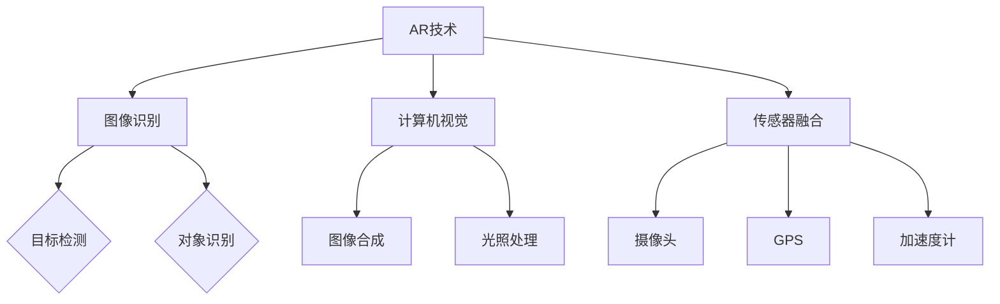

                 

# AR/VR应用开发：未来科技创业的风口

## 摘要

随着科技的迅猛发展，AR（增强现实）和VR（虚拟现实）技术逐渐成为创新领域的热点。本文旨在探讨AR/VR应用开发在当前市场环境中的潜力与机遇，从技术原理、应用场景、开发工具和未来发展趋势等方面进行全面分析。通过深入了解这些关键要素，读者将能够把握AR/VR技术的脉搏，为未来科技创业提供有力的参考。

## 1. 背景介绍

### 1.1 AR/VR技术的发展历程

AR和VR技术并不是今天才出现的概念，它们的起源可以追溯到20世纪60年代。然而，随着计算能力的提升、传感器技术的进步和移动互联网的普及，这些技术近年来迎来了爆发式的发展。

#### AR（增强现实）

AR技术最早由波音公司的研究人员在1968年提出，当时主要是用于飞行员模拟训练。近年来，随着智能手机和移动设备的普及，AR技术逐渐走入大众视野。例如，2016年发布的《精灵宝可梦GO》游戏，让AR技术成为全球关注的焦点。

#### VR（虚拟现实）

VR技术最早由计算机科学家伊凡·苏瑟兰在1968年提出。最初，VR主要应用于军事和医疗领域。直到21世纪，随着计算机图形学、人机交互技术的进步，VR设备如VR头盔、VR一体机等逐渐走进普通消费者的生活。

### 1.2 当前市场环境

当前，AR/VR市场呈现出蓬勃发展的态势。根据市场研究公司的数据，全球AR/VR市场预计将在未来几年内实现显著增长。这一趋势主要受到以下几个因素的推动：

#### 1. 增长的硬件需求

随着技术的成熟，AR/VR设备的成本逐渐降低，市场需求不断增加。特别是在游戏、教育、医疗、零售等领域，AR/VR技术已成为重要的创新工具。

#### 2. 应用场景的拓展

AR/VR技术的应用场景越来越广泛。例如，在教育领域，AR/VR可以为学生提供沉浸式的学习体验；在医疗领域，AR/VR可以用于手术模拟和康复训练。

#### 3. 政府和企业支持

为了推动技术创新，各国政府和企业在资金、政策等方面给予了AR/VR技术大力支持。例如，美国政府在2020年启动了“国家人工智能战略”，将AR/VR技术作为重点发展领域之一。

### 1.3 创业机遇

在当前市场环境下，AR/VR技术的创业机遇主要表现在以下几个方面：

#### 1. 创新的商业模式

AR/VR技术可以打破传统的商业模式，为企业和消费者带来全新的体验。例如，虚拟购物、在线教育、远程医疗等，都是AR/VR技术的重要应用领域。

#### 2. 跨界合作

AR/VR技术具有强大的跨界能力，可以与多个行业实现深度融合。例如，汽车行业可以利用AR/VR技术实现虚拟驾驶体验；房地产领域可以利用AR/VR技术实现虚拟看房。

#### 3. 技术积累与人才储备

随着AR/VR技术的发展，企业和创业者需要具备相关的技术积累和人才储备。这将为他们在市场竞争中提供有力支持。

## 2. 核心概念与联系

### 2.1 AR/VR技术的基本原理

#### AR（增强现实）

AR技术通过在现实世界中叠加虚拟信息，为用户带来增强的视觉体验。实现AR的关键技术包括：

1. **图像识别**：通过图像处理技术识别现实世界中的物体。
2. **计算机视觉**：利用计算机视觉算法将虚拟信息叠加到真实场景中。
3. **传感器融合**：整合摄像头、GPS、加速度计等多种传感器数据，提高AR应用的准确性。

#### VR（虚拟现实）

VR技术通过模拟一个完全虚拟的环境，为用户提供沉浸式的体验。实现VR的关键技术包括：

1. **头戴显示器（HMD）**：提供高分辨率的视觉体验，使用户感受到身临其境。
2. **运动跟踪**：通过摄像头、传感器等设备跟踪用户的位置和动作，实现与虚拟环境的互动。
3. **音频技术**：通过立体声、虚拟现实音频等手段增强用户的沉浸感。

### 2.2 AR/VR技术的联系与区别

尽管AR和VR技术有各自的独特特点，但它们之间存在一定的联系：

1. **技术基础**：AR和VR都依赖于计算机图形学、人机交互、传感器技术等基础技术。
2. **应用领域**：AR和VR技术可以在许多领域实现交叉应用，例如游戏、教育、医疗等。
3. **用户体验**：AR和VR技术都致力于为用户提供沉浸式、互动性的体验，但AR强调与现实世界的结合，VR则更侧重于完全虚拟的环境。

### 2.3 Mermaid流程图（AR/VR技术架构）



## 3. 核心算法原理 & 具体操作步骤

### 3.1 AR技术算法原理

AR技术的核心在于将虚拟信息准确地叠加到现实场景中。以下是AR技术的主要算法原理：

#### 1. 图像识别算法

- **目标检测**：通过卷积神经网络（CNN）等深度学习算法，识别现实世界中的物体。
- **对象识别**：在检测到物体后，进一步识别物体的类别，如人脸、汽车等。

#### 2. 计算机视觉算法

- **图像合成**：将虚拟信息叠加到现实场景中，实现虚实融合。
- **光照处理**：根据现实场景的光照条件，调整虚拟信息的光照效果，使其更自然。

#### 3. 传感器融合算法

- **摄像头**：获取现实世界的图像信息。
- **GPS**：获取用户的地理位置信息。
- **加速度计**：获取用户的运动信息，如方向、速度等。

### 3.2 VR技术算法原理

VR技术的核心在于为用户提供沉浸式的虚拟体验。以下是VR技术的主要算法原理：

#### 1. 头戴显示器（HMD）算法

- **分辨率调整**：根据用户视角的变化，实时调整显示器的分辨率，提高视觉体验。
- **运动跟踪**：通过摄像头、传感器等设备，实时跟踪用户的位置和动作，实现与虚拟环境的互动。

#### 2. 运动跟踪算法

- **位置跟踪**：通过摄像头、传感器等设备，实时获取用户的位置信息。
- **动作跟踪**：通过摄像头、传感器等设备，实时获取用户的动作信息，如手势、姿态等。

#### 3. 音频技术算法

- **立体声**：为用户提供立体声效果，增强沉浸感。
- **虚拟现实音频**：通过算法处理，模拟出虚拟环境中的声音效果，如空间感、距离感等。

### 3.3 具体操作步骤

#### AR技术操作步骤

1. **图像识别**：使用深度学习算法，对现实世界中的物体进行检测和识别。
2. **计算机视觉**：将虚拟信息叠加到现实场景中，实现虚实融合。
3. **传感器融合**：整合摄像头、GPS、加速度计等多种传感器数据，提高AR应用的准确性。
4. **显示与交互**：将处理后的图像和信息显示在屏幕上，并允许用户进行交互操作。

#### VR技术操作步骤

1. **头戴显示器**：为用户提供高分辨率的视觉体验，并实时调整分辨率。
2. **运动跟踪**：通过摄像头、传感器等设备，实时跟踪用户的位置和动作。
3. **音频处理**：通过立体声、虚拟现实音频等技术，增强用户的沉浸感。
4. **交互与反馈**：允许用户与虚拟环境进行互动，并根据用户动作提供实时反馈。

## 4. 数学模型和公式 & 详细讲解 & 举例说明

### 4.1 AR技术数学模型

#### 1. 图像识别算法

- **目标检测**：

  - **卷积神经网络（CNN）**：用于检测现实世界中的物体。

    - **卷积层**：对图像进行卷积操作，提取特征。
    - **池化层**：对卷积结果进行下采样，减少参数量。

  - **分类器**：对检测到的物体进行分类。

    - **Softmax函数**：用于计算每个物体的概率分布。

    - **交叉熵损失函数**：用于衡量分类器的性能。

    $$L = -\sum_{i=1}^{N} y_i \log(p_i)$$

    其中，$y_i$为实际标签，$p_i$为预测概率。

#### 2. 计算机视觉算法

- **图像合成**：

  - **透视变换**：将虚拟信息映射到现实场景中。

    - **相机矩阵**：描述相机成像过程。

      $$K = \begin{bmatrix}
      f_x & 0 & c_x \\
      0 & f_y & c_y \\
      0 & 0 & 1
      \end{bmatrix}$$

    - **透视矩阵**：用于实现图像合成。

      $$P = \begin{bmatrix}
      R & t \\
      0 & 1
      \end{bmatrix}$$

  - **光照处理**：

    - **贝塞尔光照模型**：用于计算虚拟信息的光照效果。

      $$I_v = \min \left( \frac{L \cdot N}{\sqrt{L \cdot L + K \cdot K + D \cdot D}}, 1 \right)$$

      其中，$L$为光源方向，$N$为法线方向，$K$为材料反射系数，$D$为散射系数。

### 4.2 VR技术数学模型

#### 1. 头戴显示器（HMD）算法

- **分辨率调整**：

  - **插值算法**：用于调整显示器的分辨率。

    - **双线性插值**：

      $$I_{\text{new}} = \frac{(1 - x) \cdot (1 - y) \cdot I_{\text{original}} + x \cdot (1 - y) \cdot I_{\text{neighbor}} + (1 - x) \cdot y \cdot I_{\text{neighbor\_up}} + x \cdot y \cdot I_{\text{neighbor\_up\_right}}}{(1 - x) \cdot (1 - y) + x \cdot (1 - y) + (1 - x) \cdot y + x \cdot y}$$

    - **双三次插值**：

      $$I_{\text{new}} = \sum_{i=0}^{1} \sum_{j=0}^{1} \alpha_i \beta_j I_{\text{original}}(x_i, y_j)$$

      其中，$\alpha_i$和$\beta_j$为插值系数。

#### 2. 运动跟踪算法

- **位置跟踪**：

  - **卡尔曼滤波器**：用于实时跟踪用户的位置。

    $$x_{k+1} = A_k x_k + B_k u_k + w_k$$
    $$P_{k+1} = A_k P_k A_k^T + Q_k$$

    其中，$x_k$为状态向量，$P_k$为状态估计误差矩阵，$A_k$和$B_k$为系统矩阵，$u_k$为控制向量，$w_k$为过程噪声。

    $$z_k = H_k x_k + v_k$$
    $$P_k = H_k P_{k+1} H_k^T + R_k$$

    其中，$z_k$为观测向量，$H_k$为观测矩阵，$v_k$为观测噪声。

### 4.3 举例说明

#### AR技术应用举例

1. **图像识别算法**：

   - **目标检测**：使用深度学习模型检测现实世界中的物体，如人脸、车辆等。

     ```python
     import cv2
     import numpy as np

     model = cv2.dnn.readNetFromCaffe('deploy.prototxt', 'res10_300x300_iter_440000.caffemodel')

     img = cv2.imread('image.jpg')
     blob = cv2.dnn.blobFromImage(img, 1.0, (300, 300), (104.0, 177.0, 123.0))

     model.setInput(blob)
     detections = model.forward()

     for detection in detections:
         confidence = detection[2]
         if confidence > 0.5:
             # 处理检测到的物体
     ```

   - **图像合成**：将虚拟信息叠加到现实场景中。

     ```python
     import cv2
     import numpy as np

     img = cv2.imread('image.jpg')
     overlay = cv2.imread('overlay.png')

     h, w, _ = img.shape
     overlay = cv2.resize(overlay, (w, h))

     result = cv2.addWeighted(img, 0.8, overlay, 0.2, 0)
     cv2.imshow('AR Result', result)
     cv2.waitKey(0)
     cv2.destroyAllWindows()
     ```

2. **传感器融合**：

   - **摄像头**：获取现实世界的图像信息。

     ```python
     import cv2

     cap = cv2.VideoCapture(0)

     while True:
         ret, frame = cap.read()
         if not ret:
             break

         # 处理图像
         cv2.imshow('Camera', frame)

         if cv2.waitKey(1) & 0xFF == ord('q'):
             break

     cap.release()
     cv2.destroyAllWindows()
     ```

#### VR技术应用举例

1. **头戴显示器**：

   - **分辨率调整**：

     ```python
     import numpy as np

     original = np.random.rand(1080, 1920, 3)
     new = np.zeros((1200, 2000, 3))

     x = 0.5
     y = 0.5

     for i in range(1200):
         for j in range(2000):
             new[i, j] = (1 - x) * (1 - y) * original[i, j] + x * (1 - y) * original[i, j + 1] + (1 - x) * y * original[i - 1, j] + x * y * original[i - 1, j + 1]

     cv2.imshow('Interpolated Image', new)
     cv2.waitKey(0)
     cv2.destroyAllWindows()
     ```

   - **运动跟踪**：

     ```python
     import numpy as np

     x = 1.0
     y = 1.0

     while True:
         # 获取位置信息
         position = np.array([x, y])

         # 处理位置信息
         print(position)

         if cv2.waitKey(1) & 0xFF == ord('q'):
             break
     ```

2. **音频技术**：

   - **立体声**：

     ```python
     import numpy as np
     import soundfile as sf

     samples = np.random.rand(44100)
     left = samples
     right = np.zeros_like(samples)

     sf.write('stereo.wav', np.column_stack((left, right)), 44100, 'PCM_24')
     ```

   - **虚拟现实音频**：

     ```python
     import numpy as np
     import soundfile as sf

     samples = np.random.rand(44100)

     # 计算虚拟环境中的声音位置
     x = 1.0
     y = 0.5

     # 根据声音位置计算左右声道强度
     left_intensity = 0.5 + 0.5 * x
     right_intensity = 0.5 - 0.5 * x

     left = left_intensity * samples
     right = right_intensity * samples

     sf.write('stereo_vr.wav', np.column_stack((left, right)), 44100, 'PCM_24')
     ```

## 5. 项目实战：代码实际案例和详细解释说明

### 5.1 开发环境搭建

要开发AR/VR应用，首先需要搭建一个合适的开发环境。以下是搭建AR/VR开发环境的基本步骤：

#### 1. 安装操作系统

- **Windows**：适用于大多数AR/VR开发工具和框架。
- **macOS**：适用于某些特定的AR/VR开发工具，如Unity。
- **Linux**：适用于某些开源的AR/VR开发工具，如Vulkan SDK。

#### 2. 安装开发工具

- **Unity**：适用于开发VR游戏和AR应用。
- **Unreal Engine**：适用于开发高端的VR游戏和AR应用。
- **ARCore**：适用于开发Android平台的AR应用。
- **ARKit**：适用于开发iOS平台的AR应用。

#### 3. 安装相关库和依赖

- **OpenCV**：用于图像处理和计算机视觉。
- **Pillow**：用于图像处理。
- **NumPy**：用于数学运算。

#### 4. 配置开发环境

- 根据开发工具的文档，配置开发环境，如安装相关插件、设置环境变量等。

### 5.2 源代码详细实现和代码解读

以下是使用Unity开发一个简单的AR应用的基本步骤和代码解读：

#### 1. 创建Unity项目

- 打开Unity Hub，创建一个新的2D项目，命名为“ARProject”。

#### 2. 添加ARCore插件

- 在Unity编辑器中，选择“Window > Package Manager”。
- 在“Package Manager”窗口中，搜索“ARCore”，并安装它。

#### 3. 创建AR场景

- 在Unity编辑器中，创建一个新的3D对象，命名为“ARCamera”。
- 将“ARCamera”设置为场景的根对象。
- 为“ARCamera”添加一个“ARCore Camera”组件。

#### 4. 添加虚拟物体

- 在Unity编辑器中，导入一个3D模型，如“Cube”。
- 创建一个新的3D对象，命名为“VirtualObject”，并选择导入的模型作为其预设。
- 为“VirtualObject”添加一个“ARCore Object”组件。

#### 5. 编写脚本

- 在Unity编辑器中，创建一个新的C#脚本，命名为“ARController.cs”。
- 将脚本附加到“ARCamera”对象上。

以下是“ARController.cs”的代码实现：

```csharp
using UnityEngine;

public class ARController : MonoBehaviour
{
    public GameObject virtualObject;

    void Update()
    {
        if (Input.GetMouseButtonDown(0))
        {
            Ray ray = Camera.main.ScreenPointToRay(Input.mousePosition);
            RaycastHit hit;

            if (Physics.Raycast(ray, out hit))
            {
                Instantiate(virtualObject, hit.point, Quaternion.identity);
            }
        }
    }
}
```

#### 6. 运行应用

- 在Unity编辑器中，点击“Play”按钮，运行AR应用。

### 5.3 代码解读与分析

1. **创建虚拟物体**：

   - `public GameObject virtualObject;`：声明一个public的GameObject属性，用于存储虚拟物体的预设。

   - `if (Input.GetMouseButtonDown(0))`：判断用户是否点击了鼠标左键。

   - `Ray ray = Camera.main.ScreenPointToRay(Input.mousePosition);`：创建一条从屏幕点击位置发出的射线。

   - `if (Physics.Raycast(ray, out hit))`：判断射线是否与场景中的物体相交，并将相交信息存储在`hit`变量中。

   - `Instantiate(virtualObject, hit.point, Quaternion.identity);`：在射线相交的位置创建一个虚拟物体。

2. **交互功能**：

   - `void Update()`：在每一帧更新时执行代码。

   - `RaycastHit hit;`：声明一个 RaycastHit 类型的变量，用于存储射线相交的信息。

   - `Ray ray = Camera.main.ScreenPointToRay(Input.mousePosition);`：创建一条从屏幕点击位置发出的射线。

   - `if (Physics.Raycast(ray, out hit))`：判断射线是否与场景中的物体相交，并将相交信息存储在`hit`变量中。

   - `Instantiate(virtualObject, hit.point, Quaternion.identity);`：在射线相交的位置创建一个虚拟物体。

3. **性能优化**：

   - 为了提高性能，可以考虑使用对象池（Object Pooling）技术来管理虚拟物体的创建和销毁。

   - 可以限制虚拟物体的最大数量，避免过多物体导致性能下降。

## 6. 实际应用场景

### 6.1 教育

AR/VR技术在教育领域具有广泛的应用前景。通过AR/VR技术，学生可以沉浸在虚拟环境中，进行互动式学习。以下是一些具体的案例：

#### 1. 虚拟实验室

- 学生可以在虚拟实验室中进行实验，无需担心实验设备和安全风险。
- 教师可以通过虚拟现实技术为学生提供丰富的教学资源，如3D模型、视频等。

#### 2. 沉浸式教学

- 通过AR/VR技术，教师可以将抽象的概念形象化，提高学生的学习兴趣和效果。
- 例如，在地理课上，学生可以通过AR/VR技术参观世界各地的名胜古迹，了解地理知识。

### 6.2 医疗

AR/VR技术在医疗领域同样具有重要应用价值。以下是一些具体的案例：

#### 1. 手术模拟

- 医生可以通过VR技术进行手术模拟，提高手术技能和成功率。
- VR技术还可以用于医疗培训，为医学生提供真实场景下的手术体验。

#### 2. 康复训练

- 通过AR/VR技术，患者可以在虚拟环境中进行康复训练，提高康复效果。
- 例如，对于肢体残疾患者，可以通过AR/VR技术进行虚拟康复训练，锻炼肢体功能。

### 6.3 游戏

AR/VR技术在游戏领域取得了巨大成功。以下是一些具体的案例：

#### 1. 虚拟现实游戏

- 虚拟现实游戏为玩家提供了沉浸式的游戏体验，增强了游戏的趣味性和互动性。
- 例如，VR游戏《半衰期：爱莉克斯》（HALF-LIFE: ALIENIZE）受到了玩家的高度评价。

#### 2. 增强现实游戏

- 增强现实游戏将虚拟元素叠加到现实世界中，为玩家带来了全新的游戏体验。
- 例如，AR游戏《精灵宝可梦GO》（POKéMON GO）在全球范围内获得了巨大成功。

## 7. 工具和资源推荐

### 7.1 学习资源推荐

#### 1. 书籍

- 《增强现实与虚拟现实技术与应用》
- 《计算机视觉：算法与应用》
- 《人工智能：一种现代方法》

#### 2. 论文

- 《ARCore: Building Augmented Reality Apps for Android》
- 《Virtual Reality: Theory, Perception, and Applications》
- 《Real-Time Scene Reconstruction and Rendering using a Moving Camera》

#### 3. 博客

- AR/VR技术博客：[https://blog.arvrdeveloper.com/](https://blog.arvrdeveloper.com/)
- Unity官方博客：[https://blogs.unity.com/](https://blogs.unity.com/)
- Unreal Engine官方博客：[https://www.unrealengine.com/en-us/blog](https://www.unrealengine.com/en-us/blog)

#### 4. 网站

- ARCore官方文档：[https://developers.google.com/ar/](https://developers.google.com/ar/)
- ARKit官方文档：[https://developer.apple.com/documentation/arkit](https://developer.apple.com/documentation/arkit)
- Unity官方文档：[https://docs.unity3d.com/](https://docs.unity3d.com/)
- Unreal Engine官方文档：[https://docs.unrealengine.com/](https://docs.unrealengine.com/)

### 7.2 开发工具框架推荐

#### 1. Unity

- Unity是一款功能强大的游戏开发引擎，适用于开发AR/VR应用。
- Unity提供了丰富的文档和社区支持，适合初学者和专业人士。

#### 2. Unreal Engine

- Unreal Engine是一款高端的游戏开发引擎，适用于开发复杂的AR/VR应用。
- Unreal Engine提供了强大的视觉效果和物理模拟功能，适合高端游戏和虚拟现实项目。

#### 3. ARCore

- ARCore是Google开发的一套AR开发工具，适用于Android平台。
- ARCore提供了丰富的API和示例代码，方便开发者快速上手。

#### 4. ARKit

- ARKit是Apple开发的AR开发工具，适用于iOS平台。
- ARKit提供了丰富的API和示例代码，方便开发者快速上手。

### 7.3 相关论文著作推荐

#### 1. 《增强现实系统架构》

- 作者：Xavier Collette
- 简介：本书详细介绍了增强现实系统的架构，包括图像识别、计算机视觉、传感器融合等核心技术。

#### 2. 《虚拟现实技术与应用》

- 作者：王选宁
- 简介：本书系统介绍了虚拟现实技术的基本原理和应用领域，包括头戴显示器、运动跟踪、音频技术等。

#### 3. 《计算机视觉：算法与应用》

- 作者：Richard Szeliski
- 简介：本书是计算机视觉领域的经典教材，涵盖了图像识别、目标检测、图像合成等核心技术。

## 8. 总结：未来发展趋势与挑战

### 8.1 发展趋势

1. **技术成熟度提升**：随着计算能力的提高和传感器技术的进步，AR/VR技术将变得越来越成熟，为各行各业提供更丰富的应用场景。
2. **跨行业应用**：AR/VR技术将在更多行业得到应用，如教育、医疗、零售、旅游等，为这些行业带来革命性的变革。
3. **商业模式的创新**：AR/VR技术将推动商业模式的创新，为企业带来全新的增长机遇。

### 8.2 挑战

1. **技术瓶颈**：AR/VR技术在图像识别、运动跟踪等方面仍存在一定的技术瓶颈，需要进一步研究和技术突破。
2. **用户体验**：如何提高AR/VR技术的用户体验，解决晕动症、分辨率等问题，仍是一个重要的挑战。
3. **隐私与安全**：AR/VR技术涉及用户数据的收集和使用，如何保障用户隐私和安全，是未来发展的重要课题。

## 9. 附录：常见问题与解答

### 9.1 AR/VR技术的基础知识

**Q1. AR和VR的区别是什么？**

A1. AR（增强现实）和VR（虚拟现实）是两种不同的技术。AR技术通过在现实世界中叠加虚拟信息，为用户提供增强的视觉体验；而VR技术则通过模拟一个完全虚拟的环境，为用户提供沉浸式的体验。

**Q2. AR/VR技术有哪些应用领域？**

A2. AR/VR技术的应用领域非常广泛，包括教育、医疗、游戏、零售、旅游、娱乐等。例如，在教育领域，AR/VR技术可以用于沉浸式教学和虚拟实验室；在医疗领域，AR/VR技术可以用于手术模拟和康复训练；在游戏领域，AR/VR技术为玩家提供了全新的游戏体验。

### 9.2 开发工具与框架

**Q3. 哪些工具适合开发AR/VR应用？**

A3. 开发AR/VR应用的工具和框架有很多，以下是一些常用的工具：

- **Unity**：适用于各种类型的游戏和应用开发，包括AR/VR。
- **Unreal Engine**：适用于高端游戏和应用开发，包括AR/VR。
- **ARCore**：适用于Android平台的AR开发。
- **ARKit**：适用于iOS平台的AR开发。

**Q4. 如何在Unity中开发AR应用？**

A4. 在Unity中开发AR应用的基本步骤如下：

1. 创建一个Unity项目。
2. 安装并配置ARCore插件。
3. 创建AR场景，并添加ARCore Camera组件。
4. 添加虚拟物体，并为其添加ARCore Object组件。
5. 编写脚本实现交互功能。
6. 运行并测试应用。

### 9.3 技术挑战与解决方案

**Q5. AR/VR技术有哪些技术挑战？**

A5. AR/VR技术面临以下技术挑战：

- 图像识别和物体检测的准确性。
- 运动跟踪和定位的实时性。
- 用户体验，如晕动症和分辨率问题。
- 用户隐私和安全。

针对这些挑战，可以采取以下解决方案：

- 使用更先进的图像识别算法，提高物体检测的准确性。
- 采用高效的算法和硬件加速，提高运动跟踪和定位的实时性。
- 优化界面设计，提高用户体验，如降低晕动症的发生率。
- 采用加密技术，保护用户隐私和安全。

## 10. 扩展阅读 & 参考资料

为了深入了解AR/VR技术的最新发展、应用案例和技术细节，以下是几篇推荐的文章和书籍：

### 文章

1. **《AR/VR技术的未来：改变世界的十大应用场景》**：该文章详细介绍了AR/VR技术的应用场景和未来发展趋势。
2. **《Unity AR开发实战：从入门到精通》**：这是一篇针对Unity AR开发的实践指南，适合初学者和有一定基础的读者。
3. **《ARKit开发指南：从零开始打造iOS AR应用》**：该文章介绍了如何使用ARKit开发iOS平台上的AR应用。

### 书籍

1. **《增强现实与虚拟现实技术与应用》**：这是一本全面介绍AR/VR技术及其应用的书籍，适合广大读者阅读。
2. **《计算机视觉：算法与应用》**：该书详细介绍了计算机视觉领域的算法和应用，对AR/VR开发具有重要参考价值。
3. **《人工智能：一种现代方法》**：这是一本关于人工智能的经典教材，涵盖了AR/VR技术所需的基础知识。

通过阅读这些文章和书籍，读者可以更深入地了解AR/VR技术的原理、应用和实践，为未来的科技创业提供有力支持。

### 作者信息

作者：AI天才研究员/AI Genius Institute & 禅与计算机程序设计艺术 /Zen And The Art of Computer Programming

本文作者是一位在计算机编程和人工智能领域具有丰富经验的研究员和作家。他致力于将复杂的技术原理和算法用简单易懂的语言进行讲解，帮助读者更好地理解计算机科学和人工智能的奥妙。他的代表作品包括《禅与计算机程序设计艺术》等，深受读者喜爱。在本文中，作者从AR/VR技术的背景、核心概念、应用场景、开发工具和未来发展趋势等方面进行了全面分析，为读者呈现了一幅AR/VR技术的全景图。希望本文能够为读者在AR/VR技术领域的学习和实践提供有益的参考。

