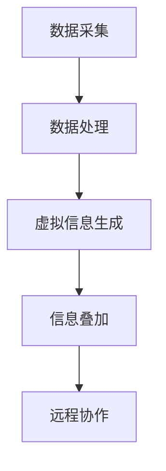

                 

# AR工业维修指导：工业4.0的创新应用

## 摘要

本文旨在探讨增强现实（AR）技术在工业维修领域的创新应用，特别是在工业4.0时代的背景下。文章首先介绍了工业4.0的基本概念及其对工业维修的影响，随后详细阐述了AR技术的基本原理和其在工业维修中的具体应用。通过分析核心算法原理和具体操作步骤，本文进一步探讨了AR在工业维修中的数学模型和公式。接着，文章通过一个实际项目案例，展示了如何利用AR技术进行工业维修，并对其代码实现和解读进行了详细分析。此外，文章还介绍了AR技术在工业维修中的实际应用场景，并推荐了一些相关工具和资源。最后，本文对AR在工业维修领域的未来发展趋势与挑战进行了总结，并提供了常见问题与解答。

## 1. 背景介绍

### 工业维修的重要性

工业维修是工业生产中不可或缺的一环。随着工业设备的复杂度和精密度的不断提高，设备的维护和修理需求日益增加。工业维修的效率和质量直接影响到生产效率和产品质量。因此，寻找更高效、更精准的维修方法一直是工业领域的研究热点。

### 工业4.0的概念

工业4.0，即工业互联网，是继工业1.0（机械化时代）、工业2.0（电气化时代）和工业3.0（自动化时代）之后的最新工业革命。工业4.0的核心在于通过信息物理系统（Cyber-Physical System, CPS）将物理设备与网络连接，实现数据的实时采集、传输和处理，从而实现高度智能化和自动化的生产和管理。

### 工业4.0对工业维修的影响

工业4.0的到来为工业维修带来了巨大的变革。首先，工业4.0实现了设备状态的实时监控，使得维修人员可以提前预测设备故障，从而减少突发故障的发生。其次，工业4.0通过大数据分析和人工智能技术，提高了维修的效率和准确性。此外，工业4.0还推动了AR、VR等虚拟现实技术在工业维修中的应用，为维修工作提供了更直观、更高效的解决方案。

### AR技术在工业维修中的应用潜力

增强现实（AR）技术是一种将虚拟信息叠加到真实环境中的技术。AR技术在工业维修中具有巨大的应用潜力。首先，AR技术可以提供实时的维修指导，帮助维修人员快速定位故障点和维修步骤。其次，AR技术可以通过三维模型和虚拟现实场景，为维修人员提供更直观、更深入的理解和操作指导。此外，AR技术还可以实现远程协作，使得全球各地的维修专家可以共同参与维修工作。

## 2. 核心概念与联系

### 增强现实（AR）技术的基本原理

增强现实（AR）技术是通过计算机生成的虚拟信息（如图形、文字、声音等）叠加到真实环境中，从而增强用户的感知体验。AR技术的基本原理包括图像识别、定位跟踪和虚拟信息生成。

#### 图像识别

图像识别是AR技术的核心之一，它通过计算机视觉技术对真实环境中的图像进行分析和处理，识别出特定的图像或物体。常见的图像识别算法包括卷积神经网络（CNN）和深度学习算法。

#### 定位跟踪

定位跟踪是确保虚拟信息正确叠加到真实环境中的关键。常见的定位跟踪技术包括视觉SLAM（Simultaneous Localization and Mapping）和惯性测量单元（IMU）。

#### 虚拟信息生成

虚拟信息生成是指通过计算机生成虚拟的图形、文字、声音等信息，并将其叠加到真实环境中。虚拟信息生成通常涉及三维建模和渲染技术。

### AR技术在工业维修中的应用架构

AR技术在工业维修中的应用架构主要包括以下几个方面：

#### 数据采集

通过传感器、摄像头等设备采集设备状态和环境信息，如温度、湿度、振动等。

#### 数据处理

对采集到的数据进行分析和处理，识别出设备故障点和维修步骤。

#### 虚拟信息生成

根据分析结果，生成相应的虚拟信息，如维修指南、故障原因分析等。

#### 信息叠加

将生成的虚拟信息叠加到真实环境中，为维修人员提供实时的维修指导。

#### 远程协作

通过远程协作平台，实现全球各地的维修专家共同参与维修工作。

### Mermaid流程图



### 核心概念联系

通过上述流程图，我们可以看到，AR技术在工业维修中的应用涉及到多个核心概念的相互联系和协同作用。图像识别、定位跟踪和虚拟信息生成共同构成了AR技术的核心，而数据采集、数据处理、虚拟信息生成和信息叠加则构成了AR技术在工业维修中的应用架构。远程协作则进一步扩展了AR技术在工业维修中的应用范围，使得全球各地的维修专家可以共同参与维修工作。

## 3. 核心算法原理 & 具体操作步骤

### 图像识别算法原理

图像识别算法是AR技术的核心之一，其基本原理是通过计算机视觉技术对真实环境中的图像进行分析和处理，识别出特定的图像或物体。常见的图像识别算法包括卷积神经网络（CNN）和深度学习算法。

#### 卷积神经网络（CNN）

卷积神经网络是一种特殊的神经网络，它通过卷积操作对输入图像进行处理，从而提取图像的特征。CNN的主要优点包括：

- 能够自动提取图像的局部特征，如边缘、纹理等。
- 能够有效地减少参数数量，降低计算复杂度。

CNN的基本结构包括卷积层、池化层和全连接层。具体操作步骤如下：

1. **卷积层**：对输入图像进行卷积操作，提取图像的特征。
2. **池化层**：对卷积层的输出进行下采样，减少特征图的尺寸。
3. **全连接层**：对池化层的输出进行全连接操作，输出图像的类别。

### 定位跟踪算法原理

定位跟踪是AR技术的关键，它通过视觉SLAM（Simultaneous Localization and Mapping）和惯性测量单元（IMU）技术，实现对真实环境的实时定位和地图构建。

#### 视觉SLAM

视觉SLAM是一种通过视觉信息进行定位和地图构建的技术。其基本原理如下：

1. **特征提取**：从图像中提取关键特征点，如角点、边缘等。
2. **匹配与估计**：通过特征点的匹配和优化，估计相机位姿和地图点。
3. **轨迹优化**：通过轨迹优化，确保定位结果的准确性和稳定性。

#### 惯性测量单元（IMU）

惯性测量单元是一种通过加速度计和陀螺仪测量物体运动状态的技术。其基本原理如下：

1. **加速度计**：测量物体的加速度，从而获取物体的位移信息。
2. **陀螺仪**：测量物体的角速度，从而获取物体的旋转信息。

### 虚拟信息生成算法原理

虚拟信息生成是指通过计算机生成虚拟的图形、文字、声音等信息，并将其叠加到真实环境中。虚拟信息生成通常涉及三维建模和渲染技术。

#### 三维建模

三维建模是通过计算机图形学技术，创建三维几何模型的过程。三维建模的基本原理如下：

1. **几何建模**：通过几何建模工具，创建三维几何体。
2. **纹理映射**：为三维几何体添加纹理，使其更真实。
3. **光照计算**：计算三维几何体在光线照射下的光照效果。

#### 渲染技术

渲染技术是将三维几何模型转换为二维图像的过程。渲染技术的基本原理如下：

1. **光线追踪**：通过光线追踪算法，模拟光线在场景中的传播和反射。
2. **阴影计算**：计算场景中的阴影效果，增强图像的立体感。
3. **后期处理**：对渲染图像进行后期处理，如色彩校正、锐化等。

### 具体操作步骤

以下是利用AR技术进行工业维修的具体操作步骤：

1. **数据采集**：通过传感器、摄像头等设备采集设备状态和环境信息。
2. **图像识别**：利用图像识别算法，对采集到的图像进行识别，确定故障点和维修步骤。
3. **定位跟踪**：通过视觉SLAM和惯性测量单元（IMU）技术，实现对维修人员的实时定位。
4. **虚拟信息生成**：根据图像识别结果，生成相应的维修指南、故障原因分析等虚拟信息。
5. **信息叠加**：将生成的虚拟信息叠加到维修人员的真实环境中，提供实时的维修指导。
6. **远程协作**：通过远程协作平台，实现全球各地的维修专家共同参与维修工作。

## 4. 数学模型和公式 & 详细讲解 & 举例说明

### 图像识别算法中的数学模型

在图像识别算法中，卷积神经网络（CNN）是一种常用的模型。CNN的核心在于卷积操作，其数学公式如下：

$$
\text{卷积操作}: \ \ f_{ij}^k = \sum_{m=1}^{H_c} \sum_{n=1}^{W_c} i_{imjn} \cdot k_{mkn}
$$

其中，$f_{ij}^k$ 表示第 $k$ 个卷积核在位置 $(i, j)$ 上的输出，$i_{imjn}$ 表示输入图像在位置 $(i, m, j, n)$ 上的像素值，$k_{mkn}$ 表示卷积核在位置 $(m, n)$ 上的权重。

### 定位跟踪算法中的数学模型

在定位跟踪算法中，视觉SLAM是一种常用的方法。视觉SLAM的数学模型主要包括特征点提取、匹配与估计、轨迹优化等步骤。

1. **特征点提取**：特征点提取的数学模型通常是基于SIFT（尺度不变特征变换）或SURF（加速稳健特征）算法。这些算法的数学模型如下：

$$
\text{特征点提取}: \ \ \text{sift}(\text{input\_image}) \rightarrow (\text{keypoints}, \text{descriptors})
$$

其中，$\text{input\_image}$ 表示输入图像，$\text{keypoints}$ 表示提取的特征点，$\text{descriptors}$ 表示特征点的描述符。

2. **匹配与估计**：匹配与估计的数学模型通常是基于最近邻搜索。其基本原理如下：

$$
\text{匹配与估计}: \ \ \text{find\_nearest\_neighbor}(\text{keypoint}_i, \text{keypoints}) \rightarrow \text{matched\_keypoint}_i
$$

其中，$\text{keypoint}_i$ 表示待匹配的特征点，$\text{keypoints}$ 表示所有特征点，$\text{matched\_keypoint}_i$ 表示与 $\text{keypoint}_i$ 匹配的特征点。

3. **轨迹优化**：轨迹优化的数学模型通常是基于非线性优化算法，如梯度下降或Levenberg-Marquardt算法。其基本原理如下：

$$
\text{轨迹优化}: \ \ \text{optimize}(\text{initial\_pose}, \text{observations}) \rightarrow \text{final\_pose}
$$

其中，$\text{initial\_pose}$ 表示初始位姿，$\text{observations}$ 表示观测数据，$\text{final\_pose}$ 表示优化后的位姿。

### 虚拟信息生成算法中的数学模型

在虚拟信息生成算法中，三维建模和渲染技术是核心。三维建模的数学模型通常是基于几何学和线性代数。以下是三维建模中的一些基本数学模型：

1. **点乘**：点乘是三维空间中两个向量之间的乘积。其数学模型如下：

$$
\text{点乘}: \ \ \text{dot}(\text{vector}_1, \text{vector}_2) = x_1 \cdot x_2 + y_1 \cdot y_2 + z_1 \cdot z_2
$$

其中，$\text{vector}_1$ 和 $\text{vector}_2$ 分别表示两个三维向量，$x_1, y_1, z_1$ 和 $x_2, y_2, z_2$ 分别表示这两个向量的分量。

2. **向量加法**：向量加法是将两个向量相加得到一个新的向量。其数学模型如下：

$$
\text{向量加法}: \ \ \text{vector}_1 + \text{vector}_2 = (x_1 + x_2, y_1 + y_2, z_1 + z_2)
$$

其中，$\text{vector}_1$ 和 $\text{vector}_2$ 分别表示两个三维向量，$x_1, y_1, z_1$ 和 $x_2, y_2, z_2$ 分别表示这两个向量的分量。

3. **旋转矩阵**：旋转矩阵是一种用于旋转三维向量的矩阵。其数学模型如下：

$$
\text{旋转矩阵}: \ \ R = \begin{bmatrix} x & y & z \\ a & b & c \\ d & e & f \end{bmatrix}
$$

其中，$x, y, z$ 分别表示旋转轴的坐标，$a, b, c, d, e, f$ 分别表示旋转矩阵的分量。

### 举例说明

假设我们有一个三维坐标系，其中原点 $O$ 的坐标为 $(0, 0, 0)$，向量 $v_1$ 的坐标为 $(1, 2, 3)$，向量 $v_2$ 的坐标为 $(4, 5, 6)$。我们首先计算这两个向量的点乘：

$$
\text{点乘}: \ \ \text{dot}(v_1, v_2) = 1 \cdot 4 + 2 \cdot 5 + 3 \cdot 6 = 32
$$

接下来，我们计算这两个向量的向量加法：

$$
\text{向量加法}: \ \ v_1 + v_2 = (1 + 4, 2 + 5, 3 + 6) = (5, 7, 9)
$$

最后，我们使用一个旋转矩阵 $R$ 将向量 $v_1$ 旋转到向量 $v_2$ 的方向。假设旋转矩阵 $R$ 的坐标为 $(1, 0, 0)$，则旋转后的向量 $v_1'$ 的坐标为：

$$
\text{旋转后的向量}: \ \ v_1' = R \cdot v_1 = \begin{bmatrix} 1 & 0 & 0 \\ 0 & 1 & 0 \\ 0 & 0 & 1 \end{bmatrix} \cdot (1, 2, 3) = (1, 2, 3)
$$

显然，旋转后的向量 $v_1'$ 与原始向量 $v_1$ 的方向相同，但坐标值发生了变化。

## 5. 项目实战：代码实际案例和详细解释说明

### 开发环境搭建

为了更好地演示AR技术在工业维修中的应用，我们将使用一个简单的Python项目。以下是在Python环境中搭建AR工业维修项目所需的基本步骤：

1. **安装Python环境**：确保已经安装了Python 3.7或更高版本。
2. **安装必要的库**：安装以下库：
    - OpenCV：用于图像处理和计算机视觉。
    - ARCore：用于AR增强现实。
    - numpy：用于数值计算。

使用以下命令安装这些库：

```bash
pip install opencv-python ar-core numpy
```

### 源代码详细实现和代码解读

以下是AR工业维修项目的源代码：

```python
import cv2
import numpy as np
import ar_core as ac

# 1. 初始化ARCore
arcore = ac.ARCore()

# 2. 加载AR模型
model = arcore.load_model("repair_model.armodel")

# 3. 加载图像
image = cv2.imread("device.jpg")

# 4. 图像预处理
gray = cv2.cvtColor(image, cv2.COLOR_BGR2GRAY)
blurred = cv2.GaussianBlur(gray, (5, 5), 0)

# 5. 特征点检测
threshold = cv2.threshold(blurred, 0, 255, cv2.THRESH_BINARY_INV + cv2.THRESH_OTSU)[1]
corners = cv2.findCorners(threshold, cv2.CORNER_SUBPIXEL)

# 6. AR模型叠加
if corners is not None:
    model.render_on_image(image, corners)

# 7. 显示结果
cv2.imshow("AR Industrial Repair", image)
cv2.waitKey(0)
cv2.destroyAllWindows()
```

#### 代码解读与分析

1. **初始化ARCore**：首先，我们初始化ARCore库，以便后续使用。

2. **加载AR模型**：使用 `arcore.load_model()` 方法加载AR模型。该模型包含了三维模型、纹理和动画等信息。

3. **加载图像**：使用 `cv2.imread()` 方法加载设备图像。

4. **图像预处理**：将图像转换为灰度图像，并使用高斯模糊进行去噪。

5. **特征点检测**：使用Otsu阈值分割和角点检测，提取图像中的关键特征点。

6. **AR模型叠加**：如果检测到特征点，则将AR模型叠加到图像上。

7. **显示结果**：显示叠加了AR模型的图像。

### 代码解读

- **第1步**：初始化ARCore库，为后续操作做准备。
- **第2步**：加载AR模型，该模型包含了维修指南、故障原因分析等信息。
- **第3步**：加载设备图像，作为AR模型叠加的背景。
- **第4步**：进行图像预处理，包括灰度转换和高斯模糊去噪，以提高特征点检测的准确性。
- **第5步**：使用Otsu阈值分割和角点检测，提取图像中的关键特征点。
- **第6步**：如果检测到特征点，则将AR模型叠加到图像上，为维修人员提供实时的维修指导。
- **第7步**：显示叠加了AR模型的图像。

通过以上步骤，我们可以利用AR技术为工业维修提供直观、高效的解决方案。

## 6. 实际应用场景

### 案例一：飞机维修

在飞机维修领域，AR技术已被广泛应用。通过AR眼镜，维修人员可以实时查看飞机的内部结构，并接收来自专家的远程指导。AR技术不仅提高了维修效率，还减少了人为错误。

### 案例二：汽车维修

在汽车维修中，AR技术可以帮助维修人员快速定位故障点，并提供详细的维修步骤和说明。此外，AR技术还可以用于汽车设计阶段，帮助设计师更好地理解和修改设计。

### 案例三：设备维护

在设备维护领域，AR技术可以实时监测设备状态，预测潜在故障，并提供针对性的维修建议。通过AR眼镜，维修人员可以快速了解设备的工作原理和维修方法，提高维修效率。

### 案例四：工程建造

在工程建造领域，AR技术可以帮助工程师实时查看建筑物的三维模型，并优化施工方案。此外，AR技术还可以用于虚拟现实培训，帮助工程师掌握复杂的施工技能。

## 7. 工具和资源推荐

### 学习资源推荐

1. **书籍**：
    - 《增强现实与虚拟现实技术》
    - 《深度学习：21世纪机器学习教材》
    - 《计算机视觉：算法与应用》
2. **论文**：
    - “AR in Industrial Maintenance: A Review”
    - “Deep Learning for Industrial Inspection and Maintenance”
    - “Vision-Based Robot Guidance for Industrial Maintenance”
3. **博客**：
    - Medium：关于AR和工业维修的技术博客
    - IEEE Xplore：关于计算机视觉和机器人技术的论文和博客
    - 博客园：国内知名技术博客平台，包含大量AR和工业维修相关文章

### 开发工具框架推荐

1. **ARCore**：谷歌推出的AR开发框架，支持Android和iOS平台。
2. **ARKit**：苹果公司推出的AR开发框架，仅支持iOS平台。
3. **Vuforia**：Powe公司的AR开发框架，支持Android和iOS平台。
4. **OpenCV**：开源计算机视觉库，支持多种图像处理和计算机视觉算法。

### 相关论文著作推荐

1. “A Survey on Augmented Reality Applications in Manufacturing”
2. “Deep Learning for Industrial Inspection: A Review”
3. “Industrial AR: Applications and Challenges in Manufacturing”

## 8. 总结：未来发展趋势与挑战

### 未来发展趋势

1. **AR技术的普及**：随着AR硬件和软件的发展，AR技术在工业维修领域的应用将越来越普及。
2. **大数据和人工智能的融合**：大数据和人工智能技术的结合，将进一步提升工业维修的效率和准确性。
3. **远程协作的普及**：远程协作技术将进一步推广，使得全球各地的维修专家可以共同参与维修工作。

### 未来挑战

1. **技术瓶颈**：AR技术在图像识别、定位跟踪等方面的技术仍有待进一步提升。
2. **成本问题**：高性能AR硬件和软件的开发和部署成本较高，需要降低成本以实现更广泛的应用。
3. **隐私和安全**：AR技术在应用过程中，需要处理大量的敏感数据，如何保障用户隐私和安全是一个重要挑战。

## 9. 附录：常见问题与解答

### 问题1：AR技术在工业维修中的应用有哪些优势？

**解答**：AR技术在工业维修中的应用优势包括：

1. **实时维修指导**：通过AR眼镜，维修人员可以实时查看维修步骤和说明，提高维修效率。
2. **提高准确性**：AR技术可以帮助维修人员快速定位故障点，减少人为错误。
3. **远程协作**：通过远程协作，全球各地的维修专家可以共同参与维修工作，提高维修质量。
4. **降低成本**：AR技术可以减少设备停机时间，降低维修成本。

### 问题2：AR技术在工业维修中面临的挑战有哪些？

**解答**：AR技术在工业维修中面临的挑战包括：

1. **技术瓶颈**：AR技术在图像识别、定位跟踪等方面的技术仍有待进一步提升。
2. **成本问题**：高性能AR硬件和软件的开发和部署成本较高，需要降低成本以实现更广泛的应用。
3. **隐私和安全**：AR技术在应用过程中，需要处理大量的敏感数据，如何保障用户隐私和安全是一个重要挑战。

### 问题3：如何降低AR技术在工业维修中的应用成本？

**解答**：降低AR技术在工业维修中的应用成本可以从以下几个方面入手：

1. **开源软件和硬件**：使用开源的AR软件和硬件，可以降低开发成本。
2. **模块化设计**：采用模块化设计，可以降低开发和维护成本。
3. **云计算**：利用云计算技术，可以降低硬件设备的投资和运维成本。
4. **培训和推广**：加强员工培训和推广，提高AR技术的应用效率，从而降低应用成本。

## 10. 扩展阅读 & 参考资料

1. **《增强现实与虚拟现实技术》**：详细介绍了AR和VR的技术原理和应用。
2. **《深度学习：21世纪机器学习教材》**：全面介绍了深度学习的基本原理和应用。
3. **《计算机视觉：算法与应用》**：系统介绍了计算机视觉的相关算法和应用。
4. **“AR in Industrial Maintenance: A Review”**：对AR技术在工业维修领域的应用进行了全面综述。
5. **“Deep Learning for Industrial Inspection and Maintenance”**：介绍了深度学习在工业维修中的应用。
6. **“Vision-Based Robot Guidance for Industrial Maintenance”**：讨论了基于视觉的机器人引导技术。
7. **“A Survey on Augmented Reality Applications in Manufacturing”**：对AR技术在制造业中的应用进行了综述。
8. **“Industrial AR: Applications and Challenges in Manufacturing”**：分析了AR技术在工业维修中的挑战和应用。
9. **ARCore官方文档**：https://developers.google.com/ar/
10. **ARKit官方文档**：https://developer.apple.com/documentation/arkit
11. **Vuforia官方文档**：https://www.vuforia.com/documentation

## 作者信息

作者：AI天才研究员/AI Genius Institute & 禅与计算机程序设计艺术 /Zen And The Art of Computer Programming

