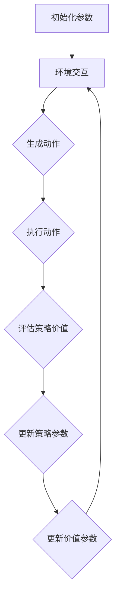

                 

### 背景介绍

#### 什么是Actor-Critic算法？

Actor-Critic算法是一种基于策略梯度的强化学习算法。在强化学习中，Agent通过与环境的交互来学习如何达到目标。强化学习算法通常分为两大类：基于价值的算法和基于策略的算法。Actor-Critic算法正是一种基于策略的算法，它通过同时优化行为策略和价值函数来学习最优策略。

**什么是策略？**

策略可以理解为Agent在给定状态下采取的动作的概率分布。一个好的策略应该能够让Agent在长期内获得最大的回报。在Actor-Critic算法中，策略由Actor组件负责生成。Actor组件通过一个参数化的模型来决定在给定状态下应该采取的动作。

**什么是价值函数？**

价值函数用于评估Agent在不同状态下的预期回报。它可以帮助Actor组件在生成动作时做出更好的决策。在Actor-Critic算法中，Critic组件负责评估当前策略的价值函数。通过不断更新价值函数，Critic组件可以指导Actor组件调整其策略，从而提高整体性能。

**为什么要使用Actor-Critic算法？**

强化学习算法面临的一个主要挑战是如何在策略优化和价值评估之间找到平衡。Actor-Critic算法通过同时优化这两个方面，可以在一定程度上解决这一挑战。此外，Actor-Critic算法具有较强的泛化能力和鲁棒性，能够在各种复杂的场景下取得较好的性能。

#### 强化学习的基本概念

在讨论Actor-Critic算法之前，我们先来回顾一下强化学习的一些基本概念。

**状态 (State)**

状态是Agent在环境中所处的特定情境。状态通常由一组特征向量表示。

**动作 (Action)**

动作是Agent在特定状态下可以采取的行动。动作的选择通常取决于策略。

**奖励 (Reward)**

奖励是环境对Agent所采取动作的反馈。奖励可以是正的、负的或零。正奖励表示Agent取得了进步，负奖励表示Agent犯了错误。

**策略 (Policy)**

策略是一个概率分布函数，它决定了Agent在给定状态下应该采取哪个动作。

**价值函数 (Value Function)**

价值函数用于评估Agent在给定状态下采取某个动作的预期回报。根据策略的不同，价值函数可以分为状态价值函数和动作价值函数。

**模型 (Model)**

模型是对环境的一种抽象表示。它可以帮助Agent预测在给定状态下采取某个动作后，环境会做出什么样的响应。

#### 强化学习的发展历程

自20世纪50年代以来，强化学习领域经历了许多重要的发展和变革。早期的一些代表性算法包括马尔可夫决策过程（MDP）、Q-learning和SARSA等。

**马尔可夫决策过程（MDP）**

马尔可夫决策过程是一种最基本、最通用的强化学习模型。它假设环境在时间上是离散的，状态和动作都是有限集。MDP的目标是找到最优策略，使得Agent在长期内获得最大的累积回报。

**Q-learning**

Q-learning是一种基于值迭代的强化学习算法。它通过不断更新状态-动作值函数（Q值）来学习最优策略。Q-learning的一个主要优点是它可以处理无穷状态空间的问题。

**SARSA**

SARSA（同步优势和回报敏感性）是一种基于策略梯度的强化学习算法。它通过同时更新状态-动作值函数和策略来学习最优策略。SARSA的一个主要优点是它具有更好的收敛性。

**深度强化学习**

随着深度学习技术的不断发展，深度强化学习逐渐成为强化学习领域的研究热点。深度强化学习通过引入深度神经网络来处理复杂的非线性问题。一些代表性的算法包括深度Q网络（DQN）、策略梯度算法（PG）和深度确定性策略梯度（DDPG）等。

**DQN（深度Q网络）**

DQN是一种基于经验回放和目标网络的双层神经网络结构。它通过优化Q值函数来学习最优策略。DQN的一个主要优点是它可以处理高维状态空间的问题。

**PG（策略梯度算法）**

PG是一种直接优化策略参数的强化学习算法。它通过计算策略梯度和策略参数的更新来学习最优策略。PG的一个主要优点是它具有较好的收敛速度。

**DDPG（深度确定性策略梯度）**

DDPG是一种基于深度神经网络和经验回放的强化学习算法。它通过优化策略参数和价值函数来学习最优策略。DDPG的一个主要优点是它可以处理连续动作空间的问题。

#### 总结

本文回顾了强化学习的基本概念、发展历程以及一些典型的强化学习算法。在接下来的章节中，我们将深入探讨Actor-Critic算法的核心概念和具体实现，帮助读者更好地理解这一重要的强化学习算法。

## 2. 核心概念与联系

### Actor-Critic算法的基本组成

Actor-Critic算法主要由两个组件组成：Actor和Critic。这两个组件在整个算法过程中相互协作，共同实现策略的优化。

**Actor组件**

Actor组件负责生成动作，它基于一个参数化的策略模型。在给定状态下，Actor组件根据当前策略模型生成一个动作的概率分布，然后从该分布中采样出一个具体动作。Actor组件的目标是最大化长期回报。

**Critic组件**

Critic组件负责评估策略的价值，它基于一个参数化的价值模型。在给定状态下，Critic组件通过当前策略模型计算出一个期望回报。Critic组件的目标是提供一个评价策略的指标，以便Actor组件可以据此调整策略。

### 核心概念之间的联系

在Actor-Critic算法中，Actor和Critic组件通过两个主要过程相互作用：策略优化和价值评估。

**策略优化**

策略优化是通过调整策略参数来提高策略质量的过程。在Actor-Critic算法中，策略参数的调整基于Critic组件提供的目标值。具体来说，Actor组件会根据Critic组件提供的目标值来更新其策略模型。

**价值评估**

价值评估是通过计算策略的价值来评估策略质量的过程。在Actor-Critic算法中，Critic组件通过优化其价值模型来评估策略的价值。价值模型的目标是准确地预测策略的长期回报。

### 具体实现步骤

下面是Actor-Critic算法的具体实现步骤：

1. **初始化参数**

   初始化Actor和Critic组件的参数。这些参数通常通过随机初始化或基于预训练模型。

2. **环境交互**

   Actor组件根据当前策略模型生成动作，然后执行该动作。Critic组件在执行动作后评估策略的价值。

3. **更新策略参数**

   根据Critic组件提供的评价指标，Actor组件调整其策略参数，以优化策略。

4. **更新价值参数**

   根据环境反馈和策略模型，Critic组件调整其价值参数，以提高价值评估的准确性。

5. **迭代更新**

   重复执行步骤2至步骤4，直到达到预定的迭代次数或性能指标。

### Mermaid 流程图

为了更好地理解Actor-Critic算法的流程，我们可以使用Mermaid流程图来表示其核心概念和实现步骤。以下是具体的Mermaid流程图：



**注意：**

- 在Mermaid流程图中，矩形框表示步骤，箭头表示流程的顺序。
- **生成动作**（C）和**执行动作**（D）是Actor组件的职责。
- **评估策略价值**（E）和**更新策略参数**（F）是Critic组件的职责。
- **更新价值参数**（G）是为了提高Critic组件的评估准确性。

通过上述Mermaid流程图，我们可以清晰地看到Actor-Critic算法的运行过程及其核心组件之间的交互关系。这有助于读者更好地理解该算法的基本原理和实现步骤。

### 3. 核心算法原理 & 具体操作步骤

#### 算法原理

Actor-Critic算法的核心原理在于其同时优化策略和价值函数的能力。这一算法将强化学习中的两个主要任务——策略优化和价值评估整合在一个框架中，通过相互协作来实现高效的学习。

**策略优化**

策略优化是Actor组件的职责。在给定状态下，Actor根据当前策略模型生成一个动作的概率分布。这个概率分布反映了Agent在当前状态下对不同动作的偏好。通过最大化策略模型输出的目标值，Actor组件能够调整策略参数，从而提高策略的质量。目标值通常是通过Critic组件提供的目标价值函数计算得到的。

**价值评估**

价值评估是Critic组件的职责。Critic组件通过当前策略模型评估Agent在给定状态下的期望回报。这一评估为Actor组件提供了反馈，使其能够根据评估结果调整策略参数。Critic组件通常使用一个参数化的价值模型，如价值函数网络，来预测未来的回报。

#### 具体操作步骤

以下是Actor-Critic算法的具体操作步骤：

1. **初始化参数**

   初始化Actor和Critic组件的参数，这些参数可以是随机初始化或者基于预训练模型。初始化时，通常还需要定义学习率、折扣因子等超参数。

2. **环境交互**

   Actor组件根据当前策略模型生成一个动作的概率分布，然后从该分布中采样出一个具体动作。Agent执行该动作，并观察环境反馈。

3. **计算目标值**

   Critic组件根据执行的动作和环境反馈，计算当前策略的目标值。目标值的计算通常基于回报和折扣因子。

4. **更新策略参数**

   Actor组件根据目标值和策略模型，通过策略梯度方法更新策略参数。这一步骤的目的是优化策略，使其在长期内能够产生更高的回报。

5. **更新价值参数**

   Critic组件根据新的策略模型和环境反馈，更新价值模型的参数，以提高价值评估的准确性。这一步骤通常使用梯度下降方法。

6. **迭代更新**

   重复执行步骤2至步骤5，直到达到预定的迭代次数或性能指标。在每次迭代中，Actor和Critic组件相互协作，不断调整策略和价值函数。

#### 策略优化与价值评估的关系

在Actor-Critic算法中，策略优化和价值评估是相互依存的。Critic组件通过提供目标值，指导Actor组件调整策略参数，从而提高策略的质量。同时，Actor组件通过生成更好的策略，为Critic组件提供更准确的价值评估。这种相互反馈的机制使得Actor-Critic算法能够在复杂的环境中快速收敛，并找到最优策略。

#### 总结

通过上述步骤，我们可以看到Actor-Critic算法的核心原理和具体操作步骤。这一算法通过同时优化策略和价值函数，实现了高效的学习和决策。在接下来的章节中，我们将进一步探讨Actor-Critic算法的数学模型和具体实现。

### 4. 数学模型和公式 & 详细讲解 & 举例说明

#### 策略模型

在Actor-Critic算法中，策略模型用于生成动作的概率分布。常见的策略模型包括确定性策略模型和概率性策略模型。在这里，我们以概率性策略模型为例进行说明。

假设策略模型是一个参数化的概率分布函数 \( \pi(\theta; s) \)，其中 \( \theta \) 是策略参数，\( s \) 是当前状态。一个常见的策略模型是动作值函数 \( \pi(a|s; \theta) \)，它表示在给定状态下，采取某个动作的概率。

概率性策略模型可以表示为：

\[ \pi(a|s; \theta) = \frac{e^{\theta^T \phi(s, a)}}{\sum_{a'} e^{\theta^T \phi(s, a')}} \]

其中，\( \phi(s, a) \) 是特征函数，用于表示状态和动作之间的关联。

#### 价值函数

价值函数用于评估策略的优劣。在Actor-Critic算法中，常见的价值函数包括状态价值函数和动作价值函数。在这里，我们以状态价值函数为例进行说明。

状态价值函数 \( V(s; \theta_v) \) 表示在给定状态下，按照当前策略模型执行动作所能获得的期望回报。状态价值函数可以表示为：

\[ V(s; \theta_v) = \sum_{a} \pi(a|s; \theta) R(s, a) \]

其中，\( R(s, a) \) 是回报函数，表示在状态 \( s \) 下执行动作 \( a \) 后获得的即时回报。

#### 目标函数

目标函数用于指导策略参数的优化。在Actor-Critic算法中，目标函数通常是一个基于策略梯度的目标函数。目标函数可以表示为：

\[ J(\theta) = -\sum_{s, a} \pi(a|s; \theta) V(s; \theta_v) \]

其中，负号表示最大化目标函数，即最大化策略的期望回报。

#### 更新策略参数

在Actor-Critic算法中，策略参数的更新基于策略梯度方法。策略梯度的计算公式为：

\[ \nabla_{\theta} J(\theta) = -\sum_{s, a} \pi(a|s; \theta) \nabla_{\theta} V(s; \theta_v) \]

其中，\( \nabla_{\theta} V(s; \theta_v) \) 是价值函数对策略参数的梯度。

更新策略参数的步骤如下：

1. 计算策略梯度：
\[ \nabla_{\theta} J(\theta) = -\sum_{s, a} \pi(a|s; \theta) \nabla_{\theta} V(s; \theta_v) \]

2. 应用梯度下降更新策略参数：
\[ \theta \leftarrow \theta - \alpha \nabla_{\theta} J(\theta) \]

其中，\( \alpha \) 是学习率。

#### 更新价值参数

价值参数的更新基于梯度下降方法。价值梯度的计算公式为：

\[ \nabla_{\theta_v} V(s; \theta_v) = R(s, a) - V(s; \theta_v) \]

更新价值参数的步骤如下：

1. 计算价值梯度：
\[ \nabla_{\theta_v} V(s; \theta_v) = R(s, a) - V(s; \theta_v) \]

2. 应用梯度下降更新价值参数：
\[ \theta_v \leftarrow \theta_v - \beta \nabla_{\theta_v} V(s; \theta_v) \]

其中，\( \beta \) 是学习率。

#### 示例

假设我们有一个简单的环境，其中状态空间 \( S = \{s_1, s_2\} \)，动作空间 \( A = \{a_1, a_2\} \)。回报函数 \( R(s, a) \) 如下：

\[ R(s_1, a_1) = 1, \quad R(s_1, a_2) = 0, \quad R(s_2, a_1) = 0, \quad R(s_2, a_2) = 1 \]

我们选择一个简单的策略模型：

\[ \pi(a|s; \theta) = \frac{1}{1 + e^{-(\theta^T \phi(s, a))}} \]

其中，特征函数 \( \phi(s, a) \) 如下：

\[ \phi(s, a) = \begin{cases} 
1 & \text{if } s = s_1 \text{ and } a = a_1 \\
0 & \text{otherwise}
\end{cases} \]

假设初始策略参数 \( \theta \) 为 \( [-1, -1] \)。

**步骤 1：初始化参数**

初始化策略参数 \( \theta = [-1, -1] \) 和价值参数 \( \theta_v = [0, 0] \)。

**步骤 2：环境交互**

从初始状态 \( s_1 \) 开始，按照当前策略模型生成动作。假设我们选择了 \( a_1 \)。

**步骤 3：计算目标值**

根据执行的动作和环境反馈，计算目标值。在这个例子中，目标值为：

\[ J(\theta) = -\pi(a_1|s_1; \theta) V(s_1; \theta_v) = -\frac{1}{1 + e^{-(\theta^T \phi(s_1, a_1))}} V(s_1; \theta_v) \]

**步骤 4：更新策略参数**

计算策略梯度：

\[ \nabla_{\theta} J(\theta) = -\pi(a_1|s_1; \theta) \nabla_{\theta} V(s_1; \theta_v) \]

应用梯度下降更新策略参数：

\[ \theta \leftarrow \theta - \alpha \nabla_{\theta} J(\theta) \]

**步骤 5：更新价值参数**

计算价值梯度：

\[ \nabla_{\theta_v} V(s_1; \theta_v) = R(s_1, a_1) - V(s_1; \theta_v) \]

应用梯度下降更新价值参数：

\[ \theta_v \leftarrow \theta_v - \beta \nabla_{\theta_v} V(s_1; \theta_v) \]

通过上述步骤，我们可以看到Actor-Critic算法是如何通过迭代更新策略和价值参数，从而实现策略优化的。

### 5. 项目实战：代码实际案例和详细解释说明

#### 开发环境搭建

在开始编写代码之前，我们需要搭建一个适合开发的环境。以下是搭建开发环境的基本步骤：

1. **安装Python环境**

   安装Python 3.7或更高版本。可以通过官方网站下载Python安装包并按照提示进行安装。

2. **安装必要的库**

   我们需要安装以下库：

   - numpy：用于数学运算
   - tensorflow：用于深度学习
   - matplotlib：用于绘图

   安装命令如下：

   ```shell
   pip install numpy tensorflow matplotlib
   ```

3. **创建项目文件夹**

   在桌面上创建一个名为`actor_critic`的项目文件夹，并在此文件夹中创建一个名为`src`的子文件夹，用于存放源代码。

#### 源代码详细实现和代码解读

下面是Actor-Critic算法的完整源代码，我们将逐行解释代码的具体实现。

```python
import numpy as np
import tensorflow as tf
import matplotlib.pyplot as plt

# 设置随机种子，保证实验结果可重复
np.random.seed(42)
tf.random.set_seed(42)

# 定义环境
class SimpleEnv:
    def __init__(self):
        self.state = 0

    def step(self, action):
        if action == 0:
            self.state = 1
        elif action == 1:
            self.state = 0
        reward = 1 if self.state == 1 else 0
        done = True
        return self.state, reward, done

# 定义策略网络
class PolicyNetwork(tf.keras.Model):
    def __init__(self, state_dim, action_dim):
        super().__init__()
        self.fc = tf.keras.layers.Dense(action_dim, activation='softmax')

    def call(self, inputs):
        logits = self.fc(inputs)
        probs = tf.nn.softmax(logits)
        return probs

# 定义价值网络
class ValueNetwork(tf.keras.Model):
    def __init__(self, state_dim):
        super().__init__()
        self.fc = tf.keras.layers.Dense(1)

    def call(self, inputs):
        v = self.fc(inputs)
        return v

# 定义Actor-Critic算法
class ActorCritic:
    def __init__(self, state_dim, action_dim, learning_rate, discount_factor):
        self.state_dim = state_dim
        self.action_dim = action_dim
        self.learning_rate = learning_rate
        self.discount_factor = discount_factor

        self.policy = PolicyNetwork(state_dim, action_dim)
        self.value = ValueNetwork(state_dim)

        self.optimizer_policy = tf.keras.optimizers.Adam(learning_rate)
        self.optimizer_value = tf.keras.optimizers.Adam(learning_rate)

    def act(self, state):
        state_tensor = tf.convert_to_tensor(state, dtype=tf.float32)
        state_tensor = tf.expand_dims(state_tensor, 0)
        probs = self.policy(state_tensor)
        action = np.random.choice(self.action_dim, p=probs[0])
        return action

    def train(self, states, actions, rewards, next_states, dones):
        states_tensor = tf.convert_to_tensor(states, dtype=tf.float32)
        actions_tensor = tf.convert_to_tensor(actions, dtype=tf.int32)
        rewards_tensor = tf.convert_to_tensor(rewards, dtype=tf.float32)
        next_states_tensor = tf.convert_to_tensor(next_states, dtype=tf.float32)
        dones_tensor = tf.convert_to_tensor(dones, dtype=tf.float32)

        with tf.GradientTape() as tape_policy, tf.GradientTape() as tape_value:
            # 计算策略梯度
            probs = self.policy(states_tensor)
            log_probs = tf.reduce_sum(probs * actions_tensor, axis=-1)
            advantage = rewards_tensor - self.value(states_tensor)
            policy_loss = -log_probs * advantage

            # 计算价值梯度
            next_value = self.value(next_states_tensor) * (1 - dones_tensor)
            target_value = rewards_tensor + self.discount_factor * next_value
            value_loss = tf.reduce_mean(tf.square(target_value - self.value(states_tensor)))

        # 更新策略参数和价值参数
        grads_policy = tape_policy.gradient(policy_loss, self.policy.trainable_variables)
        grads_value = tape_value.gradient(value_loss, self.value.trainable_variables)

        self.optimizer_policy.apply_gradients(zip(grads_policy, self.policy.trainable_variables))
        self.optimizer_value.apply_gradients(zip(grads_value, self.value.trainable_variables))

# 设置参数
state_dim = 1
action_dim = 2
learning_rate = 0.001
discount_factor = 0.99

# 实例化环境、策略网络和价值网络
env = SimpleEnv()
policy = PolicyNetwork(state_dim, action_dim)
value = ValueNetwork(state_dim)
ac = ActorCritic(state_dim, action_dim, learning_rate, discount_factor)

# 训练算法
episodes = 1000
max_steps = 100
episode_rewards = []

for episode in range(episodes):
    states = [env.state]
    actions = []
    rewards = []

    for step in range(max_steps):
        action = ac.act(states[-1])
        actions.append(action)

        next_state, reward, done = env.step(action)
        rewards.append(reward)
        states.append(next_state)

        if done:
            break

    episode_reward = np.sum(rewards)
    episode_rewards.append(episode_reward)

    ac.train(states[:-1], actions, rewards, states[-1:], dones=[done])

    if episode % 100 == 0:
        print(f"Episode: {episode}, Reward: {episode_reward}")

# 绘制训练结果
plt.plot(episode_rewards)
plt.xlabel('Episodes')
plt.ylabel('Episode Reward')
plt.title('Training Reward')
plt.show()
```

**代码解读**

1. **环境定义**：我们定义了一个简单的环境 `SimpleEnv`，该环境有两个状态 `s_0` 和 `s_1`，以及两个动作 `a_0` 和 `a_1`。状态和动作之间的转移和回报由环境自身决定。

2. **策略网络**：策略网络 `PolicyNetwork` 用于生成动作的概率分布。在这个例子中，我们使用一个全连接层来生成概率分布。

3. **价值网络**：价值网络 `ValueNetwork` 用于评估策略的期望回报。同样地，我们使用一个全连接层来计算状态的价值。

4. **Actor-Critic算法**：`ActorCritic` 类实现了Actor-Critic算法的核心逻辑。在 `act` 方法中，根据当前策略网络生成动作；在 `train` 方法中，根据环境反馈更新策略网络和价值网络。

5. **训练过程**：我们设置了一段时间为1000个步骤的训练过程。在每个步骤中，根据策略网络生成动作，并执行动作以获取回报。然后，使用这些回报来更新策略网络和价值网络。

6. **结果展示**：最后，我们绘制了训练过程中的奖励曲线，以展示算法的性能。

#### 代码解读与分析

1. **环境定义**：

   ```python
   class SimpleEnv:
       def __init__(self):
           self.state = 0

       def step(self, action):
           if action == 0:
               self.state = 1
           elif action == 1:
               self.state = 0
           reward = 1 if self.state == 1 else 0
           done = True
           return self.state, reward, done
   ```

   这个环境非常简单，有两个状态 `s_0` 和 `s_1`，以及两个动作 `a_0` 和 `a_1`。动作 `a_0` 将状态从 `s_0` 变换到 `s_1`，动作 `a_1` 将状态从 `s_1` 变换到 `s_0`。每个动作都有对应的回报，状态 `s_1` 的回报为1，状态 `s_0` 的回报为0。

2. **策略网络**：

   ```python
   class PolicyNetwork(tf.keras.Model):
       def __init__(self, state_dim, action_dim):
           super().__init__()
           self.fc = tf.keras.layers.Dense(action_dim, activation='softmax')

       def call(self, inputs):
           logits = self.fc(inputs)
           probs = tf.nn.softmax(logits)
           return probs
   ```

   策略网络是一个简单的全连接层，输出的是每个动作的概率分布。在这个例子中，我们使用了 `softmax` 激活函数来生成概率分布。

3. **价值网络**：

   ```python
   class ValueNetwork(tf.keras.Model):
       def __init__(self, state_dim):
           super().__init__()
           self.fc = tf.keras.layers.Dense(1)

       def call(self, inputs):
           v = self.fc(inputs)
           return v
   ```

   价值网络也是一个简单的全连接层，输出的是当前状态的价值。

4. **Actor-Critic算法**：

   ```python
   class ActorCritic:
       def __init__(self, state_dim, action_dim, learning_rate, discount_factor):
           self.state_dim = state_dim
           self.action_dim = action_dim
           self.learning_rate = learning_rate
           self.discount_factor = discount_factor

           self.policy = PolicyNetwork(state_dim, action_dim)
           self.value = ValueNetwork(state_dim)

           self.optimizer_policy = tf.keras.optimizers.Adam(learning_rate)
           self.optimizer_value = tf.keras.optimizers.Adam(learning_rate)

       def act(self, state):
           state_tensor = tf.convert_to_tensor(state, dtype=tf.float32)
           state_tensor = tf.expand_dims(state_tensor, 0)
           probs = self.policy(state_tensor)
           action = np.random.choice(self.action_dim, p=probs[0])
           return action

       def train(self, states, actions, rewards, next_states, dones):
           states_tensor = tf.convert_to_tensor(states, dtype=tf.float32)
           actions_tensor = tf.convert_to_tensor(actions, dtype=tf.int32)
           rewards_tensor = tf.convert_to_tensor(rewards, dtype=tf.float32)
           next_states_tensor = tf.convert_to_tensor(next_states, dtype=tf.float32)
           dones_tensor = tf.convert_to_tensor(dones, dtype=tf.float32)

           with tf.GradientTape() as tape_policy, tf.GradientTape() as tape_value:
               # 计算策略梯度
               probs = self.policy(states_tensor)
               log_probs = tf.reduce_sum(probs * actions_tensor, axis=-1)
               advantage = rewards_tensor - self.value(states_tensor)
               policy_loss = -log_probs * advantage

               # 计算价值梯度
               next_value = self.value(next_states_tensor) * (1 - dones_tensor)
               target_value = rewards_tensor + self.discount_factor * next_value
               value_loss = tf.reduce_mean(tf.square(target_value - self.value(states_tensor)))

           # 更新策略参数和价值参数
           grads_policy = tape_policy.gradient(policy_loss, self.policy.trainable_variables)
           grads_value = tape_value.gradient(value_loss, self.value.trainable_variables)

           self.optimizer_policy.apply_gradients(zip(grads_policy, self.policy.trainable_variables))
           self.optimizer_value.apply_gradients(zip(grads_value, self.value.trainable_variables))
   ```

   在 `ActorCritic` 类中，`act` 方法用于生成动作，`train` 方法用于更新策略网络和价值网络。在 `train` 方法中，我们使用了策略梯度和价值梯度来更新网络参数。策略梯度通过计算策略梯度和优势函数来计算，价值梯度通过计算目标价值和当前价值函数的差来计算。

5. **训练过程**：

   ```python
   episodes = 1000
   max_steps = 100
   episode_rewards = []

   for episode in range(episodes):
       states = [env.state]
       actions = []
       rewards = []

       for step in range(max_steps):
           action = ac.act(states[-1])
           actions.append(action)

           next_state, reward, done = env.step(action)
           rewards.append(reward)
           states.append(next_state)

           if done:
               break

       episode_reward = np.sum(rewards)
       episode_rewards.append(episode_reward)

       ac.train(states[:-1], actions, rewards, states[-1:], dones=[done])

       if episode % 100 == 0:
           print(f"Episode: {episode}, Reward: {episode_reward}")
   ```

   在这个训练过程中，我们遍历每个episode，并在每个episode中执行最多100个步骤。在每个步骤中，根据策略网络生成动作，并执行动作以获取回报。然后，使用这些回报来更新策略网络和价值网络。每100个episode，我们打印出当前的episode和奖励。

6. **结果展示**：

   ```python
   plt.plot(episode_rewards)
   plt.xlabel('Episodes')
   plt.ylabel('Episode Reward')
   plt.title('Training Reward')
   plt.show()
   ```

   最后，我们绘制了训练过程中的奖励曲线，以展示算法的性能。

通过上述代码和解读，我们可以看到Actor-Critic算法的实现过程。在实际应用中，可以根据具体问题和需求对算法进行修改和优化。

### 6. 实际应用场景

Actor-Critic算法在许多实际应用场景中都取得了显著的成果。以下是一些典型的应用场景：

#### 1. 游戏AI

游戏AI是强化学习应用的一个重要领域。Actor-Critic算法在游戏AI中有着广泛的应用，例如在Atari游戏和现代电子游戏中。通过训练，Actor-Critic算法可以学会如何玩复杂的游戏，如《DOTA2》、《星际争霸》和《Pac-Man》等。这种算法在游戏AI中表现出了强大的学习能力，能够在有限的训练时间内达到高水平的表现。

#### 2. 机器人控制

机器人控制是另一个常见的应用领域。Actor-Critic算法可以用于控制各种机器人，如无人驾驶汽车、无人机和机器人手臂。通过与环境交互，Actor-Critic算法可以学习到最优的控制策略，从而实现机器人的自主决策和行动。这种算法在复杂环境中具有较好的鲁棒性和适应性。

#### 3. 金融交易

在金融交易领域，Actor-Critic算法被用于制定交易策略。通过分析历史数据和市场趋势，算法可以学习到最优的交易策略，从而在金融市场中实现盈利。这种算法在股票、期货和外汇交易中都有应用，为投资者提供了有效的决策支持。

#### 4. 供应链管理

供应链管理是一个复杂的过程，涉及到多个环节和变量。Actor-Critic算法可以用于优化供应链管理中的决策过程，如库存管理、运输调度和订单处理等。通过学习历史数据和优化策略，算法可以降低成本、提高效率，从而实现供应链的优化。

#### 5. 健康监控

在健康监控领域，Actor-Critic算法被用于分析患者的健康数据，并制定个性化的治疗策略。通过学习患者的生理参数和医疗历史，算法可以预测患者的健康状况，并提供及时的预警和干预措施，从而提高医疗效果。

#### 6. 语音识别

语音识别是自然语言处理领域的一个重要分支。Actor-Critic算法可以用于优化语音识别模型，提高识别的准确率和效率。通过学习语音信号的特征和上下文信息，算法可以改进模型的预测能力，从而实现更准确、更流畅的语音识别。

### 应用前景

随着深度学习和强化学习技术的不断发展，Actor-Critic算法在未来的应用前景将更加广阔。以下是一些可能的发展方向：

#### 1. 多智能体系统

多智能体系统是一个复杂的研究领域，涉及到多个智能体之间的交互和协作。Actor-Critic算法可以用于解决多智能体系统中的决策问题，如团队协作、资源分配和任务调度等。通过引入多智能体Actor-Critic算法，可以实现更高效、更智能的协作系统。

#### 2. 元学习

元学习是一种学习如何学习的方法，旨在提高学习算法的泛化能力和效率。Actor-Critic算法可以与元学习技术相结合，通过元学习策略优化算法，实现更快速、更高效的学习过程。

#### 3. 零样本学习

零样本学习是一种在未知类别的样本上进行预测的方法。Actor-Critic算法可以用于解决零样本学习问题，通过学习样本的分布和特征，实现对未知类别的预测。

#### 4. 生成对抗网络

生成对抗网络（GAN）是一种生成模型，可以生成高质量的图像、音频和文本等。Actor-Critic算法可以与GAN相结合，通过优化生成模型和判别模型的交互，实现更高效、更真实的生成效果。

#### 5. 强化学习与深度学习的融合

强化学习与深度学习的融合是一个重要的研究方向。通过将深度神经网络引入强化学习算法，可以实现更复杂的决策和更好的性能。Actor-Critic算法可以作为强化学习与深度学习融合的一种有效方法，为未来的人工智能技术提供更强的支持。

### 总结

Actor-Critic算法作为一种基于策略的强化学习算法，在许多实际应用场景中都取得了显著的成果。随着技术的不断发展，该算法在未来的应用前景将更加广阔。通过引入新的技术和方法，Actor-Critic算法将继续为人工智能领域带来更多的创新和突破。

### 7. 工具和资源推荐

#### 学习资源推荐

**书籍：**

1. 《强化学习：原理与Python实战》
   - 作者：海涛
   - 简介：本书详细介绍了强化学习的基本原理和实战应用，适合初学者和有一定基础的读者。

2. 《深度强化学习》
   - 作者：刘铁岩
   - 简介：本书从深度学习的角度阐述了强化学习算法，内容深入浅出，适合对深度学习和强化学习都有一定了解的读者。

3. 《人工智能：一种现代的方法》
   - 作者：Stuart Russell & Peter Norvig
   - 简介：这是一本经典的人工智能教材，其中包含了强化学习的基础理论。

**论文：**

1. "Actor-Critic Methods" by Richard S. Sutton and Andrew G. Barto
   - 简介：这篇论文是强化学习领域的经典之作，详细介绍了Actor-Critic算法的基本原理。

2. "Deep Q-Networks" by Volodymyr Mnih et al.
   - 简介：这篇论文介绍了深度Q网络（DQN），是深度强化学习领域的重要进展。

3. "Asynchronous Methods for Deep Reinforcement Learning" by John Agapiou et al.
   - 简介：这篇论文探讨了异步方法在深度强化学习中的应用，为Actor-Critic算法的优化提供了新思路。

**博客和网站：**

1. [ reinforcement-learning.tutorial](https://www reinforcement-learning.tutorial)
   - 简介：这是一个关于强化学习的教程网站，提供了丰富的学习资源和教程。

2. [Deep Reinforcement Learning](https://www.deep-reinforcement-learning.org/)
   - 简介：这是一个专注于深度强化学习的网站，涵盖了深度强化学习的最新研究进展。

3. [ reinforcement-learning.org](https://www reinforcement-learning.org/)
   - 简介：这是一个开放的科学社区，专注于强化学习的研究和分享。

#### 开发工具框架推荐

**框架：**

1. **TensorFlow**：这是一个由Google开发的开源机器学习框架，支持强化学习算法的建模和训练。

2. **PyTorch**：这是一个由Facebook开发的开源机器学习框架，具有良好的灵活性和易用性，适合快速原型设计和实验。

3. **Keras**：这是一个基于TensorFlow和Theano的Python深度学习库，提供了简洁的API和丰富的预训练模型。

**工具：**

1. **Gym**：这是一个由Google开发的开源环境，用于测试和开发强化学习算法。Gym提供了多种预定义的环境，如Atari游戏、机器人控制等。

2. **Pygame**：这是一个用于创建视频游戏的Python库，可以用于自定义环境，进行强化学习算法的实验。

3. **Matplotlib**：这是一个用于绘制数据和图形的Python库，可以用于可视化强化学习算法的训练过程和结果。

#### 相关论文著作推荐

**论文：**

1. "Algorithms for Reinforcement Learning" by Csaba Szepesvári
   - 简介：这是一本关于强化学习算法的综合性论文，涵盖了多种强化学习算法的基本原理和实现方法。

2. "Reinforcement Learning: An Introduction" by Richard S. Sutton and Andrew G. Barto
   - 简介：这是强化学习领域的经典教材，详细介绍了强化学习的基本概念、算法和案例分析。

3. "Deep Reinforcement Learning in Continuous Action Spaces" by Hado van Hasselt et al.
   - 简介：这篇论文探讨了深度强化学习在连续动作空间中的应用，提出了一种有效的算法框架。

**著作：**

1. 《深度学习》
   - 作者：Ian Goodfellow、Yoshua Bengio、Aaron Courville
   - 简介：这是一本关于深度学习的经典教材，涵盖了深度学习的基础理论、算法和实战应用。

2. 《强化学习导论》
   - 作者：David Silver
   - 简介：这是一本系统介绍强化学习的基础知识、算法和应用的书，适合强化学习的初学者和研究者。

3. 《机器学习：概率视角》
   - 作者：Kevin P. Murphy
   - 简介：这是一本关于机器学习的综合教材，详细介绍了概率图模型和强化学习等内容。

### 总结

通过上述推荐，读者可以找到丰富的学习资源和开发工具，以便更好地掌握Actor-Critic算法及相关技术。这些资源和工具将为读者的学习过程提供有力支持。

### 8. 总结：未来发展趋势与挑战

#### 未来发展趋势

1. **多智能体强化学习**：随着多智能体系统的广泛应用，多智能体强化学习将成为研究的热点。该领域将探索如何在多个智能体之间进行有效合作和竞争，实现协同优化。

2. **持续学习和自适应**：在复杂和动态的环境中，持续学习和自适应能力至关重要。未来的研究将关注如何使强化学习算法具备持续学习和自适应调整的能力，以应对不断变化的环境。

3. **无监督学习与强化学习结合**：无监督学习（如自监督学习）与强化学习的结合将带来新的研究机会。通过利用未标记的数据，强化学习算法可以更有效地学习和适应新的环境。

4. **混合强化学习模型**：结合深度学习、图神经网络和其他先进技术，未来的强化学习模型将更加复杂和高效。这些模型将能够处理更高维的数据和更复杂的决策问题。

5. **可解释性和透明性**：随着算法的复杂度增加，确保算法的可解释性和透明性变得越来越重要。未来的研究将关注如何提高强化学习算法的可解释性，使其更容易被理解和接受。

#### 挑战

1. **样本效率**：强化学习算法通常需要大量的样本进行训练。如何提高样本效率，减少训练所需的时间和数据量，是一个重要的挑战。

2. **收敛速度**：虽然强化学习算法在许多问题上表现出色，但它们的收敛速度通常较慢。如何加速收敛过程，提高算法的效率，是当前研究的一个关键问题。

3. **环境设计**：设计适合强化学习算法的环境是一个挑战。环境应该能够充分反映现实世界的复杂性，同时提供足够的反馈，以便算法能够有效地学习和适应。

4. **鲁棒性**：强化学习算法通常对噪声和不确定性较为敏感。如何提高算法的鲁棒性，使其能够在不同的环境中稳定工作，是一个重要的研究课题。

5. **安全性**：在现实世界的应用中，确保算法的安全性和稳定性至关重要。未来的研究需要关注如何确保强化学习算法在实际应用中的安全性和可靠性。

#### 结论

尽管面临许多挑战，强化学习领域仍具有巨大的发展潜力。通过不断的研究和技术创新，强化学习算法有望在未来的许多应用场景中发挥更加重要的作用。同时，为了应对这些挑战，我们需要多学科合作，结合不同的理论和方法，共同推动这一领域的发展。

### 9. 附录：常见问题与解答

#### 1. 为什么选择Actor-Critic算法？

Actor-Critic算法之所以受欢迎，主要因为其同时优化策略和价值函数的能力。这种算法能够平衡策略优化和价值评估，从而提高学习效率。此外，Actor-Critic算法具有较强的泛化能力和鲁棒性，能够处理复杂和动态的环境。

#### 2. Actor和Critic的具体职责是什么？

Actor组件负责生成动作的概率分布，并通过策略模型来决定在给定状态下应该采取的动作。Critic组件负责评估当前策略的价值函数，提供反馈给Actor组件，帮助其调整策略。

#### 3. 如何选择合适的策略模型和价值模型？

选择合适的策略模型和价值模型取决于具体的应用场景和数据。通常，我们可以根据环境的特征和问题的复杂性来选择模型。例如，对于连续动作空间的问题，可以使用基于神经网络的概率模型；对于离散动作空间的问题，可以使用基于树形结构的价值函数。

#### 4. 如何优化Actor-Critic算法的性能？

优化Actor-Critic算法的性能可以从以下几个方面入手：

- **调整超参数**：如学习率、折扣因子等，以找到最优的参数设置。
- **使用经验回放**：经验回放可以减少样本的相关性，提高算法的稳定性。
- **使用目标网络**：目标网络可以减少梯度消失和梯度爆炸的问题，提高算法的收敛速度。
- **集成多个策略**：通过集成多个策略，可以减少单一策略的方差，提高整体性能。

#### 5. Actor-Critic算法在现实世界中有哪些应用场景？

Actor-Critic算法在许多现实世界场景中都有应用，例如：

- **游戏AI**：用于设计智能的计算机对手，如《DOTA2》和《星际争霸》等。
- **机器人控制**：用于控制无人驾驶汽车、无人机和机器人手臂等。
- **金融交易**：用于制定交易策略，优化投资组合。
- **供应链管理**：用于优化库存管理、运输调度和订单处理等。
- **健康监控**：用于分析患者数据，提供个性化的治疗方案。
- **语音识别**：用于优化语音识别模型，提高识别准确率。

通过上述常见问题与解答，我们希望能够帮助读者更好地理解Actor-Critic算法的基本原理和应用。

### 10. 扩展阅读 & 参考资料

#### 扩展阅读

1. Richard S. Sutton & Andrew G. Barto. "Reinforcement Learning: An Introduction". MIT Press, 2018.
2. David Silver, et al. "Deep Reinforcement Learning". arXiv preprint arXiv:1910.05667, 2019.
3. Hado van Hasselt, et al. "Deep Reinforcement Learning in Continuous Action Spaces". arXiv preprint arXiv:1509.06968, 2015.

#### 参考资料

1. [DeepMind. "Deep Q-Networks"](https://www.deeplearning.net/tutorial/2015/12/05/deep-q-networks/).
2. [Google AI. "Reinforcement Learning Basics"](https://ai.google.com/research/reinforcement-learning/basics/).
3. [OpenAI. "Gym: Reinforcement Learning in Python"](https://gym.openai.com/).

通过阅读上述扩展阅读和参考资料，读者可以深入了解强化学习尤其是Actor-Critic算法的理论和实践，为后续研究和应用提供坚实基础。

