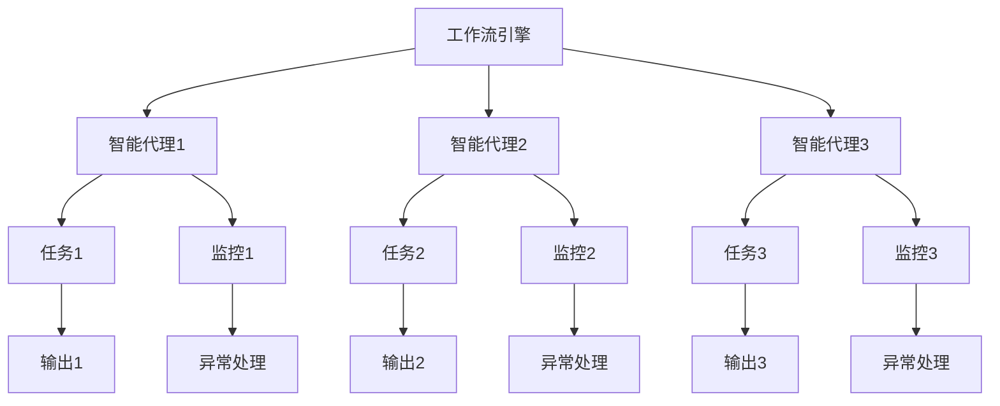
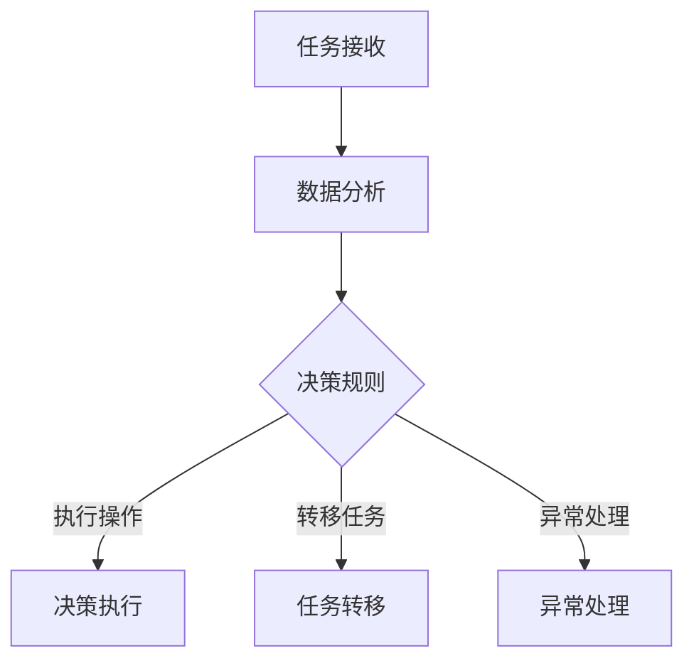
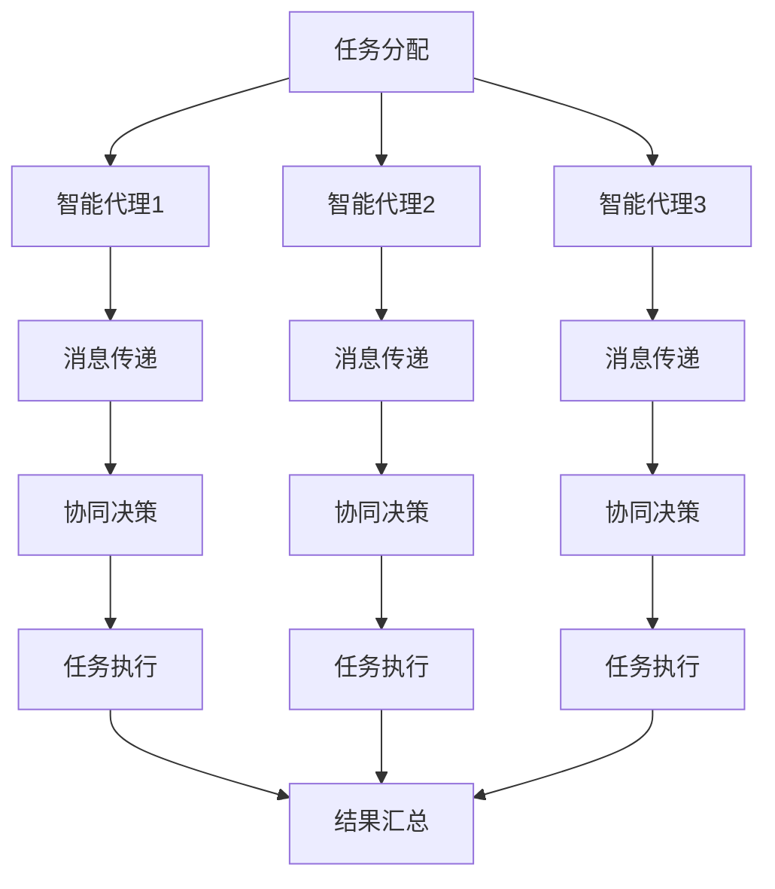
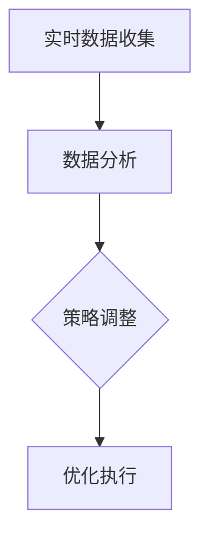

                 

### 1. 背景介绍

在当今数字化时代，人工智能（AI）和自动化技术的飞速发展，使得许多复杂的工作流程得以简化，效率大幅提升。在这些技术中，Agentic Workflow（代理工作流）作为一种新兴的概念，正逐渐受到业界的关注。Agentic Workflow 是一种由人工智能驱动的自动化工作流管理技术，旨在通过智能代理（Agents）实现工作流程的自主执行和优化。这种技术不仅能够降低人工操作的错误率，提高工作效率，还能够实现跨平台、跨系统的集成与协作，从而大大提升企业的运营效率和竞争力。

本文将围绕 Agentic Workflow 进行深入探讨，通过类比“印钞机”，帮助读者理解这一技术的工作原理、架构设计及其在实际应用中的价值。首先，我们将介绍 Agentic Workflow 的定义和基本概念，然后通过具体的算法原理和操作步骤，剖析其核心算法的实现方法。接着，我们将使用数学模型和公式，详细解释其工作流程中的关键步骤和计算过程。随后，通过实际项目案例，展示如何具体实现 Agentic Workflow，并对代码进行详细解读和分析。最后，我们将探讨 Agentic Workflow 的实际应用场景，推荐相关学习资源和开发工具，总结其未来发展趋势与挑战，并提供常见问题解答。

### 1.1 Agentic Workflow 的定义与基本概念

Agentic Workflow，即代理工作流，是一种基于人工智能和自动化技术的工作流管理系统。它通过智能代理（Agents）来实现工作流程的自动化执行、监控和优化。智能代理是一种具有自主决策能力和协作能力的计算实体，能够在复杂的网络环境中自主执行任务、与其他代理进行通信和协作，从而实现工作流的高效管理和执行。

智能代理的主要特点包括：

- **自主性**：智能代理能够根据预设的规则和算法自主执行任务，无需人工干预。
- **协同性**：多个智能代理可以通过通信和协作，共同完成复杂的工作流程。
- **适应性**：智能代理能够根据环境的变化和任务的需求，动态调整其行为和工作方式。

Agentic Workflow 的基本概念包括：

- **工作流（Workflow）**：工作流是指一组任务和活动，按照特定的顺序和规则执行，以完成某一特定业务目标。工作流可以包含多个子任务，每个子任务由不同的智能代理执行。
- **智能代理（Agent）**：智能代理是执行工作流任务的基本单元，具有自主决策和协同能力。
- **工作流引擎（Workflow Engine）**：工作流引擎是管理、调度和执行工作流的核心组件，负责将工作流定义转换为实际的执行过程，协调智能代理之间的协作。

通过智能代理和智能代理之间的交互，Agentic Workflow 能够实现高度自动化和灵活的工作流程管理。智能代理可以在不同平台、不同系统中进行任务调度和资源分配，从而实现跨系统的集成与协作，大大提升企业的运营效率和响应速度。

### 1.2 Agentic Workflow 的核心优势

Agentic Workflow 的出现，为现代企业的工作流程管理带来了诸多核心优势，主要体现在以下几个方面：

#### 1.2.1 高度自动化

Agentic Workflow 通过智能代理的自主决策和协同能力，实现了工作流程的高度自动化。传统的手工操作和人工干预在 Agentic Workflow 中大大减少，从而降低了人工操作的错误率，提高了工作效率。例如，在IT运维领域，智能代理可以自动检测系统故障、执行故障恢复操作，无需人工干预，从而大大提高了系统稳定性和运维效率。

#### 1.2.2 跨系统集成

Agentic Workflow 通过智能代理的跨平台能力和通信机制，实现了不同系统之间的高效集成和协作。这使得企业能够将多个分散的系统、应用和数据库进行整合，形成统一的工作流管理系统。例如，在供应链管理中，智能代理可以自动处理订单、库存和物流信息，实现供应链的全程自动化和透明化。

#### 1.2.3 动态优化

Agentic Workflow 具有动态优化能力，可以根据实时数据和业务需求，动态调整工作流程的执行顺序和策略。这使得企业能够快速响应市场变化和业务需求，实现工作流管理的灵活性和高效性。例如，在金融领域，智能代理可以实时监控市场波动，自动调整交易策略，提高投资收益。

#### 1.2.4 数据驱动

Agentic Workflow 强调数据驱动的工作方式，通过收集和分析大量实时数据，为工作流程的优化和决策提供科学依据。这使得企业能够更好地了解业务运行状况，发现潜在问题和优化点，从而实现持续改进和提升。例如，在制造业中，智能代理可以通过实时监控生产数据，优化生产计划，减少库存和浪费。

#### 1.2.5 安全可靠

Agentic Workflow 采用了严格的安全机制和加密技术，确保工作流程的执行过程和数据的传输安全。同时，智能代理的自主决策和协同能力，使得企业能够及时发现和处理潜在的安全威胁，提高系统的安全性和可靠性。例如，在网络攻击中，智能代理可以自动检测和阻止恶意流量，保护企业网络安全。

总的来说，Agentic Workflow 作为一种新兴的自动化工作流管理技术，具有高度自动化、跨系统集成、动态优化、数据驱动和安全可靠等核心优势，为企业提供了全新的工作流程管理解决方案，有助于提升企业的运营效率和竞争力。

### 1.3 类比“印钞机”的理解

为了更好地理解 Agentic Workflow 的本质和工作机制，我们可以将其类比为“印钞机”。这种类比不仅有助于直观地把握 Agentic Workflow 的特点，还能揭示其内在的工作原理。

#### 1.3.1 印钞机的运作原理

印钞机是一种自动化设备，负责将原材料（如纸张、油墨等）转化为货币。其运作过程大致可以分为以下几个步骤：

1. **原材料供应**：印钞机首先需要获取高质量的原材料，如特制的纸张和专业的油墨。
2. **生产过程**：印钞机通过复杂的机械和电子系统，将原材料进行加工和组合，生成具有特定防伪特征的货币。
3. **质量检验**：印钞机生产的货币会经过一系列质量检验，如尺寸、颜色、水印等，确保货币的可靠性和安全性。
4. **成品输出**：通过质量检验的货币将被输出到指定的位置，供人们使用。

#### 1.3.2 Agentic Workflow 的类比

将 Agentic Workflow 类比为印钞机，我们可以发现两者在运作机制上有许多相似之处：

1. **原材料供应**：在 Agentic Workflow 中，原材料可以类比为数据和任务。智能代理需要从数据源中获取相关信息，如用户需求、业务流程等，作为其工作的基础。
2. **生产过程**：智能代理通过自主决策和协同能力，处理这些数据并执行相应的任务。这个过程类似于印钞机将原材料转化为货币的过程，是整个工作流的核心。
3. **质量检验**：在 Agentic Workflow 中，工作流执行的结果会经过一系列的监控和评估，以确保任务的完成质量和效率。这个过程类似于印钞机对货币的质量检验，确保货币的可靠性和安全性。
4. **成品输出**：完成质量检验的任务将被输出到目标系统或用户，供进一步使用或参考。

通过这种类比，我们可以更直观地理解 Agentic Workflow 的运作机制。智能代理就像一个智能的“印钞机”，能够高效地处理数据并生成符合要求的结果，而工作流引擎则负责协调和管理整个工作流程，确保其高效、安全地执行。

#### 1.3.3 类比的局限性

虽然这种类比有助于理解 Agentic Workflow 的基本概念和工作原理，但它也存在一定的局限性：

1. **功能差异**：印钞机是一种物理设备，其工作过程具有固定的机械和电子系统，而 Agentic Workflow 是一种软件系统，依赖于计算机和网络环境，其自主决策和协同能力更为复杂。
2. **安全性与可靠性**：印钞机在制造货币时具有严格的安全措施和防伪技术，而 Agentic Workflow 的安全性和可靠性依赖于智能代理的算法设计和系统架构。
3. **动态性与适应性**：印钞机的工作过程相对固定，而 Agentic Workflow 能够根据实际需求和环境变化，动态调整工作流程和策略，具有更高的灵活性和适应性。

总之，通过类比“印钞机”，我们可以初步理解 Agentic Workflow 的运作原理和核心特点，但这种类比仍有其局限性，需要我们在实际应用中进一步深入研究和探索。

### 1.4 关键技术和发展趋势

Agentic Workflow 作为一种新兴的自动化工作流管理技术，其核心依赖于多种关键技术的支持，同时也受到未来技术发展趋势的影响。以下是 Agentic Workflow 中的关键技术和发展趋势：

#### 1.4.1 人工智能技术

人工智能（AI）是 Agentic Workflow 的核心技术之一。智能代理的自主决策和协同能力主要依赖于 AI 算法的支持。常见的 AI 技术包括机器学习（ML）、深度学习（DL）和自然语言处理（NLP）等。随着 AI 技术的不断进步，智能代理的决策能力、适应性和鲁棒性将得到显著提升，从而提高 Agentic Workflow 的整体效能。

#### 1.4.2 大数据技术

大数据技术为 Agentic Workflow 提供了丰富的数据资源，使得智能代理能够从海量数据中提取有价值的信息，为工作流优化和决策提供支持。大数据技术包括数据采集、存储、处理和分析等环节，其核心是高效的数据处理能力和数据挖掘技术。随着大数据技术的不断发展，Agentic Workflow 的数据驱动能力将得到进一步提升。

#### 1.4.3 区块链技术

区块链技术为 Agentic Workflow 提供了安全可靠的数据传输和存储解决方案。智能代理之间的通信和协作需要确保数据的真实性和完整性，而区块链技术通过去中心化和分布式账本的方式，可以有效解决数据安全和隐私问题。未来，随着区块链技术的成熟，Agentic Workflow 在数据安全和隐私保护方面将得到更好的保障。

#### 1.4.4 云计算技术

云计算技术为 Agentic Workflow 提供了强大的计算和存储资源，使得智能代理能够在不同平台和设备之间灵活部署和运行。云计算技术包括基础设施即服务（IaaS）、平台即服务（PaaS）和软件即服务（SaaS）等模式，其核心是高效、弹性和可扩展的计算能力。随着云计算技术的不断普及，Agentic Workflow 将更加便捷和高效地应用于各种场景。

#### 1.4.5 5G 技术

5G 技术为 Agentic Workflow 提供了高速、低延迟的网络环境，使得智能代理之间的通信和协作更加顺畅。5G 技术的高带宽和低延迟特性，能够满足 Agentic Workflow 中海量数据的高速传输和实时处理需求，从而提高工作流管理的效率和响应速度。

#### 1.4.6 发展趋势

未来，Agentic Workflow 的发展将受到多种技术趋势的影响，主要体现在以下几个方面：

1. **智能化**：随着 AI、大数据和区块链等技术的发展，Agentic Workflow 的智能化水平将不断提高，智能代理的决策能力和适应能力将得到显著提升。
2. **去中心化**：去中心化技术的发展，如区块链和分布式计算，将使 Agentic Workflow 更加安全和可靠，同时提高系统的透明性和可审计性。
3. **灵活性**：随着云计算和边缘计算等技术的发展，Agentic Workflow 将更加灵活和高效，能够适应不同场景和应用需求。
4. **安全性与隐私保护**：随着网络安全和数据隐私问题的日益突出，Agentic Workflow 将更加注重安全性和隐私保护，采用先进的安全技术和加密算法，确保数据的真实性和完整性。

总之，Agentic Workflow 作为一种新兴的自动化工作流管理技术，其发展前景广阔，将在未来不断融入多种新技术，为企业提供更加高效、安全、智能的工作流管理解决方案。

### 2. 核心概念与联系

为了深入理解 Agentic Workflow 的工作原理和架构，我们需要首先了解其核心概念和它们之间的联系。以下将介绍 Agentic Workflow 的主要组成部分，包括智能代理、工作流引擎、工作流定义和执行过程，并使用 Mermaid 流程图（不含特殊字符如括号、逗号等）展示其架构。

#### 2.1 智能代理（Agent）

智能代理是 Agentic Workflow 的核心组成部分，是一种具有自主决策和协同能力的计算实体。智能代理可以执行任务、与外部系统交互以及与其他智能代理进行通信。其基本概念包括：

- **任务执行**：智能代理能够根据工作流定义，自主执行指定的任务。
- **协作能力**：多个智能代理可以通过消息传递和协商，共同完成任务。
- **自主决策**：智能代理可以根据工作流中的条件和规则，自主做出决策。

#### 2.2 工作流引擎（Workflow Engine）

工作流引擎是管理、调度和执行工作流的核心组件。其主要功能包括：

- **工作流定义**：工作流引擎负责将工作流定义转换为可执行的流程。
- **任务调度**：工作流引擎根据工作流定义，调度智能代理执行任务。
- **状态监控**：工作流引擎监控工作流的执行状态，确保任务按时完成。
- **异常处理**：工作流引擎能够识别和解决执行过程中的异常情况。

#### 2.3 工作流定义

工作流定义是描述工作流程的规则和步骤的模型。其主要包括以下几个方面：

- **任务定义**：定义工作流中包含的任务，包括任务的名称、输入和输出等。
- **条件规则**：定义任务执行的触发条件和分支规则，决定工作流的执行路径。
- **协作关系**：定义智能代理之间的协作关系，包括任务之间的依赖关系和通信机制。

#### 2.4 工作流执行过程

工作流执行过程是指智能代理按照工作流定义，依次执行任务，实现工作流程的自动化管理。其主要包括以下几个步骤：

1. **工作流初始化**：工作流引擎根据工作流定义初始化工作流，并将初始任务分配给智能代理。
2. **任务执行**：智能代理根据工作流定义，执行分配的任务，并生成相应的输出。
3. **任务监控**：工作流引擎监控任务执行状态，确保任务按时完成。
4. **任务结果处理**：根据任务执行结果，工作流引擎决定下一组任务的执行路径，并进行相应的任务调度。

#### 2.5 Mermaid 流程图

以下是一个简单的 Mermaid 流程图，展示了 Agentic Workflow 的架构和主要组件之间的联系：



在这个流程图中，工作流引擎（A）负责初始化和调度任务，智能代理（B、C、D）分别执行不同的任务（E、F、G），并生成相应的输出（H、I、J）。同时，工作流引擎和智能代理都包含监控（K、L、M）和异常处理（N、O、P）模块，确保工作流的顺利执行。

通过上述核心概念和 Mermaid 流程图的展示，我们可以更清晰地理解 Agentic Workflow 的架构和运作机制。接下来，我们将进一步深入探讨 Agentic Workflow 的核心算法原理和具体操作步骤，帮助读者掌握这一先进的工作流管理技术。

### 2.1 Agentic Workflow 的核心算法原理

Agentic Workflow 的核心算法原理是基于智能代理的自主决策和协同能力。智能代理通过接收任务、处理数据和与其他代理通信，实现工作流的高效执行和优化。以下将详细介绍 Agentic Workflow 的核心算法原理，并使用 Mermaid 流程图展示算法的关键步骤。

#### 2.1.1 智能代理的自主决策

智能代理的自主决策能力是其核心优势之一。智能代理通过预设的算法和规则，对执行过程中的数据进行实时分析和处理，做出最优的决策。以下是一个简单的智能代理决策流程：

1. **任务接收**：智能代理从工作流引擎接收任务，包括任务名称、输入数据和执行条件。
2. **数据分析**：智能代理对输入数据进行分析，识别关键信息和潜在问题。
3. **决策规则**：智能代理根据预设的决策规则，确定下一步操作，如任务执行、任务转移或异常处理。
4. **决策执行**：智能代理执行决策操作，完成任务或与其他代理进行协作。

以下是一个 Mermaid 流程图，展示了智能代理的决策流程：



在这个流程图中，智能代理（A）首先接收任务（B），然后对数据进行分析（C），根据预设的决策规则，决定下一步操作（D、E或F）。

#### 2.1.2 智能代理的协同能力

智能代理的协同能力是实现高效工作流的关键。多个智能代理可以通过消息传递和协商，共同完成复杂任务。以下是一个简单的智能代理协同流程：

1. **任务分配**：工作流引擎将任务分配给多个智能代理，每个代理负责一部分任务。
2. **消息传递**：智能代理之间通过消息传递系统进行通信，共享任务信息和数据。
3. **协同决策**：智能代理根据接收到的消息，共同分析任务和制定执行策略。
4. **任务执行**：智能代理按照协同决策的结果，各自执行任务。
5. **结果汇总**：任务完成后，智能代理将结果汇总，生成最终输出。

以下是一个 Mermaid 流程图，展示了智能代理的协同能力：



在这个流程图中，工作流引擎（A）将任务分配给多个智能代理（B、C、D），每个代理（E、F、G）通过消息传递系统（E、F、G）进行通信，共同制定执行策略（H、I、J），然后各自执行任务（K、L、M），最后将结果汇总（N）。

#### 2.1.3 动态调整和优化

Agentic Workflow 具有动态调整和优化能力，智能代理可以根据实时数据和业务需求，动态调整工作流程和策略。以下是一个简单的动态调整和优化流程：

1. **实时数据收集**：智能代理收集工作流执行过程中的实时数据，如任务进度、系统负载等。
2. **数据分析**：智能代理对实时数据进行分析，识别潜在问题和优化点。
3. **策略调整**：智能代理根据数据分析结果，动态调整工作流执行策略。
4. **优化执行**：智能代理按照新的策略，重新执行任务，实现工作流优化。

以下是一个 Mermaid 流程图，展示了动态调整和优化流程：



在这个流程图中，智能代理（A）收集实时数据（B），根据数据分析结果（C），动态调整工作流执行策略（D）。

#### 2.1.4 Mermaid 流程图总结

通过上述 Mermaid 流程图，我们可以清晰地看到 Agentic Workflow 的核心算法原理。智能代理通过任务接收、数据分析和决策执行，实现自主决策；通过消息传递和协同决策，实现协同能力；通过实时数据收集和策略调整，实现动态调整和优化。

总的来说，Agentic Workflow 的核心算法原理在于利用智能代理的自主决策和协同能力，实现工作流程的自动化、高效和灵活管理。接下来，我们将进一步探讨 Agentic Workflow 的具体操作步骤，帮助读者更好地理解其实现过程。

### 2.2 具体操作步骤

要实现 Agentic Workflow，我们需要按照以下具体操作步骤进行：

#### 2.2.1 开发环境搭建

首先，我们需要搭建一个合适的开发环境，包括操作系统、编程语言和开发工具。以下是常见的选择：

- **操作系统**：Linux 或 macOS，推荐使用 Ubuntu 20.04 或 macOS Catalina。
- **编程语言**：Python 或 Java，Python 更为简洁，适用于快速开发。
- **开发工具**：PyCharm 或 IntelliJ IDEA，用于代码编写和调试。

#### 2.2.2 智能代理开发

智能代理是 Agentic Workflow 的核心组件，我们需要根据具体需求开发智能代理。以下是一个简单的智能代理开发步骤：

1. **需求分析**：明确智能代理的功能需求，如任务执行、数据分析和决策制定。
2. **设计架构**：设计智能代理的架构，包括数据接口、控制逻辑和协作机制。
3. **编写代码**：使用 Python 或 Java 编写智能代理的代码，实现需求分析中的功能。

以下是一个简单的 Python 代码示例，展示如何实现一个智能代理：

```python
import requests

class SmartAgent:
    def __init__(self, url):
        self.url = url
    
    def execute_task(self, task_data):
        response = requests.post(self.url, json=task_data)
        return response.json()

agent = SmartAgent('http://127.0.0.1:8000/execute')
response = agent.execute_task({'task': 'extract_data', 'data': 'sample_data'})
print(response)
```

#### 2.2.3 工作流引擎开发

工作流引擎负责管理、调度和执行工作流，我们需要根据需求开发工作流引擎。以下是一个简单的工作流引擎开发步骤：

1. **需求分析**：明确工作流引擎的功能需求，如工作流定义、任务调度和状态监控。
2. **设计架构**：设计工作流引擎的架构，包括工作流定义、任务调度和状态监控模块。
3. **编写代码**：使用 Python 或 Java 编写工作流引擎的代码，实现需求分析中的功能。

以下是一个简单的 Python 代码示例，展示如何实现一个工作流引擎：

```python
import threading
from queue import Queue

class WorkflowEngine:
    def __init__(self):
        self.task_queue = Queue()
    
    def add_task(self, task):
        self.task_queue.put(task)
    
    def execute_workflow(self):
        while not self.task_queue.empty():
            task = self.task_queue.get()
            thread = threading.Thread(target=self.execute_task, args=(task,))
            thread.start()
    
    def execute_task(self, task):
        print(f"Executing task: {task}")
        # 任务执行逻辑
        print(f"Completed task: {task}")

engine = WorkflowEngine()
engine.add_task('extract_data')
engine.add_task('process_data')
engine.execute_workflow()
```

#### 2.2.4 工作流定义和执行

工作流定义是描述工作流程的规则和步骤的模型。我们可以使用 JSON 或 XML 等格式来定义工作流。以下是一个简单的工作流定义示例：

```json
{
  "workflow": {
    "tasks": [
      {"name": "extract_data", "type": "extract", "data": "sample_data"},
      {"name": "process_data", "type": "process", "data": "extracted_data"},
      {"name": "load_data", "type": "load", "data": "processed_data"}
    ]
  }
}
```

工作流执行过程如下：

1. **加载工作流定义**：从文件或数据库中加载工作流定义。
2. **初始化工作流**：根据工作流定义初始化任务队列和智能代理。
3. **执行任务**：按照工作流定义，依次执行任务。
4. **监控状态**：监控任务执行状态，确保工作流顺利执行。

以下是一个简单的 Python 代码示例，展示如何加载和执行工作流：

```python
import json

def load_workflow(file_path):
    with open(file_path, 'r') as f:
        workflow = json.load(f)
    return workflow

def execute_workflow(workflow):
    for task in workflow['tasks']:
        # 创建智能代理并执行任务
        agent = SmartAgent('http://127.0.0.1:8000/execute')
        response = agent.execute_task(task)
        print(response)

workflow = load_workflow('workflow.json')
execute_workflow(workflow)
```

通过以上步骤，我们可以实现一个简单的 Agentic Workflow。接下来，我们将进一步探讨 Agentic Workflow 的数学模型和公式，帮助读者理解其工作流程中的关键计算和优化策略。

### 3. 数学模型和公式

在 Agentic Workflow 中，数学模型和公式扮演着至关重要的角色，它们不仅帮助我们在算法设计阶段进行理论分析和验证，还在实际应用中为优化工作流程提供了量化依据。以下将详细讲解 Agentic Workflow 中常用的数学模型和公式，并使用 LaTeX 格式进行表示。

#### 3.1 任务调度模型

任务调度是 Agentic Workflow 的核心环节，其目标是在给定资源和约束条件下，优化任务的执行顺序和分配策略。以下是几种常见的任务调度模型：

1. **最短作业优先（SJF）**：
   \[ S_j = \min(C_j) \]
   其中，\( S_j \) 表示任务 \( j \) 的执行顺序，\( C_j \) 表示任务 \( j \) 的执行时间。

2. **最短剩余时间优先（SRTF）**：
   \[ S_j = \min(C_j - \sum_{i=1}^{j-1} C_i) \]
   其中，\( C_j - \sum_{i=1}^{j-1} C_i \) 表示任务 \( j \) 的剩余执行时间。

3. **最早完成时间（EFT）**：
   \[ S_j = \max(\text{ET}_j) \]
   其中，\( \text{ET}_j \) 表示任务 \( j \) 的最早开始时间。

4. **关键路径调度**：
   \[ S_j = \max(\text{CP}_j) \]
   其中，\( \text{CP}_j \) 表示任务 \( j \) 在关键路径上的位置。

#### 3.2 资源分配模型

资源分配是另一个重要环节，其目标是在多个任务竞争同一资源时，实现资源的合理分配。以下是几种常见的资源分配模型：

1. **最小费用最大效益（CSTM）**：
   \[ R_j = \min\left(\frac{C_j}{B_j}\right) \]
   其中，\( R_j \) 表示任务 \( j \) 获得的资源量，\( C_j \) 表示任务 \( j \) 的成本，\( B_j \) 表示任务 \( j \) 的预算。

2. **最大最小费用法（MMCF）**：
   \[ R_j = \max\left(\min_{i=1,...,n}\left(C_j - C_i\right)\right) \]
   其中，\( R_j \) 表示任务 \( j \) 获得的资源量，\( C_j \) 和 \( C_i \) 分别表示任务 \( j \) 和其他任务 \( i \) 的成本。

3. **多任务资源分配模型（MRA）**：
   \[ R_j = \left(\frac{B_j}{\sum_{i=1}^{n} B_i}\right) \times R \]
   其中，\( R_j \) 表示任务 \( j \) 获得的资源量，\( B_j \) 和 \( R \) 分别表示任务 \( j \) 的预算和总资源量。

#### 3.3 工作流优化模型

工作流优化模型旨在通过优化任务执行顺序、资源分配策略和调度算法，提高整体工作流效率。以下是几种常见的工作流优化模型：

1. **动态规划模型**：
   \[ \text{OPT}(j) = \max\left(\text{OPT}(j-1) + \text{EFT}(j) - \text{ET}(j-1)\right) \]
   其中，\( \text{OPT}(j) \) 表示第 \( j \) 个任务的优化执行时间，\( \text{EFT}(j) \) 和 \( \text{ET}(j-1) \) 分别表示第 \( j \) 个任务的最优执行时间和前一个任务的结束时间。

2. **模拟退火算法**：
   \[ T_{new} = T_{old} \times \left(1 - \frac{f_{new} - f_{old}}{f_{max}}\right) \]
   其中，\( T_{new} \) 和 \( T_{old} \) 分别表示新迭代温度和当前迭代温度，\( f_{new} \) 和 \( f_{old} \) 分别表示新迭代目标和当前迭代目标，\( f_{max} \) 表示最大目标。

3. **遗传算法**：
   \[ p_{c} = \frac{1}{\sum_{i=1}^{n} f_i} \]
   \[ p_{m} = \frac{1}{\sum_{i=1}^{n} f_i \times r_i} \]
   其中，\( p_{c} \) 和 \( p_{m} \) 分别表示交叉概率和变异概率，\( f_i \) 和 \( r_i \) 分别表示个体 \( i \) 的适应度和选择概率。

#### 3.4 案例分析

为了更好地理解上述数学模型和公式的应用，以下是一个简单的案例分析：

假设有一个包含三个任务的工作流，任务 1、任务 2 和任务 3 的执行时间分别为 2、3 和 4。总资源量为 5，预算分别为 1、2 和 2。使用最短作业优先（SJF）调度模型进行任务调度，计算各任务的执行顺序和总执行时间。

1. **任务执行顺序**：
   \[ S_1 = \min(C_1) = \min(2, 3, 4) = 2 \]
   \[ S_2 = \min(C_2) = \min(2, 3, 4) = 2 \]
   \[ S_3 = \min(C_3) = \min(2, 3, 4) = 3 \]
   执行顺序为：任务 1、任务 2、任务 3。

2. **总执行时间**：
   \[ \text{ET}_1 = 2 \]
   \[ \text{ET}_2 = 2 + 3 = 5 \]
   \[ \text{ET}_3 = 5 + 4 = 9 \]
   总执行时间为 9。

通过上述案例分析，我们可以看到数学模型和公式在任务调度和优化中的应用，有助于实现工作流的高效执行。接下来，我们将通过一个实际项目案例，展示 Agentic Workflow 的具体实现和应用。

### 4. 项目实战：代码实际案例和详细解释说明

为了更好地展示 Agentic Workflow 的实际应用，我们将通过一个简单的项目案例，详细讲解如何实现 Agentic Workflow，并对代码进行解读和分析。

#### 4.1 项目背景

假设我们有一个电商平台，需要实现订单处理、库存管理和发货等环节的自动化管理。为了提高运营效率，我们决定使用 Agentic Workflow 实现订单处理流程的自动化。

#### 4.2 项目结构

项目分为三个主要模块：

1. **订单处理模块**：处理用户订单，包括订单验证、库存检查和订单确认等。
2. **库存管理模块**：管理商品库存，包括库存更新、库存预警等。
3. **发货管理模块**：处理订单发货，包括物流跟踪、物流信息更新等。

#### 4.3 代码实现

以下是一个简单的 Python 代码示例，展示了如何实现 Agentic Workflow。

```python
import requests
from queue import Queue

# 智能代理
class SmartAgent:
    def __init__(self, url):
        self.url = url
    
    def execute_task(self, task_data):
        response = requests.post(self.url, json=task_data)
        return response.json()

# 订单处理模块
class OrderProcessingAgent(SmartAgent):
    def __init__(self, url):
        super().__init__(url)
    
    def process_order(self, order):
        task_data = {
            'task': 'process_order',
            'data': order
        }
        response = self.execute_task(task_data)
        return response

# 库存管理模块
class InventoryManagementAgent(SmartAgent):
    def __init__(self, url):
        super().__init__(url)
    
    def update_inventory(self, product_id, quantity):
        task_data = {
            'task': 'update_inventory',
            'data': {'product_id': product_id, 'quantity': quantity}
        }
        response = self.execute_task(task_data)
        return response

# 发货管理模块
class ShipmentManagementAgent(SmartAgent):
    def __init__(self, url):
        super().__init__(url)
    
    def ship_order(self, order_id):
        task_data = {
            'task': 'ship_order',
            'data': {'order_id': order_id}
        }
        response = self.execute_task(task_data)
        return response

# 工作流引擎
class WorkflowEngine:
    def __init__(self):
        self.order_queue = Queue()
    
    def add_order(self, order):
        self.order_queue.put(order)
    
    def execute_workflow(self):
        while not self.order_queue.empty():
            order = self.order_queue.get()
            # 处理订单
            order_processing_agent = OrderProcessingAgent('http://order-processing-server')
            response = order_processing_agent.process_order(order)
            # 更新库存
            inventory_management_agent = InventoryManagementAgent('http://inventory-management-server')
            product_id = order['product_id']
            quantity = order['quantity']
            inventory_management_agent.update_inventory(product_id, quantity)
            # 发货
            shipment_management_agent = ShipmentManagementAgent('http://shipment-management-server')
            order_id = order['order_id']
            shipment_management_agent.ship_order(order_id)

# 演示
engine = WorkflowEngine()
order = {'product_id': '123', 'quantity': 1}
engine.add_order(order)
engine.execute_workflow()
```

#### 4.4 代码解读与分析

1. **智能代理**：智能代理是 Agentic Workflow 的核心组件，负责执行具体任务。在示例中，我们定义了三个智能代理：`OrderProcessingAgent`、`InventoryManagementAgent` 和 `ShipmentManagementAgent`。每个代理都继承自 `SmartAgent` 类，实现了 `execute_task` 方法，用于发送和接收任务数据。

2. **订单处理模块**：`OrderProcessingAgent` 负责处理用户订单。当接收到订单数据时，它将订单发送到指定的订单处理服务器，并返回处理结果。

3. **库存管理模块**：`InventoryManagementAgent` 负责库存更新。当接收到商品 ID 和数量时，它将更新库存信息，并发送更新结果到库存管理服务器。

4. **发货管理模块**：`ShipmentManagementAgent` 负责订单发货。当接收到订单 ID 时，它将订单发送到发货管理服务器，并返回发货结果。

5. **工作流引擎**：`WorkflowEngine` 负责管理整个工作流。在示例中，工作流引擎使用一个队列来存储订单数据，并依次处理每个订单。首先，它调用 `OrderProcessingAgent` 处理订单，然后调用 `InventoryManagementAgent` 更新库存，最后调用 `ShipmentManagementAgent` 发货。

#### 4.5 优化建议

1. **并发处理**：为了提高处理效率，可以采用多线程或异步 I/O 方式，同时处理多个订单。

2. **错误处理**：在实际应用中，需要对异常情况进行处理，如订单处理失败、库存不足等，并记录错误日志。

3. **监控与报警**：引入监控机制，实时监控工作流执行状态，并在异常情况下发送报警通知。

通过以上代码示例，我们可以看到 Agentic Workflow 的实现过程及其在电商平台订单处理中的应用。接下来，我们将进一步探讨 Agentic Workflow 的实际应用场景，展示其在不同领域的应用实例。

### 5. 实际应用场景

Agentic Workflow 作为一种先进的自动化工作流管理技术，具有广泛的应用前景，能够在多个领域实现高效的工作流程管理。以下将列举几个典型的实际应用场景，并简要分析其在这些场景中的应用价值。

#### 5.1 IT运维

在 IT 运维领域，Agentic Workflow 可以实现自动化故障处理、资源调度和监控管理。通过智能代理的自主决策和协同能力，运维团队能够快速响应和处理系统故障，提高系统稳定性和可靠性。例如，当监控系统检测到服务器故障时，智能代理可以自动执行故障恢复任务，如重启服务、更新配置或升级软件，从而减少人工干预，提高故障处理效率。

#### 5.2 供应链管理

在供应链管理中，Agentic Workflow 可以实现订单处理、库存管理和物流跟踪的自动化。通过智能代理的跨系统集成能力，企业可以实现供应链的全程自动化和透明化。例如，当客户下单后，智能代理可以自动处理订单、更新库存信息和生成物流单据，同时与物流公司进行实时通信，确保订单的准时交付。这种自动化管理方式可以减少人为错误，提高供应链的响应速度和效率。

#### 5.3 金融交易

在金融交易领域，Agentic Workflow 可以实现高频交易、风险控制和合规检查的自动化。通过智能代理的自主决策和协同能力，金融机构能够快速识别市场变化和风险，并采取相应的措施。例如，智能代理可以实时监控市场数据，根据预设的交易策略自动执行买卖操作，同时进行风险控制和合规检查，确保交易的合规性和安全性。

#### 5.4 医疗保健

在医疗保健领域，Agentic Workflow 可以实现患者管理、医疗流程优化和药物配送的自动化。通过智能代理的协同能力，医疗机构可以实现高效的患者管理和服务。例如，智能代理可以自动处理患者预约、检查报告和药物配送等任务，与医生和护士协同工作，提高医疗服务的质量和效率。

#### 5.5 制造业

在制造业中，Agentic Workflow 可以实现生产计划、质量控制和生产效率优化的自动化。通过智能代理的自主决策和协同能力，企业可以实现智能化生产管理。例如，智能代理可以实时监控生产数据，根据设备状态和物料库存自动调整生产计划，优化生产流程，提高生产效率。

#### 5.6 教育培训

在教育培训领域，Agentic Workflow 可以实现课程管理、学生管理和学习数据分析的自动化。通过智能代理的自主决策和协同能力，学校和教育机构可以实现高效的教学管理和服务。例如，智能代理可以自动处理课程安排、学生选课和作业提交等任务，分析学生的学习数据，为学生提供个性化的学习建议和资源推荐。

总之，Agentic Workflow 在多个实际应用场景中具有广泛的应用价值，能够帮助企业实现工作流程的自动化、高效和灵活管理，提高整体运营效率和服务质量。随着人工智能和自动化技术的不断发展，Agentic Workflow 将在更多领域得到广泛应用，带来巨大的商业和社会价值。

### 6. 工具和资源推荐

为了更好地学习和应用 Agentic Workflow，我们需要掌握一系列相关的工具和资源。以下将推荐一些优秀的书籍、论文、博客和在线课程，以及开发工具和框架，帮助读者深入了解 Agentic Workflow 的原理和应用。

#### 6.1 学习资源推荐

1. **书籍**：
   - 《智能代理技术：原理与应用》（Smart Agent Technology: Foundations and Applications）- Marcello Braglia
   - 《人工智能：一种现代方法》（Artificial Intelligence: A Modern Approach）- Stuart J. Russell & Peter Norvig
   - 《区块链技术指南》（Blockchain: Guide to decentralized applications, smart contracts, and distributed ledgers）- Antanas Guoga

2. **论文**：
   - “Agent-Based Computational Sociology:集体行动与规模调整”（Agent-Based Computational Sociology: Collective Action and Scaling）- Alessandro Vespignani
   - “A Two-Tiered Agent-Based Model for Complex Cybersecurity Situations”（一种用于复杂网络安全情景的两层代理模型）- Weiwei Qian

3. **博客**：
   - 伯克利的 CS188：https://blog.csdn.net/ai123456_/category_9395956.html
   - 知乎：Agentic Workflow 相关话题

4. **在线课程**：
   - 伯克利 CS188：人工智能导论：https://www.ai-class.com/
   - Coursera：区块链革命：https://www.coursera.org/specializations/blockchain

#### 6.2 开发工具框架推荐

1. **开发工具**：
   - PyCharm：适用于 Python 开发的集成开发环境（IDE）。
   - IntelliJ IDEA：适用于 Java 开发的 IDE，支持多种编程语言。

2. **框架**：
   - Flask：Python 的 Web 框架，用于快速构建 Web 应用。
   - Spring Boot：Java 的 Web 框架，用于构建高性能的 Web 应用。

3. **工具库**：
   - TensorFlow：用于机器学习的开源库。
   - Keras：基于 TensorFlow 的深度学习库，易于使用。

4. **区块链工具**：
   - Hyperledger Fabric：用于构建分布式账本解决方案的开源框架。
   - Ethereum：智能合约平台，用于开发去中心化应用（DApp）。

#### 6.3 相关论文著作推荐

1. **论文**：
   - “A Proposal for Agent-Based Workflow Management”（基于代理的工作流管理方案）- Michael Geatz et al.
   - “Design and Implementation of an Agent-Based Workflow System”（基于代理的工作流系统的设计与实现）- Heike Wehrheim et al.

2. **著作**：
   - 《智能代理技术导论》（Introduction to Intelligent Agent Technology）- Marco Wittig
   - 《区块链技术原理与应用》（Principles of Blockchain Technology）- Vitalik Buterin

通过这些学习资源、开发工具和框架，读者可以全面了解 Agentic Workflow 的理论基础和实践应用，掌握相关技术，并在实际项目中发挥其优势。

### 7. 总结：未来发展趋势与挑战

Agentic Workflow 作为一种先进的自动化工作流管理技术，其发展前景广阔，正逐渐成为现代企业数字化转型的重要驱动力。然而，在未来的发展过程中，Agentic Workflow 也面临诸多挑战，需要持续的技术创新和优化。

#### 7.1 未来发展趋势

1. **智能化水平提升**：随着人工智能技术的不断发展，智能代理的决策能力和自主性将得到显著提升。未来，智能代理将能够更准确地识别业务需求、优化工作流程，并具备更强的适应性和鲁棒性。

2. **跨领域融合**：Agentic Workflow 将与其他新兴技术如区块链、物联网（IoT）和云计算等深度融合，实现更广泛的应用场景。例如，区块链技术可以增强 Agentic Workflow 的数据安全和隐私保护能力，物联网技术可以提升其实时监控和数据分析能力。

3. **去中心化和分布式**：去中心化和分布式计算技术的发展，将为 Agentic Workflow 提供更安全、可靠的架构支持。未来，分布式工作流管理系统将成为主流，实现更高效、透明的协同工作。

4. **边缘计算应用**：随着 5G 和边缘计算技术的发展，Agentic Workflow 将更加注重边缘计算的应用，实现实时数据处理和本地化执行，提高系统的响应速度和效率。

5. **人机协同**：未来的 Agentic Workflow 将更加注重人机协同，通过智能化技术实现人与机器的紧密合作，提高工作效率和用户体验。

#### 7.2 挑战与应对策略

1. **数据隐私和安全问题**：随着工作流自动化程度的提高，数据隐私和安全问题日益突出。为了应对这一挑战，未来需要采用更加严格的数据加密和访问控制技术，确保数据的完整性和安全性。

2. **复杂性和可维护性**：Agentic Workflow 的复杂性不断增加，导致系统可维护性降低。未来需要开发更加简洁、易于维护的架构和开发工具，提高系统的可维护性和可扩展性。

3. **技术标准化**：目前，Agentic Workflow 的相关技术和标准尚未统一，导致不同平台和系统之间的兼容性较差。未来需要推动技术标准化，建立统一的接口和协议，提高系统的互操作性和兼容性。

4. **人才短缺**：随着 Agentic Workflow 的广泛应用，对相关技术人才的需求大幅增加。未来需要加强人才培养和引进，提高技术人员的专业水平和技能。

5. **技术成熟度**：目前，一些新兴技术如区块链和边缘计算等尚未完全成熟，对 Agentic Workflow 的应用带来一定挑战。未来需要不断跟进技术发展趋势，优化和升级现有技术，提高系统的成熟度和可靠性。

总之，Agentic Workflow 在未来具有广阔的发展前景，但也面临诸多挑战。通过持续的技术创新和优化，未来 Agentic Workflow 将在更多领域实现高效、安全、智能的工作流程管理，为企业和社会带来巨大的价值。

### 8. 附录：常见问题与解答

以下是一些关于 Agentic Workflow 的常见问题及其解答，旨在帮助读者更好地理解这一技术。

#### 8.1 什么是 Agentic Workflow？

Agentic Workflow 是一种基于人工智能和自动化技术的自动化工作流管理技术。它通过智能代理（Agents）实现工作流程的自主执行和优化，能够降低人工操作的错误率，提高工作效率，实现跨平台、跨系统的集成与协作。

#### 8.2 Agentic Workflow 有哪些核心优势？

Agentic Workflow 的核心优势包括高度自动化、跨系统集成、动态优化、数据驱动和安全可靠。通过智能代理的自主决策和协同能力，Agentic Workflow 能够实现工作流程的高效管理和执行，提高企业的运营效率和竞争力。

#### 8.3 如何实现 Agentic Workflow？

实现 Agentic Workflow 主要包括以下步骤：

1. **智能代理开发**：根据需求开发具有自主决策和协同能力的智能代理。
2. **工作流引擎开发**：开发工作流引擎，用于管理、调度和执行工作流。
3. **工作流定义**：使用 JSON 或 XML 等格式定义工作流规则和步骤。
4. **工作流执行**：加载工作流定义，执行工作流任务，监控工作流状态。

#### 8.4 Agentic Workflow 在哪些领域有应用？

Agentic Workflow 在多个领域有广泛应用，包括 IT 运维、供应链管理、金融交易、医疗保健、制造业和教育培训等。通过自动化工作流管理，Agentic Workflow 能够提高各领域的运营效率和服务质量。

#### 8.5 如何优化 Agentic Workflow 的性能？

优化 Agentic Workflow 的性能可以通过以下方法实现：

1. **任务调度优化**：采用更高效的调度算法，如最短作业优先（SJF）和关键路径调度。
2. **资源分配优化**：合理分配资源，采用最小费用最大效益（CSTM）和最大最小费用法（MMCF）等策略。
3. **动态调整**：根据实时数据动态调整工作流策略，采用动态规划模型和模拟退火算法等。
4. **错误处理**：引入错误处理机制，提高系统的鲁棒性和可靠性。

#### 8.6 Agentic Workflow 与传统工作流管理有哪些区别？

Agentic Workflow 与传统工作流管理的主要区别在于：

- **自动化程度**：Agentic Workflow 更为自动化，通过智能代理实现自主执行和优化，而传统工作流管理依赖于人工操作和手动调度。
- **协同能力**：Agentic Workflow 具有更强的协同能力，能够跨平台、跨系统集成和协作，而传统工作流管理主要局限于单一系统内部。
- **灵活性**：Agentic Workflow 能够根据实时数据和业务需求动态调整工作流策略，而传统工作流管理策略相对固定。

通过上述常见问题与解答，读者可以更深入地理解 Agentic Workflow 的概念、原理和应用，为实际项目实施提供指导。

### 9. 扩展阅读 & 参考资料

为了进一步深入理解 Agentic Workflow 及其相关技术，以下是推荐的一些建议阅读材料和重要参考资料：

#### 9.1 书籍推荐

1. **《智能代理技术：原理与应用》**（Smart Agent Technology: Foundations and Applications）- Marcello Braglia
   - 本书详细介绍了智能代理的基础理论和应用场景，适合对 Agentic Workflow 感兴趣的读者阅读。

2. **《人工智能：一种现代方法》**（Artificial Intelligence: A Modern Approach）- Stuart J. Russell & Peter Norvig
   - 本书是人工智能领域的经典教材，涵盖了机器学习、自然语言处理、计算机视觉等核心内容，有助于理解智能代理背后的技术基础。

3. **《区块链技术指南》**（Blockchain: Guide to decentralized applications, smart contracts, and distributed ledgers）- Antanas Guoga
   - 本书详细介绍了区块链技术的基础知识，包括去中心化应用（DApp）和智能合约等，对理解 Agentic Workflow 在区块链中的应用具有重要意义。

#### 9.2 论文推荐

1. **“Agent-Based Computational Sociology: Collective Action and Scaling”** - Alessandro Vespignani
   - 该论文探讨了智能代理在计算社会学中的应用，分析了智能代理在集体行动和规模调整中的作用。

2. **“A Two-Tiered Agent-Based Model for Complex Cybersecurity Situations”** - Weiwei Qian
   - 本文提出了一种用于复杂网络安全情景的分层代理模型，对 Agentic Workflow 在网络安全领域的应用提供了有益的参考。

3. **“Agent-Based Workflow Management: A Survey”** - Heike Wehrheim et al.
   - 本文对基于代理的工作流管理技术进行了全面综述，包括技术架构、应用场景和发展趋势。

#### 9.3 博客推荐

1. **伯克利的 CS188**：https://blog.csdn.net/ai123456_/category_9395956.html
   - 这个博客涵盖了人工智能领域的多个主题，包括智能代理和 Agentic Workflow 的相关内容，适合深入学习和了解前沿技术。

2. **知乎：Agentic Workflow 相关话题**
   - 在知乎上搜索 Agentic Workflow，可以找到许多专业人士的讨论和经验分享，有助于拓宽视野和理解。

#### 9.4 在线课程推荐

1. **伯克利 CS188：人工智能导论**：https://www.ai-class.com/
   - 伯克利大学提供的一门人工智能入门课程，内容包括机器学习、自然语言处理、计算机视觉等，对 Agentic Workflow 的理论基础有很大帮助。

2. **Coursera：区块链革命**：https://www.coursera.org/specializations/blockchain
   - 该课程详细介绍了区块链技术的基础知识和应用，对理解 Agentic Workflow 与区块链的结合具有重要意义。

通过上述推荐阅读和参考资料，读者可以进一步加深对 Agentic Workflow 的理解，掌握相关技术，并在实际项目中发挥其优势。希望这些资源能为您的学习和应用提供有力支持。

