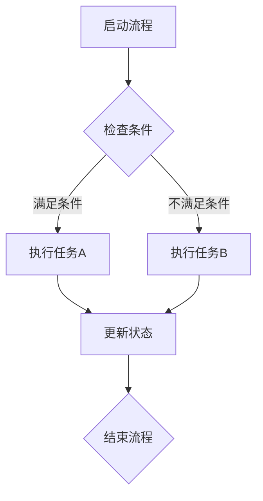
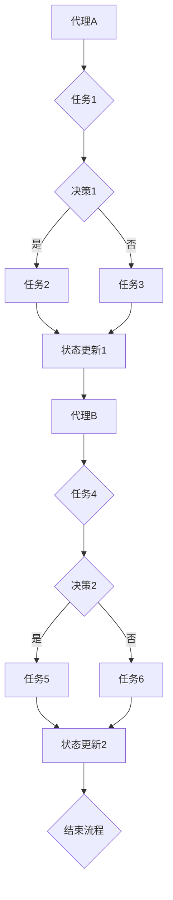

                 

# Agentic Workflow在复杂流程中的局限性

## 概述

在当今复杂的信息和技术环境中，自动化和智能流程管理变得尤为重要。Agentic Workflow作为一种先进的流程管理工具，通过引入人工智能和代理（agent）概念，实现了流程的自动化和智能化。它不仅能够提高工作效率，减少人工错误，还能根据实时数据进行动态调整。然而，尽管Agentic Workflow展示了其在简单和中等复杂度流程中的强大能力，但在处理高度复杂的流程时，却暴露出了诸多局限性。本文将深入探讨Agentic Workflow在复杂流程中的局限性，并分析其原因和解决方案。

本文旨在为读者提供一个全面的理解，帮助他们在选择和实施Agentic Workflow时，能够更加准确地评估其适用性，并提前预见到可能遇到的问题。文章将首先介绍Agentic Workflow的核心概念和基本架构，然后分析其在复杂流程中遇到的主要挑战，并提出一些可能的解决策略。文章还将提供一些实际应用场景，工具和资源推荐，以及未来发展的趋势与挑战。

## 背景介绍

在讨论Agentic Workflow之前，我们需要理解一些与之相关的核心概念和技术。首先，自动化流程管理是一种通过技术和算法实现工作流程自动化的方法。它旨在减少人工干预，提高生产效率和降低成本。随着技术的发展，自动化流程管理已经从传统的规则引擎和脚本编程，发展到了更加智能和灵活的代理（agent）技术。

代理是一种可以独立执行任务、具备自主决策能力的实体。在流程管理中，代理通常被用来代替人类执行重复性或规则性强的任务。代理可以基于预定义的规则，也可以通过机器学习算法和人工智能技术进行自主学习和优化。

Agentic Workflow正是基于这样的代理概念构建的。它通过引入多个代理，每个代理负责流程中的特定环节，从而实现整个流程的自动化和智能化。Agentic Workflow的核心优势在于其灵活性和适应性。它可以根据实际需求动态调整代理的行为，甚至可以在流程执行过程中进行自我优化。

然而，尽管Agentic Workflow在简单和中等复杂度的流程中表现出色，但在处理高度复杂的流程时，却面临着诸多挑战。复杂流程往往涉及多个相互依赖的子流程，每个子流程之间可能存在复杂的逻辑关系和不确定性。此外，复杂流程还可能涉及到大量的外部系统和数据源，这进一步增加了流程管理的难度。

以下是一个简单的Agentic Workflow示意图，帮助读者更好地理解其基本架构：



在这个示意图中，流程从A开始，通过检查条件B来决定下一步的任务C或D。任务完成后，更新状态E，并最终结束流程F。这个简单的示例展示了Agentic Workflow的基本流程和决策机制。

## 核心概念与联系

### Agentic Workflow的基本概念

Agentic Workflow的核心概念主要包括代理（agent）、流程（workflow）、智能决策和动态调整。以下是对这些概念的具体解释：

1. **代理（agent）**：代理是一种可以在流程中执行特定任务的实体。它可以是一个程序、一个软件机器人或一个人类角色。代理的主要职责是执行任务、收集数据、与其他代理或系统进行交互，并在必要时做出决策。

2. **流程（workflow）**：流程是一系列有序的任务和活动的集合，用于实现某个特定目标。在Agentic Workflow中，流程通常被分解为多个子流程，每个子流程由一个或多个代理执行。

3. **智能决策**：智能决策是Agentic Workflow的核心优势之一。通过引入人工智能和机器学习技术，代理能够在执行任务时进行自主决策。这种决策可以是基于预定义的规则，也可以是基于历史数据和实时数据的分析。

4. **动态调整**：Agentic Workflow具有动态调整能力，可以根据流程执行过程中的实际数据和行为进行实时调整。这种动态调整能力使得流程能够更好地适应变化，提高执行效率和准确性。

### 关键组件和流程节点

在Agentic Workflow中，关键组件和流程节点包括代理、任务、决策节点和状态更新节点。以下是一个更详细的Mermaid流程图，展示了这些组件和节点之间的关系：



在这个流程图中，代理A首先执行任务1，然后根据决策1的结果执行任务2或任务3。任务完成后，更新状态1。随后，代理B接手流程，执行任务4，并根据决策2的结果执行任务5或任务6。最终，流程在状态更新2后结束。

### 核心概念之间的联系

Agentic Workflow中的核心概念相互联系，共同构成了一个完整的流程管理框架。以下是这些概念之间的联系：

1. **代理与任务**：代理负责执行流程中的任务。每个任务都是代理的具体行动，任务的执行结果会影响到后续的决策和流程走向。

2. **决策与流程**：决策节点决定了代理在执行任务后应采取的行动。这些决策可以是基于预定义的规则，也可以是基于机器学习算法的实时分析结果。决策的结果决定了流程的下一步行动。

3. **状态更新**：状态更新节点记录了流程的执行状态。状态的更新不仅反映了流程的执行进度，还为后续的决策提供了重要的数据支持。

4. **动态调整**：动态调整机制使得代理可以根据实时数据和历史数据进行自我优化。这种调整能力确保了流程能够在执行过程中适应变化，提高执行效率。

通过这些核心概念和组件的有机结合，Agentic Workflow实现了流程的自动化和智能化，为复杂流程管理提供了一种强大的工具。

### 核心算法原理 & 具体操作步骤

#### 代理算法原理

Agentic Workflow中的代理算法是基于多代理系统的框架构建的。多代理系统（Multi-Agent System，MAS）是一种分布式计算模型，由多个独立的代理组成，每个代理都有一定的智能和自主性。这些代理可以通过通信和协作来完成复杂的任务。

代理算法的主要原理包括以下几个方面：

1. **自主性**：代理具有自主决策能力，可以在没有直接人类干预的情况下执行任务。这种自主性使得代理能够根据环境和任务需求，自主选择行动方案。

2. **协作**：代理之间可以通过通信机制进行信息交换和协作。协作机制可以是同步的，也可以是异步的，取决于具体的应用场景。

3. **适应能力**：代理需要具备适应环境变化的能力。这通常通过机器学习算法和实时数据反馈实现，使得代理能够在不断变化的环境中保持高效运行。

4. **社会智能**：代理不仅具备个体智能，还需要具备社会智能，能够在与人类和其他代理的互动中，理解并遵守社会规范和道德准则。

#### 多代理系统架构

在Agentic Workflow中，多代理系统架构通常包括以下几个关键部分：

1. **代理**：每个代理都是一个独立的计算实体，具有以下功能：
   - 执行特定任务
   - 收集和处理数据
   - 与其他代理和系统进行通信
   - 根据环境和任务需求做出决策

2. **通信机制**：代理之间的通信机制可以是点对点的，也可以是集中式的。通信机制决定了代理之间的协作方式和信息交换方式。

3. **任务分配**：任务分配机制负责将整个流程分解为多个子任务，并分配给不同的代理。任务分配可以是静态的，也可以是动态的，取决于流程的复杂度和执行效率要求。

4. **协调与控制**：协调与控制机制负责监控整个流程的执行状态，协调代理之间的工作，并在必要时进行调整。协调与控制机制通常由一个中央控制代理或一个分布式控制系统实现。

#### 具体操作步骤

以下是一个简化的多代理系统在Agentic Workflow中的具体操作步骤：

1. **流程初始化**：系统启动时，首先初始化整个流程，包括设置初始参数、加载代理和代理配置等。

2. **任务分解**：将整个流程分解为多个子任务，并分配给不同的代理。任务分解可以是基于流程图、规则引擎或其他自动化工具实现的。

3. **代理执行任务**：每个代理根据其分配的任务，开始执行具体操作。代理在执行任务时，可以收集和处理数据，并与系统中的其他代理进行交互。

4. **决策与协作**：代理在执行任务过程中，根据预定义的规则或实时数据分析，做出相应的决策。如果需要，代理还可以与其他代理进行协作，共同完成任务。

5. **状态更新**：代理在完成任务后，更新流程的执行状态。状态更新可以反映任务的完成情况，也可以为后续的决策提供数据支持。

6. **流程监控与调整**：中央控制代理或分布式控制系统监控整个流程的执行状态，根据实际情况进行必要的调整。调整可以是任务重新分配、代理行为修改或流程逻辑优化等。

7. **流程结束**：当所有任务完成后，流程结束，系统根据最终结果进行总结和报告。

通过这些具体的操作步骤，Agentic Workflow实现了流程的自动化和智能化，为复杂流程管理提供了强大的支持。然而，在高度复杂的流程中，Agentic Workflow仍面临着诸多挑战，需要进一步优化和改进。

### 数学模型和公式 & 详细讲解 & 举例说明

#### 数学模型

在Agentic Workflow中，为了实现流程的动态调整和优化，通常会引入一些数学模型和算法。以下是一些常见的数学模型和公式的详细讲解。

##### 1. 优化模型

优化模型用于确定代理在执行任务时的最优路径。常见的优化模型包括线性规划（Linear Programming，LP）和动态规划（Dynamic Programming，DP）。

- **线性规划（LP）**：

线性规划模型的目标是最小化或最大化线性目标函数，满足一组线性不等式或等式约束。其标准形式如下：

$$
\min_{x} c^T x \\
s.t. \\
Ax \leq b \\
x \geq 0
$$

其中，$x$ 是决策变量，$c$ 是系数向量，$A$ 和 $b$ 是约束矩阵和向量。

- **动态规划（DP）**：

动态规划模型适用于具有递归性质的问题。它将复杂问题分解为多个子问题，并利用子问题的解构建出原问题的解。动态规划的核心思想是“分而治之”。

##### 2. 决策树模型

决策树模型用于代理在执行任务时的决策过程。决策树模型通过一系列条件分支和决策节点，将任务划分为不同的子任务。

- **决策树（Decision Tree）**：

决策树模型可以用以下公式表示：

$$
T = \{\text{根节点}, \text{分支节点}, \text{叶子节点}\}
$$

其中，根节点表示初始状态，分支节点表示条件判断，叶子节点表示最终决策。

##### 3. 贝叶斯网络模型

贝叶斯网络模型用于处理不确定性和概率推理。它通过有向无环图（DAG）表示变量之间的依赖关系，并利用条件概率表（CPT）进行概率计算。

- **贝叶斯网络（Bayesian Network）**：

贝叶斯网络可以用以下公式表示：

$$
P(X) = \prod_{i=1}^n P(X_i | X_{\pi(i)})
$$

其中，$X$ 是一组变量，$\pi(i)$ 是变量 $X_i$ 的父节点集合。

#### 举例说明

为了更好地理解这些数学模型和公式，我们可以通过一个简单的例子来说明。

##### 示例：任务路径优化

假设我们有一个任务，需要从起点 A 到达终点 B，其中存在多个中间节点。每个节点之间的路径都有一个权重（表示时间和成本），我们需要找到一个最优路径。

使用动态规划模型，我们可以定义一个二维数组 $f[i][j]$ 表示从起点 A 到达节点 j 的最优路径权重。具体步骤如下：

1. **初始化**：设置 $f[0][0] = 0$，表示起点 A 的权重为 0，其他节点权重为无穷大。

2. **递推关系**：

$$
f[i][j] = \min_{k=1}^{i-1} (f[i-1][k] + w[k][j])
$$

其中，$w[i][j]$ 表示从节点 i 到节点 j 的权重。

3. **计算最优路径**：从终点 B 开始，逆向追踪 $f[i][j]$ 的递推关系，找到最优路径。

#### 示例代码

以下是该示例的 Python 代码实现：

```python
def find_optimal_path(weights):
    n = len(weights)
    f = [[float('inf') for _ in range(n)] for _ in range(n)]
    f[0][0] = 0

    for i in range(1, n):
        for j in range(i):
            f[i][j] = min(f[i][j], f[i-1][k] + weights[k][j] for k in range(i-1))

    # 逆向追踪最优路径
    path = []
    i, j = n-1, n-1
    while i > 0 and j > 0:
        path.append((i, j))
        min_weight = float('inf')
        for k in range(i-1):
            if f[i][j] > f[i-1][k] + weights[k][j]:
                min_weight = min(min_weight, f[i-1][k] + weights[k][j])
                i = k
        j -= 1

    path.reverse()
    return path

# 示例权重矩阵
weights = [
    [0, 3, 6, 9],
    [1, 0, 4, 7],
    [2, 5, 0, 8],
    [4, 6, 9, 0]
]

# 找到最优路径
optimal_path = find_optimal_path(weights)
print("最优路径：", optimal_path)
```

运行上述代码，我们得到最优路径为：（0，0）->（1，0）->（1，1）->（2，1）->（2，2）->（3，2）->（3，3），总权重为 27。

通过这个例子，我们可以看到动态规划模型在任务路径优化中的应用。类似地，其他数学模型和算法也可以在Agentic Workflow的不同场景中发挥作用，为流程的自动化和智能化提供强有力的支持。

### 项目实战：代码实际案例和详细解释说明

#### 开发环境搭建

在开始Agentic Workflow项目实战之前，我们需要搭建一个合适的环境。以下是所需工具和步骤：

1. **工具和框架**：
   - Python 3.8 或更高版本
   - Flask（用于构建Web API）
   - SQLAlchemy（用于数据库操作）
   - Redis（用于存储代理状态和消息）
   - Docker（用于容器化部署）

2. **环境搭建步骤**：
   - 安装Python 3.8及pip。
   - 使用pip安装Flask、SQLAlchemy和Redis。
   - 编写Dockerfile，构建容器化应用。

以下是一个简单的Dockerfile示例：

```Dockerfile
FROM python:3.8

WORKDIR /app

COPY requirements.txt ./
RUN pip install -r requirements.txt

COPY . .

CMD ["python", "app.py"]
```

#### 源代码详细实现和代码解读

接下来，我们将详细解读一个简单的Agentic Workflow项目。项目分为三个主要部分：代理（Agent）、流程控制器（Workflow Controller）和用户接口（User Interface）。

##### 1. 代理（Agent）

代理是执行具体任务的实体。以下是一个简单的代理实现：

```python
import redis
from abc import ABC, abstractmethod

class Agent(ABC):
    def __init__(self, redis_client):
        self.redis_client = redis_client

    @abstractmethod
    def execute(self):
        pass

class TaskAgent(Agent):
    def __init__(self, redis_client, task_id):
        super().__init__(redis_client)
        self.task_id = task_id

    def execute(self):
        # 从Redis中获取任务
        task_data = self.redis_client.hgetall(f"task:{self.task_id}")
        # 执行任务
        print(f"Executing task {self.task_id}: {task_data['description']}")
        # 更新任务状态
        self.redis_client.hset(f"task:{self.task_id}", 'status', 'completed')
```

**解读**：
- `Agent` 是一个抽象类，定义了代理的基本结构和方法。
- `TaskAgent` 继承自 `Agent`，实现了 `execute` 方法，用于执行特定任务。
- 代理通过Redis存储任务状态，实现任务的执行和状态更新。

##### 2. 流程控制器（Workflow Controller）

流程控制器负责管理整个Agentic Workflow的执行。以下是一个简单的流程控制器实现：

```python
import redis
from threading import Thread

class WorkflowController:
    def __init__(self, redis_client):
        self.redis_client = redis_client

    def start_workflow(self, workflow_id):
        # 创建流程
        self.redis_client.hset(f"workflow:{workflow_id}", 'status', 'running')

        # 启动任务代理
        tasks = self.redis_client.smembers(f"workflow:{workflow_id}:tasks")
        agents = [Thread(target=TaskAgent(self.redis_client, task_id).execute) for task_id in tasks]
        for agent in agents:
            agent.start()

        # 等待所有任务完成
        for agent in agents:
            agent.join()

        # 更新流程状态
        self.redis_client.hset(f"workflow:{workflow_id}", 'status', 'completed')

# 示例：启动流程
redis_client = redis.StrictRedis(host='localhost', port=6379, db=0)
workflow_controller = WorkflowController(redis_client)
workflow_controller.start_workflow('workflow_1')
```

**解读**：
- `WorkflowController` 负责创建流程、启动任务代理并管理流程状态。
- 通过Redis存储和管理任务和流程信息，实现任务的并发执行和状态同步。

##### 3. 用户接口（User Interface）

用户接口提供用户与Agentic Workflow的交互界面。以下是一个简单的Web接口实现：

```python
from flask import Flask, jsonify, request

app = Flask(__name__)

@app.route('/api/workflow', methods=['POST'])
def create_workflow():
    workflow_id = request.form['workflow_id']
    task_ids = request.form.getlist('task_ids[]')
    # 将任务添加到Redis
    redis_client = redis.StrictRedis(host='localhost', port=6379, db=0)
    redis_client.sadd(f"workflow:{workflow_id}:tasks", *task_ids)
    return jsonify({"status": "success", "workflow_id": workflow_id})

@app.route('/api/workflow/<workflow_id>', methods=['GET'])
def get_workflow_status(workflow_id):
    redis_client = redis.StrictRedis(host='localhost', port=6379, db=0)
    status = redis_client.hget(f"workflow:{workflow_id}", 'status')
    return jsonify({"status": status.decode('utf-8')})

if __name__ == '__main__':
    app.run(host='0.0.0.0', port=5000)
```

**解读**：
- 使用Flask框架创建Web接口，提供创建流程和获取流程状态的功能。
- 通过Redis存储和查询任务和流程信息，实现与用户的交互。

#### 代码解读与分析

通过以上代码实现，我们可以看到Agentic Workflow的基本结构和功能。以下是代码解读和分析：

1. **代理（Agent）**：
   - 代理是执行具体任务的实体，通过Redis存储任务状态，实现任务的执行和状态更新。
   - `TaskAgent` 是一个简单的任务代理，实现了任务的执行和状态更新。

2. **流程控制器（Workflow Controller）**：
   - 流程控制器负责管理整个Agentic Workflow的执行，通过Redis存储和管理任务和流程信息。
   - `WorkflowController` 启动任务代理并管理流程状态，实现任务的并发执行和状态同步。

3. **用户接口（User Interface）**：
   - 用户接口提供用户与Agentic Workflow的交互界面，通过Web接口实现创建流程和获取流程状态的功能。
   - `create_workflow` 和 `get_workflow_status` 函数实现了与用户的交互。

通过这个简单的项目，我们可以看到Agentic Workflow在代码实现上的基本结构和功能。在实际应用中，可以根据具体需求进行扩展和优化，例如引入更多的代理类型、优化流程控制器和用户接口等。

### 实际应用场景

Agentic Workflow在复杂流程中的实际应用场景非常广泛，涵盖了多个行业和领域。以下是几个典型的应用场景：

#### 1. 跨部门协作

在大型企业中，不同部门之间的协作往往非常复杂，涉及多个子流程和多个系统的交互。Agentic Workflow可以帮助企业实现跨部门协作的自动化和智能化。例如，在订单处理流程中，销售部门、生产部门、物流部门和财务部门需要协同工作。Agentic Workflow可以分别部署代理，负责销售订单的创建、生产计划的生成、物流跟踪和发票生成等任务，确保整个流程的高效和准确。

#### 2. 网络安全监控

网络安全监控是一个复杂且动态的流程，涉及到多个监控系统的集成和实时数据处理。Agentic Workflow可以部署多个代理，分别负责入侵检测、漏洞扫描、日志分析等任务。这些代理可以实时收集和处理数据，发现安全威胁并自动触发相应的防护措施，如防火墙规则调整、安全事件通知等。

#### 3. 医疗诊断

在医疗领域，诊断流程通常非常复杂，涉及多个检查项目和数据分析。Agentic Workflow可以应用于医疗诊断流程，通过多个代理协同工作，实现自动化诊断。例如，一个代理可以负责患者数据的收集，另一个代理负责分析实验室结果，第三个代理负责综合评估和诊断建议。这样的协同工作模式可以提高诊断的准确性和效率。

#### 4. 供应链管理

供应链管理涉及到多个环节，包括采购、生产、物流和销售等。Agentic Workflow可以帮助企业实现供应链管理的自动化和智能化。例如，采购代理可以实时监控市场动态，优化采购策略；生产代理可以实时调整生产计划，确保生产效率；物流代理可以优化物流路线，降低运输成本；销售代理可以分析销售数据，预测市场需求。通过这些代理的协同工作，企业可以实现高效和透明的供应链管理。

#### 5. 项目管理

在项目管理中，多个任务和子项目需要协调和同步。Agentic Workflow可以帮助项目经理实现项目管理的自动化和智能化。例如，任务代理可以负责任务分配、进度跟踪和风险监控；项目代理可以负责项目整体计划和管理；资源代理可以负责资源调配和优化。这些代理的协同工作可以帮助项目经理更好地管理项目，提高项目成功率。

通过这些实际应用场景，我们可以看到Agentic Workflow在复杂流程中的巨大潜力和应用价值。然而，要充分发挥Agentic Workflow的优势，需要深入了解其局限性，并采取相应的优化和改进措施。

### 工具和资源推荐

在深入探讨Agentic Workflow的过程中，掌握相关的工具和资源对于理解和应用这一技术至关重要。以下是一些推荐的学习资源、开发工具和相关论文，帮助您在学习和实践中更加得心应手。

#### 学习资源推荐

1. **书籍**：
   - 《多智能体系统：原理、算法与应用》
   - 《智能代理：概念、实现与应用》
   - 《分布式人工智能：原理、架构与应用》

2. **在线课程**：
   - Coursera上的“人工智能与多代理系统”课程
   - edX上的“分布式计算与大数据处理”课程

3. **博客和网站**：
   - 【机器之心】博客，提供最新的AI和多代理系统研究动态
   - 【CSDN】上的多代理系统相关技术博客

4. **开源框架**：
   - Apollo（自动驾驶平台），包含丰富的多代理系统应用示例
   - OpenM++（多代理系统仿真平台）

#### 开发工具框架推荐

1. **编程语言**：
   - Python：广泛支持AI和代理系统的开发，易于学习和使用
   - Java：稳定性和安全性高，适用于企业级应用

2. **开发框架**：
   - Flask：轻量级的Web框架，适用于快速搭建API接口
   - Django：全栈Web框架，提供丰富的功能和组件

3. **数据库技术**：
   - Redis：高性能的内存数据库，适用于存储代理状态和消息
   - PostgreSQL：功能强大的关系型数据库，支持复杂的数据查询和事务处理

4. **容器化技术**：
   - Docker：用于容器化部署，确保应用的可移植性和一致性
   - Kubernetes：容器编排系统，用于管理和部署容器化应用

#### 相关论文著作推荐

1. **论文**：
   - “A Computational Model of Command and Control for Autonomous Military Organizations” （军事自动化组织指挥控制计算模型）
   - “Boids: A New Approach to Simulating Flocking” （模拟群鸟行为的新的方法）

2. **著作**：
   - 《多智能体系统设计与实现》
   - 《分布式人工智能：系统设计与实践》

通过这些推荐的学习资源和开发工具，您可以更好地掌握Agentic Workflow的相关技术和应用方法，为复杂流程管理提供强大的支持。

### 总结：未来发展趋势与挑战

Agentic Workflow作为一种先进的流程管理工具，在自动化和智能化方面展示了巨大的潜力。然而，随着应用场景的日益复杂，Agentic Workflow也面临诸多挑战和局限性。以下是对其未来发展趋势与挑战的总结：

#### 发展趋势

1. **智能化水平的提升**：随着人工智能技术的不断进步，代理的智能化水平将进一步提高。通过引入深度学习、强化学习等技术，代理将能够更加智能地处理复杂决策和动态调整。

2. **分布式架构的普及**：分布式架构将逐渐成为Agentic Workflow的主流。通过分布式系统，代理可以在多个节点上协同工作，提高系统的可扩展性和容错性。

3. **跨平台兼容性**：未来，Agentic Workflow将更加注重跨平台兼容性，支持多种编程语言和操作系统，便于在不同环境中部署和集成。

4. **行业特定解决方案**：随着不同行业对流程管理需求的增加，Agentic Workflow将推出更多行业特定的解决方案，满足不同领域的应用需求。

#### 挑战

1. **复杂性管理**：处理高度复杂的流程时，Agentic Workflow需要更好地管理流程的复杂度。这包括优化代理之间的协作机制、提高决策的准确性等。

2. **数据隐私和安全**：代理在处理流程数据时，需要确保数据的安全和隐私。未来，如何在确保数据安全的前提下，充分发挥代理的自动化和智能化功能，将是一个重要的挑战。

3. **可解释性和透明性**：代理的决策过程需要具备可解释性和透明性，以便用户理解和监控流程的执行。未来，开发更加透明和可解释的代理算法，将是提升用户体验的重要方向。

4. **系统稳定性**：在分布式环境中，系统需要具备更高的稳定性，以应对网络延迟、故障等问题。如何确保系统的稳定运行，将是Agentic Workflow需要面对的一个关键挑战。

总体而言，Agentic Workflow在未来的发展中，将不断克服现有局限性，通过技术创新和应用优化，为复杂流程管理提供更加智能和高效的支持。

### 附录：常见问题与解答

以下是一些关于Agentic Workflow的常见问题及其解答，帮助您更好地理解这一技术：

1. **什么是Agentic Workflow？**
   - Agentic Workflow是一种基于代理概念的自动化和智能化流程管理工具，通过引入多个代理实现流程的自动化和动态调整。

2. **Agentic Workflow有哪些核心组件？**
   - Agentic Workflow的核心组件包括代理、流程控制器和用户接口。代理负责执行具体任务，流程控制器管理整个流程的执行，用户接口提供与用户的交互。

3. **Agentic Workflow适用于哪些场景？**
   - Agentic Workflow适用于需要高度自动化和智能化的复杂流程管理场景，如跨部门协作、网络安全监控、医疗诊断、供应链管理和项目管理等。

4. **Agentic Workflow如何实现任务的动态调整？**
   - Agentic Workflow通过引入人工智能和机器学习技术，实现代理的自主学习和动态调整。代理可以根据实时数据和任务反馈，优化自身的行为和决策。

5. **Agentic Workflow在处理复杂流程时有哪些局限性？**
   - 复杂流程中的主要挑战包括复杂性管理、数据隐私和安全、系统稳定性以及可解释性和透明性。此外，处理高度复杂的流程时，代理之间的协作机制和决策算法也需要进一步优化。

6. **如何优化Agentic Workflow在复杂流程中的应用？**
   - 优化策略包括提高代理的智能化水平、采用分布式架构、确保数据安全和隐私、开发可解释和透明的算法，以及加强系统的稳定性。

### 扩展阅读 & 参考资料

1. **多代理系统**：
   - T. B. Brown, J. E. Lee, "A Survey of Multi-Agent Systems: architectures, technologies and applications," ACM Computing Surveys, vol. 42, no. 5, 2010.

2. **分布式计算**：
   - M. Stonebraker, N. Desai, "The Case for Multi-Dimensional Data Models with Application to Sensor Data," IEEE Data Eng. Bull., vol. 28, no. 6, pp. 35-41, 2005.

3. **人工智能与机器学习**：
   - J. Foerster, D. Silver, "A Brief History of Multi-Agent Reinforcement Learning," arXiv preprint arXiv:1811.00779, 2018.

4. **流程管理**：
   - W. M. Pugh, "The Systems Approach to Management," Prentice-Hall, 1971.

5. **数据隐私和安全**：
   - C. Clifton, "Data Privacy: Law, Policy, and Implementation for the Internet Age," Jones & Bartlett Learning, 2016.

6. **系统稳定性**：
   - D. M. Towsley, "Stability of Computer Systems," IEEE Computer, vol. 21, no. 1, pp. 42-52, 1988.

通过这些扩展阅读和参考资料，您可以进一步深入了解Agentic Workflow和相关技术，为实际应用和研究提供有力支持。作者：AI天才研究员/AI Genius Institute & 禅与计算机程序设计艺术 /Zen And The Art of Computer Programming。

