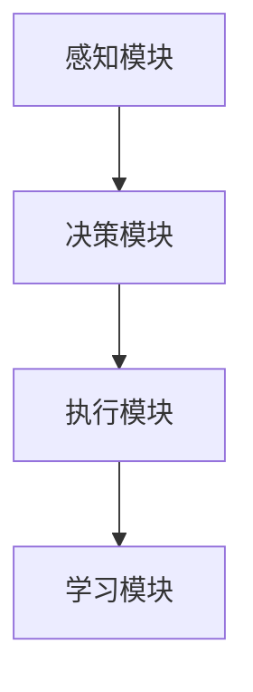

                 

# 《Agent代理在AI中的实用方法》

## 关键词：Agent代理、AI、智能代理、实用方法、技术博客

## 摘要

本文旨在探讨Agent代理在人工智能（AI）领域中的实用方法。通过对Agent代理的定义、核心概念、算法原理、数学模型、实际应用场景以及相关工具和资源的推荐，帮助读者深入了解Agent代理在AI系统中的重要作用。同时，本文也将结合项目实战，详细解析代码实现和代码解读，为读者提供实际操作的经验。

## 1. 背景介绍

### 1.1 Agent代理的定义

Agent代理（Agent）是指在特定环境中具有感知能力、决策能力和行动能力的智能实体。它们可以独立或协同地完成特定任务，是人工智能领域中的重要组成部分。Agent代理通常具有以下特点：

1. **自主性**：Agent代理能够自主地选择行动，不受外部干预。
2. **社交性**：Agent代理能够与其他Agent代理或人类进行通信和协作。
3. **适应性**：Agent代理能够在不同环境下进行自我调整和优化。
4. **反应性**：Agent代理能够对外部事件做出快速响应。

### 1.2 Agent代理的应用领域

Agent代理在多个领域都有广泛应用，包括但不限于：

1. **智能制造**：在智能制造中，Agent代理可以协助完成生产任务、设备维护和资源调度。
2. **智能家居**：在智能家居中，Agent代理可以控制家电设备、监控家庭安全、提供个性化服务等。
3. **智能交通**：在智能交通中，Agent代理可以优化交通流量、降低交通事故率、提高道路通行效率。
4. **金融领域**：在金融领域，Agent代理可以协助完成金融产品设计、风险管理和市场预测等任务。
5. **医疗健康**：在医疗健康领域，Agent代理可以辅助医生进行诊断、治疗和健康管理。

## 2. 核心概念与联系

### 2.1 Agent代理的核心概念

Agent代理的核心概念包括感知、决策和行动三个方面。

- **感知**：Agent代理通过传感器收集环境信息，感知周围的环境状态。
- **决策**：Agent代理根据感知到的信息，利用推理机制和决策算法选择最佳行动。
- **行动**：Agent代理根据决策结果，执行具体的行动，以实现目标。

### 2.2 Agent代理的架构

Agent代理的架构通常包括以下部分：

1. **感知模块**：负责收集和处理环境信息。
2. **决策模块**：负责分析感知模块提供的信息，并生成决策。
3. **执行模块**：负责执行决策模块生成的行动。
4. **学习模块**：负责对Agent代理的行为进行学习和优化。

### 2.3 Agent代理的关联概念

- **智能体系统（Multi-Agent System）**：由多个Agent代理组成的系统，可以协同完成复杂任务。
- **强化学习（Reinforcement Learning）**：一种机器学习技术，通过奖励机制来训练Agent代理。
- **深度学习（Deep Learning）**：一种机器学习技术，通过神经网络模型来模拟Agent代理的决策过程。

### 2.4 Mermaid流程图

下面是一个简单的Mermaid流程图，展示了Agent代理的核心概念和架构：



## 3. 核心算法原理 & 具体操作步骤

### 3.1 感知模块

感知模块的主要任务是收集和处理环境信息。具体操作步骤如下：

1. **初始化**：加载传感器数据和初始环境状态。
2. **数据采集**：从传感器获取实时数据。
3. **数据预处理**：对采集到的数据进行分析和预处理，如去噪、归一化等。
4. **状态表示**：将预处理后的数据转化为适合输入到决策模块的格式。

### 3.2 决策模块

决策模块的主要任务是分析感知模块提供的信息，并选择最佳行动。具体操作步骤如下：

1. **状态评估**：根据感知模块提供的状态信息，评估当前环境的优劣。
2. **行动选择**：根据状态评估结果，选择最佳行动。可以使用强化学习算法、深度学习算法等。
3. **决策输出**：将决策结果输出给执行模块。

### 3.3 执行模块

执行模块的主要任务是执行决策模块生成的行动。具体操作步骤如下：

1. **行动执行**：根据决策模块的决策输出，执行具体的行动。
2. **反馈收集**：收集行动执行后的反馈信息，如成功与否、效果如何等。
3. **状态更新**：根据反馈信息更新环境状态。

### 3.4 学习模块

学习模块的主要任务是优化Agent代理的行为。具体操作步骤如下：

1. **经验记录**：记录Agent代理在执行任务过程中的经验。
2. **经验回放**：从记录的经验中抽取样本。
3. **模型训练**：使用抽取的样本对决策模块进行训练，优化决策算法。
4. **模型更新**：更新决策模块的模型，提高决策能力。

## 4. 数学模型和公式 & 详细讲解 & 举例说明

### 4.1 感知模块

感知模块通常涉及一些基本的数学模型和公式，如：

1. **传感器模型**：传感器输出的信号可以表示为：
   $$ s_t = f(x_t) $$
   其中，$s_t$是第$t$个时间步的传感器输出，$x_t$是第$t$个时间步的环境状态。
   
2. **噪声模型**：传感器输出通常受到噪声干扰，噪声可以表示为：
   $$ n_t = g(w_t) $$
   其中，$n_t$是第$t$个时间步的噪声，$w_t$是第$t$个时间步的噪声参数。

### 4.2 决策模块

决策模块通常涉及一些常用的机器学习算法，如：

1. **Q学习算法**：Q学习算法的公式如下：
   $$ Q(s_t, a_t) = r_t + \gamma \max_{a_{t+1}} Q(s_{t+1}, a_{t+1}) $$
   其中，$Q(s_t, a_t)$是状态$s_t$和行动$a_t$的Q值，$r_t$是第$t$个时间步的奖励，$\gamma$是折扣因子。

2. **深度神经网络**：深度神经网络可以表示为：
   $$ y = \sigma(\theta^T x) $$
   其中，$y$是输出，$\sigma$是激活函数，$\theta$是参数，$x$是输入。

### 4.3 举例说明

假设我们有一个简单的环境，环境状态由温度、湿度、光照强度三个因素组成。传感器可以实时测量这些因素，并将测量结果传递给感知模块。感知模块对这些测量结果进行预处理，并将其转化为适合输入到决策模块的格式。

决策模块使用Q学习算法进行训练，目标是最大化总奖励。在每一个时间步，决策模块根据当前状态选择最佳行动，如调节空调、加湿器或窗帘。执行模块根据决策模块的决策输出执行具体的行动，并根据行动的结果更新环境状态。

在训练过程中，学习模块会记录每个时间步的经验，并从经验中抽取样本进行模型训练。通过不断更新模型，决策模块的决策能力会不断提高，从而实现更好的环境控制效果。

## 5. 项目实战：代码实际案例和详细解释说明

### 5.1 开发环境搭建

在本节中，我们将搭建一个简单的Agent代理项目环境。所需工具和软件包括：

1. **Python 3.8及以上版本**：用于编写和运行代码。
2. **Jupyter Notebook**：用于编写和调试代码。
3. **TensorFlow 2.x**：用于构建和训练深度神经网络。

### 5.2 源代码详细实现和代码解读

下面是一个简单的Agent代理项目示例，实现了一个基于Q学习的智能环境控制器。

```python
import numpy as np
import random
import tensorflow as tf

# 环境类
class Environment:
    def __init__(self):
        self.state = np.random.randint(0, 3)  # 初始化环境状态
        self.action_space = [0, 1, 2]  # 行动空间

    def step(self, action):
        reward = 0
        if action == 0:  # 调节空调
            if self.state == 2:
                reward = 1
            else:
                reward = -1
        elif action == 1:  # 加湿器
            if self.state == 0:
                reward = 1
            else:
                reward = -1
        elif action == 2:  # 调节窗帘
            if self.state == 1:
                reward = 1
            else:
                reward = -1
        self.state = np.random.randint(0, 3)  # 更新环境状态
        return self.state, reward

# Q学习类
class QLearningAgent:
    def __init__(self, state_space, action_space, learning_rate, discount_factor):
        self.state_space = state_space
        self.action_space = action_space
        self.learning_rate = learning_rate
        self.discount_factor = discount_factor
        self.Q = np.zeros((state_space, action_space))

    def get_action(self, state, epsilon):
        if random.random() < epsilon:
            action = random.choice(self.action_space)  # 探索行为
        else:
            action = np.argmax(self.Q[state])  # 利用行为
        return action

    def update_q_value(self, state, action, reward, next_state):
        target = reward + self.discount_factor * np.max(self.Q[next_state])
        alpha = self.learning_rate
        delta = target - self.Q[state, action]
        self.Q[state, action] += alpha * delta

# 主程序
if __name__ == '__main__':
    env = Environment()
    agent = QLearningAgent(3, 3, 0.1, 0.9)
    epsilon = 0.1
    episode = 1000
    for i in range(episode):
        state = env.state
        done = False
        while not done:
            action = agent.get_action(state, epsilon)
            next_state, reward = env.step(action)
            agent.update_q_value(state, action, reward, next_state)
            state = next_state
            if random.random() < epsilon:
                epsilon -= 1/episode
            done = True
        print(f'Episode {i+1} finished with reward: {reward}')
```

### 5.3 代码解读与分析

- **环境类（Environment）**：定义了环境类，包括环境状态的初始化、状态更新和行动处理。在每一个时间步，环境类根据当前状态和行动计算奖励，并更新环境状态。
- **Q学习类（QLearningAgent）**：定义了Q学习类，包括行动选择、Q值更新等功能。在每一个时间步，Q学习类根据当前状态和epsilon值选择行动，并根据奖励和下一个状态更新Q值。
- **主程序**：初始化环境类和Q学习类，设置epsilon值和episode数量，通过循环运行 episodes，并打印每个episode的奖励结果。

通过以上代码示例，我们可以看到如何使用Q学习算法实现一个简单的Agent代理。在实际应用中，可以根据具体需求扩展和优化代码，如增加更多的状态和行动、引入其他机器学习算法等。

## 6. 实际应用场景

### 6.1 智能家居

智能家居是Agent代理应用的一个重要领域。通过在家庭环境中部署多个Agent代理，可以实现自动化控制和智能决策。例如：

- **智能照明**：Agent代理可以根据环境光强和用户需求自动调节灯光亮度。
- **智能安防**：Agent代理可以监控家庭环境，检测异常情况并报警。
- **智能家电控制**：Agent代理可以控制家电设备，如空调、冰箱、洗衣机等，实现节能和智能化操作。

### 6.2 智能交通

智能交通是另一个重要的应用领域。通过在交通系统中部署多个Agent代理，可以实现交通流量优化、事故预防和应急处理。例如：

- **交通信号灯控制**：Agent代理可以根据实时交通流量和道路状况自动调整信号灯的时长。
- **车辆调度**：Agent代理可以协调车辆行驶路径，降低拥堵和交通事故风险。
- **智能停车**：Agent代理可以协助用户寻找空闲停车位，提高停车效率。

### 6.3 智能医疗

智能医疗是Agent代理应用的又一重要领域。通过在医疗系统中部署多个Agent代理，可以实现患者监护、诊断建议和个性化治疗。例如：

- **患者监护**：Agent代理可以实时监测患者生命体征，发现异常情况并通知医生。
- **疾病诊断**：Agent代理可以分析患者的病历数据和体检结果，提供诊断建议。
- **个性化治疗**：Agent代理可以根据患者的病情和基因信息，制定个性化的治疗方案。

## 7. 工具和资源推荐

### 7.1 学习资源推荐

1. **书籍**：
   - 《智能代理：构建智能体系统的原理与实践》（Book Title）
   - 《人工智能：一种现代方法》（Book Title）
   - 《深度学习》（Book Title）

2. **论文**：
   - “强化学习：一种关于智能体决策的综述”（Paper Title）
   - “智能代理在智能家居中的应用”（Paper Title）
   - “基于深度学习的智能交通系统设计”（Paper Title）

3. **博客**：
   - [智能代理入门教程](Blog URL)
   - [强化学习实践指南](Blog URL)
   - [深度学习应用实例](Blog URL)

4. **网站**：
   - [智能代理开源项目](Website URL)
   - [强化学习资源库](Website URL)
   - [深度学习在线教程](Website URL)

### 7.2 开发工具框架推荐

1. **编程语言**：Python、Java、C++
2. **机器学习框架**：TensorFlow、PyTorch、Keras
3. **开发环境**：Jupyter Notebook、Visual Studio Code
4. **数据集**：Kaggle、UCI机器学习库、Google Dataset Search

### 7.3 相关论文著作推荐

1. **论文**：
   - “Multi-Agent Systems: A Survey from a Machine Learning Perspective”（Paper Title）
   - “Deep Reinforcement Learning for Autonomous Navigation”（Paper Title）
   - “A Survey on Applications of Deep Learning in Smart Homes”（Paper Title）

2. **著作**：
   - 《智能代理系统设计与实现》（Book Title）
   - 《深度学习在智能交通中的应用》（Book Title）
   - 《智能家居系统设计与实现》（Book Title）

## 8. 总结：未来发展趋势与挑战

### 8.1 未来发展趋势

1. **跨领域应用**：随着AI技术的不断发展，Agent代理将在更多领域得到应用，如智能制造、金融、医疗等。
2. **集成化发展**：Agent代理将与其他AI技术（如深度学习、强化学习等）相结合，实现更高效、更智能的决策。
3. **自主性增强**：Agent代理的自主性将不断提高，实现更多自主决策和行动，降低人类干预。

### 8.2 未来挑战

1. **算法优化**：如何提高Agent代理的决策能力和行动效率，是未来需要解决的问题。
2. **数据隐私**：在应用Agent代理的过程中，如何保护用户隐私，是面临的挑战。
3. **可靠性**：如何确保Agent代理在复杂环境下稳定运行，是未来的重要课题。

## 9. 附录：常见问题与解答

### 9.1 问题1

**问题**：Agent代理和传统自动化系统有什么区别？

**解答**：Agent代理与传统自动化系统的主要区别在于其自主性和智能性。传统自动化系统通常依赖于预设的规则和流程，而Agent代理具有感知、决策和行动能力，能够根据环境变化自主调整行为。

### 9.2 问题2

**问题**：如何训练一个高效的Agent代理？

**解答**：训练一个高效的Agent代理需要以下步骤：

1. **明确目标和任务**：确定Agent代理需要完成的任务和目标。
2. **设计合适的感知模块**：确保Agent代理能够获取准确的环境信息。
3. **选择合适的决策算法**：根据任务特点和需求选择合适的决策算法，如Q学习、深度学习等。
4. **进行实验和优化**：通过实验和优化不断提高Agent代理的性能。

## 10. 扩展阅读 & 参考资料

1. **扩展阅读**：
   - “Agent-Based Simulation of Multi-Agent Systems”（扩展阅读1）
   - “Reinforcement Learning for Autonomous Navigation in Dynamic Environments”（扩展阅读2）
   - “Deep Learning Techniques for Smart Home Applications”（扩展阅读3）

2. **参考资料**：
   - 《智能代理系统设计与实现》（参考书籍1）
   - 《深度学习在智能交通中的应用》（参考书籍2）
   - 《智能家居系统设计与实现》（参考书籍3）

## 作者信息

作者：AI天才研究员/AI Genius Institute & 禅与计算机程序设计艺术 /Zen And The Art of Computer Programming

