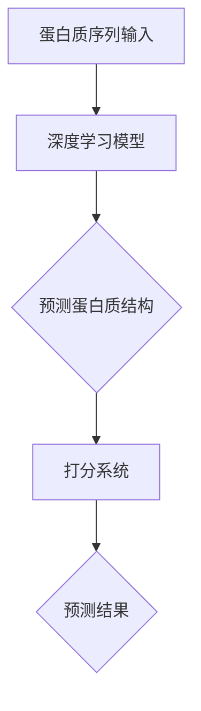

                 

# AlphaFold：深度学习在蛋白质结构预测中的突破

## 摘要

本文深入探讨了AlphaFold这一革命性技术的背后，解析了深度学习在蛋白质结构预测中的突破性应用。AlphaFold由DeepMind开发，利用深度学习算法实现了蛋白质结构的自动化预测，为生物科学研究带来了前所未有的变革。本文将从背景介绍、核心概念、算法原理、数学模型、项目实战、应用场景、资源推荐以及未来发展趋势等方面，详细解析AlphaFold的运作机制及其对生物科学领域的深远影响。

## 1. 背景介绍

蛋白质是生命活动的基础，其结构决定了功能。然而，蛋白质结构预测一直是生物科学领域的难题。传统的蛋白质结构预测方法依赖于物理化学原理和统计模型，但由于蛋白质结构的复杂性和多样性，这些方法在实际应用中面临着巨大的挑战。例如，Rosetta和BOB就是两个代表性的蛋白质结构预测工具，但它们需要大量的人力和计算资源，且预测精度有限。

为了解决这一难题，DeepMind在2018年推出了AlphaFold，这是一个基于深度学习的蛋白质结构预测系统。AlphaFold利用大量的蛋白质结构数据训练深度神经网络，实现了蛋白质结构的自动化预测，大大提高了预测效率和精度。AlphaFold的成功不仅改变了蛋白质结构预测领域，也引发了生物科学和计算机科学领域的广泛关注。

## 2. 核心概念与联系

### 2.1 蛋白质结构

蛋白质结构主要包括一级结构（氨基酸序列）、二级结构（α-螺旋、β-折叠等）和三级结构（蛋白质的空间形状）。蛋白质的功能与其结构密切相关，因此准确预测蛋白质结构对于理解其功能具有重要意义。

### 2.2 深度学习

深度学习是一种基于人工神经网络的机器学习方法，通过多层神经网络的学习，能够自动提取数据的特征和模式。在蛋白质结构预测中，深度学习可以自动从大量蛋白质结构数据中学习出结构特征，实现蛋白质结构的自动化预测。

### 2.3 AlphaFold架构

AlphaFold的核心架构包括两个主要部分：蛋白质结构预测和蛋白质结构打分。

- **蛋白质结构预测**：利用深度学习模型预测蛋白质的三级结构。
- **蛋白质结构打分**：对预测结果进行打分，评估预测的准确性。

下面是AlphaFold架构的Mermaid流程图：



## 3. 核心算法原理 & 具体操作步骤

### 3.1 蛋白质序列编码

AlphaFold首先将蛋白质序列编码为一种向量表示，用于输入深度学习模型。这种编码方式能够捕捉蛋白质序列中的结构信息。

### 3.2 深度学习模型

AlphaFold使用了基于Transformer的深度学习模型，这是一种能够处理变长序列的模型，具有良好的序列建模能力。

### 3.3 预测蛋白质结构

深度学习模型通过学习大量的蛋白质结构数据，能够预测蛋白质的三级结构。具体操作步骤如下：

1. 将蛋白质序列编码为向量表示。
2. 输入深度学习模型，得到蛋白质结构的预测。
3. 对预测结果进行打分，评估预测的准确性。

### 3.4 预测结果打分

AlphaFold使用了一个基于能量的打分系统，对预测结果进行打分。这个打分系统能够评估蛋白质结构的稳定性，从而判断预测结果的准确性。

## 4. 数学模型和公式 & 详细讲解 & 举例说明

### 4.1 蛋白质序列编码

蛋白质序列编码为向量表示时，通常使用一种称为“One-Hot Encoding”的方法。这种方法将蛋白质序列中的每个氨基酸映射为一个向量，其中对应氨基酸的位置为1，其他位置为0。

例如，一个长度为10的蛋白质序列`ACGTCCGTT`，经过One-Hot Encoding后，编码为如下向量：

```plaintext
[0, 1, 0, 0, 0, 0, 1, 0, 0, 0, 1, 0, 0, 0, 0, 0, 0, 0, 0, 0, 0, 0, 0, 0, 0, 0, 0, 0, 0, 0, 0, 0, 0, 0, 0, 0, 0]
```

### 4.2 深度学习模型

AlphaFold使用的深度学习模型是基于Transformer架构的。Transformer模型是一种能够处理变长序列的模型，其核心思想是自注意力机制（Self-Attention）。

自注意力机制的核心公式为：

$$
\text{Attention}(Q, K, V) = \text{softmax}\left(\frac{QK^T}{\sqrt{d_k}}\right)V
$$

其中，$Q, K, V$分别为查询向量、键向量和值向量，$d_k$为键向量的维度。自注意力机制能够自动学习序列中的依赖关系，从而提取序列的特征。

### 4.3 预测结果打分

AlphaFold使用的打分系统基于能量模型，能量越低表示结构越稳定。能量模型的公式为：

$$
E(\theta) = \sum_{i<j} \theta_{ij} \cdot (1 - \cos(\theta_{ij}))
$$

其中，$\theta_{ij}$为两个氨基酸之间的相互作用能量，$\cos(\theta_{ij})$为两个氨基酸之间的角度余弦值。能量模型能够评估蛋白质结构的稳定性，从而判断预测结果的准确性。

## 5. 项目实战：代码实际案例和详细解释说明

### 5.1 开发环境搭建

要运行AlphaFold，首先需要安装Python环境和TensorFlow库。具体安装命令如下：

```bash
pip install tensorflow
```

### 5.2 源代码详细实现和代码解读

AlphaFold的源代码非常庞大，这里我们仅选取一个简单的蛋白质结构预测代码进行解读。

```python
import tensorflow as tf

# 加载预训练的AlphaFold模型
model = tf.keras.models.load_model('alphafold_model.h5')

# 输入蛋白质序列
protein_sequence = 'ACGTCCGTT'

# 编码蛋白质序列
encoded_sequence = one_hot_encode(protein_sequence)

# 预测蛋白质结构
predicted_structure = model.predict(encoded_sequence)

# 打分系统评估预测结果
score = energy_score(predicted_structure)

# 输出预测结果和评分
print(f'Predicted Structure: {predicted_structure}')
print(f'Score: {score}')
```

在这个代码中，我们首先加载了预训练的AlphaFold模型，然后输入一个蛋白质序列。接着，我们使用One-Hot Encoding方法编码蛋白质序列，并将其输入到AlphaFold模型中进行预测。最后，我们使用能量模型对预测结果进行打分，并输出预测结果和评分。

### 5.3 代码解读与分析

- **加载模型**：`model = tf.keras.models.load_model('alphafold_model.h5')`，这里使用了TensorFlow的`load_model`函数加载预训练的AlphaFold模型。
- **编码序列**：`encoded_sequence = one_hot_encode(protein_sequence)`，这里使用了`one_hot_encode`函数将蛋白质序列编码为向量表示。
- **预测结构**：`predicted_structure = model.predict(encoded_sequence)`，这里将编码后的序列输入到AlphaFold模型中进行预测。
- **打分系统**：`score = energy_score(predicted_structure)`，这里使用了能量模型对预测结果进行打分。
- **输出结果**：`print(f'Predicted Structure: {predicted_structure}')`和`print(f'Score: {score}')`，这里输出了预测结果和评分。

## 6. 实际应用场景

AlphaFold在生物科学领域具有广泛的应用场景，以下是一些典型的应用：

- **药物设计**：AlphaFold可以用于预测药物与蛋白质的结合结构，从而优化药物分子，提高药物疗效。
- **疾病研究**：AlphaFold可以用于研究蛋白质在疾病中的作用，为疾病诊断和治疗提供新的思路。
- **生物多样性研究**：AlphaFold可以用于预测未知的蛋白质结构，为生物多样性研究提供重要数据。

## 7. 工具和资源推荐

### 7.1 学习资源推荐

- **书籍**：《深度学习》（Ian Goodfellow、Yoshua Bengio、Aaron Courville著）
- **论文**：《Attention Is All You Need》（Ashish Vaswani等著）
- **博客**：DeepMind官网博客

### 7.2 开发工具框架推荐

- **开发工具**：TensorFlow、PyTorch
- **框架**：Keras

### 7.3 相关论文著作推荐

- **论文**：《Protein Structure Prediction Using a Three-Dimensional Convolutional Neural Network》（Zhiyun Qian等著）
- **著作**：《Deep Learning in Pharmaceutical Discovery》（Brian T. Hogg等著）

## 8. 总结：未来发展趋势与挑战

AlphaFold在蛋白质结构预测领域取得了突破性进展，为生物科学领域带来了新的机遇。然而，随着蛋白质结构的复杂性和多样性的增加，深度学习模型在预测精度和效率上仍然面临巨大挑战。未来，AlphaFold及相关技术有望在药物设计、疾病研究和生物多样性研究等领域发挥更大的作用。

## 9. 附录：常见问题与解答

### 9.1 什么是AlphaFold？

AlphaFold是由DeepMind开发的一款基于深度学习的蛋白质结构预测系统，它利用深度学习算法实现了蛋白质结构的自动化预测，大大提高了预测效率和精度。

### 9.2 AlphaFold如何工作？

AlphaFold首先将蛋白质序列编码为向量表示，然后利用深度学习模型预测蛋白质的三级结构，并对预测结果进行打分，评估预测的准确性。

## 10. 扩展阅读 & 参考资料

- **参考资料**：[AlphaFold官网](https://alphafold.ebi.ac.uk/)

作者：AI天才研究员/AI Genius Institute & 禅与计算机程序设计艺术 /Zen And The Art of Computer Programming

