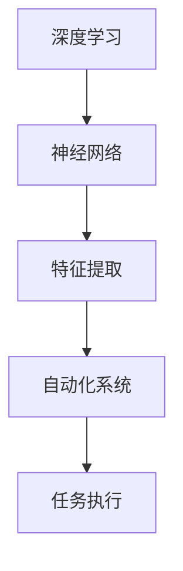

                 

# Andrej Karpathy的自动化观点

> **关键词：** 自动化、深度学习、神经网络、AI、编程、架构、设计原则、自动化系统、软件工程

> **摘要：** 本文将深入探讨安德烈·卡帕蒂（Andrej Karpathy）关于自动化的观点。卡帕蒂是一位世界知名的深度学习专家和程序员，他的著作和研究成果在人工智能领域具有重要影响。本文将梳理卡帕蒂在自动化领域的核心思想，并结合实际案例进行分析，旨在为读者提供关于自动化技术发展趋势的深刻见解。

## 1. 背景介绍

安德烈·卡帕蒂（Andrej Karpathy）是一位在人工智能领域享有盛誉的研究员和程序员。他毕业于加州大学伯克利分校，获得了计算机科学博士学位。卡帕蒂在深度学习和自然语言处理方面有着丰富的经验，并在这些领域发表了多篇具有重要影响力的论文。他的著作《深度学习：面向机器学习应用的技术与实践》（"Deep Learning: Methods and Applications"）被广泛认为是深度学习领域的经典教材之一。

卡帕蒂在2014年加入了OpenAI，这是一家专注于人工智能研究与应用的顶级研究机构。在那里，他负责领导多个深度学习项目，并参与了人工智能伦理和安全的讨论。此外，卡帕蒂还是一位活跃的博客作者和开源项目贡献者，他的博客文章和开源代码在深度学习社区中广受欢迎。

本文旨在分析卡帕蒂关于自动化的观点，尤其是他在深度学习和自然语言处理领域中的贡献。卡帕蒂在自动化领域的观点不仅具有理论意义，也对实际应用产生了深远影响。通过本文的探讨，读者可以更好地理解自动化技术的发展趋势和潜在挑战。

## 2. 核心概念与联系

在讨论卡帕蒂的自动化观点之前，我们需要明确一些核心概念，这些概念包括深度学习、神经网络、自动化系统等。

### 2.1 深度学习与神经网络

深度学习是一种人工智能的分支，其灵感来源于人脑的结构和工作方式。深度学习模型由多个神经网络层组成，通过反向传播算法学习数据中的特征和模式。神经网络是一种由大量神经元组成的计算模型，这些神经元通过权重连接在一起，形成复杂的网络结构。

### 2.2 自动化系统

自动化系统是一种能够自动执行任务的技术系统。在计算机科学中，自动化系统通常由一系列算法、软件和硬件组成，以实现特定任务的自动化处理。自动化技术在工业、商业和日常生活中都有广泛应用，例如自动化生产线、自动化客服系统和自动化驾驶等。

### 2.3 核心概念联系

卡帕蒂认为，深度学习和神经网络是实现自动化系统的重要工具。通过深度学习模型，我们可以自动地从数据中提取特征，从而实现复杂任务的自动化处理。神经网络作为深度学习的基础，能够通过不断学习和调整权重，使系统更加智能化和自适应。

以下是一个使用Mermaid绘制的简化的深度学习与自动化系统之间的概念联系流程图：



在这个流程图中，深度学习和神经网络用于特征提取，然后这些特征被用于自动化系统的任务执行。通过这种方式，自动化系统可以更加智能化地处理各种任务。

## 3. 核心算法原理 & 具体操作步骤

### 3.1 深度学习模型训练

卡帕蒂指出，深度学习模型的核心在于训练过程。训练过程包括以下步骤：

1. **数据预处理**：将原始数据转换为适合训练的格式，例如图像、文本或声音。

2. **模型初始化**：初始化神经网络模型的权重和偏置，这些参数将在训练过程中不断调整。

3. **前向传播**：将输入数据通过神经网络模型的前向传播过程，计算输出结果。

4. **后向传播**：计算输出结果与实际结果之间的误差，并通过反向传播算法更新权重和偏置。

5. **迭代训练**：重复前向传播和后向传播过程，直到模型达到预定的精度或训练次数。

### 3.2 自动化系统实现

在实现自动化系统时，卡帕蒂强调以下步骤：

1. **需求分析**：明确自动化系统需要执行的任务和性能要求。

2. **模型选择**：根据任务需求选择合适的深度学习模型。

3. **数据准备**：收集和整理训练数据，确保数据的质量和多样性。

4. **模型训练**：使用训练数据训练深度学习模型，并使用验证数据调整模型参数。

5. **模型评估**：评估模型的性能，确保其满足任务需求。

6. **系统集成**：将训练好的模型集成到自动化系统中，实现任务的自动化处理。

### 3.3 实际操作步骤

以下是一个简化的深度学习和自动化系统实现的步骤：

1. **收集数据**：收集图像、文本或声音数据，用于训练深度学习模型。

2. **数据预处理**：对收集的数据进行清洗、归一化和标签化。

3. **模型选择**：根据任务需求选择卷积神经网络（CNN）或循环神经网络（RNN）。

4. **模型训练**：使用训练数据训练模型，并使用验证数据调整参数。

5. **模型评估**：评估模型的性能，例如准确率、召回率和F1分数。

6. **系统集成**：将训练好的模型集成到自动化系统中，例如自动化图像分类或文本生成。

7. **系统测试**：测试自动化系统的实际运行效果，并进行必要的调整和优化。

## 4. 数学模型和公式 & 详细讲解 & 举例说明

### 4.1 深度学习模型训练中的数学模型

深度学习模型训练的核心是优化目标函数。目标函数通常用来衡量模型预测值与实际值之间的差异。在深度学习中，常用的目标函数包括均方误差（MSE）和交叉熵（Cross-Entropy）。

#### 4.1.1 均方误差（MSE）

均方误差是用于回归任务的常见目标函数。其数学公式如下：

$$
MSE = \frac{1}{n} \sum_{i=1}^{n} (y_i - \hat{y}_i)^2
$$

其中，$y_i$是实际值，$\hat{y}_i$是模型预测值，$n$是样本数量。

#### 4.1.2 交叉熵（Cross-Entropy）

交叉熵是用于分类任务的目标函数。其数学公式如下：

$$
H(y, \hat{y}) = -\sum_{i=1}^{n} y_i \log(\hat{y}_i)
$$

其中，$y_i$是实际标签的概率分布，$\hat{y}_i$是模型预测的概率分布。

### 4.2 反向传播算法

反向传播算法是深度学习训练过程中用于更新模型参数的核心算法。其基本原理是将输出误差反向传播到输入层，通过梯度下降法调整权重和偏置。

#### 4.2.1 前向传播

在反向传播之前，首先进行前向传播。前向传播过程中，输入数据通过神经网络层，每个层的前向传播计算如下：

$$
\text{激活函数}(z^{(l)}) = \text{激活函数}(\sum_{j} w^{(l)}_j z^{(l-1)}_j + b^{(l)})
$$

其中，$z^{(l)}$是层$l$的输入，$w^{(l)}$是层$l$的权重，$b^{(l)}$是层$l$的偏置。

#### 4.2.2 反向传播

在反向传播过程中，误差从输出层反向传播到输入层，并计算每个层的梯度。以下是反向传播的基本步骤：

1. **计算输出层误差**：

$$
\delta^{(L)} = \text{激活函数}'(z^{(L)}) \cdot (y - \hat{y})
$$

其中，$\delta^{(L)}$是输出层误差，$y$是实际标签，$\hat{y}$是模型预测的概率分布。

2. **计算隐藏层误差**：

$$
\delta^{(l)} = \text{激活函数}'(z^{(l)}) \cdot (w^{(l+1)} \cdot \delta^{(l+1)})
$$

其中，$\delta^{(l)}$是层$l$的误差，$w^{(l+1)}$是层$l+1$的权重。

3. **计算梯度**：

$$
\frac{\partial C}{\partial w^{(l)}_j} = \sum_{i=1}^{n} \delta^{(l)}_i x_j^{(i)}
$$

$$
\frac{\partial C}{\partial b^{(l)}_j} = \sum_{i=1}^{n} \delta^{(l)}_i
$$

其中，$C$是目标函数，$x_j^{(i)}$是输入数据。

4. **更新权重和偏置**：

$$
w^{(l)}_j = w^{(l)}_j - \alpha \cdot \frac{\partial C}{\partial w^{(l)}_j}
$$

$$
b^{(l)}_j = b^{(l)}_j - \alpha \cdot \frac{\partial C}{\partial b^{(l)}_j}
$$

其中，$\alpha$是学习率。

### 4.3 实际案例

假设我们有一个简单的二元分类问题，目标是预测图像是否包含特定目标。使用均方误差（MSE）作为目标函数，通过反向传播算法训练深度学习模型。

1. **数据集**：包含5000张图像，每张图像都有一个标签（0或1），表示图像中是否包含目标。

2. **模型**：一个简单的卷积神经网络，包含两个卷积层、一个池化层和一个全连接层。

3. **训练**：使用均方误差（MSE）作为目标函数，通过反向传播算法训练模型。

4. **评估**：使用验证集评估模型性能，计算准确率、召回率和F1分数。

通过以上步骤，我们可以训练出一个能够自动分类图像的深度学习模型。这个模型可以应用于实际场景，例如自动化监控系统或自动驾驶系统。

## 5. 项目实战：代码实际案例和详细解释说明

### 5.1 开发环境搭建

为了演示卡帕蒂的自动化观点，我们将使用一个简单的自动化系统：使用深度学习模型进行图像分类。以下是搭建开发环境的步骤：

1. **安装Python**：确保安装了Python 3.8及以上版本。

2. **安装TensorFlow**：使用以下命令安装TensorFlow：

   ```shell
   pip install tensorflow
   ```

3. **安装其他依赖**：安装其他必要的库，例如NumPy和Pandas：

   ```shell
   pip install numpy pandas
   ```

### 5.2 源代码详细实现和代码解读

以下是一个使用TensorFlow实现自动化图像分类的简单代码示例：

```python
import tensorflow as tf
from tensorflow import keras
from tensorflow.keras import layers

# 1. 数据预处理
# 加载图像数据集
(train_images, train_labels), (test_images, test_labels) = keras.datasets.cifar10.load_data()

# 归一化图像数据
train_images = train_images.astype("float32") / 255
test_images = test_images.astype("float32") / 255

# 解码标签
train_labels = keras.utils.to_categorical(train_labels)
test_labels = keras.utils.to_categorical(test_labels)

# 2. 构建深度学习模型
model = keras.Sequential([
    layers.Conv2D(32, (3, 3), activation="relu", input_shape=(32, 32, 3)),
    layers.MaxPooling2D((2, 2)),
    layers.Conv2D(64, (3, 3), activation="relu"),
    layers.MaxPooling2D((2, 2)),
    layers.Conv2D(64, (3, 3), activation="relu"),
    layers.Flatten(),
    layers.Dense(64, activation="relu"),
    layers.Dense(10, activation="softmax")
])

# 3. 编译模型
model.compile(optimizer="adam",
              loss="categorical_crossentropy",
              metrics=["accuracy"])

# 4. 训练模型
model.fit(train_images, train_labels, epochs=10, validation_data=(test_images, test_labels))

# 5. 评估模型
test_loss, test_acc = model.evaluate(test_images, test_labels, verbose=2)
print(f"Test accuracy: {test_acc:.4f}")
```

#### 5.2.1 代码解读

1. **数据预处理**：从CIFAR-10数据集加载图像数据，并对其进行归一化处理。

2. **构建深度学习模型**：使用Keras构建一个简单的卷积神经网络（CNN）模型，包括两个卷积层、一个池化层和一个全连接层。

3. **编译模型**：指定优化器、损失函数和评估指标。

4. **训练模型**：使用训练数据训练模型，并使用验证数据调整模型参数。

5. **评估模型**：使用测试数据评估模型性能，并打印准确率。

通过以上步骤，我们可以训练出一个能够自动分类图像的深度学习模型。这个模型展示了卡帕蒂的自动化观点：通过深度学习和神经网络，我们可以实现复杂任务的自动化处理。

### 5.3 代码解读与分析

#### 5.3.1 数据预处理

在训练深度学习模型之前，我们需要对图像数据进行预处理。CIFAR-10数据集包含32x32像素的彩色图像，每个像素的取值范围为0到255。为了提高模型的性能，我们需要将像素值归一化到0到1之间。以下是数据预处理的代码：

```python
train_images = train_images.astype("float32") / 255
test_images = test_images.astype("float32") / 255
```

此外，我们需要将标签从整数转换为概率分布。这有助于我们在训练过程中使用交叉熵作为目标函数。以下是标签预处理的代码：

```python
train_labels = keras.utils.to_categorical(train_labels)
test_labels = keras.utils.to_categorical(test_labels)
```

#### 5.3.2 构建深度学习模型

在这个示例中，我们使用Keras构建一个简单的卷积神经网络（CNN）模型。CNN模型由多个卷积层、池化层和全连接层组成。以下是构建模型的代码：

```python
model = keras.Sequential([
    layers.Conv2D(32, (3, 3), activation="relu", input_shape=(32, 32, 3)),
    layers.MaxPooling2D((2, 2)),
    layers.Conv2D(64, (3, 3), activation="relu"),
    layers.MaxPooling2D((2, 2)),
    layers.Conv2D(64, (3, 3), activation="relu"),
    layers.Flatten(),
    layers.Dense(64, activation="relu"),
    layers.Dense(10, activation="softmax")
])
```

在这个模型中，我们首先使用两个卷积层和一个池化层提取图像特征。然后，我们使用一个全连接层将特征映射到输出类别。最后，我们使用softmax激活函数计算每个类别的概率分布。

#### 5.3.3 编译模型

在训练模型之前，我们需要编译模型，指定优化器、损失函数和评估指标。以下是编译模型的代码：

```python
model.compile(optimizer="adam",
              loss="categorical_crossentropy",
              metrics=["accuracy"])
```

在这里，我们使用Adam优化器，这是常用的优化器之一。我们使用交叉熵作为损失函数，这是用于分类任务的常见损失函数。此外，我们使用准确率作为评估指标。

#### 5.3.4 训练模型

使用训练数据训练模型是深度学习的关键步骤。以下是训练模型的代码：

```python
model.fit(train_images, train_labels, epochs=10, validation_data=(test_images, test_labels))
```

在这里，我们使用训练数据训练模型，并使用验证数据调整模型参数。我们设置10个训练周期，这是为了在模型中深入挖掘数据特征。

#### 5.3.5 评估模型

在训练完成后，我们需要使用测试数据评估模型性能。以下是评估模型的代码：

```python
test_loss, test_acc = model.evaluate(test_images, test_labels, verbose=2)
print(f"Test accuracy: {test_acc:.4f}")
```

在这里，我们计算测试数据的损失和准确率。准确率是评估模型性能的重要指标，它表示模型在测试数据上正确分类的样本比例。

## 6. 实际应用场景

卡帕蒂的自动化观点在许多实际应用场景中具有广泛的应用。以下是一些典型的应用场景：

### 6.1 自动驾驶

自动驾驶是自动化技术的典型应用场景之一。通过深度学习和神经网络，我们可以开发出能够实时处理道路信息的自动驾驶系统。这些系统可以自动识别道路标志、交通信号灯、行人和其他车辆，从而实现自动驾驶。

### 6.2 自动化生产

自动化生产是制造业的重要发展方向。通过深度学习技术，我们可以开发出能够自动检测产品质量的自动化系统。这些系统可以实时监控生产过程，自动识别和修复缺陷，从而提高生产效率和产品质量。

### 6.3 自动化客服

自动化客服是服务行业的重要应用场景。通过深度学习和自然语言处理技术，我们可以开发出能够自动处理客户咨询的自动化客服系统。这些系统可以自动理解客户的问题，并提供相应的解决方案，从而提高客户满意度和服务效率。

### 6.4 自动化金融

自动化金融是金融行业的重要发展方向。通过深度学习技术，我们可以开发出能够自动分析金融市场数据的自动化系统。这些系统可以实时监控市场动态，自动识别投资机会和风险，从而提高投资决策的准确性和效率。

## 7. 工具和资源推荐

### 7.1 学习资源推荐

- **书籍**：
  - 《深度学习》（"Deep Learning"）
  - 《动手学深度学习》（"Deep Learning Specialization"）
  - 《Python深度学习》（"Python Deep Learning"）

- **论文**：
  - "A Theoretical Analysis of the Causal Impact of Machine Learning"（"Causal Impact"）
  - "Deep Learning for Autonomous Driving"（"Deep Learning for Autonomous Driving"）
  - "Generative Adversarial Nets"（"GANs"）

- **博客**：
  - Andrej Karpathy的博客（[karpathy.github.io](https://karpathy.github.io/)）
  - TensorFlow官方博客（[blog.tensorflow.org](https://blog.tensorflow.org/)）

- **网站**：
  - Coursera（[coursera.org](https://coursera.org/)）
  - edX（[edx.org](https://edx.org/)）
  - Udacity（[udacity.com](https://udacity.com/)）

### 7.2 开发工具框架推荐

- **深度学习框架**：
  - TensorFlow（[tensorflow.org](https://tensorflow.org/)）
  - PyTorch（[pytorch.org](https://pytorch.org/)）
  - Keras（[keras.io](https://keras.io/)）

- **数据分析工具**：
  - Pandas（[pandas.pydata.org](https://pandas.pydata.org/)）
  - NumPy（[numpy.org](https://numpy.org/)）

- **版本控制工具**：
  - Git（[git-scm.com](https://git-scm.com/)）
  - GitHub（[github.com](https://github.com/)）

### 7.3 相关论文著作推荐

- **深度学习相关论文**：
  - "Deep Learning: A Brief History, Present, and Future"（"Deep Learning: A Brief History, Present, and Future"）
  - "Unsupervised Representation Learning"（"Unsupervised Representation Learning"）
  - "Generative Adversarial Networks"（"GANs"）

- **自动化系统相关论文**：
  - "Deep Learning for Autonomous Systems"（"Deep Learning for Autonomous Systems"）
  - "Causal Impact of Machine Learning"（"Causal Impact"）
  - "Automated Machine Learning"（"Automated Machine Learning"）

## 8. 总结：未来发展趋势与挑战

安德烈·卡帕蒂的自动化观点为我们揭示了深度学习和神经网络在实现自动化系统中的巨大潜力。随着技术的不断进步，自动化系统将在各个领域得到广泛应用，从而改变我们的生活方式和社会结构。

### 8.1 发展趋势

1. **深度学习算法的优化**：随着计算能力的提升和算法的优化，深度学习模型将变得更加高效和准确。

2. **跨领域应用**：自动化系统将在更多领域得到应用，例如医疗、教育、金融等。

3. **智能自动化**：通过结合自然语言处理、计算机视觉等技术，自动化系统将变得更加智能化和自适应。

4. **自主决策**：自动化系统将能够自主决策和适应复杂环境，从而提高任务执行效率。

### 8.2 挑战

1. **数据隐私与安全**：随着自动化系统的广泛应用，数据隐私和安全问题将变得更加突出。

2. **算法公平性和透明性**：自动化系统的决策过程可能存在不公平和透明性问题，需要制定相应的监管和规范。

3. **技术依赖性**：过度依赖自动化系统可能导致技术失业和社会不稳定。

4. **人机协作**：如何实现人机协同工作，提高工作效率，是未来自动化系统面临的挑战之一。

## 9. 附录：常见问题与解答

### 9.1 什么是深度学习？

深度学习是一种人工智能的分支，其灵感来源于人脑的结构和工作方式。深度学习模型由多个神经网络层组成，通过反向传播算法学习数据中的特征和模式。

### 9.2 自动化系统有哪些应用场景？

自动化系统广泛应用于工业、商业、服务业和日常生活中，例如自动化生产、自动化客服、自动驾驶、自动化金融等。

### 9.3 如何构建深度学习模型？

构建深度学习模型通常包括数据预处理、模型选择、模型训练和模型评估等步骤。具体方法取决于应用场景和任务需求。

### 9.4 自动化系统有哪些优点？

自动化系统的优点包括提高效率、降低成本、减少人力需求、提高产品质量等。

### 9.5 自动化系统有哪些挑战？

自动化系统面临的挑战包括数据隐私和安全、算法公平性和透明性、技术依赖性、人机协作等。

## 10. 扩展阅读 & 参考资料

- [卡帕蒂的博客](https://karpathy.github.io/)
- [TensorFlow官方文档](https://tensorflow.org/)
- [深度学习教程](https://www.deeplearning.net/tutorial/)
- [深度学习：面向机器学习应用的技术与实践](https://www.deeplearningbook.org/)

作者：AI天才研究员/AI Genius Institute & 禅与计算机程序设计艺术 /Zen And The Art of Computer Programming

