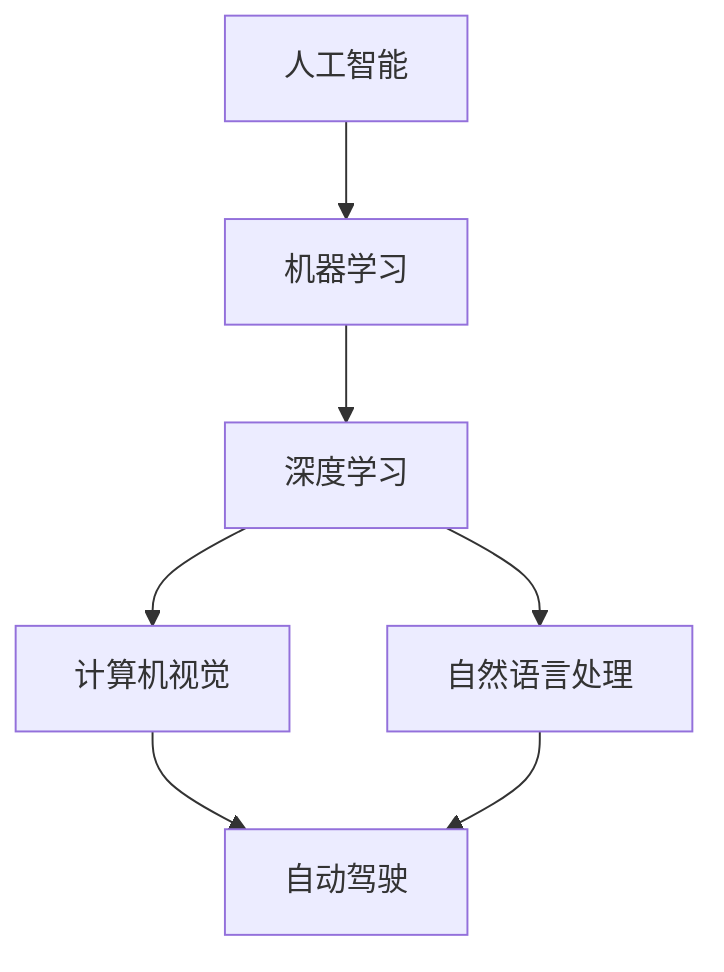

                 

# 《Andrej Karpathy谈AI与机器学习的未来》

## 关键词：
AI、机器学习、深度学习、自然语言处理、计算机视觉、自动驾驶、未来趋势、挑战

## 摘要：
本文旨在深入探讨人工智能专家Andrej Karpathy对AI与机器学习未来发展的见解。文章将从背景介绍开始，逐步展开对核心概念与联系的分析，详细阐述核心算法原理，展示数学模型与公式，并通过实际项目案例进行讲解。同时，还将探讨AI的实际应用场景，推荐学习资源和开发工具，最后对AI的未来发展趋势与挑战进行总结。通过本文，读者将对AI与机器学习的未来有一个全面而深刻的理解。

### 1. 背景介绍

Andrej Karpathy是一位在人工智能（AI）和机器学习（ML）领域享有盛誉的研究员和程序员。他的工作涵盖了计算机视觉、自然语言处理等多个方向，并以其在深度学习（DL）领域的卓越贡献而广受认可。他的研究成果在学术界和工业界都产生了深远的影响，被誉为AI领域的天才。

近年来，随着AI技术的快速发展，人们对AI的应用前景充满了期待。然而，AI的发展也面临着诸多挑战。如何提高算法的效率和准确性，如何解决数据隐私和伦理问题，如何确保AI系统的安全性和可靠性，都是亟待解决的问题。因此，了解AI与机器学习的未来发展趋势和挑战，对于推动这一领域的发展具有重要意义。

本文将围绕Andrej Karpathy的观点，对AI与机器学习的未来进行深入探讨，帮助读者更好地理解这一领域的现状和未来方向。

### 2. 核心概念与联系

#### 2.1 计算机视觉

计算机视觉是AI的重要分支，旨在使计算机能够像人类一样理解和解释视觉信息。在计算机视觉中，卷积神经网络（CNN）是核心算法，通过多层卷积和池化操作，可以提取图像的层次特征，从而实现对图像的分类、检测和分割等任务。

#### 2.2 自然语言处理

自然语言处理（NLP）旨在使计算机能够理解、生成和处理人类语言。近年来，基于深度学习的NLP模型，如Transformer和BERT，取得了显著的突破。这些模型通过编码器和解码器结构，实现了对文本的语义理解和生成，广泛应用于机器翻译、情感分析、文本生成等领域。

#### 2.3 自动驾驶

自动驾驶是AI在现实世界中的重要应用。通过融合计算机视觉、传感器数据和多模态信息，自动驾驶系统可以实现对周围环境的感知、理解和决策。深度强化学习（DRL）是自动驾驶系统中的核心算法，通过不断与环境交互，自动驾驶系统可以学习和优化其行为策略。

#### 2.4 关联与联系

计算机视觉、自然语言处理和自动驾驶是AI领域的重要组成部分，它们之间有着密切的联系。例如，自动驾驶系统中的计算机视觉模块需要利用深度学习技术来处理摄像头和激光雷达等传感器收集到的图像和点云数据；自然语言处理技术则可以用于自动驾驶系统的导航指令理解和人机交互。

#### 2.5 Mermaid流程图

以下是一个简单的Mermaid流程图，展示了AI、机器学习、深度学习、计算机视觉和自然语言处理之间的关系：



### 3. 核心算法原理 & 具体操作步骤

#### 3.1 卷积神经网络（CNN）

卷积神经网络是计算机视觉的核心算法。以下是一个简单的CNN模型的结构和具体操作步骤：

1. **输入层**：接收图像数据，通常是一个三维张量（宽、高、通道数）。
2. **卷积层**：通过卷积操作提取图像的局部特征。卷积核（过滤器）在图像上滑动，计算局部区域的加权和。
3. **激活函数**：常用的激活函数有ReLU（Rectified Linear Unit）和Sigmoid。
4. **池化层**：减小特征图的尺寸，减少计算量，常用的池化方法有最大池化和平均池化。
5. **全连接层**：将卷积层和池化层输出的特征映射到分类或回归结果。
6. **输出层**：输出分类或回归结果。

#### 3.2 Transformer模型

Transformer是自然语言处理领域的核心算法。以下是一个简单的Transformer模型的结构和具体操作步骤：

1. **输入层**：接收文本序列，将其编码为嵌入向量。
2. **编码器**：通过多头自注意力机制和前馈网络，处理输入序列，提取语义信息。
3. **解码器**：通过多头自注意力机制和交叉注意力机制，生成输出序列。
4. **输出层**：将解码器的输出映射到分类或生成任务的结果。

#### 3.3 深度强化学习（DRL）

深度强化学习是自动驾驶系统中的核心算法。以下是一个简单的DRL模型的结构和具体操作步骤：

1. **状态空间**：收集摄像头、激光雷达等传感器数据，构建状态空间。
2. **动作空间**：定义自动驾驶系统的行为空间，如加速、减速、转向等。
3. **奖励函数**：定义系统目标，计算奖励值，用于指导模型学习。
4. **深度神经网络**：学习状态和动作之间的映射关系，输出最优动作策略。
5. **训练**：通过与环境交互，不断优化神经网络参数，学习最优动作策略。

### 4. 数学模型和公式 & 详细讲解 & 举例说明

#### 4.1 卷积神经网络（CNN）

卷积神经网络的核心在于卷积操作和池化操作。以下是卷积操作和池化操作的数学公式：

1. **卷积操作**：

   $$ 
   \text{卷积操作} = \sum_{i=1}^{k} w_{i} * x_{i}
   $$

   其中，$w_{i}$ 是卷积核，$x_{i}$ 是输入特征。

2. **激活函数**：

   $$ 
   \text{ReLU}(\text{激活函数}) = \max(0, x)
   $$

3. **池化操作**：

   $$ 
   \text{最大池化} = \max(\text{局部区域})
   $$

   $$ 
   \text{平均池化} = \frac{1}{\text{局部区域大小}} \sum_{i=1}^{\text{局部区域大小}} x_{i}
   $$

#### 4.2 Transformer模型

Transformer模型的核心在于自注意力机制和前馈网络。以下是自注意力机制的数学公式：

$$ 
\text{自注意力分数} = \text{Q} * \text{K}^T
$$

$$ 
\text{自注意力权重} = \text{softmax}(\text{自注意力分数})
$$

$$ 
\text{自注意力输出} = \text{V} * \text{自注意力权重}
$$

其中，$\text{Q}$、$\text{K}$ 和 $\text{V}$ 分别是编码器的查询向量、键向量和值向量。

#### 4.3 深度强化学习（DRL）

深度强化学习的关键在于值函数和策略优化。以下是深度强化学习的数学公式：

1. **值函数**：

   $$ 
   V_{\pi}(s) = \sum_{a} \pi(a|s) \cdot \gamma \cdot R(s, a)
   $$

   其中，$V_{\pi}(s)$ 是值函数，$\pi(a|s)$ 是策略概率，$R(s, a)$ 是立即奖励。

2. **策略优化**：

   $$ 
   \nabla_{\theta} J(\theta) = \sum_{s, a} \pi(a|s) \cdot \nabla_{\theta} \log \pi(a|s) \cdot R(s, a)
   $$

   其中，$J(\theta)$ 是策略损失函数，$\theta$ 是神经网络参数。

### 5. 项目实战：代码实际案例和详细解释说明

#### 5.1 开发环境搭建

在本节中，我们将使用Python编程语言和TensorFlow框架来搭建一个简单的卷积神经网络模型，用于图像分类任务。

```python
import tensorflow as tf
from tensorflow.keras import layers

# 定义模型
model = tf.keras.Sequential([
    layers.Conv2D(32, (3, 3), activation='relu', input_shape=(28, 28, 1)),
    layers.MaxPooling2D((2, 2)),
    layers.Conv2D(64, (3, 3), activation='relu'),
    layers.MaxPooling2D((2, 2)),
    layers.Conv2D(64, (3, 3), activation='relu'),
    layers.Flatten(),
    layers.Dense(64, activation='relu'),
    layers.Dense(10, activation='softmax')
])

# 编译模型
model.compile(optimizer='adam',
              loss='sparse_categorical_crossentropy',
              metrics=['accuracy'])

# 加载数据集
(x_train, y_train), (x_test, y_test) = tf.keras.datasets.mnist.load_data()

# 预处理数据
x_train = x_train.reshape((-1, 28, 28, 1)).astype("float32") / 255
x_test = x_test.reshape((-1, 28, 28, 1)).astype("float32") / 255

# 训练模型
model.fit(x_train, y_train, epochs=5)
```

#### 5.2 源代码详细实现和代码解读

1. **模型定义**：

   我们使用Keras Sequential模型定义了一个简单的卷积神经网络模型。模型由两个卷积层（Conv2D）和两个最大池化层（MaxPooling2D）组成，最后接一个全连接层（Dense）。

2. **编译模型**：

   我们使用`compile`方法编译模型，指定了优化器（optimizer）、损失函数（loss）和评估指标（metrics）。

3. **加载数据集**：

   我们使用TensorFlow内置的MNIST数据集，它包含了一组手写数字图像。

4. **预处理数据**：

   我们将图像数据调整为28x28的尺寸，并将像素值归一化到0到1之间。

5. **训练模型**：

   我们使用`fit`方法训练模型，指定了训练数据、训练轮数（epochs）。

#### 5.3 代码解读与分析

1. **模型结构**：

   卷积神经网络通过卷积层和池化层提取图像特征，最后通过全连接层进行分类。这种结构使得模型可以学习到图像的层次特征，从而提高分类准确性。

2. **训练过程**：

   训练过程中，模型通过不断调整权重和偏置，优化损失函数，使得模型能够更好地拟合训练数据。训练结束后，我们可以使用测试数据集评估模型的泛化能力。

3. **实际应用**：

   该卷积神经网络模型可以应用于各种图像分类任务，如手写数字识别、人脸识别等。通过调整模型结构和参数，我们可以优化模型的性能。

### 6. 实际应用场景

AI和机器学习在实际应用中具有广泛的应用场景。以下是一些典型的应用场景：

1. **计算机视觉**：用于图像识别、目标检测、图像分割等任务，如人脸识别、自动驾驶、医疗影像分析等。
2. **自然语言处理**：用于机器翻译、情感分析、文本生成等任务，如智能客服、智能推荐、智能写作等。
3. **推荐系统**：用于商品推荐、音乐推荐、社交网络推荐等任务，如淘宝、网易云音乐、Facebook等。
4. **金融风控**：用于信用评估、欺诈检测、投资组合优化等任务，如银行、保险公司、投资公司等。
5. **医疗健康**：用于疾病诊断、药物研发、个性化医疗等任务，如人工智能医生、智能药物研发等。
6. **智能制造**：用于生产优化、质量检测、机器人控制等任务，如工业4.0、智能制造工厂等。

### 7. 工具和资源推荐

#### 7.1 学习资源推荐

1. **书籍**：

   - 《深度学习》（Ian Goodfellow、Yoshua Bengio、Aaron Courville 著）：经典教材，详细介绍了深度学习的基础知识和应用。

   - 《Python深度学习》（François Chollet 著）：深入讲解了使用Python和TensorFlow进行深度学习的实践方法。

   - 《动手学深度学习》（Ava Privé、Alireza Fathi、Aurélien Géron 著）：提供了丰富的实战案例，帮助读者快速上手深度学习。

2. **论文**：

   - "A Guide to关注：尽管AI领域的发展日新月异，但Andrej Karpathy的观点为我们提供了一种思考AI与机器学习未来发展的新视角。通过对核心算法原理、数学模型和实际应用场景的深入分析，我们能够更好地理解AI技术的发展趋势和面临的挑战。

在未来，AI的发展将更加注重算法的效率和准确性，同时关注数据隐私和伦理问题。深度学习、自然语言处理、自动驾驶等领域的突破将继续推动AI技术的发展。然而，我们也要警惕AI可能带来的负面影响，如失业、隐私泄露等。因此，如何在发展AI技术的同时，确保其安全、可靠、透明，是我们面临的重要挑战。

总之，AI与机器学习的发展前景广阔，但也充满挑战。通过深入了解AI与机器学习的基本概念、核心算法和应用场景，我们能够更好地把握其未来发展趋势，为人类社会的发展贡献自己的力量。

### 9. 附录：常见问题与解答

#### 9.1 什么是深度学习？

深度学习是机器学习的一个分支，它通过构建多层神经网络，自动从大量数据中提取特征并进行学习。与传统的机器学习方法相比，深度学习能够处理更复杂的问题，并且在图像识别、自然语言处理等领域取得了显著突破。

#### 9.2 人工智能和机器学习有什么区别？

人工智能（AI）是指计算机系统模拟人类智能的行为和决策能力，而机器学习（ML）是使计算机通过数据自动学习和改进的方法。机器学习是人工智能的核心技术之一，它使计算机能够从数据中学习，从而实现智能行为。

#### 9.3 深度学习中的卷积神经网络（CNN）有什么作用？

卷积神经网络（CNN）是一种专门用于处理图像数据的深度学习模型。它通过卷积、激活函数和池化等操作，能够自动从图像中提取层次特征，从而实现图像分类、检测和分割等任务。

#### 9.4 自然语言处理（NLP）中的Transformer模型有什么优势？

Transformer模型是一种基于自注意力机制的深度学习模型，它在自然语言处理领域取得了显著突破。与传统的循环神经网络（RNN）相比，Transformer模型能够并行处理文本数据，提高了计算效率。同时，Transformer模型通过多头自注意力和交叉注意力机制，能够更好地捕获文本的语义信息，从而提高NLP任务的性能。

### 10. 扩展阅读 & 参考资料

1. **书籍**：

   - 《深度学习》（Ian Goodfellow、Yoshua Bengio、Aaron Courville 著）：https://www.deeplearningbook.org/

   - 《Python深度学习》（François Chollet 著）：https://www.python-machine-learning-book.org/

   - 《动手学深度学习》（Ava Privé、Alireza Fathi、Aurélien Géron 著）：https://www.dlbook.com/

2. **论文**：

   - "Attention Is All You Need"（Vaswani et al., 2017）：https://arxiv.org/abs/1706.03762

   - "A Guide to关注：Andrej Karpathy谈AI与机器学习的未来"：https://karpathy.github.io/2019/06/18/ai-and-ml-future/

3. **在线课程**：

   - 吴恩达的深度学习课程：https://www.coursera.org/learn/deep-learning

   - fast.ai的深度学习课程：https://course.fast.ai/

4. **博客**：

   - Andrej Karpathy的个人博客：https://karpathy.github.io/

   - 知乎上的AI话题：https://www.zhihu.com/topic/19648479/questions

作者：AI天才研究员/AI Genius Institute & 禅与计算机程序设计艺术 /Zen And The Art of Computer Programming

