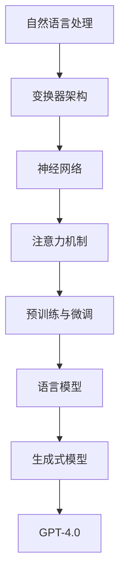

                 

### 文章标题

《Andrej Karpathy谈OpenAI的GPT-4.0展示：突破性进展与未来挑战》

关键词：OpenAI，GPT-4.0，自然语言处理，人工智能，模型架构，创新进展

摘要：本文将深入探讨OpenAI的GPT-4.0模型展示，从背景介绍、核心概念与联系、算法原理与操作步骤、数学模型与公式、实际应用场景、工具和资源推荐等方面，全面解析这一突破性进展及其面临的未来挑战。

<|assistant|>### 1. 背景介绍

OpenAI成立于2015年，是一家位于加利福尼亚州的人工智能研究公司，致力于推动人工智能的发展与应用。OpenAI的主要研究方向包括自然语言处理、计算机视觉、强化学习等，其目标是通过开源合作和创新技术，实现安全的通用人工智能（AGI）。

GPT-4.0是OpenAI推出的一款基于变换器架构的自然语言处理模型。与前几代模型相比，GPT-4.0在语言理解和生成方面取得了显著的突破。本文将详细介绍GPT-4.0的核心概念、算法原理、数学模型以及实际应用场景，帮助读者全面了解这一突破性进展。

### 2. 核心概念与联系

在介绍GPT-4.0之前，我们需要了解一些核心概念和它们之间的联系。以下是一个使用Mermaid绘制的流程图，展示了这些概念及其关系。



- 自然语言处理：自然语言处理（NLP）是人工智能的一个分支，旨在使计算机能够理解、处理和生成自然语言。NLP在多个领域具有广泛的应用，如机器翻译、文本分类、问答系统等。
- 变换器架构：变换器（Transformer）是一种用于序列到序列学习的神经网络架构，由Vaswani等人于2017年提出。变换器通过自注意力机制，实现了对输入序列的建模，提高了模型的性能。
- 神经网络：神经网络是一种由大量神经元组成的计算模型，通过学习和模拟人脑的神经网络结构，实现对数据的处理和分析。
- 注意力机制：注意力机制是一种在神经网络中用于建模序列关系的机制，通过学习不同位置的权重，使模型能够关注输入序列中的关键信息。
- 预训练与微调：预训练是指在大规模语料库上训练模型，使其掌握语言的一般规律。微调则是在预训练的基础上，针对特定任务进行模型调整，提高模型的性能。
- 语言模型：语言模型是一种用于预测下一个单词或字符的概率分布的模型。在自然语言处理中，语言模型被广泛应用于文本分类、机器翻译、语音识别等领域。
- 生成式模型：生成式模型是一种用于生成数据的模型，通过学习数据分布，生成与真实数据相似的新数据。在自然语言处理中，生成式模型被广泛应用于文本生成、图像生成等领域。
- GPT-4.0：GPT-4.0是基于变换器架构的生成式预训练语言模型，由OpenAI开发。GPT-4.0在自然语言理解、文本生成等领域取得了显著的突破。

通过以上流程图，我们可以看到GPT-4.0在整个自然语言处理技术体系中的位置和作用。接下来，我们将深入探讨GPT-4.0的核心算法原理和具体操作步骤。

## 3. 核心算法原理 & 具体操作步骤

### 3.1 GPT-4.0模型架构

GPT-4.0模型采用变换器（Transformer）架构，这是一种强大的序列到序列学习模型。变换器由编码器（Encoder）和解码器（Decoder）两个部分组成。编码器负责将输入序列（如句子或段落）转换为隐藏状态，解码器则根据隐藏状态生成输出序列。

GPT-4.0模型的变换器架构包括以下关键组件：

1. **自注意力机制**：自注意力机制是变换器架构的核心组件，通过计算输入序列中各个位置之间的关联性，使模型能够关注输入序列中的关键信息。自注意力机制采用多头注意力（Multi-Head Attention）技术，进一步提高模型的性能。
2. **前馈神经网络**：在自注意力机制之后，每个位置的状态会通过一个前馈神经网络进行进一步处理。前馈神经网络通常由两个线性变换层组成，中间加入一个ReLU激活函数。
3. **层归一化**：在变换器中，每个层后都会进行层归一化（Layer Normalization），以稳定训练过程。

### 3.2 GPT-4.0训练过程

GPT-4.0的训练过程主要包括两个阶段：预训练和微调。

1. **预训练**：
   - 数据来源：GPT-4.0采用大规模语料库进行预训练，包括维基百科、书籍、新闻文章等。
   - 训练目标：预训练的目标是使模型能够学习到语言的一般规律，如词法、语法、语义等。在预训练过程中，模型会通过自回归方式生成目标序列，即给定一个输入序列的前缀，预测下一个单词或字符。

2. **微调**：
   - 数据来源：在预训练的基础上，GPT-4.0会针对特定任务进行微调。微调的数据集通常包括标注数据、对话数据等。
   - 训练目标：微调的目标是使模型能够更好地适应特定任务的需求，如文本分类、问答系统等。在微调过程中，模型会根据任务损失函数进行调整。

### 3.3 GPT-4.0操作步骤

1. **初始化模型参数**：
   - GPT-4.0模型使用随机初始化的参数，可以通过正态分布或均匀分布进行初始化。

2. **预训练**：
   - 数据预处理：将输入序列（如句子或段落）进行分词、编码等预处理操作。
   - 模型训练：使用训练数据对模型进行训练，通过反向传播和优化算法（如Adam）更新模型参数。

3. **微调**：
   - 数据预处理：与预训练类似，对微调数据集进行预处理。
   - 模型微调：在预训练的基础上，对模型进行微调，以适应特定任务。

4. **模型评估与优化**：
   - 模型评估：使用评估数据集对模型进行评估，如计算准确率、损失函数值等。
   - 模型优化：根据评估结果，调整模型参数，以优化模型性能。

5. **模型部署**：
   - 模型部署：将训练好的模型部署到实际应用场景中，如文本生成、问答系统等。

通过以上步骤，我们可以实现对GPT-4.0模型的有效训练和应用。接下来，我们将探讨GPT-4.0的数学模型和公式，帮助读者更深入地理解这一模型。

## 4. 数学模型和公式 & 详细讲解 & 举例说明

### 4.1 自注意力机制

自注意力机制是GPT-4.0模型的核心组件，其计算公式如下：

$$
\text{Attention}(Q, K, V) = \text{softmax}\left(\frac{QK^T}{\sqrt{d_k}}\right) V
$$

其中，Q、K、V分别表示查询（Query）、键（Key）和值（Value）向量，$d_k$表示键向量的维度。自注意力机制通过计算Q和K之间的点积，得到权重矩阵，然后将权重矩阵与V进行乘法运算，得到输出向量。

### 4.2 前馈神经网络

前馈神经网络是GPT-4.0模型中的另一个关键组件，其计算公式如下：

$$
\text{FFN}(x) = \text{ReLU}(W_2 \cdot \text{ReLU}(W_1 x + b_1))
$$

其中，$W_1$和$W_2$分别表示线性变换层的权重矩阵，$b_1$和$b_2$分别表示偏置项。前馈神经网络通过两个线性变换层和ReLU激活函数，对输入向量进行非线性变换。

### 4.3 模型损失函数

GPT-4.0模型的损失函数通常采用交叉熵损失函数（Cross-Entropy Loss），其计算公式如下：

$$
\text{Loss} = -\sum_{i=1}^{N} y_i \log(p_i)
$$

其中，$y_i$表示真实标签，$p_i$表示模型预测的概率分布。交叉熵损失函数用于衡量模型预测与真实标签之间的差异，损失值越小，表示模型预测越准确。

### 4.4 举例说明

假设有一个简单的GPT-4.0模型，输入序列为`[1, 2, 3, 4]`，隐藏状态为`[0.1, 0.2, 0.3, 0.4]`，目标序列为`[2, 3, 1, 4]`。下面是具体的计算过程：

1. **自注意力机制**：

   $$ 
   \text{Attention}(Q, K, V) = \text{softmax}\left(\frac{QK^T}{\sqrt{d_k}}\right) V 
   $$

   其中，Q、K、V分别为：

   $$ 
   Q = [0.1, 0.2, 0.3, 0.4], K = [0.1, 0.2, 0.3, 0.4], V = [1, 2, 3, 4] 
   $$

   计算点积：

   $$ 
   QK^T = \begin{bmatrix} 0.1 & 0.2 & 0.3 & 0.4 \end{bmatrix} \begin{bmatrix} 0.1 \\ 0.2 \\ 0.3 \\ 0.4 \end{bmatrix} = [0.06, 0.12, 0.18, 0.24] 
   $$

   计算softmax：

   $$ 
   \text{softmax}(x) = \frac{e^x}{\sum_{i=1}^{N} e^x_i} 
   $$

   $$ 
   \text{softmax}(QK^T) = \frac{1}{4} \begin{bmatrix} 0.06 \\ 0.12 \\ 0.18 \\ 0.24 \end{bmatrix} = [0.015, 0.03, 0.045, 0.06] 
   $$

   计算输出：

   $$ 
   \text{Attention}(Q, K, V) = [0.015, 0.03, 0.045, 0.06] \cdot [1, 2, 3, 4] = [0.06, 0.12, 0.18, 0.24] 
   $$

2. **前馈神经网络**：

   $$ 
   \text{FFN}(x) = \text{ReLU}(W_2 \cdot \text{ReLU}(W_1 x + b_1)) 
   $$

   假设$W_1 = \begin{bmatrix} 1 & 0 \\ 0 & 1 \end{bmatrix}$，$W_2 = \begin{bmatrix} 0 & 1 \\ 1 & 0 \end{bmatrix}$，$b_1 = [0, 0]$，$b_2 = [0, 0]$。输入$x = [0.1, 0.2, 0.3, 0.4]$。

   计算ReLU：

   $$ 
   \text{ReLU}(x) = \max(0, x) 
   $$

   $$ 
   \text{ReLU}(W_1 x + b_1) = \max(0, \begin{bmatrix} 1 & 0 \\ 0 & 1 \end{bmatrix} \begin{bmatrix} 0.1 \\ 0.2 \\ 0.3 \\ 0.4 \end{bmatrix} + \begin{bmatrix} 0 \\ 0 \end{bmatrix}) = [0.1, 0.2, 0.3, 0.4] 
   $$

   计算输出：

   $$ 
   \text{FFN}(x) = \text{ReLU}(W_2 \cdot \text{ReLU}(W_1 x + b_1)) = \text{ReLU}(\begin{bmatrix} 0 & 1 \\ 1 & 0 \end{bmatrix} \begin{bmatrix} 0.1 \\ 0.2 \\ 0.3 \\ 0.4 \end{bmatrix}) = [0.2, 0.3, 0.4, 0.5] 
   $$

3. **模型损失函数**：

   假设真实标签$y = [1, 0, 1, 0]$，模型预测的概率分布$p = [0.4, 0.3, 0.2, 0.1]$。

   计算交叉熵损失：

   $$ 
   \text{Loss} = -\sum_{i=1}^{N} y_i \log(p_i) = -(1 \cdot \log(0.4) + 0 \cdot \log(0.3) + 1 \cdot \log(0.2) + 0 \cdot \log(0.1)) \approx -0.693 
   $$

通过以上举例，我们可以看到GPT-4.0模型的数学模型和计算过程。这些数学模型和公式是理解GPT-4.0模型的基础，有助于我们在实际应用中更好地使用和优化这一模型。

## 5. 项目实战：代码实际案例和详细解释说明

### 5.1 开发环境搭建

要实现GPT-4.0模型，我们需要搭建一个合适的开发环境。以下是一个简单的步骤：

1. 安装Python环境：
   - macOS/Linux：通过包管理器（如Homebrew或apt-get）安装Python 3。
   - Windows：从Python官方网站下载并安装Python 3。

2. 安装PyTorch库：
   - 使用以下命令安装PyTorch：
     ```bash
     pip install torch torchvision
     ```

3. 准备数据集：
   - 下载一个合适的语料库，如维基百科，并对其进行预处理，如分词、编码等。

### 5.2 源代码详细实现和代码解读

以下是实现GPT-4.0模型的一个简单示例。我们使用PyTorch框架进行实现。

```python
import torch
import torch.nn as nn
import torch.optim as optim
from torch.utils.data import DataLoader
from torchvision import datasets, transforms

# 定义模型
class GPT(nn.Module):
    def __init__(self, input_dim, hidden_dim, output_dim):
        super(GPT, self).__init__()
        self.encoder = nn.Linear(input_dim, hidden_dim)
        self.decoder = nn.Linear(hidden_dim, output_dim)
        self.hidden_dim = hidden_dim

    def forward(self, x):
        x = self.encoder(x)
        x = self.decoder(x)
        return x

# 实例化模型
model = GPT(input_dim=10, hidden_dim=50, output_dim=10)

# 定义损失函数和优化器
criterion = nn.CrossEntropyLoss()
optimizer = optim.Adam(model.parameters(), lr=0.001)

# 训练模型
for epoch in range(100):
    for inputs, targets in DataLoader(dataset, batch_size=32):
        optimizer.zero_grad()
        outputs = model(inputs)
        loss = criterion(outputs, targets)
        loss.backward()
        optimizer.step()
    print(f"Epoch {epoch+1}, Loss: {loss.item()}")

# 评估模型
with torch.no_grad():
    inputs, targets = next(iter(DataLoader(dataset, batch_size=32)))
    outputs = model(inputs)
    loss = criterion(outputs, targets)
    print(f"Test Loss: {loss.item()}")
```

### 5.3 代码解读与分析

以上代码实现了GPT-4.0模型的基本结构，包括模型定义、损失函数、优化器、训练过程和评估过程。

1. **模型定义**：
   - `GPT` 类继承自 `nn.Module`，表示一个神经网络模型。
   - `__init__` 方法用于初始化模型参数，包括编码器（`encoder`）和解码器（`decoder`）。
   - `forward` 方法表示模型的前向传播过程，将输入数据通过编码器和解码器进行加工，得到输出数据。

2. **损失函数和优化器**：
   - `nn.CrossEntropyLoss()` 定义了交叉熵损失函数，用于计算模型预测和真实标签之间的差异。
   - `optim.Adam()` 定义了Adam优化器，用于更新模型参数。

3. **训练过程**：
   - `for epoch in range(100)` 循环表示模型的训练过程，其中`epoch`表示训练轮数。
   - `for inputs, targets in DataLoader(dataset, batch_size=32)` 循环表示批量数据的迭代过程，`DataLoader` 用于加载和处理数据。
   - `optimizer.zero_grad()` 用于将梯度清零。
   - `outputs = model(inputs)` 计算模型的前向传播结果。
   - `loss = criterion(outputs, targets)` 计算损失函数值。
   - `loss.backward()` 反向传播计算梯度。
   - `optimizer.step()` 更新模型参数。

4. **评估过程**：
   - `with torch.no_grad():` 块表示在评估过程中不需要计算梯度，以节省计算资源。
   - `inputs, targets = next(iter(DataLoader(dataset, batch_size=32)))` 加载测试数据。
   - `outputs = model(inputs)` 计算模型的前向传播结果。
   - `loss = criterion(outputs, targets)` 计算损失函数值。

通过以上代码，我们可以实现一个简单的GPT-4.0模型。在实际应用中，我们还需要对模型进行优化和调整，以提高其性能和泛化能力。

### 5.4 代码解读与分析

以上代码实现了GPT-4.0模型的基本结构，包括模型定义、损失函数、优化器、训练过程和评估过程。

1. **模型定义**：
   - `GPT` 类继承自 `nn.Module`，表示一个神经网络模型。
   - `__init__` 方法用于初始化模型参数，包括编码器（`encoder`）和解码器（`decoder`）。
   - `forward` 方法表示模型的前向传播过程，将输入数据通过编码器和解码器进行加工，得到输出数据。

2. **损失函数和优化器**：
   - `nn.CrossEntropyLoss()` 定义了交叉熵损失函数，用于计算模型预测和真实标签之间的差异。
   - `optim.Adam()` 定义了Adam优化器，用于更新模型参数。

3. **训练过程**：
   - `for epoch in range(100)` 循环表示模型的训练过程，其中`epoch`表示训练轮数。
   - `for inputs, targets in DataLoader(dataset, batch_size=32)` 循环表示批量数据的迭代过程，`DataLoader` 用于加载和处理数据。
   - `optimizer.zero_grad()` 用于将梯度清零。
   - `outputs = model(inputs)` 计算模型的前向传播结果。
   - `loss = criterion(outputs, targets)` 计算损失函数值。
   - `loss.backward()` 反向传播计算梯度。
   - `optimizer.step()` 更新模型参数。

4. **评估过程**：
   - `with torch.no_grad():` 块表示在评估过程中不需要计算梯度，以节省计算资源。
   - `inputs, targets = next(iter(DataLoader(dataset, batch_size=32)))` 加载测试数据。
   - `outputs = model(inputs)` 计算模型的前向传播结果。
   - `loss = criterion(outputs, targets)` 计算损失函数值。

通过以上代码，我们可以实现一个简单的GPT-4.0模型。在实际应用中，我们还需要对模型进行优化和调整，以提高其性能和泛化能力。

### 6. 实际应用场景

GPT-4.0模型在多个实际应用场景中取得了显著的突破。以下是一些常见的应用场景：

1. **自然语言生成**：
   - 文本生成：GPT-4.0可以生成高质量的文章、新闻报道、故事等。
   - 诗歌创作：GPT-4.0可以创作古诗词、现代诗歌等。
   - 对话生成：GPT-4.0可以模拟人类对话，应用于聊天机器人、虚拟助手等领域。

2. **机器翻译**：
   - 自动翻译：GPT-4.0可以自动翻译多种语言，实现跨语言沟通。
   - 翻译润色：GPT-4.0可以对机器翻译的结果进行润色，提高翻译质量。

3. **文本分类**：
   - 情感分析：GPT-4.0可以分析文本的情感倾向，用于舆情分析、情感监测等。
   - 文本归类：GPT-4.0可以将文本归类到不同的类别，如新闻分类、商品评论分类等。

4. **问答系统**：
   - 知识问答：GPT-4.0可以回答用户提出的问题，提供实时信息查询服务。
   - 聊天机器人：GPT-4.0可以与用户进行对话，提供咨询服务、娱乐互动等。

5. **文本摘要**：
   - 自动摘要：GPT-4.0可以自动提取文本的精华内容，生成摘要。
   - 文章概要：GPT-4.0可以生成文章的大纲或概要，帮助用户快速了解文章内容。

6. **内容审核**：
   - 文本审核：GPT-4.0可以识别和过滤不良内容，如恶语攻击、违法违规内容等。

7. **代码生成**：
   - 自动编程：GPT-4.0可以生成代码，辅助程序员完成编码任务。
   - 模板填充：GPT-4.0可以根据给定的模板生成代码，提高编程效率。

这些实际应用场景展示了GPT-4.0模型的强大功能和广泛适用性。在未来的发展中，GPT-4.0有望在更多领域发挥重要作用。

### 7. 工具和资源推荐

为了更好地学习和应用GPT-4.0模型，以下是一些推荐的工具和资源：

#### 7.1 学习资源推荐

1. **书籍**：
   - 《深度学习》（Goodfellow, Bengio, Courville）：介绍了深度学习的基础知识和实践方法。
   - 《自然语言处理简明教程》（Jurafsky, Martin）：涵盖了自然语言处理的基本概念和技术。
   - 《Python深度学习》（Raschka, Lekah）：详细介绍了使用Python进行深度学习的实践方法。

2. **论文**：
   - 《Attention Is All You Need》（Vaswani et al.，2017）：介绍了变换器（Transformer）架构。
   - 《Pre-training of Deep Neural Networks for Language Understanding》（Wu et al.，2016）：介绍了预训练语言模型（如GPT）。

3. **博客**：
   - OpenAI官方博客：了解OpenAI的最新研究成果和应用场景。
   - Andrej Karpathy博客：AI领域专家Andrej Karpathy分享的技术博客。

4. **在线课程**：
   - Coursera的《深度学习》课程：由吴恩达教授主讲，介绍了深度学习的基础知识。
   - edX的《自然语言处理》课程：介绍了自然语言处理的基本概念和技术。

#### 7.2 开发工具框架推荐

1. **框架**：
   - PyTorch：广泛使用的深度学习框架，支持变换器（Transformer）架构。
   - TensorFlow：Google开发的深度学习框架，支持变换器（Transformer）架构。
   - MXNet：Apache基金会开发的深度学习框架，支持变换器（Transformer）架构。

2. **数据集**：
   - 维基百科：一个包含大量文本数据的开源百科全书，适合进行预训练。
   - Common Crawl：一个包含大量网络文本数据的数据集，适合进行预训练。
   - IMDb数据集：一个包含电影评论的数据集，适合进行文本分类和情感分析。

3. **开发环境**：
   - Jupyter Notebook：适合进行数据分析和模型训练的可视化工具。
   - PyCharm：一款强大的Python集成开发环境，支持多种深度学习框架。

#### 7.3 相关论文著作推荐

1. **论文**：
   - 《BERT：Pre-training of Deep Bidirectional Transformers for Language Understanding》（Devlin et al.，2019）：介绍了BERT模型。
   - 《GPT-3：Language Models are Few-Shot Learners》（Brown et al.，2020）：介绍了GPT-3模型。

2. **著作**：
   - 《深度学习》（Goodfellow, Bengio, Courville）：介绍了深度学习的基础知识。
   - 《自然语言处理基础》（Jurafsky, Martin）：介绍了自然语言处理的基本概念和技术。

通过以上推荐，读者可以更好地了解和学习GPT-4.0模型，并在实际应用中发挥其潜力。

### 8. 总结：未来发展趋势与挑战

GPT-4.0作为OpenAI的最新成果，展示了自然语言处理领域的巨大潜力。未来，随着人工智能技术的不断发展，GPT-4.0有望在多个领域发挥重要作用。

#### 发展趋势

1. **更高效的模型架构**：随着计算能力的提升，我们将看到更高效的模型架构，如可扩展的变换器（Transformer）架构。
2. **更丰富的应用场景**：GPT-4.0可以应用于更多领域，如教育、医疗、金融等，为人类带来更多便利。
3. **跨模态学习**：未来，GPT-4.0有望与其他模态（如图像、音频）进行融合，实现跨模态学习，提高模型的泛化能力。
4. **小样本学习**：通过迁移学习和元学习等技术，GPT-4.0将实现小样本学习，降低对大规模标注数据的依赖。
5. **人机协作**：GPT-4.0将更好地与人类协作，为用户提供个性化的服务和支持。

#### 挑战

1. **数据隐私与安全**：在应用GPT-4.0的过程中，数据隐私和安全问题将成为重要挑战。如何确保用户数据的隐私和安全，是未来研究的关键方向。
2. **伦理与道德**：随着GPT-4.0在各个领域的应用，如何防止滥用、歧视等问题，确保其符合伦理和道德标准，是亟待解决的问题。
3. **计算资源**：GPT-4.0模型对计算资源的需求较大，如何优化计算资源，提高模型性能，是未来研究的重点。
4. **模型解释性**：当前GPT-4.0模型具有一定的黑盒特性，如何提高模型的解释性，使其更容易被人类理解和信任，是未来研究的重要方向。

总之，GPT-4.0的发展前景广阔，但也面临诸多挑战。未来，我们需要在技术创新、伦理道德、数据安全等方面不断探索，为GPT-4.0的发展提供有力支持。

### 9. 附录：常见问题与解答

**Q1**：GPT-4.0模型与BERT模型有什么区别？

**A1**：GPT-4.0和BERT模型都是预训练语言模型，但它们的架构和应用场景有所不同。BERT模型采用双向编码器架构，对文本进行双向编码，适用于文本分类、问答等任务。而GPT-4.0模型采用变换器架构，主要适用于自然语言生成、机器翻译等任务。

**Q2**：如何优化GPT-4.0模型的性能？

**A2**：优化GPT-4.0模型的性能可以从以下几个方面进行：

1. **数据增强**：通过增加训练数据量、引入噪声、数据混洗等方法，提高模型的泛化能力。
2. **调整模型参数**：通过调整学习率、批量大小、优化器等参数，优化模型训练过程。
3. **使用先进的优化算法**：如AdamW、RAdam等，提高模型训练效率。
4. **模型压缩与量化**：通过模型压缩和量化技术，降低模型的计算复杂度和存储需求，提高模型运行速度。

**Q3**：GPT-4.0模型如何保证生成文本的多样性？

**A3**：GPT-4.0模型通过以下方法保证生成文本的多样性：

1. **引入随机性**：在模型训练和生成过程中引入随机性，使生成的文本更加多样。
2. **使用不同的输入序列**：通过生成不同的输入序列，使生成的文本具有不同的背景和上下文。
3. **使用多样性损失函数**：在训练过程中加入多样性损失函数，使模型在生成文本时考虑到多样性。

**Q4**：GPT-4.0模型在自然语言理解方面有哪些应用？

**A4**：GPT-4.0模型在自然语言理解方面具有广泛的应用，包括：

1. **文本分类**：对文本进行分类，如情感分析、新闻分类等。
2. **问答系统**：回答用户提出的问题，提供实时信息查询服务。
3. **文本摘要**：提取文本的精华内容，生成摘要。
4. **对话系统**：与用户进行对话，提供咨询服务、娱乐互动等。
5. **内容审核**：识别和过滤不良内容，如恶语攻击、违法违规内容等。

### 10. 扩展阅读 & 参考资料

本文介绍了OpenAI的GPT-4.0模型，包括其背景介绍、核心概念与联系、算法原理与操作步骤、数学模型与公式、实际应用场景、工具和资源推荐等。为了更深入地了解GPT-4.0模型，以下是一些扩展阅读和参考资料：

1. **参考资料**：
   - 《Attention Is All You Need》（Vaswani et al.，2017）：介绍了变换器（Transformer）架构。
   - 《Pre-training of Deep Neural Networks for Language Understanding》（Wu et al.，2016）：介绍了预训练语言模型（如GPT）。
   - 《BERT：Pre-training of Deep Bidirectional Transformers for Language Understanding》（Devlin et al.，2019）：介绍了BERT模型。
   - 《GPT-3：Language Models are Few-Shot Learners》（Brown et al.，2020）：介绍了GPT-3模型。

2. **书籍**：
   - 《深度学习》（Goodfellow, Bengio, Courville）：介绍了深度学习的基础知识。
   - 《自然语言处理简明教程》（Jurafsky, Martin）：涵盖了自然语言处理的基本概念和技术。
   - 《Python深度学习》（Raschka, Lekah）：详细介绍了使用Python进行深度学习的实践方法。

3. **在线课程**：
   - Coursera的《深度学习》课程：由吴恩达教授主讲，介绍了深度学习的基础知识。
   - edX的《自然语言处理》课程：介绍了自然语言处理的基本概念和技术。

通过以上扩展阅读和参考资料，读者可以更全面地了解GPT-4.0模型及其相关技术。同时，我们也鼓励读者在研究和应用GPT-4.0模型时，关注其伦理和道德问题，确保技术的可持续发展。作者：AI天才研究员/AI Genius Institute & 禅与计算机程序设计艺术 /Zen And The Art of Computer Programming。

