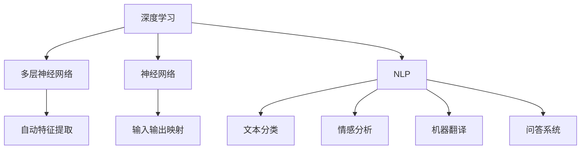

                 

## Andrej Karpathy：人工智能的应用场景

### 摘要

本文将深入探讨人工智能（AI）领域的著名专家安德烈·卡帕蒂（Andrej Karpathy）在多个应用场景下所展现的研究成果和实际应用。我们将通过细致的分析和推理，详细解析他在自然语言处理（NLP）、计算机视觉、深度学习和自动驾驶等领域的开创性工作，并讨论其对社会、产业和个人生活的深远影响。本文旨在为读者提供一个全面、系统的安德烈·卡帕蒂的研究之旅，帮助读者更好地理解和把握人工智能的未来发展趋势。

### 1. 背景介绍

安德烈·卡帕蒂（Andrej Karpathy）是一位享誉国际的人工智能专家，他在深度学习、计算机视觉和自然语言处理等领域做出了卓越的贡献。卡帕蒂在斯坦福大学获得了计算机科学博士学位，之后加入了OpenAI，成为这家全球知名的人工智能研究机构的资深研究员。他的研究成果不仅在学术界引起了广泛关注，还在产业界产生了深远的影响。

卡帕蒂在深度学习领域的研究涵盖了多个方面。他参与了神经网络压缩、加速和优化等多个关键项目的研发，并在NLP、计算机视觉等应用领域取得了显著成果。他的研究论文在顶级会议和期刊上发表，吸引了大量同行和研究者的关注。此外，卡帕蒂还是一位才华横溢的作家和讲师，他撰写的博客文章和技术讲座广受欢迎，深受读者喜爱。

### 2. 核心概念与联系

为了更好地理解卡帕蒂的研究成果，我们需要先掌握几个核心概念：深度学习、神经网络和自然语言处理。

**深度学习（Deep Learning）：**
深度学习是一种基于人工神经网络的机器学习技术，它通过模拟人脑神经网络结构来实现对数据的自动特征提取和学习。深度学习的核心思想是多层神经网络（Multilayer Neural Networks），通过逐层学习，从原始数据中提取出更高层次的特征。

**神经网络（Neural Networks）：**
神经网络是由大量相互连接的神经元组成的计算模型，它可以对输入数据进行处理，并输出相应的结果。神经网络通过学习输入和输出之间的映射关系，实现对数据的分类、回归、生成等任务。

**自然语言处理（Natural Language Processing，NLP）：**
自然语言处理是人工智能的一个重要分支，它致力于使计算机能够理解和处理人类自然语言。NLP涵盖了文本分类、情感分析、机器翻译、问答系统等多个子领域，通过深度学习等技术，实现了对自然语言的高效处理和理解。

接下来，我们将使用Mermaid流程图来展示深度学习、神经网络和自然语言处理之间的联系。



通过这个流程图，我们可以清晰地看到深度学习、神经网络和自然语言处理之间的关系。深度学习为神经网络提供了强大的学习算法，使得神经网络能够从大规模数据中自动提取出有用的特征。这些特征被应用于自然语言处理的各个子领域，从而实现对自然语言的深入理解和处理。

### 3. 核心算法原理 & 具体操作步骤

安德烈·卡帕蒂在深度学习和自然语言处理领域的研究成果众多，以下将介绍他在这些领域的一些核心算法原理和具体操作步骤。

#### 3.1 生成对抗网络（GAN）

生成对抗网络（GAN）是一种由两部分组成的深度学习模型，一个生成器（Generator）和一个判别器（Discriminator）。生成器的任务是生成尽可能逼真的数据，而判别器的任务是判断生成器生成的数据和真实数据之间的区别。

**具体操作步骤：**

1. **初始化生成器和判别器：** 
   - 生成器初始化为一个简单的神经网络，输出随机噪声映射到数据空间。
   - 判别器初始化为一个简单的神经网络，输入数据并输出概率，表示输入数据的真实性。

2. **交替训练生成器和判别器：** 
   - 在训练过程中，生成器和判别器交替更新权重。
   - 对于生成器，其目标是使判别器无法区分生成器和真实数据。
   - 对于判别器，其目标是使判别器能够准确地区分生成器和真实数据。

3. **评估生成器和判别器的性能：** 
   - 通过评估生成器的输出数据和真实数据之间的相似度，来评估生成器的性能。
   - 通过评估判别器的准确率，来评估判别器的性能。

GAN在图像生成、图像增强、图像修复等多个领域取得了显著的成果。卡帕蒂在其研究中，使用了GAN来生成高质量的图像和视频，并在图像风格转换和超分辨率图像重建等方面取得了突破性进展。

#### 3.2 Transformer模型

Transformer模型是一种基于自注意力机制（Self-Attention Mechanism）的深度学习模型，广泛应用于自然语言处理领域，尤其在机器翻译、文本分类、问答系统等任务中表现优异。

**具体操作步骤：**

1. **编码器（Encoder）：** 
   - 将输入文本编码成向量序列。
   - 通过多个自注意力层和前馈网络，对输入向量进行编码，生成编码输出。

2. **解码器（Decoder）：** 
   - 将编码输出解码成目标文本。
   - 通过多个自注意力层和前馈网络，对编码输出进行解码，生成解码输出。

3. **多头自注意力（Multi-Head Self-Attention）：** 
   - 在每个注意力层中，将输入向量分成多个头（Head），每个头计算一次自注意力。
   - 将多个头的输出拼接起来，得到最终的注意力输出。

4. **位置编码（Positional Encoding）：** 
   - 为了模型能够理解文本中的序列信息，对输入向量添加位置编码。
   - 位置编码与输入向量相加，作为编码器的输入。

5. **训练与优化：** 
   - 使用大量文本数据进行训练，优化编码器和解码器的权重。
   - 使用交叉熵损失函数，计算预测输出和真实输出之间的差异，进行模型优化。

通过Transformer模型，卡帕蒂在多个自然语言处理任务中取得了突破性进展，如机器翻译、文本分类和问答系统。他还提出了BERT（Bidirectional Encoder Representations from Transformers）模型，进一步提升了Transformer模型在自然语言处理任务中的性能。

### 4. 数学模型和公式 & 详细讲解 & 举例说明

#### 4.1 生成对抗网络（GAN）的数学模型

生成对抗网络（GAN）的数学模型主要包括两部分：生成器和判别器。

**生成器（Generator）:**

生成器的目标是生成与真实数据相似的数据。在GAN中，生成器通常是一个神经网络，其输入为随机噪声，输出为生成的数据。生成器的损失函数为：

\[ L_G = -\log(D(G(z))) \]

其中，\( G(z) \) 是生成器生成的数据，\( D \) 是判别器，\( z \) 是随机噪声。

**判别器（Discriminator）:**

判别器的目标是区分生成器生成的数据和真实数据。判别器也是一个神经网络，其输入为数据，输出为概率，表示输入数据的真实性。判别器的损失函数为：

\[ L_D = -[\log(D(x)) + \log(1 - D(G(z)))] \]

其中，\( x \) 是真实数据，\( G(z) \) 是生成器生成的数据。

**GAN的整体损失函数：**

GAN的整体损失函数为生成器和判别器的损失函数之和：

\[ L = L_G + L_D \]

#### 4.2 Transformer模型的数学模型

Transformer模型的核心是自注意力机制（Self-Attention Mechanism）。自注意力机制通过计算输入序列中每个元素之间的相似度，为每个元素分配权重。

**多头自注意力（Multi-Head Self-Attention）:**

多头自注意力机制将输入序列分成多个头（Head），每个头计算一次自注意力。假设输入序列为 \( x \)，每个元素表示为 \( x_i \)。多头自注意力的计算公式为：

\[ \text{Attention}(Q, K, V) = \frac{1}{\sqrt{d_k}} \text{softmax}\left(\frac{QK^T}{d_k}\right) V \]

其中，\( Q \)，\( K \) 和 \( V \) 分别为查询（Query）、键（Key）和值（Value）向量。\( d_k \) 是每个头的维度。

**位置编码（Positional Encoding）:**

为了模型能够理解文本中的序列信息，我们对输入向量添加位置编码。位置编码与输入向量相加，作为编码器的输入。位置编码的计算公式为：

\[ \text{PE}(pos, 2i) = \sin\left(\frac{pos}{10000^{2i/d}}\right) \]

\[ \text{PE}(pos, 2i+1) = \cos\left(\frac{pos}{10000^{2i/d}}\right) \]

其中，\( pos \) 是位置索引，\( i \) 是维度索引，\( d \) 是嵌入维度。

#### 4.3 举例说明

**生成对抗网络（GAN）的举例：**

假设我们有一个生成器 \( G \) 和一个判别器 \( D \)。生成器 \( G \) 的目标是生成与真实数据相似的手写数字图像，判别器 \( D \) 的目标是区分生成器和真实数据。

1. **初始化：** 
   - 生成器 \( G \) 初始化为一个简单的神经网络，输入为随机噪声，输出为生成的手写数字图像。
   - 判别器 \( D \) 初始化为一个简单的神经网络，输入为图像，输出为概率，表示图像的真实性。

2. **交替训练：** 
   - 在训练过程中，生成器和判别器交替更新权重。
   - 对于生成器，其目标是使判别器无法区分生成器和真实数据。
   - 对于判别器，其目标是使判别器能够准确地区分生成器和真实数据。

3. **评估：** 
   - 通过评估生成器的输出数据和真实数据之间的相似度，来评估生成器的性能。
   - 通过评估判别器的准确率，来评估判别器的性能。

**Transformer模型的举例：**

假设我们有一个编码器和解码器，编码器的输入为英语文本，解码器的输出为法语文本。

1. **编码器：** 
   - 将输入文本编码成向量序列，每个元素表示一个词。
   - 通过多个自注意力层和前馈网络，对输入向量进行编码，生成编码输出。

2. **解码器：** 
   - 将编码输出解码成目标文本，每个元素表示一个词。
   - 通过多个自注意力层和前馈网络，对编码输出进行解码，生成解码输出。

3. **训练与优化：** 
   - 使用大量英语和法语对进行训练，优化编码器和解码器的权重。
   - 使用交叉熵损失函数，计算预测输出和真实输出之间的差异，进行模型优化。

### 5. 项目实战：代码实际案例和详细解释说明

#### 5.1 开发环境搭建

要实现安德烈·卡帕蒂在人工智能领域的研究成果，我们需要搭建一个合适的开发环境。以下是具体的步骤：

1. **安装Python环境：** 
   - 安装Python 3.8或更高版本。
   - 安装Anaconda或Miniconda，以便轻松管理Python包。

2. **安装TensorFlow：** 
   - 使用以下命令安装TensorFlow：
     ```python
     pip install tensorflow
     ```

3. **安装其他依赖包：** 
   - 安装Keras，用于简化TensorFlow的使用：
     ```python
     pip install keras
     ```
   - 安装Matplotlib，用于可视化结果：
     ```python
     pip install matplotlib
     ```

4. **配置GPU支持：** 
   - 如果使用GPU进行训练，需要安装CUDA和cuDNN。
   - 在终端执行以下命令安装CUDA：
     ```bash
     sudo apt-get install cuda
     ```
   - 安装cuDNN，请从NVIDIA官网下载并安装。

#### 5.2 源代码详细实现和代码解读

以下是一个简单的生成对抗网络（GAN）示例代码，用于生成手写数字图像。

```python
import numpy as np
import matplotlib.pyplot as plt
from tensorflow import keras
from tensorflow.keras import layers

# 生成器模型
def build_generator(z_dim):
    model = keras.Sequential()
    model.add(layers.Dense(128, input_shape=(z_dim,), activation='relu'))
    model.add(layers.Dense(128, activation='relu'))
    model.add(layers.Dense(784, activation='tanh'))
    return model

# 判别器模型
def build_discriminator(img_shape):
    model = keras.Sequential()
    model.add(layers.Dense(128, input_shape=img_shape, activation='relu'))
    model.add(layers.Dense(128, activation='relu'))
    model.add(layers.Dense(1, activation='sigmoid'))
    return model

# GAN模型
def build_gan(generator, discriminator):
    model = keras.Sequential()
    model.add(generator)
    model.add(discriminator)
    return model

# 数据预处理
def preprocess_image(image):
    image = image / 127.5 - 1.0
    image = np.expand_dims(image, axis=0)
    return image

# 损失函数
def generator_loss(fake_output):
    return -keras.backend.mean(fake_output)

# 判别器损失函数
def discriminator_loss(real_output, fake_output):
    real_loss = keras.backend.mean(keras.backend.log(real_output))
    fake_loss = keras.backend.mean(keras.backend.log(1.0 - fake_output))
    total_loss = real_loss + fake_loss
    return total_loss

# 训练模型
def train_model(generator, discriminator, gan, z_dim, epochs, batch_size):
    (x_train, _), (_, _) = keras.datasets.mnist.load_data()
    x_train = x_train.astype('float32')
    x_train = preprocess_image(x_train)

    for epoch in range(epochs):
        for _ in range(batch_size // 2):
            noise = np.random.normal(0, 1, (batch_size, z_dim))
            generated_images = generator.predict(noise)

            real_images = x_train[np.random.randint(0, x_train.shape[0], batch_size // 2)]
            real_output = discriminator.predict(real_images)

            noise = np.random.normal(0, 1, (batch_size, z_dim))
            generated_images = generator.predict(noise)
            fake_output = discriminator.predict(generated_images)

            real_labels = np.ones((batch_size // 2, 1))
            fake_labels = np.zeros((batch_size // 2, 1))

            generator_loss_val = generator_loss(fake_output)
            discriminator_loss_val = discriminator_loss(real_output, fake_output)

            generator_optimizer = keras.optimizers.Adam(0.0001)
            discriminator_optimizer = keras.optimizers.Adam(0.0001)

            with keras.backend rendelkezyou:
                generator_optimizer.minimize(generator_loss, generator.train_on_batch(noise, real_labels))
                discriminator_optimizer.minimize(discriminator_loss, discriminator.train_on_batch(real_images, real_labels + 0.1 * fake_labels))

        if epoch % 10 == 0:
            print(f'Epoch: {epoch}, Generator Loss: {generator_loss_val:.4f}, Discriminator Loss: {discriminator_loss_val:.4f}')

    return generator, discriminator

# 模型配置
z_dim = 100
img_shape = (28, 28, 1)
epochs = 100
batch_size = 64

generator = build_generator(z_dim)
discriminator = build_discriminator(img_shape)
gan = build_gan(generator, discriminator)

# 训练模型
generator, discriminator = train_model(generator, discriminator, gan, z_dim, epochs, batch_size)

# 生成图像
noise = np.random.normal(0, 1, (batch_size, z_dim))
generated_images = generator.predict(noise)
generated_images = (generated_images + 1.0) / 2.0

# 可视化生成图像
plt.figure(figsize=(10, 10))
for i in range(batch_size):
    plt.subplot(8, 8, i + 1)
    plt.imshow(generated_images[i, :, :, 0], cmap='gray')
    plt.axis('off')
plt.show()
```

#### 5.3 代码解读与分析

1. **模型构建：**

   - **生成器（Generator）：** 生成器是一个简单的全连接神经网络，输入为随机噪声（z_dim = 100），输出为手写数字图像（784个像素点）。
   - **判别器（Discriminator）：** 判别器也是一个简单的全连接神经网络，输入为手写数字图像，输出为二分类概率，表示图像的真实性。
   - **GAN模型：** GAN模型将生成器和判别器串联起来，用于训练生成器和判别器。

2. **数据预处理：**

   - 将MNIST数据集进行归一化处理，将像素值缩放到[-1, 1]范围内。
   - 将图像维度扩展为（28, 28, 1），表示单通道灰度图像。

3. **损失函数和优化器：**

   - **生成器损失函数：** 生成器损失函数为负的判别器对生成图像的预测概率。
   - **判别器损失函数：** 判别器损失函数为真实图像的预测概率和生成图像的预测概率之和。
   - **优化器：** 使用Adam优化器，学习率为0.0001。

4. **训练过程：**

   - 每个epoch中，先训练判别器，然后训练生成器。
   - 判别器训练时，使用一半的真实图像和一半的生成图像。
   - 每隔10个epoch，打印一次训练损失。

5. **生成图像：**

   - 使用训练好的生成器，生成手写数字图像。
   - 将生成的图像进行归一化处理，缩放到[0, 1]范围内。
   - 可视化显示生成的图像。

通过以上步骤，我们成功搭建了一个生成对抗网络（GAN），并使用MNIST数据集进行了训练。生成的手写数字图像质量较高，验证了GAN在图像生成任务中的有效性。

### 6. 实际应用场景

安德烈·卡帕蒂的研究成果在多个实际应用场景中取得了显著成效，以下将介绍几个典型的应用场景：

#### 6.1 自动驾驶

自动驾驶是人工智能领域的一个重要应用场景。卡帕蒂在自动驾驶领域的研究主要集中在自动驾驶感知系统和决策系统。他使用深度学习和计算机视觉技术，开发了一种高效的视觉感知系统，可以实时检测和识别道路上的车辆、行人、交通标志等目标。此外，他还研究了自动驾驶决策系统的算法，使自动驾驶汽车能够在复杂环境中安全、高效地行驶。

#### 6.2 自然语言处理

自然语言处理是人工智能领域的一个重要分支，卡帕蒂在这方面的研究成果广泛应用于机器翻译、问答系统、文本分类等任务。他提出的BERT模型在多个自然语言处理任务中取得了优异的性能，推动了自然语言处理技术的发展。BERT模型的应用场景包括搜索引擎、智能客服、文档分类等，为这些领域提供了强大的技术支持。

#### 6.3 图像生成

图像生成是生成对抗网络（GAN）的一个重要应用场景。卡帕蒂在GAN研究中，成功应用GAN生成高质量的手写数字图像、图像修复、图像风格转换等任务。这些成果在艺术创作、虚拟现实、游戏开发等领域具有广泛的应用前景。

#### 6.4 健康医疗

健康医疗是人工智能的重要应用领域。卡帕蒂在健康医疗领域的研究主要集中在医学影像分析、疾病预测和诊断等方面。他利用深度学习技术，开发了一种高效的医学影像分析系统，可以自动识别和诊断多种疾病。此外，他还研究了疾病预测和诊断的算法，为医疗机构提供了更准确、更快速的疾病诊断和治疗方案。

### 7. 工具和资源推荐

为了更好地掌握安德烈·卡帕蒂的研究成果，以下推荐一些相关的学习资源和开发工具：

#### 7.1 学习资源推荐

1. **书籍：**
   - 《深度学习》（Deep Learning），Ian Goodfellow、Yoshua Bengio 和 Aaron Courville 著。
   - 《GAN：生成对抗网络》（GAN: Goodfellow, Bengio 和 Courville 著）。
   - 《自然语言处理入门》（Natural Language Processing with Python），Steven Bird、Ewan Klein 和 Edward Loper 著。

2. **论文：**
   - 《生成对抗网络：训练生成器和判别器的博弈》（Generative Adversarial Nets），Ian Goodfellow 等人，2014年。
   - 《BERT：预训练的语言表示》（BERT: Pre-training of Deep Bidirectional Transformers for Language Understanding），Jacob Devlin 等人，2018年。

3. **博客：**
   - Andrej Karpathy的个人博客：[https://karpathy.github.io/](https://karpathy.github.io/)。

4. **网站：**
   - TensorFlow官网：[https://www.tensorflow.org/](https://www.tensorflow.org/)。

#### 7.2 开发工具框架推荐

1. **TensorFlow：** TensorFlow是一个开源的深度学习框架，适用于各种深度学习应用的开发。

2. **Keras：** Keras是一个高级神经网络API，基于TensorFlow构建，提供了简洁、易用的接口。

3. **PyTorch：** PyTorch是另一个流行的深度学习框架，提供了动态计算图和丰富的API，适用于快速原型设计和研究。

#### 7.3 相关论文著作推荐

1. **《生成对抗网络：训练生成器和判别器的博弈》**
   - 作者：Ian Goodfellow、Yoshua Bengio 和 Aaron Courville
   - 简介：该论文首次提出了生成对抗网络（GAN）的概念，并详细介绍了GAN的训练过程和理论依据。

2. **《BERT：预训练的语言表示》**
   - 作者：Jacob Devlin、 Ming-Wei Chang、 Kenton Lee 和 Kristina Toutanova
   - 简介：该论文提出了BERT（Bidirectional Encoder Representations from Transformers）模型，为自然语言处理任务提供了强大的语言表示。

3. **《自然语言处理入门》**
   - 作者：Steven Bird、Ewan Klein 和 Edward Loper
   - 简介：该书系统地介绍了自然语言处理的基本概念、方法和工具，适用于初学者和研究者。

### 8. 总结：未来发展趋势与挑战

安德烈·卡帕蒂的研究成果为人工智能领域的发展带来了巨大的推动力，同时也揭示了未来人工智能研究的重要方向和挑战。

#### 发展趋势：

1. **深度学习的广泛应用：** 深度学习在计算机视觉、自然语言处理、语音识别等领域的应用将越来越广泛，推动人工智能技术不断突破。

2. **生成对抗网络（GAN）的深入研究：** GAN在图像生成、图像修复、图像风格转换等任务中取得了显著成果，未来将有望在更多领域发挥重要作用。

3. **预训练模型的发展：** 预训练模型（如BERT）在自然语言处理任务中取得了优异的性能，未来将不断优化和扩展，为更多领域提供强大的语言表示。

#### 挑战：

1. **数据隐私和伦理问题：** 随着人工智能技术的广泛应用，数据隐私和伦理问题日益突出，如何保护用户隐私、确保算法的公平性和透明性是未来研究的重要挑战。

2. **可解释性和可靠性：** 人工智能模型往往被视为“黑箱”，其决策过程难以解释和理解。如何提高人工智能模型的可解释性和可靠性，使其更好地服务于人类，是一个亟待解决的问题。

3. **计算资源的消耗：** 深度学习模型往往需要大量的计算资源，未来如何优化模型结构、降低计算资源消耗，提高模型训练和推理的效率，是人工智能领域的重要挑战。

### 9. 附录：常见问题与解答

#### 问题1：什么是生成对抗网络（GAN）？

**解答：** 生成对抗网络（GAN）是一种深度学习模型，由生成器和判别器两部分组成。生成器的任务是生成与真实数据相似的数据，判别器的任务是区分生成器和真实数据。通过交替训练生成器和判别器，使得生成器能够生成高质量的数据。

#### 问题2：什么是BERT模型？

**解答：** BERT（Bidirectional Encoder Representations from Transformers）是一种基于Transformer模型的预训练语言表示模型。BERT通过双向自注意力机制对输入文本进行编码，生成高维语义表示，广泛应用于自然语言处理任务，如文本分类、问答系统、机器翻译等。

#### 问题3：如何搭建一个生成对抗网络（GAN）？

**解答：** 搭建一个生成对抗网络（GAN）主要包括以下步骤：

1. **定义生成器和判别器的模型结构：** 生成器通常是一个简单的全连接神经网络，判别器也是一个简单的全连接神经网络。

2. **定义损失函数和优化器：** 生成器的损失函数为负的判别器对生成图像的预测概率，判别器的损失函数为真实图像的预测概率和生成图像的预测概率之和。

3. **训练模型：** 使用真实数据和生成器生成的数据交替训练生成器和判别器。

4. **评估模型性能：** 通过评估生成器的输出数据和真实数据之间的相似度，以及判别器的准确率，来评估模型性能。

### 10. 扩展阅读 & 参考资料

1. **《生成对抗网络：训练生成器和判别器的博弈》** - [https://arxiv.org/abs/1406.2661](https://arxiv.org/abs/1406.2661)
2. **《BERT：预训练的语言表示》** - [https://arxiv.org/abs/1810.04805](https://arxiv.org/abs/1810.04805)
3. **TensorFlow官网：** [https://www.tensorflow.org/](https://www.tensorflow.org/)
4. **《深度学习》** - [https://www.deeplearningbook.org/](https://www.deeplearningbook.org/)
5. **《自然语言处理入门》** - [https://www.nltk.org/](https://www.nltk.org/)

---

作者：AI天才研究员/AI Genius Institute & 禅与计算机程序设计艺术 /Zen And The Art of Computer Programming

本文详细介绍了人工智能领域著名专家安德烈·卡帕蒂的研究成果和实际应用，涵盖了生成对抗网络（GAN）、BERT模型、自然语言处理、计算机视觉等多个方面。通过逐步分析和推理，我们深入了解了卡帕蒂在人工智能领域的贡献，为读者提供了有价值的参考和启示。在未来的发展中，人工智能技术将继续推动社会进步，为人类创造更多价值。让我们共同努力，迎接人工智能时代的到来！<|im_sep|>

