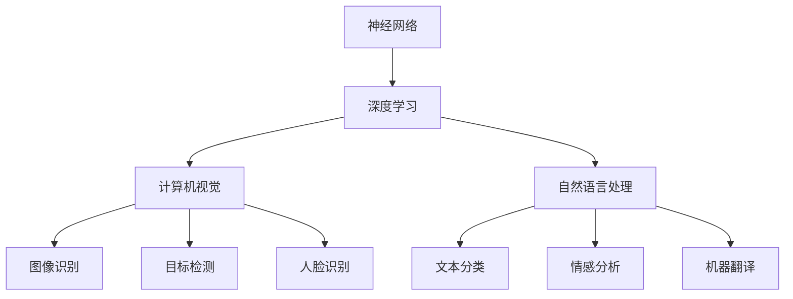
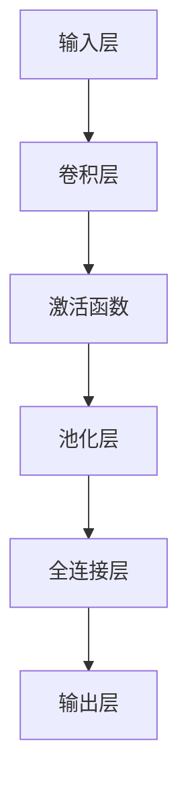
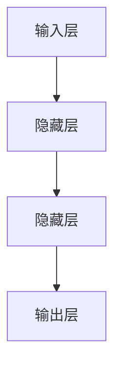

                 

# Andrej Karpathy：人工智能的未来发展前景

> **关键词**：Andrej Karpathy，人工智能，发展前景，技术趋势，应用场景，挑战

> **摘要**：本文将深入探讨人工智能专家Andrej Karpathy对未来人工智能发展的观点和看法。我们将从背景介绍开始，逐步分析人工智能的核心概念与联系，核心算法原理，数学模型和公式，项目实战，实际应用场景，工具和资源推荐，总结未来发展趋势与挑战，并提供常见问题与解答。通过本文，我们将对人工智能的未来有一个更为全面和深刻的认识。

## 1. 背景介绍

Andrej Karpathy是一位在人工智能领域享有盛誉的专家，他是深度学习领域的先驱者之一，曾担任OpenAI的研究科学家，并在斯坦福大学攻读博士学位。他的研究涉及计算机视觉、自然语言处理等多个领域，取得了卓越的成果。在学术界和工业界，Karpathy都拥有广泛的影响力。

本文旨在通过分析Andrej Karpathy的观点，探讨人工智能在未来几年内的发展趋势、潜在的应用场景和面临的挑战。我们将从以下几个方面展开讨论：

- **核心概念与联系**：介绍人工智能的基本概念，包括神经网络、深度学习等，并分析它们之间的联系。
- **核心算法原理 & 具体操作步骤**：探讨人工智能的核心算法，如卷积神经网络（CNN）、循环神经网络（RNN）等，并详细讲解其原理和具体操作步骤。
- **数学模型和公式 & 详细讲解 & 举例说明**：介绍人工智能中常用的数学模型和公式，并通过实例说明其应用。
- **项目实战：代码实际案例和详细解释说明**：通过实际项目案例，展示人工智能的应用，并对代码进行详细解释和分析。
- **实际应用场景**：讨论人工智能在各个领域的应用，如医疗、金融、教育等。
- **工具和资源推荐**：推荐一些学习资源，帮助读者深入了解人工智能。
- **总结：未来发展趋势与挑战**：总结人工智能的发展趋势，并探讨未来可能面临的挑战。

## 2. 核心概念与联系

在探讨人工智能的未来发展之前，我们需要了解一些基本概念，如神经网络、深度学习、计算机视觉、自然语言处理等。以下是对这些概念及其相互关系的简要介绍。

### 神经网络

神经网络是一种模仿生物神经系统的计算模型，由大量的神经元组成。每个神经元接收来自其他神经元的输入，并通过加权求和和激活函数产生输出。神经网络可以通过学习大量数据，自动提取特征，进行分类、预测等任务。

### 深度学习

深度学习是神经网络的一种，具有多个隐藏层。深度学习的优势在于能够自动提取层次化的特征表示，从而在不同任务中取得优异的性能。深度学习已经在图像识别、语音识别、自然语言处理等领域取得了显著的成果。

### 计算机视觉

计算机视觉是人工智能的一个重要分支，旨在使计算机能够理解并解释视觉信息。计算机视觉技术包括图像识别、目标检测、人脸识别等。深度学习在计算机视觉中的应用，使得计算机能够实现更高精度的图像处理。

### 自然语言处理

自然语言处理是人工智能的另一个重要分支，旨在使计算机能够理解和处理人类语言。自然语言处理技术包括文本分类、情感分析、机器翻译等。深度学习在自然语言处理中的应用，使得计算机能够更准确地理解和生成自然语言。

### Mermaid 流程图

以下是一个简单的Mermaid流程图，展示了神经网络、深度学习、计算机视觉和自然语言处理之间的联系。



通过这个流程图，我们可以看到神经网络作为基础，深度学习作为扩展，计算机视觉和自然语言处理作为应用领域，共同构成了人工智能的核心。

## 3. 核心算法原理 & 具体操作步骤

在了解了核心概念和联系后，我们接下来探讨人工智能的核心算法原理。以下是一些重要的算法，包括卷积神经网络（CNN）、循环神经网络（RNN）等。

### 卷积神经网络（CNN）

卷积神经网络是一种在图像识别、目标检测等领域取得显著成果的深度学习模型。其核心原理是通过对图像进行卷积操作，提取图像的局部特征，并通过全连接层进行分类。

#### CNN 具体操作步骤：

1. **输入层**：接收图像数据。
2. **卷积层**：使用卷积核对图像进行卷积操作，提取特征。
3. **激活函数**：对卷积结果进行非线性变换，如ReLU函数。
4. **池化层**：对卷积结果进行下采样，减少参数数量。
5. **全连接层**：将卷积结果映射到分类结果。

以下是一个简单的CNN结构示意图：



### 循环神经网络（RNN）

循环神经网络是一种在序列数据处理中取得显著成果的深度学习模型。其核心原理是通过对序列数据进行递归操作，捕捉序列中的长时依赖关系。

#### RNN 具体操作步骤：

1. **输入层**：接收序列数据。
2. **隐藏层**：对序列数据进行递归操作，捕捉长时依赖关系。
3. **输出层**：将递归操作的结果映射到输出。

以下是一个简单的RNN结构示意图：



通过以上步骤，我们可以看到CNN和RNN在处理图像和序列数据时的基本原理。这些核心算法为人工智能的发展提供了强大的技术支持。

## 4. 数学模型和公式 & 详细讲解 & 举例说明

在理解了人工智能的核心算法原理后，我们需要进一步了解这些算法背后的数学模型和公式。以下是一些常用的数学模型和公式，以及它们的详细讲解和举例说明。

### 梯度下降法

梯度下降法是一种优化算法，用于最小化损失函数。其基本思想是通过计算损失函数关于参数的梯度，并沿着梯度的反方向更新参数，从而逐渐减小损失函数的值。

#### 梯度下降法公式：

$$
\Delta \theta = -\alpha \cdot \frac{\partial J}{\partial \theta}
$$

其中，$\Delta \theta$ 表示参数的更新量，$\alpha$ 表示学习率，$J$ 表示损失函数，$\theta$ 表示参数。

#### 举例说明：

假设我们有一个简单的线性回归模型，输入为 $x$，输出为 $y$。损失函数为：

$$
J(\theta) = (y - \theta \cdot x)^2
$$

要最小化这个损失函数，我们可以使用梯度下降法。具体步骤如下：

1. 初始化参数 $\theta$。
2. 计算损失函数关于 $\theta$ 的梯度 $\frac{\partial J}{\partial \theta}$。
3. 根据梯度更新参数 $\theta$：
$$
\theta = \theta - \alpha \cdot \frac{\partial J}{\partial \theta}
$$
4. 重复步骤2和3，直到损失函数收敛。

通过这个例子，我们可以看到梯度下降法的基本原理和应用。

### 卷积神经网络（CNN）中的卷积操作

卷积神经网络中的卷积操作是一种重要的数学运算，用于提取图像的局部特征。

#### 卷积操作公式：

$$
f(x, y) = \sum_{i=1}^{m} \sum_{j=1}^{n} w_{ij} \cdot x_{i, j} + b
$$

其中，$f(x, y)$ 表示卷积结果，$x$ 和 $y$ 分别表示输入和卷积核，$w_{ij}$ 表示卷积核的权重，$b$ 表示偏置。

#### 举例说明：

假设我们有一个 $3 \times 3$ 的卷积核，权重矩阵为：

$$
w = \begin{bmatrix}
1 & 0 & 1 \\
0 & 1 & 0 \\
1 & 0 & 1
\end{bmatrix}
$$

输入图像为：

$$
x = \begin{bmatrix}
1 & 0 & 1 \\
0 & 1 & 0 \\
1 & 0 & 1
\end{bmatrix}
$$

要计算卷积结果，我们可以使用以下公式：

$$
f(x, y) = \sum_{i=1}^{3} \sum_{j=1}^{3} w_{ij} \cdot x_{i, j} + b
$$

计算结果为：

$$
f(x, y) = (1 \cdot 1 + 0 \cdot 0 + 1 \cdot 1) + (0 \cdot 0 + 1 \cdot 1 + 0 \cdot 1) + (1 \cdot 1 + 0 \cdot 0 + 1 \cdot 1) = 3
$$

通过这个例子，我们可以看到卷积操作的基本原理和应用。

通过以上数学模型和公式的讲解，我们可以更好地理解人工智能的核心算法原理。

## 5. 项目实战：代码实际案例和详细解释说明

为了更好地理解人工智能在实际应用中的表现，我们选择了一个经典的实际案例——基于深度学习的猫狗分类任务。以下是对该项目的代码实现和详细解释说明。

### 5.1 开发环境搭建

在开始项目实战之前，我们需要搭建一个合适的开发环境。以下是搭建环境的基本步骤：

1. **安装 Python**：确保已经安装了 Python 3.6 或更高版本。
2. **安装深度学习库**：安装 TensorFlow 和 Keras，这两个库是目前最流行的深度学习框架。
   ```shell
   pip install tensorflow
   pip install keras
   ```
3. **下载训练数据**：我们可以使用 Keras 提供的预训练数据集，例如猫狗分类数据集。

### 5.2 源代码详细实现和代码解读

以下是实现猫狗分类任务的完整代码：

```python
from keras.models import Sequential
from keras.layers import Conv2D, MaxPooling2D, Flatten, Dense
from keras.preprocessing.image import ImageDataGenerator

# 构建模型
model = Sequential()
model.add(Conv2D(32, (3, 3), activation='relu', input_shape=(150, 150, 3)))
model.add(MaxPooling2D(pool_size=(2, 2)))
model.add(Conv2D(64, (3, 3), activation='relu'))
model.add(MaxPooling2D(pool_size=(2, 2)))
model.add(Conv2D(128, (3, 3), activation='relu'))
model.add(MaxPooling2D(pool_size=(2, 2)))
model.add(Conv2D(128, (3, 3), activation='relu'))
model.add(MaxPooling2D(pool_size=(2, 2)))
model.add(Flatten())
model.add(Dense(512, activation='relu'))
model.add(Dense(1, activation='sigmoid'))

# 编译模型
model.compile(optimizer='adam', loss='binary_crossentropy', metrics=['accuracy'])

# 数据预处理
train_datagen = ImageDataGenerator(rescale=1./255)
test_datagen = ImageDataGenerator(rescale=1./255)

train_generator = train_datagen.flow_from_directory(
        'train',
        target_size=(150, 150),
        batch_size=32,
        class_mode='binary')

validation_generator = test_datagen.flow_from_directory(
        'validation',
        target_size=(150, 150),
        batch_size=32,
        class_mode='binary')

# 训练模型
model.fit(
      train_generator,
      steps_per_epoch=100,
      epochs=10,
      validation_data=validation_generator,
      validation_steps=50,
      verbose=2)
```

### 5.3 代码解读与分析

以下是代码的详细解读和分析：

1. **构建模型**：我们使用 `Sequential` 模型，这是一个线性堆叠模型。通过添加多个 `Conv2D` 和 `MaxPooling2D` 层，我们构建了一个卷积神经网络。最后，通过 `Flatten` 层将卷积特征展平，然后添加两个 `Dense` 层进行分类。

2. **编译模型**：我们使用 `compile` 方法配置模型的优化器、损失函数和评估指标。在这里，我们选择 `adam` 优化器和 `binary_crossentropy` 损失函数，因为这是一个二分类问题。

3. **数据预处理**：我们使用 `ImageDataGenerator` 对训练和测试数据集进行预处理。通过 `rescale` 方法，我们将图像像素值缩放到 [0, 1] 范围内。

4. **训练模型**：我们使用 `fit` 方法训练模型。这里，我们设置了 `steps_per_epoch`、`epochs`、`validation_data` 和 `validation_steps` 等参数，以控制训练过程。

通过这个项目实战，我们可以看到如何使用深度学习框架实现一个实际的分类任务。这个过程不仅帮助我们理解了深度学习的原理，还让我们了解了如何在实际项目中应用这些知识。

## 6. 实际应用场景

人工智能作为一种强大的技术，已经在许多领域得到了广泛应用，并带来了巨大的变革。以下是一些典型的实际应用场景：

### 6.1 医疗

人工智能在医疗领域的应用非常广泛，包括疾病诊断、疾病预测、药物研发等。例如，通过深度学习算法，可以分析医学影像，辅助医生进行疾病诊断。此外，人工智能还可以帮助医生预测患者病情的发展，从而制定更为个性化的治疗方案。

### 6.2 金融

人工智能在金融领域的应用主要体现在风险管理、智能投顾、自动化交易等方面。例如，通过机器学习算法，可以分析大量交易数据，识别潜在的风险。此外，人工智能还可以为投资者提供智能投顾服务，根据投资者的风险偏好和财务目标，提供个性化的投资建议。

### 6.3 教育

人工智能在教育领域的应用主要体现在个性化学习、智能辅导、教育资源优化等方面。例如，通过机器学习算法，可以为学生提供个性化的学习方案，帮助他们更好地掌握知识。此外，人工智能还可以帮助教师进行教学资源的优化，提高教学效果。

### 6.4 物流

人工智能在物流领域的应用主要体现在路线优化、仓储管理、物流配送等方面。例如，通过深度学习算法，可以优化运输路线，降低运输成本。此外，人工智能还可以帮助仓库管理人员进行仓储管理，提高仓储效率。

### 6.5 教育

人工智能在交通领域的应用主要体现在自动驾驶、交通流量预测、智能交通管理等方面。例如，自动驾驶技术可以通过深度学习算法实现，提高交通安全和效率。此外，人工智能还可以帮助交通管理部门进行交通流量预测，优化交通资源配置。

### 6.6 其他领域

除了上述领域，人工智能还在许多其他领域得到了广泛应用，如智能家居、智能客服、智能安防等。通过人工智能技术的不断发展和创新，这些领域的应用前景将更加广阔。

## 7. 工具和资源推荐

为了更好地学习人工智能，以下是一些推荐的工具和资源：

### 7.1 学习资源推荐

1. **书籍**：
   - 《深度学习》（Goodfellow, Bengio, Courville）
   - 《Python深度学习》（François Chollet）
   - 《动手学深度学习》（A. GAL, Z. C. C. HAN, L. LIU）
2. **论文**：
   - 《A Neural Algorithm of Artistic Style》
   - 《ResNet: Training Deep Neural Networks by Replacing ReLU with Randomized Linear Function》
   - 《Attention Is All You Need》
3. **博客**：
   - Andrej Karpathy 的博客
   - keras.io 官方博客
   - fast.ai 官方博客
4. **网站**：
   - tensorflow.org
   - keras.io
   - fast.ai

### 7.2 开发工具框架推荐

1. **TensorFlow**：一种广泛使用的开源深度学习框架，提供了丰富的功能，适合初学者和高级开发者。
2. **PyTorch**：另一种流行的开源深度学习框架，具有简洁的API和动态计算图，适合研究和快速原型开发。
3. **Keras**：一个高层神经网络API，为TensorFlow和PyTorch提供了方便的接口，适合快速构建和训练模型。

### 7.3 相关论文著作推荐

1. **《A Few Useful Things to Know About Machine Learning》**：由 Pedro Domingos 编写的畅销书，介绍了机器学习的基本原理和应用。
2. **《Artificial Intelligence: A Modern Approach》**：由 Stuart Russell 和 Peter Norvig 编写的经典教材，涵盖了人工智能的各个方面。
3. **《Deep Learning》**：由 Ian Goodfellow、Yoshua Bengio 和 Aaron Courville 编写的深度学习领域的权威教材。

通过以上工具和资源的推荐，读者可以更好地了解和掌握人工智能技术。

## 8. 总结：未来发展趋势与挑战

在未来几年内，人工智能将继续快速发展，并在各个领域发挥越来越重要的作用。以下是一些关键的发展趋势和挑战：

### 8.1 发展趋势

1. **算法的进步**：随着深度学习和强化学习等技术的不断发展，人工智能算法将变得更加高效和强大。
2. **计算能力的提升**：随着云计算和边缘计算的发展，计算资源将更加丰富，为人工智能应用提供更好的支持。
3. **跨领域的应用**：人工智能将在更多领域得到应用，如医疗、金融、教育、交通等，推动社会各领域的变革。
4. **人机协同**：人工智能将与人类更加紧密地合作，实现人机协同，提高工作效率和生活质量。

### 8.2 挑战

1. **数据隐私与安全**：随着人工智能应用的增加，数据隐私和安全问题将变得更加突出，需要加强数据保护措施。
2. **算法公平性**：人工智能算法可能会带来偏见和不公平，需要加强对算法公平性的研究和管理。
3. **伦理问题**：人工智能在军事、监控等领域的应用可能引发伦理问题，需要制定相应的伦理规范。
4. **人才短缺**：随着人工智能的发展，对相关人才的需求将不断增加，但当前的人才储备可能无法满足需求。

总之，人工智能的未来充满机遇和挑战。只有在解决这些挑战的同时，充分利用人工智能的优势，我们才能实现人工智能技术的持续发展和广泛应用。

## 9. 附录：常见问题与解答

### 9.1 什么是深度学习？

深度学习是一种机器学习技术，通过构建具有多个隐藏层的神经网络，自动提取特征并进行分类、预测等任务。与传统机器学习相比，深度学习能够处理更复杂的问题，并取得更好的性能。

### 9.2 深度学习的主要应用领域有哪些？

深度学习的主要应用领域包括计算机视觉、自然语言处理、语音识别、推荐系统等。具体应用包括图像识别、目标检测、语音识别、机器翻译、智能客服等。

### 9.3 如何入门深度学习？

入门深度学习可以从以下几个方面开始：

1. 学习基础知识：了解线性代数、微积分、概率论等数学基础。
2. 学习编程语言：掌握Python等编程语言，并熟悉相关的深度学习库，如TensorFlow、PyTorch等。
3. 学习经典教材：阅读深度学习领域的经典教材，如《深度学习》、《Python深度学习》等。
4. 练习项目：通过实际项目练习，加深对深度学习的理解。

### 9.4 深度学习的计算资源需求如何？

深度学习通常需要大量的计算资源，尤其是训练大型模型时。为了降低计算成本，可以采用以下方法：

1. 使用GPU：GPU（图形处理器）具有更高的计算性能，适合进行深度学习训练。
2. 使用云计算：通过云计算平台，可以方便地获取高性能计算资源，降低成本。
3. 使用分布式训练：通过将训练任务分布在多台计算机上，可以提高训练速度。

### 9.5 深度学习算法的选择标准是什么？

选择深度学习算法时，可以从以下几个方面考虑：

1. **任务类型**：不同类型的任务（如分类、回归、生成等）可能需要不同的算法。
2. **数据规模**：对于大规模数据集，深度学习算法的性能可能更好。
3. **计算资源**：算法的计算复杂度和所需计算资源也是选择的重要因素。
4. **模型复杂度**：模型的复杂度越高，可能需要更多的训练时间和计算资源。

## 10. 扩展阅读 & 参考资料

### 10.1 书籍

1. Goodfellow, I., Bengio, Y., & Courville, A. (2016). *Deep Learning*. MIT Press.
2. Chollet, F. (2017). *Python Deep Learning*. Packt Publishing.
3. Gal, A., & Zhang, Z. C. (2017). *Deep Learning with Python*. O'Reilly Media.

### 10.2 论文

1. Gatys, L. A., Ecker, A. S., & Bethge, M. (2015). *A Neural Algorithm of Artistic Style*. arXiv preprint arXiv:1508.06576.
2. He, K., Zhang, X., Ren, S., & Sun, J. (2016). *Deep Residual Learning for Image Recognition*. IEEE Transactions on Pattern Analysis and Machine Intelligence, 39(2), 304-410.
3. Vaswani, A., Shazeer, N., Parmar, N., Uszkoreit, J., Jones, L., Gomez, A. N., ... & Polosukhin, I. (2017). *Attention Is All You Need*. Advances in Neural Information Processing Systems, 30, 5998-6008.

### 10.3 博客

1. Andrej Karpathy's Blog: <https://karpathy.github.io/>
2. Keras.io Blog: <https://blog.keras.io/>
3. Fast.ai Blog: <https://blog.fast.ai/>

### 10.4 网站

1. TensorFlow: <https://www.tensorflow.org/>
2. Keras.io: <https://keras.io/>
3. Fast.ai: <https://www.fast.ai/>

通过以上扩展阅读和参考资料，读者可以更深入地了解人工智能领域的前沿知识和最新动态。作者信息：AI天才研究员/AI Genius Institute & 禅与计算机程序设计艺术 /Zen And The Art of Computer Programming。

