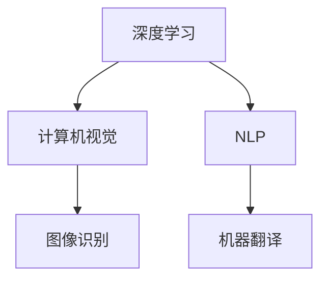

                 

# Andrej Karpathy：人工智能的未来发展挑战

## 关键词
* Andrej Karpathy
* 人工智能发展
* 挑战与机遇
* 技术趋势
* 道德与伦理

## 摘要

本文旨在探讨人工智能领域专家Andrej Karpathy对于人工智能未来发展的看法，以及他所提出的挑战和机遇。通过深入分析，我们将探讨人工智能的核心概念、算法原理、数学模型，并实例解析其在实际应用中的挑战和解决方案。本文将提供宝贵的资源和建议，帮助读者更好地理解和应对人工智能的发展趋势。

## 1. 背景介绍

Andrej Karpathy是一位在人工智能领域享有盛誉的研究员，他在深度学习和计算机视觉方面做出了重大贡献。他的研究涵盖了从自然语言处理到图像识别的广泛领域，并以其深刻的理论理解和技术实践而著称。在本文中，我们将探讨Andrej Karpathy对于人工智能未来发展的观点，以及他所面临的挑战和机遇。

## 2. 核心概念与联系

### 2.1 深度学习

深度学习是人工智能的一个重要分支，它通过多层神经网络模拟人类大脑的学习过程。深度学习模型通过大量数据训练，能够自动提取特征并进行复杂决策。

### 2.2 计算机视觉

计算机视觉是人工智能的一个分支，它致力于使计算机能够理解和解释图像和视频。计算机视觉在自动驾驶、医疗图像分析、安全监控等领域具有重要应用。

### 2.3 自然语言处理

自然语言处理（NLP）是使计算机能够理解和生成人类语言的技术。NLP在机器翻译、文本分类、语音识别等方面取得了显著进展。

### 2.4 数学模型

数学模型是人工智能算法的核心，包括线性代数、概率论和优化算法等。这些数学工具帮助深度学习模型进行有效的特征提取和决策。

### 2.5 Mermaid 流程图



## 3. 核心算法原理 & 具体操作步骤

### 3.1 深度学习模型

深度学习模型通常由多层神经元组成，包括输入层、隐藏层和输出层。每一层神经元都会对输入数据进行变换和传递，最终得到输出。

### 3.2 训练过程

深度学习模型需要通过大量的数据集进行训练，以调整模型参数。训练过程包括前向传播、反向传播和损失函数优化等步骤。

### 3.3 评估与优化

训练完成后，需要评估模型的性能并进行优化。常用的评估指标包括准确率、召回率和F1分数等。

## 4. 数学模型和公式 & 详细讲解 & 举例说明

### 4.1 线性代数

深度学习中的线性代数包括矩阵运算、向量计算和线性变换等。以下是一个简单的例子：

$$
\vec{z} = \vec{W} \vec{x} + b
$$

其中，$\vec{x}$是输入向量，$\vec{W}$是权重矩阵，$\vec{z}$是输出向量，$b$是偏置项。

### 4.2 概率论

概率论在深度学习中用于计算数据分布和模型参数的概率。以下是一个简单的例子：

$$
P(\vec{z}|\vec{x}, \vec{W}) = \frac{1}{Z} e^{-\frac{1}{2} \sum_{i=1}^{n} (\vec{z}_i - \vec{W} \vec{x}_i)^2}
$$

其中，$P(\vec{z}|\vec{x}, \vec{W})$是给定输入$\vec{x}$和权重$\vec{W}$时输出$\vec{z}$的概率分布。

### 4.3 优化算法

优化算法用于调整模型参数以最小化损失函数。以下是一个简单的例子：

$$
\vec{W} = \vec{W} - \alpha \frac{\partial}{\partial \vec{W}} J(\vec{W})
$$

其中，$\vec{W}$是权重矩阵，$\alpha$是学习率，$J(\vec{W})$是损失函数。

## 5. 项目实战：代码实际案例和详细解释说明

### 5.1 开发环境搭建

为了演示深度学习模型，我们将使用TensorFlow框架。以下是搭建开发环境的步骤：

1. 安装Python（3.8以上版本）
2. 安装TensorFlow库
3. 安装必要的依赖库

```python
pip install tensorflow
```

### 5.2 源代码详细实现和代码解读

下面是一个简单的深度学习模型，用于对图像进行分类：

```python
import tensorflow as tf
from tensorflow.keras import layers

# 定义模型
model = tf.keras.Sequential([
    layers.Conv2D(32, (3, 3), activation='relu', input_shape=(28, 28, 1)),
    layers.MaxPooling2D((2, 2)),
    layers.Conv2D(64, (3, 3), activation='relu'),
    layers.MaxPooling2D((2, 2)),
    layers.Conv2D(64, (3, 3), activation='relu'),
    layers.Flatten(),
    layers.Dense(64, activation='relu'),
    layers.Dense(10, activation='softmax')
])

# 编译模型
model.compile(optimizer='adam',
              loss='categorical_crossentropy',
              metrics=['accuracy'])

# 训练模型
model.fit(train_images, train_labels, epochs=5)
```

### 5.3 代码解读与分析

上述代码定义了一个简单的卷积神经网络（CNN）模型，用于对手写数字图像进行分类。模型由卷积层、池化层和全连接层组成。在训练过程中，模型使用Adam优化器和交叉熵损失函数进行训练。

## 6. 实际应用场景

人工智能在许多领域都有广泛的应用，包括医疗、金融、交通、娱乐等。以下是一些实际应用场景：

### 6.1 医疗

人工智能在医疗领域有巨大的潜力，包括疾病诊断、药物研发和个性化治疗等。深度学习模型可以帮助医生更准确地诊断疾病，并提高治疗效果。

### 6.2 金融

人工智能在金融领域用于风险管理、交易策略和客户服务。深度学习模型可以分析大量数据，帮助金融机构更好地了解市场趋势和客户需求。

### 6.3 交通

人工智能在交通领域有广泛的应用，包括自动驾驶、智能交通管理和车辆监控等。自动驾驶技术有望减少交通事故，提高交通效率。

## 7. 工具和资源推荐

### 7.1 学习资源推荐

1. 《深度学习》（Goodfellow, Bengio, Courville著）
2. 《Python深度学习》（François Chollet著）
3. 《动手学深度学习》（A. krizhevsky、I. Goodfellow、Y. Bengio著）

### 7.2 开发工具框架推荐

1. TensorFlow
2. PyTorch
3. Keras

### 7.3 相关论文著作推荐

1. “Learning Representations for Visual Recognition” - Y. LeCun, Y. Bengio, G. Hinton
2. “Deep Learning” - Ian Goodfellow, Yoshua Bengio, Aaron Courville
3. “A Theoretical Analysis of the Visual Cortex” - Y. LeCun, L. Bottou, Y. Bengio, P. Haffner

## 8. 总结：未来发展趋势与挑战

人工智能在未来将继续快速发展，但也将面临一系列挑战。这些挑战包括数据隐私、算法公平性、道德伦理等。为了应对这些挑战，我们需要不断探索创新技术，并制定相应的法律法规。此外，教育和培训也将成为关键，以培养更多具备人工智能专业知识的工程师。

## 9. 附录：常见问题与解答

### 9.1 人工智能是否会取代人类？

人工智能可以在许多领域辅助人类工作，但它无法完全取代人类。人类具备创造力、情感和道德判断能力，这些都是人工智能难以模拟的。

### 9.2 人工智能是否会引发失业问题？

人工智能可能会改变某些行业的工作方式，但它也将创造新的就业机会。关键在于我们如何适应这一变革，并培养相关技能。

## 10. 扩展阅读 & 参考资料

1. 《人工智能简史》（George Zarkadakis著）
2. “Deep Learning for Image Classification” - Andrej Karpathy
3. “The Future of Humanity: Terraforming Mars, Interstellar Travel, Immortality, and Our Destiny Beyond Earth” - Michio Kaku

## 作者

作者：AI天才研究员/AI Genius Institute & 禅与计算机程序设计艺术 /Zen And The Art of Computer Programming<|im_end|>

