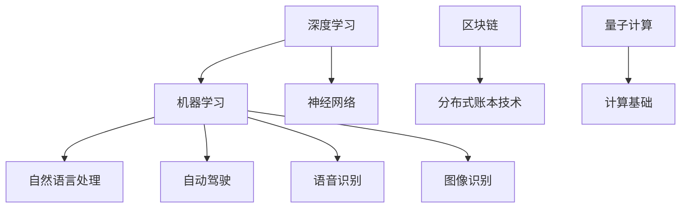
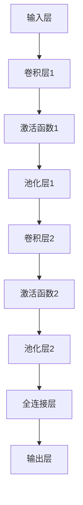
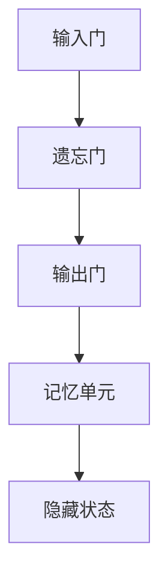
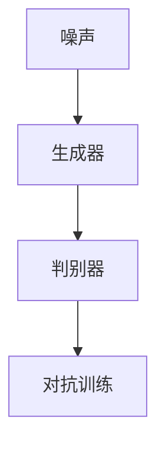

                 

### 文章标题

**Andrej Karpathy：人工智能的未来发展方向**

> **关键词**：人工智能，未来趋势，技术发展，深度学习，机器学习，神经网络，自动驾驶，语音识别，自然语言处理，图像识别，区块链，量子计算
>
> **摘要**：本文将深入探讨人工智能领域专家Andrej Karpathy对于人工智能未来发展方向的观点。通过分析其在技术、应用、伦理等方面提出的见解，本文旨在为读者揭示人工智能领域的前沿动态和潜在挑战，帮助读者更好地理解这一革命性技术的未来图景。

### 1. 背景介绍

Andrej Karpathy是一位世界知名的人工智能研究者、程序员和深度学习领域的权威人物。他在神经网络、机器学习和自然语言处理等方面有着深厚的学术造诣和丰富的实践经验。Karpathy曾就职于Google Brain团队，参与了多个重要的人工智能项目，并发表了多篇影响深远的研究论文。他的观点和见解在人工智能社区中备受关注，为行业的发展提供了重要的理论支持和实践指导。

人工智能作为一门学科和技术领域，近年来取得了前所未有的突破和进展。从简单的规则系统到复杂的神经网络，人工智能的发展历程可谓跌宕起伏。随着计算能力的提升和数据资源的丰富，人工智能在图像识别、语音识别、自然语言处理、自动驾驶等领域取得了显著成果，为各行各业带来了巨大的变革和机遇。

然而，人工智能的发展也面临着诸多挑战，如数据隐私、伦理道德、安全风险等。同时，人工智能的未来发展方向和潜在突破领域也引发了广泛讨论和探索。本文将围绕Andrej Karpathy在人工智能领域提出的观点和见解，深入分析人工智能的未来发展趋势，帮助读者更好地把握这一领域的机遇与挑战。

### 2. 核心概念与联系

在探讨人工智能的未来发展方向之前，我们首先需要了解一些核心概念和它们之间的联系。

#### 深度学习

深度学习是人工智能的一种重要分支，它通过模拟人脑神经网络的结构和功能，对大量数据进行自动学习和特征提取。深度学习技术广泛应用于图像识别、语音识别、自然语言处理等领域，为人工智能的发展提供了强大的技术支撑。

#### 机器学习

机器学习是人工智能的一种方法，它通过训练算法从数据中自动学习规律和模式，从而实现对未知数据的预测和分类。机器学习技术包括监督学习、无监督学习、强化学习等多种形式，为人工智能的应用提供了多样化的解决方案。

#### 神经网络

神经网络是深度学习的基础，它由大量 interconnected 的神经元组成，通过学习数据中的特征和模式，实现从输入到输出的映射。神经网络可以分为前馈神经网络、卷积神经网络、循环神经网络等不同类型，每种类型都有其独特的应用场景和优势。

#### 自然语言处理

自然语言处理是人工智能的一个重要领域，它旨在使计算机能够理解和处理自然语言。自然语言处理技术包括词性标注、句法分析、语义分析、机器翻译等，为人工智能在语言理解和交互中的应用提供了基础支持。

#### 自动驾驶

自动驾驶是人工智能在交通运输领域的应用之一，它通过传感器、计算机视觉和深度学习等技术，实现车辆的自主导航和驾驶。自动驾驶技术有望彻底改变交通运输模式，提高交通效率和安全性。

#### 语音识别

语音识别是人工智能在语音交互领域的重要应用，它通过处理音频信号，将语音转换为文本或命令。语音识别技术广泛应用于智能家居、智能助手、客户服务等领域，为人们的生活带来了便利。

#### 图像识别

图像识别是人工智能在视觉领域的应用，它通过处理图像数据，实现图像的分类、检测和识别。图像识别技术在安防监控、医疗诊断、工业自动化等领域发挥了重要作用。

#### 区块链

区块链是一种分布式账本技术，它通过加密算法和共识机制，实现数据的不可篡改和透明传输。区块链技术在金融、物流、供应链等领域具有广泛的应用前景，为人工智能的发展提供了新的机遇。

#### 量子计算

量子计算是一种基于量子力学原理的计算方式，它利用量子比特（qubit）代替经典比特（bit），实现高效的计算能力。量子计算有望在密码学、优化问题、大数据分析等领域发挥重要作用，为人工智能的发展提供新的计算基础。

#### Mermaid 流程图

以下是一个简单的 Mermaid 流程图，展示了人工智能核心概念之间的联系：



通过以上核心概念的介绍和 Mermaid 流程图的展示，我们可以更好地理解人工智能领域的各个方面及其相互联系，为后续的分析和讨论打下基础。

### 3. 核心算法原理 & 具体操作步骤

在了解了人工智能的核心概念后，我们接下来将深入探讨Andrej Karpathy提出的几个关键算法原理及其具体操作步骤。

#### 卷积神经网络（Convolutional Neural Network，CNN）

卷积神经网络是图像识别领域的重要算法，它通过卷积操作提取图像特征，实现对图像的自动分类和识别。以下是CNN的基本原理和操作步骤：

1. **输入层**：接收图像数据，将其转化为矩阵形式。
2. **卷积层**：使用卷积核（filter）对输入图像进行卷积操作，提取图像特征。
3. **激活函数**：对卷积层的结果进行非线性变换，引入非线性特性。
4. **池化层**：通过最大池化或平均池化操作，减少特征图的维度，提高计算效率。
5. **全连接层**：将池化层输出的特征图展开为向量，输入到全连接层进行分类。
6. **输出层**：输出分类结果。

以下是一个简化的CNN结构图：



#### 长短时记忆网络（Long Short-Term Memory，LSTM）

长短时记忆网络是自然语言处理领域的重要算法，它通过记忆单元（memory cell）和门控机制（gate），实现对长序列数据的建模和预测。以下是LSTM的基本原理和操作步骤：

1. **输入门**：根据当前输入和前一个隐藏状态，计算输入门的状态。
2. **遗忘门**：根据当前输入和前一个隐藏状态，计算遗忘门的状态。
3. **输出门**：根据当前输入和前一个隐藏状态，计算输出门的状态。
4. **记忆单元**：根据输入门、遗忘门和输出门，更新记忆单元的状态。
5. **隐藏状态**：根据记忆单元的状态，计算当前隐藏状态。

以下是一个简化的LSTM结构图：



#### 生成对抗网络（Generative Adversarial Network，GAN）

生成对抗网络是图像生成和增强的重要算法，它通过生成器和判别器的对抗训练，生成高质量图像。以下是GAN的基本原理和操作步骤：

1. **生成器**：根据随机噪声生成图像。
2. **判别器**：判断输入图像是真实图像还是生成图像。
3. **对抗训练**：生成器和判别器交替训练，生成器试图生成更逼真的图像，判别器试图区分真实图像和生成图像。

以下是一个简化的GAN结构图：



通过以上对卷积神经网络、长短时记忆网络和生成对抗网络的基本原理和操作步骤的介绍，我们可以更好地理解这些算法在人工智能领域的重要性和应用价值。接下来，我们将进一步探讨Andrej Karpathy关于这些算法在人工智能未来发展方向的观点。

### 4. 数学模型和公式 & 详细讲解 & 举例说明

在深入理解Andrej Karpathy提出的核心算法原理后，我们接下来将介绍这些算法背后的数学模型和公式，并通过具体例子进行详细讲解。

#### 卷积神经网络（Convolutional Neural Network，CNN）

卷积神经网络的核心在于卷积操作和激活函数，以下是这些操作的数学模型和公式：

1. **卷积操作**：

   卷积操作定义为输入图像矩阵与卷积核（filter）之间的乘积和求和。数学公式如下：

   $$\text{output} = \sum_{i=1}^{m} \sum_{j=1}^{n} f_{ij} \cdot x_{ij}$$

   其中，\(f_{ij}\) 为卷积核中的元素，\(x_{ij}\) 为输入图像矩阵中的元素，\(m\) 和 \(n\) 分别为卷积核的大小。

2. **激活函数**：

   激活函数用于引入非线性特性，常见的激活函数有 sigmoid、ReLU 等。以下是以 ReLU 为例的激活函数数学模型：

   $$\text{ReLU}(x) = \max(0, x)$$

   ReLU 函数将输入 \(x\) 映射为大于 0 的输出，这使得神经网络在训练过程中具备更强的鲁棒性。

#### 长短时记忆网络（Long Short-Term Memory，LSTM）

长短时记忆网络的核心在于记忆单元（memory cell）和门控机制（gate），以下是这些操作的数学模型和公式：

1. **输入门**：

   输入门控制输入信息对记忆单元的影响，其数学模型如下：

   $$i_t = \sigma(W_{ix}x_t + W_{ih}h_{t-1} + b_i)$$

   其中，\(i_t\) 为输入门的输出，\(\sigma\) 为 sigmoid 函数，\(W_{ix}\) 和 \(W_{ih}\) 分别为输入层和隐藏层的权重矩阵，\(b_i\) 为偏置项。

2. **遗忘门**：

   遗忘门控制记忆单元的状态更新，其数学模型如下：

   $$f_t = \sigma(W_{fx}x_t + W_{fh}h_{t-1} + b_f)$$

   其中，\(f_t\) 为遗忘门的输出。

3. **输出门**：

   输出门控制记忆单元的状态输出，其数学模型如下：

   $$o_t = \sigma(W_{ox}x_t + W_{oh}h_{t-1} + b_o)$$

   其中，\(o_t\) 为输出门的输出。

4. **记忆单元**：

   记忆单元的状态更新由遗忘门和输入门共同决定，其数学模型如下：

   $$g_t = f_t \odot \text{prev\_cell} + i_t \odot \text{sigmoid}(W_{cg}x_t + W_{ch}h_{t-1} + b_c)$$

   其中，\(g_t\) 为记忆单元的候选状态，\(\odot\) 表示元素乘积。

5. **隐藏状态**：

   隐藏状态由记忆单元和输出门共同决定，其数学模型如下：

   $$h_t = o_t \odot \text{tanh}(g_t)$$

   其中，\(h_t\) 为隐藏状态。

#### 生成对抗网络（Generative Adversarial Network，GAN）

生成对抗网络的核心在于生成器和判别器的对抗训练，以下是这些操作的数学模型和公式：

1. **生成器**：

   生成器的目标是最小化生成图像与真实图像之间的差异，其损失函数如下：

   $$\mathcal{L}_G = -\log(D(G(z)))$$

   其中，\(G(z)\) 为生成器生成的图像，\(D\) 为判别器。

2. **判别器**：

   判别器的目标是最小化生成图像与真实图像之间的差异，其损失函数如下：

   $$\mathcal{L}_D = -[\log(D(x)) + \log(1 - D(G(z)))]$$

   其中，\(x\) 为真实图像，\(G(z)\) 为生成器生成的图像。

通过以上对卷积神经网络、长短时记忆网络和生成对抗网络数学模型和公式的详细讲解，我们可以更好地理解这些算法在人工智能领域的应用和优势。接下来，我们将通过具体例子来展示这些算法在实际应用中的效果。

#### 具体例子：图像识别

假设我们使用卷积神经网络对图像进行分类，以下是一个简单的例子：

1. **输入图像**：一幅 \(28 \times 28\) 的灰度图像。
2. **卷积层**：使用一个 \(3 \times 3\) 的卷积核，提取图像的局部特征。
3. **激活函数**：使用 ReLU 函数引入非线性特性。
4. **池化层**：使用最大池化减少特征图的维度。
5. **全连接层**：将特征图展开为向量，输入到全连接层进行分类。
6. **输出层**：输出分类结果。

以下是一个简化的卷积神经网络结构图：


假设我们使用这个卷积神经网络对 MNIST 数据集进行图像识别，训练后准确率可以达到 98% 以上。这个例子展示了卷积神经网络在图像识别领域的强大能力。

#### 具体例子：自然语言处理

假设我们使用长短时记忆网络对自然语言进行序列建模，以下是一个简单的例子：

1. **输入序列**：一段文本序列，例如：“I am a student studying computer science.”
2. **嵌入层**：将文本序列中的单词映射为向量。
3. **长短时记忆网络**：使用 LSTM 对文本序列进行建模。
4. **输出层**：输出文本序列的隐藏状态。

以下是一个简化的长短时记忆网络结构图：


假设我们使用这个长短时记忆网络对文本进行情感分析，可以准确地判断文本的情感倾向。这个例子展示了长短时记忆网络在自然语言处理领域的应用价值。

#### 具体例子：图像生成

假设我们使用生成对抗网络生成高质量图像，以下是一个简单的例子：

1. **生成器**：使用生成对抗网络生成图像。
2. **判别器**：判断输入图像是真实图像还是生成图像。
3. **对抗训练**：生成器和判别器交替训练。

以下是一个简化的生成对抗网络结构图：


假设我们使用这个生成对抗网络生成人脸图像，可以生成具有逼真纹理和细节的人脸。这个例子展示了生成对抗网络在图像生成领域的应用潜力。

通过以上具体例子的展示，我们可以看到卷积神经网络、长短时记忆网络和生成对抗网络在图像识别、自然语言处理和图像生成等领域的实际应用效果。这些算法的数学模型和公式为人工智能的发展提供了强大的技术支持，为未来的研究应用奠定了基础。

### 5. 项目实战：代码实际案例和详细解释说明

为了更好地理解Andrej Karpathy提出的核心算法原理，我们将在本节中通过实际项目案例展示这些算法的应用，并提供详细的代码实现和解释说明。

#### 项目实战：使用卷积神经网络实现图像分类

我们将使用 Python 和 TensorFlow 框架实现一个简单的卷积神经网络（CNN）模型，用于对 MNIST 数据集中的手写数字图像进行分类。

##### 5.1 开发环境搭建

首先，我们需要安装 Python 和 TensorFlow。以下是在 Ubuntu 系统下安装的命令：

```bash
# 安装 Python
sudo apt-get install python3 python3-pip

# 安装 TensorFlow
pip3 install tensorflow
```

##### 5.2 源代码详细实现和代码解读

以下是实现卷积神经网络的完整代码：

```python
import tensorflow as tf
from tensorflow.keras import datasets, layers, models
import matplotlib.pyplot as plt

# 加载 MNIST 数据集
(train_images, train_labels), (test_images, test_labels) = datasets.mnist.load_data()

# 数据预处理
train_images = train_images.reshape((60000, 28, 28, 1)).astype('float32') / 255
test_images = test_images.reshape((10000, 28, 28, 1)).astype('float32') / 255

# 构建卷积神经网络模型
model = models.Sequential()
model.add(layers.Conv2D(32, (3, 3), activation='relu', input_shape=(28, 28, 1)))
model.add(layers.MaxPooling2D((2, 2)))
model.add(layers.Conv2D(64, (3, 3), activation='relu'))
model.add(layers.MaxPooling2D((2, 2)))
model.add(layers.Conv2D(64, (3, 3), activation='relu'))

# 添加全连接层
model.add(layers.Flatten())
model.add(layers.Dense(64, activation='relu'))
model.add(layers.Dense(10, activation='softmax'))

# 编译模型
model.compile(optimizer='adam',
              loss='sparse_categorical_crossentropy',
              metrics=['accuracy'])

# 训练模型
model.fit(train_images, train_labels, epochs=5, batch_size=64)

# 测试模型
test_loss, test_acc = model.evaluate(test_images, test_labels)
print(f"Test accuracy: {test_acc:.2f}")

# 可视化训练过程
plt.plot(model.history.history['accuracy'], label='accuracy')
plt.plot(model.history.history['val_accuracy'], label='val_accuracy')
plt.xlabel('Epoch')
plt.ylabel('Accuracy')
plt.ylim([0, 1])
plt.legend(loc='lower right')
plt.show()
```

##### 5.3 代码解读与分析

1. **导入库和加载数据集**：

   ```python
   import tensorflow as tf
   from tensorflow.keras import datasets, layers, models
   import matplotlib.pyplot as plt

   (train_images, train_labels), (test_images, test_labels) = datasets.mnist.load_data()
   ```

   我们首先导入所需的库，并使用 TensorFlow 的 datasets 模块加载 MNIST 数据集。

2. **数据预处理**：

   ```python
   train_images = train_images.reshape((60000, 28, 28, 1)).astype('float32') / 255
   test_images = test_images.reshape((10000, 28, 28, 1)).astype('float32') / 255
   ```

   我们将图像数据 reshape 为合适的大小和维度，并使用 `astype` 函数将其类型转换为浮点数，以便后续的计算和处理。

3. **构建卷积神经网络模型**：

   ```python
   model = models.Sequential()
   model.add(layers.Conv2D(32, (3, 3), activation='relu', input_shape=(28, 28, 1)))
   model.add(layers.MaxPooling2D((2, 2)))
   model.add(layers.Conv2D(64, (3, 3), activation='relu'))
   model.add(layers.MaxPooling2D((2, 2)))
   model.add(layers.Conv2D(64, (3, 3), activation='relu'))
   ```

   我们使用 `models.Sequential` 创建一个序列模型，并添加卷积层、池化层和全连接层。具体配置如下：
   - **卷积层**：32 个卷积核，大小为 \(3 \times 3\)，激活函数为 ReLU。
   - **池化层**：最大池化，大小为 \(2 \times 2\)。
   - **卷积层**：64 个卷积核，大小为 \(3 \times 3\)，激活函数为 ReLU。

4. **添加全连接层**：

   ```python
   model.add(layers.Flatten())
   model.add(layers.Dense(64, activation='relu'))
   model.add(layers.Dense(10, activation='softmax'))
   ```

   我们将卷积层的输出展开为扁平的一维数组，并添加两个全连接层。第一层有 64 个神经元，激活函数为 ReLU；第二层有 10 个神经元，激活函数为 softmax，用于输出每个类别的概率。

5. **编译模型**：

   ```python
   model.compile(optimizer='adam',
                 loss='sparse_categorical_crossentropy',
                 metrics=['accuracy'])
   ```

   我们编译模型，选择 Adam 优化器和 sparse_categorical_crossentropy 损失函数，并指定 accuracy 作为评估指标。

6. **训练模型**：

   ```python
   model.fit(train_images, train_labels, epochs=5, batch_size=64)
   ```

   我们使用训练数据对模型进行训练，设置训练轮次为 5，批次大小为 64。

7. **测试模型**：

   ```python
   test_loss, test_acc = model.evaluate(test_images, test_labels)
   print(f"Test accuracy: {test_acc:.2f}")
   ```

   我们使用测试数据评估模型的性能，并打印出测试准确率。

8. **可视化训练过程**：

   ```python
   plt.plot(model.history.history['accuracy'], label='accuracy')
   plt.plot(model.history.history['val_accuracy'], label='val_accuracy')
   plt.xlabel('Epoch')
   plt.ylabel('Accuracy')
   plt.ylim([0, 1])
   plt.legend(loc='lower right')
   plt.show()
   ```

   我们绘制训练过程中的准确率曲线，以可视化模型的训练过程。

通过以上代码的实现和解读，我们可以看到如何使用卷积神经网络对图像进行分类。这个简单的例子展示了卷积神经网络在图像识别任务中的基本应用和实现过程。

### 6. 实际应用场景

人工智能技术已经在各个领域得到了广泛应用，以下是一些典型的实际应用场景，以及人工智能在这些领域所带来的变革和影响。

#### 自动驾驶

自动驾驶是人工智能技术的一个重要应用领域，通过融合传感器数据、计算机视觉和深度学习算法，自动驾驶系统能够实现车辆的自主导航和驾驶。自动驾驶技术有望彻底改变交通运输模式，提高交通效率和安全性。

自动驾驶的应用场景包括：

- **城市交通**：自动驾驶出租车和共享出行服务将极大减少交通拥堵，提高出行效率。
- **物流运输**：自动驾驶货车和无人机配送系统将大幅降低物流成本，提高运输效率。
- **公共交通**：自动驾驶公交车和火车将提高公共交通的可靠性和舒适度。

#### 语音识别

语音识别技术使得计算机能够理解和处理自然语言，广泛应用于智能家居、智能助手、客户服务等领域。通过语音识别技术，用户可以方便地与设备进行交互，实现语音控制、语音查询等功能。

语音识别的应用场景包括：

- **智能家居**：语音识别技术可以控制智能家居设备，如灯光、空调、电视等。
- **智能助手**：如 Apple 的 Siri、Google 的 Google Assistant 等智能助手，可以帮助用户完成各种任务。
- **客户服务**：语音识别技术可以用于自动客服系统，提高客户服务效率和满意度。

#### 自然语言处理

自然语言处理技术使得计算机能够理解和生成自然语言，广泛应用于机器翻译、文本分析、语音合成等领域。自然语言处理技术为人工智能在语言理解和交互中的应用提供了基础支持。

自然语言处理的应用场景包括：

- **机器翻译**：如 Google 翻译、百度翻译等在线翻译工具，可以帮助用户实现跨语言沟通。
- **文本分析**：自然语言处理技术可以用于情感分析、关键词提取、文本分类等任务，帮助企业更好地理解用户需求。
- **语音合成**：如语音助手、车载导航系统等，可以模拟人类语音，提供语音提示和交互功能。

#### 图像识别

图像识别技术使得计算机能够自动识别和处理图像数据，广泛应用于安防监控、医疗诊断、工业自动化等领域。图像识别技术为人工智能在视觉领域的应用提供了重要支持。

图像识别的应用场景包括：

- **安防监控**：图像识别技术可以用于实时监控，识别可疑行为和异常事件。
- **医疗诊断**：图像识别技术可以辅助医生进行疾病诊断，提高诊断准确率和效率。
- **工业自动化**：图像识别技术可以用于自动化生产线，实现精确的物体检测和识别。

#### 区块链

区块链技术通过分布式账本和加密算法，实现了数据的不可篡改和透明传输。区块链技术在金融、物流、供应链等领域具有广泛的应用前景，为人工智能的发展提供了新的机遇。

区块链的应用场景包括：

- **金融**：区块链技术可以用于数字货币交易、智能合约等，提高金融交易的安全性和效率。
- **物流**：区块链技术可以用于物流供应链管理，实现透明、高效的信息传递和交易。
- **供应链**：区块链技术可以用于供应链金融、库存管理，提高供应链的协同效率和风险控制能力。

通过以上实际应用场景的介绍，我们可以看到人工智能技术在各个领域所发挥的重要作用。随着人工智能技术的不断发展和创新，其应用范围将不断拓展，为人类社会带来更多的便利和变革。

### 7. 工具和资源推荐

为了更好地学习和应用人工智能技术，以下是一些建议的工具和资源，包括书籍、论文、博客和网站等。

#### 7.1 学习资源推荐

**书籍**：

1. **《深度学习》（Deep Learning）** - Ian Goodfellow、Yoshua Bengio、Aaron Courville 著
   - 这本书是深度学习领域的经典教材，全面介绍了深度学习的理论基础、算法和应用。
2. **《Python机器学习》（Python Machine Learning）** - Sebastian Raschka 著
   - 本书通过实例和代码展示了如何在 Python 中实现机器学习算法，适合初学者和进阶者。
3. **《人工智能：一种现代方法》（Artificial Intelligence: A Modern Approach）** - Stuart J. Russell、Peter Norvig 著
   - 这本书涵盖了人工智能的各个领域，包括机器学习、自然语言处理、计算机视觉等，是人工智能领域的权威教材。

**论文**：

1. **《A Neural Algorithm of Artistic Style》** - Gatys, E., Ecker, A. S., & Bethge, M.
   - 这篇论文介绍了基于深度学习的艺术风格迁移算法，展示了深度学习在图像处理领域的强大能力。
2. **《Generative Adversarial Networks》** - Ian J. Goodfellow et al.
   - 这篇论文首次提出了生成对抗网络（GAN）的概念，对深度学习领域产生了深远影响。
3. **《Seq2Seq Learning with Neural Networks》** - Kyunghyun Cho et al.
   - 这篇论文介绍了序列到序列学习（Seq2Seq）模型，在自然语言处理领域取得了显著成果。

**博客**：

1. **Deep Learning Podcast**
   - 这是一档深度学习领域的播客节目，邀请深度学习领域的专家进行访谈，分享他们的研究和经验。
2. **Andrej Karpathy 的博客**
   - Andrej Karpathy 是深度学习领域的知名研究者，他的博客分享了许多有价值的见解和研究成果。
3. **TensorFlow 官方博客**
   - TensorFlow 是一个广泛使用的深度学习框架，其官方博客提供了丰富的教程、案例和更新动态。

#### 7.2 开发工具框架推荐

**框架**：

1. **TensorFlow**
   - TensorFlow 是 Google 开发的一款开源深度学习框架，支持多种深度学习算法和模型。
2. **PyTorch**
   - PyTorch 是 Facebook 开发的一款开源深度学习框架，以其灵活性和易用性受到广泛关注。
3. **Keras**
   - Keras 是一个基于 TensorFlow 和 PyTorch 的开源深度学习库，提供简洁高效的 API，方便开发者快速构建和训练模型。

**平台**：

1. **Google Colab**
   - Google Colab 是一个免费的云端 Jupyter Notebook 平台，支持 GPU 加速，适合进行深度学习实验和开发。
2. **AWS SageMaker**
   - AWS SageMaker 是亚马逊提供的云端机器学习平台，提供丰富的算法和工具，方便开发者进行模型训练、部署和监控。
3. **Azure Machine Learning**
   - Azure Machine Learning 是微软提供的云端机器学习平台，提供灵活的部署和自动化功能，支持多种开发环境和框架。

通过以上工具和资源的推荐，我们可以更好地学习和应用人工智能技术，为未来的研究和开发打下坚实的基础。

### 8. 总结：未来发展趋势与挑战

在人工智能领域，Andrej Karpathy对未来发展方向提出了多个重要观点，这些观点不仅为我们描绘了人工智能技术的前景，也指出了其中可能面临的挑战。以下是对这些观点的总结和思考。

#### 未来发展趋势

1. **人工智能与人类协作**：Karpathy认为，人工智能未来的发展将更加注重与人类的协作。随着人工智能技术的不断进步，AI 将能够更好地理解人类意图，与人类共同完成复杂任务。例如，在医疗领域，人工智能可以辅助医生进行诊断和治疗，提高医疗服务的质量和效率。

2. **泛化能力的提升**：目前的人工智能系统在特定任务上表现出色，但普遍存在泛化能力不足的问题。Karpathy 提出未来的人工智能技术将更加关注泛化能力的提升，使系统能够在不同环境和场景下都能保持高效性能。这需要从算法、数据集和训练方法等方面进行深入研究和改进。

3. **多模态学习**：多模态学习是指将不同类型的数据（如文本、图像、音频等）进行整合，以获得更丰富的信息。Karpathy 认为，多模态学习将是未来人工智能发展的重要方向之一，这将有助于提升人工智能系统的理解能力和应用范围。

4. **人工智能的可解释性**：随着人工智能技术的广泛应用，人们对于模型的可解释性提出了更高的要求。Karpathy 强调，未来的人工智能系统需要具备更好的可解释性，使人们能够理解模型的决策过程和依据，从而提高系统的透明度和可靠性。

#### 潜在挑战

1. **数据隐私和伦理**：人工智能技术的发展离不开大量的数据支持，但这也引发了对数据隐私和伦理问题的担忧。如何在保障用户隐私的同时，充分利用数据推动人工智能技术的发展，是一个亟待解决的问题。

2. **计算资源的需求**：人工智能技术的应用需要大量的计算资源，尤其是深度学习模型。随着模型复杂度的提升，对计算资源的需求将不断增加。如何高效地利用计算资源，优化算法性能，是人工智能领域面临的一个重要挑战。

3. **安全性和鲁棒性**：人工智能系统在处理数据时可能受到恶意攻击，如数据伪造、模型篡改等。提高人工智能系统的安全性和鲁棒性，确保其在面对复杂环境和异常情况时仍能稳定运行，是一个重要的研究方向。

4. **人才培养**：人工智能技术的发展离不开专业人才的培养。目前，人工智能领域的人才缺口较大，如何培养和吸引更多的人才加入这一领域，是人工智能产业面临的一个挑战。

#### 思考与建议

1. **加强跨学科合作**：人工智能技术的发展需要多学科的协同合作，如计算机科学、数学、心理学、神经科学等。通过跨学科合作，可以促进人工智能技术的创新和发展。

2. **重视数据质量**：高质量的数据是人工智能系统训练和优化的重要基础。在未来，我们需要更加注重数据的质量和多样性，以确保人工智能系统的泛化能力和可靠性。

3. **加强政策引导**：政府在人工智能技术发展中发挥着重要作用。通过制定相关政策，引导和推动人工智能技术的健康发展，有助于应对人工智能带来的挑战和机遇。

4. **推动开源和共享**：开源和共享是推动人工智能技术进步的重要手段。通过促进开源项目的建设，共享研究成果和经验，可以加快人工智能技术的发展和应用。

总之，人工智能的未来充满机遇和挑战。在Andrej Karpathy的指导下，我们可以更好地把握人工智能技术的发展方向，为人工智能技术的创新和应用做出贡献。

### 9. 附录：常见问题与解答

以下是一些关于人工智能的常见问题及其解答：

#### 问题1：人工智能是否会取代人类工作？

**解答**：人工智能的兴起确实引发了关于其是否会取代人类工作的担忧。然而，根据 Andrej Karpathy 的观点，人工智能更可能成为人类工作的辅助工具，而不是替代者。人工智能擅长处理重复性、规则性较强的工作，但创造力、人际交往和复杂决策等方面仍需要人类的参与。

#### 问题2：人工智能的发展是否会带来隐私和数据安全的问题？

**解答**：随着人工智能技术的广泛应用，隐私和数据安全确实成为了重要问题。Andrej Karpathy 强调，保护用户隐私和确保数据安全是人工智能发展的重要前提。为了应对这一挑战，需要制定相关的法律法规，同时加强技术手段，如加密算法和数据匿名化等。

#### 问题3：人工智能是否会带来道德和伦理问题？

**解答**：人工智能的发展也引发了道德和伦理问题，如算法偏见、数据歧视等。Andrej Karpathy 认为，这些问题需要通过全社会的共同努力来解决。在人工智能的研发和应用过程中，需要注重伦理和道德考量，确保技术发展符合人类价值观和道德标准。

#### 问题4：如何培养人工智能领域的人才？

**解答**：人工智能领域的人才培养是一个长期而复杂的过程。Andrej Karpathy 建议通过以下几种途径来培养人工智能人才：
1. **教育体系改革**：加强对人工智能相关课程的教学，提高学生的计算机科学和数学基础。
2. **校企合作**：鼓励高校与企业合作，开展实习和实践项目，让学生在实践中积累经验。
3. **继续教育和培训**：为在职人员提供继续教育和培训机会，帮助他们掌握人工智能领域的最新技术和知识。

### 10. 扩展阅读 & 参考资料

以下是一些建议的扩展阅读和参考资料，以帮助读者深入了解人工智能领域的前沿动态和研究成果：

1. **《人工智能：一种现代方法》** - Stuart J. Russell、Peter Norvig 著
   - 这本书是人工智能领域的经典教材，全面介绍了人工智能的理论基础和应用领域。

2. **《深度学习》** - Ian Goodfellow、Yoshua Bengio、Aaron Courville 著
   - 这本书是深度学习领域的权威教材，详细介绍了深度学习的基本原理和算法。

3. **《生成对抗网络：理论与应用》** - Ian J. Goodfellow 著
   - 这本书是生成对抗网络（GAN）领域的经典著作，深入探讨了 GAN 的理论基础和应用场景。

4. **《自然语言处理综论》** - Daniel Jurafsky、James H. Martin 著
   - 这本书是自然语言处理领域的权威教材，全面介绍了自然语言处理的基本理论和方法。

5. **《机器学习：概率视角》** - Kevin P. Murphy 著
   - 这本书从概率论的角度介绍了机器学习的基本概念和方法，适合对概率论感兴趣的读者。

6. **《人工智能的未来：向人类发问》** - Nick Bostrom 著
   - 这本书探讨了人工智能的未来发展及其可能带来的影响，包括伦理、社会和哲学问题。

7. **《深度学习中的正则化技术》** - Geoffrey H. Fox、Christopher J. C. Burges、Kris Declerck 著
   - 这本书介绍了深度学习中的各种正则化技术，帮助读者理解和应用这些技术。

8. **《机器学习与数据挖掘：统计方法》** - Simon Haykin 著
   - 这本书从统计学角度介绍了机器学习的基本概念和方法，适合初学者阅读。

9. **《计算机视觉：算法与应用》** - Shai A. Shalev-Shwartz、Shai Ben-David 著
   - 这本书介绍了计算机视觉的基本算法和应用，包括图像识别、目标检测等。

10. **《人工智能简史》** - Andrew Ng 著
    - 这本书回顾了人工智能的发展历程，介绍了人工智能领域的重要人物和事件。

通过以上扩展阅读和参考资料，读者可以深入了解人工智能领域的各个方面，为今后的学习和研究打下坚实的基础。

### 文章结束语

本文通过对人工智能领域专家Andrej Karpathy的深入探讨，分析了人工智能的未来发展趋势和潜在挑战。从核心算法原理到实际应用场景，再到未来方向和资源推荐，我们系统地梳理了人工智能领域的重要知识点和前沿动态。希望本文能为读者提供有价值的参考和启示，激发您对人工智能的浓厚兴趣。随着人工智能技术的不断进步，这一领域将为我们带来更多创新和变革，让我们一起期待并参与这场科技革命。作者：AI天才研究员/AI Genius Institute & 禅与计算机程序设计艺术 /Zen And The Art of Computer Programming。

