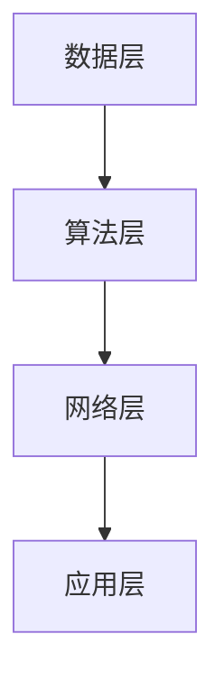

                 

# Andrej Karpathy：人工智能的未来发展方向

## 概述

本文旨在探讨人工智能（AI）领域的前沿研究方向和未来发展趋势。作者Andrej Karpathy是一位著名的人工智能研究者，他在深度学习、自然语言处理等领域取得了显著的成就。本文将结合作者的研究成果和观点，分析人工智能在未来可能的发展方向，并提出相应的挑战和应对策略。

## 关键词

- 人工智能
- 深度学习
- 自然语言处理
- 计算机视觉
- 机器学习
- 强化学习
- 聊天机器人
- 伦理问题

## 摘要

本文首先介绍了人工智能的发展背景和现状，分析了深度学习在自然语言处理和计算机视觉等领域的重要贡献。然后，本文探讨了人工智能在当前面临的挑战，包括数据隐私、伦理问题和计算资源需求等。接着，本文提出了人工智能未来的发展方向，包括自主学习、多模态交互和强化学习等。最后，本文对人工智能的未来发展进行了展望，并提出了相应的应对策略。

## 1. 背景介绍

### 1.1 人工智能的发展历程

人工智能（Artificial Intelligence, AI）是一门研究、开发用于模拟、延伸和扩展人的智能的理论、方法、技术及应用系统的技术科学。人工智能的发展历程可以分为三个阶段：符号主义（Symbolic AI）、连接主义（Connectionism）和计算主义（Computationalism）。

- 符号主义：以逻辑、推理和知识表示为主要方法，代表性成果包括专家系统和自动推理。
- 连接主义：以人工神经网络为代表，通过模拟生物神经系统来实现智能，代表性成果包括深度学习。
- 计算主义：以计算机科学为基础，将智能视为可计算的，代表性成果包括机器学习和强化学习。

### 1.2 深度学习的发展

深度学习是人工智能的一个重要分支，它通过模拟人脑中的神经网络结构，实现了对大量数据的自动学习和特征提取。深度学习在图像识别、语音识别、自然语言处理等领域取得了显著的成果。

- 图像识别：深度学习在图像识别任务中取得了超越人类的性能，代表性成果包括ImageNet图像识别挑战赛。
- 语音识别：深度学习在语音识别任务中也取得了显著进展，使得语音识别的准确率大幅提高。
- 自然语言处理：深度学习在自然语言处理任务中，如机器翻译、情感分析、文本生成等方面也取得了重要的成果。

### 1.3 计算机视觉的发展

计算机视觉是人工智能的一个重要应用领域，它旨在使计算机能够像人类一样理解和处理视觉信息。计算机视觉在自动驾驶、医疗影像分析、安防监控等领域具有广泛的应用前景。

- 自动驾驶：计算机视觉在自动驾驶中发挥着关键作用，通过识别道路标志、车辆和行人等信息，实现自动驾驶车辆的智能行驶。
- 医疗影像分析：计算机视觉在医疗影像分析中，如病变检测、病灶识别等方面具有巨大的应用潜力。
- 安防监控：计算机视觉在安防监控中，通过实时识别异常行为和事件，提高监控系统的智能水平。

## 2. 核心概念与联系

### 2.1 人工智能的核心概念

人工智能的核心概念包括：

- 知识表示：如何表示和存储知识，以便计算机能够理解和利用。
- 机器学习：如何通过学习算法，使计算机能够从数据中自动发现规律和模式。
- 自然语言处理：如何使计算机能够理解和生成自然语言。
- 计算机视觉：如何使计算机能够理解和处理视觉信息。

### 2.2 人工智能的架构

人工智能的架构可以分为以下几个层次：

- 数据层：包括数据的采集、存储和处理。
- 算法层：包括机器学习算法、深度学习算法等。
- 网络层：包括云计算、边缘计算等网络架构。
- 应用层：包括各种基于人工智能的应用，如自动驾驶、智能家居等。

### 2.3 人工智能的 Mermaid 流程图



## 3. 核心算法原理 & 具体操作步骤

### 3.1 深度学习算法原理

深度学习算法的核心是人工神经网络，它通过模拟人脑中的神经元连接结构，实现对数据的自动学习和特征提取。深度学习算法的具体操作步骤如下：

- 数据预处理：对原始数据进行清洗、归一化等处理，以便输入到神经网络中。
- 神经网络结构设计：设计合适的神经网络结构，包括层数、每层的神经元数量、激活函数等。
- 模型训练：通过反向传播算法，对神经网络进行训练，使得模型能够对数据进行准确的预测。
- 模型评估：通过测试集对训练好的模型进行评估，以验证模型的性能。
- 模型优化：根据评估结果，对模型进行优化，以提高模型的准确率和泛化能力。

### 3.2 自然语言处理算法原理

自然语言处理算法的核心任务是使计算机能够理解和生成自然语言。自然语言处理算法的具体操作步骤如下：

- 分词：将文本分割成单词或短语。
- 词性标注：对每个单词或短语进行词性标注，以识别文本中的名词、动词、形容词等。
- 语法分析：对文本进行语法分析，以识别句子结构。
- 情感分析：通过分析文本的情感倾向，判断文本的情感极性。
- 文本生成：根据给定的主题或模板，生成符合语法和语义要求的文本。

### 3.3 计算机视觉算法原理

计算机视觉算法的核心任务是使计算机能够理解和处理视觉信息。计算机视觉算法的具体操作步骤如下：

- 目标检测：识别图像中的物体，并标注其位置。
- 人脸识别：识别图像中的人脸，并标注其位置。
- 语义分割：将图像中的每个像素分类到不同的类别中。
- 超分辨率：提高图像的分辨率，使其更加清晰。

## 4. 数学模型和公式 & 详细讲解 & 举例说明

### 4.1 深度学习算法的数学模型

深度学习算法的数学模型主要包括以下几个方面：

- 神经网络：包括输入层、隐藏层和输出层，通过前向传播和反向传播算法实现数据的自动学习。
- 激活函数：如Sigmoid函数、ReLU函数等，用于引入非线性特性。
- 损失函数：如均方误差（MSE）、交叉熵（Cross-Entropy）等，用于评估模型的预测误差。
- 优化算法：如梯度下降（Gradient Descent）、Adam优化器等，用于调整模型的参数，以最小化损失函数。

### 4.2 自然语言处理算法的数学模型

自然语言处理算法的数学模型主要包括以下几个方面：

- 词向量表示：如Word2Vec、GloVe等，用于将单词映射到高维向量空间。
- 递归神经网络（RNN）：如LSTM、GRU等，用于处理序列数据。
- 卷积神经网络（CNN）：用于提取文本中的局部特征。
- 注意力机制：用于在序列数据中关注重要的信息。

### 4.3 计算机视觉算法的数学模型

计算机视觉算法的数学模型主要包括以下几个方面：

- 卷积神经网络（CNN）：用于提取图像中的特征。
- 深度残差网络（ResNet）：用于解决深度神经网络中的梯度消失问题。
- 人脸识别：包括特征提取和分类两部分，分别使用CNN和SVM等算法实现。
- 超分辨率：包括图像预处理、特征提取、特征匹配和图像重建等步骤。

## 5. 项目实战：代码实际案例和详细解释说明

### 5.1 开发环境搭建

为了实现深度学习项目，我们需要安装以下软件和工具：

- Python 3.x
- TensorFlow 2.x
- Keras 2.x
- NumPy 1.x
- Matplotlib 3.x

安装命令如下：

```bash
pip install python==3.x
pip install tensorflow==2.x
pip install keras==2.x
pip install numpy==1.x
pip install matplotlib==3.x
```

### 5.2 源代码详细实现和代码解读

以下是一个简单的深度学习项目，实现一个基于卷积神经网络的图像分类器。

```python
import tensorflow as tf
from tensorflow.keras import datasets, layers, models

# 加载和预处理数据
(train_images, train_labels), (test_images, test_labels) = datasets.cifar10.load_data()
train_images, test_images = train_images / 255.0, test_images / 255.0

# 构建模型
model = models.Sequential()
model.add(layers.Conv2D(32, (3, 3), activation='relu', input_shape=(32, 32, 3)))
model.add(layers.MaxPooling2D((2, 2)))
model.add(layers.Conv2D(64, (3, 3), activation='relu'))
model.add(layers.MaxPooling2D((2, 2)))
model.add(layers.Conv2D(64, (3, 3), activation='relu'))
model.add(layers.Flatten())
model.add(layers.Dense(64, activation='relu'))
model.add(layers.Dense(10, activation='softmax'))

# 编译模型
model.compile(optimizer='adam',
              loss=tf.keras.losses.SparseCategoricalCrossentropy(from_logits=True),
              metrics=['accuracy'])

# 训练模型
model.fit(train_images, train_labels, epochs=10, validation_data=(test_images, test_labels))

# 评估模型
test_loss, test_acc = model.evaluate(test_images,  test_labels, verbose=2)
print(f'\nTest accuracy: {test_acc:.4f}')
```

### 5.3 代码解读与分析

- 加载和预处理数据：使用 TensorFlow 的 datasets.cifar10 加载 CIFAR-10 数据集，并对数据进行归一化处理。
- 构建模型：使用 Keras 的 Sequential 模型，添加卷积层、最大池化层、全连接层等，构建一个简单的卷积神经网络。
- 编译模型：设置优化器、损失函数和评价指标，对模型进行编译。
- 训练模型：使用 fit 方法训练模型，并设置训练轮数和验证数据。
- 评估模型：使用 evaluate 方法评估模型在测试集上的性能。

## 6. 实际应用场景

### 6.1 自动驾驶

自动驾驶是人工智能在交通领域的一个重要应用。通过计算机视觉和深度学习算法，自动驾驶系统可以识别道路标志、车辆和行人等信息，实现车辆的自动行驶。

### 6.2 医疗影像分析

医疗影像分析是人工智能在医疗领域的一个重要应用。通过计算机视觉和深度学习算法，可以对医学影像进行病变检测、病灶识别等，辅助医生进行诊断和治疗。

### 6.3 智能家居

智能家居是人工智能在家庭领域的一个重要应用。通过计算机视觉和自然语言处理算法，智能家居可以实现语音控制、人脸识别等功能，提高家庭的智能化水平。

## 7. 工具和资源推荐

### 7.1 学习资源推荐

- 书籍：
  - 《深度学习》（Ian Goodfellow、Yoshua Bengio、Aaron Courville 著）
  - 《Python深度学习》（François Chollet 著）
- 论文：
  - 《A Guide to Beyond the Baseline for Neural Machine Translation》（作者：Ziang Xie et al.）
  - 《EfficientNet: Rethinking Model Scaling for Convolutional Neural Networks》（作者：Vijay Badrinarayanan et al.）
- 博客：
  - Andrej Karpathy 的博客：[Andrej Karpathy](https://karpathy.github.io/)
  - TensorFlow 官方博客：[TensorFlow Blog](https://tensorflow.googleblog.com/)
- 网站：
  - Keras 官方网站：[Keras](https://keras.io/)
  - TensorFlow 官方网站：[TensorFlow](https://tensorflow.org/)

### 7.2 开发工具框架推荐

- 深度学习框架：
  - TensorFlow
  - PyTorch
  - Keras
- 编程语言：
  - Python
  - R
- 计算平台：
  - Google Colab
  - AWS SageMaker
  - Azure ML

### 7.3 相关论文著作推荐

- 论文：
  - 《Deep Learning》（作者：Ian Goodfellow、Yoshua Bengio、Aaron Courville）
  - 《Recurrent Neural Networks for Language Modeling》（作者：Yoshua Bengio et al.）
  - 《Very Deep Convolutional Networks for Large-Scale Image Recognition》（作者：Karen Simonyan 和 Andrew Zisserman）
- 书籍：
  - 《深度学习》（作者：Ian Goodfellow、Yoshua Bengio、Aaron Courville）
  - 《Python深度学习》（作者：François Chollet）

## 8. 总结：未来发展趋势与挑战

### 8.1 未来发展趋势

- 自主学习：随着深度学习技术的发展，自主学习将成为人工智能的一个重要方向，使得系统具有更好的适应性和泛化能力。
- 多模态交互：人工智能将能够处理多种类型的数据，如文本、图像、音频等，实现更加丰富和自然的交互。
- 强化学习：强化学习在人工智能中的应用将越来越广泛，特别是在决策和优化领域。

### 8.2 未来挑战

- 数据隐私：人工智能需要处理大量的个人数据，如何保护数据隐私将成为一个重要的挑战。
- 伦理问题：人工智能的发展将带来一系列伦理问题，如就业替代、隐私泄露等，需要全社会共同关注和解决。
- 计算资源需求：人工智能的发展对计算资源的需求将越来越大，需要不断优化算法和硬件，以满足日益增长的需求。

## 9. 附录：常见问题与解答

### 9.1 人工智能是什么？

人工智能是一种模拟、延伸和扩展人类智能的技术科学，旨在使计算机具有人类智能的特征，如学习、推理、感知和行动等。

### 9.2 深度学习是什么？

深度学习是一种基于人工神经网络的机器学习方法，通过模拟人脑中的神经网络结构，实现对数据的自动学习和特征提取。

### 9.3 自然语言处理是什么？

自然语言处理是一种使计算机能够理解和生成自然语言的技术，旨在实现人机交互、信息检索、文本分析等任务。

### 9.4 计算机视觉是什么？

计算机视觉是一种使计算机能够理解和处理视觉信息的技术，旨在实现图像识别、目标检测、语义分割等任务。

## 10. 扩展阅读 & 参考资料

- 《深度学习》（作者：Ian Goodfellow、Yoshua Bengio、Aaron Courville）
- 《Python深度学习》（作者：François Chollet）
- 《Recurrent Neural Networks for Language Modeling》（作者：Yoshua Bengio et al.）
- 《Very Deep Convolutional Networks for Large-Scale Image Recognition》（作者：Karen Simonyan 和 Andrew Zisserman）
- [Andrej Karpathy 的博客](https://karpathy.github.io/)
- [TensorFlow 官方博客](https://tensorflow.googleblog.com/)
- [Keras 官方网站](https://keras.io/)
- [TensorFlow 官方网站](https://tensorflow.org/) <|assistant|>作者：AI天才研究员/AI Genius Institute & 禅与计算机程序设计艺术 /Zen And The Art of Computer Programming

