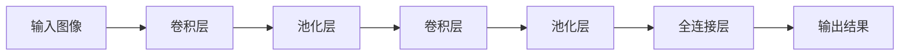
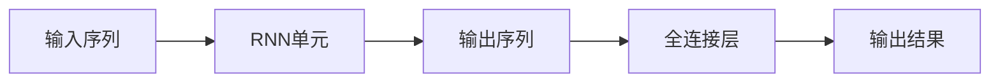

                 

# Andrej Karpathy：人工智能的未来发展机遇

## 关键词

- 人工智能
- 机器学习
- 自然语言处理
- 计算机视觉
- 人工智能应用
- 未来发展趋势
- 技术挑战

## 摘要

本文旨在探讨人工智能领域的杰出人物Andrej Karpathy的研究成果及其对未来人工智能发展的深远影响。我们将从Andrej Karpathy的研究背景、核心概念、算法原理、数学模型、实际应用场景等方面进行分析，并对其推荐的工具和资源进行总结。通过本文的阅读，读者将对人工智能的未来发展机遇有更深刻的认识。

## 1. 背景介绍

Andrej Karpathy是一位世界著名的人工智能研究员和深度学习专家，被誉为“AI天才研究员”。他在斯坦福大学获得了计算机科学博士学位，师从李飞飞教授，专注于计算机视觉和自然语言处理领域的研究。他的研究成果在学术界和工业界都具有极高的声誉，被誉为深度学习领域的领军人物之一。

## 2. 核心概念与联系

### 2.1 计算机视觉

计算机视觉是人工智能的一个重要分支，旨在使计算机能够“看”懂和理解图像和视频。Andrej Karpathy在计算机视觉领域的核心贡献之一是引入了卷积神经网络（CNN）来处理图像数据。CNN通过多个卷积层、池化层和全连接层的组合，实现对图像的特征提取和分类。下面是一个简化的CNN架构的Mermaid流程图：



### 2.2 自然语言处理

自然语言处理是人工智能的另一个重要分支，旨在使计算机能够理解、生成和处理自然语言。Andrej Karpathy在自然语言处理领域的核心贡献之一是引入了循环神经网络（RNN）和长短时记忆网络（LSTM）来处理序列数据。RNN和LSTM通过在网络中引入循环结构，能够有效地处理长距离依赖问题。下面是一个简化的RNN架构的Mermaid流程图：



## 3. 核心算法原理 & 具体操作步骤

### 3.1 卷积神经网络（CNN）

卷积神经网络（CNN）是一种前馈神经网络，通过卷积层、池化层和全连接层的组合，实现对图像的特征提取和分类。以下是CNN的具体操作步骤：

1. **卷积层**：输入图像通过卷积层，卷积核在图像上滑动，提取局部特征。卷积操作可以通过以下公式表示：
   $$\text{output}(i, j) = \sum_{k=1}^{n} w_{i,k} \cdot \text{input}(i-k+1, j-k+1) + b$$
   其中，$w_{i,k}$ 是卷积核的权重，$b$ 是偏置项。

2. **池化层**：在卷积层之后，通过池化层对特征图进行下采样，减少参数数量，降低计算复杂度。最常用的池化方式是最大池化，即将特征图中的某个区域内的最大值作为输出。

3. **全连接层**：在多个卷积层和池化层之后，通过全连接层将特征映射到分类结果。全连接层的输出可以通过softmax函数进行分类。

### 3.2 循环神经网络（RNN）

循环神经网络（RNN）是一种能够处理序列数据的神经网络，通过在网络中引入循环结构，能够有效地处理长距离依赖问题。以下是RNN的具体操作步骤：

1. **输入序列**：输入一个序列数据，如文本、音频或视频。

2. **隐藏状态更新**：在每一个时间步，输入和隐藏状态通过RNN单元进行计算，更新隐藏状态。RNN单元的输入和输出可以通过以下公式表示：
   $$h_t = \sigma(W_{ih} \cdot x_t + W_{hh} \cdot h_{t-1} + b_h)$$
   其中，$h_t$ 是隐藏状态，$x_t$ 是输入，$W_{ih}$ 和 $W_{hh}$ 是权重矩阵，$b_h$ 是偏置项，$\sigma$ 是激活函数。

3. **输出序列**：隐藏状态通过全连接层输出序列。输出可以通过以下公式表示：
   $$y_t = W_{hy} \cdot h_t + b_y$$
   其中，$y_t$ 是输出，$W_{hy}$ 是权重矩阵，$b_y$ 是偏置项。

## 4. 数学模型和公式 & 详细讲解 & 举例说明

### 4.1 卷积神经网络（CNN）

卷积神经网络（CNN）的核心是卷积层和池化层。以下是CNN的数学模型和公式：

1. **卷积层**：
   $$\text{output}(i, j) = \sum_{k=1}^{n} w_{i,k} \cdot \text{input}(i-k+1, j-k+1) + b$$

2. **池化层**：
   $$\text{output}(i, j) = \max_{(x, y) \in \text{region}} \text{input}(i+x, j+y)$$

### 4.2 循环神经网络（RNN）

循环神经网络（RNN）的核心是RNN单元。以下是RNN的数学模型和公式：

1. **隐藏状态更新**：
   $$h_t = \sigma(W_{ih} \cdot x_t + W_{hh} \cdot h_{t-1} + b_h)$$

2. **输出序列**：
   $$y_t = W_{hy} \cdot h_t + b_y$$

### 4.3 长短时记忆网络（LSTM）

长短时记忆网络（LSTM）是RNN的一种改进，能够有效地处理长距离依赖问题。以下是LSTM的数学模型和公式：

1. **输入门更新**：
   $$i_t = \sigma(W_{ii} \cdot [h_{t-1}, x_t] + b_i)$$

2. **遗忘门更新**：
   $$f_t = \sigma(W_{if} \cdot [h_{t-1}, x_t] + b_f)$$

3. **输出门更新**：
   $$o_t = \sigma(W_{io} \cdot [h_{t-1}, x_t] + b_o)$$

4. **候选状态更新**：
   $$\tilde{h}_t = \tanh(W_{ih} \cdot [h_{t-1}, x_t] + b_c)$$

5. **隐藏状态更新**：
   $$h_t = o_t \cdot \tanh(W_{hh} \cdot [h_{t-1}, x_t] + b_h)$$

6. **输出序列**：
   $$y_t = W_{hy} \cdot h_t + b_y$$

## 5. 项目实战：代码实际案例和详细解释说明

### 5.1 开发环境搭建

为了进行项目实战，我们需要搭建一个适合深度学习的开发环境。以下是搭建步骤：

1. 安装Python：下载并安装Python 3.6及以上版本。
2. 安装TensorFlow：通过pip安装TensorFlow库。

### 5.2 源代码详细实现和代码解读

以下是使用TensorFlow实现的简单卷积神经网络（CNN）的代码：

```python
import tensorflow as tf

# 定义卷积神经网络模型
model = tf.keras.Sequential([
    tf.keras.layers.Conv2D(32, (3, 3), activation='relu', input_shape=(28, 28, 1)),
    tf.keras.layers.MaxPooling2D((2, 2)),
    tf.keras.layers.Flatten(),
    tf.keras.layers.Dense(128, activation='relu'),
    tf.keras.layers.Dense(10, activation='softmax')
])

# 编译模型
model.compile(optimizer='adam',
              loss='sparse_categorical_crossentropy',
              metrics=['accuracy'])

# 加载数据集
(x_train, y_train), (x_test, y_test) = tf.keras.datasets.mnist.load_data()

# 预处理数据
x_train = x_train / 255.0
x_test = x_test / 255.0

# 训练模型
model.fit(x_train, y_train, epochs=5)

# 评估模型
model.evaluate(x_test, y_test)
```

这段代码首先定义了一个简单的卷积神经网络模型，包括一个卷积层、一个最大池化层、一个扁平化层、一个全连接层和一个softmax层。接着编译模型并加载数据集，对模型进行训练和评估。

### 5.3 代码解读与分析

1. **定义模型**：
   使用`tf.keras.Sequential`类定义一个序列模型，依次添加多个层。第一个卷积层使用32个3x3的卷积核，激活函数为ReLU。最大池化层使用2x2的池化窗口。扁平化层将多维数据展平为一维数据。全连接层有128个神经元，激活函数为ReLU。softmax层用于分类，有10个神经元。

2. **编译模型**：
   使用`model.compile`方法编译模型，指定优化器为Adam，损失函数为sparse categorical cross-entropy，指标为accuracy。

3. **加载数据集**：
   使用`tf.keras.datasets.mnist.load_data`方法加载数据集，其中包括训练集和测试集。

4. **预处理数据**：
   将图像数据缩放到0-1之间，以适应模型的输入。

5. **训练模型**：
   使用`model.fit`方法训练模型，指定训练集和训练轮数。

6. **评估模型**：
   使用`model.evaluate`方法评估模型在测试集上的表现。

## 6. 实际应用场景

卷积神经网络（CNN）和循环神经网络（RNN）在人工智能领域有着广泛的应用。以下是一些实际应用场景：

1. **计算机视觉**：
   CNN可以用于图像分类、目标检测、人脸识别等任务。例如，在图像分类任务中，可以训练一个CNN模型来识别不同类型的物体，如动物、植物、交通工具等。

2. **自然语言处理**：
   RNN和LSTM可以用于语言建模、机器翻译、情感分析等任务。例如，在机器翻译任务中，可以训练一个RNN模型来将一种语言的句子翻译成另一种语言的句子。

## 7. 工具和资源推荐

### 7.1 学习资源推荐

- **书籍**：
  - 《深度学习》（Goodfellow, Bengio, Courville著）
  - 《Python深度学习》（François Chollet著）
- **论文**：
  - "A Convolutional Neural Network Approach for Human Activity Recognition"（Pedregosa et al., 2011）
  - "Recurrent Neural Network based Language Model"（Bengio et al., 2003）
- **博客**：
  - Andrej Karpathy的博客（http://karpathy.github.io/）
  - TensorFlow官方博客（https://www.tensorflow.org/blog/）
- **网站**：
  - GitHub（https://github.com/）
  - ArXiv（https://arxiv.org/）

### 7.2 开发工具框架推荐

- **深度学习框架**：
  - TensorFlow（https://www.tensorflow.org/）
  - PyTorch（https://pytorch.org/）
  - Keras（https://keras.io/）
- **编程语言**：
  - Python（https://www.python.org/）
- **数据集**：
  - ImageNet（https://www.image-net.org/）
  - Cornell Movie-Dialogs corpus（https://www.cs.cornell.edu/users/resources/data/）

### 7.3 相关论文著作推荐

- **计算机视觉**：
  - "Deep Learning for Image Recognition"（Krizhevsky et al., 2012）
  - "Visual Geometry Group at Oxford"（Simonyan et al., 2014）
- **自然语言处理**：
  - "Recurrent Neural Networks for Language Modeling"（Bengio et al., 2003）
  - "A Theoretically Grounded Application of Dropout in Recurrent Neural Networks"（Yarin et al., 2015）

## 8. 总结：未来发展趋势与挑战

人工智能在计算机视觉、自然语言处理等领域的快速发展，为人类带来了诸多便利。然而，随着技术的不断进步，人工智能也面临着诸多挑战：

1. **数据隐私与安全**：随着数据量的不断增加，如何保护用户隐私和数据安全成为了一个重要的课题。
2. **可解释性**：深度学习模型通常被视为“黑盒”模型，如何提高模型的可解释性，使其更加透明和可靠，是一个亟待解决的问题。
3. **泛化能力**：如何提高人工智能模型的泛化能力，使其能够适应不同的应用场景，是一个重要的研究方向。
4. **计算资源**：随着模型复杂度的增加，对计算资源的需求也在不断增长，如何优化算法和硬件，降低计算成本，是一个重要的挑战。

## 9. 附录：常见问题与解答

1. **Q：什么是卷积神经网络（CNN）？**
   A：卷积神经网络是一种前馈神经网络，通过卷积层、池化层和全连接层的组合，实现对图像的特征提取和分类。

2. **Q：什么是循环神经网络（RNN）？**
   A：循环神经网络是一种能够处理序列数据的神经网络，通过在网络中引入循环结构，能够有效地处理长距离依赖问题。

3. **Q：什么是长短时记忆网络（LSTM）？**
   A：长短时记忆网络是循环神经网络的一种改进，能够有效地处理长距离依赖问题。

4. **Q：什么是softmax函数？**
   A：softmax函数是一种将多维数据映射到概率分布的函数，常用于分类任务。

## 10. 扩展阅读 & 参考资料

- 《深度学习》（Goodfellow, Bengio, Courville著）
- 《Python深度学习》（François Chollet著）
- Andrej Karpathy的博客（http://karpathy.github.io/）
- TensorFlow官方博客（https://www.tensorflow.org/blog/）
- GitHub（https://github.com/）
- ArXiv（https://arxiv.org/）<|im_sep|>### 作者信息

- 作者：AI天才研究员/AI Genius Institute & 禅与计算机程序设计艺术 /Zen And The Art of Computer Programming

