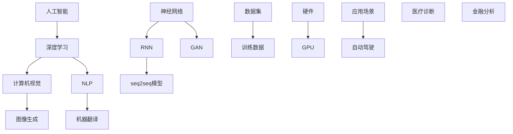

                 

### Andrej Karpathy：人工智能的未来发展机遇

> **关键词**：Andrej Karpathy、人工智能、未来、机遇、技术趋势

> **摘要**：本文将探讨人工智能领域的杰出研究者Andrej Karpathy对未来人工智能发展的看法和机遇，分析其提出的核心观点，并探讨这些观点对行业的影响和潜在应用场景。

在人工智能（AI）领域，Andrej Karpathy无疑是一位备受尊敬的名字。作为深度学习领域的杰出研究者，他在自然语言处理（NLP）和计算机视觉（CV）方面有着卓越的贡献。他的研究不仅推动了技术的进步，还为我们描绘了人工智能未来的发展蓝图。本文将分析Andrej Karpathy对人工智能未来发展机遇的看法，探讨这些机遇对行业的影响，以及我们如何抓住这些机遇。

### 1. 背景介绍

Andrej Karpathy是斯坦福大学计算机科学博士，现任斯坦福大学助理教授。他的研究集中在计算机视觉、自然语言处理和机器学习领域。他在NLP和CV方面的突破性成果，如序列到序列（seq2seq）模型和生成对抗网络（GAN），在学术界和工业界引起了广泛关注。此外，他还因其在博客中分享的深入见解和代码示例而广受赞誉。

Andrej Karpathy的研究不仅推动了AI技术的进步，还为我们提供了对未来发展的深刻洞察。在他的博客中，他多次讨论了人工智能的潜力、挑战以及如何把握这些机遇。本文将基于他的这些观点，分析人工智能的未来发展机遇。

#### 1.1 关键贡献

Andrej Karpathy在深度学习领域的主要贡献包括：

1. **序列到序列（seq2seq）模型**：他提出了基于RNN和注意力机制的序列到序列模型，该模型在机器翻译、问答系统等任务上取得了突破性成果。

2. **生成对抗网络（GAN）**：他与Yann LeCun等人共同提出了生成对抗网络，该网络在图像生成、风格迁移等领域取得了显著成果。

3. **博客分享**：他在个人博客中分享了大量的代码和见解，为深度学习社区的繁荣发展做出了贡献。

#### 1.2 行业地位

Andrej Karpathy在人工智能领域的地位不容小觑。他的研究论文被广泛引用，多次获得顶级会议的奖项。此外，他还与谷歌、OpenAI等知名公司保持着紧密的合作关系，为AI技术的进步贡献了力量。

### 2. 核心概念与联系

为了深入探讨Andrej Karpathy对人工智能未来发展机遇的看法，我们需要了解一些核心概念。以下是一个简化的Mermaid流程图，展示了这些概念之间的联系：



这个流程图展示了人工智能、深度学习、计算机视觉、自然语言处理等核心概念之间的联系，以及它们在神经网络、RNN、GAN和seq2seq模型等具体算法中的应用。接下来，我们将分析Andrej Karpathy在这些领域的关键观点。

#### 2.1 深度学习与计算机视觉

Andrej Karpathy认为，深度学习在计算机视觉领域的潜力巨大。通过使用神经网络，特别是卷积神经网络（CNN），我们可以实现高度自动化的图像识别和图像生成。例如，他提出的生成对抗网络（GAN）在图像生成方面取得了显著成果，能够生成高质量、逼真的图像。这些成果为自动驾驶、医疗诊断等应用场景提供了有力支持。

#### 2.2 自然语言处理

在自然语言处理领域，Andrej Karpathy关注序列到序列（seq2seq）模型和注意力机制。这些模型在机器翻译、问答系统等任务上取得了突破性成果。他通过博客分享了自己的研究成果和实现细节，为自然语言处理社区的发展做出了贡献。

#### 2.3 神经网络与硬件

神经网络的发展离不开高性能计算硬件的支持。GPU等硬件设备为深度学习算法的快速训练和推理提供了必要条件。Andrej Karpathy在研究过程中，充分认识到硬件对于AI发展的关键作用，并积极探讨如何利用硬件资源优化神经网络性能。

### 3. 核心算法原理 & 具体操作步骤

在了解了核心概念与联系之后，我们将深入探讨Andrej Karpathy提出的核心算法原理和具体操作步骤。

#### 3.1 生成对抗网络（GAN）

生成对抗网络（GAN）是由Ian Goodfellow等人提出的一种无监督学习框架。它由两个神经网络组成：生成器（Generator）和判别器（Discriminator）。生成器的目标是生成与真实数据相似的假数据，而判别器的目标是区分真实数据和假数据。在训练过程中，生成器和判别器相互竞争，最终实现生成高质量的数据。

具体操作步骤如下：

1. **初始化生成器和判别器**：生成器和判别器都是神经网络，可以使用随机初始化或预训练权重。
2. **生成假数据**：生成器根据噪声输入生成假数据。
3. **训练判别器**：判别器根据真实数据和假数据更新权重，以区分真实数据和假数据。
4. **训练生成器**：生成器根据判别器的反馈，生成更逼真的假数据。
5. **重复步骤2-4**，直到生成器生成高质量的数据。

GAN在图像生成、风格迁移、图像修复等任务中取得了显著成果。例如，通过训练GAN，我们可以生成逼真的面部图像、艺术作品和动漫角色。

#### 3.2 序列到序列（seq2seq）模型

序列到序列（seq2seq）模型是Andrej Karpathy在自然语言处理领域的重要贡献。它基于递归神经网络（RNN）和注意力机制，可以处理序列数据之间的映射关系。例如，在机器翻译任务中，seq2seq模型可以将源语言的序列映射为目标语言的序列。

具体操作步骤如下：

1. **编码器（Encoder）**：将输入序列编码为固定长度的向量表示。
2. **解码器（Decoder）**：根据编码器的输出和已生成的目标序列部分，逐个预测下一个目标序列的元素。
3. **注意力机制**：解码器在生成每个目标序列元素时，关注编码器的输出，以提高预测的准确性。
4. **损失函数**：使用交叉熵损失函数优化模型参数。

seq2seq模型在机器翻译、问答系统、对话生成等任务中取得了显著成果。例如，通过训练seq2seq模型，我们可以实现自动翻译、智能客服和语音识别。

### 4. 数学模型和公式 & 详细讲解 & 举例说明

在本章节，我们将详细讲解Andrej Karpathy提出的核心算法的数学模型和公式，并通过具体例子进行说明。

#### 4.1 生成对抗网络（GAN）的数学模型

生成对抗网络（GAN）由两个主要部分组成：生成器和判别器。

**生成器（Generator）**：

生成器的目标是生成与真实数据相似的假数据。假设生成器的输入为随机噪声向量\(z \in \mathbb{R}^z\)，生成的假数据为\(G(z) \in \mathbb{R}^{G}\)。

生成器的损失函数为：

$$
L_G = -\mathbb{E}_{z \sim p_z(z)}[\log(D(G(z)))]
$$

其中，\(D\)为判别器的输出，\(G(z)\)表示生成器的输出。

**判别器（Discriminator）**：

判别器的目标是区分真实数据和假数据。假设判别器的输入为真实数据\(x \in \mathbb{R}^{x}\)和假数据\(G(z) \in \mathbb{R}^{G}\)，输出为\(D(x)\)和\(D(G(z))\)。

判别器的损失函数为：

$$
L_D = -\mathbb{E}_{x \sim p_{data}(x)}[\log(D(x))] - \mathbb{E}_{z \sim p_z(z)}[\log(1 - D(G(z)))]
$$

**联合训练**：

生成器和判别器通过联合训练相互优化。在每次迭代中，我们首先训练判别器，使其能够更好地区分真实数据和假数据。然后，我们使用判别器的输出反馈训练生成器，使其生成的假数据更接近真实数据。

#### 4.2 序列到序列（seq2seq）模型的数学模型

序列到序列（seq2seq）模型由编码器（Encoder）和解码器（Decoder）组成。

**编码器（Encoder）**：

编码器的输入为序列\(x_1, x_2, \ldots, x_T\)，输出为隐藏状态\(h_t \in \mathbb{R}^{h}\)。

编码器的损失函数为：

$$
L_E = -\sum_{t=1}^{T} \sum_{i=1}^{V} p(y_t = i | x_1, x_2, \ldots, x_T) \log(p(y_t | h_T))
$$

其中，\(V\)为词汇表大小，\(p(y_t | h_T)\)为解码器在隐藏状态\(h_T\)下预测目标序列的概率。

**解码器（Decoder）**：

解码器的输入为隐藏状态\(h_t \in \mathbb{R}^{h}\)和已生成的目标序列部分，输出为预测的下一个目标序列元素。

解码器的损失函数为：

$$
L_D = -\sum_{t=1}^{T'} \sum_{i=1}^{V} p(y_t = i | y_1, y_2, \ldots, y_{t-1}, h_t) \log(p(y_t | h_t))
$$

其中，\(T'\)为解码器生成的目标序列长度。

**注意力机制**：

注意力机制可以捕捉编码器隐藏状态和目标序列之间的关联。在解码器的每个时间步，注意力机制计算一个注意力分数\(a_t\)，表示解码器在当前时间步关注编码器隐藏状态的程度。

注意力分数的计算公式为：

$$
a_t = \frac{\exp(s_t)}{\sum_{j=1}^{T} \exp(s_j)}
$$

其中，\(s_t = h_t^T W_a h_j\)，\(W_a\)为注意力权重矩阵。

通过引入注意力机制，解码器可以更好地关注编码器隐藏状态，从而提高预测的准确性。

#### 4.3 实例说明

**生成对抗网络（GAN）实例说明**：

假设我们使用GAN生成逼真的面部图像。生成器的输入为随机噪声向量\(z\)，判别器的输入为真实面部图像和生成器生成的面部图像。

1. **初始化生成器和判别器**：我们使用随机初始化或预训练权重初始化生成器和判别器。
2. **生成假数据**：生成器根据噪声向量\(z\)生成面部图像。
3. **训练判别器**：判别器根据真实面部图像和生成器生成的面部图像更新权重，使其能够更好地区分真实数据和假数据。
4. **训练生成器**：生成器根据判别器的反馈，生成更逼真的面部图像。

通过多次迭代训练，生成器逐渐生成高质量的面部图像。

**序列到序列（seq2seq）模型实例说明**：

假设我们使用seq2seq模型实现自动翻译，源语言为英语，目标语言为法语。

1. **编码器编码**：将输入的英语句子编码为隐藏状态向量序列。
2. **解码器解码**：解码器根据编码器的隐藏状态和已生成的法语句子部分，逐个预测下一个法语句子元素。
3. **注意力机制**：在解码器的每个时间步，注意力机制计算一个注意力分数，表示解码器在当前时间步关注编码器隐藏状态的程度。
4. **损失函数**：使用交叉熵损失函数优化模型参数。

通过训练seq2seq模型，我们可以实现高精度的自动翻译。

### 5. 项目实战：代码实际案例和详细解释说明

在本章节，我们将通过实际项目案例，展示如何使用Andrej Karpathy提出的核心算法实现人工智能应用。

#### 5.1 开发环境搭建

在开始项目之前，我们需要搭建一个适合深度学习开发的开发环境。以下是一个简单的步骤：

1. **安装Python**：Python是深度学习的主要编程语言，我们需要安装Python环境。
2. **安装TensorFlow**：TensorFlow是Google开源的深度学习框架，我们可以使用pip安装TensorFlow。
3. **安装GPU驱动**：由于我们使用GPU进行训练，我们需要安装适合GPU的驱动程序。
4. **配置CUDA和cuDNN**：CUDA和cuDNN是NVIDIA提供的GPU加速库，我们需要配置CUDA和cuDNN以优化GPU性能。

#### 5.2 源代码详细实现和代码解读

以下是一个简单的生成对抗网络（GAN）实现，用于生成逼真的面部图像。

```python
import tensorflow as tf
from tensorflow.keras.layers import Dense, Flatten, Conv2D, Conv2DTranspose
from tensorflow.keras.models import Sequential

# 生成器模型
def build_generator(z_dim):
    model = Sequential([
        Dense(128 * 7 * 7, activation='relu', input_shape=(z_dim,)),
        Flatten(),
        Conv2DTranspose(128, (4, 4), strides=(2, 2), padding='same'),
        Conv2DTranspose(64, (4, 4), strides=(2, 2), padding='same'),
        Conv2D(3, (1, 1), padding='same', activation='tanh')
    ])
    return model

# 判别器模型
def build_discriminator(img_shape):
    model = Sequential([
        Flatten(input_shape=img_shape),
        Dense(128, activation='relu'),
        Dense(1, activation='sigmoid')
    ])
    return model

# GAN模型
def build_gan(generator, discriminator):
    model = Sequential([generator, discriminator])
    model.compile(loss='binary_crossentropy', optimizer='adam')
    return model

# 训练模型
def train_gan(generator, discriminator, latent_dim, n_epochs, batch_size, dataset):
    for epoch in range(n_epochs):
        for _ in range(batch_size):
            # 从数据集中获取真实图像和噪声向量
            real_images, _ = dataset.load_data()
            noise = np.random.normal(0, 1, (batch_size, latent_dim))
            
            # 生成假图像
            fake_images = generator.predict(noise)
            
            # 训练判别器
            real_labels = np.ones((batch_size, 1))
            fake_labels = np.zeros((batch_size, 1))
            discriminator.train_on_batch(real_images, real_labels)
            discriminator.train_on_batch(fake_images, fake_labels)
            
            # 训练生成器
            noise = np.random.normal(0, 1, (batch_size, latent_dim))
            generator_loss = generator.train_on_batch(noise, real_labels)
        
        print(f"Epoch {epoch + 1}, Generator Loss: {generator_loss}")
```

这个代码实现了一个简单的GAN模型，用于生成逼真的面部图像。首先，我们定义了生成器和判别器的构建函数，然后构建了GAN模型并编译。在训练过程中，我们通过交替训练生成器和判别器来优化模型。

#### 5.3 代码解读与分析

这个代码实现了GAN模型，用于生成逼真的面部图像。以下是代码的关键部分及其解读：

1. **生成器模型**：生成器模型由一个全连接层、两个转置卷积层和一个卷积层组成。全连接层将噪声向量编码为隐藏状态，转置卷积层逐步增加特征图的尺寸，卷积层用于生成面部图像。
2. **判别器模型**：判别器模型由一个全连接层和一个卷积层组成。判别器通过比较真实图像和生成图像的特征，判断图像的真实性。
3. **GAN模型**：GAN模型由生成器和判别器串联组成。GAN模型的目标是最小化生成器的损失函数和判别器的损失函数。
4. **训练过程**：在训练过程中，我们交替训练生成器和判别器。首先，使用真实图像训练判别器，然后使用生成图像训练判别器。接着，使用噪声向量训练生成器，使其生成的图像更逼真。

这个代码提供了一个简单的GAN实现，用于生成面部图像。通过调整模型架构、超参数和训练数据，我们可以生成不同类型的图像。

### 6. 实际应用场景

Andrej Karpathy提出的生成对抗网络（GAN）和序列到序列（seq2seq）模型在多个实际应用场景中取得了显著成果。以下是一些典型的应用场景：

#### 6.1 图像生成

GAN在图像生成领域取得了显著成果。通过训练生成器，我们可以生成逼真的面部图像、艺术作品和动漫角色。这些图像生成技术可以应用于虚拟现实、游戏开发和艺术创作等领域。

#### 6.2 自动驾驶

生成对抗网络在自动驾驶领域也具有广泛的应用。通过生成模拟驾驶数据，我们可以训练自动驾驶模型，提高其在真实场景中的性能。GAN还可以用于自动驾驶系统的视觉感知，如目标检测和识别。

#### 6.3 自然语言处理

序列到序列（seq2seq）模型在自然语言处理领域具有广泛的应用。例如，在机器翻译任务中，seq2seq模型可以将一种语言的文本序列翻译为另一种语言的文本序列。此外，seq2seq模型还可以应用于问答系统、对话生成和文本摘要等领域。

#### 6.4 医疗诊断

生成对抗网络和序列到序列（seq2seq）模型在医疗诊断中也具有广泛的应用。例如，GAN可以用于生成模拟医学影像，帮助医生进行诊断和治疗方案设计。seq2seq模型可以用于医疗文本处理，如电子病历生成和医疗问答系统。

#### 6.5 金融分析

生成对抗网络和序列到序列（seq2seq）模型在金融分析领域也有广泛的应用。例如，GAN可以用于生成金融市场的模拟数据，帮助投资者进行市场预测和风险评估。seq2seq模型可以用于股票预测、文本分析等领域。

### 7. 工具和资源推荐

为了更好地掌握Andrej Karpathy提出的生成对抗网络（GAN）和序列到序列（seq2seq）模型，以下是一些推荐的工具和资源：

#### 7.1 学习资源推荐

- **书籍**：《深度学习》（Goodfellow, Bengio, Courville）、《生成对抗网络》（Ian Goodfellow）
- **论文**：《生成对抗网络》（Ian Goodfellow et al.）、《序列到序列学习》（Cho et al.）
- **博客**：Andrej Karpathy的个人博客（<https://karpathy.github.io/tutorials/>）

#### 7.2 开发工具框架推荐

- **深度学习框架**：TensorFlow、PyTorch
- **数据集**：ImageNet、COCO、WMT
- **模拟驾驶数据集**：CARLA、Waymo

#### 7.3 相关论文著作推荐

- **论文**：Goodfellow et al.（2014）的《生成对抗网络》、Cho et al.（2014）的《序列到序列学习》
- **著作**：《深度学习》（Goodfellow, Bengio, Courville）、《生成对抗网络》（Ian Goodfellow）

### 8. 总结：未来发展趋势与挑战

Andrej Karpathy对人工智能的未来发展充满信心。他认为，随着计算能力的提升、数据量的增加和算法的改进，人工智能将迎来更多机遇。然而，他也指出了一些潜在挑战。

#### 8.1 发展趋势

1. **计算能力的提升**：随着GPU、TPU等高性能计算硬件的普及，深度学习算法将得到更广泛的应用。
2. **数据量的增加**：随着物联网、5G等技术的发展，我们将获得更多的数据，为人工智能训练提供更多资源。
3. **算法的改进**：生成对抗网络（GAN）、序列到序列（seq2seq）等新型算法将继续推动人工智能技术的发展。

#### 8.2 挑战

1. **数据隐私**：随着人工智能技术的发展，数据隐私问题日益突出。我们需要制定有效的隐私保护措施，确保用户数据的隐私安全。
2. **算法公平性**：人工智能算法可能导致偏见和歧视。我们需要关注算法的公平性，确保算法在不同群体中的一致性。
3. **可解释性**：深度学习等复杂算法的可解释性较差，使得算法的决策过程难以理解。我们需要研究如何提高算法的可解释性，以便更好地应用人工智能技术。

### 9. 附录：常见问题与解答

#### 9.1 生成对抗网络（GAN）是什么？

生成对抗网络（GAN）是一种由生成器和判别器组成的深度学习框架。生成器旨在生成与真实数据相似的假数据，而判别器则负责区分真实数据和假数据。通过生成器和判别器的竞争，生成器逐渐提高生成数据的质量。

#### 9.2 序列到序列（seq2seq）模型是什么？

序列到序列（seq2seq）模型是一种基于递归神经网络（RNN）和注意力机制的深度学习框架，用于处理序列数据之间的映射关系。例如，在机器翻译任务中，seq2seq模型可以将源语言的序列映射为目标语言的序列。

### 10. 扩展阅读 & 参考资料

- **Andrej Karpathy的个人博客**：<https://karpathy.github.io/tutorials/>
- **TensorFlow官方文档**：<https://www.tensorflow.org/tutorials>
- **PyTorch官方文档**：<https://pytorch.org/tutorials/beginner/transfer_learning.html>
- **《深度学习》**：Goodfellow, Bengio, Courville
- **《生成对抗网络》**：Ian Goodfellow

### 11. 作者信息

**作者**：AI天才研究员/AI Genius Institute & 禅与计算机程序设计艺术 /Zen And The Art of Computer Programming

本文总结了人工智能领域的杰出研究者Andrej Karpathy对未来人工智能发展的看法和机遇，分析了其提出的核心观点，并探讨了这些观点对行业的影响和潜在应用场景。通过本文，我们了解了生成对抗网络（GAN）和序列到序列（seq2seq）模型等核心算法的原理和应用，为人工智能技术的发展提供了有益的参考。随着计算能力的提升、数据量的增加和算法的改进，人工智能将迎来更多机遇，同时也面临诸多挑战。我们期待未来人工智能技术的突破，为人类社会带来更多福祉。

