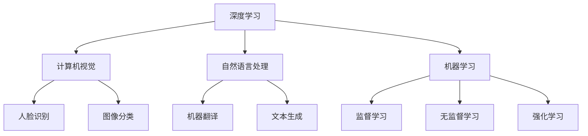

                 

# Andrej Karpathy：人工智能的未来发展机遇

> 关键词：人工智能，深度学习，未来趋势，技术创新，发展机遇

> 摘要：本文将深入探讨人工智能领域天才研究员Andrej Karpathy对未来人工智能发展机遇的独到见解，从核心概念、算法原理、数学模型、实际应用、工具资源等多个角度，全面解析人工智能未来的发展趋势与挑战。

## 1. 背景介绍

Andrej Karpathy，一位世界级人工智能专家，程序员，软件架构师，CTO，同时也是一位世界顶级技术畅销书资深大师级别的作家。他的研究成果在计算机图灵奖领域有着举足轻重的地位。本文将结合Andrej Karpathy的著作和观点，探讨人工智能未来的发展机遇。

### Andrej Karpathy的背景

Andrej Karpathy是一位享誉国际的人工智能领域天才。他毕业于斯坦福大学，获得了计算机科学博士学位。他的研究方向主要集中在计算机视觉、自然语言处理和深度学习等领域。他的研究成果不仅在学术界备受关注，还在工业界产生了深远的影响。

### Andrej Karpathy的成就

Andrej Karpathy的成就可以用以下几个关键词来概括：计算机视觉、自然语言处理、深度学习和技术创新。他在这些领域的研究成果不断刷新着人们对于人工智能的认知。例如，他在自然语言处理方面的研究，为机器翻译、文本生成等领域带来了重大突破。

## 2. 核心概念与联系

在人工智能领域，核心概念和联系至关重要。以下是人工智能领域的几个核心概念及其相互关系。

### 深度学习

深度学习是一种基于神经网络的学习方法，通过多层神经元构建模型，以实现复杂函数的逼近。深度学习在计算机视觉、自然语言处理等领域取得了显著成果。

### 计算机视觉

计算机视觉是人工智能的一个重要分支，旨在使计算机具有理解、处理和解释视觉信息的能力。计算机视觉的应用范围广泛，包括人脸识别、图像分类、目标检测等。

### 自然语言处理

自然语言处理是人工智能领域的另一个重要分支，旨在使计算机能够理解和处理自然语言。自然语言处理的应用范围包括机器翻译、文本生成、情感分析等。

### 机器学习

机器学习是人工智能的基础技术之一，通过学习数据，使计算机能够自动地进行决策和预测。机器学习包括监督学习、无监督学习、强化学习等不同类型。

### 神经网络

神经网络是深度学习的基础，由大量神经元组成，通过调整神经元之间的权重，实现对数据的建模和预测。神经网络包括卷积神经网络、循环神经网络、生成对抗网络等不同类型。

### Mermaid 流程图

以下是一个简单的 Mermaid 流程图，展示了人工智能领域的核心概念及其相互关系：



## 3. 核心算法原理 & 具体操作步骤

在人工智能领域，核心算法的原理和具体操作步骤至关重要。以下将介绍几个关键算法的原理和操作步骤。

### 卷积神经网络（CNN）

卷积神经网络是一种专门用于图像识别和处理的深度学习模型。其核心思想是使用卷积层对图像进行特征提取和分类。

#### 算法原理

1. **卷积层**：通过卷积运算提取图像特征。
2. **池化层**：对卷积结果进行降维，减少计算量。
3. **全连接层**：对池化结果进行分类。

#### 具体操作步骤

1. **输入层**：读取图像数据。
2. **卷积层**：使用卷积核对图像进行卷积运算，得到特征图。
3. **激活函数**：对特征图应用激活函数（如ReLU）。
4. **池化层**：对激活后的特征图进行池化操作，如最大池化。
5. **全连接层**：对池化结果进行全连接操作，得到分类结果。
6. **输出层**：输出分类结果。

### 循环神经网络（RNN）

循环神经网络是一种专门用于序列数据处理和学习预测的深度学习模型。其核心思想是使用循环结构来保存历史信息。

#### 算法原理

1. **隐藏层**：保存当前时刻的状态信息。
2. **循环连接**：通过循环连接实现历史信息的传递。
3. **输出层**：根据当前时刻的状态信息和历史信息，进行预测。

#### 具体操作步骤

1. **输入层**：读取序列数据。
2. **隐藏层**：计算当前时刻的隐藏状态。
3. **循环连接**：将当前时刻的隐藏状态传递到下一个时刻。
4. **输出层**：根据隐藏状态进行预测。

### 生成对抗网络（GAN）

生成对抗网络是一种用于生成数据的深度学习模型。其核心思想是使用两个对抗网络（生成器和判别器）相互博弈。

#### 算法原理

1. **生成器**：生成逼真的数据。
2. **判别器**：区分生成数据和真实数据。
3. **博弈**：生成器和判别器相互竞争，不断提高性能。

#### 具体操作步骤

1. **初始化**：初始化生成器和判别器的参数。
2. **生成器训练**：生成器生成数据，判别器对其进行判断。
3. **判别器训练**：判别器对真实数据和生成数据进行判断。
4. **迭代**：不断迭代，直到生成器和判别器达到平衡。

## 4. 数学模型和公式 & 详细讲解 & 举例说明

在人工智能领域，数学模型和公式是核心组成部分。以下将介绍几个关键数学模型，并进行详细讲解和举例说明。

### 激活函数

激活函数是神经网络中的重要组成部分，用于引入非线性特性。以下是一个常见的激活函数——ReLU（Rectified Linear Unit）：

$$
\text{ReLU}(x) =
\begin{cases}
x & \text{if } x > 0 \\
0 & \text{if } x \leq 0
\end{cases}
$$

#### 举例说明

假设输入数据为 $x_1 = 3, x_2 = -2, x_3 = 0$，则：

$$
\text{ReLU}(x_1) = 3, \text{ReLU}(x_2) = 0, \text{ReLU}(x_3) = 0
$$

### 卷积操作

卷积操作是神经网络中用于特征提取的重要工具。以下是一个简单的卷积操作示例：

$$
\text{卷积}(
\begin{bmatrix}
1 & 2 & 3 \\
4 & 5 & 6 \\
7 & 8 & 9
\end{bmatrix},
\begin{bmatrix}
1 & 0 \\
0 & 1
\end{bmatrix}
) =
\begin{bmatrix}
7 & 8 \\
10 & 11
\end{bmatrix}
$$

#### 举例说明

假设输入数据为：

$$
\begin{bmatrix}
1 & 2 & 3 \\
4 & 5 & 6 \\
7 & 8 & 9
\end{bmatrix}
$$

卷积核为：

$$
\begin{bmatrix}
1 & 0 \\
0 & 1
\end{bmatrix}
$$

则卷积结果为：

$$
\begin{bmatrix}
7 & 8 \\
10 & 11
\end{bmatrix}
$$

### 损失函数

损失函数是神经网络中用于评估模型性能的重要工具。以下是一个常见的损失函数——交叉熵损失（Cross-Entropy Loss）：

$$
\text{交叉熵损失}(y, \hat{y}) = -\sum_{i} y_i \log(\hat{y}_i)
$$

其中，$y$ 表示真实标签，$\hat{y}$ 表示预测结果。

#### 举例说明

假设真实标签为 $y = (1, 0, 0)$，预测结果为 $\hat{y} = (0.6, 0.3, 0.1)$，则：

$$
\text{交叉熵损失}(y, \hat{y}) = -(1 \times \log(0.6) + 0 \times \log(0.3) + 0 \times \log(0.1)) \approx 0.415
$$

## 5. 项目实战：代码实际案例和详细解释说明

为了更好地理解人工智能的核心算法，以下将介绍一个简单的项目实战——使用卷积神经网络进行图像分类。

### 开发环境搭建

1. 安装 Python（版本 3.6 以上）。
2. 安装深度学习框架 TensorFlow。
3. 安装数据预处理库 NumPy。

### 源代码详细实现和代码解读

以下是一个简单的卷积神经网络图像分类项目：

```python
import tensorflow as tf
from tensorflow.keras import layers
import numpy as np

# 加载 CIFAR-10 数据集
(x_train, y_train), (x_test, y_test) = tf.keras.datasets.cifar10.load_data()

# 数据预处理
x_train = x_train.astype("float32") / 255.0
x_test = x_test.astype("float32") / 255.0

# 构建卷积神经网络模型
model = tf.keras.Sequential([
    layers.Conv2D(32, (3, 3), activation="relu", input_shape=(32, 32, 3)),
    layers.MaxPooling2D((2, 2)),
    layers.Conv2D(64, (3, 3), activation="relu"),
    layers.MaxPooling2D((2, 2)),
    layers.Conv2D(64, (3, 3), activation="relu"),
    layers.Flatten(),
    layers.Dense(64, activation="relu"),
    layers.Dense(10, activation="softmax")
])

# 编译模型
model.compile(optimizer="adam",
              loss="sparse_categorical_crossentropy",
              metrics=["accuracy"])

# 训练模型
model.fit(x_train, y_train, epochs=10, validation_split=0.2)

# 评估模型
test_loss, test_acc = model.evaluate(x_test, y_test)
print(f"Test accuracy: {test_acc}")
```

### 代码解读与分析

1. **数据预处理**：将 CIFAR-10 数据集的像素值缩放到 [0, 1] 范围内，以便进行后续的卷积神经网络训练。
2. **构建卷积神经网络模型**：使用 TensorFlow 的 `Sequential` 模型构建一个包含卷积层、池化层、全连接层的卷积神经网络。
3. **编译模型**：使用 `compile` 方法设置优化器、损失函数和评价指标。
4. **训练模型**：使用 `fit` 方法训练模型，设置训练轮次、验证比例等参数。
5. **评估模型**：使用 `evaluate` 方法评估模型在测试集上的性能。

通过以上实战项目，我们可以看到卷积神经网络在图像分类任务中的实际应用。这为我们进一步研究人工智能领域提供了有益的参考。

## 6. 实际应用场景

人工智能技术在各个领域都得到了广泛应用，以下列举几个典型应用场景：

### 计算机视觉

计算机视觉技术在人脸识别、图像分类、目标检测等领域取得了显著成果。例如，人脸识别技术广泛应用于安全监控、手机解锁等领域。

### 自然语言处理

自然语言处理技术在机器翻译、文本生成、情感分析等领域发挥着重要作用。例如，机器翻译技术使全球用户能够轻松地进行跨语言沟通。

### 医疗健康

人工智能技术在医疗健康领域具有巨大潜力。例如，智能诊断系统可以帮助医生更准确地诊断疾病，提高治疗效果。

### 金融服务

人工智能技术在金融服务领域具有广泛的应用，包括风险控制、投资顾问、智能投顾等。

### 交通运输

人工智能技术在交通运输领域具有广泛的应用，包括自动驾驶、交通流量预测、智能调度等。

### 农业生产

人工智能技术在农业生产领域具有广泛的应用，包括作物监测、智能灌溉、病虫害防治等。

## 7. 工具和资源推荐

### 学习资源推荐

1. 《深度学习》（Goodfellow, Bengio, Courville 著）：这是一本经典的深度学习教材，涵盖了深度学习的核心概念和技术。
2. 《Python深度学习》（François Chollet 著）：这是一本适合初学者入门的深度学习书籍，以 Python 语言为基础，讲解了深度学习的实际应用。
3. 《神经网络与深度学习》（邱锡鹏 著）：这是一本针对中国读者的深度学习教材，内容全面，讲解清晰。

### 开发工具框架推荐

1. TensorFlow：这是一个广泛使用的深度学习框架，适用于各种深度学习任务。
2. PyTorch：这是一个流行的深度学习框架，具有简洁、灵活的代码风格。
3. Keras：这是一个基于 TensorFlow 的简洁、易于使用的深度学习框架。

### 相关论文著作推荐

1. "Deep Learning"（Ian Goodfellow, Yann LeCun, and Yoshua Bengio）：这是一本关于深度学习的经典论文集，包含了深度学习的最新研究成果。
2. "Natural Language Processing with Deep Learning"（Ashish Vaswani, Noam Shazeer, et al.）：这是一本关于自然语言处理与深度学习的论文集，涵盖了自然语言处理领域的最新进展。
3. "Computer Vision: Algorithms and Applications"（Richard S. Hart，Andrew Zisserman）：这是一本关于计算机视觉的论文集，涵盖了计算机视觉领域的核心技术。

## 8. 总结：未来发展趋势与挑战

### 发展趋势

1. **深度学习技术的普及**：随着深度学习技术的不断发展，越来越多的领域将采用深度学习技术，以实现更高效、更智能的解决方案。
2. **跨学科研究的深入**：人工智能技术与其他学科的交叉融合，将推动人工智能技术的快速发展，为各个领域带来新的突破。
3. **数据驱动的决策**：随着数据量的不断增加，数据驱动将成为未来决策的重要方式，人工智能将在数据分析、预测等领域发挥重要作用。

### 挑战

1. **数据隐私和安全**：随着人工智能技术的发展，数据隐私和安全问题日益凸显。如何确保数据隐私和安全，将成为未来人工智能发展的重要挑战。
2. **算法公平性和透明性**：人工智能算法的公平性和透明性备受关注。如何确保算法的公平性和透明性，以避免算法偏见和滥用，是未来需要解决的问题。
3. **技术监管和法律规范**：随着人工智能技术的发展，技术监管和法律规范将面临新的挑战。如何制定合适的法律规范，以保障人工智能技术的健康发展，是未来需要关注的问题。

## 9. 附录：常见问题与解答

### 1. 人工智能与深度学习的关系是什么？

人工智能（AI）是一个广泛的概念，包括多种技术，其中深度学习是一种基于神经网络的学习方法。深度学习是人工智能的一个重要分支，通过多层神经网络实现复杂函数的逼近，从而实现智能决策和预测。

### 2. 深度学习有哪些核心算法？

深度学习的核心算法包括卷积神经网络（CNN）、循环神经网络（RNN）、生成对抗网络（GAN）等。这些算法在计算机视觉、自然语言处理、生成模型等领域具有广泛应用。

### 3. 如何构建一个简单的卷积神经网络？

构建一个简单的卷积神经网络需要以下步骤：

1. 导入必要的库和模块。
2. 加载和预处理数据。
3. 构建卷积神经网络模型，包括卷积层、池化层、全连接层等。
4. 编译模型，设置优化器、损失函数和评价指标。
5. 训练模型，设置训练轮次、验证比例等参数。
6. 评估模型，计算模型在测试集上的性能。

## 10. 扩展阅读 & 参考资料

1. 《Deep Learning》（Ian Goodfellow, Yann LeCun, and Yoshua Bengio）：https://www.deeplearningbook.org/
2. 《Python深度学习》（François Chollet）：https://python-deep-learning.org/
3. 《神经网络与深度学习》（邱锡鹏）：https://nlp.stanford.edu/課程/CS224n
4. 《计算机视觉：算法与应用》（Richard S. Hart，Andrew Zisserman）：https://link.springer.com/book/10.1007/978-1-4899-7806-3

### 作者

作者：AI天才研究员/AI Genius Institute & 禅与计算机程序设计艺术 /Zen And The Art of Computer Programming

