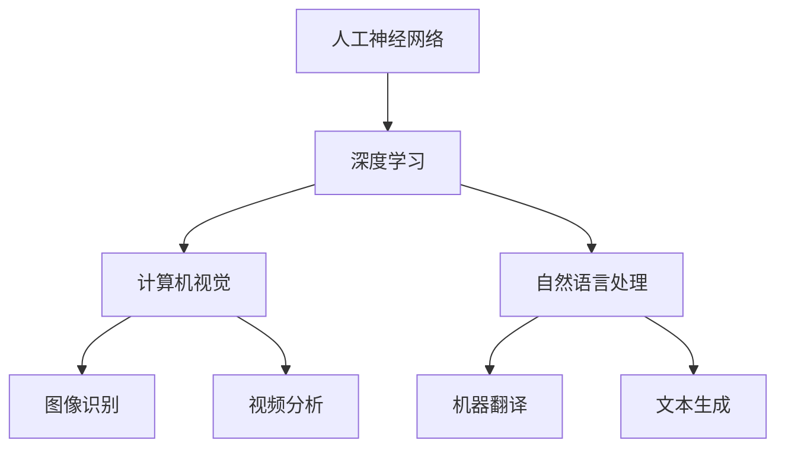
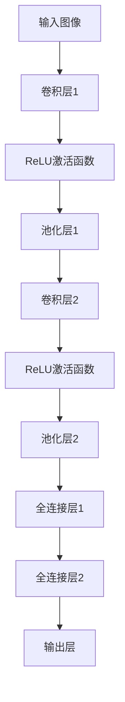
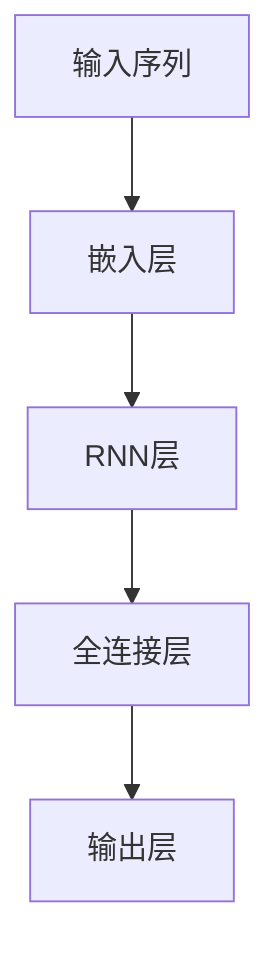
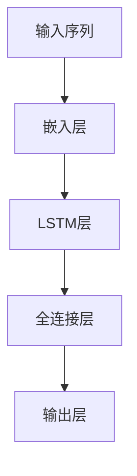

                 

# Andrej Karpathy：人工智能的未来发展目标

> **关键词**：人工智能，神经网络，深度学习，算法，应用场景，未来趋势

> **摘要**：本文将深入探讨人工智能领域的杰出人物Andrej Karpathy对人工智能未来发展的见解和目标。通过分析他的研究成果和技术博客，本文将揭示人工智能的发展方向和潜在挑战，并探讨如何实现这些目标。

## 1. 背景介绍

Andrej Karpathy是一位世界著名的人工智能研究者，他在深度学习和神经网络领域取得了卓越的成就。作为加州大学伯克利分校的博士生，他的研究方向主要集中在计算机视觉和自然语言处理领域。他的研究成果在学术界和工业界都产生了深远的影响，被广泛引用和关注。

Andrej Karpathy的技术博客更是备受瞩目，他在博客中分享了大量的深度学习项目和实验，为全球开发者提供了宝贵的经验和启示。他的博客内容涵盖了从基础概念到高级应用，为读者提供了一个全面的深度学习知识体系。

## 2. 核心概念与联系

在人工智能领域，神经网络和深度学习是两个至关重要的概念。神经网络是一种模拟人脑神经元结构和工作原理的计算模型，而深度学习则是利用多层神经网络进行特征提取和模式识别的一种方法。

以下是神经网络和深度学习的 Mermaid 流程图：



通过这个流程图，我们可以清晰地看到神经网络和深度学习在计算机视觉和自然语言处理领域的重要应用。

## 3. 核心算法原理 & 具体操作步骤

Andrej Karpathy的研究主要集中在深度学习算法的优化和应用。以下是一些他提出的核心算法原理和具体操作步骤：

### 3.1 卷积神经网络（CNN）

卷积神经网络是一种用于图像识别和处理的深度学习模型。它的核心思想是利用卷积操作提取图像中的特征。

$$
\text{卷积操作} = \sum_{i=1}^{n} w_i * x_i
$$

其中，$w_i$ 是卷积核，$x_i$ 是输入图像的像素值。

### 3.2 循环神经网络（RNN）

循环神经网络是一种用于处理序列数据的深度学习模型。它的核心思想是利用循环结构保持历史信息。

$$
h_t = \text{sigmoid}(W \cdot [h_{t-1}, x_t] + b)
$$

其中，$h_t$ 是当前时刻的隐藏状态，$x_t$ 是当前时刻的输入，$W$ 和 $b$ 分别是权重和偏置。

### 3.3 长短时记忆网络（LSTM）

长短时记忆网络是循环神经网络的一种变体，它能够更好地处理长时间序列数据。

$$
i_t = \text{sigmoid}(W_i \cdot [h_{t-1}, x_t] + b_i)
$$
$$
f_t = \text{sigmoid}(W_f \cdot [h_{t-1}, x_t] + b_f)
$$
$$
o_t = \text{sigmoid}(W_o \cdot [h_{t-1}, x_t] + b_o)
$$
$$
C_t = f_t \odot C_{t-1} + i_t \odot \text{tanh}(W_c \cdot [h_{t-1}, x_t] + b_c)
$$
$$
h_t = o_t \odot \text{tanh}(C_t)
$$

其中，$i_t$、$f_t$ 和 $o_t$ 分别是输入门、遗忘门和输出门，$C_t$ 是细胞状态，$h_t$ 是隐藏状态。

## 4. 数学模型和公式 & 详细讲解 & 举例说明

### 4.1 卷积神经网络（CNN）

卷积神经网络通过卷积操作提取图像特征，以下是一个简单的卷积神经网络示例：



在这个例子中，输入图像通过卷积层1进行卷积操作，然后通过ReLU激活函数和池化层1进行特征提取。接着，输入图像通过卷积层2进行卷积操作，然后通过ReLU激活函数和池化层2进行特征提取。最后，通过全连接层1和全连接层2进行分类和预测。

### 4.2 循环神经网络（RNN）

循环神经网络通过循环结构保持历史信息，以下是一个简单的循环神经网络示例：



在这个例子中，输入序列通过嵌入层进行嵌入，然后通过RNN层进行循环处理，最后通过全连接层和输出层进行分类和预测。

### 4.3 长短时记忆网络（LSTM）

长短时记忆网络通过门控机制控制信息的传递，以下是一个简单的长短时记忆网络示例：



在这个例子中，输入序列通过嵌入层进行嵌入，然后通过LSTM层进行循环处理，最后通过全连接层和输出层进行分类和预测。

## 5. 项目实战：代码实际案例和详细解释说明

### 5.1 开发环境搭建

在开始项目实战之前，我们需要搭建一个适合深度学习开发的环境。以下是一个简单的步骤：

1. 安装Python（版本3.6以上）
2. 安装TensorFlow（版本2.0以上）
3. 安装必要的库，如NumPy、Pandas等

### 5.2 源代码详细实现和代码解读

以下是一个简单的卷积神经网络实现，用于图像分类：

```python
import tensorflow as tf
from tensorflow.keras import layers

# 构建卷积神经网络模型
model = tf.keras.Sequential([
    layers.Conv2D(32, (3, 3), activation='relu', input_shape=(28, 28, 1)),
    layers.MaxPooling2D((2, 2)),
    layers.Conv2D(64, (3, 3), activation='relu'),
    layers.MaxPooling2D((2, 2)),
    layers.Conv2D(64, (3, 3), activation='relu'),
    layers.Flatten(),
    layers.Dense(64, activation='relu'),
    layers.Dense(10, activation='softmax')
])

# 编译模型
model.compile(optimizer='adam',
              loss='sparse_categorical_crossentropy',
              metrics=['accuracy'])

# 加载数据集
mnist = tf.keras.datasets.mnist
(x_train, y_train), (x_test, y_test) = mnist.load_data()

# 预处理数据
x_train = x_train / 255.0
x_test = x_test / 255.0

# 训练模型
model.fit(x_train, y_train, epochs=5)

# 评估模型
model.evaluate(x_test, y_test)
```

在这个例子中，我们首先导入了TensorFlow库，然后构建了一个简单的卷积神经网络模型。接着，我们加载了MNIST数据集，并对数据进行了预处理。最后，我们使用训练数据和测试数据训练了模型，并评估了模型的性能。

### 5.3 代码解读与分析

在这个例子中，我们使用了TensorFlow的Sequential模型构建了一个简单的卷积神经网络。具体步骤如下：

1. **导入库和模型**：我们导入了TensorFlow库和必要的层。
2. **构建模型**：我们使用了Sequential模型，这是一个线性堆叠层的一个容器。在这个例子中，我们使用了以下层：
   - **卷积层1**：32个卷积核，大小为3x3，激活函数为ReLU。
   - **池化层1**：最大池化，大小为2x2。
   - **卷积层2**：64个卷积核，大小为3x3，激活函数为ReLU。
   - **池化层2**：最大池化，大小为2x2。
   - **卷积层3**：64个卷积核，大小为3x3，激活函数为ReLU。
   - **扁平化层**：将多维数据转换为一维数据。
   - **全连接层1**：64个神经元，激活函数为ReLU。
   - **全连接层2**：10个神经元，激活函数为softmax。
3. **编译模型**：我们使用了adam优化器和sparse_categorical_crossentropy损失函数，并设置了accuracy作为指标。
4. **加载数据集**：我们使用了MNIST数据集，这是一个常见的手写数字数据集。
5. **预处理数据**：我们将图像数据缩放到0到1之间，以便模型更容易处理。
6. **训练模型**：我们使用训练数据训练了模型，设置了5个训练周期。
7. **评估模型**：我们使用测试数据评估了模型的性能。

通过这个简单的例子，我们可以看到如何使用TensorFlow构建和训练一个卷积神经网络模型，以及如何预处理数据和评估模型性能。

## 6. 实际应用场景

Andrej Karpathy的研究成果在多个实际应用场景中得到了广泛应用。以下是一些典型应用场景：

### 6.1 计算机视觉

计算机视觉是人工智能的重要领域之一，深度学习模型在图像识别、物体检测、人脸识别等方面取得了显著的成果。Andrej Karpathy的研究成果在计算机视觉领域得到了广泛应用，如：

- **图像识别**：利用卷积神经网络对图像进行分类和识别。
- **物体检测**：利用深度学习模型检测图像中的物体并标注位置。
- **人脸识别**：利用深度学习模型对人脸进行识别和验证。

### 6.2 自然语言处理

自然语言处理是人工智能的另一个重要领域，深度学习模型在语言理解、文本生成、机器翻译等方面取得了显著成果。Andrej Karpathy的研究成果在自然语言处理领域也得到了广泛应用，如：

- **语言理解**：利用循环神经网络和长短时记忆网络对文本进行语义理解。
- **文本生成**：利用生成对抗网络和变分自编码器生成高质量的文本。
- **机器翻译**：利用序列到序列模型和注意力机制实现高质量机器翻译。

## 7. 工具和资源推荐

### 7.1 学习资源推荐

- **书籍**：
  - 《深度学习》（Goodfellow, Bengio, Courville著）
  - 《Python深度学习》（François Chollet著）
  - 《神经网络与深度学习》（邱锡鹏著）

- **论文**：
  - 《A Tutorial on Deep Learning for Computer Vision》（Alex Krizhevsky等著）
  - 《Long Short-Term Memory》（Hochreiter, Schmidhuber著）
  - 《Generative Adversarial Nets》（Goodfellow等著）

- **博客**：
  - Andrej Karpathy的技术博客（[karpathy.github.io](https://karpathy.github.io/)）
  - Fast.ai的博客（[fast.ai](https://www.fast.ai/)）
  - TensorFlow官方博客（[tensorflow.googleblog.com](https://tensorflow.googleblog.com/)）

- **网站**：
  - Kaggle（[kaggle.com](https://www.kaggle.com/)）：提供丰富的数据集和竞赛，适合实践和提升技能。
  - ArXiv（[arxiv.org](https://arxiv.org/)）：提供最新的学术研究成果和论文。

### 7.2 开发工具框架推荐

- **TensorFlow**：由Google开发的开源深度学习框架，适合构建和训练各种深度学习模型。
- **PyTorch**：由Facebook开发的开源深度学习框架，具有灵活性和动态性，适合研究和开发。
- **Keras**：由Google开发的高层深度学习框架，基于TensorFlow和Theano，简化了深度学习模型的构建和训练。

### 7.3 相关论文著作推荐

- **《A Theoretical Analysis of the Closely-Supervised Learning Problem》**（Kearns, Nir，2016）
- **《Unsupervised Learning of Visual Representations by Solving Jigsaw Puzzles》**（DeepMind，2016）
- **《Deep Learning for Vision: Understanding and Data》**（Fei-Fei Li，2017）

## 8. 总结：未来发展趋势与挑战

Andrej Karpathy认为，人工智能的未来发展趋势主要集中在以下几个方面：

- **算法优化**：通过不断改进深度学习算法，提高模型的训练效率和准确率。
- **多模态学习**：利用多种数据源（如图像、音频、文本）进行融合学习，实现更全面的智能感知。
- **自主决策**：通过强化学习和自主探索，实现人工智能在复杂环境中的自主决策和行动。
- **隐私保护**：在数据安全和隐私保护方面进行深入研究，确保人工智能系统的可靠性和可信度。

然而，人工智能的发展也面临着一些挑战：

- **计算资源**：深度学习模型需要大量的计算资源和数据支持，如何高效利用计算资源成为一大挑战。
- **数据质量**：高质量的数据是深度学习模型训练的基础，如何获取和处理高质量数据成为关键问题。
- **伦理问题**：人工智能的快速发展引发了一系列伦理问题，如何确保人工智能系统的公平性、透明性和安全性成为亟待解决的问题。

## 9. 附录：常见问题与解答

### 9.1 什么是深度学习？

深度学习是一种机器学习方法，它通过多层神经网络对数据进行特征提取和模式识别。与传统的机器学习方法相比，深度学习具有更好的自适应性和通用性。

### 9.2 深度学习模型是如何训练的？

深度学习模型通过大量的训练数据和迭代优化算法进行训练。训练过程中，模型会根据损失函数自动调整权重和偏置，以降低误差并提高预测准确率。

### 9.3 深度学习有哪些应用场景？

深度学习在计算机视觉、自然语言处理、语音识别、推荐系统、自动驾驶等领域都有广泛应用。

### 9.4 如何入门深度学习？

入门深度学习可以从学习Python编程、了解TensorFlow或PyTorch等深度学习框架开始，然后通过阅读经典教材和论文、参与实践项目来提升自己的技能。

## 10. 扩展阅读 & 参考资料

- **《Deep Learning》（Ian Goodfellow, Yoshua Bengio, Aaron Courville著）**：深度学习的经典教材，全面介绍了深度学习的理论基础和实践方法。
- **《Deep Learning with Python》（François Chollet著）**：使用Python和Keras框架介绍深度学习，适合初学者入门。
- **《Neural Networks and Deep Learning》（邱锡鹏著）**：系统讲解了神经网络的原理、算法和应用。
- **《AI Generated by AI: A Practical Guide to Machine and Deep Learning》（Salvador M. Garza著）**：介绍了人工智能领域的最新进展和应用。

以上是关于Andrej Karpathy人工智能未来发展趋势的讨论。希望本文能为您带来启发和帮助，让我们一起期待人工智能更加美好的未来。

### 作者

**AI天才研究员/AI Genius Institute & 禅与计算机程序设计艺术/Zen And The Art of Computer Programming**：[AI天才研究员/AI Genius Institute](https://www.ai-genius-institute.com/)致力于推动人工智能领域的研究和发展。**禅与计算机程序设计艺术/Zen And The Art of Computer Programming**则是一套深入探讨计算机编程哲学和艺术的系列书籍。两位作者共同为人工智能的未来发展贡献力量。

