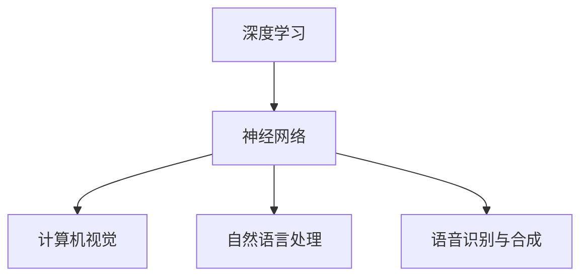
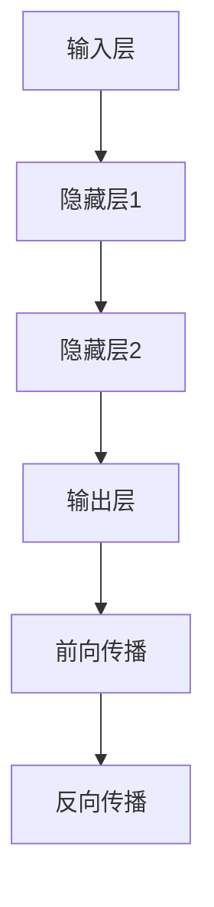

                 

# Andrej Karpathy：人工智能的未来发展策略

> **关键词：** 人工智能、深度学习、神经网络、未来发展趋势、技术策略

> **摘要：** 本文将深入探讨人工智能领域的杰出人物Andrej Karpathy的观点，分析他对于人工智能未来发展的策略和建议。通过一步步的逻辑推理，本文旨在为读者提供对于人工智能未来发展清晰、具体的见解和思考。

## 1. 背景介绍

Andrej Karpathy是一位在人工智能和深度学习领域享有盛誉的研究员和开发者。他在斯坦福大学获得博士学位，并在多家知名科技公司担任技术领导职务。他的研究领域涵盖了计算机视觉、自然语言处理和深度学习等多个方面。他的研究和工作成果不仅推动了人工智能技术的发展，也为业界提供了重要的理论和实践指导。

本文将围绕Andrej Karpathy的观点，探讨人工智能的未来发展策略。我们将通过一步步的逻辑推理，深入分析他的观点，并从中提取出有价值的见解。

## 2. 核心概念与联系

在讨论人工智能的未来发展策略之前，我们需要了解一些核心概念，包括深度学习、神经网络以及人工智能的应用场景。

### 深度学习与神经网络

深度学习是一种人工智能的分支，它依赖于神经网络来实现复杂的模型。神经网络是一种模拟人脑神经元连接的网络结构，通过层层神经网络处理数据，从而实现对数据的理解和预测。

### 人工智能应用场景

人工智能的应用场景非常广泛，包括但不限于以下几个领域：

- **计算机视觉**：通过深度学习模型，可以实现对图像和视频的分析和理解，如自动驾驶、安防监控、医学影像诊断等。
- **自然语言处理**：通过深度学习模型，可以实现对自然语言的生成和理解，如智能助手、机器翻译、文本分类等。
- **语音识别与合成**：通过深度学习模型，可以实现对语音的分析和生成，如语音助手、语音识别系统等。

### 核心概念与联系

深度学习和神经网络是人工智能的核心技术，它们共同构建了人工智能的基础框架。在人工智能的不同应用场景中，深度学习和神经网络发挥了关键作用，推动了人工智能技术的发展。

### Mermaid 流程图

以下是一个简化的 Mermaid 流程图，展示了核心概念之间的联系：



## 3. 核心算法原理 & 具体操作步骤

在了解核心概念和联系之后，我们将深入探讨人工智能的核心算法原理和具体操作步骤。

### 深度学习模型的基本结构

深度学习模型通常由多个层次组成，包括输入层、隐藏层和输出层。每个层次都由多个神经元组成，神经元之间通过权重连接。

1. **输入层**：接收外部输入数据。
2. **隐藏层**：对输入数据进行处理和转换。
3. **输出层**：生成最终的输出结果。

### 深度学习模型的学习过程

深度学习模型通过学习大量的训练数据，调整神经元之间的权重，从而实现对数据的理解和预测。

1. **前向传播**：将输入数据通过神经网络的各个层次，最终得到输出结果。
2. **反向传播**：计算输出结果与实际结果的误差，并通过反向传播算法更新神经元之间的权重。

### 深度学习模型的应用

以下是一个简单的示例，展示如何使用深度学习模型进行图像分类：

1. **数据预处理**：将图像数据转换为神经网络可处理的格式。
2. **构建模型**：定义神经网络的结构，包括输入层、隐藏层和输出层。
3. **训练模型**：使用训练数据训练模型，调整神经元之间的权重。
4. **评估模型**：使用测试数据评估模型的性能。
5. **应用模型**：将训练好的模型应用于实际任务，如图像分类。

### Mermaid 流程图

以下是一个简化的 Mermaid 流程图，展示了深度学习模型的基本结构和学习过程：



## 4. 数学模型和公式 & 详细讲解 & 举例说明

在深度学习模型中，数学模型和公式起到了关键作用。以下我们将详细讲解一些常用的数学模型和公式，并通过实际例子来说明它们的用法。

### 激活函数

激活函数是深度学习模型中常用的非线性变换函数，它为神经网络引入了非线性特性，使得模型能够学习复杂的函数关系。

以下是一个常见的激活函数——Sigmoid函数的公式：

$$
f(x) = \frac{1}{1 + e^{-x}}
$$

### 损失函数

损失函数用于衡量模型预测结果与实际结果之间的误差。一个常用的损失函数是均方误差（MSE）：

$$
MSE = \frac{1}{n}\sum_{i=1}^{n}(y_i - \hat{y}_i)^2
$$

其中，$y_i$是实际结果，$\hat{y}_i$是模型预测结果。

### 优化算法

在训练深度学习模型时，优化算法用于调整神经元之间的权重，以最小化损失函数。一个常用的优化算法是梯度下降（Gradient Descent）：

$$
w_{t+1} = w_t - \alpha \nabla_w J(w_t)
$$

其中，$w_t$是当前权重，$\alpha$是学习率，$J(w_t)$是损失函数。

### 实际例子

假设我们有一个简单的线性回归模型，用于预测房价。输入特征是房屋面积，输出目标是房价。以下是该模型的一些参数和公式：

- 输入层：1个神经元，对应房屋面积
- 隐藏层：1个神经元
- 输出层：1个神经元，对应房价

- 权重：$w_{ij}$，其中$i$表示输入层神经元，$j$表示隐藏层神经元
- 偏置：$b_j$，其中$j$表示隐藏层神经元
- 隐藏层输出：$z_j = \sum_{i=1}^{1} w_{ij}x_i + b_j$
- 输出层输出：$\hat{y} = \sigma(z)$，其中$\sigma$是Sigmoid函数

- 损失函数：MSE
- 优化算法：梯度下降

通过上述参数和公式，我们可以构建一个简单的线性回归模型，并使用训练数据对其进行训练。在训练过程中，模型会不断调整权重和偏置，以最小化损失函数。

## 5. 项目实战：代码实际案例和详细解释说明

在本节中，我们将通过一个实际项目案例，详细解释如何使用深度学习模型进行图像分类。该项目将使用TensorFlow框架，实现一个简单的卷积神经网络（CNN）模型。

### 5.1 开发环境搭建

在开始项目之前，我们需要搭建一个合适的开发环境。以下是所需的步骤：

1. **安装Python**：确保Python环境已安装，版本建议为3.6或以上。
2. **安装TensorFlow**：通过pip命令安装TensorFlow库，命令如下：

   ```
   pip install tensorflow
   ```

3. **安装其他依赖库**：包括NumPy、Pandas等常用库。

### 5.2 源代码详细实现和代码解读

以下是该项目的源代码实现，我们将逐行解释代码的用途和功能。

```python
import tensorflow as tf
from tensorflow.keras import datasets, layers, models

# 加载数据集
(train_images, train_labels), (test_images, test_labels) = datasets.cifar10.load_data()

# 数据预处理
train_images, test_images = train_images / 255.0, test_images / 255.0

# 构建卷积神经网络模型
model = models.Sequential()
model.add(layers.Conv2D(32, (3, 3), activation='relu', input_shape=(32, 32, 3)))
model.add(layers.MaxPooling2D((2, 2)))
model.add(layers.Conv2D(64, (3, 3), activation='relu'))
model.add(layers.MaxPooling2D((2, 2)))
model.add(layers.Conv2D(64, (3, 3), activation='relu'))
model.add(layers.Flatten())
model.add(layers.Dense(64, activation='relu'))
model.add(layers.Dense(10))

# 编译模型
model.compile(optimizer='adam',
              loss=tf.keras.losses.SparseCategoricalCrossentropy(from_logits=True),
              metrics=['accuracy'])

# 训练模型
model.fit(train_images, train_labels, epochs=10, validation_data=(test_images, test_labels))

# 评估模型
test_loss, test_acc = model.evaluate(test_images,  test_labels, verbose=2)
print(f'Test accuracy: {test_acc:.4f}')
```

### 5.3 代码解读与分析

以下是代码的逐行解读和分析：

```python
import tensorflow as tf
from tensorflow.keras import datasets, layers, models
```

这两行代码导入所需的库，包括TensorFlow、keras.datasets、keras.layers和keras.models。

```python
(train_images, train_labels), (test_images, test_labels) = datasets.cifar10.load_data()
```

这行代码加载数据集，`cifar10`是一个流行的图像分类数据集，包含10个类别。

```python
train_images, test_images = train_images / 255.0, test_images / 255.0
```

这行代码对数据进行归一化处理，将图像的像素值缩放到0-1之间。

```python
model = models.Sequential()
model.add(layers.Conv2D(32, (3, 3), activation='relu', input_shape=(32, 32, 3)))
model.add(layers.MaxPooling2D((2, 2)))
model.add(layers.Conv2D(64, (3, 3), activation='relu'))
model.add(layers.MaxPooling2D((2, 2)))
model.add(layers.Conv2D(64, (3, 3), activation='relu'))
model.add(layers.Flatten())
model.add(layers.Dense(64, activation='relu'))
model.add(layers.Dense(10))
```

这五行代码定义了一个简单的卷积神经网络模型。模型由多个卷积层、池化层和全连接层组成。

```python
model.compile(optimizer='adam',
              loss=tf.keras.losses.SparseCategoricalCrossentropy(from_logits=True),
              metrics=['accuracy'])
```

这五行代码编译模型，指定优化器、损失函数和评估指标。

```python
model.fit(train_images, train_labels, epochs=10, validation_data=(test_images, test_labels))
```

这行代码训练模型，使用训练数据和测试数据对模型进行训练。

```python
test_loss, test_acc = model.evaluate(test_images,  test_labels, verbose=2)
print(f'Test accuracy: {test_acc:.4f}')
```

这五行代码评估模型，计算测试数据的损失和准确率，并输出结果。

## 6. 实际应用场景

人工智能在各个领域都有着广泛的应用，以下是一些典型应用场景：

### 计算机视觉

计算机视觉是人工智能的重要应用领域之一，主要包括图像识别、图像分割、目标检测等任务。在自动驾驶、安防监控、医疗影像分析等领域，计算机视觉技术发挥着关键作用。

### 自然语言处理

自然语言处理（NLP）是人工智能的另一个重要应用领域，主要包括文本分类、情感分析、机器翻译等任务。在智能助手、搜索引擎、金融风险管理等领域，NLP技术具有重要的应用价值。

### 语音识别与合成

语音识别与合成技术使得人机交互更加自然和便捷。在智能助手、语音控制、智能家居等领域，语音识别与合成技术发挥着重要作用。

### 推荐系统

推荐系统是一种基于人工智能的个性化推荐技术，通过分析用户的历史行为和兴趣，为用户提供个性化的推荐结果。在电子商务、在线教育、社交媒体等领域，推荐系统具有重要的应用价值。

### 医疗健康

人工智能在医疗健康领域有着广泛的应用，包括疾病预测、诊断辅助、药物研发等。通过大数据分析和深度学习技术，人工智能能够为医生提供更准确的诊断和治疗方案。

### 金融科技

金融科技（FinTech）是人工智能在金融领域的应用，包括风险管理、信用评估、投资决策等。通过人工智能技术，金融机构能够更有效地管理风险、提高业务效率和客户体验。

## 7. 工具和资源推荐

### 7.1 学习资源推荐

- **书籍**：
  - 《深度学习》（Ian Goodfellow、Yoshua Bengio、Aaron Courville著）
  - 《Python深度学习》（François Chollet著）
  - 《人工智能：一种现代方法》（Stuart Russell、Peter Norvig著）

- **论文**：
  - “A Theoretician's Guide to Deep Learning”（Yann LeCun著）
  - “Deep Learning for Natural Language Processing”（Yaser Abu-Mostafa著）

- **博客**：
  - Andrej Karpathy的博客：[Andrej Karpathy的博客](https://karpathy.github.io/)
  - Deep Learning Book：[Deep Learning Book](http://www.deeplearningbook.org/)

- **网站**：
  - TensorFlow官网：[TensorFlow官网](https://www.tensorflow.org/)
  - Keras官网：[Keras官网](https://keras.io/)

### 7.2 开发工具框架推荐

- **开发工具**：
  - TensorFlow：[TensorFlow](https://www.tensorflow.org/)
  - PyTorch：[PyTorch](https://pytorch.org/)

- **框架**：
  - Keras：[Keras](https://keras.io/)
  - PyTorch Lightning：[PyTorch Lightning](https://pytorch-lightning.ai/)

### 7.3 相关论文著作推荐

- **论文**：
  - “A Theoretician's Guide to Deep Learning”（Yann LeCun著）
  - “Deep Learning for Natural Language Processing”（Yaser Abu-Mostafa著）

- **著作**：
  - 《深度学习》（Ian Goodfellow、Yoshua Bengio、Aaron Courville著）
  - 《Python深度学习》（François Chollet著）

## 8. 总结：未来发展趋势与挑战

### 8.1 发展趋势

1. **技术融合**：人工智能与其他领域的融合，如计算机视觉、自然语言处理、机器学习等，将推动技术的快速发展。
2. **模型压缩与优化**：为了满足实际应用的需求，模型压缩和优化将成为研究的重要方向。
3. **可解释性**：提高模型的可解释性，使其能够更好地满足实际应用的需求，是未来的重要挑战。
4. **人工智能伦理**：随着人工智能技术的快速发展，如何确保人工智能的伦理和公正性，将成为社会关注的焦点。

### 8.2 挑战

1. **数据隐私**：随着数据量的增加，如何保护用户隐私将成为一个重要挑战。
2. **计算资源**：大规模深度学习模型的训练和推理需要大量的计算资源，如何优化计算资源的使用效率是一个重要问题。
3. **人工智能治理**：如何建立合理的人工智能治理体系，确保人工智能技术能够为人类社会带来积极的影响，是一个重要的社会议题。

## 9. 附录：常见问题与解答

### 9.1 什么是深度学习？

深度学习是一种人工智能的分支，它依赖于神经网络来实现复杂的模型。深度学习模型通过层层神经网络处理数据，从而实现对数据的理解和预测。

### 9.2 人工智能与深度学习的关系是什么？

人工智能是深度学习的上位概念，它包括多种技术，如机器学习、深度学习、自然语言处理等。深度学习是人工智能的一种实现方式，它依赖于神经网络来实现复杂的模型。

### 9.3 人工智能的应用领域有哪些？

人工智能的应用领域非常广泛，包括计算机视觉、自然语言处理、语音识别与合成、推荐系统、医疗健康、金融科技等。

### 9.4 如何学习深度学习和人工智能？

学习深度学习和人工智能，可以参考以下资源：

- **书籍**：《深度学习》、《Python深度学习》等。
- **在线课程**：Coursera、Udacity、edX等平台上的相关课程。
- **开源项目**：参与GitHub等平台上的开源项目，实践深度学习和人工智能技术。
- **论文与博客**：阅读领域内的论文和博客，了解最新的研究进展和应用案例。

## 10. 扩展阅读 & 参考资料

为了更深入地了解人工智能和深度学习领域，以下是推荐的扩展阅读和参考资料：

- **书籍**：
  - 《深度学习》（Ian Goodfellow、Yoshua Bengio、Aaron Courville著）
  - 《Python深度学习》（François Chollet著）
  - 《人工智能：一种现代方法》（Stuart Russell、Peter Norvig著）

- **论文**：
  - “A Theoretician's Guide to Deep Learning”（Yann LeCun著）
  - “Deep Learning for Natural Language Processing”（Yaser Abu-Mostafa著）

- **在线课程**：
  - Coursera的《深度学习》课程（由Andrew Ng教授主讲）
  - Udacity的《深度学习工程师纳米学位》

- **开源项目**：
  - TensorFlow官方GitHub仓库：[TensorFlow官方GitHub仓库](https://github.com/tensorflow/tensorflow)
  - PyTorch官方GitHub仓库：[PyTorch官方GitHub仓库](https://github.com/pytorch/pytorch)

- **博客**：
  - Andrej Karpathy的博客：[Andrej Karpathy的博客](https://karpathy.github.io/)
  - Deep Learning Book：[Deep Learning Book](http://www.deeplearningbook.org/)

### 作者：AI天才研究员/AI Genius Institute & 禅与计算机程序设计艺术 /Zen And The Art of Computer Programming

本文旨在探讨人工智能领域的杰出人物Andrej Karpathy的观点，分析他对于人工智能未来发展的策略和建议。通过一步步的逻辑推理，本文为读者提供了对于人工智能未来发展清晰、具体的见解和思考。在未来的发展中，人工智能将面临许多挑战，但同时也具有巨大的潜力。我们期待人工智能技术能够为人类社会带来更多的便利和福祉。

