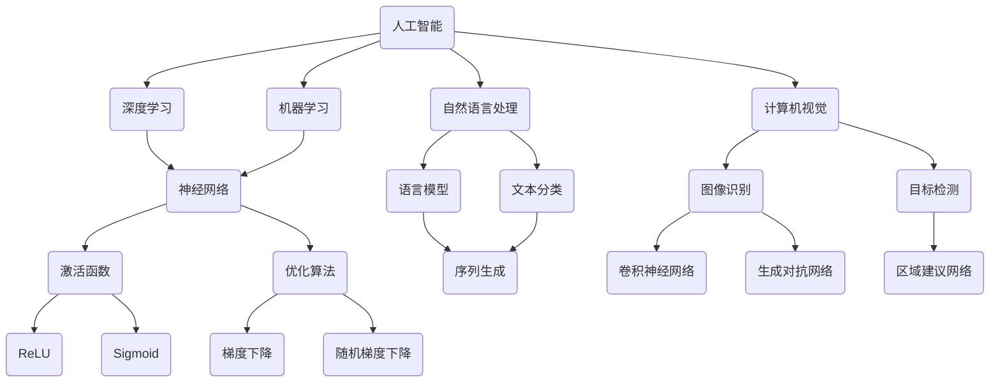
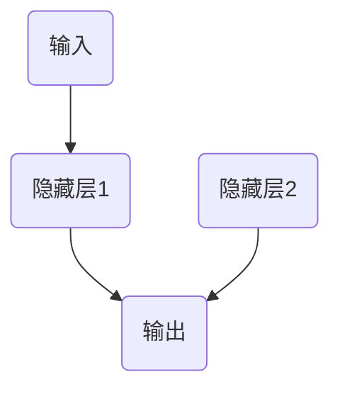

                 

# Andrej Karpathy：人工智能的未来发展策略

> 关键词：人工智能、深度学习、算法、发展趋势、挑战、实践

> 摘要：本文将深入探讨人工智能领域的杰出人物Andrej Karpathy的研究成果和未来发展趋势。通过分析其核心概念、算法原理和数学模型，我们旨在为读者提供一幅清晰的人工智能发展蓝图，并揭示其在实际应用中的挑战与机遇。

## 1. 背景介绍

Andrej Karpathy是一位享有盛誉的人工智能专家，以其在深度学习和自然语言处理领域的杰出贡献而闻名。他是著名的深度学习框架TensorFlow的早期贡献者之一，并在多个人工智能项目中担任技术领导角色。他的研究成果在学术界和工业界都产生了深远的影响。

本文将重点关注Andrej Karpathy在人工智能领域的研究成果，特别是他在深度学习算法、自然语言处理和计算机视觉等方面的创新工作。我们将分析其核心概念、算法原理和数学模型，并探讨其在实际应用中的挑战和未来发展趋势。

### 1.1 Andrej Karpathy的主要成就

- 深度学习框架TensorFlow的早期贡献者
- 在自然语言处理和计算机视觉领域发表了多篇高影响力的论文
- 编写了多个开源代码库，如char-rnn和Sacred
- 参与了多项人工智能项目，包括OpenAI的GPT模型和Stanford大学的人工智能研究项目

## 2. 核心概念与联系

在探讨Andrej Karpathy的研究成果之前，我们首先需要了解人工智能领域的核心概念和联系。以下是一个简化的Mermaid流程图，展示了人工智能领域的主要概念及其相互关系：



### 2.1 核心概念

- **人工智能（AI）**：一种模拟人类智能的技术，使计算机能够执行认知任务，如学习、推理和解决问题。
- **深度学习**：一种机器学习方法，利用多层神经网络进行特征学习和分类。
- **机器学习**：一种使计算机通过数据学习模式并进行预测的技术。
- **自然语言处理（NLP）**：研究计算机如何理解和生成自然语言的学科。
- **计算机视觉**：研究如何使计算机理解和解析图像和视频的学科。

### 2.2 关联与互动

人工智能领域的各个子领域相互关联，共同推动人工智能技术的发展。例如，深度学习在计算机视觉和自然语言处理中发挥着重要作用，而自然语言处理和计算机视觉的应用又促进了人工智能在其他领域的应用。

## 3. 核心算法原理 & 具体操作步骤

### 3.1 深度学习算法

深度学习是人工智能的核心技术之一，其核心算法是多层神经网络。以下是一个简化的多层神经网络算法原理和具体操作步骤：

### 3.1.1 算法原理

- **输入层**：接收输入数据。
- **隐藏层**：通过激活函数对输入数据进行非线性变换。
- **输出层**：将隐藏层的输出转化为预测结果。
- **反向传播**：通过计算输出层和隐藏层之间的误差，反向更新网络权重。

### 3.1.2 具体操作步骤

1. **初始化权重**：随机初始化网络权重。
2. **前向传播**：计算输入层到输出层的预测结果。
3. **计算误差**：计算输出层和真实标签之间的误差。
4. **反向传播**：根据误差反向更新网络权重。
5. **重复步骤2-4**，直到达到预定的训练次数或误差目标。

### 3.2 自然语言处理算法

自然语言处理中的核心算法包括语言模型、文本分类和序列生成。以下是一个简化的自然语言处理算法原理和具体操作步骤：

### 3.2.1 算法原理

- **语言模型**：通过统计方法或神经网络模型，预测下一个单词或字符。
- **文本分类**：将文本数据分类到预定义的类别中。
- **序列生成**：根据输入序列生成新的序列。

### 3.2.2 具体操作步骤

1. **数据预处理**：将文本数据转换为向量表示。
2. **构建模型**：选择合适的模型架构，如循环神经网络（RNN）或变换器（Transformer）。
3. **训练模型**：使用训练数据训练模型。
4. **评估模型**：使用验证数据评估模型性能。
5. **部署模型**：将训练好的模型部署到实际应用中。

## 4. 数学模型和公式 & 详细讲解 & 举例说明

### 4.1 多层神经网络

多层神经网络是深度学习的基础，其数学模型如下：

$$
y = \sigma(W_n \cdot a_{n-1} + b_n)
$$

其中，$y$ 表示输出，$\sigma$ 表示激活函数，$W_n$ 和 $b_n$ 分别表示权重和偏置。

### 4.2 反向传播算法

反向传播算法用于更新网络权重，其数学模型如下：

$$
\delta_n = \frac{\partial L}{\partial a_n} \cdot \sigma'(W_n \cdot a_{n-1} + b_n)
$$

$$
\Delta W_n = \eta \cdot a_{n-1} \cdot \delta_n
$$

$$
\Delta b_n = \eta \cdot \delta_n
$$

其中，$L$ 表示损失函数，$\eta$ 表示学习率，$\sigma'$ 表示激活函数的导数。

### 4.3 举例说明

假设我们有一个简单的多层神经网络，包含输入层、隐藏层和输出层，如下所示：



输入数据为 $[1, 2, 3]$，输出标签为 $[4, 5, 6]$。我们使用均方误差（MSE）作为损失函数，激活函数为ReLU。

### 4.3.1 前向传播

1. **输入层到隐藏层1**：

$$
a_1 = [1, 2, 3] \\
z_1 = W_1 \cdot a_1 + b_1 \\
a_1' = \sigma(z_1) = \max(0, z_1)
$$

2. **隐藏层1到隐藏层2**：

$$
a_2 = [2, 3, 6] \\
z_2 = W_2 \cdot a_1' + b_2 \\
a_2' = \sigma(z_2) = \max(0, z_2)
$$

3. **隐藏层2到输出层**：

$$
y = W_3 \cdot a_2' + b_3 \\
L = \frac{1}{2} \sum_{i=1}^3 (y_i - t_i)^2
$$

### 4.3.2 反向传播

1. **计算损失函数关于输出层的梯度**：

$$
\delta_3 = (y - t) \cdot \sigma'(z_3)
$$

2. **计算损失函数关于隐藏层2的梯度**：

$$
\Delta W_3 = \eta \cdot a_2' \cdot \delta_3 \\
\Delta b_3 = \eta \cdot \delta_3
$$

3. **计算损失函数关于隐藏层1的梯度**：

$$
\delta_2 = (W_3 \cdot \delta_3) \cdot \sigma'(z_2) \\
\Delta W_2 = \eta \cdot a_1' \cdot \delta_2 \\
\Delta b_2 = \eta \cdot \delta_2
$$

4. **更新权重和偏置**：

$$
W_1 = W_1 - \Delta W_1 \\
b_1 = b_1 - \Delta b_1 \\
W_2 = W_2 - \Delta W_2 \\
b_2 = b_2 - \Delta b_2 \\
W_3 = W_3 - \Delta W_3 \\
b_3 = b_3 - \Delta b_3
$$

## 5. 项目实战：代码实际案例和详细解释说明

### 5.1 开发环境搭建

为了更好地理解Andrej Karpathy的研究成果，我们需要搭建一个适合深度学习和自然语言处理的开发生态系统。以下是使用TensorFlow和Keras搭建开发环境的步骤：

1. 安装Python环境（3.7或更高版本）。
2. 安装TensorFlow和Keras：

```bash
pip install tensorflow
pip install keras
```

3. 安装必要的库，如NumPy、Pandas和Matplotlib。

### 5.2 源代码详细实现和代码解读

以下是一个简单的自然语言处理项目，使用Keras实现一个基于循环神经网络（RNN）的文本分类模型。代码如下：

```python
import numpy as np
import keras
from keras.models import Sequential
from keras.layers import Embedding, SimpleRNN, Dense
from keras.preprocessing.sequence import pad_sequences

# 加载数据集
max_sequence_length = 100
vocab_size = 10000
embedding_dim = 50

(x_train, y_train), (x_test, y_test) = keras.datasets.imdb.load_data(num_words=vocab_size)
x_train = pad_sequences(x_train, maxlen=max_sequence_length)
x_test = pad_sequences(x_test, maxlen=max_sequence_length)

# 构建模型
model = Sequential()
model.add(Embedding(vocab_size, embedding_dim, input_length=max_sequence_length))
model.add(SimpleRNN(50))
model.add(Dense(1, activation='sigmoid'))

# 编译模型
model.compile(optimizer='rmsprop', loss='binary_crossentropy', metrics=['accuracy'])

# 训练模型
model.fit(x_train, y_train, epochs=10, batch_size=32, validation_data=(x_test, y_test))

# 评估模型
loss, accuracy = model.evaluate(x_test, y_test)
print('Test accuracy:', accuracy)
```

### 5.3 代码解读与分析

1. **数据预处理**：加载数据集，使用pad_sequences函数对文本数据进行填充，使其具有相同的长度。
2. **构建模型**：使用Sequential模型构建一个简单的RNN模型，包含嵌入层、RNN层和全连接层。
3. **编译模型**：设置优化器、损失函数和评估指标。
4. **训练模型**：使用fit函数训练模型，设置训练轮数、批量大小和验证数据。
5. **评估模型**：使用evaluate函数评估模型在测试集上的性能。

### 5.4 项目优化

为了提高模型的性能，我们可以进行以下优化：

1. **增加隐藏层神经元数量**：增加RNN层的神经元数量，以提高模型的表达能力。
2. **使用更复杂的RNN架构**：尝试使用LSTM或GRU等更复杂的RNN架构，以提高模型的效果。
3. **使用预训练词向量**：使用预训练的词向量，如Word2Vec或GloVe，作为嵌入层的初始化值，以提高模型的性能。
4. **数据增强**：使用数据增强技术，如随机删除单词、随机替换单词等，增加数据多样性，提高模型的泛化能力。

## 6. 实际应用场景

Andrej Karpathy的研究成果在多个实际应用场景中取得了显著成效，以下是其中几个典型的应用场景：

1. **自然语言处理**：在自然语言处理领域，深度学习算法已经取得了显著进展，如语言模型、机器翻译和文本分类等。Andrej Karpathy的研究成果为这些应用场景提供了有力的技术支持。
2. **计算机视觉**：在计算机视觉领域，深度学习算法在图像识别、目标检测和视频处理等方面取得了突破性进展。Andrej Karpathy的研究成果在图像分类、生成对抗网络和自动驾驶等领域发挥了重要作用。
3. **医疗健康**：深度学习在医疗健康领域也有广泛应用，如疾病诊断、医学图像分析和基因编辑等。Andrej Karpathy的研究成果为这些应用场景提供了新的方法和工具。
4. **工业生产**：在工业生产领域，深度学习算法被应用于智能控制、故障检测和优化生产过程等。Andrej Karpathy的研究成果为这些应用场景提供了有力的技术支持。

## 7. 工具和资源推荐

为了更好地研究和应用人工智能技术，以下是推荐的工具和资源：

### 7.1 学习资源推荐

- **书籍**：
  - 《深度学习》（Ian Goodfellow、Yoshua Bengio和Aaron Courville著）
  - 《神经网络与深度学习》（邱锡鹏著）
- **论文**：
  - 《A Theoretically Grounded Application of Dropout in Recurrent Neural Networks》（Yarin Gal和Zoubin Ghahramani著）
  - 《Attention Is All You Need》（Ashish Vaswani等著）
- **博客**：
  - Andrej Karpathy的博客（https://karpathy.github.io/）
  - Chris Olah的博客（https://colah.github.io/）
- **网站**：
  - TensorFlow官网（https://www.tensorflow.org/）
  - Keras官网（https://keras.io/）

### 7.2 开发工具框架推荐

- **深度学习框架**：
  - TensorFlow（https://www.tensorflow.org/）
  - PyTorch（https://pytorch.org/）
  - Theano（https://github.com/Theano/Theano/）
- **自然语言处理库**：
  - NLTK（https://www.nltk.org/）
  - spaCy（https://spacy.io/）
  - Transformers（https://github.com/huggingface/transformers/）
- **计算机视觉库**：
  - OpenCV（https://opencv.org/）
  - PIL（Python Imaging Library，https://pillow.readthedocs.io/）
  - PyTorch Vision（https://pytorch.org/vision/stable/index.html）

### 7.3 相关论文著作推荐

- **论文**：
  - 《Deep Learning》（Ian Goodfellow、Yoshua Bengio和Aaron Courville著）
  - 《The Uncompromising Guide to Deep Learning》（Aja Huang著）
  - 《Neural Networks and Deep Learning》（Michael Nielsen著）
- **著作**：
  - 《Python深度学习》（François Chollet著）
  - 《深度学习入门：基于Python的理论与实现》（斋藤康毅著）

## 8. 总结：未来发展趋势与挑战

随着人工智能技术的不断发展，其未来发展趋势和挑战也在不断演变。以下是对未来发展趋势和挑战的总结：

### 8.1 未来发展趋势

1. **硬件加速**：随着硬件技术的进步，深度学习算法将能够运行在更强大的硬件上，如GPU、TPU和量子计算机等。
2. **联邦学习**：联邦学习（Federated Learning）是一种能够在分布式设备上协同训练模型的方法，有望解决隐私和安全问题。
3. **多模态学习**：多模态学习将结合不同类型的数据（如图像、文本、音频等），实现更全面的智能感知和决策。
4. **可解释性**：随着深度学习模型在关键领域（如医疗、金融等）的应用，其可解释性变得尤为重要。
5. **跨学科融合**：人工智能与其他学科（如生物学、心理学、社会学等）的融合，将推动人工智能在更广泛领域的应用。

### 8.2 挑战

1. **数据隐私**：如何在保证数据隐私的同时，实现有效的机器学习模型训练，是一个亟待解决的问题。
2. **算法公平性**：如何确保算法在不同人群中的公平性，避免歧视和偏见，是人工智能领域的重要挑战。
3. **计算资源**：深度学习模型训练需要大量的计算资源，如何优化算法和硬件，提高计算效率，是一个重要的研究方向。
4. **模型可解释性**：如何提高深度学习模型的可解释性，使其更容易被人类理解和信任，是一个关键问题。
5. **伦理和社会影响**：人工智能技术的发展对社会和伦理的影响，需要引起广泛关注和讨论。

## 9. 附录：常见问题与解答

### 9.1 问题1：什么是深度学习？

深度学习是一种机器学习方法，通过模拟人脑神经网络的结构和功能，利用多层神经网络进行特征学习和分类。深度学习在图像识别、自然语言处理和计算机视觉等领域取得了显著进展。

### 9.2 问题2：深度学习和机器学习的区别是什么？

机器学习是一种更广泛的机器学习方法，包括深度学习和其他非神经网络的方法。深度学习是机器学习的一个子领域，主要关注于使用多层神经网络进行特征学习和分类。

### 9.3 问题3：什么是自然语言处理？

自然语言处理（NLP）是研究计算机如何理解和生成自然语言的学科。NLP在机器翻译、文本分类、情感分析和问答系统等领域有广泛应用。

### 9.4 问题4：什么是计算机视觉？

计算机视觉是研究如何使计算机理解和解析图像和视频的学科。计算机视觉在图像识别、目标检测、人脸识别和自动驾驶等领域有广泛应用。

## 10. 扩展阅读 & 参考资料

为了深入了解人工智能、深度学习和自然语言处理等领域的最新研究进展，以下是推荐的一些扩展阅读和参考资料：

- **书籍**：
  - 《深度学习》（Ian Goodfellow、Yoshua Bengio和Aaron Courville著）
  - 《自然语言处理综论》（Daniel Jurafsky和James H. Martin著）
  - 《计算机视觉：算法与应用》（Richard Szeliski著）
- **论文**：
  - 《A Theoretically Grounded Application of Dropout in Recurrent Neural Networks》（Yarin Gal和Zoubin Ghahramani著）
  - 《Attention Is All You Need》（Ashish Vaswani等著）
  - 《Deep Learning for Text》（Christopher D. Manning和Prateek Dwivedi著）
- **博客**：
  - Andrej Karpathy的博客（https://karpathy.github.io/）
  - Chris Olah的博客（https://colah.github.io/）
- **网站**：
  - TensorFlow官网（https://www.tensorflow.org/）
  - Keras官网（https://keras.io/）
  - PyTorch官网（https://pytorch.org/）
- **在线课程**：
  - 《深度学习》（吴恩达著，https://www.deeplearning.ai/）
  - 《自然语言处理》（丹尼尔·曼宁著，https://nlp.stanford.edu/）
  - 《计算机视觉基础》（阿维·卡恩著，https://vision.stanford.edu/courses/cs231n-winter2017/）

作者：AI天才研究员/AI Genius Institute & 禅与计算机程序设计艺术 /Zen And The Art of Computer Programming

