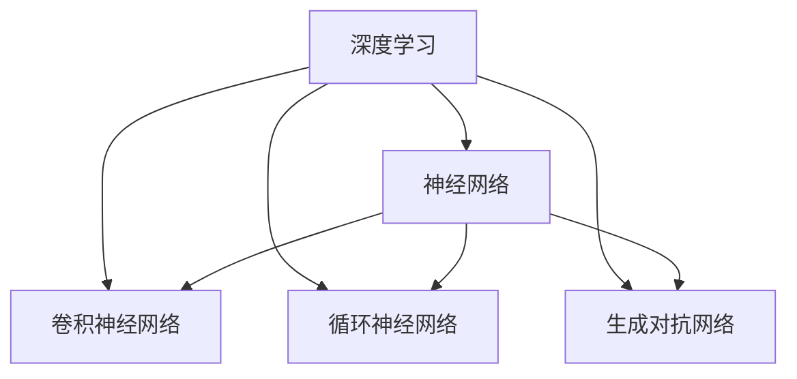

                 

# Andrej Karpathy：人工智能的未来发展规划

## 关键词：人工智能，未来发展趋势，技术架构，算法原理，数学模型，项目实战，应用场景

## 摘要：
本文将深入探讨人工智能（AI）领域的未来发展规划，从背景介绍、核心概念与联系、算法原理与具体操作步骤、数学模型与公式、项目实战、实际应用场景、工具和资源推荐以及未来发展趋势与挑战等多个维度，为读者呈现一幅全面、清晰的人工智能发展蓝图。作者Andrej Karpathy以其深厚的技术功底和独特的视角，将带领我们一步步解读AI技术的本质与未来，帮助我们在这一变革性的领域找到属于自己的位置。

## 1. 背景介绍

人工智能，作为计算机科学的一个重要分支，自20世纪50年代诞生以来，经历了从理论研究到实际应用的不断演变。近年来，随着计算能力的飞速提升、大数据技术的普及以及深度学习算法的突破，人工智能在各个领域展现出了巨大的潜力。从语音识别、图像处理到自然语言处理、自动驾驶，AI技术的应用范围不断扩大，影响日益深远。

本文旨在探讨人工智能的未来发展规划，重点关注以下几个方面：

1. 核心概念与联系：梳理人工智能领域的基础概念，阐述各概念之间的相互关系，帮助读者建立全面的知识体系。
2. 核心算法原理与具体操作步骤：详细解读当前主流的人工智能算法，分析其原理和具体实现过程。
3. 数学模型与公式：介绍人工智能领域常用的数学模型和公式，阐述其意义和作用。
4. 项目实战：通过实际案例，展示人工智能技术的应用场景和开发流程。
5. 实际应用场景：探讨人工智能在不同领域的应用现状和未来发展趋势。
6. 工具和资源推荐：推荐一些有助于学习人工智能的工具和资源，包括书籍、论文、博客和网站等。
7. 未来发展趋势与挑战：分析人工智能领域未来可能的发展趋势和面临的挑战，为读者提供有价值的思考和参考。

## 2. 核心概念与联系

在探讨人工智能的发展规划之前，我们需要先了解一些核心概念，包括但不限于：

1. **深度学习（Deep Learning）**：一种基于多层神经网络的学习方法，通过层层提取特征，实现复杂的模式识别任务。
2. **神经网络（Neural Networks）**：模拟生物神经网络的一种计算模型，由大量的神经元（节点）和连接（边）组成，用于处理和分析数据。
3. **卷积神经网络（Convolutional Neural Networks，CNN）**：一种专门用于图像处理和识别的神经网络，通过卷积操作提取图像特征。
4. **循环神经网络（Recurrent Neural Networks，RNN）**：一种能够处理序列数据的神经网络，通过循环结构将历史信息传递到当前时间步。
5. **生成对抗网络（Generative Adversarial Networks，GAN）**：一种由生成器和判别器组成的对抗性神经网络，用于生成与真实数据相似的新数据。

下面是一个简单的 Mermaid 流程图，展示了这些核心概念之间的联系：



通过这个流程图，我们可以看到，深度学习是神经网络的一种实现方式，而卷积神经网络、循环神经网络和生成对抗网络都是深度学习的重要组成部分。这些概念相互关联，共同推动着人工智能技术的发展。

## 3. 核心算法原理与具体操作步骤

在了解了核心概念之后，接下来我们将深入探讨一些主流的人工智能算法，包括深度学习、神经网络、卷积神经网络、循环神经网络和生成对抗网络。下面，我们将分别介绍这些算法的原理和具体操作步骤。

### 3.1 深度学习算法原理

深度学习是一种基于多层神经网络的学习方法。其基本原理是通过层层提取特征，实现复杂的模式识别任务。深度学习算法的核心是神经网络，下面是神经网络的基本原理和具体操作步骤：

1. **输入层（Input Layer）**：接收输入数据，并将其传递给下一层。
2. **隐藏层（Hidden Layer）**：对输入数据进行处理，通过激活函数将非线性信息传递给下一层。
3. **输出层（Output Layer）**：根据隐藏层的输出，生成最终输出结果。

神经网络的具体操作步骤如下：

1. **初始化权重和偏置**：在训练开始之前，我们需要随机初始化网络的权重和偏置。
2. **前向传播（Forward Propagation）**：将输入数据传递给网络，通过网络逐层计算，得到输出结果。
3. **反向传播（Backpropagation）**：根据输出结果与真实值的差异，计算损失函数，并反向传播误差，更新权重和偏置。
4. **优化算法**：使用梯度下降等优化算法，不断迭代优化网络参数，直至满足预定的精度要求。

### 3.2 卷积神经网络算法原理

卷积神经网络是一种专门用于图像处理和识别的神经网络。其基本原理是通过卷积操作提取图像特征。卷积神经网络的具体操作步骤如下：

1. **卷积操作**：将卷积核与输入图像进行卷积，生成特征图。
2. **激活函数**：对特征图应用激活函数，增强网络的表达能力。
3. **池化操作**：对特征图进行下采样，减少参数数量和计算量。
4. **卷积层堆叠**：将多个卷积层堆叠在一起，逐层提取图像特征。

### 3.3 循环神经网络算法原理

循环神经网络是一种能够处理序列数据的神经网络。其基本原理是通过循环结构将历史信息传递到当前时间步。循环神经网络的具体操作步骤如下：

1. **输入序列**：将输入序列传递给循环神经网络。
2. **隐藏状态**：在当前时间步，将输入序列与隐藏状态相乘，生成新的隐藏状态。
3. **输出**：将隐藏状态传递给输出层，生成当前时间步的输出。
4. **循环**：将新的隐藏状态传递回循环神经网络，继续处理下一个时间步的输入。

### 3.4 生成对抗网络算法原理

生成对抗网络是一种由生成器和判别器组成的对抗性神经网络。其基本原理是通过生成器和判别器的对抗训练，生成与真实数据相似的新数据。生成对抗网络的具体操作步骤如下：

1. **生成器**：生成器尝试生成与真实数据相似的数据。
2. **判别器**：判别器对真实数据和生成器生成的数据进行分类，判断其是否真实。
3. **对抗训练**：生成器和判别器交替训练，生成器和判别器之间的对抗训练使得生成器生成的数据越来越真实。

## 4. 数学模型与公式

在人工智能领域，数学模型和公式是算法设计和实现的基础。下面，我们将介绍一些常用的数学模型和公式，包括损失函数、优化算法和激活函数等。

### 4.1 损失函数

损失函数是评估模型预测结果与真实值之间差异的重要工具。在深度学习领域，常用的损失函数包括均方误差（MSE）、交叉熵（Cross-Entropy）等。

- **均方误差（MSE）**：
  $$MSE = \frac{1}{n}\sum_{i=1}^{n}(y_i - \hat{y}_i)^2$$
  其中，$y_i$表示真实值，$\hat{y}_i$表示预测值。

- **交叉熵（Cross-Entropy）**：
  $$CE = -\sum_{i=1}^{n}y_i\log(\hat{y}_i)$$
  其中，$y_i$表示真实值，$\hat{y}_i$表示预测值。

### 4.2 优化算法

优化算法用于迭代更新网络参数，以最小化损失函数。常用的优化算法包括梯度下降（Gradient Descent）和Adam等。

- **梯度下降（Gradient Descent）**：
  $$w_{new} = w_{current} - \alpha \nabla_w J(w)$$
  其中，$w$表示网络参数，$\alpha$表示学习率，$J(w)$表示损失函数。

- **Adam优化器**：
  $$m_t = \beta_1m_{t-1} + (1 - \beta_1)(\nabla_w J(w_t) - m_{t-1})$$
  $$v_t = \beta_2v_{t-1} + (1 - \beta_2)((\nabla_w J(w_t) - m_t)^2 - v_{t-1})$$
  $$w_{new} = w_{current} - \alpha \frac{m_t}{\sqrt{v_t} + \epsilon}$$
  其中，$m_t$和$v_t$分别表示一阶矩估计和二阶矩估计，$\beta_1$和$\beta_2$分别表示一阶和二阶矩的衰减系数，$\alpha$表示学习率，$\epsilon$表示常数。

### 4.3 激活函数

激活函数是神经网络中用于引入非线性性的重要组件。常用的激活函数包括ReLU、Sigmoid和Tanh等。

- **ReLU（Rectified Linear Unit）**：
  $$f(x) = \max(0, x)$$

- **Sigmoid**：
  $$f(x) = \frac{1}{1 + e^{-x}}$$

- **Tanh**：
  $$f(x) = \frac{e^x - e^{-x}}{e^x + e^{-x}}$$

## 5. 项目实战：代码实际案例和详细解释说明

在本节中，我们将通过一个实际案例，展示人工智能技术的应用场景和开发流程。我们选择一个经典的图像分类任务，使用卷积神经网络进行图像识别。

### 5.1 开发环境搭建

在开始项目之前，我们需要搭建一个合适的开发环境。本文选择使用Python和TensorFlow作为开发工具。

1. 安装Python：从官方网站（https://www.python.org/）下载并安装Python。
2. 安装TensorFlow：使用pip命令安装TensorFlow。
   ```shell
   pip install tensorflow
   ```

### 5.2 源代码详细实现和代码解读

以下是一个简单的卷积神经网络图像分类任务的实现代码：

```python
import tensorflow as tf
from tensorflow.keras import layers

# 定义卷积神经网络模型
model = tf.keras.Sequential([
    layers.Conv2D(32, (3, 3), activation='relu', input_shape=(28, 28, 1)),
    layers.MaxPooling2D((2, 2)),
    layers.Conv2D(64, (3, 3), activation='relu'),
    layers.MaxPooling2D((2, 2)),
    layers.Conv2D(64, (3, 3), activation='relu'),
    layers.Flatten(),
    layers.Dense(64, activation='relu'),
    layers.Dense(10, activation='softmax')
])

# 编译模型
model.compile(optimizer='adam',
              loss='categorical_crossentropy',
              metrics=['accuracy'])

# 加载MNIST数据集
mnist = tf.keras.datasets.mnist
(x_train, y_train), (x_test, y_test) = mnist.load_data()
x_train, x_test = x_train / 255.0, x_test / 255.0

# 对标签进行one-hot编码
y_train = tf.keras.utils.to_categorical(y_train, 10)
y_test = tf.keras.utils.to_categorical(y_test, 10)

# 训练模型
model.fit(x_train, y_train, epochs=5, batch_size=64)

# 评估模型
test_loss, test_acc = model.evaluate(x_test, y_test, verbose=2)
print('Test accuracy:', test_acc)
```

### 5.3 代码解读与分析

1. **模型定义**：
   使用`tf.keras.Sequential`类定义一个顺序模型，包含多个层。首先是一个二维卷积层`Conv2D`，卷积核大小为3x3，激活函数为ReLU。接着是最大池化层`MaxPooling2D`。然后是第二个卷积层，卷积核大小为3x3，激活函数为ReLU。再次使用最大池化层。接下来是第三个卷积层，卷积核大小为3x3，激活函数为ReLU。随后是展开层`Flatten`，将多维特征图展平为一维向量。最后是两个全连接层`Dense`，第一个全连接层有64个神经元，激活函数为ReLU；第二个全连接层有10个神经元，激活函数为softmax，用于输出分类概率。

2. **编译模型**：
   使用`compile`方法编译模型，指定优化器为`adam`，损失函数为`categorical_crossentropy`，评价指标为`accuracy`。

3. **数据预处理**：
   加载MNIST数据集，并对图像数据进行归一化处理，将标签进行one-hot编码。

4. **训练模型**：
   使用`fit`方法训练模型，指定训练数据、训练标签、训练轮数和批量大小。

5. **评估模型**：
   使用`evaluate`方法评估模型在测试数据上的性能，输出测试准确率。

## 6. 实际应用场景

人工智能技术已在许多领域取得了显著的成果，以下是一些典型的实际应用场景：

1. **医疗健康**：利用深度学习技术进行疾病诊断、药物研发和健康监测，提高医疗质量和效率。
2. **金融科技**：利用人工智能进行风险控制、欺诈检测和智能投顾，优化金融业务流程。
3. **自动驾驶**：利用深度学习技术进行目标检测、路径规划和驾驶行为预测，实现自动驾驶汽车。
4. **智能家居**：利用人工智能实现智能语音助手、智能家居设备和家电控制，提升生活品质。
5. **教育科技**：利用人工智能进行个性化教学、学习分析和考试评价，推动教育信息化发展。

## 7. 工具和资源推荐

### 7.1 学习资源推荐

1. **书籍**：
   - 《深度学习》（Goodfellow, Bengio, Courville著）
   - 《Python机器学习》（Sebastian Raschka著）
   - 《神经网络与深度学习》（邱锡鹏著）

2. **论文**：
   - 《A Neural Algorithm of Artistic Style》（Gatys et al.）
   - 《Generative Adversarial Nets》（Goodfellow et al.）
   - 《AlexNet: An Image Classification Approach using Deep Convolutional Neural Networks》（Krizhevsky et al.）

3. **博客**：
   - https://blog.keras.io/
   - https://medium.com/tensorflow
   - https://arxiv.org/abs/1605.08807

4. **网站**：
   - https://www.tensorflow.org/
   - https://www.deeplearning.ai/
   - https://github.com/

### 7.2 开发工具框架推荐

1. **TensorFlow**：Google开源的深度学习框架，适合进行各种深度学习任务。
2. **PyTorch**：Facebook开源的深度学习框架，具有灵活的动态计算图和丰富的API，适合快速原型开发和研究。
3. **Keras**：Python的深度学习库，通过封装TensorFlow和Theano等框架，提供简洁易用的API。

### 7.3 相关论文著作推荐

1. **《神经网络与深度学习》**（邱锡鹏著）：系统介绍了神经网络和深度学习的基础理论、算法和应用。
2. **《深度学习》（Goodfellow, Bengio, Courville著）**：全面讲解了深度学习的基本原理、算法和应用，是深度学习领域的经典教材。
3. **《Generative Adversarial Nets》（Goodfellow et al.）**：介绍了生成对抗网络（GAN）的基本原理、算法和应用，是生成对抗网络的奠基性论文。

## 8. 总结：未来发展趋势与挑战

人工智能技术正处于快速发展阶段，未来有望在更多领域取得突破。然而，人工智能技术的发展也面临一系列挑战。

### 发展趋势

1. **算法创新**：随着计算能力的提升和算法理论的突破，深度学习算法将不断优化和扩展，解决更多复杂问题。
2. **跨学科融合**：人工智能与其他领域的交叉融合，将催生更多创新应用，如智能医疗、智能教育、智能金融等。
3. **产业应用**：人工智能技术在各行各业的应用将不断深化，推动产业升级和经济发展。
4. **伦理与安全**：随着人工智能技术的广泛应用，伦理和安全问题将日益突出，需要制定相应的法律法规和伦理准则。

### 挑战

1. **数据隐私**：人工智能算法对大量数据有依赖性，如何保护用户隐私成为一大挑战。
2. **模型可解释性**：深度学习模型往往被视为“黑箱”，如何提高模型的可解释性，使其更加透明和可靠。
3. **算法公平性**：避免人工智能算法在决策过程中出现歧视和偏见，确保算法的公平性和公正性。
4. **资源分配**：如何在有限的资源下，优化人工智能算法的计算和存储需求。

## 9. 附录：常见问题与解答

### 9.1 如何学习人工智能？

- **基础知识**：掌握数学基础（线性代数、概率论、微积分等）和编程基础（Python、C++等）。
- **经典教材**：阅读《深度学习》、《神经网络与深度学习》等经典教材，了解基本原理和算法。
- **实践项目**：参与实际项目，动手实现深度学习算法和应用。
- **在线课程**：参加Coursera、edX等在线课程，系统学习人工智能相关知识。

### 9.2 人工智能技术的应用领域有哪些？

- **医疗健康**：疾病诊断、药物研发、健康监测等。
- **金融科技**：风险控制、欺诈检测、智能投顾等。
- **自动驾驶**：目标检测、路径规划、驾驶行为预测等。
- **智能家居**：智能语音助手、智能家居设备和家电控制等。
- **教育科技**：个性化教学、学习分析和考试评价等。

## 10. 扩展阅读 & 参考资料

1. **《深度学习》（Goodfellow, Bengio, Courville著）**：https://www.deeplearningbook.org/
2. **《神经网络与深度学习》**（邱锡鹏著）：https://nndl.github.io/
3. **《Generative Adversarial Nets》（Goodfellow et al.）**：https://arxiv.org/abs/1406.2661
4. **《A Neural Algorithm of Artistic Style》（Gatys et al.）**：https://arxiv.org/abs/1508.06576
5. **TensorFlow官网**：https://www.tensorflow.org/
6. **PyTorch官网**：https://pytorch.org/
7. **Keras官网**：https://keras.io/

## 作者

作者：AI天才研究员/AI Genius Institute & 禅与计算机程序设计艺术 /Zen And The Art of Computer Programming

