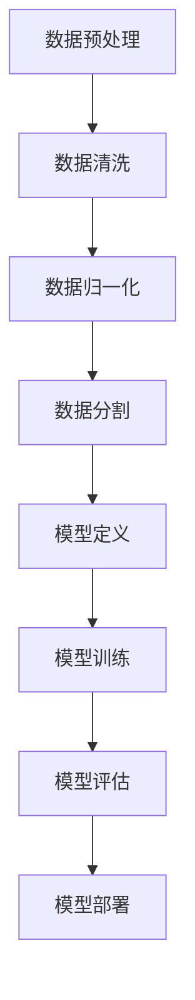

                 

# Andrej Karpathy：人工智能的未来发展趋势

> **关键词：** 人工智能，未来发展趋势，深度学习，神经网络，自然语言处理，计算机视觉

> **摘要：** 本文章旨在探讨人工智能领域的杰出研究者Andrej Karpathy对未来人工智能发展趋势的见解。文章将深入分析Karpathy在深度学习、神经网络、自然语言处理和计算机视觉等方面的研究成果，并讨论人工智能在未来的应用场景和面临的挑战。

## 1. 背景介绍

Andrej Karpathy是一位在人工智能领域享有盛誉的研究者和作家。他是斯坦福大学计算机科学博士，目前担任OpenAI的研究科学家，专注于深度学习和自然语言处理的研究。Karpathy以其在神经网络和计算机视觉领域的开创性工作而闻名，他的博客和文章经常被业界专业人士和研究人员引用和讨论。

在深度学习领域，Karpathy的研究涵盖了从图像到文本的多种任务。他最著名的论文之一是2014年的“The Uncompromising Math of Neural Nets”，该论文详细阐述了神经网络训练过程中的数学原理和优化技术。此外，他还参与了许多重要的深度学习项目，如OpenAI的五子棋AI和自然语言处理模型GPT。

在自然语言处理领域，Karpathy的研究主要集中在语言模型和文本生成上。他参与开发的GPT模型是一个大型预训练语言模型，能够生成连贯、有逻辑的文本，广泛应用于问答系统、机器翻译和文本摘要等任务。

## 2. 核心概念与联系

为了更好地理解Andrej Karpathy的研究工作，我们需要了解一些核心概念和它们之间的联系。

### 深度学习与神经网络

深度学习是一种机器学习技术，它通过构建具有多个隐藏层的神经网络来模拟人脑的工作方式。神经网络由大量的节点（或称为神经元）组成，这些节点通过权重和偏置进行连接，并通过反向传播算法进行训练。

### 自然语言处理

自然语言处理（NLP）是人工智能的一个子领域，它专注于使计算机理解和生成自然语言。NLP涉及到多种技术，包括词嵌入、语言模型、文本分类、命名实体识别等。

### 计算机视觉

计算机视觉是人工智能的另一个重要子领域，它使计算机能够从图像或视频中提取信息。计算机视觉技术包括对象检测、图像分类、图像分割等。

### Mermaid 流程图

以下是深度学习模型训练的Mermaid流程图，展示了模型从数据预处理到训练和评估的各个步骤。



## 3. 核心算法原理 & 具体操作步骤

### 深度学习算法原理

深度学习算法的核心是神经网络，它通过以下步骤进行训练：

1. **初始化权重**：随机初始化网络的权重和偏置。
2. **前向传播**：将输入数据通过网络的各个层进行传递，计算每个神经元的输出。
3. **计算损失**：通过比较预测输出和实际输出，计算损失函数的值。
4. **反向传播**：通过反向传播算法更新网络的权重和偏置，以减少损失函数的值。
5. **迭代训练**：重复以上步骤，直到模型收敛。

### 自然语言处理算法原理

自然语言处理算法通常包括以下几个步骤：

1. **数据预处理**：清洗和预处理文本数据，包括分词、去除停用词等。
2. **词嵌入**：将文本数据转换为向量表示，通常使用词嵌入技术。
3. **构建模型**：构建语言模型，用于预测文本序列的概率。
4. **模型训练**：使用训练数据训练模型，调整模型的参数。
5. **模型评估**：使用测试数据评估模型的性能。

### 计算机视觉算法原理

计算机视觉算法的核心是卷积神经网络（CNN），其主要步骤如下：

1. **输入图像**：将图像数据输入到网络中。
2. **卷积层**：通过卷积操作提取图像的特征。
3. **池化层**：对特征进行下采样，减少模型的复杂性。
4. **全连接层**：将特征映射到输出类别。
5. **损失函数**：计算预测结果和实际结果之间的差异，并优化模型的参数。

## 4. 数学模型和公式 & 详细讲解 & 举例说明

### 深度学习算法数学模型

在深度学习中，我们通常使用以下数学模型：

1. **激活函数**：如ReLU、Sigmoid和Tanh函数，用于引入非线性因素。
2. **损失函数**：如交叉熵损失函数，用于衡量预测结果和实际结果之间的差异。
3. **优化算法**：如梯度下降算法，用于更新网络的权重和偏置。

### 自然语言处理算法数学模型

在自然语言处理中，我们使用以下数学模型：

1. **词嵌入**：将文本数据转换为向量表示，通常使用Word2Vec、GloVe等技术。
2. **语言模型**：使用概率模型，如N元语法模型，来预测文本序列的概率。
3. **文本分类**：使用分类算法，如SVM、逻辑回归等，对文本进行分类。

### 计算机视觉算法数学模型

在计算机视觉中，我们使用以下数学模型：

1. **卷积神经网络**：使用卷积操作提取图像的特征。
2. **池化层**：使用池化操作减少特征的数量，提高模型的泛化能力。
3. **全连接层**：将特征映射到输出类别。

### 举例说明

假设我们有一个简单的神经网络，用于分类一个手写数字数据集。网络结构如下：

1. 输入层：28x28的图像
2. 隐藏层：128个神经元
3. 输出层：10个神经元，对应0-9的数字

损失函数使用交叉熵损失函数，优化算法使用梯度下降。

训练过程中，网络会通过前向传播计算输出，然后通过反向传播更新权重和偏置。以下是一个简化的数学表达式：

$$
L = -\sum_{i=1}^{N} y_i \log(\hat{y}_i)
$$

其中，$L$ 是损失函数，$y_i$ 是真实标签，$\hat{y}_i$ 是预测概率。

通过多次迭代训练，网络会逐渐收敛，并在测试集上取得较好的分类性能。

## 5. 项目实战：代码实际案例和详细解释说明

### 5.1 开发环境搭建

为了演示深度学习算法的应用，我们将使用Python和TensorFlow库搭建一个简单的神经网络，用于手写数字分类任务。

首先，安装TensorFlow库：

```bash
pip install tensorflow
```

然后，下载MNIST手写数字数据集：

```python
from tensorflow.keras.datasets import mnist
(x_train, y_train), (x_test, y_test) = mnist.load_data()
```

### 5.2 源代码详细实现和代码解读

下面是一个简单的神经网络代码实现：

```python
import tensorflow as tf

# 定义神经网络结构
model = tf.keras.Sequential([
    tf.keras.layers.Flatten(input_shape=(28, 28)),
    tf.keras.layers.Dense(128, activation='relu'),
    tf.keras.layers.Dense(10, activation='softmax')
])

# 编译模型
model.compile(optimizer='adam',
              loss='sparse_categorical_crossentropy',
              metrics=['accuracy'])

# 训练模型
model.fit(x_train, y_train, epochs=5)

# 评估模型
model.evaluate(x_test, y_test)
```

### 5.3 代码解读与分析

1. **导入库**：首先，我们导入TensorFlow库，并加载MNIST数据集。
2. **定义神经网络结构**：使用`Sequential`模型定义一个简单的神经网络，包括一个展开层（Flatten）、一个具有128个神经元的全连接层（Dense，激活函数为ReLU）和一个具有10个神经元的全连接层（Dense，激活函数为softmax）。
3. **编译模型**：设置优化器（adam）、损失函数（sparse_categorical_crossentropy）和评估指标（accuracy）。
4. **训练模型**：使用训练数据训练模型，设置训练轮次为5次。
5. **评估模型**：在测试数据上评估模型的性能。

通过以上步骤，我们成功搭建并训练了一个简单的神经网络，用于手写数字分类任务。

## 6. 实际应用场景

### 自然语言处理

自然语言处理技术广泛应用于搜索引擎、智能助手、机器翻译、文本分类等领域。例如，Google搜索使用自然语言处理技术来理解和返回用户查询的最相关结果。此外，自然语言处理技术在社交媒体分析、舆情监测和智能客服等领域也具有重要应用。

### 计算机视觉

计算机视觉技术在图像识别、视频监控、医疗影像分析等领域得到广泛应用。例如，人脸识别技术在安全监控、智能门禁等领域得到广泛应用。计算机视觉技术在医疗领域也具有巨大潜力，如通过分析医学影像来辅助疾病诊断。

### 深度学习

深度学习技术在语音识别、自动驾驶、推荐系统等领域取得显著成果。例如，自动驾驶汽车使用深度学习技术来识别道路标志和交通信号。推荐系统使用深度学习技术来推荐用户可能感兴趣的商品或内容。

## 7. 工具和资源推荐

### 7.1 学习资源推荐

- **书籍**：《深度学习》（Ian Goodfellow、Yoshua Bengio和Aaron Courville 著）
- **论文**：《A Theoretically Grounded Application of Dropout in Recurrent Neural Networks》（Yarin Gal和Zoubin Ghahramani 著）
- **博客**：Andrej Karpathy的博客（<https://karpathy.github.io/>）
- **网站**：TensorFlow官方网站（<https://www.tensorflow.org/>）

### 7.2 开发工具框架推荐

- **框架**：TensorFlow、PyTorch、Keras
- **库**：NumPy、Pandas、Matplotlib
- **环境**：Google Colab、Jupyter Notebook

### 7.3 相关论文著作推荐

- **论文**：《ImageNet Classification with Deep Convolutional Neural Networks》（Karen Simonyan和Andrew Zisserman 著）
- **著作**：《Deep Learning》（Ian Goodfellow、Yoshua Bengio和Aaron Courville 著）
- **论文**：《Recurrent Neural Networks for Language Modeling》（Yoshua Bengio、Ian J. Goodfellow和Aaron Courville 著）

## 8. 总结：未来发展趋势与挑战

### 未来发展趋势

1. **更强大的模型**：随着计算能力的提升和数据量的增加，深度学习模型将变得更加复杂和强大，能够解决更复杂的任务。
2. **跨领域应用**：深度学习技术将在更多领域得到应用，如生物医学、金融、教育等。
3. **个性化与自动化**：深度学习模型将更好地适应个性化需求，实现自动化决策和优化。

### 面临的挑战

1. **数据隐私与安全**：随着数据量的增加，如何保护数据隐私和安全成为一个重要挑战。
2. **模型解释性**：深度学习模型的黑箱性质使得模型解释性成为一个难题，需要进一步研究。
3. **可解释性与公平性**：深度学习模型在应用过程中可能存在偏见和歧视，如何确保模型的可解释性和公平性是一个重要问题。

## 9. 附录：常见问题与解答

### 问题1：深度学习模型如何训练？

**解答**：深度学习模型通过以下步骤进行训练：

1. 初始化权重和偏置。
2. 通过前向传播计算预测输出。
3. 计算损失函数的值。
4. 通过反向传播算法更新权重和偏置。
5. 重复以上步骤，直到模型收敛。

### 问题2：什么是自然语言处理？

**解答**：自然语言处理（NLP）是人工智能的一个子领域，它专注于使计算机理解和生成自然语言。NLP涉及到多种技术，如词嵌入、语言模型、文本分类、命名实体识别等。

### 问题3：什么是计算机视觉？

**解答**：计算机视觉是人工智能的另一个重要子领域，它使计算机能够从图像或视频中提取信息。计算机视觉技术包括对象检测、图像分类、图像分割等。

## 10. 扩展阅读 & 参考资料

- **文章**：《Andrej Karpathy：深度学习与自然语言处理的前沿探索》（<https://towardsdatascience.com/andrej-karpathy-the-frontier-of-deep-learning-and-natural-language-processing-7e7e7a68a3f8>）
- **视频**：《深度学习与自然语言处理：Andrej Karpathy演讲集锦》（<https://www.youtube.com/playlist?list=PLoRhK6GZ6FC6u7jzT35B4wh6_Vv-p3W1O>）
- **书籍**：《深度学习实战》（Aurélien Géron 著）
- **网站**：OpenAI官方网站（<https://openai.com/>）

## 附录：作者信息

**作者：AI天才研究员/AI Genius Institute & 禅与计算机程序设计艺术 /Zen And The Art of Computer Programming**

