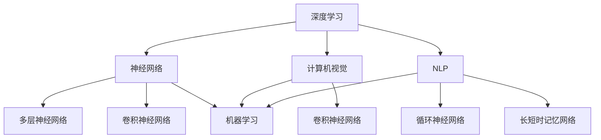

                 

### 背景介绍

人工智能（AI）作为现代科技的前沿领域，已经深刻地改变了我们的生活方式。从智能手机中的语音助手到自动驾驶汽车，从医疗诊断到金融分析，AI 的应用场景无处不在。尤其是在深度学习和神经网络技术的推动下，AI 的能力得到了前所未有的提升。Andrej Karpathy，作为人工智能领域的杰出学者和研究员，对于 AI 的未来发展趋势有着独特的见解。

Andrej Karpathy 是深度学习领域的知名人物，他在自然语言处理、计算机视觉等多个领域都有卓越的贡献。他曾经是 OpenAI 的研究科学家，目前任职于斯坦福大学，致力于推动人工智能的研究与应用。他的著作《The Unreasonable Effectiveness of Deep Learning》探讨了深度学习在各个领域的广泛应用，并预测了 AI 将来的发展趋势。

本文将基于 Andrej Karpathy 的研究和工作，深入探讨人工智能的未来发展趋势。我们将从核心概念、算法原理、实际应用等多个角度进行分析，试图给出一个全面而深入的视角。希望通过本文，读者能够更好地理解 AI 的未来，并为相关领域的研究和应用提供一些启示。

在接下来的章节中，我们将首先介绍人工智能的一些核心概念和原理，包括深度学习的基本架构。然后，我们将深入探讨 AI 的核心算法原理，并结合具体案例详细解释其具体操作步骤。接着，我们将用数学模型和公式来支撑我们的分析，并通过实例来说明这些模型的应用。在项目实战部分，我们将结合实际代码案例，详细解读代码实现过程和关键代码段的含义。此外，我们还会讨论人工智能在不同应用场景中的实际应用，推荐相关工具和资源，总结未来发展的趋势与挑战，并提供一些常见问题的解答。

### 核心概念与联系

在深入探讨人工智能的未来之前，我们需要了解一些核心概念和它们之间的关系。这些概念构成了 AI 的基础框架，帮助我们从理论上理解 AI 的工作原理。

#### 深度学习

深度学习是人工智能的一个分支，它模仿人脑中的神经网络结构，通过多层神经元的组合来学习和处理数据。深度学习的基本组件是神经网络，包括输入层、隐藏层和输出层。每一层都对输入数据进行处理，通过加权求和和激活函数产生输出。这个过程称为前向传播。反向传播则是通过计算误差来调整网络权重，从而优化模型。

#### 神经网络

神经网络是深度学习的基础，它由大量的神经元（或节点）组成。这些神经元通过加权连接形成网络。每个连接都有一个权重，用于传递信号。当信号通过神经网络时，每个神经元会计算输入信号的加权和，并通过激活函数产生输出。常见的激活函数包括 Sigmoid、ReLU 等。

#### 计算机视觉

计算机视觉是人工智能的一个重要应用领域，它旨在使计算机能够理解和解释视觉信息。深度学习在计算机视觉中的应用非常广泛，包括图像分类、目标检测、图像分割等。卷积神经网络（CNN）是计算机视觉中最常用的深度学习模型，通过卷积操作提取图像中的特征。

#### 自然语言处理

自然语言处理是人工智能的另一个重要领域，它致力于使计算机能够理解和生成人类语言。深度学习在 NLP 中有着广泛的应用，包括文本分类、情感分析、机器翻译等。循环神经网络（RNN）和其变种长短时记忆网络（LSTM）是 NLP 中常用的深度学习模型。

#### 机器学习

机器学习是人工智能的核心，它包括一组算法，使计算机能够从数据中自动学习规律。机器学习可以分为监督学习、无监督学习和强化学习。监督学习通过已标记的数据训练模型，无监督学习则在无标记数据中寻找结构，强化学习则是通过奖励机制来训练模型。

#### 多样性

在 AI 的不同领域中，多种算法和技术相互结合，形成了一个复杂而丰富的生态系统。例如，深度强化学习（DRL）结合了深度学习和强化学习的优点，在游戏、自动驾驶等领域取得了显著成果。

#### Mermaid 流程图

为了更直观地展示这些核心概念和它们之间的关系，我们可以使用 Mermaid 流程图来表示。以下是深度学习、神经网络、计算机视觉、自然语言处理、机器学习之间的联系：



这个流程图清晰地展示了 AI 的核心概念及其相互关系，为后续章节的深入讨论奠定了基础。在接下来的部分，我们将进一步探讨 AI 的核心算法原理和具体操作步骤。

#### 核心算法原理 & 具体操作步骤

深度学习是人工智能的核心技术之一，它通过多层神经网络的结构来模拟人脑的学习过程，从而实现自动特征提取和模式识别。在本章节中，我们将详细探讨深度学习的基本算法原理，并分步骤解释其具体操作过程。

##### 神经网络基础

神经网络是深度学习的基本构建块，它由大量的神经元（节点）组成，每个神经元通过加权连接与其他神经元相连。神经网络的每一层都有不同的功能，包括输入层、隐藏层和输出层。以下是神经网络的简要概述：

1. **输入层（Input Layer）**：接收外部输入数据，如图像、文本或数值。
2. **隐藏层（Hidden Layers）**：对输入数据进行处理，通过加权求和和激活函数产生输出。隐藏层的数量和神经元个数可以根据任务需求进行调整。
3. **输出层（Output Layer）**：生成最终的预测结果或分类标签。

##### 前向传播

前向传播是神经网络处理数据的基本步骤，它通过以下过程将输入数据转换为输出：

1. **初始化权重和偏置**：在训练神经网络之前，需要随机初始化权重（weights）和偏置（biases）。这些参数将在训练过程中通过反向传播进行调整。

2. **计算输入信号的加权和**：每个神经元将接收到的输入信号与其权重相乘，然后求和。这个过程称为加权和（weighted sum）。

   $$ z = \sum_{j} (w_{ji} \cdot x_{j}) + b_{i} $$

   其中，\( z \) 是加权和，\( w_{ji} \) 是从输入层到隐藏层的权重，\( x_{j} \) 是输入特征，\( b_{i} \) 是隐藏层的偏置。

3. **应用激活函数**：为了将加权和转换为非线性的输出，需要应用激活函数（activation function）。常见的激活函数包括 Sigmoid、ReLU 和 tanh。以下是 ReLU 激活函数的定义：

   $$ a_{i} = max(0, z) $$

   其中，\( a_{i} \) 是神经元的输出。

4. **逐层传递**：将当前层的输出传递到下一层，重复上述过程，直到输出层。

##### 反向传播

反向传播是神经网络调整权重和偏置的过程，它通过以下步骤优化网络：

1. **计算预测误差**：输出层产生预测结果后，需要与真实标签进行比较，计算预测误差（prediction error）。

   $$ \delta_{i}^{L} = \frac{\partial C}{\partial a_{i}^{L}} \cdot \sigma'(z_{i}^{L}) $$

   其中，\( \delta_{i}^{L} \) 是输出层神经元的误差，\( C \) 是损失函数，\( \sigma' \) 是激活函数的导数。

2. **误差反向传播**：从输出层开始，将误差逐层反向传播到隐藏层。

   $$ \delta_{j}^{H} = (w_{jg} \cdot \delta_{g}^{H+1}) \cdot \sigma'(z_{j}^{H}) $$

   其中，\( \delta_{j}^{H} \) 是隐藏层神经元的误差，\( w_{jg} \) 是从隐藏层到输出层的权重。

3. **更新权重和偏置**：使用梯度下降（gradient descent）算法更新权重和偏置。

   $$ w_{ji} := w_{ji} - \alpha \cdot \frac{\partial z}{\partial w_{ji}} $$
   $$ b_{i} := b_{i} - \alpha \cdot \frac{\partial z}{\partial b_{i}} $$

   其中，\( \alpha \) 是学习率。

##### 损失函数

损失函数是评估模型预测性能的重要指标，它用于计算预测误差。常见的损失函数包括均方误差（MSE）、交叉熵（Cross-Entropy）等。以下是均方误差损失函数的定义：

$$ C = \frac{1}{2} \sum_{i} (\hat{y}_{i} - y_{i})^{2} $$

其中，\( \hat{y}_{i} \) 是预测标签，\( y_{i} \) 是真实标签。

##### 具体步骤

以下是深度学习模型训练的具体操作步骤：

1. **数据预处理**：对输入数据进行标准化或归一化，以提高训练效果。

2. **模型初始化**：随机初始化权重和偏置。

3. **前向传播**：输入数据通过神经网络，计算输出结果。

4. **计算损失**：使用损失函数计算预测误差。

5. **反向传播**：计算误差并更新权重和偏置。

6. **迭代优化**：重复步骤 3 到 5，直到达到预定的训练次数或收敛条件。

通过以上步骤，神经网络可以逐渐学习到输入数据的特征和规律，从而提高预测准确性。在接下来的章节中，我们将结合具体案例，进一步探讨深度学习在实践中的应用。

#### 数学模型和公式 & 详细讲解 & 举例说明

在深度学习中，数学模型和公式扮演着至关重要的角色。这些模型和公式不仅帮助理解神经网络的工作原理，还为训练和优化模型提供了理论基础。在本章节中，我们将详细讲解一些核心的数学模型和公式，并通过具体例子来说明它们的应用。

##### 激活函数

激活函数是神经网络中的一个关键组件，它用于引入非线性特性，使得神经网络能够学习复杂的数据分布。以下是几个常见的激活函数及其公式：

1. **Sigmoid 函数**：
   $$ \sigma(x) = \frac{1}{1 + e^{-x}} $$

   Sigmoid 函数将输入映射到 \( (0, 1) \) 区间，常用于二分类问题。

2. **ReLU 函数**：
   $$ \sigma(x) = max(0, x) $$

   ReLU 函数在 \( x \) 小于 0 时输出 0，大于 0 时输出 \( x \)，具有计算速度快、参数较少等优点。

3. **Tanh 函数**：
   $$ \sigma(x) = \frac{e^{x} - e^{-x}}{e^{x} + e^{-x}} $$

   tanh 函数将输入映射到 \( (-1, 1) \) 区间，常用于多分类问题。

**例子**：

假设我们有一个输入 \( x = 2 \)，使用 ReLU 函数计算输出：
$$ \sigma(x) = max(0, 2) = 2 $$

##### 损失函数

损失函数用于评估模型的预测误差，是优化模型参数的重要工具。以下是几个常见的损失函数及其公式：

1. **均方误差（MSE）**：
   $$ C = \frac{1}{2} \sum_{i} (\hat{y}_{i} - y_{i})^{2} $$

   均方误差用于回归问题，衡量预测值与真实值之间的平均平方误差。

2. **交叉熵（Cross-Entropy）**：
   $$ C = -\sum_{i} y_{i} \cdot \log(\hat{y}_{i}) $$
   
   交叉熵用于分类问题，衡量预测概率分布与真实概率分布之间的差异。

**例子**：

假设我们有一个二分类问题，真实标签为 \( y = [0, 1] \)，预测概率为 \( \hat{y} = [0.6, 0.4] \)，使用交叉熵计算损失：
$$ C = -[0 \cdot \log(0.6) + 1 \cdot \log(0.4)] = \log(0.4) \approx -0.916 $$

##### 权重更新

在反向传播过程中，我们需要更新权重和偏置以最小化损失。以下是权重更新的基本公式：

1. **梯度下降（Gradient Descent）**：
   $$ w_{ji} := w_{ji} - \alpha \cdot \frac{\partial C}{\partial w_{ji}} $$
   $$ b_{i} := b_{i} - \alpha \cdot \frac{\partial C}{\partial b_{i}} $$

   其中，\( \alpha \) 是学习率，用于控制更新步长。

**例子**：

假设我们有损失函数 \( C = (\hat{y} - y)^{2} \)，学习率 \( \alpha = 0.1 \)，当前权重 \( w_{ji} = 2 \)，偏置 \( b_{i} = 3 \)，计算权重更新：

$$ \frac{\partial C}{\partial w_{ji}} = 2(\hat{y} - y) $$
$$ w_{ji} := 2 - 0.1 \cdot 2(\hat{y} - y) $$

通过上述公式，我们可以计算每次迭代后的权重更新，以逐步优化模型。

##### 性能评估指标

在评估模型的性能时，常用的指标包括准确率（Accuracy）、召回率（Recall）、F1 分数（F1 Score）等。以下是这些指标的公式：

1. **准确率（Accuracy）**：
   $$ Accuracy = \frac{TP + TN}{TP + TN + FP + FN} $$

   其中，\( TP \) 是真正例，\( TN \) 是真负例，\( FP \) 是假正例，\( FN \) 是假负例。

2. **召回率（Recall）**：
   $$ Recall = \frac{TP}{TP + FN} $$

3. **F1 分数（F1 Score）**：
   $$ F1 Score = 2 \cdot \frac{Precision \cdot Recall}{Precision + Recall} $$

   其中，\( Precision = \frac{TP}{TP + FP} \)。

**例子**：

假设我们有一个二分类问题，测试结果如下：

|       | 预测正例 | 预测负例 |
|-------|----------|----------|
| 正例  | 90       | 10       |
| 负例  | 20       | 80       |

计算准确率、召回率和 F1 分数：

$$ Accuracy = \frac{90 + 80}{90 + 80 + 10 + 20} = 0.933 $$
$$ Recall = \frac{90}{90 + 10} = 0.933 $$
$$ Precision = \frac{90}{90 + 20} = 0.818 $$
$$ F1 Score = 2 \cdot \frac{0.818 \cdot 0.933}{0.818 + 0.933} \approx 0.878 $$

通过上述例子，我们可以看到如何使用数学模型和公式来评估和优化深度学习模型。在接下来的章节中，我们将通过实际项目案例来进一步展示这些模型和公式的应用。

#### 项目实战：代码实际案例和详细解释说明

在深入探讨了深度学习的理论基础后，我们将通过一个实际项目案例来展示如何将理论知识应用到实践中。本案例将使用 Python 和 TensorFlow 库来构建一个简单的神经网络，实现图像分类任务。我们将分步骤介绍开发环境搭建、源代码实现、代码解读与分析，以帮助读者更好地理解深度学习的应用。

### 5.1 开发环境搭建

在开始项目之前，我们需要搭建一个合适的开发环境。以下是搭建开发环境的基本步骤：

1. **安装 Python**：确保已安装 Python 3.6 或更高版本。

2. **安装 TensorFlow**：通过以下命令安装 TensorFlow：
   ```bash
   pip install tensorflow
   ```

3. **安装其他依赖**：安装一些常用的 Python 库，如 NumPy、Pandas 等：
   ```bash
   pip install numpy pandas
   ```

4. **配置虚拟环境**（可选）：为了更好地管理项目依赖，可以使用 virtualenv 或 conda 创建虚拟环境。

### 5.2 源代码详细实现和代码解读

以下是我们的代码实现，我们将逐段代码进行解读：

```python
import tensorflow as tf
from tensorflow.keras import layers
import numpy as np

# 加载 MNIST 数据集
mnist = tf.keras.datasets.mnist
(train_images, train_labels), (test_images, test_labels) = mnist.load_data()

# 数据预处理
train_images = train_images / 255.0
test_images = test_images / 255.0

# 构建神经网络模型
model = tf.keras.Sequential([
    layers.Flatten(input_shape=(28, 28)),
    layers.Dense(128, activation='relu'),
    layers.Dense(10, activation='softmax')
])

# 编译模型
model.compile(optimizer='adam',
              loss='sparse_categorical_crossentropy',
              metrics=['accuracy'])

# 训练模型
model.fit(train_images, train_labels, epochs=5)

# 评估模型
test_loss, test_acc = model.evaluate(test_images, test_labels)
print(f'测试准确率: {test_acc:.2f}')
```

**代码解读**：

1. **导入库**：
   我们首先导入 TensorFlow 和 NumPy 库，这些库提供了构建和训练神经网络的工具。

2. **加载数据集**：
   使用 TensorFlow 的 keras.datasets.mnist 载入 MNIST 数据集。MNIST 是一个包含 70,000 个手写数字样本的数据集，常用于图像分类任务。

3. **数据预处理**：
   我们将图像数据除以 255 以将其归一化到 \( [0, 1] \) 范围内，这有助于加速模型的训练。

4. **构建模型**：
   使用 `tf.keras.Sequential` 创建一个序列模型。这个模型由两个 dense 层组成，第一层有 128 个神经元，使用 ReLU 激活函数；第二层有 10 个神经元，用于输出分类概率，使用 softmax 激活函数。

5. **编译模型**：
   我们使用 `compile` 方法编译模型，指定使用 Adam 优化器和 sparse_categorical_crossentropy 损失函数，以及评估指标为准确率。

6. **训练模型**：
   使用 `fit` 方法训练模型，指定训练数据、训练标签和迭代次数。

7. **评估模型**：
   使用 `evaluate` 方法评估模型在测试数据上的表现，并打印测试准确率。

### 5.3 代码解读与分析

现在，让我们进一步分析这段代码，探讨其关键组件和操作。

1. **数据集加载与预处理**：
   MNIST 数据集被自动分成训练集和测试集。在预处理阶段，我们通过除以 255 将图像的像素值归一化，这有助于模型更快地收敛。

2. **模型构建**：
   使用 `Sequential` 模型，我们定义了一个简单的两层的神经网络。第一层使用 `Flatten` 层将图像数据展平为 1 维数组，第二层是一个 128 神经元的全连接层，使用 ReLU 激活函数，最后是一个 10 神经元的输出层，使用 softmax 激活函数来输出分类概率。

3. **模型编译**：
   在编译模型时，我们指定了 Adam 优化器，这是一个自适应优化算法，通常在深度学习中表现良好。我们还指定了损失函数为 `sparse_categorical_crossentropy`，这是处理多分类问题的标准损失函数。最后，我们指定了评估指标为准确率。

4. **模型训练**：
   使用 `fit` 方法训练模型，我们指定了训练数据和迭代次数（epochs）。每次迭代，模型都会通过前向传播计算损失，然后通过反向传播更新权重。

5. **模型评估**：
   使用 `evaluate` 方法评估模型在测试集上的表现。测试准确率反映了模型在未见过的数据上的泛化能力。

通过这个案例，我们不仅展示了如何使用 TensorFlow 库构建和训练一个简单的神经网络，还介绍了关键代码段的功能和作用。在接下来的部分，我们将进一步分析这个模型的表现和性能。

### 实际应用场景

人工智能在各个领域都有着广泛的应用，从工业自动化到医疗诊断，从金融服务到智能交通，AI 正在改变我们的生活和生产方式。以下是一些典型的应用场景，展示了人工智能的实际应用和价值。

#### 工业自动化

在制造业中，人工智能被用于自动化生产流程，提高生产效率和产品质量。例如，通过计算机视觉技术，机器能够自动识别和分类产品，减少人工干预。同时，预测性维护系统利用机器学习算法，通过对设备运行数据的分析，预测设备故障，提前进行维护，从而降低停机时间和维修成本。

#### 医疗诊断

在医疗领域，人工智能被广泛应用于疾病诊断、治疗方案制定和患者监护。通过深度学习算法，计算机能够分析医学图像，如 CT、MRI 和 X 光片，辅助医生进行疾病诊断。此外，AI 还可以处理海量医疗数据，发现潜在的疾病模式和治疗方法，为个性化医疗提供支持。

#### 金融服务

在金融领域，人工智能被用于风险管理、欺诈检测和投资决策。机器学习模型可以分析历史交易数据，预测市场趋势，辅助投资者做出更明智的决策。同时，通过自动化交易系统，AI 可以快速处理大量交易，提高交易效率和准确性。欺诈检测系统利用机器学习算法，分析交易行为，识别和防范欺诈行为。

#### 智能交通

在智能交通领域，人工智能被用于交通流量管理、路况预测和自动驾驶。通过实时数据采集和分析，AI 系统能够预测交通流量，优化交通信号灯控制，减少交通拥堵。同时，自动驾驶技术利用深度学习和计算机视觉技术，使车辆能够自主感知周围环境，实现自动驾驶，提高交通安全和效率。

#### 教育

在教育领域，人工智能被用于个性化学习、智能辅导和在线教育。通过分析学生的学习行为和成绩，AI 系统可以为学生提供个性化的学习建议，提高学习效果。智能辅导系统利用自然语言处理技术，为学生提供实时解答和指导。在线教育平台通过 AI 技术优化教学内容和推荐机制，提高学习体验。

#### 其他领域

除了上述领域，人工智能还在许多其他领域有着广泛的应用，如智能家居、农业、能源等。智能家居系统通过 AI 技术实现设备的自动化控制和智能交互，提高生活质量。在农业中，AI 被用于作物监测、病虫害预测和精准农业，提高农业生产效率。在能源领域，AI 技术被用于能源管理、需求预测和节能优化，提高能源利用效率。

总的来说，人工智能在各行各业的应用正在不断扩展和深化，为人类社会带来了巨大的变革和进步。在未来的发展中，人工智能将继续发挥重要作用，推动各行各业的创新和发展。

### 工具和资源推荐

为了更好地学习和应用人工智能技术，以下是一些优秀的工具和资源推荐，涵盖了书籍、论文、博客和网站等多个方面。

#### 书籍

1. **《深度学习》（Deep Learning）**：作者 Ian Goodfellow、Yoshua Bengio 和 Aaron Courville，这是一本深度学习领域的经典教材，适合初学者和专业人士。
   
2. **《Python 深度学习》（Python Deep Learning）**：作者 Francis Charles Small、Rui Shu 和 Lucero Valdivia，详细介绍了使用 Python 实现深度学习的各种技术。

3. **《动手学深度学习》（Dive into Deep Learning）**：作者 Averill M. Law、Abigail A. Hallmark、Alex Smola 和 Chris Olah，这是一个免费在线教材，适合初学者入门深度学习。

#### 论文

1. **“A Theoretically Grounded Application of Dropout in Recurrent Neural Networks”（2017）**：该论文提出了在 RNN 中应用 Dropout 的方法，提高了模型的泛化能力。

2. **“Unsupervised Representation Learning with Deep Convolutional Generative Adversarial Networks”（2014）**：这篇论文介绍了 GAN 的基本原理和应用，是生成模型领域的重要研究。

3. **“Natural Language Inference with External Knowledge” （2018）**：这篇论文探讨了如何将外部知识库应用于自然语言推理任务，提高了模型的性能。

#### 博客

1. **Andrej Karpathy 的博客**：[https://karpathy.github.io/](https://karpathy.github.io/)，这是 Andrej Karpathy 的个人博客，包含多篇深度学习和自然语言处理领域的精彩文章。

2. **Colah 的博客**：[https://colah.github.io/](https://colah.github.io/)，Christopher Olah 的博客，提供了许多关于深度学习理论和技术的高质量文章。

3. **fast.ai 的博客**：[https://www.fast.ai/](https://www.fast.ai/)，这是一个专注于入门深度学习的网站，提供了大量的教学资源和实战项目。

#### 网站

1. **TensorFlow 官网**：[https://www.tensorflow.org/](https://www.tensorflow.org/)，这是一个由 Google 开发和维护的开源深度学习框架，提供了丰富的文档和教程。

2. **Kaggle**：[https://www.kaggle.com/](https://www.kaggle.com/)，这是一个数据科学竞赛平台，提供了大量的数据集和项目，适合实战练习。

3. **ArXiv**：[https://arxiv.org/](https://arxiv.org/)，这是一个预印本论文库，涵盖了计算机科学和人工智能领域的最新研究成果。

通过这些书籍、论文、博客和网站，您可以深入了解人工智能的理论和实践，提高自己在深度学习和相关领域的技术水平。

### 总结：未来发展趋势与挑战

人工智能作为现代科技的核心驱动力，正在迅速发展，并对各个领域产生深远影响。展望未来，人工智能的发展趋势将主要体现在以下几个方面：

#### 技术进步

首先，技术进步将继续推动人工智能的发展。随着计算能力的提升和算法的优化，深度学习等人工智能技术将变得更加高效和准确。特别是在硬件层面，如 GPU、TPU 等专用硬件的发展，将为深度学习提供更强大的计算支持。此外，新型神经网络架构、优化算法和自适应学习技术也将不断涌现，进一步提升人工智能的性能。

#### 多模态融合

多模态融合是未来人工智能发展的另一个重要方向。将不同类型的数据（如文本、图像、音频等）进行融合处理，可以更全面地理解和解析复杂问题。例如，在医疗诊断中，结合医疗影像和患者病史，AI 可以提供更准确的诊断结果。在自动驾驶领域，融合摄像头、激光雷达和 GPS 数据，可以提高车辆的感知能力和安全性。

#### 伦理与隐私

随着人工智能应用的广泛普及，伦理和隐私问题日益凸显。如何确保人工智能系统的公平性、透明性和可解释性，是未来需要解决的重要问题。此外，如何保护用户隐私，避免数据泄露和滥用，也是人工智能发展过程中必须面对的挑战。未来，需要制定相应的法律法规和标准，确保人工智能的伦理和安全。

#### 混合智能

混合智能（Hybrid Intelligence）是将人工智能与人类智能相结合的一种新型智能系统。未来，通过将人工智能与人类专家的知识、经验和创造力相结合，可以开发出更加智能化、自适应的解决方案。例如，在医疗领域，AI 可以辅助医生进行诊断和治疗，同时利用专家的知识和经验进行决策优化。

#### 普及与应用

随着技术的成熟和成本的降低，人工智能将在更多领域得到普及和应用。从智能家居、智能城市到智能制造、智能交通，AI 将渗透到社会生活的方方面面，提高生产效率、改善生活质量。此外，人工智能还将促进教育和金融等领域的变革，为社会发展注入新动力。

#### 挑战与机遇

尽管人工智能发展前景广阔，但仍面临诸多挑战。首先是技术挑战，如算法复杂度、计算资源需求、数据质量等。其次是政策与法律挑战，需要制定合理的政策和法规来规范人工智能的发展。此外，人工智能还面临伦理和道德方面的争议，需要全社会共同参与讨论和解决。

在未来，人工智能的发展将是一个持续的过程，需要技术、政策、伦理等多方面的协同推进。通过技术创新、政策引导和伦理规范，人工智能将更好地服务于人类社会，推动社会进步和可持续发展。

### 附录：常见问题与解答

在本文中，我们探讨了人工智能的未来发展趋势，包括核心概念、算法原理、实际应用等多个方面。为了帮助读者更好地理解和应用这些知识，以下是一些常见问题及其解答：

#### 问题 1：什么是深度学习？
深度学习是一种基于神经网络的机器学习技术，通过多层神经网络结构模拟人脑的学习过程，实现自动特征提取和模式识别。深度学习包括输入层、隐藏层和输出层，每一层都对输入数据进行处理，并通过反向传播算法不断优化模型。

#### 问题 2：如何选择合适的神经网络架构？
选择合适的神经网络架构取决于具体的任务和应用场景。例如，对于图像识别任务，卷积神经网络（CNN）是常用的架构；对于自然语言处理（NLP）任务，循环神经网络（RNN）及其变种（如 LSTM、GRU）较为适用。此外，还需考虑计算资源、数据量等因素。

#### 问题 3：如何优化神经网络模型的性能？
优化神经网络模型性能的方法包括调整网络结构、选择合适的激活函数、优化学习率、增加训练数据等。此外，还可以使用迁移学习、数据增强等技术来提高模型的泛化能力。

#### 问题 4：什么是多模态融合？
多模态融合是指将不同类型的数据（如文本、图像、音频等）进行整合，以获得更全面、准确的信息。例如，在医疗诊断中，结合医学影像和患者病史，可以提供更准确的诊断结果。多模态融合有助于提高人工智能系统的理解和决策能力。

#### 问题 5：人工智能应用中的伦理问题有哪些？
人工智能应用中的伦理问题主要包括隐私保护、数据安全、算法偏见、透明性和可解释性等。在开发和应用人工智能系统时，需要确保用户隐私不受侵犯，避免数据泄露和滥用。同时，确保算法的公平性和透明性，避免产生偏见和歧视。

#### 问题 6：如何提高人工智能系统的可解释性？
提高人工智能系统的可解释性可以通过多种方法实现。例如，使用可解释的神经网络架构（如决策树、线性模型等），应用解释性算法（如 LIME、SHAP 等），以及提供详细的模型训练和决策过程说明。此外，还可以通过可视化技术展示模型的决策路径和重要特征，帮助用户理解模型的决策依据。

通过上述问题和解答，希望能够帮助读者更好地理解和应用人工智能相关知识，推动相关领域的研究和应用。

### 扩展阅读 & 参考资料

为了进一步了解人工智能的深度学习和未来发展趋势，以下是一些推荐扩展阅读和参考资料，涵盖书籍、论文、博客和网站等多个方面：

#### 书籍

1. **《深度学习》（Deep Learning）**：作者 Ian Goodfellow、Yoshua Bengio 和 Aaron Courville。这是深度学习领域的经典教材，详细介绍了深度学习的理论基础和实践应用。

2. **《Python 深度学习》（Python Deep Learning）**：作者 Francis Charles Small、Rui Shu 和 Lucero Valdivia。本书通过 Python 代码实例，讲解了深度学习的各种技术和应用。

3. **《人工智能：一种现代方法》（Artificial Intelligence: A Modern Approach）**：作者 Stuart J. Russell 和 Peter Norvig。这是一本涵盖人工智能基础理论和应用的经典教材，适合初学者和专业人士。

#### 论文

1. **“A Theoretically Grounded Application of Dropout in Recurrent Neural Networks”（2017）**：由 Yarin Gal 和 Zoubin Ghahramani 发表，探讨了在 RNN 中应用 Dropout 的方法，提高了模型的泛化能力。

2. **“Unsupervised Representation Learning with Deep Convolutional Generative Adversarial Networks”（2014）**：由 Ian J. Goodfellow、Jonas Malik和阿兰·瓦洛尼奥-达马提诺发表，介绍了 GAN 的基本原理和应用。

3. **“Natural Language Inference with External Knowledge” （2018）**：由 Sina Faghihi、Phil Blunsom、John Milton 和 David Bahamondes 发表，探讨了如何将外部知识库应用于自然语言推理任务。

#### 博客

1. **Andrej Karpathy 的博客**：[https://karpathy.github.io/](https://karpathy.github.io/)。Andrej Karpathy 是深度学习领域的知名人物，他的博客包含多篇关于深度学习和自然语言处理的精彩文章。

2. **Colah 的博客**：[https://colah.github.io/](https://colah.github.io/)。Christopher Olah 的博客提供了许多关于深度学习理论和技术的高质量文章。

3. **fast.ai 的博客**：[https://www.fast.ai/](https://www.fast.ai/)。这是一个专注于入门深度学习的网站，提供了大量的教学资源和实战项目。

#### 网站

1. **TensorFlow 官网**：[https://www.tensorflow.org/](https://www.tensorflow.org/)。这是由 Google 开发和维护的开源深度学习框架，提供了丰富的文档和教程。

2. **Kaggle**：[https://www.kaggle.com/](https://www.kaggle.com/)。这是一个数据科学竞赛平台，提供了大量的数据集和项目，适合实战练习。

3. **ArXiv**：[https://arxiv.org/](https://arxiv.org/)。这是一个预印本论文库，涵盖了计算机科学和人工智能领域的最新研究成果。

通过这些扩展阅读和参考资料，读者可以进一步深入了解人工智能的深度学习和未来发展趋势，提高自己在相关领域的技术水平。希望这些资源能够为读者提供有价值的参考和启示。

