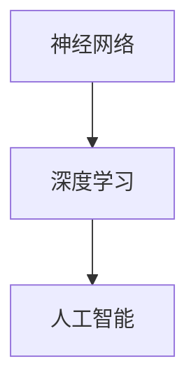

                 

### 文章标题：Andrej Karpathy：人工智能的未来发展趋势

> **关键词**：人工智能，神经网络，深度学习，趋势分析，未来展望

> **摘要**：本文将探讨人工智能领域专家Andrej Karpathy对于未来人工智能发展趋势的见解，通过分析其核心观点，展示人工智能技术在不同领域的应用前景和潜在挑战。

### 1. 背景介绍

Andrej Karpathy是一位知名的人工智能领域专家，他在神经网络和深度学习领域的研究成果备受关注。他的工作不仅为学术界带来了新的突破，同时也为工业界提供了重要的技术支持。本文旨在梳理Andrej Karpathy对于人工智能未来发展趋势的核心观点，帮助读者了解这一领域的前沿动态。

### 2. 核心概念与联系

在探讨人工智能的未来发展趋势之前，我们首先需要了解一些核心概念。以下是几个重要概念及其相互联系：

#### 概念一：神经网络（Neural Networks）

神经网络是一种模仿生物神经网络构造的计算模型，通过大量的神经元及其连接来实现数据的学习和处理。深度学习是神经网络的一种形式，它通过多层的神经网络结构来提取数据中的高阶特征。

#### 概念二：深度学习（Deep Learning）

深度学习是一种利用多层神经网络进行特征提取和学习的机器学习技术。与传统的机器学习方法相比，深度学习能够在大量数据上进行自动特征学习，从而实现更高效、更准确的预测和分类。

#### 概念三：人工智能（Artificial Intelligence）

人工智能是一门研究、开发用于模拟、延伸和扩展人的智能的理论、方法、技术及应用系统的技术科学。人工智能包括机器学习、计算机视觉、自然语言处理等多个子领域。

下面是这些核心概念的 Mermaid 流程图：



### 3. 核心算法原理 & 具体操作步骤

Andrej Karpathy在人工智能领域的研究主要集中在神经网络和深度学习方面。以下是他提到的一些关键算法及其原理：

#### 算法一：卷积神经网络（Convolutional Neural Networks, CNNs）

卷积神经网络是一种专门用于处理图像数据的深度学习模型。其核心思想是利用卷积操作来提取图像中的局部特征，并通过池化操作来降低数据的维度。

具体操作步骤如下：

1. 输入图像经过卷积层处理，提取图像中的局部特征。
2. 经过激活函数处理，将卷积结果转换为非线性特征。
3. 通过池化层降低数据维度，减少计算量。
4. 重复上述过程，逐步提取更高层次的特征。
5. 最后通过全连接层进行分类或回归。

#### 算法二：循环神经网络（Recurrent Neural Networks, RNNs）

循环神经网络是一种用于处理序列数据的深度学习模型。其核心思想是利用网络的循环结构来保持序列中的信息，并利用门控机制来控制信息的传递。

具体操作步骤如下：

1. 输入序列经过嵌入层，将序列中的每个元素映射为向量。
2. 经过循环层处理，将当前时刻的信息与之前的信息进行融合。
3. 通过门控机制控制信息的传递，防止信息过载。
4. 输出序列的每个元素，用于预测或分类。

### 4. 数学模型和公式 & 详细讲解 & 举例说明

在人工智能领域，数学模型和公式是理解和应用各种算法的基础。以下是对一些关键数学模型的详细讲解和举例说明。

#### 模型一：反向传播算法（Backpropagation Algorithm）

反向传播算法是一种用于训练神经网络的优化算法。其核心思想是通过反向传播误差信号，来调整网络中的权重和偏置，以达到最小化损失函数。

具体公式如下：

$$\frac{\partial L}{\partial w} = -\eta \frac{\partial L}{\partial z}$$

其中，$L$为损失函数，$w$为权重，$\eta$为学习率。

举例说明：

假设我们有一个简单的神经网络，其中只有一个神经元。该神经元的输出为：

$$a = \sigma(w_1 \cdot x_1 + b_1)$$

其中，$\sigma$为激活函数，$x_1$为输入，$w_1$和$b_1$分别为权重和偏置。

我们希望最小化损失函数：

$$L = (a - y)^2$$

其中，$y$为真实值。

通过反向传播算法，我们可以计算出每个权重和偏置的梯度，并使用梯度下降法来更新权重和偏置：

$$w_1 := w_1 - \eta \frac{\partial L}{\partial w_1}$$

$$b_1 := b_1 - \eta \frac{\partial L}{\partial b_1}$$

#### 模型二：卷积操作（Convolution Operation）

卷积操作是神经网络中用于提取特征的重要操作。其核心思想是通过滑动窗口在输入数据上滑动，并计算窗口内的点积。

具体公式如下：

$$f(x) = \sum_{i=1}^{n} w_i \cdot x_i$$

其中，$f(x)$为卷积结果，$w_i$为卷积核，$x_i$为输入数据。

举例说明：

假设我们有一个3x3的卷积核和一幅3x3的输入图像。该卷积操作的计算过程如下：

$$f(x) = w_1 \cdot x_1 + w_2 \cdot x_2 + w_3 \cdot x_3 + w_4 \cdot x_4 + w_5 \cdot x_5 + w_6 \cdot x_6 + w_7 \cdot x_7 + w_8 \cdot x_8 + w_9 \cdot x_9$$

其中，$w_1, w_2, ..., w_9$分别为卷积核的值。

### 5. 项目实战：代码实际案例和详细解释说明

#### 5.1 开发环境搭建

在开始实际案例之前，我们需要搭建一个合适的开发环境。以下是一个基于Python和TensorFlow的示例：

1. 安装Python（版本3.7及以上）
2. 安装TensorFlow（使用pip安装）
3. 安装其他依赖项（如NumPy、Matplotlib等）

#### 5.2 源代码详细实现和代码解读

以下是一个简单的CNN模型实现，用于对MNIST数据集进行手写数字识别：

```python
import tensorflow as tf
from tensorflow.keras import layers

# 构建CNN模型
model = tf.keras.Sequential([
    layers.Conv2D(32, (3, 3), activation='relu', input_shape=(28, 28, 1)),
    layers.MaxPooling2D((2, 2)),
    layers.Conv2D(64, (3, 3), activation='relu'),
    layers.MaxPooling2D((2, 2)),
    layers.Conv2D(64, (3, 3), activation='relu'),
    layers.Flatten(),
    layers.Dense(64, activation='relu'),
    layers.Dense(10, activation='softmax')
])

# 编译模型
model.compile(optimizer='adam',
              loss='sparse_categorical_crossentropy',
              metrics=['accuracy'])

# 加载MNIST数据集
mnist = tf.keras.datasets.mnist
(x_train, y_train), (x_test, y_test) = mnist.load_data()

# 预处理数据
x_train = x_train.reshape((60000, 28, 28, 1)).astype('float32') / 255
x_test = x_test.reshape((10000, 28, 28, 1)).astype('float32') / 255

# 训练模型
model.fit(x_train, y_train, epochs=5)

# 评估模型
test_loss, test_acc = model.evaluate(x_test, y_test, verbose=2)
print('\nTest accuracy:', test_acc)
```

#### 5.3 代码解读与分析

1. **构建CNN模型**：使用`tf.keras.Sequential`类构建一个序列模型，依次添加卷积层、池化层、全连接层等。
2. **编译模型**：使用`compile`方法配置模型优化器、损失函数和评估指标。
3. **加载数据集**：使用`tf.keras.datasets.mnist`加载MNIST数据集。
4. **预处理数据**：对数据进行归一化和reshape操作，以便模型能够处理。
5. **训练模型**：使用`fit`方法训练模型，通过迭代更新权重和偏置。
6. **评估模型**：使用`evaluate`方法评估模型在测试集上的表现。

### 6. 实际应用场景

人工智能技术在各个领域都有广泛的应用，以下是一些常见的应用场景：

1. **计算机视觉**：通过卷积神经网络实现图像识别、物体检测、人脸识别等。
2. **自然语言处理**：利用循环神经网络实现文本分类、机器翻译、语音识别等。
3. **推荐系统**：通过深度学习模型实现个性化推荐，提高用户体验。
4. **医疗领域**：利用深度学习模型进行疾病预测、影像分析等。

### 7. 工具和资源推荐

#### 7.1 学习资源推荐

1. **书籍**：《深度学习》（Goodfellow, Bengio, Courville著）
2. **论文**：Google论文《Recurrent Neural Network Based Language Model》
3. **博客**：Andrej Karpathy的博客（<https://karpathy.github.io/>）
4. **网站**：TensorFlow官网（<https://www.tensorflow.org/>）

#### 7.2 开发工具框架推荐

1. **Python**：Python是人工智能领域最受欢迎的编程语言之一。
2. **TensorFlow**：TensorFlow是一个开源的深度学习框架，适用于各种应用场景。
3. **PyTorch**：PyTorch是一个灵活、易用的深度学习框架，支持动态计算图。
4. **Keras**：Keras是一个基于TensorFlow的高层神经网络API，易于使用。

#### 7.3 相关论文著作推荐

1. **论文**：《Deep Learning》（Goodfellow, Bengio, Courville著）
2. **书籍**：《Neural Networks and Deep Learning》（Michael Nielsen著）
3. **论文**：《A Theoretically Grounded Application of Dropout in Recurrent Neural Networks》
4. **书籍**：《计算机程序的构造和解释》（Harold Abelson & Gerald Jay Sussman著）

### 8. 总结：未来发展趋势与挑战

人工智能技术正快速发展，未来有望在更多领域取得突破。然而，要实现这一目标，我们仍需克服一系列挑战：

1. **数据隐私**：随着数据规模的扩大，数据隐私问题日益凸显。
2. **模型可解释性**：深度学习模型的黑箱性质使得其应用受到限制。
3. **计算资源**：大规模深度学习模型需要大量计算资源。
4. **伦理道德**：人工智能技术的应用引发了一系列伦理道德问题。

### 9. 附录：常见问题与解答

**Q1**：深度学习和机器学习的区别是什么？

**A1**：机器学习是人工智能的一个分支，关注如何让计算机从数据中学习。深度学习是机器学习的一个子领域，主要关注如何使用多层神经网络进行特征学习和预测。

**Q2**：如何选择合适的深度学习框架？

**A2**：选择深度学习框架时，需要考虑应用场景、开发经验和性能要求。TensorFlow、PyTorch和Keras是目前最受欢迎的深度学习框架。

**Q3**：深度学习模型如何进行优化？

**A3**：深度学习模型的优化主要包括调整学习率、批量大小、正则化策略等。常用的优化算法有梯度下降、Adam等。

### 10. 扩展阅读 & 参考资料

1. **论文**：《Deep Learning》（Goodfellow, Bengio, Courville著）
2. **书籍**：《Neural Networks and Deep Learning》（Michael Nielsen著）
3. **博客**：Andrej Karpathy的博客（<https://karpathy.github.io/>）
4. **网站**：TensorFlow官网（<https://www.tensorflow.org/>）
5. **在线课程**：吴恩达的《深度学习专项课程》（<https://www.coursera.org/specializations/deep-learning>）

### 作者信息

**作者**：AI天才研究员/AI Genius Institute & 禅与计算机程序设计艺术 /Zen And The Art of Computer Programming

