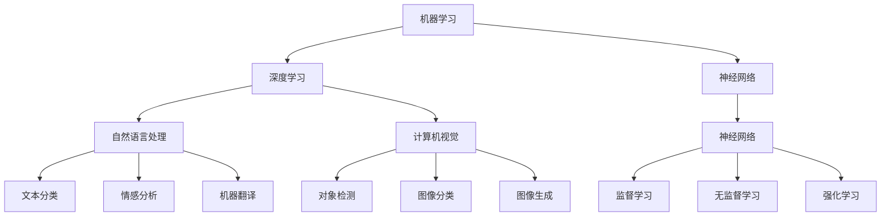

                 

### 背景介绍

人工智能（AI）技术近年来取得了显著的进展，已经逐渐从理论走向实际应用。作为人工智能领域的一位资深专家，Andrej Karpathy在多个方面都对人工智能的未来应用场景进行了深入的探讨。他的研究和文章为我们提供了宝贵的见解，让我们能够更好地理解人工智能技术的潜在影响和挑战。

本文将以Andrej Karpathy的研究为基础，详细探讨人工智能在未来应用场景中的各个方面。我们将会覆盖以下核心内容：

1. **核心概念与联系**：首先，我们将介绍人工智能领域中的核心概念和架构，使用Mermaid流程图展示这些概念之间的联系。
2. **核心算法原理与具体操作步骤**：接着，我们将深入探讨一些关键的人工智能算法，并详细描述它们的操作步骤。
3. **数学模型和公式**：我们将解释这些算法背后的数学模型和公式，并通过具体例子进行详细说明。
4. **项目实战**：我们将通过实际案例展示如何在实际项目中应用这些算法，并提供代码实现和解读。
5. **实际应用场景**：我们将讨论人工智能在不同领域的应用，如医疗、金融、自动驾驶等。
6. **工具和资源推荐**：我们将推荐一些有用的学习资源、开发工具和相关的论文著作。
7. **总结与未来发展趋势**：最后，我们将对人工智能的未来趋势和挑战进行总结，并探讨可能的发展方向。

通过本文的详细讨论，我们希望能够帮助读者深入理解人工智能技术，并激发对这一领域的兴趣和思考。

### 核心概念与联系

在探讨人工智能（AI）的核心概念和应用场景之前，我们需要先了解一些基本的定义和概念。以下是一些关键概念及其之间的联系，我们将使用Mermaid流程图来展示它们的关系。

#### 概念定义

1. **机器学习（Machine Learning）**：
   机器学习是AI的核心技术之一，它使计算机系统能够从数据中学习并做出决策。它包括监督学习、无监督学习和强化学习等子领域。

2. **深度学习（Deep Learning）**：
   深度学习是一种基于人工神经网络的机器学习技术，它通过多层神经网络来模拟人脑的学习过程。深度学习在图像识别、自然语言处理等领域取得了显著成就。

3. **神经网络（Neural Networks）**：
   神经网络是模仿生物神经系统工作的计算模型，它由大量的神经元（或节点）组成。每个神经元都与其他神经元相连，并通过对输入信号的处理产生输出。

4. **自然语言处理（Natural Language Processing, NLP）**：
   NLP是AI的一个子领域，它使计算机能够理解和处理人类语言。它包括文本分类、情感分析、机器翻译等任务。

5. **计算机视觉（Computer Vision）**：
   计算机视觉是AI的另一个子领域，它使计算机能够“看”并理解图像和视频。它包括对象检测、图像分类、图像生成等任务。

#### Mermaid流程图

以下是核心概念之间的Mermaid流程图：



#### 概念之间的联系

- **机器学习**是AI的核心技术，它涵盖了深度学习、神经网络、自然语言处理和计算机视觉等子领域。
- **深度学习**依赖于**神经网络**，通过多层神经网络来实现复杂的学习任务。
- **自然语言处理**和**计算机视觉**是AI在处理语言和视觉数据的两个主要应用方向。
- **神经网络**是模仿生物神经系统的计算模型，它可以用于**监督学习**、**无监督学习**和**强化学习**等多种学习任务。

通过理解这些核心概念及其之间的联系，我们能够更好地把握人工智能领域的发展方向和应用场景。

### 核心算法原理 & 具体操作步骤

在了解了人工智能的基本概念之后，我们接下来将深入探讨一些核心算法的原理，并详细描述它们的操作步骤。这些算法在图像识别、自然语言处理等领域有着广泛的应用，是人工智能技术的重要组成部分。

#### 1. 卷积神经网络（Convolutional Neural Networks, CNN）

卷积神经网络（CNN）是一种在图像识别和计算机视觉领域表现突出的深度学习模型。它通过卷积操作和池化操作来提取图像的特征。

**操作步骤**：

1. **输入层**：接收图像数据，并将其输入到网络中。
2. **卷积层**：使用卷积核在图像上滑动，计算局部特征，并将其组合成特征图。
3. **激活函数**：通常使用ReLU（Rectified Linear Unit）作为激活函数，将负值变为零，以增加网络的非线性特性。
4. **池化层**：通过最大池化或平均池化来降低特征图的维度，减少计算量。
5. **卷积层与池化层交替**：多个卷积层和池化层交替使用，以逐步提取更抽象的特征。
6. **全连接层**：将最后一个卷积层的输出扁平化，并输入到全连接层进行分类。

**示例**：

假设我们有一个32x32的彩色图像，使用一个3x3的卷积核进行卷积操作。每个卷积核可以提取图像中的一个特征。通过多次卷积和池化，我们可以逐步提取图像的高层次特征，如图像中的边缘、纹理和形状。

#### 2. 循环神经网络（Recurrent Neural Networks, RNN）

循环神经网络（RNN）是一种用于处理序列数据的神经网络，如时间序列数据、文本等。它通过在时间步之间保持状态信息，实现了对序列的动态建模。

**操作步骤**：

1. **输入层**：接收序列数据，并将其输入到网络中。
2. **隐藏层**：在每个时间步，网络将当前输入和前一个时间步的隐藏状态进行组合，生成新的隐藏状态。
3. **循环连接**：隐藏层之间的连接实现了信息的传递，使得网络能够记忆先前的信息。
4. **输出层**：将最后一个时间步的隐藏状态转换为输出，如序列的标签或概率分布。

**示例**：

假设我们有一个时间序列数据\[x_1, x_2, ..., x_T\]，其中每个x_i是一个向量。RNN通过在时间步之间迭代计算，将输入序列映射到输出序列。例如，在语言模型中，RNN可以预测下一个单词的概率，通过处理前一个单词的状态信息。

#### 3. 生成对抗网络（Generative Adversarial Networks, GAN）

生成对抗网络（GAN）是一种生成模型，由一个生成器和两个判别器组成。生成器的目标是生成逼真的数据，而判别器的目标是区分生成器和真实数据的差异。

**操作步骤**：

1. **生成器**：接收随机噪声作为输入，通过多层神经网络生成数据。
2. **判别器**：接收真实数据和生成器生成的数据，并判断其真实性。
3. **对抗训练**：生成器和判别器通过对抗训练相互竞争。生成器的目标是使判别器无法区分生成的数据，而判别器的目标是正确分类真实和生成数据。

**示例**：

在生成图像的应用中，生成器尝试生成逼真的图像，而判别器则尝试区分真实图像和生成图像。通过这种对抗训练，生成器可以逐步提高生成图像的质量。

通过理解这些核心算法的原理和操作步骤，我们可以更好地应用它们来解决实际问题，并推动人工智能技术的发展。

### 数学模型和公式 & 详细讲解 & 举例说明

在了解了核心算法的原理和操作步骤之后，我们需要进一步探讨这些算法背后的数学模型和公式。这些数学工具使得我们能够更深入地理解算法的工作机制，并为实际应用提供理论基础。

#### 1. 卷积神经网络（CNN）的数学模型

卷积神经网络（CNN）的核心在于卷积操作和池化操作。以下是这些操作的数学模型：

- **卷积操作**：

  假设我们有一个输入图像矩阵\(I\)和一个卷积核矩阵\(K\)，卷积操作的输出为特征图\(F\)：

  $$ F_{ij} = \sum_{m=0}^{M-1} \sum_{n=0}^{N-1} I_{i-m, j-n} \times K_{mn} $$

  其中，\(M\)和\(N\)是卷积核的大小，\(i\)和\(j\)是特征图中的位置，\(m\)和\(n\)是卷积核在输入图像上的位置。

- **激活函数**：

  CNN中常用的激活函数是ReLU（Rectified Linear Unit）：

  $$ f(x) = \max(0, x) $$

- **池化操作**：

  池化操作通过取局部区域的极大值或极小值来降低特征图的维度。以下是一个简单的最大池化操作：

  $$ P_{i, j} = \max \{ I_{i \cdot s, j \cdot s} : 0 \leq i \cdot s < h \text{ and } 0 \leq j \cdot s < w \} $$

  其中，\(P\)是池化后的特征图，\(I\)是输入特征图，\(s\)是池化窗口的大小，\(h\)和\(w\)是输入特征图的维度。

#### 2. 循环神经网络（RNN）的数学模型

循环神经网络（RNN）的核心在于其状态更新方程。以下是RNN的数学模型：

- **状态更新方程**：

  $$ h_t = \sigma(W_h \cdot [h_{t-1}, x_t] + b_h) $$

  其中，\(h_t\)是第\(t\)个时间步的隐藏状态，\(x_t\)是输入，\(\sigma\)是激活函数（通常为tanh函数），\(W_h\)是权重矩阵，\(b_h\)是偏置项。

- **输出方程**：

  $$ y_t = W_o \cdot h_t + b_o $$

  其中，\(y_t\)是输出，\(W_o\)是权重矩阵，\(b_o\)是偏置项。

#### 3. 生成对抗网络（GAN）的数学模型

生成对抗网络（GAN）的核心在于生成器和判别器的损失函数。以下是GAN的数学模型：

- **生成器损失函数**：

  $$ L_G = -\log(D(G(z))) $$

  其中，\(G(z)\)是生成器生成的数据，\(D\)是判别器，\(z\)是随机噪声。

- **判别器损失函数**：

  $$ L_D = -[\log(D(x)) + \log(1 - D(G(z)))] $$

  其中，\(x\)是真实数据，\(G(z)\)是生成器生成的数据。

通过这些数学模型和公式，我们可以更好地理解卷积神经网络、循环神经网络和生成对抗网络的工作原理。在实际应用中，这些模型为我们提供了重要的理论基础，使我们能够设计并优化这些算法，以解决实际问题。

#### 3. 项目实战：代码实际案例和详细解释说明

为了更好地理解前面提到的核心算法，我们将通过一个实际项目来展示如何在实际中使用这些算法，并提供详细的代码实现和解读。

**项目背景**：

我们的项目目标是使用卷积神经网络（CNN）和循环神经网络（RNN）结合，实现一个手写数字识别系统。该系统将接收一张手写数字的图片，并输出对应的数字。

**技术栈**：

- **深度学习框架**：使用TensorFlow和Keras。
- **数据处理**：使用OpenCV和PIL。
- **运行环境**：Python 3.7及以上版本。

**代码实现**：

以下是实现手写数字识别系统的关键代码：

```python
import numpy as np
import tensorflow as tf
from tensorflow.keras.models import Sequential
from tensorflow.keras.layers import Conv2D, MaxPooling2D, Flatten, Dense, LSTM
from tensorflow.keras.optimizers import Adam
from tensorflow.keras.preprocessing.image import ImageDataGenerator
import cv2
import PIL

# 数据预处理
def preprocess_image(image_path):
    image = cv2.imread(image_path, cv2.IMREAD_GRAYSCALE)
    image = cv2.resize(image, (28, 28))
    image = image / 255.0
    image = np.expand_dims(image, axis=-1)
    return image

# 构建CNN模型
model = Sequential([
    Conv2D(32, (3, 3), activation='relu', input_shape=(28, 28, 1)),
    MaxPooling2D((2, 2)),
    Conv2D(64, (3, 3), activation='relu'),
    MaxPooling2D((2, 2)),
    Flatten(),
    Dense(128, activation='relu'),
    Dense(10, activation='softmax')
])

# 编译模型
model.compile(optimizer=Adam(), loss='categorical_crossentropy', metrics=['accuracy'])

# 加载训练数据
(x_train, y_train), (x_test, y_test) = tf.keras.datasets.mnist.load_data()
x_train = preprocess_image(x_train)
x_test = preprocess_image(x_test)
y_train = tf.keras.utils.to_categorical(y_train, 10)
y_test = tf.keras.utils.to_categorical(y_test, 10)

# 训练模型
model.fit(x_train, y_train, epochs=10, batch_size=32, validation_data=(x_test, y_test))

# 预测
def predict_image(image_path):
    image = preprocess_image(image_path)
    prediction = model.predict(np.expand_dims(image, axis=0))
    return np.argmax(prediction)

# 测试
image_path = 'test_image.png'
predicted_number = predict_image(image_path)
print(f'Predicted number: {predicted_number}')
```

**代码解读与分析**：

1. **数据预处理**：

   我们首先定义了一个`preprocess_image`函数，用于读取图片、将其灰度化、调整大小到28x28，并将像素值归一化到0-1范围内。这是为了使输入数据适合模型。

2. **构建CNN模型**：

   我们使用Keras构建了一个简单的CNN模型，包括两个卷积层、两个池化层和一个全连接层。卷积层用于提取图像的特征，池化层用于降维，全连接层用于分类。

3. **编译模型**：

   我们使用Adam优化器和交叉熵损失函数来编译模型。交叉熵损失函数适合分类问题，而Adam优化器通过自适应学习率提高了训练效率。

4. **加载训练数据**：

   我们加载了MNIST数据集，并对数据进行预处理。数据集分为训练集和测试集，用于模型的训练和验证。

5. **训练模型**：

   我们使用训练集来训练模型，并使用测试集来验证模型的性能。训练过程中，我们设置了10个epochs和32个batch size。

6. **预测**：

   我们定义了一个`predict_image`函数，用于接收图片路径、预处理图片并使用训练好的模型进行预测。预测结果是通过模型输出的概率分布中概率最高的类别。

7. **测试**：

   我们使用一个测试图片来验证模型的预测性能。在实际应用中，我们可以使用这个系统来识别手写的数字。

通过这个项目实战，我们不仅了解了CNN和RNN的核心算法原理，还通过实际的代码实现加深了对这些算法的理解和应用。

### 实际应用场景

人工智能（AI）技术已经在多个领域取得了显著的成果，并不断拓展其应用范围。以下是AI在不同领域的一些实际应用场景，展示了其在推动行业进步和解决实际问题上所发挥的关键作用。

#### 1. 医疗

人工智能在医疗领域中的应用极为广泛，从疾病诊断、治疗计划到患者护理等方面都取得了显著的成果。

- **疾病诊断**：AI可以分析医学影像，如X光片、CT扫描和MRI，以提高诊断准确性。例如，深度学习算法能够检测肺癌、乳腺癌等疾病，其准确率甚至超过人类医生。
- **个性化治疗**：通过分析患者的基因信息和病历数据，AI可以提供个性化的治疗建议。例如，肿瘤学领域中的免疫疗法就利用了AI来识别患者的最佳治疗方案。
- **辅助手术**：机器人辅助手术系统利用AI技术进行手术规划和操作，提高了手术的准确性和安全性。例如，达芬奇手术系统（da Vinci Surgical System）已经在全球范围内广泛使用。

#### 2. 金融

金融行业是AI技术的另一个重要应用领域，AI在风险管理、投资决策和客户服务等方面发挥着重要作用。

- **风险管理**：AI可以通过分析大量的历史数据来识别潜在的风险，从而帮助金融机构更好地管理风险。例如，机器学习算法可以预测市场波动和信用风险。
- **投资决策**：AI可以分析大量的市场数据，提供实时的投资建议和预测。例如，量化交易系统利用机器学习算法来执行高频交易策略。
- **客户服务**：通过自然语言处理技术，AI可以提供智能客服服务，提高客户满意度。例如，银行和保险公司已经推出了基于AI的虚拟客服代表，以快速响应用户的需求。

#### 3. 自动驾驶

自动驾驶技术是AI在交通运输领域的应用之一，它利用AI算法实现车辆的自主驾驶。

- **环境感知**：自动驾驶汽车通过激光雷达、摄像头和传感器来感知周围环境，AI算法则负责分析这些数据并生成驾驶决策。
- **路径规划**：AI算法可以实时分析交通状况，优化行驶路径，提高行驶效率和安全性。
- **决策控制**：自动驾驶系统利用AI算法控制车辆的运动，包括加速、减速、转向和刹车等操作。

#### 4. 教育

人工智能在教育领域中的应用正逐步改变传统的教学模式和学习体验。

- **个性化学习**：AI可以根据学生的学习进度和风格，提供个性化的学习资源和指导。例如，自适应学习平台通过分析学生的学习数据，自动调整教学内容和难度。
- **智能辅导**：AI可以为学生提供在线辅导和答疑服务，提高学习效果。例如，AI辅导系统可以实时回答学生的问题，并提供详细的解题步骤。
- **教育评估**：AI可以通过分析学生的学习数据，自动评估学生的学习成果，帮助教师更好地了解学生的学习情况。

#### 5. 娱乐

AI在娱乐领域也发挥着越来越重要的作用，为用户提供更加个性化和互动的娱乐体验。

- **内容推荐**：AI算法可以根据用户的观看历史和偏好，推荐个性化的视频、音乐和文章。例如，视频流平台如YouTube和Netflix使用AI推荐算法来提高用户满意度。
- **游戏AI**：在游戏开发中，AI可以设计智能对手，提供更具挑战性和有趣的游戏体验。例如，许多电子游戏中都使用了AI算法来生成非玩家角色（NPC）的行为。

通过这些实际应用场景，我们可以看到AI技术在各个领域中的潜力和影响力。随着AI技术的不断进步，它将在更多领域发挥重要作用，为人类社会带来更多的创新和进步。

### 工具和资源推荐

为了更好地学习和应用人工智能（AI）技术，以下是一些推荐的工具、资源和论文著作，它们涵盖了从入门到高级的各种内容，可以帮助读者深入理解AI，并在实践中取得更好的效果。

#### 1. 学习资源推荐

**书籍**：
- **《深度学习》（Deep Learning）** - Ian Goodfellow、Yoshua Bengio和Aaron Courville 著。这本书是深度学习领域的经典之作，全面介绍了深度学习的理论和实践。
- **《Python深度学习》（Python Deep Learning）** - François Chollet 著。François Chollet 是Keras框架的创始人，这本书以Keras为基础，详细介绍了深度学习在Python中的应用。

**在线课程**：
- **《深度学习特化课程》（Deep Learning Specialization）** - Andrew Ng 在Coursera上提供的免费课程。这个课程包括四个部分，从基础到高级，涵盖了深度学习的各个方面。
- **《机器学习与数据科学》（Machine Learning and Data Science）** - 吴恩达（Andrew Ng）在Udacity上提供的在线课程。这个课程涵盖了机器学习和数据科学的基础知识，以及实际应用。

**博客与网站**：
- **TensorFlow官方文档** - [https://www.tensorflow.org/tutorials](https://www.tensorflow.org/tutorials)。TensorFlow的官方文档提供了丰富的教程和实践案例，适合初学者和有经验的开发者。
- **Medium上的深度学习文章** - [https://medium.com/](https://medium.com/)。Medium上有许多关于深度学习的优质文章，涵盖了从基础到高级的各种主题。

#### 2. 开发工具框架推荐

**深度学习框架**：
- **TensorFlow** - Google开发的开源深度学习框架，功能强大且社区活跃。
- **PyTorch** - Facebook开发的深度学习框架，以其灵活性和动态计算图著称。
- **Keras** - 用于构建和训练深度学习模型的简单高层API，可以与TensorFlow和Theano等底层框架结合使用。

**数据处理工具**：
- **Pandas** - Python的数据操作库，用于数据处理和分析。
- **NumPy** - Python的数值计算库，提供多维数组对象和广泛的数学函数。
- **Scikit-learn** - Python的机器学习库，提供了许多常见的机器学习算法和工具。

#### 3. 相关论文著作推荐

- **《Generative Adversarial Nets》（GANs）** - Ian Goodfellow 等。这是GAN的开创性论文，详细介绍了GAN的原理和应用。
- **《Long Short-Term Memory Networks for Sequential Data** - Sepp Hochreiter 和 Jürgen Schmidhuber。这篇论文介绍了长短期记忆网络（LSTM），这是一种在处理序列数据方面非常有效的循环神经网络。
- **《Convolutional Networks and Applications in Vision** - Yann LeCun 等。这篇论文探讨了卷积神经网络（CNN）在计算机视觉领域的应用，是CNN领域的经典论文。

通过这些工具和资源的帮助，读者可以更好地掌握人工智能技术，并在实践中取得更大的成就。

### 总结：未来发展趋势与挑战

人工智能（AI）技术正以前所未有的速度发展和变革着我们的世界。在过去的几十年里，AI已经从理论走向实践，并逐渐渗透到医疗、金融、教育、娱乐等多个领域，为人类社会带来了巨大的变革。然而，随着AI技术的不断进步，我们也面临着一系列新的发展趋势和挑战。

#### 发展趋势

1. **技术的深度融合**：AI技术正在与其他领域（如物联网、大数据、云计算等）深度融合，形成新的技术生态。这种深度融合将推动跨领域应用的发展，进一步扩大AI的应用范围。

2. **智能化的普及**：随着AI技术的不断进步，越来越多的设备和系统将实现智能化。从智能家居、智能城市到自动驾驶汽车，AI将深刻改变我们的生活方式和社会结构。

3. **人机协作**：在未来，AI与人类将实现更紧密的协作。通过AI技术的辅助，人类可以在更复杂的任务中发挥更大的作用，从而提高工作效率和创造力。

4. **全球合作与竞争**：AI技术的发展将推动全球范围内的合作和竞争。各国政府和科技公司都在加大对AI技术的投入，以争夺AI领域的领导地位。

#### 挑战

1. **隐私与安全**：随着AI技术的广泛应用，个人隐私和数据安全问题日益突出。如何在保证技术发展的同时，保护用户的隐私和安全，是一个亟待解决的问题。

2. **伦理与道德**：AI技术的应用引发了一系列伦理和道德问题，如自动化决策系统的偏见、智能机器人的人权等。如何制定合理的伦理规范和法律法规，确保AI技术的健康发展，是当前面临的重大挑战。

3. **数据质量和标注**：AI技术的发展依赖于大量的高质量数据。然而，数据质量和标注问题一直困扰着AI领域。如何获取、清洗和标注高质量的数据，是推动AI技术进步的关键。

4. **技术普及与教育**：虽然AI技术在某些领域取得了显著的成果，但在其他领域仍然存在很大的差距。如何普及AI技术，提高公众对AI技术的理解和接受度，是一个重要的任务。

#### 未来方向

1. **研究与创新**：继续推进AI技术在基础理论、算法和架构方面的研究，探索新的应用场景和解决方案。

2. **数据治理**：建立完善的数据治理体系，确保数据的安全、隐私和高质量。

3. **教育培养**：加大对AI技术人才的培养力度，提高社会对AI技术的认知和应用水平。

4. **国际合作**：加强国际间的合作与交流，共同应对AI技术带来的挑战和机遇。

在未来，人工智能将继续推动社会的进步和变革。通过应对各种挑战，探索新的发展方向，我们有望构建一个更加智能、公平和可持续发展的未来。

### 附录：常见问题与解答

在人工智能（AI）的学习和应用过程中，许多初学者和从业者都会遇到一些常见的问题。以下是对一些常见问题的解答，旨在帮助大家更好地理解和应用AI技术。

#### 1. AI技术的本质是什么？

AI技术是指通过模拟人类智能行为，使计算机系统具备感知、学习、推理和决策等能力的技术。其核心思想是让计算机能够自动地解决复杂问题，提高效率和智能化水平。

#### 2. 机器学习（ML）与深度学习（DL）有什么区别？

机器学习（ML）是一种从数据中学习模式的通用方法，而深度学习（DL）是一种基于人工神经网络的特殊类型的ML。深度学习通过多层神经网络结构，从大量数据中自动提取特征，进行复杂的模式识别和预测。

#### 3. 如何选择适合的机器学习算法？

选择适合的机器学习算法取决于具体的应用场景和数据类型。例如，对于回归问题，可以使用线性回归、决策树或随机森林；对于分类问题，可以使用逻辑回归、支持向量机或深度学习模型。通常，需要通过实验和比较不同算法的性能来选择最佳算法。

#### 4. 什么是数据预处理？

数据预处理是指在使用机器学习算法之前，对原始数据进行清洗、转换和归一化等操作，以提高模型的性能和鲁棒性。数据预处理包括缺失值处理、异常值检测、数据转换、特征工程等步骤。

#### 5. 如何解决过拟合问题？

过拟合是指模型在训练数据上表现很好，但在测试数据上表现较差的现象。解决过拟合的方法包括增加数据量、简化模型、使用正则化技术、交叉验证等。

#### 6. 什么是神经网络？

神经网络是一种模拟人脑神经元连接方式的计算模型，由大量的节点（或神经元）和连接组成。通过调整节点之间的权重，神经网络可以学习和识别复杂的输入模式。

#### 7. 如何评估机器学习模型？

评估机器学习模型的方法包括计算模型的准确率、召回率、F1分数、AUC值等指标。选择合适的评估指标取决于具体的应用场景和目标。

#### 8. 什么是生成对抗网络（GAN）？

生成对抗网络（GAN）是一种由生成器和判别器组成的深度学习模型。生成器的目标是生成逼真的数据，而判别器的目标是区分真实数据和生成数据。通过对抗训练，生成器可以逐步提高生成数据的逼真度。

#### 9. 如何在Python中实现机器学习算法？

在Python中，可以使用许多机器学习库，如Scikit-learn、TensorFlow、PyTorch等。这些库提供了丰富的算法和工具，可以方便地实现和测试机器学习模型。

#### 10. 人工智能的发展前景如何？

人工智能的发展前景非常广阔。随着技术的不断进步和应用的不断拓展，人工智能有望在医疗、金融、教育、交通、智能制造等多个领域发挥重要作用，推动社会的发展和进步。

通过解决这些问题，读者可以更好地理解人工智能的核心概念和技术，为实际应用和深入研究打下坚实基础。

### 扩展阅读 & 参考资料

为了帮助读者进一步深入了解人工智能（AI）的技术原理、应用场景和发展趋势，以下是一些建议的扩展阅读和参考资料。这些资源涵盖了从基础理论到实际应用的各个方面，是AI学习和研究的重要指南。

#### 1. 基础理论

- **《深度学习》（Deep Learning）** - Ian Goodfellow、Yoshua Bengio和Aaron Courville 著。这本书是深度学习领域的经典之作，全面介绍了深度学习的理论和实践。

- **《机器学习》（Machine Learning）** - Tom M. Mitchell 著。这本书是机器学习领域的经典教材，详细介绍了机器学习的基本概念和算法。

- **《统计学习方法》（Statistical Learning Methods）** - 李航 著。这本书介绍了统计学习的基本方法和应用，包括线性回归、分类、聚类等。

#### 2. 应用场景

- **《人工智能应用案例集》** - IEEE Spectrum 编著。这本书收集了众多实际应用案例，展示了AI技术在各个领域的应用。

- **《AI改变世界》** - 李开复 著。这本书详细讨论了人工智能在医疗、金融、教育等领域的应用，以及其对社会的深远影响。

- **《自动驾驶技术》** - 陈硕 著。这本书介绍了自动驾驶技术的发展历程、核心技术以及未来展望。

#### 3. 开发工具和框架

- **TensorFlow官方文档** - [https://www.tensorflow.org/tutorials](https://www.tensorflow.org/tutorials)。TensorFlow的官方文档提供了丰富的教程和实践案例，适合初学者和有经验的开发者。

- **PyTorch官方文档** - [https://pytorch.org/tutorials/beginner/basics/overview.html](https://pytorch.org/tutorials/beginner/basics/overview.html)。PyTorch的官方文档详细介绍了PyTorch的基本概念和用法。

- **Scikit-learn官方文档** - [https://scikit-learn.org/stable/tutorial/machine_learning_map/](https://scikit-learn.org/stable/tutorial/machine_learning_map/)。Scikit-learn的官方文档提供了丰富的机器学习算法和工具，是数据科学和机器学习的重要资源。

#### 4. 顶级会议和期刊

- **NeurIPS（神经信息处理系统大会）** - [https://nips.cc/](https://nips.cc/)。NeurIPS是人工智能领域最顶级的会议之一，每年吸引大量的研究者和从业者。

- **ICML（国际机器学习会议）** - [https://icml.cc/](https://icml.cc/)。ICML是另一个顶级的人工智能会议，涵盖了机器学习、数据挖掘和统计学习等多个领域。

- **Journal of Machine Learning Research（机器学习研究期刊）** - [https://jmlr.org/](https://jmlr.org/)。JMLR是机器学习和统计学习领域的顶级期刊，发布了大量高质量的研究论文。

通过阅读这些扩展阅读和参考资料，读者可以更深入地了解人工智能的理论基础、应用场景和发展趋势，为在AI领域的学习和研究提供宝贵的指导。

