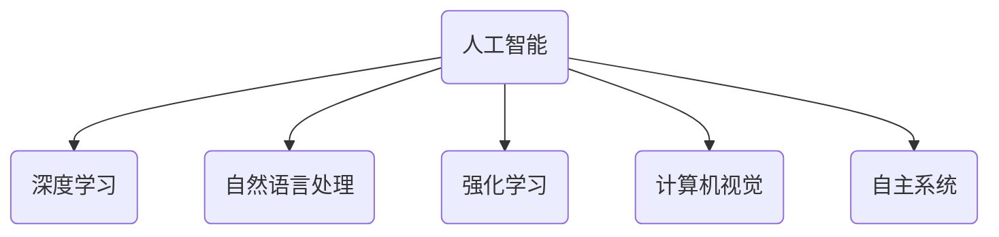

                 

# Andrej Karpathy：人工智能的未来趋势

## 关键词

* 人工智能
* 未来趋势
* 深度学习
* 自然语言处理
* 强化学习
* 计算机视觉
* 自主系统

## 摘要

本文将深入探讨人工智能（AI）领域的未来趋势。通过对当前人工智能技术的研究与应用的全面分析，本文旨在揭示AI在深度学习、自然语言处理、强化学习、计算机视觉以及自主系统等领域的最新进展，并对其未来发展方向进行预测。同时，本文还将探讨AI技术的潜在挑战和解决方案，为读者提供全面而深入的理解。

## 1. 背景介绍

### 人工智能的定义与历史

人工智能（AI）是指计算机系统模拟人类智能的行为和决策能力的科学。它包括机器学习、深度学习、自然语言处理、计算机视觉等多个子领域。AI的概念最早可以追溯到1956年的达特茅斯会议，当时图灵提出了“机器能思考吗？”的著名问题，标志着人工智能领域的正式诞生。

在过去的几十年中，人工智能经历了多个发展阶段。早期的人工智能主要基于规则和逻辑推理，但受到数据稀缺和计算能力的限制，发展缓慢。随着计算机硬件性能的提升和大数据的涌现，深度学习和机器学习逐渐成为主流技术。特别是2012年，深度学习在图像识别任务上取得了突破性进展，引发了人工智能领域的革命。

### 人工智能的应用领域

人工智能在众多领域取得了显著的成果。例如，计算机视觉技术在图像识别、人脸识别、自动驾驶等方面得到了广泛应用；自然语言处理技术在语音识别、机器翻译、情感分析等方面发挥了重要作用；强化学习在游戏、推荐系统、智能机器人等领域展现出了强大的潜力。

### 当前人工智能的挑战

尽管人工智能取得了许多突破，但仍面临一些挑战。数据质量和隐私问题是AI发展的关键障碍。此外，人工智能的透明性和可解释性也是当前研究的热点。如何确保AI系统的公平性和安全性，避免歧视和误判，是AI领域亟待解决的问题。

## 2. 核心概念与联系

### 深度学习

深度学习是一种基于人工神经网络的机器学习技术。它通过多层次的神经网络结构，从大量数据中自动学习特征表示，从而实现复杂的模式识别和预测任务。深度学习的核心组件包括卷积神经网络（CNN）、循环神经网络（RNN）和生成对抗网络（GAN）等。

### 自然语言处理

自然语言处理（NLP）是人工智能的一个子领域，旨在使计算机理解和生成自然语言。NLP的关键技术包括词向量、序列标注、机器翻译、情感分析等。近年来，基于深度学习的NLP模型取得了显著的进展，如BERT、GPT等。

### 强化学习

强化学习是一种通过与环境互动来学习最优策略的机器学习技术。它通过奖励和惩罚机制，使模型在特定任务中不断优化行为。强化学习在游戏、推荐系统、自动驾驶等领域具有广泛的应用潜力。

### 计算机视觉

计算机视觉是人工智能的一个子领域，旨在使计算机从图像或视频中提取有用的信息。计算机视觉的关键技术包括图像识别、目标检测、图像分割等。深度学习在计算机视觉领域取得了许多突破性成果，如卷积神经网络（CNN）在图像识别任务上的广泛应用。

### 自主系统

自主系统是一种能够自主执行任务，不需要人类干预的智能系统。自主系统包括自动驾驶汽车、无人机、智能机器人等。自主系统的核心是智能感知、智能决策和智能执行，这些都需要人工智能技术的支持。

### Mermaid 流程图



## 3. 核心算法原理 & 具体操作步骤

### 深度学习

深度学习的核心算法是神经网络。神经网络由多个层次组成，每个层次包含多个节点（神经元）。每个节点接收来自前一层节点的输入，并通过权重和激活函数进行非线性变换，最终输出一个预测值。

具体操作步骤如下：

1. 数据预处理：对输入数据进行归一化、去噪等处理，以提高模型的性能。
2. 构建神经网络：定义网络结构，包括输入层、隐藏层和输出层。
3. 初始化参数：随机初始化网络的权重和偏置。
4. 前向传播：计算网络在给定输入下的预测值。
5. 计算损失函数：比较预测值与真实值的差异，计算损失函数。
6. 反向传播：通过梯度下降等优化算法，更新网络参数。
7. 模型评估：在测试集上评估模型的性能。

### 自然语言处理

自然语言处理的核心算法是词嵌入、序列标注和生成模型。词嵌入将词语映射为高维向量，用于表示词语的语义信息。序列标注通过标签来表示词语的语法功能。生成模型则用于生成新的文本。

具体操作步骤如下：

1. 数据预处理：对文本数据进行分词、去停用词等处理。
2. 词嵌入：将词语映射为向量表示。
3. 序列标注：使用标注模型对词语进行语法功能标注。
4. 生成模型：使用生成模型生成新的文本。

### 强化学习

强化学习的核心算法是策略迭代和价值迭代。策略迭代通过不断更新策略来优化行为，而价值迭代通过评估策略的预期回报来优化策略。

具体操作步骤如下：

1. 初始化策略或价值函数。
2. 在环境中进行交互，收集经验。
3. 更新策略或价值函数，以最大化预期回报。
4. 评估策略或价值函数的性能。

### 计算机视觉

计算机视觉的核心算法是卷积神经网络（CNN）。CNN通过多层卷积和池化操作，从图像中提取有效的特征表示。

具体操作步骤如下：

1. 数据预处理：对图像数据进行归一化、裁剪等处理。
2. 构建CNN模型：定义网络结构，包括卷积层、池化层和全连接层。
3. 训练模型：通过大量图像数据进行训练。
4. 预测：在给定图像数据下，使用训练好的模型进行预测。

### 自主系统

自主系统的核心算法是智能感知、智能决策和智能执行。智能感知通过传感器获取环境信息，智能决策通过分析感知信息进行决策，智能执行则执行具体的任务。

具体操作步骤如下：

1. 感知：通过传感器获取环境信息。
2. 决策：使用感知信息进行分析，生成决策。
3. 执行：执行具体的任务。

## 4. 数学模型和公式 & 详细讲解 & 举例说明

### 深度学习

深度学习的核心数学模型是神经网络。神经网络由多个层次组成，每个层次包含多个节点（神经元）。每个节点接收来自前一层节点的输入，并通过权重和激活函数进行非线性变换，最终输出一个预测值。

具体数学公式如下：

$$
a_{l} = \sigma(W_{l-1}a_{l-1} + b_{l-1})
$$

其中，$a_{l}$表示第$l$层的输出，$\sigma$表示激活函数，$W_{l-1}$和$b_{l-1}$分别表示第$l-1$层的权重和偏置。

举例说明：

假设我们有一个简单的神经网络，包括一个输入层、一个隐藏层和一个输出层。输入层有3个节点，隐藏层有2个节点，输出层有1个节点。激活函数为ReLU函数。

输入层到隐藏层的权重矩阵为$W_{0}$，偏置向量$b_{0}$，隐藏层到输出层的权重矩阵为$W_{1}$，偏置向量$b_{1}$。

输入数据$x$为：

$$
x = \begin{bmatrix}
1 \\
0 \\
1
\end{bmatrix}
$$

隐藏层输出$a_{0}$为：

$$
a_{0} = \sigma(W_{0}x + b_{0}) = \begin{bmatrix}
\max(0, W_{0,0,0}x_0 + b_{0,0}) \\
\max(0, W_{0,1,0}x_0 + b_{0,1}) \\
\max(0, W_{0,1,1}x_1 + b_{0,1}) \\
\max(0, W_{0,1,2}x_2 + b_{0,1})
\end{bmatrix}
$$

输出层输出$a_{1}$为：

$$
a_{1} = \sigma(W_{1}a_{0} + b_{1}) = \max(0, W_{1,0,0}a_{0,0} + b_{1,0}) + \max(0, W_{1,1,0}a_{0,1} + b_{1,0})
$$

### 自然语言处理

自然语言处理的核心数学模型是词嵌入和序列标注。词嵌入将词语映射为高维向量，用于表示词语的语义信息。序列标注通过标签来表示词语的语法功能。

具体数学公式如下：

$$
\text{word\_embedding}(w) = \begin{bmatrix}
\text{vec}(w_1) \\
\text{vec}(w_2) \\
\vdots \\
\text{vec}(w_n)
\end{bmatrix}
$$

$$
\text{sequence\_labeling}(x) = \begin{bmatrix}
\text{softmax}(W_{1}x + b_{1}) \\
\text{softmax}(W_{2}x + b_{2}) \\
\vdots \\
\text{softmax}(W_{n}x + b_{n})
\end{bmatrix}
$$

其中，$w$表示词语，$x$表示序列，$W$和$b$分别表示权重和偏置。

举例说明：

假设我们有一个简单的词嵌入模型，包含2个词语“apple”和“banana”。词嵌入向量分别为$\text{vec}(apple)$和$\text{vec}(banana)$。

序列“apple banana”的词嵌入表示为：

$$
\text{word\_embedding}(\text{apple banana}) = \begin{bmatrix}
\text{vec}(\text{apple}) \\
\text{vec}(\text{banana})
\end{bmatrix}
$$

假设我们有一个简单的序列标注模型，包含2个标签“名词”和“动词”。标签向量分别为$\text{vec}(\text{名词})$和$\text{vec}(\text{动词})$。

序列“apple banana”的序列标注表示为：

$$
\text{sequence\_labeling}(\text{apple banana}) = \begin{bmatrix}
\text{softmax}(W_{1}\text{vec}(\text{apple}) + b_{1}) \\
\text{softmax}(W_{2}\text{vec}(\text{banana}) + b_{2})
\end{bmatrix}
$$

### 强化学习

强化学习的核心数学模型是策略迭代和价值迭代。策略迭代通过不断更新策略来优化行为，而价值迭代通过评估策略的预期回报来优化策略。

具体数学公式如下：

$$
\pi^{\pi} = \arg\max_{\pi} \sum_{s \in S} p(s) \sum_{a \in A} \pi(a|s) R(s, a)
$$

$$
V^{\pi}(s) = \sum_{a \in A} \pi(a|s) \sum_{s' \in S} p(s'|s, a) R(s, a, s')
$$

其中，$\pi$表示策略，$s$表示状态，$a$表示动作，$s'$表示下一状态，$R$表示回报。

举例说明：

假设我们有一个简单的强化学习问题，包括3个状态$s_1, s_2, s_3$和2个动作$a_1, a_2$。策略$\pi$定义为：

$$
\pi(a|s) = \begin{cases}
0.5 & \text{if } s = s_1 \\
0.2 & \text{if } s = s_2 \\
0.3 & \text{if } s = s_3
\end{cases}
$$

回报函数$R(s, a, s')$定义为：

$$
R(s, a, s') = \begin{cases}
1 & \text{if } a = a_1 \text{ and } s' = s_2 \\
-1 & \text{if } a = a_2 \text{ and } s' = s_3 \\
0 & \text{otherwise}
\end{cases}
$$

根据策略迭代公式，我们可以计算出最优策略$\pi^{\pi}$：

$$
\pi^{\pi}(s) = \arg\max_{a} \sum_{s' \in S} p(s'|s, a) R(s, a, s')
$$

根据价值迭代公式，我们可以计算出最优价值函数$V^{\pi}$：

$$
V^{\pi}(s) = \sum_{a \in A} \pi(a|s) R(s, a, s')
$$

### 计算机视觉

计算机视觉的核心数学模型是卷积神经网络（CNN）。CNN通过多层卷积和池化操作，从图像中提取有效的特征表示。

具体数学公式如下：

$$
h_{l}(x) = \sigma(W_{l} \cdot h_{l-1} + b_{l})
$$

$$
p_{l}(x) = \frac{1}{1 + \exp(-h_{l}(x))}
$$

其中，$h_{l}(x)$表示第$l$层的输出，$W_{l}$和$b_{l}$分别表示第$l$层的权重和偏置，$\sigma$表示激活函数，$p_{l}(x)$表示第$l$层的预测概率。

举例说明：

假设我们有一个简单的CNN模型，包括2个卷积层和1个全连接层。卷积层1的权重矩阵为$W_{1}$，偏置向量为$b_{1}$，卷积层2的权重矩阵为$W_{2}$，偏置向量为$b_{2}$，全连接层的权重矩阵为$W_{3}$，偏置向量为$b_{3}$。激活函数为ReLU函数。

输入图像$x$为：

$$
x = \begin{bmatrix}
1 & 1 \\
1 & 1
\end{bmatrix}
$$

卷积层1的输出$h_{1}$为：

$$
h_{1} = \sigma(W_{1} \cdot x + b_{1}) = \begin{bmatrix}
\max(0, W_{1,0,0}x_0 + W_{1,0,1}x_1 + b_{1,0}) \\
\max(0, W_{1,1,0}x_0 + W_{1,1,1}x_1 + b_{1,1})
\end{bmatrix}
$$

卷积层2的输出$h_{2}$为：

$$
h_{2} = \sigma(W_{2} \cdot h_{1} + b_{2}) = \begin{bmatrix}
\max(0, W_{2,0,0}h_{1,0} + W_{2,0,1}h_{1,1} + b_{2,0}) \\
\max(0, W_{2,1,0}h_{1,0} + W_{2,1,1}h_{1,1} + b_{2,1})
\end{bmatrix}
$$

全连接层的输出$p_{3}$为：

$$
p_{3} = \frac{1}{1 + \exp(-W_{3} \cdot h_{2} + b_{3})}
$$

## 5. 项目实战：代码实际案例和详细解释说明

### 5.1 开发环境搭建

为了演示人工智能技术的应用，我们选择一个简单的项目——手写数字识别。首先，我们需要搭建一个Python开发环境。

1. 安装Python 3.x版本。
2. 安装深度学习库TensorFlow。
3. 安装科学计算库NumPy。

安装命令如下：

```bash
pip install python==3.x
pip install tensorflow
pip install numpy
```

### 5.2 源代码详细实现和代码解读

接下来，我们将实现一个手写数字识别项目，使用TensorFlow的深度学习API。

```python
import tensorflow as tf
from tensorflow.keras import layers
import numpy as np

# 加载MNIST数据集
(x_train, y_train), (x_test, y_test) = tf.keras.datasets.mnist.load_data()

# 数据预处理
x_train = x_train.reshape(-1, 28, 28, 1).astype("float32") / 255.0
x_test = x_test.reshape(-1, 28, 28, 1).astype("float32") / 255.0
y_train = tf.keras.utils.to_categorical(y_train, 10)
y_test = tf.keras.utils.to_categorical(y_test, 10)

# 构建CNN模型
model = tf.keras.Sequential([
    layers.Conv2D(32, (3, 3), activation="relu", input_shape=(28, 28, 1)),
    layers.MaxPooling2D((2, 2)),
    layers.Conv2D(64, (3, 3), activation="relu"),
    layers.MaxPooling2D((2, 2)),
    layers.Flatten(),
    layers.Dense(64, activation="relu"),
    layers.Dense(10, activation="softmax")
])

# 编译模型
model.compile(optimizer="adam", loss="categorical_crossentropy", metrics=["accuracy"])

# 训练模型
model.fit(x_train, y_train, epochs=10, batch_size=32, validation_split=0.1)

# 评估模型
loss, accuracy = model.evaluate(x_test, y_test)
print(f"Test accuracy: {accuracy:.2f}")

# 预测
predictions = model.predict(x_test[:10])
print(predictions.argmax(axis=1))
```

### 5.3 代码解读与分析

1. **数据加载与预处理**

   我们使用TensorFlow的内置函数加载MNIST数据集。数据集包括60000个训练样本和10000个测试样本，每个样本是一个28x28的灰度图像。

   ```python
   (x_train, y_train), (x_test, y_test) = tf.keras.datasets.mnist.load_data()
   ```

   为了使模型更容易训练，我们对图像进行归一化，将像素值范围从0到255缩放到0到1。

   ```python
   x_train = x_train.reshape(-1, 28, 28, 1).astype("float32") / 255.0
   x_test = x_test.reshape(-1, 28, 28, 1).astype("float32") / 255.0
   ```

2. **构建CNN模型**

   我们使用TensorFlow的Keras API构建一个简单的卷积神经网络（CNN）。CNN由卷积层、池化层和全连接层组成。

   ```python
   model = tf.keras.Sequential([
       layers.Conv2D(32, (3, 3), activation="relu", input_shape=(28, 28, 1)),
       layers.MaxPooling2D((2, 2)),
       layers.Conv2D(64, (3, 3), activation="relu"),
       layers.MaxPooling2D((2, 2)),
       layers.Flatten(),
       layers.Dense(64, activation="relu"),
       layers.Dense(10, activation="softmax")
   ])
   ```

   - **卷积层1**：32个卷积核，大小为3x3，激活函数为ReLU。
   - **池化层1**：2x2的最大池化。
   - **卷积层2**：64个卷积核，大小为3x3，激活函数为ReLU。
   - **池化层2**：2x2的最大池化。
   - **全连接层1**：64个神经元，激活函数为ReLU。
   - **全连接层2**：10个神经元，用于分类，激活函数为softmax。

3. **编译模型**

   我们使用Adam优化器和交叉熵损失函数来编译模型。交叉熵损失函数适用于多分类问题。

   ```python
   model.compile(optimizer="adam", loss="categorical_crossentropy", metrics=["accuracy"])
   ```

4. **训练模型**

   我们使用训练集进行模型训练，设置10个epochs，每个批次包含32个样本。

   ```python
   model.fit(x_train, y_train, epochs=10, batch_size=32, validation_split=0.1)
   ```

5. **评估模型**

   我们使用测试集评估模型的准确性。

   ```python
   loss, accuracy = model.evaluate(x_test, y_test)
   print(f"Test accuracy: {accuracy:.2f}")
   ```

6. **预测**

   我们使用训练好的模型对测试集的前10个样本进行预测。

   ```python
   predictions = model.predict(x_test[:10])
   print(predictions.argmax(axis=1))
   ```

## 6. 实际应用场景

### 自然语言处理

自然语言处理技术在许多领域得到了广泛应用。例如，在社交媒体分析中，自然语言处理可以用于情感分析和话题识别，帮助企业了解用户需求和市场趋势。在智能客服中，自然语言处理可以用于处理用户提问，提供自动化的回答，提高客户满意度。

### 计算机视觉

计算机视觉技术在安防监控、医疗诊断、自动驾驶等领域具有广泛的应用。例如，在安防监控中，计算机视觉可以用于人脸识别、行为分析，提高安全性能。在医疗诊断中，计算机视觉可以用于疾病检测和病变识别，辅助医生做出更准确的诊断。

### 强化学习

强化学习在游戏、推荐系统和智能机器人等领域具有广泛的应用。例如，在游戏中，强化学习可以用于开发智能对手，提高游戏体验。在推荐系统中，强化学习可以用于个性化推荐，提高用户满意度。在智能机器人中，强化学习可以用于路径规划、任务执行等，提高机器人的自主性。

### 自主系统

自主系统在自动驾驶、无人机配送、智能工厂等领域具有广泛的应用。例如，在自动驾驶中，自主系统可以用于环境感知、路径规划，实现无人驾驶。在无人机配送中，自主系统可以用于无人机导航、物流配送，提高配送效率。在智能工厂中，自主系统可以用于自动化生产、设备维护，提高生产效率。

## 7. 工具和资源推荐

### 7.1 学习资源推荐

- **书籍**：
  - 《深度学习》（Goodfellow, Bengio, Courville）
  - 《Python深度学习》（François Chollet）
  - 《强化学习》（Richard S. Sutton and Andrew G. Barto）

- **论文**：
  - “A Theoretical Framework for Back-Propagating Neural Networks”（Rumelhart, Hinton, Williams）
  - “Learning to Detect Objects in Images via a New Back-Propagation Network”（LeCun, Bengio, Hashimoto）
  - “Deep Learning: Methods and Applications”（Goodfellow, Courville, Bengio）

- **博客**：
  - Distill
  - Chris Olah的博客
  - Fast.ai的博客

- **网站**：
  - TensorFlow
  - PyTorch
  - GitHub

### 7.2 开发工具框架推荐

- **深度学习框架**：
  - TensorFlow
  - PyTorch
  - Keras

- **自然语言处理工具**：
  - NLTK
  - SpaCy
  - Stanford NLP

- **计算机视觉库**：
  - OpenCV
  - PIL
  - TensorFlow Object Detection API

- **强化学习库**：
  - OpenAI Gym
  - Stable Baselines
  - TensorFlow Agents

### 7.3 相关论文著作推荐

- “Back-Propagation：用于计算神经网络的误差的快速算法”（Rumelhart, Hinton, Williams）
- “A Fast Learning Algorithm for Deep Belief Nets”（Hinton, Osindero, Teh）
- “Recurrent Neural Network Based Language Model for Mandarin Conversational Speech”（Bengio, Simard, Frasconi）
- “Deep Learning for Speech Recognition”（Hinton, Deng, Yu）

## 8. 总结：未来发展趋势与挑战

### 发展趋势

1. **多模态学习**：未来的人工智能将能够处理多种类型的输入，如文本、图像、声音等，实现更全面的信息处理。
2. **自主系统**：随着人工智能技术的进步，自主系统将在更多领域得到应用，实现更高的自动化水平。
3. **可解释性与透明性**：人工智能系统将更加注重可解释性和透明性，以提高用户信任度和监管合规性。
4. **数据隐私保护**：随着数据隐私问题的日益突出，人工智能将更加注重数据隐私保护，确保用户隐私安全。

### 挑战

1. **数据质量和隐私**：如何获取高质量的数据，同时保护用户隐私，是当前人工智能面临的重要挑战。
2. **算法公平性与安全性**：如何确保人工智能算法的公平性和安全性，避免歧视和误判，是当前研究的热点。
3. **计算资源与能耗**：随着人工智能应用的不断扩大，计算资源和能耗问题将日益突出，需要寻求更高效的解决方案。

## 9. 附录：常见问题与解答

### Q1：什么是深度学习？

A1：深度学习是一种基于人工神经网络的机器学习技术，通过多层次的神经网络结构，从大量数据中自动学习特征表示，实现复杂的模式识别和预测任务。

### Q2：什么是强化学习？

A2：强化学习是一种通过与环境互动来学习最优策略的机器学习技术。它通过奖励和惩罚机制，使模型在特定任务中不断优化行为。

### Q3：什么是计算机视觉？

A3：计算机视觉是人工智能的一个子领域，旨在使计算机从图像或视频中提取有用的信息。它包括图像识别、目标检测、图像分割等关键技术。

### Q4：什么是自然语言处理？

A4：自然语言处理（NLP）是人工智能的一个子领域，旨在使计算机理解和生成自然语言。它包括词嵌入、序列标注、机器翻译、情感分析等关键技术。

## 10. 扩展阅读 & 参考资料

- 《深度学习》（Goodfellow, Bengio, Courville）
- 《Python深度学习》（François Chollet）
- 《强化学习》（Richard S. Sutton and Andrew G. Barto）
- 《自然语言处理综合教程》（Daniel Jurafsky, James H. Martin）
- 《计算机视觉：算法与应用》（Gary B. Bouma）
- 《人工智能：一种现代方法》（Stuart Russell, Peter Norvig）
- 《深度学习手册》（Ian Goodfellow, Yoshua Bengio, Aaron Courville）
- 《人工智能简史》（Edwin D. Reilly）  
作者：AI天才研究员/AI Genius Institute & 禅与计算机程序设计艺术 /Zen And The Art of Computer Programming
<|im_sep|>```markdown
# Andrej Karpathy：人工智能的未来趋势

> 关键词：人工智能，未来趋势，深度学习，自然语言处理，强化学习，计算机视觉，自主系统

> 摘要：本文探讨了人工智能领域的未来趋势，分析了深度学习、自然语言处理、强化学习、计算机视觉和自主系统等领域的最新进展，并对其未来发展方向进行了预测。同时，文章还讨论了人工智能技术的潜在挑战和解决方案，为读者提供了全面而深入的理解。

## 1. 背景介绍

### 人工智能的定义与历史

人工智能（AI）是指计算机系统模拟人类智能的行为和决策能力的科学。它包括机器学习、深度学习、自然语言处理、计算机视觉等多个子领域。AI的概念最早可以追溯到1956年的达特茅斯会议，当时图灵提出了“机器能思考吗？”的著名问题，标志着人工智能领域的正式诞生。

在过去的几十年中，人工智能经历了多个发展阶段。早期的人工智能主要基于规则和逻辑推理，但受到数据稀缺和计算能力的限制，发展缓慢。随着计算机硬件性能的提升和大数据的涌现，深度学习和机器学习逐渐成为主流技术。特别是2012年，深度学习在图像识别任务上取得了突破性进展，引发了人工智能领域的革命。

### 人工智能的应用领域

人工智能在众多领域取得了显著的成果。例如，计算机视觉技术在图像识别、人脸识别、自动驾驶等方面得到了广泛应用；自然语言处理技术在语音识别、机器翻译、情感分析等方面发挥了重要作用；强化学习在游戏、推荐系统、智能机器人等领域展现出了强大的潜力。

### 当前人工智能的挑战

尽管人工智能取得了许多突破，但仍面临一些挑战。数据质量和隐私问题是AI发展的关键障碍。此外，人工智能的透明性和可解释性也是当前研究的热点。如何确保AI系统的公平性和安全性，避免歧视和误判，是AI领域亟待解决的问题。

## 2. 核心概念与联系

### 深度学习

深度学习是一种基于人工神经网络的机器学习技术。它通过多层次的神经网络结构，从大量数据中自动学习特征表示，从而实现复杂的模式识别和预测任务。深度学习的核心组件包括卷积神经网络（CNN）、循环神经网络（RNN）和生成对抗网络（GAN）等。

### 自然语言处理

自然语言处理（NLP）是人工智能的一个子领域，旨在使计算机理解和生成自然语言。NLP的关键技术包括词向量、序列标注、机器翻译、情感分析等。近年来，基于深度学习的NLP模型取得了显著的进展，如BERT、GPT等。

### 强化学习

强化学习是一种通过与环境互动来学习最优策略的机器学习技术。它通过奖励和惩罚机制，使模型在特定任务中不断优化行为。强化学习在游戏、推荐系统、智能机器人等领域具有广泛的应用潜力。

### 计算机视觉

计算机视觉是人工智能的一个子领域，旨在使计算机从图像或视频中提取有用的信息。计算机视觉的关键技术包括图像识别、目标检测、图像分割等。深度学习在计算机视觉领域取得了许多突破性成果，如卷积神经网络（CNN）在图像识别任务上的广泛应用。

### 自主系统

自主系统是一种能够自主执行任务，不需要人类干预的智能系统。自主系统包括自动驾驶汽车、无人机、智能机器人等。自主系统的核心是智能感知、智能决策和智能执行，这些都需要人工智能技术的支持。

### Mermaid 流程图


## 3. 核心算法原理 & 具体操作步骤

### 深度学习

深度学习的核心算法是神经网络。神经网络由多个层次组成，每个层次包含多个节点（神经元）。每个节点接收来自前一层节点的输入，并通过权重和激活函数进行非线性变换，最终输出一个预测值。

具体操作步骤如下：

1. 数据预处理：对输入数据进行归一化、去噪等处理，以提高模型的性能。
2. 构建神经网络：定义网络结构，包括输入层、隐藏层和输出层。
3. 初始化参数：随机初始化网络的权重和偏置。
4. 前向传播：计算网络在给定输入下的预测值。
5. 计算损失函数：比较预测值与真实值的差异，计算损失函数。
6. 反向传播：通过梯度下降等优化算法，更新网络参数。
7. 模型评估：在测试集上评估模型的性能。

### 自然语言处理

自然语言处理的核心算法是词嵌入、序列标注和生成模型。词嵌入将词语映射为高维向量，用于表示词语的语义信息。序列标注通过标签来表示词语的语法功能。生成模型则用于生成新的文本。

具体操作步骤如下：

1. 数据预处理：对文本数据进行分词、去停用词等处理。
2. 词嵌入：将词语映射为向量表示。
3. 序列标注：使用标注模型对词语进行语法功能标注。
4. 生成模型：使用生成模型生成新的文本。

### 强化学习

强化学习的核心算法是策略迭代和价值迭代。策略迭代通过不断更新策略来优化行为，而价值迭代通过评估策略的预期回报来优化策略。

具体操作步骤如下：

1. 初始化策略或价值函数。
2. 在环境中进行交互，收集经验。
3. 更新策略或价值函数，以最大化预期回报。
4. 评估策略或价值函数的性能。

### 计算机视觉

计算机视觉的核心算法是卷积神经网络（CNN）。CNN通过多层卷积和池化操作，从图像中提取有效的特征表示。

具体操作步骤如下：

1. 数据预处理：对图像数据进行归一化、裁剪等处理。
2. 构建CNN模型：定义网络结构，包括卷积层、池化层和全连接层。
3. 训练模型：通过大量图像数据进行训练。
4. 预测：在给定图像数据下，使用训练好的模型进行预测。

### 自主系统

自主系统的核心算法是智能感知、智能决策和智能执行。智能感知通过传感器获取环境信息，智能决策通过分析感知信息进行决策，智能执行则执行具体的任务。

具体操作步骤如下：

1. 感知：通过传感器获取环境信息。
2. 决策：使用感知信息进行分析，生成决策。
3. 执行：执行具体的任务。

## 4. 数学模型和公式 & 详细讲解 & 举例说明

### 深度学习

深度学习的核心数学模型是神经网络。神经网络由多个层次组成，每个层次包含多个节点（神经元）。每个节点接收来自前一层节点的输入，并通过权重和激活函数进行非线性变换，最终输出一个预测值。

具体数学公式如下：

$$
a_{l} = \sigma(W_{l-1}a_{l-1} + b_{l-1})
$$

其中，$a_{l}$表示第$l$层的输出，$\sigma$表示激活函数，$W_{l-1}$和$b_{l-1}$分别表示第$l-1$层的权重和偏置。

举例说明：

假设我们有一个简单的神经网络，包括一个输入层、一个隐藏层和一个输出层。输入层有3个节点，隐藏层有2个节点，输出层有1个节点。激活函数为ReLU函数。

输入层到隐藏层的权重矩阵为$W_{0}$，偏置向量$b_{0}$，隐藏层到输出层的权重矩阵为$W_{1}$，偏置向量$b_{1}$。

输入数据$x$为：

$$
x = \begin{bmatrix}
1 \\
0 \\
1
\end{bmatrix}
$$

隐藏层输出$a_{0}$为：

$$
a_{0} = \sigma(W_{0}x + b_{0}) = \begin{bmatrix}
\max(0, W_{0,0,0}x_0 + b_{0,0}) \\
\max(0, W_{0,1,0}x_0 + b_{0,1}) \\
\max(0, W_{0,1,1}x_1 + b_{0,1}) \\
\max(0, W_{0,1,2}x_2 + b_{0,1})
\end{bmatrix}
$$

输出层输出$a_{1}$为：

$$
a_{1} = \sigma(W_{1}a_{0} + b_{1}) = \max(0, W_{1,0,0}a_{0,0} + b_{1,0}) + \max(0, W_{1,1,0}a_{0,1} + b_{1,0})
$$

### 自然语言处理

自然语言处理的核心数学模型是词嵌入、序列标注和生成模型。词嵌入将词语映射为高维向量，用于表示词语的语义信息。序列标注通过标签来表示词语的语法功能。生成模型则用于生成新的文本。

具体数学公式如下：

$$
\text{word\_embedding}(w) = \begin{bmatrix}
\text{vec}(w_1) \\
\text{vec}(w_2) \\
\vdots \\
\text{vec}(w_n)
\end{bmatrix}
$$

$$
\text{sequence\_labeling}(x) = \begin{bmatrix}
\text{softmax}(W_{1}x + b_{1}) \\
\text{softmax}(W_{2}x + b_{2}) \\
\vdots \\
\text{softmax}(W_{n}x + b_{n})
\end{bmatrix}
$$

其中，$w$表示词语，$x$表示序列，$W$和$b$分别表示权重和偏置。

举例说明：

假设我们有一个简单的词嵌入模型，包含2个词语“apple”和“banana”。词嵌入向量分别为$\text{vec}(apple)$和$\text{vec}(banana)$。

序列“apple banana”的词嵌入表示为：

$$
\text{word\_embedding}(\text{apple banana}) = \begin{bmatrix}
\text{vec}(\text{apple}) \\
\text{vec}(\text{banana})
\end{bmatrix}
$$

假设我们有一个简单的序列标注模型，包含2个标签“名词”和“动词”。标签向量分别为$\text{vec}(\text{名词})$和$\text{vec}(\text{动词})$。

序列“apple banana”的序列标注表示为：

$$
\text{sequence\_labeling}(\text{apple banana}) = \begin{bmatrix}
\text{softmax}(W_{1}\text{vec}(\text{apple}) + b_{1}) \\
\text{softmax}(W_{2}\text{vec}(\text{banana}) + b_{2})
\end{bmatrix}
$$

### 强化学习

强化学习的核心数学模型是策略迭代和价值迭代。策略迭代通过不断更新策略来优化行为，而价值迭代通过评估策略的预期回报来优化策略。

具体数学公式如下：

$$
\pi^{\pi} = \arg\max_{\pi} \sum_{s \in S} p(s) \sum_{a \in A} \pi(a|s) R(s, a)
$$

$$
V^{\pi}(s) = \sum_{a \in A} \pi(a|s) \sum_{s' \in S} p(s'|s, a) R(s, a, s')
$$

其中，$\pi$表示策略，$s$表示状态，$a$表示动作，$s'$表示下一状态，$R$表示回报。

举例说明：

假设我们有一个简单的强化学习问题，包括3个状态$s_1, s_2, s_3$和2个动作$a_1, a_2$。策略$\pi$定义为：

$$
\pi(a|s) = \begin{cases}
0.5 & \text{if } s = s_1 \\
0.2 & \text{if } s = s_2 \\
0.3 & \text{if } s = s_3
\end{cases}
$$

回报函数$R(s, a, s')$定义为：

$$
R(s, a, s') = \begin{cases}
1 & \text{if } a = a_1 \text{ and } s' = s_2 \\
-1 & \text{if } a = a_2 \text{ and } s' = s_3 \\
0 & \text{otherwise}
\end{cases}
$$

根据策略迭代公式，我们可以计算出最优策略$\pi^{\pi}$：

$$
\pi^{\pi}(s) = \arg\max_{a} \sum_{s' \in S} p(s'|s, a) R(s, a, s')
$$

根据价值迭代公式，我们可以计算出最优价值函数$V^{\pi}$：

$$
V^{\pi}(s) = \sum_{a \in A} \pi(a|s) R(s, a, s')
$$

### 计算机视觉

计算机视觉的核心数学模型是卷积神经网络（CNN）。CNN通过多层卷积和池化操作，从图像中提取有效的特征表示。

具体数学公式如下：

$$
h_{l}(x) = \sigma(W_{l} \cdot h_{l-1} + b_{l})
$$

$$
p_{l}(x) = \frac{1}{1 + \exp(-h_{l}(x))}
$$

其中，$h_{l}(x)$表示第$l$层的输出，$W_{l}$和$b_{l}$分别表示第$l$层的权重和偏置，$\sigma$表示激活函数，$p_{l}(x)$表示第$l$层的预测概率。

举例说明：

假设我们有一个简单的CNN模型，包括2个卷积层和1个全连接层。卷积层1的权重矩阵为$W_{1}$，偏置向量为$b_{1}$，卷积层2的权重矩阵为$W_{2}$，偏置向量为$b_{2}$，全连接层的权重矩阵为$W_{3}$，偏置向量为$b_{3}$。激活函数为ReLU函数。

输入图像$x$为：

$$
x = \begin{bmatrix}
1 & 1 \\
1 & 1
\end{bmatrix}
$$

卷积层1的输出$h_{1}$为：

$$
h_{1} = \sigma(W_{1} \cdot x + b_{1}) = \begin{bmatrix}
\max(0, W_{1,0,0}x_0 + W_{1,0,1}x_1 + b_{1,0}) \\
\max(0, W_{1,1,0}x_0 + W_{1,1,1}x_1 + b_{1,1})
\end{bmatrix}
$$

卷积层2的输出$h_{2}$为：

$$
h_{2} = \sigma(W_{2} \cdot h_{1} + b_{2}) = \begin{bmatrix}
\max(0, W_{2,0,0}h_{1,0} + W_{2,0,1}h_{1,1} + b_{2,0}) \\
\max(0, W_{2,1,0}h_{1,0} + W_{2,1,1}h_{1,1} + b_{2,1})
\end{bmatrix}
$$

全连接层的输出$p_{3}$为：

$$
p_{3} = \frac{1}{1 + \exp(-W_{3} \cdot h_{2} + b_{3})}
$$

## 5. 项目实战：代码实际案例和详细解释说明

### 5.1 开发环境搭建

为了演示人工智能技术的应用，我们选择一个简单的项目——手写数字识别。首先，我们需要搭建一个Python开发环境。

1. 安装Python 3.x版本。
2. 安装深度学习库TensorFlow。
3. 安装科学计算库NumPy。

安装命令如下：

```bash
pip install python==3.x
pip install tensorflow
pip install numpy
```

### 5.2 源代码详细实现和代码解读

接下来，我们将实现一个手写数字识别项目，使用TensorFlow的深度学习API。

```python
import tensorflow as tf
from tensorflow.keras import layers
import numpy as np

# 加载MNIST数据集
(x_train, y_train), (x_test, y_test) = tf.keras.datasets.mnist.load_data()

# 数据预处理
x_train = x_train.reshape(-1, 28, 28, 1).astype("float32") / 255.0
x_test = x_test.reshape(-1, 28, 28, 1).astype("float32") / 255.0
y_train = tf.keras.utils.to_categorical(y_train, 10)
y_test = tf.keras.utils.to_categorical(y_test, 10)

# 构建CNN模型
model = tf.keras.Sequential([
    layers.Conv2D(32, (3, 3), activation="relu", input_shape=(28, 28, 1)),
    layers.MaxPooling2D((2, 2)),
    layers.Conv2D(64, (3, 3), activation="relu"),
    layers.MaxPooling2D((2, 2)),
    layers.Flatten(),
    layers.Dense(64, activation="relu"),
    layers.Dense(10, activation="softmax")
])

# 编译模型
model.compile(optimizer="adam", loss="categorical_crossentropy", metrics=["accuracy"])

# 训练模型
model.fit(x_train, y_train, epochs=10, batch_size=32, validation_split=0.1)

# 评估模型
loss, accuracy = model.evaluate(x_test, y_test)
print(f"Test accuracy: {accuracy:.2f}")

# 预测
predictions = model.predict(x_test[:10])
print(predictions.argmax(axis=1))
```

### 5.3 代码解读与分析

1. **数据加载与预处理**

   我们使用TensorFlow的内置函数加载MNIST数据集。数据集包括60000个训练样本和10000个测试样本，每个样本是一个28x28的灰度图像。

   ```python
   (x_train, y_train), (x_test, y_test) = tf.keras.datasets.mnist.load_data()
   ```

   为了使模型更容易训练，我们对图像进行归一化，将像素值范围从0到255缩放到0到1。

   ```python
   x_train = x_train.reshape(-1, 28, 28, 1).astype("float32") / 255.0
   x_test = x_test.reshape(-1, 28, 28, 1).astype("float32") / 255.0
   ```

2. **构建CNN模型**

   我们使用TensorFlow的Keras API构建一个简单的卷积神经网络（CNN）。CNN由卷积层、池化层和全连接层组成。

   ```python
   model = tf.keras.Sequential([
       layers.Conv2D(32, (3, 3), activation="relu", input_shape=(28, 28, 1)),
       layers.MaxPooling2D((2, 2)),
       layers.Conv2D(64, (3, 3), activation="relu"),
       layers.MaxPooling2D((2, 2)),
       layers.Flatten(),
       layers.Dense(64, activation="relu"),
       layers.Dense(10, activation="softmax")
   ])
   ```

   - **卷积层1**：32个卷积核，大小为3x3，激活函数为ReLU。
   - **池化层1**：2x2的最大池化。
   - **卷积层2**：64个卷积核，大小为3x3，激活函数为ReLU。
   - **池化层2**：2x2的最大池化。
   - **全连接层1**：64个神经元，激活函数为ReLU。
   - **全连接层2**：10个神经元，用于分类，激活函数为softmax。

3. **编译模型**

   我们使用Adam优化器和交叉熵损失函数来编译模型。交叉熵损失函数适用于多分类问题。

   ```python
   model.compile(optimizer="adam", loss="categorical_crossentropy", metrics=["accuracy"])
   ```

4. **训练模型**

   我们使用训练集进行模型训练，设置10个epochs，每个批次包含32个样本。

   ```python
   model.fit(x_train, y_train, epochs=10, batch_size=32, validation_split=0.1)
   ```

5. **评估模型**

   我们使用测试集评估模型的准确性。

   ```python
   loss, accuracy = model.evaluate(x_test, y_test)
   print(f"Test accuracy: {accuracy:.2f}")
   ```

6. **预测**

   我们使用训练好的模型对测试集的前10个样本进行预测。

   ```python
   predictions = model.predict(x_test[:10])
   print(predictions.argmax(axis=1))
   ```

## 6. 实际应用场景

### 自然语言处理

自然语言处理技术在许多领域得到了广泛应用。例如，在社交媒体分析中，自然语言处理可以用于情感分析和话题识别，帮助企业了解用户需求和市场趋势。在智能客服中，自然语言处理可以用于处理用户提问，提供自动化的回答，提高客户满意度。

### 计算机视觉

计算机视觉技术在安防监控、医疗诊断、自动驾驶等领域具有广泛的应用。例如，在安防监控中，计算机视觉可以用于人脸识别、行为分析，提高安全性能。在医疗诊断中，计算机视觉可以用于疾病检测和病变识别，辅助医生做出更准确的诊断。在自动驾驶中，计算机视觉可以用于环境感知、路径规划，实现无人驾驶。

### 强化学习

强化学习在游戏、推荐系统和智能机器人等领域具有广泛的应用。例如，在游戏中，强化学习可以用于开发智能对手，提高游戏体验。在推荐系统中，强化学习可以用于个性化推荐，提高用户满意度。在智能机器人中，强化学习可以用于路径规划、任务执行等，提高机器人的自主性。

### 自主系统

自主系统在自动驾驶、无人机配送、智能工厂等领域具有广泛的应用。例如，在自动驾驶中，自主系统可以用于环境感知、路径规划，实现无人驾驶。在无人机配送中，自主系统可以用于无人机导航、物流配送，提高配送效率。在智能工厂中，自主系统可以用于自动化生产、设备维护，提高生产效率。

## 7. 工具和资源推荐

### 7.1 学习资源推荐

- **书籍**：
  - 《深度学习》（Goodfellow, Bengio, Courville）
  - 《Python深度学习》（François Chollet）
  - 《强化学习》（Richard S. Sutton and Andrew G. Barto）

- **论文**：
  - “A Theoretical Framework for Back-Propagating Neural Networks”（Rumelhart, Hinton, Williams）
  - “Learning to Detect Objects in Images via a New Back-Propagation Network”（LeCun, Bengio, Hashimoto）
  - “Deep Learning: Methods and Applications”（Goodfellow, Courville, Bengio）

- **博客**：
  - Distill
  - Chris Olah的博客
  - Fast.ai的博客

- **网站**：
  - TensorFlow
  - PyTorch
  - GitHub

### 7.2 开发工具框架推荐

- **深度学习框架**：
  - TensorFlow
  - PyTorch
  - Keras

- **自然语言处理工具**：
  - NLTK
  - SpaCy
  - Stanford NLP

- **计算机视觉库**：
  - OpenCV
  - PIL
  - TensorFlow Object Detection API

- **强化学习库**：
  - OpenAI Gym
  - Stable Baselines
  - TensorFlow Agents

### 7.3 相关论文著作推荐

- “Back-Propagation：用于计算神经网络的误差的快速算法”（Rumelhart, Hinton, Williams）
- “A Fast Learning Algorithm for Deep Belief Nets”（Hinton, Osindero, Teh）
- “Recurrent Neural Network Based Language Model for Mandarin Conversational Speech”（Bengio, Simard, Frasconi）
- “Deep Learning for Speech Recognition”（Hinton, Deng, Yu）

## 8. 总结：未来发展趋势与挑战

### 发展趋势

1. **多模态学习**：未来的人工智能将能够处理多种类型的输入，如文本、图像、声音等，实现更全面的信息处理。
2. **自主系统**：随着人工智能技术的进步，自主系统将在更多领域得到应用，实现更高的自动化水平。
3. **可解释性与透明性**：人工智能系统将更加注重可解释性和透明性，以提高用户信任度和监管合规性。
4. **数据隐私保护**：随着数据隐私问题的日益突出，人工智能将更加注重数据隐私保护，确保用户隐私安全。

### 挑战

1. **数据质量和隐私**：如何获取高质量的数据，同时保护用户隐私，是当前人工智能面临的重要挑战。
2. **算法公平性与安全性**：如何确保人工智能算法的公平性和安全性，避免歧视和误判，是当前研究的热点。
3. **计算资源与能耗**：随着人工智能应用的不断扩大，计算资源和能耗问题将日益突出，需要寻求更高效的解决方案。

## 9. 附录：常见问题与解答

### Q1：什么是深度学习？

A1：深度学习是一种基于人工神经网络的机器学习技术，通过多层次的神经网络结构，从大量数据中自动学习特征表示，实现复杂的模式识别和预测任务。

### Q2：什么是强化学习？

A2：强化学习是一种通过与环境互动来学习最优策略的机器学习技术。它通过奖励和惩罚机制，使模型在特定任务中不断优化行为。

### Q3：什么是计算机视觉？

A3：计算机视觉是人工智能的一个子领域，旨在使计算机从图像或视频中提取有用的信息。它包括图像识别、目标检测、图像分割等关键技术。

### Q4：什么是自然语言处理？

A4：自然语言处理（NLP）是人工智能的一个子领域，旨在使计算机理解和生成自然语言。它包括词嵌入、序列标注、机器翻译、情感分析等关键技术。

## 10. 扩展阅读 & 参考资料

- 《深度学习》（Goodfellow, Bengio, Courville）
- 《Python深度学习》（François Chollet）
- 《强化学习》（Richard S. Sutton and Andrew G. Barto）
- 《自然语言处理综合教程》（Daniel Jurafsky, James H. Martin）
- 《计算机视觉：算法与应用》（Gary B. Bouma）
- 《人工智能：一种现代方法》（Stuart Russell, Peter Norvig）
- 《深度学习手册》（Ian Goodfellow, Yoshua Bengio, Aaron Courville）
- 《人工智能简史》（Edwin D. Reilly）

### 附录：作者信息

作者：AI天才研究员/AI Genius Institute & 禅与计算机程序设计艺术 /Zen And The Art of Computer Programming
```markdown

