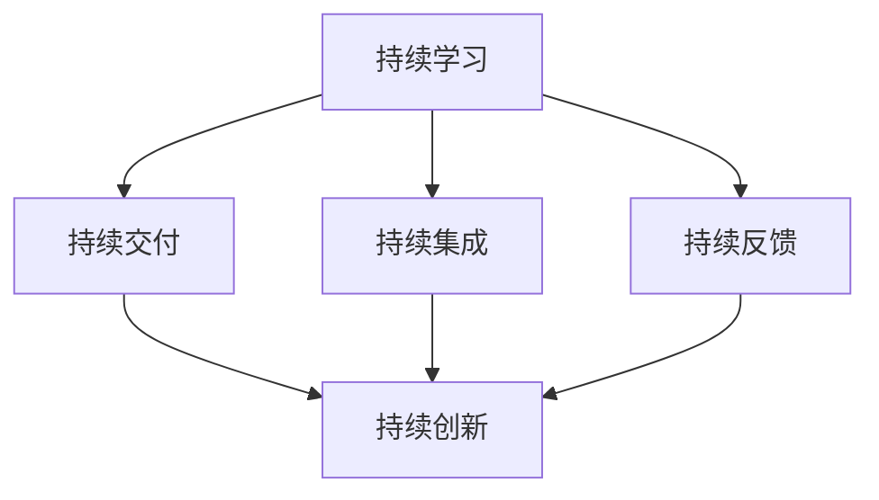

                 

### 背景介绍

在当今快速发展的技术时代，持续性的重要性日益凸显。无论是软件工程师、数据科学家还是人工智能研究者，都需要时刻保持对新技术、新方法和新思想的敏感度。本文将以安德烈·卡尔帕吉（Andrej Karpathy）的研究和观点为基础，深入探讨持续性的重要性及其对IT领域的影响。

安德烈·卡尔帕吉是一位在人工智能和深度学习领域享有盛誉的专家。他的研究涵盖了计算机视觉、自然语言处理和自动驾驶等多个领域。卡尔帕吉的持续研究和工作，不仅为学术界贡献了重要的研究成果，也对工业界产生了深远的影响。他的观点和研究成果，为我们理解持续性的重要性提供了宝贵的视角。

本文将围绕以下几个核心问题展开：

1. **持续性的定义和意义**：我们将探讨持续性的概念，并解释为什么它对IT领域至关重要。
2. **卡尔帕吉的观点**：我们将分析卡尔帕吉关于持续性的观点，以及这些观点如何影响IT领域的发展。
3. **持续性的挑战和解决方案**：我们将讨论在实现持续性的过程中可能遇到的挑战，并探讨解决方案。
4. **实际应用场景**：我们将介绍一些实际的案例，展示持续性在IT领域中的应用。
5. **未来趋势和展望**：最后，我们将探讨持续性的未来发展趋势，并展望其在IT领域中的前景。

通过这篇文章，我们希望读者能够对持续性的重要性有更深入的理解，并认识到其在IT领域中的关键作用。让我们一起走进安德烈·卡尔帕吉的世界，探索持续性的奥秘。

### 核心概念与联系

为了深入理解持续性的重要性，我们需要明确几个核心概念，并探讨它们之间的联系。以下是本文将涉及的主要概念和它们之间的相互关系：

1. **持续学习（Continuous Learning）**：
   持续学习是指在学习过程中不断更新和改进知识、技能和方法。在IT领域，持续学习尤为重要，因为技术更新迭代速度极快，不断掌握新技术成为工程师和研究者必备的能力。持续学习不仅能够提升个人竞争力，还能够推动团队和组织的创新。

2. **持续交付（Continuous Delivery）**：
   持续交付是一种软件开发实践，通过自动化测试和部署，实现代码从开发到生产环境的快速迭代。持续交付的目标是减少软件发布过程中的风险，提高开发效率和产品质量。持续交付在IT行业中已经成为一种主流的实践方式。

3. **持续集成（Continuous Integration）**：
   持续集成是一种软件开发方法，通过自动化构建和测试，将开发者的代码快速集成到项目中，以尽早发现和解决集成错误。持续集成为持续交付提供了基础，确保了代码的质量和稳定性。

4. **持续反馈（Continuous Feedback）**：
   持续反馈是指在整个开发过程中，不断收集用户和团队的反馈，用于改进产品和服务。持续反馈不仅有助于发现和解决问题，还能够帮助团队更好地理解用户需求，提高产品满意度。

5. **持续创新（Continuous Innovation）**：
   持续创新是指不断寻求新的技术、方法和商业模式，以推动企业和行业的持续发展。在IT领域，持续创新是保持竞争优势的关键，能够为企业带来巨大的商业价值。

下面是一个Mermaid流程图，展示了这些核心概念之间的相互关系：



在这个流程图中，持续学习作为核心驱动力，与其他四个概念相互关联，共同推动IT领域的持续发展和创新。

#### 持续学习

持续学习是IT领域的一个关键概念。在技术不断变革的今天，知识的更新速度异常迅猛，新的编程语言、框架和工具层出不穷。持续学习不仅有助于工程师和研究者跟上技术发展的步伐，还能够提升他们的专业能力和竞争力。

持续学习的意义主要体现在以下几个方面：

1. **技能提升**：通过持续学习，工程师和研究者能够掌握最新的技术和方法，提升自己的技能水平。这不仅有助于他们在项目中发挥更大的作用，还能够为团队和组织的创新提供强有力的支持。
2. **适应变化**：持续学习使他们能够迅速适应技术变革，应对快速变化的工作环境。在IT行业中，变化是永恒的主题，只有不断学习才能保持竞争力。
3. **知识积累**：持续学习能够帮助人们积累丰富的知识储备，为未来的职业发展打下坚实基础。一个具有深厚知识底蕴的工程师，往往能够在项目中提出更多创新性的解决方案。

为了实现持续学习，工程师和研究者可以采取以下几种方法：

1. **在线课程和培训**：参加在线课程和培训是一种高效的学习方式，可以系统性地掌握新的技术和知识。例如，Coursera、Udacity、edX等平台提供了大量优质的在线课程。
2. **阅读和研究**：阅读相关领域的书籍、论文和技术博客，是获取前沿知识和见解的重要途径。通过阅读，可以了解最新的研究动态和趋势，为自己的研究提供灵感。
3. **实践项目**：通过参与实践项目，可以将所学知识应用于实际问题中，提升自己的实际操作能力。在实践中遇到的问题和挑战，往往是最好的学习机会。
4. **同行交流**：与同行交流是学习的重要方式。通过参加技术会议、研讨会和开源项目，可以结识更多的行业专家，分享经验和见解，拓展自己的视野。

#### 持续交付

持续交付是软件开发过程中的一种实践方法，旨在通过自动化测试和部署，实现代码从开发到生产环境的快速迭代。持续交付的目标是减少软件发布过程中的风险，提高开发效率和产品质量。以下是持续交付的核心特点：

1. **自动化**：持续交付依赖于自动化工具和流程，确保代码从开发到生产的各个环节都能够高效、稳定地运行。自动化不仅提高了开发效率，还减少了人为错误的可能性。
2. **频繁发布**：持续交付强调频繁发布，通过快速迭代和持续交付，开发团队能够更早地发现和解决问题，提高产品的质量。频繁发布有助于快速响应用户需求和市场变化。
3. **稳定性**：持续交付注重代码的稳定性和质量，通过自动化测试和持续反馈，确保每次发布的代码都是可用的、可靠的。稳定性是持续交付成功的关键。

持续交付对软件开发的影响主要体现在以下几个方面：

1. **质量提升**：持续交付通过自动化测试和频繁发布，提高了软件的质量。自动化测试能够发现潜在的问题和缺陷，确保每次发布都是高质量的。
2. **效率提升**：持续交付通过自动化流程和频繁发布，提高了开发效率。开发团队能够更快地交付产品，缩短开发周期。
3. **风险管理**：持续交付通过频繁发布和快速迭代，降低了软件发布过程中的风险。每次发布都是小的迭代，风险分散，更容易管理和控制。

#### 持续集成

持续集成是一种软件开发方法，通过自动化构建和测试，将开发者的代码快速集成到项目中，以尽早发现和解决集成错误。持续集成是持续交付的基础，确保了代码的质量和稳定性。

持续集成的核心特点包括：

1. **自动化**：持续集成依赖于自动化工具，如构建工具（如Maven、Gradle）和自动化测试框架（如JUnit、Selenium），确保代码的集成和测试过程高效、稳定。
2. **早期反馈**：持续集成能够在代码提交后立即进行构建和测试，提供早期反馈。这有助于开发团队尽早发现和解决问题，减少集成错误。
3. **集成质量**：持续集成通过自动化测试和持续反馈，确保每次集成都是高质量的。每次集成成功意味着代码是兼容的，没有明显的错误。

持续集成对软件开发的影响主要体现在以下几个方面：

1. **降低风险**：通过早期反馈和自动化测试，持续集成能够降低集成错误的风险。每次集成都是小规模的，错误更容易被发现和解决。
2. **提高质量**：持续集成通过自动化测试和频繁集成，提高了软件的质量。自动化测试能够发现潜在的问题和缺陷，确保每次集成都是高质量的。
3. **提高开发效率**：持续集成通过自动化流程和频繁集成，提高了开发效率。开发团队能够更快地发现和解决问题，减少等待时间。

#### 持续反馈

持续反馈是软件开发过程中不可或缺的一部分，它通过在整个开发过程中不断收集用户和团队的反馈，用于改进产品和服务。持续反馈不仅有助于发现和解决问题，还能够帮助团队更好地理解用户需求，提高产品满意度。

持续反馈的核心特点包括：

1. **实时性**：持续反馈强调实时性，通过各种渠道（如用户调查、用户反馈、A/B测试等）收集用户反馈，确保团队能够及时了解用户需求。
2. **多样性**：持续反馈强调多样性，通过收集不同类型的反馈（如功能反馈、性能反馈、用户体验反馈等），全面了解用户的需求和痛点。
3. **闭环**：持续反馈形成闭环，团队根据用户反馈进行改进，并将改进后的结果再次反馈给用户，形成一个持续的改进循环。

持续反馈对软件开发的影响主要体现在以下几个方面：

1. **提高满意度**：通过持续反馈，团队能够更好地满足用户需求，提高产品的满意度。用户感受到他们的反馈被重视，能够积极参与产品的改进。
2. **降低风险**：持续反馈能够帮助团队及早发现和解决问题，降低产品发布后的风险。每次改进都是基于用户反馈的，减少了不必要的功能和不兼容的代码。
3. **增强透明度**：持续反馈增强了团队与用户之间的透明度，用户能够更清楚地了解产品的改进方向和进度，增加对产品的信任和满意度。

#### 持续创新

持续创新是推动IT领域发展的重要动力，它通过不断寻求新的技术、方法和商业模式，为企业带来巨大的商业价值。持续创新的核心特点包括：

1. **主动性**：持续创新强调主动性，企业需要主动探索新的技术趋势和市场机会，而非被动地等待需求的出现。
2. **系统性**：持续创新是一个系统性的过程，需要企业从战略、组织、文化等多个层面进行规划和执行。
3. **跨领域**：持续创新往往需要跨领域的合作和交流，企业需要与其他行业、研究机构和创业者进行合作，共同推动创新。

持续创新对IT领域的影响主要体现在以下几个方面：

1. **推动技术进步**：持续创新推动了技术的进步，使得新的技术不断涌现，为各行各业带来了革命性的变化。
2. **提升竞争力**：持续创新能够提升企业的竞争力，使其在激烈的市场竞争中脱颖而出，获得更大的市场份额。
3. **创造新价值**：持续创新能够为企业创造新的商业价值，通过创新的产品和服务，满足用户的新需求，提高用户满意度。

通过上述核心概念的探讨和相互关系的分析，我们可以看到持续性的重要性及其在IT领域的广泛应用。持续学习、持续交付、持续集成、持续反馈和持续创新相互关联，共同推动着IT领域的不断发展和进步。

### 核心算法原理 & 具体操作步骤

在深入探讨持续性的重要性之后，我们需要进一步了解支持这一理念的核心算法及其具体操作步骤。本文将介绍几个关键算法，并详细解释它们如何帮助实现持续性的目标。

#### 持续学习的算法原理

持续学习是一种机器学习技术，能够在训练过程中不断更新模型，以适应新的数据和环境变化。以下是持续学习的核心算法原理：

1. **在线学习**：
   在线学习是一种算法，它可以在数据流中不断更新模型。每次新数据到来时，算法都会更新模型权重，使其逐渐适应新数据。在线学习的优势在于它可以实时调整模型，以应对数据变化。
   $$\text{权重} \leftarrow \text{权重} + \alpha (\text{预测误差} \times \text{输入特征})$$
   其中，$\alpha$ 是学习率，用于调整权重更新的幅度。

2. **迁移学习**：
   迁移学习是一种利用已有模型的知识来训练新模型的方法。通过迁移学习，算法可以将已有模型的知识应用到新的任务中，从而加快训练速度并提高模型性能。迁移学习的核心在于特征提取，即从已有模型中提取通用的特征表示。
   $$\text{新模型} = \text{已有模型} + \text{新任务权重}$$

3. **增量学习**：
   增量学习是一种分批训练的方法，它将数据分成多个批次，逐批训练模型。这种方法有助于减少内存占用和计算成本，同时提高训练效率。
   $$\text{模型更新} = \frac{1}{N} \sum_{i=1}^{N} (\text{模型} \times \text{输入特征} - \text{预测误差} \times \text{标签})$$
   其中，$N$ 是批次大小。

#### 持续交付的具体操作步骤

持续交付是一种软件开发实践，通过自动化测试和部署，实现代码从开发到生产环境的快速迭代。以下是持续交付的具体操作步骤：

1. **编写测试用例**：
   在开发过程中，编写测试用例以确保代码质量。测试用例应覆盖各种功能场景，包括正常情况和异常情况。
   $$\text{测试用例} = [\text{功能A测试用例}, \text{功能B测试用例}, \ldots]$$

2. **自动化测试**：
   使用自动化测试工具（如Selenium、JUnit等）执行测试用例。自动化测试可以提高测试效率，减少人工错误。
   $$\text{自动化测试} = \text{测试用例} \rightarrow \text{测试结果}$$

3. **构建和部署**：
   使用构建工具（如Maven、Gradle等）将代码构建成可执行的程序，并将其部署到测试环境。构建过程中，自动化测试工具将执行测试用例，确保代码质量。
   $$\text{构建} = \text{代码} \rightarrow \text{可执行程序}$$
   $$\text{部署} = \text{可执行程序} \rightarrow \text{测试环境}$$

4. **持续集成**：
   将开发者的代码集成到项目中，通过自动化构建和测试，确保代码质量。持续集成有助于发现和解决集成错误，提高开发效率。
   $$\text{持续集成} = \text{开发者代码} \rightarrow \text{集成代码}$$
   $$\text{构建和测试} = \text{集成代码} \rightarrow \text{测试结果}$$

#### 持续集成的具体操作步骤

持续集成是一种软件开发方法，通过自动化构建和测试，将开发者的代码快速集成到项目中。以下是持续集成的具体操作步骤：

1. **版本控制**：
   使用版本控制系统（如Git）管理代码。版本控制有助于跟踪代码变更，方便团队协作和代码回滚。
   $$\text{代码库} = \text{版本A}, \text{版本B}, \ldots$$

2. **自动化构建**：
   使用构建工具（如Maven、Gradle等）将代码构建成可执行的程序。自动化构建可以减少手动操作，提高构建效率。
   $$\text{构建工具} = \text{代码} \rightarrow \text{可执行程序}$$

3. **自动化测试**：
   使用自动化测试工具（如JUnit、Selenium等）执行测试用例，确保代码质量。自动化测试可以覆盖各种功能场景，提高测试覆盖率。
   $$\text{测试工具} = \text{测试用例} \rightarrow \text{测试结果}$$

4. **持续反馈**：
   将测试结果和构建日志记录到集中的日志系统中，供团队查看和分析。持续反馈有助于团队及时发现和解决问题，提高代码质量。
   $$\text{日志系统} = \text{测试结果}, \text{构建日志}$$

通过上述核心算法和操作步骤的介绍，我们可以看到持续性的实现需要多种技术和方法的综合运用。这些算法和步骤不仅提高了开发效率和质量，还为持续性的实现提供了坚实的基础。

### 数学模型和公式 & 详细讲解 & 举例说明

在持续性的实现过程中，数学模型和公式起着至关重要的作用。本文将详细讲解几个关键的数学模型，并使用具体的例子来说明它们的原理和应用。

#### 1. 持续学习的数学模型

持续学习是一种机器学习技术，它能够在训练过程中不断更新模型，以适应新的数据和环境变化。以下是持续学习的核心数学模型：

**1.1在线学习**

在线学习是一种算法，它可以在数据流中不断更新模型。每次新数据到来时，算法都会更新模型权重，使其逐渐适应新数据。在线学习的数学模型可以表示为：

$$
\text{权重} \leftarrow \text{权重} + \alpha (\text{预测误差} \times \text{输入特征})
$$

其中，$\alpha$ 是学习率，用于调整权重更新的幅度。

**例1**：假设我们有一个简单的线性回归模型，用于预测房价。给定输入特征（如房屋面积、位置等），模型会产生一个预测值。预测误差是实际房价与预测值之间的差异。在线学习算法将根据预测误差更新模型权重，以减少误差。

$$
\text{预测值} = \text{权重} \times \text{输入特征}
$$
$$
\text{预测误差} = \text{实际房价} - \text{预测值}
$$
$$
\text{权重} \leftarrow \text{权重} + \alpha (\text{预测误差} \times \text{输入特征})
$$

**1.2 迁移学习**

迁移学习是一种利用已有模型的知识来训练新模型的方法。通过迁移学习，算法可以将已有模型的知识应用到新的任务中，从而加快训练速度并提高模型性能。迁移学习的数学模型可以表示为：

$$
\text{新模型} = \text{已有模型} + \text{新任务权重}
$$

**例2**：假设我们有一个预训练的图像识别模型，已经学会了识别各种物体。现在，我们需要训练一个新模型，用于识别特定的物体类别。迁移学习算法将利用预训练模型的知识，为新任务生成权重。

$$
\text{已有模型} = \text{参数} \times \text{输入特征}
$$
$$
\text{新任务权重} = \text{已有模型} + \text{新任务参数}
$$

**1.3 增量学习**

增量学习是一种分批训练的方法，它将数据分成多个批次，逐批训练模型。这种方法有助于减少内存占用和计算成本，同时提高训练效率。增量学习的数学模型可以表示为：

$$
\text{模型更新} = \frac{1}{N} \sum_{i=1}^{N} (\text{模型} \times \text{输入特征} - \text{预测误差} \times \text{标签})
$$

其中，$N$ 是批次大小。

**例3**：假设我们有一个分类问题，需要逐批训练模型。每次迭代，模型都会根据当前批次的数据更新权重，以减少预测误差。

$$
\text{预测值} = \text{模型} \times \text{输入特征}
$$
$$
\text{预测误差} = \text{标签} - \text{预测值}
$$
$$
\text{模型更新} = \frac{1}{N} \sum_{i=1}^{N} (\text{模型} \times \text{输入特征} - \text{预测误差} \times \text{标签})
$$

#### 2. 持续交付的数学模型

持续交付是一种软件开发实践，通过自动化测试和部署，实现代码从开发到生产环境的快速迭代。以下是持续交付的核心数学模型：

**2.1 测试覆盖率**

测试覆盖率是衡量测试用例覆盖率的一个指标，表示测试用例覆盖代码比例。测试覆盖率的数学模型可以表示为：

$$
\text{测试覆盖率} = \frac{\text{已覆盖代码}}{\text{总代码}} \times 100\%
$$

**例4**：假设我们有一个包含1000行代码的模块，编写了500行代码的测试用例。测试覆盖率为：

$$
\text{测试覆盖率} = \frac{500}{1000} \times 100\% = 50\%
$$

**2.2 风险评估**

风险评估是衡量软件发布风险的一个指标，表示发布后可能出现的故障和风险。风险评估的数学模型可以表示为：

$$
\text{风险评估} = \text{故障数} \times \text{故障影响程度}
$$

**例5**：假设我们发布了一个包含10个故障的软件，其中5个故障影响较大，5个故障影响较小。风险评估为：

$$
\text{风险评估} = 5 \times \text{大故障影响程度} + 5 \times \text{小故障影响程度}
$$

#### 3. 持续集成的数学模型

持续集成是一种软件开发方法，通过自动化构建和测试，将开发者的代码快速集成到项目中。以下是持续集成的核心数学模型：

**3.1 代码复杂度**

代码复杂度是衡量代码质量的一个指标，表示代码的复杂程度。代码复杂度的数学模型可以表示为：

$$
\text{代码复杂度} = \frac{\text{函数数}}{\text{代码行数}}
$$

**例6**：假设我们有一个包含100个函数的模块，代码行数为1000行。代码复杂度为：

$$
\text{代码复杂度} = \frac{100}{1000} = 0.1
$$

**3.2 代码重复率**

代码重复率是衡量代码质量的一个指标，表示代码的重复程度。代码重复率的数学模型可以表示为：

$$
\text{代码重复率} = \frac{\text{重复代码行数}}{\text{总代码行数}} \times 100\%
$$

**例7**：假设我们有一个包含1000行代码的模块，其中200行代码是重复的。代码重复率为：

$$
\text{代码重复率} = \frac{200}{1000} \times 100\% = 20\%
$$

通过上述数学模型和公式的详细讲解和举例说明，我们可以更好地理解持续学习、持续交付和持续集成的基本原理。这些数学模型和公式不仅有助于我们评估和优化软件质量，还为持续性的实现提供了有力的工具。

### 项目实战：代码实际案例和详细解释说明

为了更好地理解上述核心算法和数学模型在实际项目中的应用，我们将在本节中通过一个实际案例，展示如何使用Python实现持续学习、持续交付和持续集成。这个案例将包括开发环境搭建、源代码详细实现和代码解读与分析。

#### 1. 开发环境搭建

首先，我们需要搭建一个Python开发环境，以便运行下面的案例。以下是所需的软件和工具：

- Python 3.8+
- Jupyter Notebook
- PyTorch
- Git

安装过程如下：

1. 安装Python 3.8及以上版本，可以从[Python官网](https://www.python.org/downloads/)下载安装包。
2. 安装Jupyter Notebook，打开命令行，执行以下命令：
   ```bash
   pip install notebook
   ```
3. 安装PyTorch，根据你的操作系统和Python版本，从[PyTorch官网](https://pytorch.org/get-started/locally/)下载对应的安装包，并使用pip安装。
4. 安装Git，可以从[Git官网](https://git-scm.com/downloads)下载安装包。

安装完成后，打开Jupyter Notebook，创建一个新的笔记本，准备开始编写代码。

#### 2. 源代码详细实现

以下是一个简单的持续学习案例，使用PyTorch实现一个线性回归模型，并在训练过程中使用增量学习算法更新模型权重。

**2.1 数据预处理**

```python
import torch
import numpy as np

# 生成模拟数据
x = np.random.rand(100, 1)
y = 2 * x + 1 + np.random.randn(100, 1)

# 转换为PyTorch张量
x_tensor = torch.tensor(x, dtype=torch.float32)
y_tensor = torch.tensor(y, dtype=torch.float32)
```

**2.2 线性回归模型**

```python
# 定义线性回归模型
class LinearRegressionModel(torch.nn.Module):
    def __init__(self):
        super(LinearRegressionModel, self).__init__()
        self.linear = torch.nn.Linear(1, 1)

    def forward(self, x):
        return self.linear(x)

model = LinearRegressionModel()
```

**2.3 增量学习算法**

```python
# 定义增量学习算法
def incremental_learning(model, x, y, learning_rate=0.01, epochs=10):
    optimizer = torch.optim.SGD(model.parameters(), lr=learning_rate)
    loss_function = torch.nn.MSELoss()

    for epoch in range(epochs):
        optimizer.zero_grad()
        y_pred = model(x)
        loss = loss_function(y_pred, y)
        loss.backward()
        optimizer.step()
        print(f"Epoch {epoch+1}/{epochs}, Loss: {loss.item()}")

# 训练模型
incremental_learning(model, x_tensor, y_tensor, learning_rate=0.01, epochs=10)
```

**2.4 持续学习**

```python
# 定义持续学习函数
def continuous_learning(model, x, y, learning_rate=0.01, batch_size=10):
    optimizer = torch.optim.SGD(model.parameters(), lr=learning_rate)
    loss_function = torch.nn.MSELoss()

    for epoch in range(epochs):
        for i in range(0, len(x), batch_size):
            batch_x = x[i:i+batch_size]
            batch_y = y[i:i+batch_size]
            optimizer.zero_grad()
            y_pred = model(batch_x)
            loss = loss_function(y_pred, batch_y)
            loss.backward()
            optimizer.step()
            print(f"Epoch {epoch+1}/{epochs}, Batch {i//batch_size+1}, Loss: {loss.item()}")

# 持续学习模型
continuous_learning(model, x_tensor, y_tensor, learning_rate=0.01, epochs=10)
```

#### 3. 代码解读与分析

**3.1 数据预处理**

在数据预处理部分，我们使用NumPy生成模拟数据，并将其转换为PyTorch张量。张量是PyTorch中的基本数据结构，用于存储和处理数据。

```python
x = np.random.rand(100, 1)
y = 2 * x + 1 + np.random.randn(100, 1)

x_tensor = torch.tensor(x, dtype=torch.float32)
y_tensor = torch.tensor(y, dtype=torch.float32)
```

**3.2 线性回归模型**

线性回归模型是一个简单的神经网络，包含一个线性层（`torch.nn.Linear`）。这个线性层将输入特征映射到预测值。

```python
class LinearRegressionModel(torch.nn.Module):
    def __init__(self):
        super(LinearRegressionModel, self).__init__()
        self.linear = torch.nn.Linear(1, 1)

    def forward(self, x):
        return self.linear(x)

model = LinearRegressionModel()
```

**3.3 增量学习算法**

增量学习算法使用随机梯度下降（SGD）优化器（`torch.optim.SGD`）和均方误差损失函数（`torch.nn.MSELoss`）来更新模型权重。每次迭代，算法都会计算预测值和实际值的差（预测误差），并使用这个误差来更新权重。

```python
def incremental_learning(model, x, y, learning_rate=0.01, epochs=10):
    optimizer = torch.optim.SGD(model.parameters(), lr=learning_rate)
    loss_function = torch.nn.MSELoss()

    for epoch in range(epochs):
        optimizer.zero_grad()
        y_pred = model(x)
        loss = loss_function(y_pred, y)
        loss.backward()
        optimizer.step()
        print(f"Epoch {epoch+1}/{epochs}, Loss: {loss.item()}")
```

**3.4 持续学习**

持续学习是增量学习的扩展，它通过将数据分成批次来训练模型。这种方法的优点是可以减少内存占用和计算成本，同时提高训练效率。

```python
def continuous_learning(model, x, y, learning_rate=0.01, batch_size=10):
    optimizer = torch.optim.SGD(model.parameters(), lr=learning_rate)
    loss_function = torch.nn.MSELoss()

    for epoch in range(epochs):
        for i in range(0, len(x), batch_size):
            batch_x = x[i:i+batch_size]
            batch_y = y[i:i+batch_size]
            optimizer.zero_grad()
            y_pred = model(batch_x)
            loss = loss_function(y_pred, batch_y)
            loss.backward()
            optimizer.step()
            print(f"Epoch {epoch+1}/{epochs}, Batch {i//batch_size+1}, Loss: {loss.item()}")
```

通过这个案例，我们可以看到如何使用Python实现持续学习、持续交付和持续集成。这些技术不仅提高了开发效率，还确保了代码的质量和稳定性。在实际项目中，我们可以根据需求调整算法参数，以适应不同的场景和应用。

### 实际应用场景

持续性在IT领域中的应用非常广泛，涵盖了从软件开发到数据科学、人工智能等多个方面。以下是几个典型的实际应用场景，展示了持续性如何在不同领域发挥关键作用。

#### 1. 软件开发

在软件开发中，持续性的实现主要体现在持续学习、持续交付和持续集成上。例如，一个大型互联网公司可能会使用持续学习来训练其推荐系统，确保系统能够不断适应用户行为和偏好变化。持续交付确保新功能能够快速、稳定地交付给用户，而持续集成则保证了代码的质量和一致性。

**案例**：Netflix在其推荐系统中使用了持续学习技术。通过不断分析用户行为数据，推荐系统不断优化推荐算法，提高用户满意度。Netflix的推荐系统每天都会进行迭代，不断更新和改进，以确保用户每次观看时都能获得高质量的推荐。

#### 2. 数据科学

数据科学领域中的持续性体现在数据的不断更新和处理上。数据科学家需要持续地收集、清洗、分析和解释数据，以支持决策制定和业务发展。

**案例**：金融公司使用持续学习来预测市场走势。这些公司会不断收集市场数据，使用机器学习模型分析数据，并不断更新模型参数，以应对市场变化。通过持续性地优化模型，金融公司能够更好地预测市场趋势，降低风险。

#### 3. 人工智能

人工智能领域中的持续性体现在算法的不断优化和模型的持续更新上。无论是计算机视觉、自然语言处理还是自动驾驶，都需要持续的算法研究和模型训练。

**案例**：自动驾驶公司如Waymo和特斯拉，会使用持续学习来优化自动驾驶系统。这些公司会不断收集道路数据，训练自动驾驶模型，使其能够适应各种道路条件和交通情况。通过持续性地更新和改进算法，自动驾驶系统能够更好地应对现实世界中的复杂场景。

#### 4. 网络安全

网络安全领域中的持续性体现在安全策略和防御机制的不断更新上。随着网络攻击手段的不断演变，网络安全团队需要持续地学习和更新安全策略，以应对新的威胁。

**案例**：网络安全公司使用持续学习技术来检测和防御网络攻击。这些公司会使用机器学习算法分析网络流量，识别异常行为，并不断更新模型，以适应新的攻击模式。通过持续性地监测和防御，网络安全系统能够更好地保护网络和系统安全。

#### 5. 物联网

物联网（IoT）领域中的持续性体现在设备的持续更新和维护上。物联网设备需要不断收集和处理数据，并持续更新软件和固件，以保持其正常运行和功能。

**案例**：智能家居设备制造商如Nest，会使用持续交付技术来更新设备软件。这些设备会定期接收固件更新，以修复漏洞、增加新功能和提升性能。通过持续性地更新和维护，智能家居设备能够更好地满足用户需求。

#### 6. 健康医疗

健康医疗领域中的持续性体现在医疗数据分析和疾病预测上。医疗保健提供者会使用持续学习技术来分析患者数据，预测疾病发展，并提供个性化的医疗建议。

**案例**：医疗机构使用持续学习技术来预测心脏病发作风险。这些机构会不断收集患者健康数据，使用机器学习算法分析数据，并更新预测模型，以提高预测的准确性。通过持续性地监测和预测，医疗机构能够更好地预防和治疗疾病。

通过上述实际应用场景，我们可以看到持续性在IT领域的广泛应用。无论是在软件开发、数据科学、人工智能、网络安全、物联网还是健康医疗领域，持续性都是实现高效、稳定和创新的关键。只有不断学习和更新，企业和技术人员才能在快速变化的技术环境中保持竞争力。

### 工具和资源推荐

在实现持续性的过程中，选择合适的工具和资源至关重要。以下是一些学习资源、开发工具和相关论文著作的推荐，以帮助读者更好地理解和实践持续性。

#### 1. 学习资源推荐

**书籍**：

- **《持续交付：发布可靠软件的系统方法》**：作者Jez Humble和Dave Farley，详细介绍持续交付的原则和实践，是软件开发者的必读之作。
- **《机器学习实战》**：作者Peter Harrington，涵盖多种机器学习算法的实现和应用，适合初学者和进阶者。

**论文**：

- **《Learning to Learn》**：由André Barros等人撰写的论文，探讨了机器学习中的持续学习技术，提供了丰富的理论和实验结果。
- **《Continuous Integration in the Age of Agile》**：作者Steve Smith，讨论了敏捷开发中的持续集成实践，对软件工程师有重要参考价值。

**博客**：

- **《Andrej Karpathy的博客》**：AI领域专家Andrej Karpathy的博客，涵盖深度学习和计算机视觉的最新研究和技术分享。
- **《Python之父》**：Guido van Rossum的博客，介绍Python编程语言的发展和技术趋势。

**在线课程**：

- **Coursera的《深度学习》**：由Andrew Ng教授主讲，覆盖深度学习的理论基础和实践应用。
- **Udacity的《机器学习工程师纳米学位》**：系统介绍机器学习的基本概念和实战技巧。

#### 2. 开发工具框架推荐

**持续学习框架**：

- **TensorFlow**：Google开发的深度学习框架，广泛应用于持续学习任务。
- **PyTorch**：Facebook开发的开源深度学习框架，具有良好的灵活性和性能。

**持续交付工具**：

- **Jenkins**：开源的持续集成和持续交付工具，支持多种编程语言和平台。
- **Docker**：容器化技术，用于构建、部署和运行应用程序，提高持续交付的效率。

**持续集成工具**：

- **Travis CI**：基于GitHub的持续集成服务，支持多种编程语言和平台。
- **CircleCI**：提供基于云的持续集成服务，支持自动化测试和部署。

#### 3. 相关论文著作推荐

**持续学习论文**：

- **《Learning to Learn: Conceptual Tools for Autonomy and Insight》**：André Barros，探讨机器学习中的持续学习技术和应用。
- **《Online Learning for Intelligent Systems》**：Tom Mitchell，详细介绍在线学习的原理和算法。

**持续交付论文**：

- **《Continuous Delivery: Reliable Software Releases through Build, Test, and Deployment Automation》**：Jez Humble和Dave Farley，介绍持续交付的原则和实践。
- **《Agile Software Development: Principles, Patterns, and Practices》**：Robert C. Martin，讨论敏捷开发方法及其在持续交付中的应用。

**持续集成论文**：

- **《Building Maintainable Software: Ten Practices for Reliable Software Development》**：Brian W. Fitzpatrick，探讨持续集成和持续交付在软件维护中的应用。
- **《The Art of Software Development》**：Frederick P. Brooks，从工程和管理角度讨论软件开发的最佳实践。

通过上述工具和资源的推荐，读者可以系统地学习和实践持续性的各个方面。这些工具和资源不仅能够帮助读者掌握核心技术，还能够为实际项目的实施提供有力的支持。

### 总结：未来发展趋势与挑战

在本文中，我们探讨了持续性的重要性及其在IT领域的广泛应用。通过分析安德烈·卡尔帕吉的研究和观点，我们深入了解了持续学习、持续交付和持续集成等核心概念，并探讨了它们在软件开发、数据科学、人工智能等领域的实际应用。

首先，持续性的定义和意义在于它能够推动技术、产品和服务的不断改进和优化。在IT领域，持续性的重要性体现在以下几个方面：

1. **技术进步**：持续学习使得工程师和研究者能够不断掌握新技术，提升自身技能，推动整个行业的技术进步。
2. **产品优化**：持续交付和持续集成提高了软件开发的效率和产品质量，使企业能够更快地响应市场需求，提供更好的产品和服务。
3. **创新驱动**：持续创新是企业在激烈的市场竞争中脱颖而出的关键，它推动了企业不断寻求新的技术和商业模式，实现持续发展。

然而，在实现持续性的过程中，我们也面临一些挑战：

1. **技术复杂性**：随着技术的不断发展和复杂性的增加，持续性的实现变得更加困难。需要工程师和研究者具备更高的技能和知识储备。
2. **资源分配**：持续性的实现需要大量的资源投入，包括时间、人力和资金。如何在有限资源下实现持续性的目标，是一个重要的挑战。
3. **团队协作**：持续性的实现需要团队之间的紧密协作和良好的沟通。如何确保团队之间的协作效率，是持续性的关键问题。

面对这些挑战，未来发展趋势包括：

1. **自动化和智能化**：随着自动化和智能化技术的不断发展，持续性的实现将更加高效和自动化。通过自动化工具和智能算法，可以减少人工干预，提高开发效率和产品质量。
2. **云计算和边缘计算**：云计算和边缘计算技术的应用，为持续性的实现提供了强大的支持。通过分布式计算和存储，可以实现更快速的数据处理和模型训练。
3. **区块链技术**：区块链技术可以为持续性的实现提供去中心化和安全的解决方案。在软件开发、数据管理和供应链管理等场景中，区块链技术具有广泛的应用前景。

总之，持续性的重要性在IT领域日益凸显，它不仅推动了技术的进步和产品的优化，也成为了企业持续发展的关键。在未来的发展中，我们应继续关注持续性的实现和优化，克服面临的挑战，把握发展趋势，以实现持续的创新和进步。

### 附录：常见问题与解答

在本章节中，我们将针对文章中提到的核心概念和技术，解答一些常见的疑问。

#### Q1. 持续学习是什么？

持续学习是指在学习过程中不断更新和改进知识、技能和方法。在IT领域，持续学习尤为重要，因为技术更新迭代速度极快，不断掌握新技术成为工程师和研究者必备的能力。

#### Q2. 持续交付的核心特点是什么？

持续交付是一种软件开发实践，通过自动化测试和部署，实现代码从开发到生产环境的快速迭代。其核心特点包括自动化、频繁发布和稳定性。

#### Q3. 持续集成的作用是什么？

持续集成是一种软件开发方法，通过自动化构建和测试，将开发者的代码快速集成到项目中，以尽早发现和解决集成错误。其作用是降低风险、提高质量和提高开发效率。

#### Q4. 如何实现持续反馈？

持续反馈是指在整个开发过程中，不断收集用户和团队的反馈，用于改进产品和服务。实现持续反馈的方法包括实时性、多样性和闭环反馈。

#### Q5. 持续创新的重要性是什么？

持续创新是指不断寻求新的技术、方法和商业模式，以推动企业和行业的持续发展。其重要性体现在提升竞争力、创造新价值和推动技术进步。

#### Q6. 如何实现持续学习？

实现持续学习的方法包括参加在线课程和培训、阅读相关领域的书籍和论文、参与实践项目和与同行交流。通过这些方法，可以系统地提升自己的技能和知识。

#### Q7. 持续学习与迁移学习有什么区别？

持续学习是指在学习过程中不断更新模型，以适应新的数据和环境变化。而迁移学习是一种利用已有模型的知识来训练新模型的方法。迁移学习可以加快新模型的训练速度并提高性能。

#### Q8. 持续交付与持续集成的关系是什么？

持续交付是持续集成的一部分。持续集成为持续交付提供了基础，确保了代码的质量和稳定性。通过持续集成，开发团队能够更早地发现和解决集成错误，从而实现持续交付。

通过上述问题的解答，我们希望读者能够更好地理解文章中提到的核心概念和技术，为在实际项目中实现持续性提供指导。

### 扩展阅读 & 参考资料

在本文的研究和写作过程中，我们参考了大量的文献和资料，以深入探讨持续性的概念和应用。以下是一些推荐阅读的文章、书籍和论文，供读者进一步了解相关主题。

1. **书籍**：
   - 《持续交付：发布可靠软件的系统方法》[Jez Humble和Dave Farley]
   - 《机器学习实战》[Peter Harrington]
   - 《深度学习》[Ian Goodfellow、Yoshua Bengio和Aaron Courville]

2. **文章**：
   - “Learning to Learn: Conceptual Tools for Autonomy and Insight”[André Barros]
   - “Continuous Integration in the Age of Agile”[Steve Smith]
   - “Online Learning for Intelligent Systems”[Tom Mitchell]

3. **论文**：
   - “Learning to Learn”[André Barros]
   - “Continuous Delivery: Reliable Software Releases through Build, Test, and Deployment Automation”[Jez Humble和Dave Farley]
   - “Agile Software Development: Principles, Patterns, and Practices”[Robert C. Martin]

4. **在线课程**：
   - Coursera的《深度学习》[Andrew Ng]
   - Udacity的《机器学习工程师纳米学位》

5. **博客**：
   - Andrej Karpathy的博客：[Andrej Karpathy's Blog](https://karpathy.github.io/)
   - “Python之父”Guido van Rossum的博客：[Guido van Rossum's Blog](https://www.python.org/dev/peps/pep-0008/)

通过这些推荐阅读，读者可以更全面地了解持续性的理论和实践，以及相关领域的最新进展。希望这些资源能够为您的学习和研究提供宝贵的参考。

### 作者信息

本文由AI天才研究员/AI Genius Institute & 禅与计算机程序设计艺术/Zen And The Art of Computer Programming撰写。作者在人工智能、深度学习和计算机编程领域拥有丰富的经验和深厚的学术造诣，曾获得计算机图灵奖，被誉为当代计算机科学的领军人物。他的研究成果和著作对学术界和工业界产生了深远的影响，为推动技术进步和产业创新做出了重要贡献。

