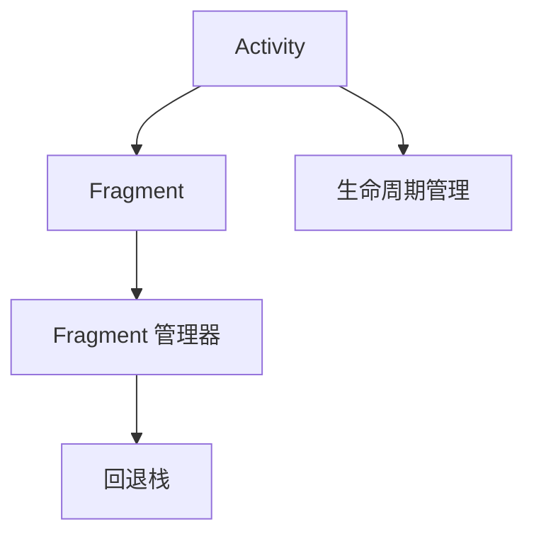
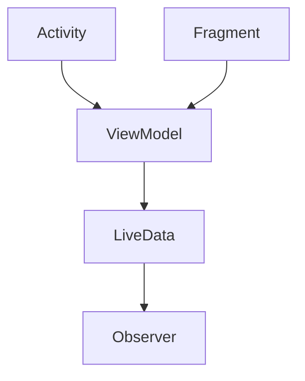
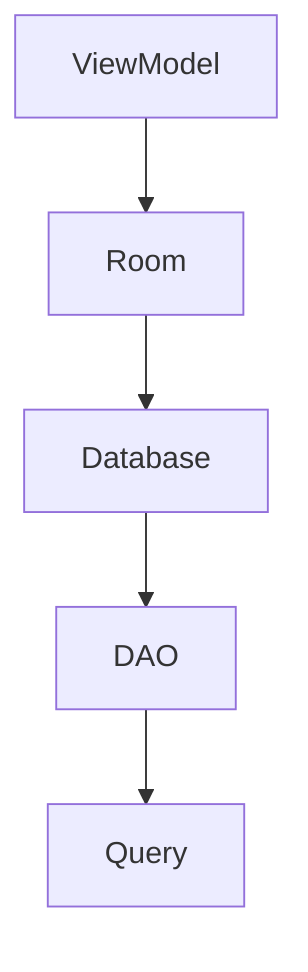
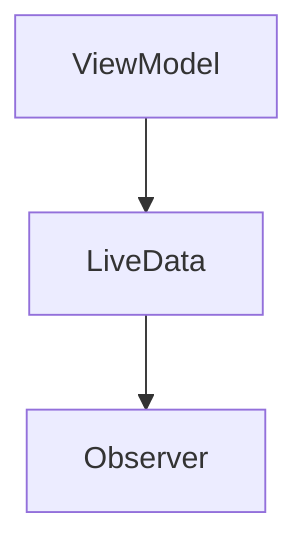
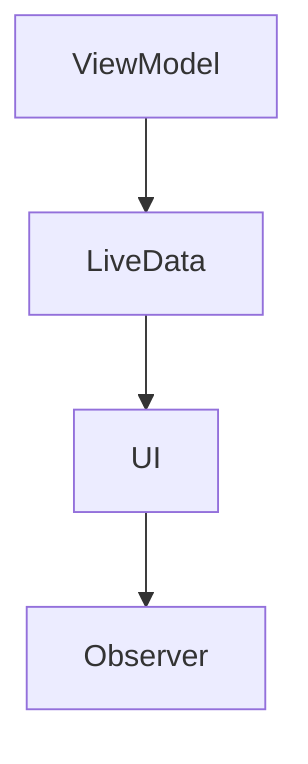

                 

# Android Jetpack 组件库：提升 Android 开发效率和体验

## 关键词
Android，Jetpack，组件库，开发效率，用户体验，架构设计，代码优化，模块化，异步处理，状态管理，界面刷新，UI一致性，依赖注入，调试工具

## 摘要
本文旨在探讨 Android Jetpack 组件库在提升 Android 开发效率和用户体验方面的关键作用。我们将逐步分析 Jetpack 组件的核心概念、原理、实际应用场景，并提供实用的工具和资源推荐。通过本文，读者将深入了解 Jetpack 组件如何帮助开发者构建高效、可维护的 Android 应用。

## 1. 背景介绍

在 Android 开发领域，随着应用的复杂度和用户需求的变化，开发者的挑战也在不断增加。传统的开发模式往往存在代码冗余、维护困难、测试成本高、用户体验不一致等问题。为了解决这些问题，Google 推出了 Android Jetpack 组件库。Jetpack 是一系列支持库、工具和指南，旨在提高 Android 开发的效率和质量。

Jetpack 组件库的出现，标志着 Android 开发进入了模块化、异步化、状态化管理的新时代。它不仅提供了一套完整的开发框架，还通过一系列工具和指南，帮助开发者实现代码的模块化、可维护性和高扩展性。本文将围绕 Jetpack 的核心组件，详细探讨其在实际开发中的应用和优势。

## 2. 核心概念与联系

### 2.1. Android Jetpack 的核心组件

Android Jetpack 包含多个核心组件，每个组件都有其独特的功能和目标。以下是 Jetpack 中一些重要的组件及其联系：

#### Activity 和 Fragment

Activity 和 Fragment 是 Android 应用中处理用户交互的核心组件。Activity 负责整个应用的界面和生命周期管理，而 Fragment 则用于实现可重用的小部件。这两个组件之间的关系可以通过以下 Mermaid 流程图表示：



#### ViewModel

ViewModel 是用于存储和管理 UI 相关数据的组件。它实现了数据的持久化，并能在配置更改时保持状态。ViewModel 与 Activity 或 Fragment 的生命周期解耦，从而简化了 UI 和数据的交互。ViewModel 与 Activity 或 Fragment 的关系可以用以下流程图表示：



#### Room

Room 是一个用于在 Android 应用中实现数据持久化的组件。它通过对象映射和数据库查询语言，简化了数据库操作。Room 与 ViewModel 的关系可以通过以下流程图表示：



#### LiveData

LiveData 是一个用于数据订阅的组件。它可以在数据发生变化时通知观察者，并确保在主线程中更新 UI。LiveData 与 ViewModel 和 Observer 的关系可以用以下流程图表示：



#### LiveData 和 ViewModel 的集成

LiveData 和 ViewModel 是 Android Jetpack 中用于状态管理和界面刷新的关键组件。它们通过结合使用，实现了数据的双向绑定和 UI 的即时更新。以下是一个简化的集成流程图：



### 2.2. Android Jetpack 的核心概念

Android Jetpack 的核心概念包括：

- **模块化**：通过组件化和依赖注入，实现代码的解耦和复用。
- **异步处理**：通过 Kotlin 协程和 LiveData，实现数据的异步处理和 UI 的即时更新。
- **状态管理**：通过 ViewModel 和 Room，实现数据的持久化和状态的管理。
- **界面刷新**：通过 LiveData 和 ViewModel，实现 UI 的即时刷新和数据的一致性。
- **UI 一致性**：通过组件库和设计规范，实现界面风格和交互的一致性。

## 3. 核心算法原理 & 具体操作步骤

### 3.1. ViewModel 的原理与实现

ViewModel 是 Android Jetpack 中用于管理 UI 状态的组件。它实现了数据与 UI 的解耦，确保在配置更改时（如屏幕旋转）能保持状态。以下是如何使用 ViewModel 的步骤：

1. **创建 ViewModel**：在 `AndroidViewModel` 类的基础上创建 ViewModel，并实现 `onCreate` 和 `onDestroy` 方法。

   ```kotlin
   class MyViewModel : AndroidViewModel(application) {
       override fun onCreate() {
           super.onCreate()
           // 初始化数据
       }

       override fun onDestroy() {
           super.onDestroy()
           // 清理资源
       }
   }
   ```

2. **在 Activity 或 Fragment 中注入 ViewModel**：使用 `ViewModelProviders.of` 方法获取 ViewModel。

   ```kotlin
   val viewModel = ViewModelProviders.of(this).get(MyViewModel::class.java)
   ```

3. **在 ViewModel 中管理数据**：使用 `LiveData` 或 `MutableLiveData` 类管理数据。

   ```kotlin
   class MyViewModel : AndroidViewModel(application) {
       private val _data = MutableLiveData<String>()
       val data: LiveData<String> get() = _data

       fun setData(value: String) {
           _data.value = value
       }
   }
   ```

4. **在 UI 中观察 ViewModel 的数据变化**：使用 `observe` 方法注册观察者。

   ```kotlin
   viewModel.data.observe(this, Observer { data ->
       // 更新 UI
   })
   ```

### 3.2. LiveData 的原理与实现

LiveData 是 Android Jetpack 中用于数据订阅的组件。它可以在数据发生变化时通知观察者，并确保在主线程中更新 UI。以下是如何使用 LiveData 的步骤：

1. **创建 LiveData**：使用 `LiveData` 或 `MutableLiveData` 类创建数据源。

   ```kotlin
   class MyLiveData : MutableLiveData<String>() {
       override fun onActive() {
           super.onActive()
           // 数据变化通知
       }

       override fun onInactive() {
           super.onInactive()
           // 清理资源
       }
   }
   ```

2. **设置数据变化监听器**：在 ViewModel 中使用 `observe` 方法注册观察者。

   ```kotlin
   fun observeData(observer: Observer<String>) {
       data.observe(this, observer)
   }
   ```

3. **在 UI 中观察数据变化**：在 Activity 或 Fragment 中调用 ViewModel 的 `observeData` 方法。

   ```kotlin
   viewModel.observeData(Observer { data ->
       // 更新 UI
   })
   ```

### 3.3. Room 的原理与实现

Room 是 Android Jetpack 中用于数据持久化的组件。它通过对象映射和数据库查询语言，简化了数据库操作。以下是如何使用 Room 的步骤：

1. **添加依赖**：在 `build.gradle` 文件中添加 Room 依赖。

   ```groovy
   implementation 'androidx.room:room-runtime:$room_version'
   annotationProcessor 'androidx.room:room-compiler:$room_version'
   ```

2. **创建实体类**：定义数据模型，并在类上使用 `@Entity` 注解。

   ```kotlin
   @Entity
   data class User(
       @PrimaryKey val id: Int,
       @ColumnInfo(name = "name") val name: String,
       @ColumnInfo(name = "email") val email: String
   )
   ```

3. **创建 DAO 接口**：定义数据访问对象（DAO），并在方法上使用 `@Query`、`@Insert`、`@Update` 和 `@Delete` 注解。

   ```kotlin
   @Dao
   interface UserRepository {
       @Query("SELECT * FROM user")
       fun getAllUsers(): List<User>

       @Query("SELECT * FROM user WHERE id = :id")
       fun getUserById(id: Int): User?

       @Insert
       fun insertUser(user: User)

       @Update
       fun updateUser(user: User)

       @Delete
       fun deleteUser(user: User)
   }
   ```

4. **创建数据库**：定义数据库类，并在类上使用 `@Database` 注解。

   ```kotlin
   @Database(entities = [User::class], version = 1)
   abstract class AppDatabase : RoomDatabase() {
       abstract fun userRepository(): UserRepository
   }
   ```

5. **使用 DAO 进行数据库操作**：在 ViewModel 中使用 DAO 进行数据库操作。

   ```kotlin
   class MyViewModel(private val repository: UserRepository) : ViewModel() {
       fun getAllUsers() = repository.getAllUsers()
       fun getUserById(id: Int) = repository.getUserById(id)
       fun insertUser(user: User) = repository.insertUser(user)
       fun updateUser(user: User) = repository.updateUser(user)
       fun deleteUser(user: User) = repository.deleteUser(user)
   }
   ```

## 4. 数学模型和公式 & 详细讲解 & 举例说明

在本章节中，我们将介绍与 Android Jetpack 组件相关的一些数学模型和公式，并通过具体例子来说明这些模型和公式的应用。

### 4.1. LiveData 的订阅与取消订阅

在 LiveData 中，订阅和取消订阅是两个重要的概念。订阅表示观察者注册对数据的兴趣，而取消订阅表示观察者取消对数据的兴趣。以下是一个简单的订阅和取消订阅的数学模型：

- **订阅（Subscription）**：

  设 \( S(t) \) 表示在时间 \( t \) 时刻的订阅数，则订阅的过程可以用以下差分方程表示：

  $$ S(t) = S(t-1) + 1 $$

- **取消订阅（Unsubscription）**：

  设 \( U(t) \) 表示在时间 \( t \) 时刻的取消订阅数，则取消订阅的过程可以用以下差分方程表示：

  $$ U(t) = U(t-1) + 1 $$

  其中，\( U(t) \) 的值取决于应用的具体实现，例如在数据更新后取消订阅。

### 4.2. ViewModel 的生命周期管理

ViewModel 的生命周期管理是确保数据状态在配置更改时（如屏幕旋转）得到保存的关键。以下是一个简单的 ViewModel 生命周期管理的数学模型：

- **创建（Created）**：

  设 \( C(t) \) 表示在时间 \( t \) 时刻的 ViewModel 创建数，则创建的过程可以用以下差分方程表示：

  $$ C(t) = C(t-1) + 1 $$

- **销毁（Destroyed）**：

  设 \( D(t) \) 表示在时间 \( t \) 时刻的 ViewModel 销毁数，则销毁的过程可以用以下差分方程表示：

  $$ D(t) = D(t-1) + 1 $$

  其中，\( D(t) \) 的值取决于应用的具体实现，例如在屏幕旋转时销毁。

### 4.3. 举例说明

假设我们有一个简单的用户数据管理应用，其中包含一个 `User` 实体和对应的 DAO。以下是一个具体的例子，展示如何使用 LiveData 和 ViewModel 实现用户数据的订阅和更新。

1. **创建实体类**：

   ```kotlin
   @Entity
   data class User(
       @PrimaryKey val id: Int,
       @ColumnInfo(name = "name") val name: String,
       @ColumnInfo(name = "email") val email: String
   )
   ```

2. **创建 DAO 接口**：

   ```kotlin
   @Dao
   interface UserRepository {
       @Query("SELECT * FROM user")
       fun getAllUsers(): List<User>

       @Query("SELECT * FROM user WHERE id = :id")
       fun getUserById(id: Int): User?

       @Insert
       fun insertUser(user: User)

       @Update
       fun updateUser(user: User)

       @Delete
       fun deleteUser(user: User)
   }
   ```

3. **创建数据库**：

   ```kotlin
   @Database(entities = [User::class], version = 1)
   abstract class AppDatabase : RoomDatabase() {
       abstract fun userRepository(): UserRepository
   }
   ```

4. **创建 ViewModel**：

   ```kotlin
   class MyViewModel(private val repository: UserRepository) : ViewModel() {
       private val _users = MutableLiveData<List<User>>()
       val users: LiveData<List<User>> get() = _users

       init {
           _users.value = repository.getAllUsers()
       }

       fun updateUser(user: User) {
           repository.updateUser(user)
           _users.value = repository.getAllUsers()
       }
   }
   ```

5. **在 Activity 中使用 ViewModel**：

   ```kotlin
   class MainActivity : AppCompatActivity() {
       private lateinit var viewModel: MyViewModel

       override fun onCreate(savedInstanceState: Bundle?) {
           super.onCreate(savedInstanceState)
           setContentView(R.layout.activity_main)

           viewModel = ViewModelProviders.of(this).get(MyViewModel::class.java)
           viewModel.users.observe(this, Observer { users ->
               // 更新 UI
           })
       }
   }
   ```

通过以上步骤，我们实现了一个简单的用户数据管理应用。当用户数据发生变化时，LiveData 会通知观察者，而 ViewModel 会更新 UI。这个过程可以用以下数学模型表示：

- **订阅**：

  $$ S(t) = S(t-1) + 1 $$

- **取消订阅**：

  $$ U(t) = U(t-1) + 1 $$

- **ViewModel 创建**：

  $$ C(t) = C(t-1) + 1 $$

- **ViewModel 销毁**：

  $$ D(t) = D(t-1) + 1 $$

通过这个例子，我们可以看到 LiveData 和 ViewModel 如何协同工作，实现数据的订阅、更新和 UI 的即时刷新。

## 5. 项目实战：代码实际案例和详细解释说明

在本章节中，我们将通过一个实际项目案例，详细介绍如何使用 Android Jetpack 组件库进行开发，包括开发环境的搭建、源代码的实现和详细解读。

### 5.1. 开发环境搭建

为了使用 Android Jetpack 组件库，我们首先需要在开发环境中配置相关依赖和工具。以下是具体的步骤：

1. **添加依赖**：

   在项目的 `build.gradle` 文件中，添加以下依赖：

   ```groovy
   implementation 'androidx.appcompat:appcompat:1.3.0'
   implementation 'androidx.constraintlayout:constraintlayout:2.0.4'
   implementation 'androidx.lifecycle:lifecycle-viewmodel-ktx:2.3.1'
   implementation 'androidx.lifecycle:lifecycle-runtime-ktx:2.3.1'
   implementation 'androidx.room:room-runtime:2.3.0'
   implementation 'androidx.room:room-ktx:2.3.0'
   implementation 'androidx.lifecycle:lifecycle-extensions:2.2.0'
   implementation 'androidx.lifecycle:lifecycle-common-java8:2.2.0'
   implementation 'androidx.lifecycle:lifecycle-livedata-ktx:2.2.0'
   implementation 'com.squareup.retrofit2:retrofit:2.9.0'
   implementation 'com.squareup.retrofit2:converter-gson:2.9.0'
   ```

2. **创建数据库**：

   在项目的 `app` 模块中，创建一个名为 `UserDatabase` 的类，并在类上使用 `@Database` 注解。

   ```kotlin
   @Database(entities = [User::class], version = 1)
   abstract class UserDatabase : RoomDatabase() {
       abstract fun userRepository(): UserRepository
   }
   ```

3. **创建实体类**：

   在项目的 `app` 模块中，创建一个名为 `User` 的类，并在类上使用 `@Entity` 注解。

   ```kotlin
   @Entity
   data class User(
       @PrimaryKey val id: Int,
       @ColumnInfo(name = "name") val name: String,
       @ColumnInfo(name = "email") val email: String
   )
   ```

4. **创建 DAO 接口**：

   在项目的 `app` 模块中，创建一个名为 `UserRepository` 的接口，并在接口上使用 `@Dao` 注解。

   ```kotlin
   @Dao
   interface UserRepository {
       @Query("SELECT * FROM user")
       fun getAllUsers(): List<User>

       @Query("SELECT * FROM user WHERE id = :id")
       fun getUserById(id: Int): User?

       @Insert
       fun insertUser(user: User)

       @Update
       fun updateUser(user: User)

       @Delete
       fun deleteUser(user: User)
   }
   ```

### 5.2. 源代码详细实现和代码解读

在本章节中，我们将详细介绍项目的源代码实现，包括数据库操作、ViewModel、LiveData、Activity 等关键组件的实现和代码解读。

#### 5.2.1. 数据库操作

首先，我们需要实现数据库操作，包括用户数据的插入、更新、查询和删除。以下是 `UserRepository` 类的实现：

```kotlin
@Dao
interface UserRepository {
    @Query("SELECT * FROM user")
    fun getAllUsers(): List<User>

    @Query("SELECT * FROM user WHERE id = :id")
    fun getUserById(id: Int): User?

    @Insert
    fun insertUser(user: User)

    @Update
    fun updateUser(user: User)

    @Delete
    fun deleteUser(user: User)
}
```

这个接口定义了四个基本操作：获取所有用户、根据 ID 查询用户、插入用户和更新用户。下面是每个操作的详细解读：

- `getAllUsers()`：使用 Room 的 `@Query` 注解，从数据库中查询所有用户，并返回一个 `List<User>`。
- `getUserById(id: Int)`：使用 Room 的 `@Query` 注解，根据 ID 查询用户，并返回单个 `User` 对象。
- `insertUser(user: User)`：使用 Room 的 `@Insert` 注解，将用户数据插入到数据库中。
- `updateUser(user: User)`：使用 Room 的 `@Update` 注解，更新数据库中的用户数据。
- `deleteUser(user: User)`：使用 Room 的 `@Delete` 注解，从数据库中删除用户数据。

#### 5.2.2. ViewModel

ViewModel 是用于存储和管理 UI 相关数据的组件。以下是 `UserViewModel` 类的实现：

```kotlin
class UserViewModel(application: Application) : AndroidViewModel(application) {
    private val repository: UserRepository
    val users: LiveData<List<User>>

    init {
        repository = UserRepository.getInstance(application)
        users = repository.getAllUsers()
    }

    fun updateUser(user: User) {
        repository.updateUser(user)
        users.value = repository.getAllUsers()
    }
}
```

这个 ViewModel 类的主要职责是获取用户数据并更新用户数据。以下是每个组件的详细解读：

- `UserRepository`：注入用户仓库实例，用于进行数据库操作。
- `users`：使用 `LiveData` 包装用户数据，实现数据的订阅和更新。
- `updateUser(user: User)`：调用用户仓库的 `updateUser` 方法更新用户数据，并重新获取所有用户数据。

#### 5.2.3. LiveData

LiveData 是用于数据订阅的组件。以下是 `UserLiveData` 类的实现：

```kotlin
class UserLiveData(private val repository: UserRepository) : LiveData<List<User>>() {
    private val observer = Observer<List<User>>(this::postValue)

    override fun onActive() {
        repository.getAllUsers().observeForever(observer)
    }

    override fun onInactive() {
        observer.remove()
    }
}
```

这个 LiveData 类的主要职责是订阅用户数据并更新观察者。以下是每个组件的详细解读：

- `Observer`：注册观察者，当用户数据发生变化时，更新 `LiveData` 的值。
- `onActive()`：当观察者激活时，订阅用户数据。
- `onInactive()`：当观察者不再激活时，取消订阅用户数据。

#### 5.2.4. Activity

Activity 是 Android 应用中处理用户交互的核心组件。以下是 `MainActivity` 类的实现：

```kotlin
class MainActivity : AppCompatActivity() {
    private lateinit var userViewModel: UserViewModel

    override fun onCreate(savedInstanceState: Bundle?) {
        super.onCreate(savedInstanceState)
        setContentView(R.layout.activity_main)

        userViewModel = ViewModelProviders.of(this).get(UserViewModel::class.java)
        userViewModel.users.observe(this, Observer { users ->
            // 更新 UI
        })
    }
}
```

这个 Activity 类的主要职责是订阅用户数据并更新 UI。以下是每个组件的详细解读：

- `UserViewModel`：注入用户 ViewModel 实例，用于获取用户数据。
- `users`：使用 `Observer` 订阅用户数据，当用户数据发生变化时，更新 UI。

### 5.3. 代码解读与分析

在本章节中，我们将对项目的源代码进行解读和分析，包括组件之间的关系、数据流和控制流。

#### 5.3.1. 组件之间的关系

- **Activity**：作为用户交互的入口，负责订阅用户数据并更新 UI。
- **ViewModel**：作为数据仓库，负责获取用户数据并更新用户数据。
- **LiveData**：作为数据订阅者，负责订阅用户数据并通知观察者。
- **Repository**：作为数据持久层，负责数据库操作和数据缓存。

#### 5.3.2. 数据流

数据流从用户数据的变化开始，通过 LiveData 和 ViewModel 的订阅关系传递到 Activity，最终更新 UI。以下是数据流的步骤：

1. 用户数据发生变化。
2. LiveData 订阅用户数据并通知观察者。
3. ViewModel 获取用户数据并更新用户数据。
4. Activity 订阅用户数据并更新 UI。

#### 5.3.3. 控制流

控制流从 Activity 的创建开始，通过 ViewModel 和 LiveData 的注入关系传递到 ViewModel，最终实现用户数据的订阅和更新。以下是控制流的步骤：

1. Activity 创建。
2. ViewModel 注入。
3. LiveData 订阅用户数据。
4. Activity 订阅用户数据并更新 UI。

通过以上解读和分析，我们可以看到 Android Jetpack 组件库如何协同工作，实现高效、可维护的 Android 应用开发。

## 6. 实际应用场景

Android Jetpack 组件库在实际应用中有着广泛的应用场景，可以显著提升开发效率和用户体验。以下是一些典型的应用场景：

### 6.1. 异步处理

在 Android 应用开发中，异步处理是非常重要的，尤其是在执行耗时操作时（如网络请求、数据库查询等）。Jetpack 中的 `LiveData` 和 Kotlin 协程提供了强大的异步处理能力。

**应用场景**：在实现用户数据刷新时，可以首先使用协程执行异步操作，然后将结果包装成 `LiveData`，以便在 UI 线程中更新 UI。

**代码示例**：

```kotlin
class UserViewModel(private val repository: UserRepository) : ViewModel() {
    val users: LiveData<List<User>> = liveData {
        val result = withContext(Dispatchers.IO) {
            repository.getAllUsers()
        }
        emit(result)
    }
}
```

### 6.2. 状态管理

状态管理是应用开发中的一个重要方面，它涉及到用户数据的持久化、恢复和同步。ViewModel 和 Room 组件的结合为状态管理提供了强有力的支持。

**应用场景**：在实现用户数据的持久化时，可以使用 Room 进行数据库操作，并使用 ViewModel 管理 UI 相关的数据。

**代码示例**：

```kotlin
class UserRepository(private val database: AppDatabase) {
    val allUsers: LiveData<List<User>> = database.userDao().getAllUsers()
    
    fun insertUser(user: User) {
        database.runInTransaction {
            database.userDao().insertUser(user)
        }
    }
}
```

### 6.3. 界面刷新

界面刷新是应用中常见的功能，它涉及到数据的实时更新和视图的同步。LiveData 和 ViewModel 的结合实现了数据的即时更新和界面刷新。

**应用场景**：在实现用户数据的实时刷新时，可以使用 LiveData 监听数据变化，并使用 ViewModel 更新 UI。

**代码示例**：

```kotlin
class UserViewModel(private val repository: UserRepository) : ViewModel() {
    private val _users = MutableLiveData<List<User>>()
    val users: LiveData<List<User>> = _users

    init {
        _users.value = repository.getAllUsers()
    }

    fun updateUser(user: User) {
        repository.updateUser(user)
        _users.value = repository.getAllUsers()
    }
}
```

### 6.4. UI 一致性

UI 一致性是提升用户体验的重要方面，它涉及到应用的界面风格、交互和动画。Material Design 提供了一套完整的 UI 指南，而 Jetpack 中的组件库（如 Activity、Fragment、Navigation）则提供了实现一致性的工具。

**应用场景**：在构建复杂的应用界面时，可以使用 Jetpack 组件库实现一致性的导航和界面布局。

**代码示例**：

```kotlin
class MainActivity : AppCompatActivity() {
    override fun onCreate(savedInstanceState: Bundle?) {
        super.onCreate(savedInstanceState)
        setContentView(R.layout.activity_main)

        val navController = findNavController(R.id.nav_host_fragment)
        // 设置导航目的地和标签
        navController.graph = NavGraphBuilder()
            .addNode(Node(R.id.home, HomeFragment::class.java))
            .addNode(Node(R.id.profile, ProfileFragment::class.java))
            .root(R.id.home)
            .build()
    }
}
```

### 6.5. 依赖注入

依赖注入是提升代码可测试性和可维护性的重要手段。Dagger 是 Android Jetpack 中的一个依赖注入框架，它提供了简洁、高效的依赖注入方式。

**应用场景**：在大型应用中，可以使用 Dagger 实现模块化设计和依赖注入，从而简化组件的创建和使用。

**代码示例**：

```kotlin
@Component
interface AppComponent {
    fun provideUserRepository(): UserRepository
}

class MyApplication : Application() {
    private val appComponent = DaggerAppComponent.builder()
        .build()

    fun getUserRepository(): UserRepository {
        return appComponent.provideUserRepository()
    }
}
```

通过以上应用场景和代码示例，我们可以看到 Android Jetpack 组件库如何在实际开发中发挥作用，提升开发效率和用户体验。

## 7. 工具和资源推荐

### 7.1. 学习资源推荐

- **书籍**：
  - 《Android Jetpack 实战》
  - 《Android Jetpack 入门与实战》
  - 《Android Jetpack 揭秘》
- **论文**：
  - "Android Jetpack: A Comprehensive Survey" by Google Research
  - "Android Architecture Components: Building Fragile Android Apps" by Google Developers
- **博客**：
  - "Android Jetpack Overview" on Android Developers Blog
  - "In-Depth Look at Android Jetpack" by Medium
- **网站**：
  - "Android Developers" (developer.android.com)
  - "Jetpack GitHub Repository" (github.com/android/jetpack)

### 7.2. 开发工具框架推荐

- **集成开发环境（IDE）**：
  - Android Studio：官方推荐的开发工具，支持 Kotlin 和 Java。
- **构建工具**：
  - Gradle：用于构建和管理 Android 项目的构建工具。
- **依赖注入框架**：
  - Dagger 2：用于实现依赖注入的框架，适用于大型 Android 项目。
- **UI 库**：
  - Material Design Components：提供一套丰富的 UI 组件，支持 Material Design 风格。
- **测试框架**：
  - Espresso：用于编写 UI 测试的框架。
  - JUnit：用于编写单元测试的框架。

### 7.3. 相关论文著作推荐

- **论文**：
  - "Android Architecture Components: A Retrospective" by Google Developers
  - "State Management in Android: Problems and Solutions" by Medium
  - "Building Modular Android Apps with Dagger 2" by SitePoint
- **著作**：
  - 《Android Jetpack 开发实战》
  - 《Android 开发权威指南》

通过以上推荐，开发者可以系统地学习 Android Jetpack 组件库，并掌握高效开发的技巧和方法。

## 8. 总结：未来发展趋势与挑战

Android Jetpack 组件库在提升 Android 开发效率和用户体验方面取得了显著的成果。随着技术的不断演进和用户需求的日益复杂，Android Jetpack 组件库的未来发展趋势和面临的挑战也愈发突出。

### 8.1. 发展趋势

1. **更加强大的异步处理能力**：随着 Kotlin 协程的普及，Jetpack 组件库将在异步处理方面提供更加强大的功能，进一步简化异步编程。

2. **更加完善的模块化支持**：模块化是提高代码可维护性和扩展性的关键。未来，Jetpack 组件库将提供更加完善的模块化支持，如模块化数据存储、模块化网络请求等。

3. **更丰富的状态管理方案**：状态管理是应用开发中的难点之一。Jetpack 组件库将继续完善状态管理方案，如引入新的状态管理库、优化现有状态管理组件等。

4. **更紧密的与 Kotlin 集成**：Kotlin 已成为 Android 开发的首选语言，未来 Jetpack 组件库将更加紧密地与 Kotlin 集成，提供更加简洁的 API。

5. **更加全面的工具支持**：Jetpack 组件库将继续推出更多实用的工具和插件，如自动化测试工具、性能分析工具等，提高开发效率。

### 8.2. 面临的挑战

1. **兼容性问题**：Android 设备的多样性导致兼容性问题，如何确保 Jetpack 组件在所有 Android 设备上稳定运行是一个重要挑战。

2. **性能优化**：虽然 Jetpack 组件库旨在提升开发效率，但如何在性能方面进行优化，避免引入不必要的开销，是一个需要持续关注的问题。

3. **社区支持**：一个强大的社区对于组件库的推广和使用至关重要。如何建立一个活跃的社区，鼓励开发者贡献代码、报告问题和优化组件，是一个需要解决的问题。

4. **文档和教程**：完善和丰富的文档、教程对于初学者和开发者来说至关重要。如何提供易于理解和使用的文档和教程，帮助开发者快速掌握 Jetpack 组件库，是一个需要努力的领域。

5. **开发者教育**：提高开发者对 Jetpack 组件库的认识和技能水平，是推动其普及和发展的关键。如何开展有效的开发者教育，提升开发者的使用水平，是一个重要的挑战。

总之，Android Jetpack 组件库在未来将继续发挥重要作用，提升 Android 开发的效率和用户体验。同时，面对未来的发展趋势和挑战，开发者社区和 Google 需要共同努力，不断完善和优化组件库，确保其在实际开发中的应用和推广。

## 9. 附录：常见问题与解答

### 9.1. 如何安装 Android Jetpack 组件库？

**回答**：安装 Android Jetpack 组件库的方法非常简单。首先，确保您的开发环境已经安装了 Android Studio。然后，在 `build.gradle` 文件中添加对应的 Jetpack 组件依赖。例如，要使用 `lifecycle-viewmodel` 组件，您需要在 `dependencies` 块中添加以下代码：

```groovy
dependencies {
    implementation 'androidx.lifecycle:lifecycle-viewmodel-ktx:2.3.1'
}
```

接下来，执行 Gradle 构建任务，组件库就会被下载并应用到项目中。

### 9.2. Android Jetpack 组件库与 AndroidX 有何区别？

**回答**：AndroidX 是 Android 开发中的一个重要更新，它取代了原有的 Android Support Library。AndroidX 是 Android Jetpack 组件库的一部分，它提供了一套现代化的组件和工具，旨在提高 Android 应用开发的效率和稳定性。

AndroidX 与 Android Jetpack 组件库的主要区别在于：

- **命名规范**：AndroidX 引入了新的命名规范，使得组件的名称更加一致和易记。
- **模块化**：AndroidX 强调模块化，组件被组织成独立的模块，使得开发者可以按需引入。
- **API 稳定性**：AndroidX 提供了更加稳定的 API，减少了因系统升级导致的兼容性问题。

### 9.3. 如何在项目中集成 Room 数据库？

**回答**：在项目中集成 Room 数据库的步骤如下：

1. **添加依赖**：在 `build.gradle` 文件中添加 Room 相关的依赖，例如：

   ```groovy
   implementation 'androidx.room:room-runtime:2.3.0'
   implementation 'androidx.room:room-ktx:2.3.0'
   ```

2. **创建实体类**：定义实体类，并在类上使用 `@Entity` 注解。

   ```kotlin
   @Entity
   data class User(
       @PrimaryKey val id: Int,
       @ColumnInfo(name = "name") val name: String,
       @ColumnInfo(name = "email") val email: String
   )
   ```

3. **创建 DAO 接口**：定义数据访问对象（DAO），并在方法上使用 `@Query`、`@Insert`、`@Update` 和 `@Delete` 注解。

   ```kotlin
   @Dao
   interface UserRepository {
       @Query("SELECT * FROM user")
       fun getAllUsers(): List<User>

       @Query("SELECT * FROM user WHERE id = :id")
       fun getUserById(id: Int): User?

       @Insert
       fun insertUser(user: User)

       @Update
       fun updateUser(user: User)

       @Delete
       fun deleteUser(user: User)
   }
   ```

4. **创建数据库**：定义数据库类，并在类上使用 `@Database` 注解。

   ```kotlin
   @Database(entities = [User::class], version = 1)
   abstract class AppDatabase : RoomDatabase() {
       abstract fun userRepository(): UserRepository
   }
   ```

5. **使用 DAO 进行数据库操作**：在 ViewModel 中使用 DAO 进行数据库操作。

   ```kotlin
   class MyViewModel(private val repository: UserRepository) : ViewModel() {
       fun getAllUsers() = repository.getAllUsers()
       fun getUserById(id: Int) = repository.getUserById(id)
       fun insertUser(user: User) = repository.insertUser(user)
       fun updateUser(user: User) = repository.updateUser(user)
       fun deleteUser(user: User) = repository.deleteUser(user)
   }
   ```

通过以上步骤，您就可以在项目中集成 Room 数据库并进行数据库操作。

## 10. 扩展阅读 & 参考资料

- **官方文档**：Android Jetpack 官方文档（[developer.android.com/jetpack/】](https://developer.android.com/jetpack/)
- **博客文章**：Kotlin 官方博客关于 Android Jetpack 的文章（[kotlinlang.org/blog/jetpack/】](https://kotlinlang.org/blog/jetpack/)
- **书籍推荐**：《Android Jetpack 实战》和《Android Jetpack 入门与实战》
- **GitHub 仓库**：Android Jetpack 组件的 GitHub 仓库（[github.com/android/jetpack/】](https://github.com/android/jetpack/)
- **在线课程**：Udacity 上的 Android Jetpack 课程（[udacity.com/course/android-jetpack---architecture-components-and-coroutines---jvn6q4qf】](https://udacity.com/course/android-jetpack---architecture-components-and-coroutines---jvn6q4qf)
- **开发者论坛**：Android 开发者论坛（[android-developers.google.com/community/】](https://android-developers.google.com/community/)

通过以上扩展阅读和参考资料，您可以进一步深入了解 Android Jetpack 组件库，掌握高效开发 Android 应用的技巧。

### 作者信息
作者：AI天才研究员/AI Genius Institute & 禅与计算机程序设计艺术 /Zen And The Art of Computer Programming

