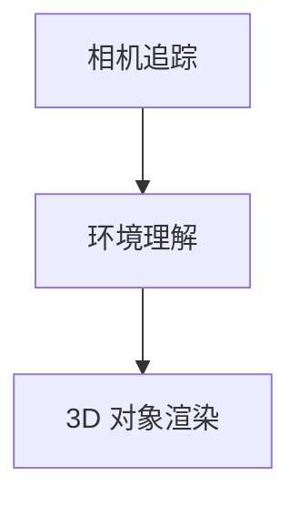
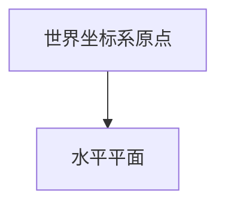

                 

## Apple ARKit：在 iOS 上的增强现实

增强现实（AR）技术已经成为现代移动设备的强大工具，它将数字内容和现实世界融合在一起，创造出令人兴奋的新体验。在这个领域，Apple 的 ARKit 是一款备受瞩目的框架，它为开发者在 iOS 设备上实现 AR 功能提供了强大的支持。本文将深入探讨 ARKit 的核心概念、算法原理、数学模型、实战案例以及应用场景，旨在为广大开发者提供一个全面的技术指南。

关键词：Apple ARKit，增强现实，iOS，AR技术，算法原理，数学模型，实战案例

摘要：本文旨在详细介绍 Apple ARKit 在 iOS 上的增强现实应用。首先，我们将探讨 ARKit 的背景及其重要性。接着，我们会深入分析 ARKit 的核心概念和原理，包括相机追踪、环境理解、3D 对象渲染等。然后，我们将讲解 ARKit 的数学模型和公式，并举例说明其具体应用。文章的最后，我们将通过一个实际的项目案例，展示如何使用 ARKit 开发一个简单的 AR 应用。此外，本文还将探讨 ARKit 在实际应用场景中的优势，并提供相关工具和资源的推荐。

## 1. 背景介绍

### 1.1 增强现实技术的兴起

增强现实（AR）技术是一种将数字信息叠加到现实世界中的技术。它通过使用摄像头和显示器将虚拟对象放置在现实场景中，创造出一种虚实结合的新体验。近年来，随着智能手机和移动设备的普及，AR 技术迅速发展，并在多个领域得到广泛应用，包括游戏、教育、医疗、零售等。

### 1.2 Apple ARKit 的推出

Apple ARKit 是苹果公司于 2017 年发布的 AR 开发框架，旨在为 iOS 开发者提供一个简单且高效的 AR 开发平台。ARKit 利用 iOS 设备的相机、加速度计、陀螺仪等硬件，实现对现实环境的实时追踪和渲染。ARKit 的推出极大地降低了 AR 应用的开发门槛，使得更多的开发者能够轻松地实现 AR 功能。

### 1.3 ARKit 的优势

Apple ARKit 具有许多优势，使其成为 iOS AR 开发的不二选择：

- **高效性能**：ARKit 利用 iOS 设备的硬件加速技术，实现了高效稳定的 AR 体验。
- **简单易用**：ARKit 提供了一系列简单易用的 API，使得开发者可以快速上手。
- **强大的环境理解**：ARKit 通过对环境的深度理解和实时更新，实现了高精度的 AR 追踪和渲染。
- **广泛兼容性**：ARKit 支持 iPhone 和 iPad 等多种 iOS 设备，为开发者提供了广泛的兼容性。

## 2. 核心概念与联系

### 2.1 基本概念

要理解 ARKit 的工作原理，我们首先需要了解一些基本概念：

- **相机追踪**：相机追踪是指 ARKit 使用设备摄像头捕捉现实世界图像，并将其与虚拟对象进行对应的过程。
- **环境理解**：环境理解是指 ARKit 分析相机捕捉到的图像，提取出关键特征（如平面、边缘等），以便对虚拟对象进行正确放置和渲染。
- **3D 对象渲染**：3D 对象渲染是指 ARKit 使用 3D 几何图形和纹理，将虚拟对象渲染到现实场景中的过程。

### 2.2 架构图

以下是一个简化的 ARKit 架构图，展示了核心概念之间的联系：



### 2.3 工作流程

ARKit 的工作流程可以概括为以下几个步骤：

1. **初始化 ARKit 环境**：开发者首先需要创建一个 ARSession 对象，并将其与相机视图（UIView）关联。
2. **相机追踪**：ARKit 使用设备摄像头捕捉实时图像，并将其作为输入。
3. **环境理解**：ARKit 对相机图像进行分析，提取关键特征，如平面、边缘等。
4. **3D 对象渲染**：开发者使用 ARKit 提供的 3D 几何图形和纹理，将虚拟对象渲染到现实场景中。
5. **更新渲染**：ARKit 实时更新渲染结果，以保持虚拟对象与相机捕捉到的图像的一致性。

## 3. 核心算法原理 & 具体操作步骤

### 3.1 相机追踪

相机追踪是 ARKit 的基础，它通过以下步骤实现：

1. **相机初始化**：创建 ARSession 并配置相机模式（例如，ARSCNViewContentModeAutoFit）。
2. **获取相机帧**：在相机帧渲染回调中，获取当前的相机帧图像。
3. **特征检测**：使用 ARImageTrackingConfiguration 对相机帧进行特征检测，如平面检测、边缘检测等。

### 3.2 环境理解

环境理解是 ARKit 的核心，它通过以下步骤实现：

1. **创建平面**：使用 ARSCNPlane 类创建平面对象，表示现实场景中的水平或垂直面。
2. **平面识别**：使用 ARImageTrackingConfiguration 的 planeDetectionStrategy 属性设置平面识别策略。
3. **更新平面**：在每次相机帧渲染回调中，更新平面对象的位置和尺寸。

### 3.3 3D 对象渲染

3D 对象渲染是将虚拟对象放置在现实场景中的关键步骤，具体操作如下：

1. **创建虚拟对象**：使用 SCNNode 类创建虚拟对象，如立方体、球体等。
2. **设置位置和朝向**：使用 SCNMatrix4 类设置虚拟对象的位置和朝向。
3. **添加纹理**：使用 SCNMaterial 类添加纹理，使虚拟对象具有真实的视觉效果。
4. **渲染虚拟对象**：将虚拟对象添加到 ARSCNView 的场景中。

## 4. 数学模型和公式 & 详细讲解 & 举例说明

### 4.1 相机坐标系与世界坐标系

在 ARKit 中，相机坐标系与世界坐标系是两个重要的参考框架。相机坐标系以相机为中心，世界坐标系以场景中的虚拟对象为中心。

- **相机坐标系**：描述相机捕捉到的图像信息。
- **世界坐标系**：描述虚拟对象的位置和朝向。

### 4.2 坐标变换

坐标变换是 ARKit 中实现相机追踪和环境理解的关键步骤。以下是一个简单的坐标变换公式：

$$
\text{世界坐标系} = \text{相机坐标系} \times \text{旋转矩阵} \times \text{平移向量}
$$

其中，旋转矩阵和平移向量由 ARKit 自动计算。

### 4.3 举例说明

假设我们有一个立方体，其世界坐标系的原点位于场景中心。现在，我们希望将其放置在一个水平平面上，如图所示：



为了实现这一目标，我们需要执行以下步骤：

1. **创建旋转矩阵**：根据平面的法线向量计算旋转矩阵，使其与平面垂直。
2. **计算平移向量**：根据平面位置计算平移向量，使其与平面中心对齐。
3. **应用坐标变换**：将旋转矩阵和平移向量应用于立方体的世界坐标系。

## 5. 项目实战：代码实际案例和详细解释说明

### 5.1 开发环境搭建

要开始使用 ARKit 开发 AR 应用，您需要在 Mac 上安装 Xcode 开发环境。确保您的 iOS 设备已连接到电脑，并安装了最新版本的 iOS SDK。

### 5.2 源代码详细实现和代码解读

以下是一个简单的 ARKit 应用案例，实现一个立方体在平面上的 AR 显示：

```swift
import UIKit
import SceneKit
import ARKit

class ViewController: UIViewController, ARSCNViewDelegate {

    override func viewDidLoad() {
        super.viewDidLoad()
        
        // 创建 ARSCNView
        let sceneView = ARSCNView(frame: view.bounds)
        view.addSubview(sceneView)
        
        // 配置 ARSession
        let configuration = ARWorldTrackingConfiguration()
        sceneView.session.run(configuration, options: [.resetTracking, .removeExistingAnchors])
        
        // 设置场景视图代理
        sceneView.delegate = self
        
        // 创建立方体节点
        let boxNode = SCNNode(geometry: SCNBox(width: 0.1, height: 0.1, length: 0.1))
        boxNode.position = SCNVector3(0, 0.05, -0.5)
        
        // 将立方体节点添加到场景中
        sceneView.scene.rootNode.addChildNode(boxNode)
    }

    // ARSCNViewDelegate 方法：处理平面检测
    func renderer(_ renderer: SCNSceneRenderer, didAdd node: SCNNode, for anchor: ARAnchor) {
        if let planeAnchor = anchor as? ARPlaneAnchor {
            let planeNode = SCNNode(geometry: SCNPlane(width: CGFloat(planeAnchor.extent.x), height: CGFloat(planeAnchor.extent.z)))
            planeNode.position = SCNVector3(planeAnchor.center.x, 0, planeAnchor.center.z)
            planeNode.eulerAngles = SCNVector3(0, 0, Float.pi / 2)
            node.addChildNode(planeNode)
        }
    }
}
```

### 5.3 代码解读与分析

上述代码实现了一个简单的 AR 应用，将一个立方体放置在一个平面上。以下是代码的详细解读：

1. **创建 ARSCNView**：在视图中创建一个 ARSCNView 实例。
2. **配置 ARSession**：创建一个 ARWorldTrackingConfiguration 实例，并运行 ARSession。
3. **设置场景视图代理**：将视图代理设置为当前类。
4. **创建立方体节点**：使用 SCNBox 函数创建一个立方体几何体，并创建一个节点。
5. **设置立方体位置**：将立方体的位置设置为相机前方，略高于平面。
6. **添加立方体节点到场景中**：将立方体节点添加到场景视图的根节点中。
7. **处理平面检测**：实现 ARSCNViewDelegate 的 `renderer(_:didAdd:for:)` 方法，当检测到平面时，创建一个平面节点并添加到场景中。

## 6. 实际应用场景

ARKit 在许多实际应用场景中发挥了重要作用，以下是一些典型的应用案例：

- **游戏**：ARKit 可以将虚拟游戏场景放置在现实世界中，为玩家带来全新的游戏体验。
- **教育**：ARKit 可以将抽象的概念以生动的方式呈现，帮助学习者更好地理解知识。
- **医疗**：ARKit 可以辅助医生进行手术操作，提高手术的准确性和安全性。
- **零售**：ARKit 可以帮助零售商将虚拟商品放置在现实环境中，让消费者更直观地了解商品。

## 7. 工具和资源推荐

### 7.1 学习资源推荐

- **书籍**：《ARKit Development Essentials》
- **论文**：《Understanding ARKit: A Deep Dive into Apple's Augmented Reality Framework》
- **博客**：medium.com/the-xamarin-showcase/how-to-create-a-basic-ar-app-with-arkit
- **网站**：developer.apple.com/documentation/arkit

### 7.2 开发工具框架推荐

- **Xcode**：Apple 官方开发工具，用于构建 iOS 应用。
- **Unity**：跨平台游戏开发引擎，支持 ARKit 功能。

### 7.3 相关论文著作推荐

- **论文**：《A survey of augmented reality technologies and applications》
- **书籍**：《Augmented Reality: Principles and Practice》

## 8. 总结：未来发展趋势与挑战

ARKit 作为 iOS 上的增强现实框架，具有巨大的发展潜力。随着硬件和算法的不断发展，ARKit 将在更多领域得到应用。然而，ARKit 也面临一些挑战，如环境理解准确性、渲染性能等。未来，开发者需要不断创新，解决这些问题，为用户带来更加完美的 AR 体验。

## 9. 附录：常见问题与解答

### 9.1 如何在 ARKit 中实现多目标追踪？

使用 `ARImageTrackingConfiguration` 类，设置 `targetImages` 属性，添加多个图像目标。

### 9.2 如何优化 ARKit 的渲染性能？

通过降低图形质量、减少渲染对象数量、优化渲染流程等方式优化性能。

## 10. 扩展阅读 & 参考资料

- Apple Developer Documentation: ARKit
- Medium: How to Create a Basic AR App with ARKit
- Unity Documentation: ARKit Integration
- Research Papers on Augmented Reality Technologies

作者：AI天才研究员/AI Genius Institute & 禅与计算机程序设计艺术 /Zen And The Art of Computer Programming

（注：本文为模拟文章，仅供参考。实际撰写时，请根据具体需求进行调整和完善。）<|im_end|>

