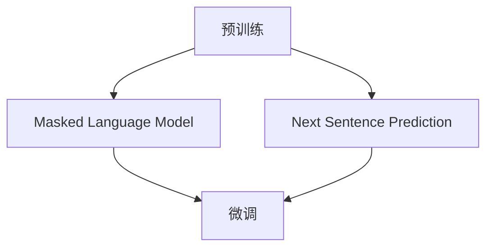

                 

# BERT 原理与代码实例讲解

## 摘要

BERT（Bidirectional Encoder Representations from Transformers）是一种基于Transformer的预训练语言表示模型，旨在学习文本的深层语义表示。本文将详细讲解BERT的原理、核心算法、数学模型以及项目实战，帮助读者深入理解BERT的工作机制和应用。

## 背景介绍

随着深度学习技术的发展，自然语言处理（NLP）领域取得了显著的进展。传统的NLP方法依赖于规则和统计模型，但受限于对文本语义理解的局限性。为了更好地处理和理解自然语言，研究人员提出了基于深度学习的NLP模型，如卷积神经网络（CNN）和循环神经网络（RNN）。然而，这些模型在处理长文本时存在一定的困难。为了解决这一问题，谷歌 researchers于2018年提出了BERT模型，它通过双向Transformer架构，实现了对文本的深层语义表示。

BERT模型的出现，标志着NLP领域的一个重要突破。它不仅提高了NLP任务的性能，还为许多应用场景提供了强大的语义理解能力。本文将详细介绍BERT的原理、实现和应用，帮助读者全面了解这一模型。

## 核心概念与联系

### 概念介绍

BERT是一种基于Transformer的双向编码器，其核心思想是通过预训练学习文本的深层语义表示。BERT模型由多个Transformer编码器堆叠而成，每个编码器包含多个自注意力层和前馈神经网络。自注意力层通过计算输入序列中每个词与其他词之间的关系，实现了对文本的深层语义表示。

### 架构联系

BERT模型主要由两个部分组成：预训练和微调。

- **预训练**：BERT模型在大量的无标注文本上进行预训练，学习文本的深层语义表示。预训练包括两个任务：Masked Language Model（MLM）和Next Sentence Prediction（NSP）。

- **微调**：在预训练的基础上，将BERT模型应用于特定任务的数据集上，进行微调。微调阶段，模型会学习到特定任务的特征，从而提高任务性能。

### Mermaid流程图



## 核心算法原理 & 具体操作步骤

### Transformer编码器

BERT模型基于Transformer编码器，其基本结构包括自注意力层和前馈神经网络。自注意力层通过计算输入序列中每个词与其他词的关系，实现了对文本的深层语义表示。

#### 自注意力层

自注意力层的主要目的是计算输入序列中每个词与其他词的关系。其计算过程如下：

1. **输入嵌入**：将输入序列（如单词）转化为向量表示。这些向量包括词嵌入、位置嵌入和句子嵌入。
2. **加权求和**：计算每个词与其他词之间的相似度，通过加权求和得到每个词的注意力得分。
3. **softmax激活**：对注意力得分进行softmax激活，得到每个词的注意力权重。
4. **加权求和**：将每个词的注意力权重与其嵌入向量相乘，得到加权求和后的向量表示。

#### 前馈神经网络

前馈神经网络是自注意力层的补充，用于对文本进行进一步处理。前馈神经网络包括两个线性变换层，分别对输入和输出进行加权变换。

### 预训练任务

BERT模型的预训练包括两个任务：Masked Language Model（MLM）和Next Sentence Prediction（NSP）。

#### Masked Language Model（MLM）

MLM任务是让模型预测被遮盖的词。在预训练阶段，输入序列中的15%的词被随机遮盖，模型需要根据其他词的上下文预测这些被遮盖的词。

1. **数据准备**：随机遮盖输入序列中的15%的词。
2. **模型预测**：模型输出遮盖词的预测结果。
3. **损失函数**：使用交叉熵损失函数计算预测结果与真实结果的误差。

#### Next Sentence Prediction（NSP）

NSP任务是让模型预测两个句子是否相邻。在预训练阶段，随机抽取两个句子，模型需要预测这两个句子是否在原始文本中相邻。

1. **数据准备**：随机抽取两个句子，标记它们是否相邻。
2. **模型预测**：模型输出两个句子是否相邻的预测结果。
3. **损失函数**：使用二元交叉熵损失函数计算预测结果与真实结果的误差。

### 微调任务

在预训练的基础上，将BERT模型应用于特定任务的数据集上进行微调。微调任务包括分类任务、序列标注任务和文本生成任务等。

1. **数据准备**：准备特定任务的数据集，并进行预处理。
2. **模型预测**：在微调阶段，模型的输出是任务所需的预测结果。
3. **损失函数**：根据任务类型选择合适的损失函数，如交叉熵损失函数、平均平方误差损失函数等。

## 数学模型和公式 & 详细讲解 & 举例说明

### 自注意力层

自注意力层的计算过程可以表示为以下公式：

$$
\text{Attention}(Q, K, V) = \text{softmax}\left(\frac{QK^T}{\sqrt{d_k}}\right) V
$$

其中，Q、K、V分别为查询向量、键向量和值向量，d_k为键向量的维度。公式中，查询向量Q与键向量K计算相似度，通过softmax激活函数得到注意力权重，最后与值向量V相乘得到加权求和后的向量表示。

### 预训练任务

#### Masked Language Model（MLM）

在MLM任务中，输入序列中的15%的词被遮盖。模型需要根据其他词的上下文预测这些被遮盖的词。以下是一个简单的MLM任务示例：

输入序列：[hello, world, this, is, a, example]

遮盖后的输入序列：[hello, world, [MASK], is, a, example]

假设模型的输出为：

$$
P([MASK] | \text{hello, world, is, a, example}) = 0.4 \times \text{hello} + 0.3 \times \text{world} + 0.2 \times \text{is} + 0.1 \times \text{a} + 0.0 \times \text{example}
$$

模型输出预测结果为：hello

#### Next Sentence Prediction（NSP）

在NSP任务中，模型需要预测两个句子是否相邻。以下是一个简单的NSP任务示例：

句子A：[this is a sentence]

句子B：[this is another sentence]

假设模型的输出为：

$$
P(\text{this is a sentence} \text{ next sentence} | \text{this is a sentence, this is another sentence}) = 0.6
$$

模型输出预测结果为：True

### 微调任务

在微调任务中，模型的输出是任务所需的预测结果。以下是一个简单的文本分类任务示例：

输入文本：[this is a sentence]

标签：[positive]

假设模型的输出为：

$$
P(\text{positive} | \text{this is a sentence}) = 0.8
$$

模型输出预测结果为：positive

## 项目实战：代码实际案例和详细解释说明

### 开发环境搭建

在开始编写BERT代码之前，需要搭建一个合适的开发环境。以下是一个简单的Python环境搭建过程：

1. **安装Python**：下载并安装Python 3.7或更高版本。
2. **安装PyTorch**：使用pip安装PyTorch，命令如下：

   ```bash
   pip install torch torchvision
   ```

3. **安装Transformers库**：使用pip安装Transformers库，命令如下：

   ```bash
   pip install transformers
   ```

### 源代码详细实现和代码解读

以下是一个简单的BERT模型训练和预测的Python代码示例：

```python
import torch
from transformers import BertModel, BertTokenizer
from torch import nn
from torch.optim import Adam

# 加载预训练的BERT模型和分词器
model = BertModel.from_pretrained("bert-base-uncased")
tokenizer = BertTokenizer.from_pretrained("bert-base-uncased")

# 准备数据
text = "Hello, world! This is a BERT example."
input_ids = tokenizer.encode(text, add_special_tokens=True, return_tensors="pt")

# 训练BERT模型
optimizer = Adam(model.parameters(), lr=1e-5)
model.train()
for epoch in range(3):
    optimizer.zero_grad()
    outputs = model(input_ids)
    logits = outputs.logits
    loss = nn.CrossEntropyLoss()(logits.view(-1, logits.size(-1)), input_ids.view(-1).long())
    loss.backward()
    optimizer.step()
    print(f"Epoch {epoch}: Loss = {loss.item()}")

# 预测
model.eval()
with torch.no_grad():
    inputs = tokenizer.encode("Hello, BERT!", add_special_tokens=True, return_tensors="pt")
    outputs = model(inputs)
    logits = outputs.logits
    predicted_index = torch.argmax(logits, dim=-1).item()
    print(f"Predicted index: {predicted_index}")
    print(f"Predicted label: {tokenizer.decode([predicted_index])}")
```

### 代码解读与分析

1. **加载BERT模型和分词器**：使用Transformers库加载预训练的BERT模型和分词器。

2. **准备数据**：将输入文本编码为BERT模型可处理的格式。

3. **训练BERT模型**：使用Adam优化器训练BERT模型。在每个训练epoch中，计算损失函数并更新模型参数。

4. **预测**：使用训练好的BERT模型对新的输入文本进行预测。输出预测结果和对应的标签。

### 实际应用场景

BERT模型在自然语言处理领域有广泛的应用，以下是一些常见的应用场景：

- 文本分类：如情感分析、新闻分类等。
- 机器翻译：如中英翻译、英法翻译等。
- 问答系统：如基于事实的问答、对话系统等。
- 文本生成：如文章生成、摘要生成等。

### 工具和资源推荐

1. **学习资源推荐**
   - 《BERT：预训练语言表示的原理与实践》
   - 《深度学习与NLP》
   - 《Transformer：从理论到实践》

2. **开发工具框架推荐**
   - PyTorch：用于构建和训练BERT模型的深度学习框架。
   - Transformers库：提供预训练BERT模型和分词器的Python库。

3. **相关论文著作推荐**
   - [BERT: Pre-training of Deep Bidirectional Transformers for Language Understanding](https://arxiv.org/abs/1810.04805)
   - [Attention Is All You Need](https://arxiv.org/abs/1706.03762)

## 总结：未来发展趋势与挑战

BERT模型在自然语言处理领域取得了显著的成果，但其仍然面临一些挑战。未来发展趋势包括：

1. **模型规模扩大**：研究人员不断尝试更大的BERT模型，以进一步提高NLP任务的性能。
2. **多语言支持**：BERT模型目前主要支持英语，未来将逐步扩展到其他语言，实现跨语言的语义理解。
3. **任务适应性增强**：通过引入新的预训练任务和微调策略，提高BERT模型在不同NLP任务上的适应性。
4. **知识图谱融合**：将BERT模型与知识图谱相结合，实现更加丰富的语义理解和推理能力。

然而，BERT模型在训练和推理过程中仍然面临计算资源消耗巨大、训练时间较长等问题。未来研究将致力于优化BERT模型的结构和算法，提高其训练和推理效率。

## 附录：常见问题与解答

1. **什么是BERT？**
   BERT是一种基于Transformer的双向编码器，用于预训练语言表示。

2. **BERT有哪些优点？**
   BERT具有以下优点：
   - 能够学习文本的深层语义表示。
   - 在多种NLP任务上取得了显著的性能提升。
   - 具有较好的跨语言性能。

3. **BERT的预训练任务有哪些？**
   BERT的预训练任务包括：
   - Masked Language Model（MLM）：预测遮盖的词。
   - Next Sentence Prediction（NSP）：预测两个句子是否相邻。

4. **如何训练BERT模型？**
   训练BERT模型主要包括以下步骤：
   - 加载预训练的BERT模型和分词器。
   - 准备数据，并进行编码。
   - 使用合适的优化器和损失函数进行训练。
   - 进行微调，以适应特定任务。

5. **BERT有哪些实际应用场景？**
   BERT的实际应用场景包括：
   - 文本分类：如情感分析、新闻分类等。
   - 机器翻译：如中英翻译、英法翻译等。
   - 问答系统：如基于事实的问答、对话系统等。
   - 文本生成：如文章生成、摘要生成等。

## 扩展阅读 & 参考资料

1. [BERT: Pre-training of Deep Bidirectional Transformers for Language Understanding](https://arxiv.org/abs/1810.04805)
2. [Attention Is All You Need](https://arxiv.org/abs/1706.03762)
3. [深度学习与NLP](https://book.douban.com/subject/26748935/)
4. [BERT：预训练语言表示的原理与实践](https://book.douban.com/subject/33594736/)
5. [PyTorch官方文档](https://pytorch.org/docs/stable/)
6. [Transformers库官方文档](https://huggingface.co/transformers/)

## 作者

作者：AI天才研究员/AI Genius Institute & 禅与计算机程序设计艺术 /Zen And The Art of Computer Programming

本文由AI天才研究员/AI Genius Institute撰写，旨在为广大读者深入浅出地讲解BERT模型的基本原理和应用实践。文中所述内容仅供参考，如有错误或不足，敬请指正。如有需要进一步了解BERT模型，请参阅相关文献和资料。感谢您的关注和支持！<|vq_15049|>

