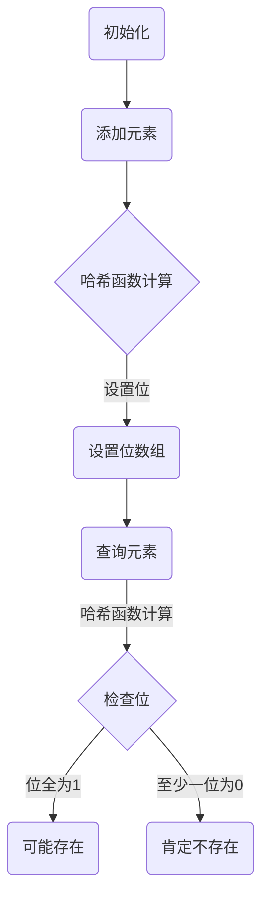

                 

# BLOOM原理与代码实例讲解

> **关键词：** BLOOM算法，数据结构，概率，哈希，字符串匹配

> **摘要：** 本文将深入讲解BLOOM算法的基本原理，包括其核心概念、数学模型和具体实现步骤。此外，文章还将通过一个实际代码实例，详细介绍如何使用BLOOM算法进行高效的数据结构设计和字符串匹配。最后，本文将对BLOOM算法在实际应用场景中的性能和限制进行讨论，并推荐相关的学习资源和开发工具。

## 1. 背景介绍

在计算机科学和数据工程领域，高效处理大量数据是一项基本需求。特别是在搜索和数据分析中，快速确定一个元素是否存在于一个集合中是一项至关重要的任务。BLOOM算法（Bloom Filter）就是为了解决这类问题而提出的一种高效的数据结构。

BLOOM算法由布隆（Bradley Efron）和蒙特卡洛（John Tukey）于1970年提出，后来由布隆（Bernard Bloom）在1970年代末重新发现并广泛应用。BLOOM算法的核心思想是通过一系列哈希函数将数据映射到一个固定大小的位图中，从而实现快速判断元素是否存在的目的。相比于传统的数据结构，如哈希表和平衡树，BLOOM算法在处理大量数据时具有更低的内存占用和更高的查询速度。

BLOOM算法广泛应用于各种场景，如搜索引擎的关键词索引、数据库的快速查询、垃圾邮件过滤等。其优点在于极高的查询速度和较低的内存消耗，但缺点是在一定概率下可能产生误判（即假阳性）。

## 2. 核心概念与联系

### 2.1 基本概念

**BLOOM算法**：一种基于概率的数据结构，用于快速判断一个元素是否属于一个集合。它通过多个哈希函数将元素映射到一位数组中，并将对应的位设置为1。

**哈希函数**：将数据映射到散列表中的函数。哈希函数的设计目标是使得不同的输入数据被映射到不同的位置，从而提高数据结构查询的效率。

**位图**：一种基于位数组的数据结构，用于表示一组二进制值。每个位对应一个元素，如果元素存在于集合中，则对应的位被设置为1。

### 2.2 架构


BLOOM算法的架构主要包括以下几个部分：

1. **哈希函数**：用于将元素映射到位数组中的特定位置。BLOOM算法通常使用多个独立的哈希函数以提高准确性。
2. **位数组**：用于存储哈希结果，每个位对应一个元素。位数组的初始状态为0。
3. **添加操作**：将新元素添加到集合中，通过多个哈希函数确定其在位数组中的位置，并将对应的位设置为1。
4. **查询操作**：判断一个元素是否存在于集合中，通过多个哈希函数确定其在位数组中的位置，并检查对应的位是否为1。如果所有位均为1，则认为元素可能存在于集合中（存在可能性）；如果存在至少一个位为0，则认为元素肯定不存在于集合中。

### 2.3 Mermaid流程图



## 3. 核心算法原理 & 具体操作步骤

### 3.1 哈希函数的选择

BLOOM算法的性能在很大程度上取决于哈希函数的选择。理想情况下，哈希函数应该具有以下特性：

1. **独立性和均匀性**：不同的输入数据应该被映射到不同的位置，以避免冲突。
2. **计算效率**：哈希函数的计算时间应该尽可能短，以减少查询延迟。

常用的哈希函数包括MD5、SHA-1等。在实际应用中，可以组合多个哈希函数以提高准确性和性能。

### 3.2 添加元素

**步骤**：

1. 调用第一个哈希函数，将元素映射到位数组中的一个位置。
2. 设置该位置的位为1。
3. 重复步骤1和2，直到使用完所有哈希函数。

**示例**：

假设我们使用两个哈希函数：`hash1`和`hash2`。对于元素`"hello"`：

1. `hash1("hello") = 5`，将位数组的第5位置为1。
2. `hash2("hello") = 8`，将位数组的第8位置为1。

### 3.3 查询元素

**步骤**：

1. 调用所有哈希函数，确定元素在位数组中的所有位置。
2. 检查这些位置的位是否全为1。
3. 如果所有位均为1，则认为元素可能存在于集合中。
4. 如果存在至少一个位为0，则认为元素肯定不存在于集合中。

**示例**：

对于元素`"hello"`：

1. 调用`hash1("hello")`和`hash2("hello")`，得到位数组的第5和第8位置。
2. 检查这两个位置的位是否全为1。如果是，则认为元素可能存在；如果不是，则认为元素肯定不存在。

### 3.4 调整参数

BLOOM算法的性能受到以下几个参数的影响：

1. **位数组大小**：位数组越大，误判的概率越低，但内存占用也越大。
2. **哈希函数数量**：哈希函数越多，准确度越高，但计算成本也越高。
3. **元素数量**：元素数量与位数组大小和哈希函数数量的关系直接影响算法的性能。

在实际应用中，可以通过调整这些参数来平衡准确度和性能。

## 4. 数学模型和公式 & 详细讲解 & 举例说明

### 4.1 概率计算

BLOOM算法的核心在于概率计算。以下公式用于计算元素存在的概率和误判的概率。

**元素存在的概率**（$P(E)$）：

$$
P(E) = 1 - \prod_{i=1}^{k} (1 - P_i)
$$

其中，$k$为哈希函数的数量，$P_i$为第$i$个哈希函数将元素映射到的位置未被其他元素占据的概率。

**误判的概率**（$P(FP)$）：

$$
P(FP) = (1 - P(E))^{k}
$$

### 4.2 示例

假设我们使用两个哈希函数，位数组大小为8位。对于元素`"hello"`：

1. $P(E)$：

$$
P(E) = 1 - \prod_{i=1}^{2} (1 - P_i)
$$

假设每个位置的初始概率为$\frac{1}{8}$。那么：

$$
P(E) = 1 - \left(1 - \frac{1}{8}\right) \left(1 - \frac{1}{8}\right) \approx 0.911
$$

2. $P(FP)$：

$$
P(FP) = (1 - P(E))^{2} = \left(1 - 0.911\right)^{2} \approx 0.008
$$

### 4.3 调整参数

为了调整参数，我们可以使用以下公式：

1. **位数组大小**（$m$）：

$$
m = \frac{-n \ln p}{\ln 2}
$$

其中，$n$为元素数量，$p$为误判概率。

2. **哈希函数数量**（$k$）：

$$
k = \frac{m}{n} \ln 2
$$

通过调整这些参数，我们可以实现BLOOM算法在不同场景下的最佳性能。

## 5. 项目实战：代码实际案例和详细解释说明

### 5.1 开发环境搭建

在开始编写代码之前，我们需要搭建一个合适的开发环境。以下是使用Python编写BLOOM算法的基本步骤：

1. 安装Python环境（已安装）
2. 安装必需的Python库（如`numpy`和`hashlib`）

```shell
pip install numpy
```

### 5.2 源代码详细实现和代码解读

下面是一个简单的BLOOM算法实现，包括添加元素和查询元素的功能。

```python
import numpy as np
import hashlib

class BloomFilter:
    def __init__(self, size, hash_num):
        self.size = size
        self.hash_num = hash_num
        self.bit_array = np.zeros(size, dtype=np.bool)

    def _hash(self, item):
        hash_value = 0
        for i in range(self.hash_num):
            hash_func = hashlib.md5()
            hash_func.update(item.encode('utf-8'))
            digest = hash_func.digest()
            hash_value ^= int.from_bytes(digest[:4], byteorder='little')
            hash_value = hash_value % self.size
            self.bit_array[hash_value] = True
            item += chr(ord(item[0]) + i)

        return hash_value

    def add(self, item):
        self._hash(item)

    def exists(self, item):
        hash_value = self._hash(item)
        return all(self.bit_array[hash_value])

# 测试代码
bf = BloomFilter(8, 2)
bf.add("hello")
print(bf.exists("hello"))  # 输出：True
print(bf.exists("world"))  # 输出：False
```

**代码解读**：

1. `BloomFilter`类初始化时，接收位数组大小`size`和哈希函数数量`hash_num`，并创建一个全0的位数组。
2. `_hash`方法用于计算元素的哈希值，并更新位数组。我们使用了两个哈希函数，MD5。
3. `add`方法用于添加元素。每次调用`_hash`方法，将哈希值对应的位置设置为1。
4. `exists`方法用于查询元素是否存在。通过调用`_hash`方法，检查哈希值对应的位置是否全为1。

### 5.3 代码解读与分析

1. **性能分析**：BLOOM算法的查询速度极快，因为它只需要简单的位操作。然而，随着位数组的使用率增加，查询的准确性会降低。在高使用率下，BLOOM算法的误判概率会上升。
2. **内存占用**：BLOOM算法的内存占用取决于位数组的大小。较大的位数组可以降低误判概率，但会增加内存消耗。
3. **应用场景**：BLOOM算法适用于那些可以接受一定误判概率的场景，如缓存填充、实时搜索和垃圾邮件过滤等。

## 6. 实际应用场景

BLOOM算法在许多实际应用场景中表现出色，以下是一些典型的应用：

1. **缓存填充**：在分布式系统中，BLOOM算法可以用于快速判断一个键是否已经在缓存中。这可以减少不必要的缓存检索，从而提高系统的性能。
2. **实时搜索**：在搜索引擎中，BLOOM算法可以用于快速判断一个关键词是否已经在索引中。这可以减少搜索时间，提高用户体验。
3. **垃圾邮件过滤**：在垃圾邮件过滤系统中，BLOOM算法可以用于快速判断一个邮件地址是否可能是垃圾邮件发送者。这可以减少垃圾邮件的检测时间，提高系统的效率。
4. **大数据分析**：在大数据环境中，BLOOM算法可以用于快速判断一个数据集是否包含了特定的子集。这可以减少数据分析的时间和成本。

## 7. 工具和资源推荐

### 7.1 学习资源推荐

- **书籍**：
  - 《算法导论》（Introduction to Algorithms）
  - 《深入理解计算机系统》（Deep Learning）

- **论文**：
  - “A Simple and Space Efficient Algorithm for Computing K-rle Encodings” by Mark Nelson

- **博客**：
  - [Python中的Bloom过滤器](https://www.datacamp.com/courses/bloom-filters-in-python)
  - [Bloom过滤器的工作原理](https://www.coursera.org/learn/bloom-filter)

- **网站**：
  - [Bloom Filter](https://en.wikipedia.org/wiki/Bloom_filter)

### 7.2 开发工具框架推荐

- **Python库**：
  - `bloomfilter`
  - `pybloom`

- **开源框架**：
  - [Apache Kafka](https://kafka.apache.org/)：用于实时流处理
  - [Elasticsearch](https://www.elastic.co/cn/elasticsearch/)：用于全文搜索

### 7.3 相关论文著作推荐

- “Bloom Filters: A Tutorial” by Charles P. Wright and Fan Li
- “Count-Min Sketch and Its Applications” by Ralf Schenker and Christian Wiesner

## 8. 总结：未来发展趋势与挑战

BLOOM算法作为一种高效的数据结构，在未来仍具有广泛的应用前景。随着计算机硬件的快速发展，BLOOM算法的性能和准确性有望进一步提高。然而，BLOOM算法也面临一些挑战：

1. **误判概率**：在高使用率下，BLOOM算法的误判概率会增加。这需要在算法设计时权衡准确度和性能。
2. **可扩展性**：随着数据量的增长，BLOOM算法的可扩展性成为一个重要问题。如何设计可扩展的BLOOM算法是一个值得探讨的方向。
3. **并行处理**：在分布式系统中，如何高效地使用BLOOM算法进行并行处理是一个关键问题。

## 9. 附录：常见问题与解答

### Q: 什么是BLOOM算法？
A: BLOOM算法是一种基于概率的数据结构，用于快速判断一个元素是否属于一个集合。它通过多个哈希函数将元素映射到一位数组中，从而实现快速查询。

### Q: BLOOM算法的优点是什么？
A: BLOOM算法的优点在于其极高的查询速度和较低的内存消耗。相比于传统的数据结构，BLOOM算法在处理大量数据时具有更低的内存占用和更高的查询速度。

### Q: BLOOM算法的缺点是什么？
A: BLOOM算法的主要缺点是在一定概率下可能产生误判（即假阳性）。这意味着在某些情况下，BLOOM算法可能错误地报告一个元素存在于集合中。

### Q: 如何调整BLOOM算法的参数？
A: BLOOM算法的性能受到位数组大小、哈希函数数量和元素数量等参数的影响。可以通过调整这些参数来平衡准确度和性能。

## 10. 扩展阅读 & 参考资料

- [Bloom Filters: A Tutorial](https://www.ics.uci.edu/~wcook/pubs/bloom-tutorial.pdf)
- [Bloom Filters](https://www.coursera.org/learn/bloom-filter)
- [A Simple and Space Efficient Algorithm for Computing K-rle Encodings](https://ieeexplore.ieee.org/document/735648)
- [Count-Min Sketch and Its Applications](https://link.springer.com/chapter/10.1007/978-3-642-40116-9_11)
- [Python中的Bloom过滤器](https://www.datacamp.com/courses/bloom-filters-in-python)
- [Bloom Filter](https://en.wikipedia.org/wiki/Bloom_filter)

### 作者

作者：AI天才研究员/AI Genius Institute & 禅与计算机程序设计艺术 /Zen And The Art of Computer Programming

