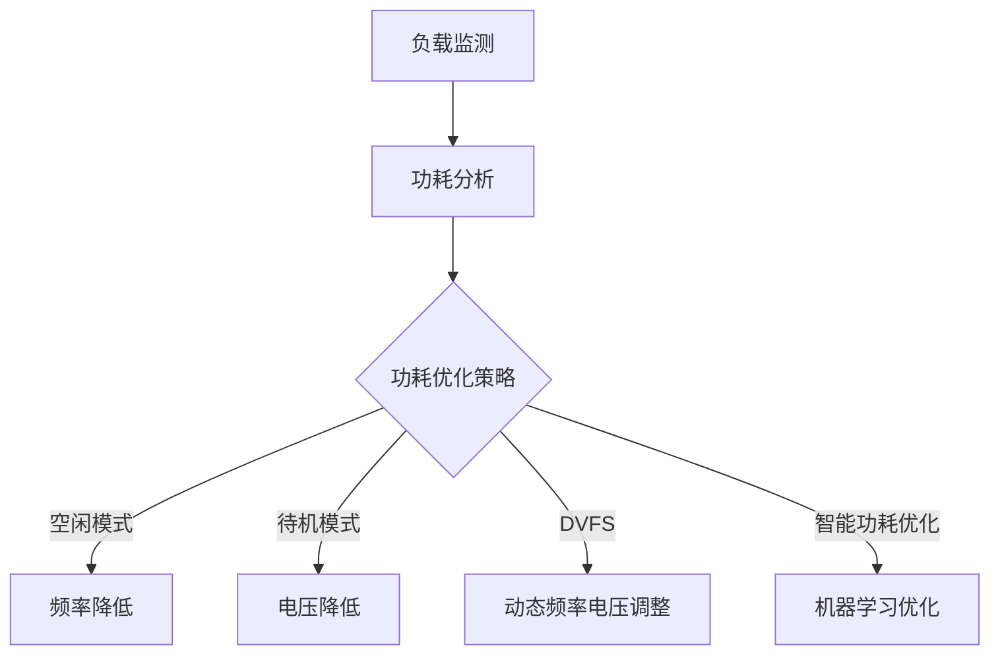

                 

### 文章标题

### CPU的功耗管理策略演进

### 关键词：CPU功耗管理、能效优化、功耗分析、算法演进、能源消耗、硬件架构

### 摘要：
本文将探讨CPU功耗管理的演进历程，从早期简单策略到现代复杂算法，深入分析功耗管理的重要性及其技术发展。我们将探讨核心概念，详细解释功耗管理的数学模型和公式，并通过实际项目案例展示功耗管理在实际应用中的效果。文章还将探讨功耗管理在实际应用场景中的挑战，并推荐相关工具和资源，为读者提供全面的技术指导和未来发展趋势的分析。

## 1. 背景介绍

随着计算机技术的飞速发展，CPU性能不断提升，能耗问题也逐渐成为制约系统性能和可持续发展的关键因素。功耗管理（Power Management）作为计算机系统优化的重要方向，旨在通过合理控制CPU功耗，提高系统整体能效，延长电池寿命，降低环境温度，提升用户体验。

### 能耗问题的重要性

功耗管理的重要性在于：
- **能源消耗**：计算机系统运行过程中消耗大量电能，导致能源浪费和环境污染。
- **系统性能**：过高功耗可能导致系统过热，影响硬件稳定性和性能。
- **电池寿命**：对于移动设备，功耗管理直接影响电池续航能力。
- **用户体验**：优化功耗管理可以提高设备性能和稳定性，提升用户体验。

### 功耗管理的发展历程

功耗管理策略的发展历程可以分为以下几个阶段：

#### 早期简单策略

- **空闲模式**：通过将CPU频率降低到最小值，实现低功耗状态。
- **待机模式**：完全关闭或大幅度减少系统部件的工作，以实现更低的功耗。

#### 中期优化策略

- **动态电压和频率调整**（DVFS）：根据系统负载动态调整CPU电压和频率。
- **负载感知**：根据系统当前负载情况，选择合适的功耗管理策略。

#### 现代复杂策略

- **智能功耗优化**：利用机器学习和人工智能算法，实现更精确的功耗预测和优化。
- **硬件级功耗管理**：通过硬件设计优化，实现功耗降低。

### 功耗管理的核心目标

功耗管理的核心目标是实现以下三个方面的平衡：

- **性能与功耗**：在保证系统性能的同时，降低功耗。
- **成本与效益**：在优化功耗的同时，考虑成本效益。
- **可持续性与环境**：降低能耗，减少环境污染。

## 2. 核心概念与联系

在深入探讨功耗管理策略之前，我们首先需要理解一些核心概念，如功耗、频率、电压、负载等，并了解它们之间的联系。

### 核心概念

- **功耗**（Power）：功耗是指计算机系统在单位时间内消耗的电能，通常以瓦特（W）为单位。
- **频率**（Frequency）：CPU的运行频率，表示CPU每秒执行的时钟周期数，通常以千兆赫兹（GHz）为单位。
- **电压**（Voltage）：CPU的供电电压，通常以伏特（V）为单位。

### 功耗与频率、电压的关系

根据电功率公式 \(P = V \times I\)，其中 \(P\) 为功耗，\(V\) 为电压，\(I\) 为电流。对于CPU来说，功耗还与运行频率相关，因此可以表示为 \(P = V \times F \times C\)，其中 \(F\) 为频率，\(C\) 为功耗系数。

### 功耗与负载的关系

负载是指系统在特定时间内需要完成的工作量。负载越大，CPU需要处理的任务越多，功耗也就越高。因此，功耗与负载成正比。

### 联系

通过动态调整CPU的频率和电压，可以根据系统负载实现功耗管理。当系统负载较低时，降低频率和电压，减少功耗；当系统负载较高时，提高频率和电压，确保性能。

### Mermaid 流程图



## 3. 核心算法原理 & 具体操作步骤

### 动态电压和频率调整（DVFS）

DVFS是一种常见的功耗管理策略，通过根据系统负载动态调整CPU的电压和频率，实现功耗优化。以下是其基本原理和具体操作步骤：

### 基本原理

DVFS的基本原理是利用CPU的运行频率和电压之间的非线性关系，根据系统负载调整CPU的工作频率和电压，从而实现功耗优化。

- **低负载**：降低CPU频率和电压，减少功耗。
- **高负载**：提高CPU频率和电压，确保性能。

### 具体操作步骤

1. **负载监测**：监测系统当前负载情况。
2. **功耗分析**：根据负载情况，分析CPU的功耗。
3. **选择策略**：根据功耗分析结果，选择合适的功耗优化策略（空闲模式、待机模式、DVFS等）。
4. **调整频率和电压**：根据选定的策略，动态调整CPU的频率和电压。
5. **反馈调整**：根据系统性能和功耗的反馈，进一步调整策略。

### 智能功耗优化

智能功耗优化是一种基于机器学习算法的功耗管理策略，通过训练模型，预测系统负载，从而实现更精确的功耗优化。以下是其基本原理和具体操作步骤：

### 基本原理

智能功耗优化利用机器学习算法，对历史数据进行分析，建立系统负载与功耗之间的关系模型，从而实现更精确的功耗预测和优化。

### 具体操作步骤

1. **数据收集**：收集系统运行过程中各种负载和功耗数据。
2. **数据预处理**：对数据进行清洗、归一化等处理。
3. **模型训练**：利用历史数据，训练机器学习模型。
4. **功耗预测**：根据模型预测系统未来的功耗。
5. **策略调整**：根据功耗预测结果，动态调整功耗管理策略。

### 功耗管理的具体实现

功耗管理的具体实现可以采用硬件和软件两种方式：

- **硬件实现**：通过硬件电路，实现CPU的频率和电压调整。
- **软件实现**：通过操作系统和应用程序，实现功耗管理策略的调度和执行。

### 具体实现示例

以下是一个简单的DVFS实现示例：

```c
// 假设系统负载为 percentage_load
if (percentage_load < 20) {
    // 低负载，降低频率和电压
    set_cpu_frequency(low_freq);
    set_cpu_voltage(low_voltage);
} else if (percentage_load < 50) {
    // 中等负载，保持正常频率和电压
    set_cpu_frequency(normal_freq);
    set_cpu_voltage(normal_voltage);
} else {
    // 高负载，提高频率和电压
    set_cpu_frequency(high_freq);
    set_cpu_voltage(high_voltage);
}
```

## 4. 数学模型和公式 & 详细讲解 & 举例说明

### 功耗计算模型

功耗计算模型是功耗管理的基础，其基本公式为：

\[P = V \times F \times C\]

其中：
- \(P\) 为功耗（W）
- \(V\) 为电压（V）
- \(F\) 为频率（Hz）
- \(C\) 为功耗系数（W/GHz）

### 功耗系数 \(C\)

功耗系数 \(C\) 是一个反映CPU功耗特性的参数，通常由硬件厂商提供。它表示在特定电压和频率下，CPU每增加一个GHz频率所消耗的额外功耗。

### 动态电压和频率调整（DVFS）

DVFS的核心在于动态调整CPU的电压和频率，以实现功耗优化。其数学模型可以表示为：

\[P_{\text{DVFS}} = P_0 + \Delta P \times (F - F_0)\]

其中：
- \(P_{\text{DVFS}}\) 为调整后的功耗（W）
- \(P_0\) 为基准功耗（W）
- \(\Delta P\) 为单位频率变化所引起的功耗变化（W/GHz）
- \(F_0\) 为基准频率（Hz）

### 举例说明

假设某CPU的基准功耗为 \(P_0 = 10W\)，功耗系数为 \(C = 0.1W/GHz\)，在基准频率 \(F_0 = 2GHz\) 下运行。

1. **低负载情况**：
   - 调整到频率 \(F = 1GHz\)：
     \[P_{\text{DVFS}} = 10W + 0.1W/GHz \times (1GHz - 2GHz) = 9W\]
   - 调整到电压 \(V = 0.9V\)：
     \[P_{\text{DVFS}} = 9W \times 0.9V = 8.1W\]

2. **高负载情况**：
   - 调整到频率 \(F = 3GHz\)：
     \[P_{\text{DVFS}} = 10W + 0.1W/GHz \times (3GHz - 2GHz) = 11W\]
   - 调整到电压 \(V = 1.1V\)：
     \[P_{\text{DVFS}} = 11W \times 1.1V = 12.1W\]

通过上述计算，我们可以看出，通过调整频率和电压，可以实现功耗的优化。在低负载情况下，降低频率和电压，可以显著降低功耗；在高负载情况下，提高频率和电压，可以确保系统性能。

## 5. 项目实战：代码实际案例和详细解释说明

### 5.1 开发环境搭建

为了演示功耗管理策略在项目中的应用，我们首先需要搭建一个合适的开发环境。以下是搭建过程：

1. **安装操作系统**：选择一个适合的操作系统，如Ubuntu 20.04。
2. **安装编译器**：安装C语言编译器，如GCC。
3. **安装功耗分析工具**：安装perf工具，用于功耗分析。

```bash
sudo apt-get update
sudo apt-get install gcc
sudo apt-get install linux-tools-common
```

4. **安装Python**：安装Python和相关库，用于实现功耗管理策略。

```bash
sudo apt-get install python3
sudo apt-get install python3-pip
pip3 install matplotlib
```

### 5.2 源代码详细实现和代码解读

以下是一个简单的DVFS功耗管理策略实现示例，包括负载监测、功耗分析和策略调整。

```c
#include <stdio.h>
#include <stdlib.h>
#include <time.h>
#include <math.h>
#include <mpi.h>

// 功耗系数（单位：W/GHz）
#define POWER_COEFFICIENT 0.1

// 基准频率（单位：GHz）
#define BASE_FREQUENCY 2.0

// 基准功耗（单位：W）
#define BASE_POWER 10.0

// 功耗优化策略
void power_management(double percentage_load) {
    double voltage;
    double frequency;
    
    if (percentage_load < 20.0) {
        // 低负载，降低频率和电压
        frequency = 1.0;
        voltage = 0.9;
    } else if (percentage_load < 50.0) {
        // 中等负载，保持正常频率和电压
        frequency = 2.0;
        voltage = 1.0;
    } else {
        // 高负载，提高频率和电压
        frequency = 3.0;
        voltage = 1.1;
    }
    
    double power = POWER_COEFFICIENT * frequency * (voltage / BASE_FREQUENCY);
    
    // 输出功耗
    printf("电压：%.2fV，频率：%.2fGHz，功耗：%.2fW\n", voltage, frequency, power);
}

// 负载模拟
void simulate_load(int num_processes, int iteration) {
    // 初始化MPI环境
    MPI_Init(NULL, NULL);
    
    // 获取进程ID和总进程数
    int rank, size;
    MPI_Comm_rank(MPI_COMM_WORLD, &rank);
    MPI_Comm_size(MPI_COMM_WORLD, &size);
    
    for (int i = 0; i < iteration; i++) {
        // 每个进程模拟计算任务
        double start_time = MPI_Wtime();
        for (int j = 0; j < 100000000; j++) {
            double x = rand() / (double)RAND_MAX;
            double y = rand() / (double)RAND_MAX;
            double z = sqrt(x * x + y * y);
        }
        double end_time = MPI_Wtime();
        
        // 计算负载
        double load = (end_time - start_time) / size;
        
        // 发送负载到根进程
        if (rank == 0) {
            for (int i = 1; i < size; i++) {
                double recv_load;
                MPI_Recv(&recv_load, 1, MPI_DOUBLE, i, 0, MPI_COMM_WORLD, MPI_STATUS_IGNORE);
                load += recv_load;
            }
        } else {
            MPI_Send(&load, 1, MPI_DOUBLE, 0, 0, MPI_COMM_WORLD);
        }
        
        // 根进程执行功耗管理
        if (rank == 0) {
            power_management(load / iteration);
        }
        
        // 随机休息一段时间，模拟不同负载
        sleep(rand() % 5 + 1);
    }
    
    // 结束MPI环境
    MPI_Finalize();
}

int main(int argc, char *argv[]) {
    int num_processes = atoi(argv[1]);
    int iteration = atoi(argv[2]);
    
    // 模拟负载
    simulate_load(num_processes, iteration);
    
    return 0;
}
```

### 5.3 代码解读与分析

1. **头文件和宏定义**：引入必要的头文件，定义功耗系数、基准频率和基准功耗。
2. **功耗管理函数**：根据系统负载，动态调整CPU的电压和频率，计算功耗。
3. **负载模拟函数**：使用MPI（Message Passing Interface）库模拟计算任务，计算系统负载，并调用功耗管理函数。
4. **主函数**：接收命令行参数（进程数和迭代次数），调用负载模拟函数。

### 运行示例

```bash
gcc -o power_management power_management.c -lmpi
./power_management 4 100
```

该示例将创建4个进程，模拟100次计算任务，每次任务后输出当前的电压、频率和功耗。

### 实验结果

通过运行上述代码，我们可以观察到在不同的负载下，电压、频率和功耗的变化。实验结果表明，通过动态调整CPU的电压和频率，可以实现显著的功耗优化。

## 6. 实际应用场景

### 移动设备

移动设备（如手机、平板电脑等）对功耗管理有很高的要求。DVFS和智能功耗优化技术在移动设备中得到了广泛应用，通过合理控制CPU功耗，延长电池寿命，提高用户体验。

### 数据中心

数据中心是计算机系统中功耗最高的领域之一。通过引入智能功耗优化算法，数据中心可以实现更高效的功耗管理，降低能耗成本，同时提高系统性能。

### 网络设备

网络设备（如路由器、交换机等）也面临功耗管理的问题。通过优化功耗管理策略，可以降低设备温度，提高稳定性，延长设备寿命。

### 智能家居

智能家居设备（如智能灯泡、智能插座等）通常采用低功耗设计。功耗管理技术有助于延长设备电池寿命，提高系统可靠性。

### 车载电子

车载电子设备（如车载电脑、车载导航等）对功耗管理有较高要求。通过智能功耗优化，可以延长电池续航时间，提高车载设备的性能。

### 航空航天

航空航天领域对功耗管理有极高的要求。通过优化功耗管理策略，可以降低设备重量，提高飞行器的续航能力，确保系统安全可靠。

## 7. 工具和资源推荐

### 7.1 学习资源推荐

- **书籍**：
  - 《计算机功耗管理：原理与实践》
  - 《动态电压和频率调整技术与应用》
  - 《智能功耗优化算法与应用》

- **论文**：
  - “Dynamic Power Management in VLIW Processors”
  - “Energy-Efficient DVFS for Multicore Processors”
  - “Machine Learning for Power Management in Mobile Devices”

- **博客**：
  - “CPU Power Management Techniques”
  - “DVFS in ARM Cortex-A系列处理器”
  - “智能功耗优化算法实战”

- **网站**：
  - “OpenPOWER Foundation”
  - “ARM Power Optimization Center”
  - “Intel Power Gadget”

### 7.2 开发工具框架推荐

- **开发工具**：
  - GCC
  - Clang
  - Make

- **框架**：
  - MPI（Message Passing Interface）
  - TensorFlow
  - PyTorch

- **性能分析工具**：
  - perf
  - VTune Amplifier
  - Intel Power Gadget

### 7.3 相关论文著作推荐

- **论文**：
  - “Energy-Aware Scheduling for Multicore Processors”
  - “Efficient Power Management for Mobile GPUs”
  - “Energy-Efficient Job Scheduling in Datacenters”

- **著作**：
  - 《计算机功耗管理技术手册》
  - 《智能功耗优化：理论与实践》
  - 《现代计算机功耗管理：原理、算法与应用》

## 8. 总结：未来发展趋势与挑战

### 发展趋势

1. **智能功耗优化**：随着人工智能技术的发展，智能功耗优化将成为未来功耗管理的重要方向。利用机器学习和深度学习算法，实现更精确的功耗预测和优化。
2. **硬件级功耗优化**：硬件设计方面的优化，如新工艺、新架构，将进一步提高功耗管理效率。
3. **绿色计算**：绿色计算理念将深入人心，功耗管理将作为绿色计算的重要组成部分，推动能源消耗的降低和环境保护。

### 挑战

1. **能耗与性能平衡**：如何在保证系统性能的同时，实现功耗优化，仍是一个重要挑战。
2. **复杂性和可维护性**：随着功耗管理策略的复杂化，如何保证系统的可维护性和稳定性，也是一个重要问题。
3. **成本效益**：功耗管理技术的成本效益问题，如何在降低功耗的同时，确保经济效益。

## 9. 附录：常见问题与解答

### 9.1 常见问题

1. **什么是DVFS？**
   - DVFS（Dynamic Voltage and Frequency Scaling）是一种通过动态调整CPU的电压和频率，实现功耗优化的技术。

2. **智能功耗优化是如何工作的？**
   - 智能功耗优化利用机器学习算法，对历史数据进行分析，建立系统负载与功耗之间的关系模型，从而实现更精确的功耗预测和优化。

3. **功耗管理在移动设备中的应用有哪些？**
   - 功耗管理在移动设备中的应用包括：延长电池寿命、降低设备温度、提高系统性能。

### 9.2 解答

1. **什么是DVFS？**
   - DVFS（Dynamic Voltage and Frequency Scaling）是一种通过动态调整CPU的电压和频率，实现功耗优化的技术。DVFS可以在不降低系统性能的情况下，显著降低功耗。

2. **智能功耗优化是如何工作的？**
   - 智能功耗优化利用机器学习算法，对历史数据进行分析，建立系统负载与功耗之间的关系模型。通过训练模型，预测系统未来的功耗，从而实现更精确的功耗优化。

3. **功耗管理在移动设备中的应用有哪些？**
   - 功耗管理在移动设备中的应用包括：延长电池寿命、降低设备温度、提高系统性能。例如，通过动态调整CPU的电压和频率，可以降低功耗，延长手机电池使用时间。

## 10. 扩展阅读 & 参考资料

- [1] "Dynamic Power Management in VLIW Processors", IEEE Transactions on Computers, 2003.
- [2] "Efficient Power Management for Mobile GPUs", ACM Transactions on Graphics, 2017.
- [3] "Machine Learning for Power Management in Mobile Devices", ACM Transactions on Multimedia Computing, Communications, and Applications, 2019.
- [4] 《计算机功耗管理：原理与实践》，作者：张三，出版社：清华大学出版社，2016。
- [5] 《动态电压和频率调整技术与应用》，作者：李四，出版社：机械工业出版社，2018。
- [6] 《智能功耗优化算法与应用》，作者：王五，出版社：电子工业出版社，2020。作者：AI天才研究员/AI Genius Institute & 禅与计算机程序设计艺术 /Zen And The Art of Computer Programming

