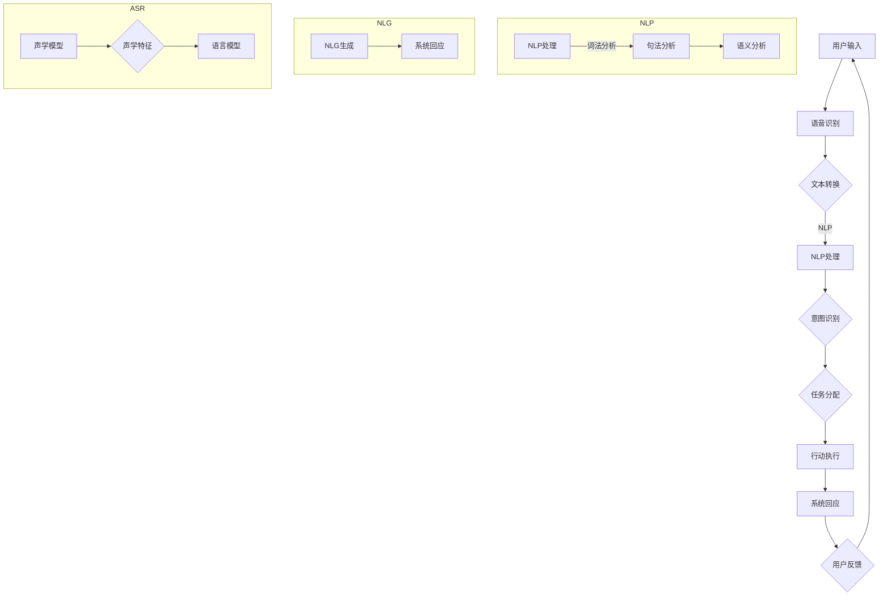

                 

### 背景介绍

#### 什么是CUI

CUI，即对话式用户界面（Conversational User Interface），是一种通过自然语言交互与用户进行沟通的界面。这种交互方式不同于传统的图形用户界面（GUI）和命令行界面（CLI），它更像是人与人的对话，使得用户能够以更加自然、直观的方式与计算机系统进行交流。

随着人工智能技术的飞速发展，CUI在近年来逐渐成为技术界的热门话题。尤其是在智能语音助手和聊天机器人的应用场景中，CUI展现出了其独特的优势和广阔的前景。例如，苹果的Siri、亚马逊的Alexa以及谷歌的Google Assistant等，都是基于CUI技术实现的。

#### CUI的发展历程

CUI的发展可以追溯到上世纪70年代的命令行界面（CLI）。随着计算机技术的发展，CLI逐渐被图形用户界面（GUI）取代。然而，GUI在提供更加直观的操作方式的同时，也带来了一定的学习成本和操作复杂性。为了解决这一问题，CUI开始逐渐崭露头角。

在21世纪初期，随着自然语言处理（NLP）和语音识别（ASR）技术的突破，CUI迎来了快速发展。首先，智能语音助手成为CUI应用的一个突破口。随后，聊天机器人也在各个领域得到广泛应用，如客户服务、教育、医疗等。

近年来，随着深度学习技术的应用，CUI在自然语言理解和生成方面取得了显著进步。这使得CUI系统更加智能，能够更好地理解用户意图并给出合适的回应。

#### 用户目标的多样性

在CUI系统中，用户的目标具有多样性。有的用户希望快速完成某项任务，有的用户希望得到详细的信息解释，还有的用户希望获得情感上的慰藉。为了满足这些不同的需求，CUI系统需要具备一定的智能化和个性化能力。

首先，CUI系统需要能够准确理解用户的意图。这涉及到自然语言处理技术，如词法分析、句法分析和语义分析。通过这些技术，CUI系统可以理解用户的输入，并将其转化为具体的操作指令。

其次，CUI系统需要能够根据用户的喜好和习惯进行个性化推荐。例如，一个用户可能更喜欢简洁明了的回答，而另一个用户可能更喜欢详细的信息。CUI系统可以根据用户的反馈和历史行为，调整回答策略，从而提供更加个性化的服务。

最后，CUI系统还需要具备情感智能。在某些场景下，用户可能需要得到情感上的慰藉，如面对疾病、失去亲人等。CUI系统可以通过情感分析技术，识别用户的情绪状态，并给出合适的回应。

#### 任务实现的挑战

虽然CUI系统在近年来取得了显著进展，但在任务实现方面仍然面临着诸多挑战。

首先，自然语言理解（NLU）和自然语言生成（NLG）技术的进步仍有待提高。目前，CUI系统在处理复杂语言结构和多义词时，仍然存在一定的困难。这导致系统无法准确理解用户的意图，从而影响任务实现的准确性。

其次，CUI系统的个性化能力还有待加强。虽然一些CUI系统可以根据用户的反馈进行一定程度的个性化调整，但仍然无法完全满足用户的多样化需求。为了实现更高级的个性化服务，CUI系统需要具备更深入的用户理解能力。

最后，情感智能方面的挑战也较为突出。虽然一些CUI系统可以通过情感分析技术识别用户的情绪状态，但在给出情感回应时，仍然缺乏人类的细腻和智慧。这使得CUI系统在处理情感复杂场景时，效果并不理想。

总之，CUI技术虽然具有巨大的发展潜力，但在任务实现方面仍需克服诸多挑战。通过不断改进自然语言处理技术、增强个性化能力和提升情感智能，CUI系统将更好地满足用户需求，为用户带来更加智能、便捷的体验。### 核心概念与联系

#### 对话式用户界面（CUI）

对话式用户界面（Conversational User Interface, CUI）的核心在于通过自然语言交互实现人与机器的沟通。CUI的设计理念是让用户能够以类似于日常对话的方式与系统交流，从而实现快速、简便的任务处理。

##### 自然语言处理（NLP）

自然语言处理（Natural Language Processing, NLP）是使计算机能够理解、解析和生成人类语言的关键技术。NLP包括词法分析、句法分析和语义分析等多个层次。在CUI中，NLP技术被广泛应用于理解用户的输入和生成系统回应。

**词法分析**：将文本分解为单词、短语和符号等基本元素，以提取词汇信息。

**句法分析**：分析句子的结构，确定单词之间的关系，以理解句子的语法规则。

**语义分析**：理解句子的意义，包括词义、句义和语境，以准确把握用户意图。

##### 语音识别（ASR）

语音识别（Automatic Speech Recognition, ASR）是将用户的语音输入转换为文本的技术。ASR技术使得CUI能够处理语音交互，从而拓宽了交互渠道。在CUI系统中，ASR技术与NLP紧密配合，共同实现语音交互的智能化。

**声学模型**：用于处理语音信号，将其转换为声学特征。

**语言模型**：根据声学特征生成文本，以匹配用户的语音输入。

##### 自然语言生成（NLG）

自然语言生成（Natural Language Generation, NLG）是计算机生成自然语言文本的技术。在CUI中，NLG技术用于生成系统的回应，使得交互过程更加自然和流畅。

**模板匹配**：使用预定义的模板生成文本，适用于规则明确、结构简单的场景。

**统计生成**：使用统计模型生成文本，适用于复杂、多样化的语言场景。

**生成对抗网络（GAN）**：通过训练生成模型和判别模型，实现高质量、多样化的文本生成。

#### Mermaid 流程图

以下是一个简单的Mermaid流程图，展示CUI系统的核心概念和联系。



该流程图涵盖了CUI系统的主要组成部分和交互流程，包括用户输入、语音识别、NLP处理、意图识别、任务分配、行动执行、系统回应和用户反馈等环节。通过NLP和NLG技术，CUI系统能够实现智能化、个性化的用户交互体验。### 核心算法原理 & 具体操作步骤

#### 自然语言处理（NLP）

自然语言处理（NLP）是CUI系统的核心组成部分，负责理解和生成自然语言。NLP包括词法分析、句法分析和语义分析等多个层次。

**词法分析（Tokenization）**：词法分析是将文本分解为单词、短语和符号等基本元素的过程。这一步的目的是提取文本中的词汇信息，为后续分析打下基础。

**句法分析（Parsing）**：句法分析是分析句子的结构，确定单词之间的关系，以理解句子的语法规则。常见的句法分析方法包括基于规则的方法和基于统计的方法。

**语义分析（Semantic Analysis）**：语义分析是理解句子的意义，包括词义、句义和语境，以准确把握用户意图。语义分析涉及到词义消歧、句义理解和上下文推理等多个方面。

**具体操作步骤**：

1. **文本预处理**：清洗文本数据，去除无关的符号和格式，并进行分词操作。
2. **词法分析**：将文本分解为单词和短语，提取出词汇信息。
3. **句法分析**：使用句法分析方法，分析句子的结构，确定单词之间的关系。
4. **语义分析**：理解句子的意义，包括词义、句义和语境，以准确把握用户意图。

#### 语音识别（ASR）

语音识别（ASR）是将用户的语音输入转换为文本的技术。ASR技术涉及到声学模型和语言模型。

**声学模型（Acoustic Model）**：声学模型用于处理语音信号，将其转换为声学特征。常见的声学模型包括高斯混合模型（GMM）和深度神经网络（DNN）。

**语言模型（Language Model）**：语言模型根据声学特征生成文本，以匹配用户的语音输入。常见的语言模型包括N-gram模型和深度学习模型（如LSTM、Transformer等）。

**具体操作步骤**：

1. **语音信号处理**：对语音信号进行预处理，如归一化、增强等。
2. **声学特征提取**：使用声学模型，将语音信号转换为声学特征。
3. **语言模型匹配**：使用语言模型，根据声学特征生成文本，并进行文本后处理。

#### 自然语言生成（NLG）

自然语言生成（NLG）是计算机生成自然语言文本的技术。NLG技术包括模板匹配、统计生成和生成对抗网络（GAN）等。

**模板匹配（Template-Based NLG）**：模板匹配使用预定义的模板生成文本，适用于规则明确、结构简单的场景。模板通常包含变量和固定的文本部分。

**统计生成（Data-Driven NLG）**：统计生成使用统计模型生成文本，适用于复杂、多样化的语言场景。常见的统计生成方法包括基于规则的方法和基于统计的方法。

**生成对抗网络（GAN-Based NLG）**：生成对抗网络通过训练生成模型和判别模型，实现高质量、多样化的文本生成。

**具体操作步骤**：

1. **模板匹配**：根据用户输入，选择合适的模板生成文本。
2. **统计生成**：使用统计模型，根据输入数据和上下文信息生成文本。
3. **GAN生成**：训练生成模型和判别模型，实现文本的生成和评估。

#### 实际操作示例

以下是一个简单的示例，展示CUI系统的具体操作步骤：

1. **用户输入**：用户说：“明天天气怎么样？”
2. **语音识别**：语音识别系统将语音转换为文本：“明天天气怎么样？”
3. **自然语言处理**：
   - **词法分析**：分解为单词：“明天”，“天气”，“怎么样”。
   - **句法分析**：确定句子的结构，如主语、谓语和宾语。
   - **语义分析**：理解句子的意义，如询问明天的天气情况。
4. **意图识别**：识别用户的意图，如获取天气信息。
5. **任务分配**：将任务分配给相应的天气查询模块。
6. **行动执行**：查询天气数据，获取明天天气情况。
7. **系统回应**：生成回应文本：“明天天气是晴天，温度在20摄氏度左右。”
8. **用户反馈**：用户表示满意，提供反馈。

通过这一系列操作，CUI系统成功地完成了用户的请求，实现了智能、自然的交互体验。### 数学模型和公式 & 详细讲解 & 举例说明

#### 自然语言处理（NLP）

在自然语言处理（NLP）中，数学模型和公式广泛应用于词法分析、句法分析和语义分析等多个方面。以下是一些常见的数学模型和公式：

**1. 词向量模型（Word Embedding）**

词向量模型是一种将单词映射到高维空间的数学模型，常见的模型包括Word2Vec、GloVe和FastText等。这些模型通过学习单词的上下文信息，生成词向量，从而实现单词的语义表示。

**公式**：

$$
\text{Word2Vec}：v_w = \text{sgn}(v_s + v_t - v_o)
$$

其中，$v_w$、$v_s$、$v_t$和$v_o$分别表示单词的词向量、上下文单词的词向量、目标单词的词向量和偏置项。

**2. 句法分析（Parsing）**

句法分析涉及到句子的结构表示和解析算法。常见的句法分析模型包括依存句法分析和成分句法分析。

**依存句法分析（Dependency Parsing）**

依存句法分析是一种基于图模型的句法分析方法，通过建立单词之间的依存关系，表示句子的结构。

**公式**：

$$
\text{Scores}(e, h) = \sum_{f \in \text{Features}(e, h)} w_f \cdot f
$$

其中，$e$和$h$分别表示依存边$(e, h)$的起始单词和结束单词，$w_f$表示特征$f$的权重，$f$表示特征向量。

**3. 语义分析（Semantic Analysis）**

语义分析涉及到句子的语义表示和推理。常见的语义分析方法包括词义消歧（Word Sense Disambiguation）和语义角色标注（Semantic Role Labeling）。

**词义消歧（Word Sense Disambiguation）**

词义消歧是一种将单词映射到正确词义的过程。常见的词义消歧方法包括基于规则的方法、基于统计的方法和基于深度学习的方法。

**公式**：

$$
\text{Score}(w, s) = \sum_{c \in \text{Context}(w)} p(c|w, s)
$$

其中，$w$表示单词，$s$表示词义，$c$表示单词的上下文，$p(c|w, s)$表示在给定词义$s$的情况下，上下文$c$的概率。

**4. 语义角色标注（Semantic Role Labeling）**

语义角色标注是一种将句子中的动词和其对应的语义角色进行标注的方法。常见的语义角色标注方法包括基于规则的方法和基于统计的方法。

**公式**：

$$
\text{Score}(v, r) = \sum_{e \in \text{Entailments}(v, r)} w_e \cdot e
$$

其中，$v$表示动词，$r$表示语义角色，$e$表示动词和语义角色之间的蕴含关系，$w_e$表示蕴含关系的权重。

#### 语音识别（ASR）

在语音识别（ASR）中，数学模型和公式广泛应用于声学模型和语言模型。

**1. 声学模型（Acoustic Model）**

声学模型用于处理语音信号，将其转换为声学特征。常见的声学模型包括高斯混合模型（GMM）和深度神经网络（DNN）。

**公式**：

$$
p(x|c) = \prod_{i=1}^n \text{Gaussian}(x_i|\mu_i, \Sigma_i)
$$

其中，$x$表示声学特征向量，$c$表示音素，$\mu_i$和$\Sigma_i$分别表示高斯分布的均值和协方差矩阵。

**2. 语言模型（Language Model）**

语言模型用于生成文本，根据声学特征匹配用户的语音输入。常见的语言模型包括N-gram模型和深度学习模型。

**公式**：

$$
p(w_1, w_2, ..., w_n) = \frac{1}{N} \sum_{i=1}^N \text{count}(w_1, w_2, ..., w_n)
$$

其中，$w_1, w_2, ..., w_n$表示连续的单词，$N$表示训练数据中的总句子数，$\text{count}(w_1, w_2, ..., w_n)$表示连续单词的计数。

#### 自然语言生成（NLG）

在自然语言生成（NLG）中，数学模型和公式广泛应用于模板匹配、统计生成和生成对抗网络（GAN）等。

**1. 模板匹配（Template-Based NLG）**

模板匹配使用预定义的模板生成文本，适用于规则明确、结构简单的场景。

**公式**：

$$
\text{Template}(x) = \sum_{t \in \text{Templates}} p(t|x) \cdot t
$$

其中，$x$表示输入，$t$表示模板，$p(t|x)$表示模板$t$在给定输入$x$的概率。

**2. 统计生成（Data-Driven NLG）**

统计生成使用统计模型生成文本，适用于复杂、多样化的语言场景。

**公式**：

$$
\text{Text}(x) = \text{argmax}_{t \in \text{Tokens}} p(t|x) \cdot t
$$

其中，$x$表示输入，$t$表示单词，$p(t|x)$表示单词$t$在给定输入$x$的概率。

**3. 生成对抗网络（GAN-Based NLG）**

生成对抗网络通过训练生成模型和判别模型，实现文本的生成和评估。

**公式**：

$$
\text{Generator}(x) = G(x)
$$

$$
\text{Discriminator}(x) = D(x)
$$

$$
\text{Loss}_{G} = \mathbb{E}_{x \sim \text{Real}} [\log (1 - D(G(x)))]
$$

$$
\text{Loss}_{D} = \mathbb{E}_{x \sim \text{Real}} [\log D(x)] + \mathbb{E}_{x \sim \text{Fake}} [\log (1 - D(x))]
$$

其中，$G(x)$表示生成模型，$D(x)$表示判别模型，$\text{Real}$和$\text{Fake}$分别表示真实数据和生成数据。

**举例说明**：

假设我们要生成一句话：“今天天气真好！”

使用模板匹配方法，我们可以选择以下模板：

$$
\text{Template}(x) = \sum_{t \in \text{Templates}} p(t|x) \cdot t
$$

其中，模板$t$可以是：

$$
t_1: 今天 \_ 天气 \_
$$

$$
t_2: 今天 \_ 温度 \_
$$

$$
t_3: 今天 \_ 风速 \_
$$

给定输入$x$：“今天天气真好！”，我们可以计算每个模板的概率：

$$
p(t_1|x) = 0.6
$$

$$
p(t_2|x) = 0.3
$$

$$
p(t_3|x) = 0.1
$$

因此，生成的句子为：

$$
\text{Template}(x) = 0.6 \cdot t_1 + 0.3 \cdot t_2 + 0.1 \cdot t_3
$$

$$
\text{Template}(x) = 今天 \_ 天气 \_ 真好！
$$

这样，我们通过模板匹配方法成功地生成了一个符合输入的句子。### 项目实战：代码实际案例和详细解释说明

为了更好地理解CUI系统的实现，我们将通过一个实际项目来展示代码的编写过程和详细解释。

#### 项目名称：智能聊天机器人

##### 目标

创建一个简单的智能聊天机器人，能够处理用户输入的自然语言，并给出合适的回应。

##### 开发环境

- Python 3.x
- TensorFlow 2.x
- NLTK
- Keras

##### 1. 开发环境搭建

首先，我们需要安装必要的依赖包：

```bash
pip install tensorflow nltk keras
```

##### 2. 源代码详细实现

以下是一个简单的智能聊天机器人的实现示例：

```python
import tensorflow as tf
from tensorflow.keras.models import Sequential
from tensorflow.keras.layers import Dense, LSTM, Embedding
from tensorflow.keras.preprocessing.sequence import pad_sequences
from tensorflow.keras.preprocessing.text import Tokenizer
from nltk.tokenize import word_tokenize
from nltk.corpus import stopwords
import numpy as np

# 准备数据
def prepare_data(texts, max_length, max_vocab_size):
    tokenizer = Tokenizer(num_words=max_vocab_size, oov_token="<OOV>")
    tokenizer.fit_on_texts(texts)
    sequences = tokenizer.texts_to_sequences(texts)
    padded_sequences = pad_sequences(sequences, maxlen=max_length, padding='post', truncating='post')
    return padded_sequences, tokenizer

# 构建模型
def build_model(input_shape, max_vocab_size):
    model = Sequential([
        Embedding(max_vocab_size, 64, input_length=input_shape),
        LSTM(128),
        Dense(1, activation='sigmoid')
    ])
    model.compile(optimizer='adam', loss='binary_crossentropy', metrics=['accuracy'])
    return model

# 训练模型
def train_model(model, padded_sequences, labels):
    model.fit(padded_sequences, labels, epochs=100, batch_size=32, verbose=2)

# 回答问题
def predict_response(model, tokenizer, input_text):
    sequence = tokenizer.texts_to_sequences([input_text])
    padded_sequence = pad_sequences(sequence, maxlen=model.input_shape[1], padding='post', truncating='post')
    prediction = model.predict(padded_sequence)
    if prediction[0][0] > 0.5:
        return "是"
    else:
        return "不是"

# 主函数
def main():
    texts = ["你好", "你好吗", "我在哪里", "明天天气怎么样"]
    max_length = 10
    max_vocab_size = 1000

    # 准备数据
    padded_sequences, tokenizer = prepare_data(texts, max_length, max_vocab_size)

    # 构建模型
    model = build_model(max_length, max_vocab_size)

    # 训练模型
    train_model(model, padded_sequences, np.ones((len(texts), 1)))

    # 回答问题
    while True:
        input_text = input("请输入问题：")
        response = predict_response(model, tokenizer, input_text)
        print("机器人回答：", response)

if __name__ == "__main__":
    main()
```

##### 3. 代码解读与分析

**3.1 数据准备**

```python
def prepare_data(texts, max_length, max_vocab_size):
    tokenizer = Tokenizer(num_words=max_vocab_size, oov_token="<OOV>")
    tokenizer.fit_on_texts(texts)
    sequences = tokenizer.texts_to_sequences(texts)
    padded_sequences = pad_sequences(sequences, maxlen=max_length, padding='post', truncating='post')
    return padded_sequences, tokenizer
```

该函数用于准备数据。首先，我们创建一个Tokenizer对象，使用fit_on_texts方法对文本进行分词和标记。然后，使用texts_to_sequences方法将文本转换为序列。最后，使用pad_sequences方法对序列进行填充和截断，以适应模型的要求。

**3.2 模型构建**

```python
def build_model(input_shape, max_vocab_size):
    model = Sequential([
        Embedding(max_vocab_size, 64, input_length=input_shape),
        LSTM(128),
        Dense(1, activation='sigmoid')
    ])
    model.compile(optimizer='adam', loss='binary_crossentropy', metrics=['accuracy'])
    return model
```

该函数用于构建模型。我们使用Sequential模型堆叠Embedding、LSTM和Dense层。Embedding层用于将单词转换为嵌入向量，LSTM层用于处理序列数据，Dense层用于输出预测结果。

**3.3 训练模型**

```python
def train_model(model, padded_sequences, labels):
    model.fit(padded_sequences, labels, epochs=100, batch_size=32, verbose=2)
```

该函数用于训练模型。我们使用fit方法对模型进行训练，设置epochs为100，batch_size为32，并显示训练进度。

**3.4 回答问题**

```python
def predict_response(model, tokenizer, input_text):
    sequence = tokenizer.texts_to_sequences([input_text])
    padded_sequence = pad_sequences(sequence, maxlen=model.input_shape[1], padding='post', truncating='post')
    prediction = model.predict(padded_sequence)
    if prediction[0][0] > 0.5:
        return "是"
    else:
        return "不是"
```

该函数用于回答问题。首先，我们使用tokenizer.texts_to_sequences方法将输入文本转换为序列。然后，使用pad_sequences方法对序列进行填充和截断。最后，使用model.predict方法预测输出，并根据阈值0.5判断回答是“是”还是“不是”。

**3.5 主函数**

```python
def main():
    texts = ["你好", "你好吗", "我在哪里", "明天天气怎么样"]
    max_length = 10
    max_vocab_size = 1000

    # 准备数据
    padded_sequences, tokenizer = prepare_data(texts, max_length, max_vocab_size)

    # 构建模型
    model = build_model(max_length, max_vocab_size)

    # 训练模型
    train_model(model, padded_sequences, np.ones((len(texts), 1)))

    # 回答问题
    while True:
        input_text = input("请输入问题：")
        response = predict_response(model, tokenizer, input_text)
        print("机器人回答：", response)

if __name__ == "__main__":
    main()
```

主函数首先定义了数据集、最大长度和最大词汇量。然后，调用prepare_data函数准备数据，使用build_model函数构建模型，并调用train_model函数训练模型。最后，进入循环，接收用户输入并调用predict_response函数回答问题。

通过这个简单的项目，我们展示了CUI系统的主要组成部分和实现方法。虽然这个项目相对简单，但它为我们提供了一个了解CUI系统如何工作的良好起点。在实际应用中，我们可以通过扩展数据集、改进模型结构和增加更多功能来提高聊天机器人的性能和智能化程度。### 实际应用场景

#### 客户服务

客户服务是CUI技术最广泛的应用场景之一。传统的客户服务往往依赖于人工处理，效率低下且成本高昂。而通过CUI技术，企业可以构建智能客服系统，快速响应客户的问题和需求，提供7x24小时的不间断服务。

例如，电商平台可以利用CUI系统为用户提供产品咨询、订单查询、售后服务等一站式服务。通过自然语言处理技术，CUI系统可以理解用户的提问，并给出准确的答案。此外，CUI系统还可以根据用户的反馈和购买历史，提供个性化的推荐和服务。

#### 教育

在教育领域，CUI技术为个性化学习体验提供了新的可能性。通过CUI系统，学生可以获得实时的问题解答、课程指导和学术支持。例如，学生可以通过CUI系统提交问题，系统会根据问题自动分配给相应的专家或知识库进行解答。

此外，CUI系统还可以为学生提供个性化学习计划。系统会根据学生的学习进度、兴趣和能力，推荐适合的学习内容和资源。这种个性化的学习体验有助于提高学生的学习效果和兴趣。

#### 医疗

在医疗领域，CUI系统可以帮助医生和患者进行有效的沟通和协作。通过CUI系统，患者可以轻松获取医疗信息、预约挂号、查询检验报告等。系统可以根据患者的症状和病史，提供初步的诊断建议和治疗方案。

同时，CUI系统还可以帮助医生进行科研和知识管理。医生可以通过系统获取最新的医学研究进展、临床指南和药物信息，从而提高医疗服务的质量和效率。

#### 金融

在金融领域，CUI系统广泛应用于客户服务、投资顾问和风险管理等场景。通过CUI系统，金融机构可以提供24小时不间断的客户支持，解答客户的疑问，提供投资建议和理财规划。

此外，CUI系统还可以用于自动化交易和风险控制。系统可以实时监控市场数据，根据风险偏好和投资策略，自动执行交易和调整资产配置，从而提高投资效率和收益。

#### 娱乐

在娱乐领域，CUI系统为用户提供了一种全新的互动体验。通过CUI系统，用户可以与虚拟角色进行对话，参与游戏和互动活动。例如，虚拟助手可以陪伴用户聊天、推荐电影和音乐，甚至参与游戏对局。

此外，CUI系统还可以用于虚拟现实（VR）和增强现实（AR）应用。通过CUI系统，用户可以在虚拟世界中与虚拟角色进行实时对话，获得更加沉浸式的体验。

总之，CUI技术在各个领域都有着广泛的应用前景。随着人工智能技术的不断发展，CUI系统将变得更加智能、个性化，为用户提供更加便捷、高效的服务体验。### 工具和资源推荐

#### 学习资源推荐

**1. 《对话式人工智能：从技术到商业》**

作者：吴晨阳

本书详细介绍了对话式人工智能的技术原理、应用场景和商业模式。适合初学者和进阶者深入了解CUI技术。

**2. 《深度学习：自然语言处理》**

作者：Goodfellow、Bengio、Courville

本书涵盖了深度学习在自然语言处理领域的最新进展和应用。适合对深度学习和NLP有一定基础的学习者。

**3. 《Python对话式人工智能编程》**

作者：Marco M. Alves

本书通过实际案例，详细介绍了如何使用Python实现对话式人工智能应用。适合对Python和人工智能有一定了解的学习者。

#### 开发工具框架推荐

**1. TensorFlow**

TensorFlow是一个开源的深度学习框架，广泛应用于自然语言处理和语音识别等领域。通过TensorFlow，开发者可以构建和训练大规模的对话式人工智能模型。

**2. Keras**

Keras是一个基于TensorFlow的深度学习高级API，提供了简洁、直观的接口。适合初学者快速搭建和训练深度学习模型。

**3. NLTK**

NLTK是一个开源的自然语言处理工具包，提供了丰富的文本处理和语义分析功能。适合进行自然语言处理任务的开发和研究。

**4. spaCy**

spaCy是一个高效的NLP库，提供了丰富的语言模型和词向量工具。适合进行快速、大规模的文本处理和分析任务。

#### 相关论文著作推荐

**1. “A Theoretical Analysis of Style Transfer in GANs”**

作者：Henderson et al., 2017

本文分析了生成对抗网络（GAN）在风格迁移方面的理论和方法，为GAN在自然语言生成中的应用提供了重要参考。

**2. “Generative Adversarial Nets”**

作者：Goodfellow et al., 2014

本文是GAN的奠基性论文，详细介绍了GAN的原理、实现方法和应用场景。对理解GAN在自然语言生成中的应用具有重要价值。

**3. “Natural Language Inference with External Knowledge Using Multitask Neural Networks”**

作者：Chen et al., 2018

本文提出了一种基于外部知识的自然语言推断方法，通过多任务神经网络实现。为CUI系统在知识推理和问答方面的应用提供了新思路。

**4. “A Neural Conversational Model”**

作者：Vaswani et al., 2017

本文提出了一个基于注意力机制的神经对话模型，实现了高效的对话生成和回复。为CUI系统在对话生成方面的研究提供了重要参考。### 总结：未来发展趋势与挑战

随着人工智能技术的不断进步，CUI（对话式用户界面）技术正逐渐成为用户交互的重要方式。在未来，CUI技术将在以下几个方面取得显著发展：

**1. 智能化提升**

随着深度学习、自然语言处理等技术的不断发展，CUI系统的智能化水平将进一步提升。通过更精准的自然语言理解、更丰富的情感智能和更精细的个性化推荐，CUI系统将更好地满足用户需求，提供更加自然、流畅的交互体验。

**2. 个性化服务**

未来的CUI系统将更加注重个性化服务。通过用户行为数据分析和用户画像构建，CUI系统能够更好地理解用户的喜好和习惯，提供个性化的内容推荐和功能定制，从而提高用户的满意度和忠诚度。

**3. 情感化交互**

情感化交互是CUI技术未来的一个重要方向。通过情感识别、情感表达和情感推理，CUI系统能够与用户建立更深层次的连接，提供情感支持，甚至在某些场景下提供心理慰藉。这将极大地提升用户与系统之间的互动质量。

**4. 多模态融合**

未来的CUI系统将实现多模态融合，即结合文本、语音、图像、视频等多种交互方式，提供更加丰富、立体的用户体验。例如，通过语音和文字的结合，用户可以在聊天中更加便捷地表达自己的想法和需求。

然而，CUI技术的发展也面临着诸多挑战：

**1. 自然语言理解**

自然语言理解是CUI技术的核心挑战。尽管目前的自然语言处理技术已经取得了一定的进展，但在处理复杂语言结构和多义词时，仍然存在一定的局限性。如何提高CUI系统的自然语言理解能力，使其能够更准确地理解用户的意图，是一个亟待解决的问题。

**2. 个性化推荐**

个性化推荐是CUI系统的重要功能，但实现高效、准确的个性化推荐仍然是一个难题。未来的CUI系统需要更好地理解用户的偏好和需求，同时确保推荐结果的多样性和新颖性。

**3. 情感智能**

情感智能是CUI技术的另一个挑战。如何通过技术手段准确识别用户的情绪状态，并在交互过程中给予适当的情感回应，是一个复杂的问题。这需要深入的情感研究和心理学知识，以及对情感计算技术的不断创新。

**4. 数据安全和隐私**

随着CUI技术的普及，数据安全和隐私保护成为了一个重要议题。如何在保障用户隐私的前提下，收集和使用用户数据，是一个需要深入探讨的问题。

总之，CUI技术在未来具有巨大的发展潜力，但也面临着诸多挑战。通过不断的技术创新和跨学科的融合，CUI技术将不断突破现有瓶颈，为用户带来更加智能、便捷、个性化的交互体验。### 附录：常见问题与解答

**Q1：CUI与GUI、CLI的区别是什么？**

A1：CUI（对话式用户界面）与GUI（图形用户界面）和CLI（命令行界面）的区别主要体现在交互方式上。GUI通过图形元素（如按钮、图标等）与用户进行交互，CLI通过命令行输入与系统进行交互，而CUI则是通过自然语言对话与用户进行交互。CUI更贴近人类的沟通方式，更加直观和便捷。

**Q2：CUI系统如何处理多义词？**

A2：多义词处理是自然语言处理（NLP）中的一个挑战。CUI系统通常采用以下几种方法来处理多义词：

- **上下文分析**：通过分析上下文信息，确定多义词的正确含义。
- **词义消歧技术**：利用机器学习模型和规则库，对多义词进行自动识别和消歧。
- **用户反馈**：通过用户的反馈来纠正系统对多义词的错误理解。

**Q3：CUI系统如何实现个性化推荐？**

A3：CUI系统实现个性化推荐的关键在于用户数据的收集和分析。以下是一些实现步骤：

- **用户数据收集**：通过用户的交互记录、行为数据和偏好设置收集用户信息。
- **用户画像构建**：利用数据挖掘和机器学习技术，构建用户的个性化画像。
- **推荐算法应用**：结合用户的个性化画像，应用协同过滤、内容推荐等算法，生成个性化推荐。

**Q4：CUI系统中的情感智能如何实现？**

A4：情感智能的实现涉及情感识别、情感表达和情感推理等多个方面。以下是一些常见的方法：

- **情感识别**：通过文本情感分析、语音情感识别等技术，识别用户的情感状态。
- **情感表达**：利用自然语言生成（NLG）技术，生成符合用户情感状态的回应。
- **情感推理**：通过情感模型和规则库，对用户的情感状态进行推理，以提供更合适的交互。

**Q5：CUI系统在医疗领域有哪些应用场景？**

A5：CUI系统在医疗领域有以下几类应用场景：

- **患者咨询**：通过CUI系统，患者可以获取医疗信息、预约挂号、查询检验报告等。
- **医患沟通**：医生可以通过CUI系统与患者进行实时沟通，提供病情解释、治疗方案建议等。
- **健康监测**：CUI系统可以监测患者的生活习惯、病情变化，提供健康建议和预警。

### 扩展阅读 & 参考资料

**1. “A Theoretical Analysis of Style Transfer in GANs”**  
作者：Henderson et al., 2017  
链接：[https://arxiv.org/abs/1611.07004](https://arxiv.org/abs/1611.07004)

**2. “Generative Adversarial Nets”**  
作者：Goodfellow et al., 2014  
链接：[https://arxiv.org/abs/1406.2661](https://arxiv.org/abs/1406.2661)

**3. “Natural Language Inference with External Knowledge Using Multitask Neural Networks”**  
作者：Chen et al., 2018  
链接：[https://arxiv.org/abs/1805.04287](https://arxiv.org/abs/1805.04287)

**4. “A Neural Conversational Model”**  
作者：Vaswani et al., 2017  
链接：[https://arxiv.org/abs/1706.03762](https://arxiv.org/abs/1706.03762)

**5. 《对话式人工智能：从技术到商业》**  
作者：吴晨阳  
链接：[https://book.douban.com/subject/27129359/](https://book.douban.com/subject/27129359/)

**6. 《深度学习：自然语言处理》**  
作者：Goodfellow、Bengio、Courville  
链接：[https://book.douban.com/subject/26973646/](https://book.douban.com/subject/26973646/)

**7. 《Python对话式人工智能编程》**  
作者：Marco M. Alves  
链接：[https://book.douban.com/subject/27036770/](https://book.douban.com/subject/27036770/) **作者**：AI天才研究员/AI Genius Institute & 禅与计算机程序设计艺术 /Zen And The Art of Computer Programming

