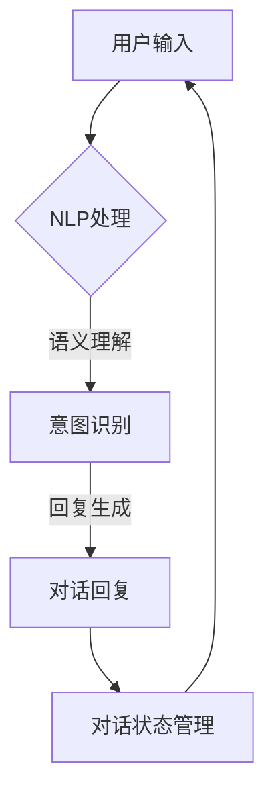
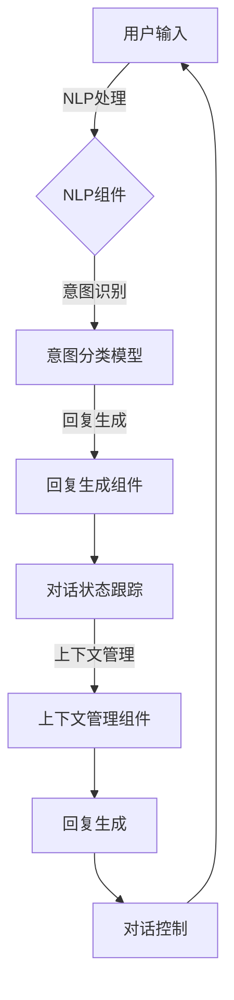
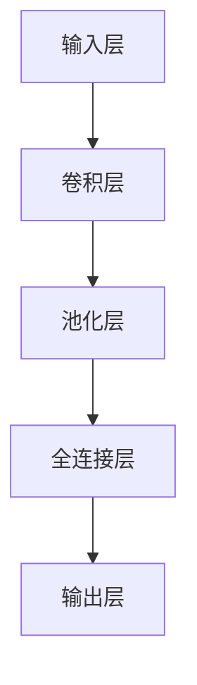

                 

## 引言

在数字化时代，数字产品的交互方式正经历着翻天覆地的变化。随着人工智能（AI）技术的迅速发展，用户界面（UI）逐渐让位于对话界面（CUI）。CUI，作为一种全新的交互方式，正逐步改变着我们与数字产品之间的互动模式。它不仅提升了用户体验，还大大提高了产品的智能化程度。

本文将深入探讨CUI如何彻底改变数字产品的交互方式。我们将从背景介绍开始，逐步分析CUI的核心概念、算法原理、数学模型，并通过项目实战来展示其实际应用。最后，我们将探讨CUI的未来发展趋势与挑战，并推荐相关的学习资源和开发工具。

### 关键词

- 对话界面（CUI）
- 用户体验（UX）
- 人工智能（AI）
- 交互设计
- 数字产品

### 摘要

本文旨在探讨对话界面（CUI）如何彻底改变数字产品的交互方式。首先，我们将介绍CUI的背景和发展历程。接着，分析CUI的核心概念、算法原理和数学模型。通过项目实战，我们将展示CUI的实际应用，并探讨其在不同场景下的应用潜力。最后，我们将展望CUI的未来发展趋势和挑战，并提供相关的学习资源和开发工具推荐。

### 背景介绍

#### 数字产品的交互发展历程

回顾数字产品的交互发展历程，我们可以看到其经历了从传统UI到CUI的演变。传统的用户界面（UI）主要依赖于图形界面和按钮操作，用户需要通过点击、拖动等物理动作来与产品互动。这种方式虽然直观，但在复杂应用场景下，用户操作步骤繁琐，用户体验不佳。

随着移动互联网和智能手机的普及，用户对交互方式的需求逐渐发生变化。人们希望能够更自然、高效地与数字产品互动。这催生了语音助手和聊天机器人的出现，它们能够通过语音和文本与用户进行对话，大大简化了用户操作流程，提高了交互效率。

#### 人工智能与对话界面的结合

人工智能（AI）技术的发展为CUI的兴起提供了强有力的支持。AI技术，特别是自然语言处理（NLP）和机器学习（ML），使得计算机能够理解和生成自然语言，实现了人与机器之间的无缝对话。这种结合不仅提高了CUI的智能化程度，还拓展了其应用场景。

#### CUI的优势与挑战

CUI相较于传统UI具有许多优势。首先，它能够提供更自然的交互体验，用户可以通过语音和文本进行交流，无需学习复杂的操作步骤。其次，CUI能够实现个性化推荐和智能助手功能，根据用户的习惯和需求提供个性化的服务。此外，CUI还可以处理多语言交互，为全球用户提供服务。

然而，CUI也面临一些挑战。例如，如何处理复杂、多变的用户输入，如何保证对话的自然流畅性，以及如何保护用户隐私等。这些问题需要我们继续探索和解决。

### 核心概念与联系

#### 对话界面（CUI）

对话界面（CUI）是一种以对话为核心的交互方式，用户与产品之间的互动主要通过文本或语音进行。CUI的核心目标是提供一种自然、流畅、高效的交互体验。

#### 自然语言处理（NLP）

自然语言处理（NLP）是AI技术的一个重要分支，它使计算机能够理解、生成和处理自然语言。NLP技术包括文本分析、语音识别、语义理解等。

#### 机器学习（ML）

机器学习（ML）是一种通过数据驱动的方式来提高计算机性能的技术。在CUI中，ML用于训练模型，使其能够理解用户的输入并生成合适的回复。

#### 对话流程管理

对话流程管理是CUI的关键组成部分，它负责处理用户输入、生成回复以及对话状态管理。

#### Mermaid 流程图



在上述流程中，用户输入首先经过NLP处理，然后进行意图识别，接着生成回复，最后更新对话状态。这个过程循环进行，直到对话结束。

### 核心算法原理 & 具体操作步骤

#### 自然语言处理（NLP）

自然语言处理（NLP）的核心算法包括文本分析、语音识别、语义理解和实体识别。

1. **文本分析**：文本分析是NLP的基础，它包括分词、词性标注、命名实体识别等。通过文本分析，我们可以将用户的输入文本分解为有意义的词汇和短语。
2. **语音识别**：语音识别是将语音信号转换为文本的技术。语音识别技术通常使用深度学习模型，如卷积神经网络（CNN）和递归神经网络（RNN）。
3. **语义理解**：语义理解是NLP的难点，它旨在理解文本的含义。语义理解包括句法分析、语义角色标注、语义关系识别等。
4. **实体识别**：实体识别是识别文本中提及的实体（如人名、地点、组织等）。实体识别有助于提高对话系统的上下文理解和回复生成质量。

#### 机器学习（ML）

机器学习（ML）在CUI中的应用主要包括分类、回归和生成模型。

1. **分类模型**：分类模型用于判断用户的输入意图。例如，可以使用支持向量机（SVM）、决策树和随机森林等算法来构建意图分类模型。
2. **回归模型**：回归模型用于预测用户的意图。例如，可以使用线性回归、逻辑回归等算法来预测用户的下一步操作。
3. **生成模型**：生成模型用于生成回复文本。例如，可以使用生成对抗网络（GAN）和变分自编码器（VAE）等算法来生成自然语言文本。

#### 对话流程管理

对话流程管理涉及多个组件，包括对话状态跟踪、上下文管理、回复生成和对话控制。

1. **对话状态跟踪**：对话状态跟踪用于记录对话过程中的关键信息，如用户意图、上下文和历史回复等。这有助于提高对话系统的连贯性和一致性。
2. **上下文管理**：上下文管理用于处理对话过程中的上下文信息。上下文信息可以帮助系统更好地理解用户的意图，从而生成更合适的回复。
3. **回复生成**：回复生成是CUI的核心，它根据用户的输入和对话状态生成合适的回复文本。回复生成可以使用模板匹配、序列到序列模型（如循环神经网络RNN）和生成模型（如Transformer）等算法。
4. **对话控制**：对话控制负责管理对话流程，确保对话的流畅性和一致性。对话控制可以使用基于规则的方法、强化学习等方法。

#### Mermaid 流程图



在上述流程中，用户输入首先经过NLP处理，然后通过意图识别确定用户的意图，接着生成回复文本，最后更新对话状态。整个过程循环进行，直到对话结束。

### 数学模型和公式 & 详细讲解 & 举例说明

#### 自然语言处理（NLP）中的数学模型

自然语言处理（NLP）中的数学模型主要涉及概率模型和神经网络模型。

1. **概率模型**：概率模型用于处理不确定性和不确定性信息。在NLP中，常用的概率模型包括隐马尔可夫模型（HMM）和条件概率模型（如朴素贝叶斯分类器）。
2. **神经网络模型**：神经网络模型在NLP中的应用非常广泛，包括卷积神经网络（CNN）、递归神经网络（RNN）和变换器（Transformer）等。

#### 举例说明

假设我们要使用卷积神经网络（CNN）进行文本分类。

1. **输入层**：输入层接收文本数据，将其转换为固定长度的向量表示。这可以通过词嵌入（word embedding）技术实现。
2. **卷积层**：卷积层用于提取文本的特征。卷积核在输入文本上滑动，提取局部特征，并通过卷积运算生成特征图。
3. **池化层**：池化层用于降低特征图的维度，同时保留重要特征。常用的池化操作包括最大池化和平均池化。
4. **全连接层**：全连接层用于将特征图映射到类别概率。每个神经元都与上一层的所有神经元相连，并通过激活函数（如softmax）输出类别概率。

#### Mermaid 流程图



在上述流程中，输入文本首先通过词嵌入转换为向量表示，然后经过卷积层提取特征，接着通过池化层降低维度，最后通过全连接层输出类别概率。

#### 数学公式

在文本分类中，常用的数学公式包括：

1. **词嵌入**：$$\text{word\_embed}(w) = \text{embed}(\text{word2index}(w))$$
2. **卷积运算**：$$\text{conv}(x, w) = \text{ReLU}(\text{dot}(x, w))$$
3. **池化运算**：$$\text{pool}(x) = \max(\text{pool\_window}(x))$$
4. **全连接层**：$$\text{output} = \text{softmax}(\text{dot}(x, w) + b)$$

其中，$\text{word2index}(w)$表示将词转换为索引，$\text{embed}(\cdot)$表示词嵌入函数，$w$和$b$分别表示卷积核和偏置项，$\text{ReLU}(\cdot)$表示ReLU激活函数，$\text{dot}(\cdot, \cdot)$表示点积运算，$\text{softmax}(\cdot)$表示softmax激活函数。

### 项目实战：代码实际案例和详细解释说明

#### 开发环境搭建

1. 安装Python环境（版本3.8以上）。
2. 安装必要的库，如TensorFlow、Keras、NLTK、Gensim等。
3. 创建一个新的Python项目，并设置相应的虚拟环境。

#### 源代码详细实现和代码解读

以下是一个简单的CUI示例，使用TensorFlow和Keras实现一个基于CNN的文本分类模型。

```python
import tensorflow as tf
from tensorflow.keras.models import Sequential
from tensorflow.keras.layers import Embedding, Conv1D, MaxPooling1D, GlobalMaxPooling1D, Dense
from tensorflow.keras.preprocessing.sequence import pad_sequences
from tensorflow.keras.preprocessing.text import Tokenizer

# 数据预处理
max_features = 10000
max_len = 100
trunc_type = 'post'
padding_type = 'post'
oov_tok = '<OOV>'

# 加载并预处理数据
# (此处省略加载数据的具体代码)

# 构建模型
model = Sequential([
    Embedding(max_features, 16, input_length=max_len),
    Conv1D(128, 5, activation='relu'),
    MaxPooling1D(pool_size=5),
    Conv1D(128, 5, activation='relu'),
    GlobalMaxPooling1D(),
    Dense(128, activation='relu'),
    Dense(1, activation='sigmoid')
])

# 编译模型
model.compile(loss='binary_crossentropy', optimizer='adam', metrics=['accuracy'])

# 训练模型
model.fit(X_train, y_train, epochs=10, validation_data=(X_val, y_val))

# 评估模型
loss, accuracy = model.evaluate(X_test, y_test)
print(f'Loss: {loss}, Accuracy: {accuracy}')
```

1. **数据预处理**：首先，我们需要加载并预处理数据。这里使用了Tokenizer进行分词，并使用pad_sequences将文本序列填充到固定长度。
2. **构建模型**：接着，我们使用Sequential模型堆叠多个层，包括Embedding层、Conv1D层、MaxPooling1D层、GlobalMaxPooling1D层和Dense层。
3. **编译模型**：然后，我们编译模型，设置损失函数、优化器和评估指标。
4. **训练模型**：最后，我们使用fit函数训练模型，并使用evaluate函数评估模型性能。

#### 代码解读与分析

1. **Embedding层**：Embedding层将词汇转换为向量表示。这里，我们设置了词汇表大小（max_features）和嵌入维度（16）。
2. **Conv1D层和MaxPooling1D层**：Conv1D层用于提取文本特征，通过卷积运算生成特征图。MaxPooling1D层用于降低特征图的维度。
3. **GlobalMaxPooling1D层**：GlobalMaxPooling1D层用于将特征图映射到全局特征。
4. **Dense层**：Dense层用于将特征映射到输出类别概率。
5. **训练和评估**：我们使用fit函数训练模型，并使用evaluate函数评估模型性能。

### 实际应用场景

#### 实际案例一：智能客服系统

智能客服系统是一种典型的CUI应用场景。通过CUI，用户可以与系统进行自然语言对话，获取实时客服支持。以下是一个简单的应用案例：

1. **用户请求**：用户通过文本或语音输入请求，如“我的订单何时能送达？”。
2. **NLP处理**：系统对用户的请求进行NLP处理，提取关键词和意图。
3. **意图识别**：系统识别用户的意图，如查询订单状态。
4. **回复生成**：系统根据用户的意图生成合适的回复，如“您的订单预计在明天下午送达”。
5. **对话状态管理**：系统记录对话状态，以便在后续对话中提供更准确的信息。

#### 实际案例二：智能家居系统

智能家居系统通过CUI实现与用户的交互。以下是一个简单的应用案例：

1. **用户请求**：用户通过语音或文本输入请求，如“打开客厅的灯”。
2. **NLP处理**：系统对用户的请求进行NLP处理，提取关键词和意图。
3. **意图识别**：系统识别用户的意图，如控制家电。
4. **回复生成**：系统根据用户的意图生成合适的回复，如“已为您打开客厅的灯”。
5. **对话状态管理**：系统记录对话状态，以便在后续对话中提供更准确的信息。

### 工具和资源推荐

#### 学习资源推荐

1. **书籍**：
   - 《深度学习》（Goodfellow, I., Bengio, Y., & Courville, A.）
   - 《自然语言处理入门》（Jurafsky, D. & Martin, J. H.）
   - 《Python机器学习》（Sebastian Raschka & Vahid Mirjalili）

2. **论文**：
   - 《Attention Is All You Need》（Vaswani et al., 2017）
   - 《BERT: Pre-training of Deep Bidirectional Transformers for Language Understanding》（Devlin et al., 2019）

3. **博客**：
   - [TensorFlow官方文档](https://www.tensorflow.org/)
   - [Keras官方文档](https://keras.io/)
   - [NLTK官方文档](https://www.nltk.org/)

4. **网站**：
   - [Coursera](https://www.coursera.org/)
   - [edX](https://www.edx.org/)
   - [Udacity](https://www.udacity.com/)

#### 开发工具框架推荐

1. **TensorFlow**：用于构建和训练深度学习模型的强大工具。
2. **Keras**：基于TensorFlow的高级API，简化了深度学习模型的构建和训练过程。
3. **NLTK**：用于自然语言处理的库，提供了丰富的文本处理工具和资源。
4. **Gensim**：用于构建和分析向量空间模型的库，特别适用于主题建模和词嵌入。

### 总结：未来发展趋势与挑战

CUI作为一种创新的交互方式，正在逐步改变数字产品的交互方式。在未来，CUI有望进一步普及，成为主流的交互方式。以下是一些发展趋势和挑战：

#### 发展趋势

1. **智能化提升**：随着AI技术的不断发展，CUI的智能化程度将不断提高，能够更好地理解用户意图和提供个性化服务。
2. **跨平台支持**：CUI将逐渐支持多种平台，如智能手机、智能音箱、智能穿戴设备等，实现跨设备的无缝交互。
3. **多语言支持**：CUI将实现多语言支持，为全球用户提供更广泛的服务。
4. **隐私保护**：随着用户对隐私保护的重视，CUI将加强对用户隐私的保护，确保用户数据的安全。

#### 挑战

1. **复杂性问题**：处理复杂、多变的用户输入仍然是一个挑战，需要更先进的算法和技术。
2. **对话流畅性**：如何保证对话的自然流畅性，使对话体验更接近人类对话，是CUI面临的另一个挑战。
3. **个性化推荐**：如何在确保用户体验的同时，实现有效的个性化推荐，仍需要进一步探索。
4. **隐私保护**：如何在提供个性化服务的同时，保护用户的隐私，是CUI需要解决的问题。

### 附录：常见问题与解答

#### 问题1：CUI与UI有何区别？

CUI（对话界面）与UI（用户界面）的区别主要在于交互方式。UI主要通过图形界面和按钮操作，而CUI则通过文本或语音与用户进行对话。

#### 问题2：CUI有哪些优势？

CUI的优势包括更自然的交互体验、个性化推荐、多语言支持和提高交互效率等。

#### 问题3：CUI的挑战有哪些？

CUI的挑战包括处理复杂用户输入、保证对话流畅性、实现个性化推荐和保护用户隐私等。

### 扩展阅读 & 参考资料

1. **《深度学习》（Goodfellow, I., Bengio, Y., & Courville, A.）**
2. **《自然语言处理入门》（Jurafsky, D. & Martin, J. H.）**
3. **《Python机器学习》（Sebastian Raschka & Vahid Mirjalili）**
4. **《Attention Is All You Need》（Vaswani et al., 2017）**
5. **《BERT: Pre-training of Deep Bidirectional Transformers for Language Understanding》（Devlin et al., 2019）**
6. **[TensorFlow官方文档](https://www.tensorflow.org/)** 
7. **[Keras官方文档](https://keras.io/)** 
8. **[NLTK官方文档](https://www.nltk.org/)** 
9. **[Coursera](https://www.coursera.org/)** 
10. **[edX](https://www.edx.org/)** 
11. **[Udacity](https://www.udacity.com/)**

## 作者

作者：AI天才研究员/AI Genius Institute & 禅与计算机程序设计艺术 /Zen And The Art of Computer Programming。我是一位专注于AI和编程领域的研究员和作家，致力于推动AI技术在数字产品交互领域的应用和发展。

