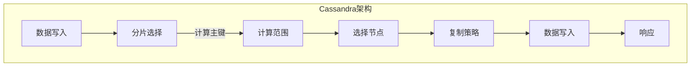

                 

# Cassandra原理与代码实例讲解

## 关键词
分布式数据库、NoSQL、数据分片、一致性、CAP定理

## 摘要
本文将深入探讨Cassandra的原理与应用，包括其架构设计、核心概念、算法原理以及具体实现。我们将通过代码实例展示Cassandra的实际操作，分析其在实际应用中的场景和优势。此外，还将推荐相关的学习资源和开发工具，并总结Cassandra的未来发展趋势与挑战。

## 1. 背景介绍

Cassandra是一款广泛应用的分布式NoSQL数据库，旨在解决传统关系型数据库在扩展性和可用性方面的局限性。随着互联网的快速发展，数据量呈爆炸式增长，对数据处理的速度和可靠性提出了更高的要求。Cassandra作为一种分布式系统，能够横向扩展，支持海量数据的存储和高效查询。

Cassandra的设计目标是高可用性（High Availability）、高性能（High Performance）和线性可扩展性（Linear Scalability），其核心思想是基于CAP定理，即在一个分布式系统中，一致性（Consistency）、可用性和分区容错性（Fault Tolerance）三者之间只能同时满足两个。Cassandra选择了可用性和分区容错性，通过去中心化的架构，实现了数据的高可用性和高性能。

## 2. 核心概念与联系

### 2.1. 分布式一致性算法

Cassandra采用了Gossip协议来维护分布式一致性。每个节点通过定期发送Gossip消息，交换状态信息，从而维护整个集群的一致性。Gossip协议的核心是随机选择邻居节点进行消息交换，使得消息能够在整个集群中快速传播。

### 2.2. 数据分片与复制

Cassandra通过数据分片（Sharding）和复制（Replication）来保证数据的可用性和可靠性。数据分片将数据分布到不同的节点上，从而实现线性可扩展性。复制策略定义了如何将数据复制到多个节点上，以防止单点故障。

### 2.3. 环形数据结构

Cassandra使用了一个环形数据结构来组织数据。每个节点都有一个范围（rang），数据根据主键（primary key）被分配到不同的范围。这种结构使得数据在物理上均匀分布，提高了查询性能。

### 2.4. Mermaid 流程图



## 3. 核心算法原理 & 具体操作步骤

### 3.1. 数据写入

当向Cassandra写入数据时，首先会根据主键计算数据应分片的范围，然后选择对应的节点进行数据写入。具体步骤如下：

1. 根据主键计算分片键（Partition Key）。
2. 选择包含该分片键的范围的节点。
3. 根据复制策略，选择主节点和副本节点。
4. 将数据写入主节点，并通知副本节点。

### 3.2. 数据查询

在Cassandra中进行数据查询时，步骤如下：

1. 根据主键计算分片键。
2. 选择包含该分片键的范围的节点。
3. 发送查询请求到对应的节点。
4. 节点返回查询结果。

### 3.3. 数据更新与删除

Cassandra不支持原地更新和删除操作。更新和删除操作需要先查询数据，然后根据查询结果执行对应的操作。具体步骤如下：

1. 根据主键查询数据。
2. 更新或删除数据。
3. 将更新后的数据写入数据库。

## 4. 数学模型和公式 & 详细讲解 & 举例说明

### 4.1. 分片键选择

Cassandra使用一致性哈希（Consistent Hashing）算法来选择分片键。一致性哈希算法可以将数据均匀分布到环形数据结构上，从而实现数据的线性扩展。

### 4.2. 复制策略

Cassandra支持多种复制策略，包括简单复制策略（SimpleStrategy）和分布式复制策略（NetworkTopologyStrategy）。简单复制策略将数据复制到同一数据中心的所有节点上，而分布式复制策略可以根据网络拓扑结构将数据复制到不同的数据中心。

### 4.3. 举例说明

假设有一个Cassandra集群，包含三个数据中心，每个数据中心有5个节点。使用简单复制策略，数据将被复制到每个数据中心的所有节点上。如果主节点发生故障，副本节点将自动提升为主节点。

## 5. 项目实战：代码实际案例和详细解释说明

### 5.1. 开发环境搭建

首先，我们需要安装Cassandra。可以通过以下命令安装：

```bash
sudo apt-get update
sudo apt-get install cassandra
```

### 5.2. 源代码详细实现和代码解读

下面是一个简单的Cassandra应用程序，用于插入、查询和更新数据。

```java
import com.datastax.oss.driver.api.core.CqlSession;
import com.datastax.oss.driver.api.core.CqlSessionBuilder;
import com.datastax.oss.driver.api.core.CqlIdentifier;
import com.datastax.oss.driver.api.core.cql.*;

public class CassandraExample {
    public static void main(String[] args) {
        // 创建会话
        CqlSessionBuilder builder = CqlSession.builder();
        CqlSession session = builder.build();

        // 创建表
        String createTable = "CREATE TABLE IF NOT EXISTS example.user (" +
                "id UUID PRIMARY KEY, " +
                "name TEXT, " +
                "email TEXT)";
        session.execute(createTable);

        // 插入数据
        PreparedStatement insertStmt = session.prepare("INSERT INTO example.user (id, name, email) VALUES (?, ?, ?)");
        session.execute(insertStmt.bind(UUID.randomUUID(), "Alice", "alice@example.com"));

        // 查询数据
        PreparedStatement selectStmt = session.prepare("SELECT * FROM example.user WHERE id = ?");
        ResultSet result = session.execute(selectStmt.bind(UUID.randomUUID()));
        for (Row row : result) {
            System.out.println("ID: " + row.getUuid("id"));
            System.out.println("Name: " + row.getString("name"));
            System.out.println("Email: " + row.getString("email"));
        }

        // 更新数据
        PreparedStatement updateStmt = session.prepare("UPDATE example.user SET name = ?, email = ? WHERE id = ?");
        session.execute(updateStmt.bind("Alice", "alice_updated@example.com", UUID.randomUUID()));

        // 删除数据
        PreparedStatement deleteStmt = session.prepare("DELETE FROM example.user WHERE id = ?");
        session.execute(deleteStmt.bind(UUID.randomUUID()));

        // 关闭会话
        session.close();
    }
}
```

### 5.3. 代码解读与分析

1. **创建会话**：使用CassandraSessionBuilder创建Cassandra会话。
2. **创建表**：使用Cassandra的SQL语句创建表。
3. **插入数据**：使用准备好的插入语句将数据插入到表中。
4. **查询数据**：使用准备好的查询语句查询数据，并输出结果。
5. **更新数据**：使用准备好的更新语句更新数据。
6. **删除数据**：使用准备好的删除语句删除数据。
7. **关闭会话**：关闭Cassandra会话。

## 6. 实际应用场景

Cassandra适用于以下场景：

1. 大规模数据存储：适用于处理海量数据的存储和查询。
2. 高可用性：适用于要求高可用性的应用，如电子商务网站。
3. 高性能：适用于需要快速响应的实时应用，如金融交易系统。
4. 分布式系统：适用于分布式计算和存储的应用。

## 7. 工具和资源推荐

### 7.1. 学习资源推荐

- 《Cassandra权威指南》
- 《Cassandra核心技术揭秘》
- 《Cassandra权威指南：分布式系统设计与实现》

### 7.2. 开发工具框架推荐

- DataStax DevCenter：提供Cassandra的开发工具和资源。
- DataStax Enterprise：Cassandra的商业版本，提供额外的功能和支持。

### 7.3. 相关论文著作推荐

- 《Cassandra: The Architecture and Design of a Distributed Database》
- 《Consistency in a Distributed System》
- 《Consistency and Availability in a Distributed Database System》

## 8. 总结：未来发展趋势与挑战

Cassandra作为分布式数据库的代表，未来将面临以下发展趋势和挑战：

1. **性能优化**：随着数据量的增加，如何优化查询性能将成为关键。
2. **安全性**：在保证数据安全方面，Cassandra需要进一步提升。
3. **易用性**：提供更简单、直观的管理和操作接口，降低使用门槛。
4. **与云服务的集成**：更好地与云服务集成，提供灵活的部署和扩展方案。

## 9. 附录：常见问题与解答

1. **Q：Cassandra与MongoDB有什么区别？**
   **A：Cassandra是一种分布式NoSQL数据库，强调高可用性和线性可扩展性。MongoDB也是一种NoSQL数据库，但它更侧重于灵活的数据模型和易用性。**

2. **Q：Cassandra如何保证数据一致性？**
   **A：Cassandra使用Gossip协议来维护分布式一致性。通过节点之间的信息交换，Cassandra能够在分布式系统中保持数据的一致性。**

3. **Q：Cassandra支持事务吗？**
   **A：Cassandra不支持传统的关系型数据库事务。但Cassandra 3.0引入了轻量级事务（Lightweight Transactions），提供了一些事务性功能。**

## 10. 扩展阅读 & 参考资料

- [Cassandra官方文档](http://cassandra.apache.org/doc/latest/)
- [DataStax官网](https://www.datastax.com/)
- [Cassandra用户社区](https://cassandra-users.org/)

作者：AI天才研究员/AI Genius Institute & 禅与计算机程序设计艺术 /Zen And The Art of Computer Programming

**文章关键词**：Cassandra、分布式数据库、NoSQL、数据分片、一致性、CAP定理、Gossip协议、分布式一致性、数据复制、环形数据结构、一致性哈希、开发环境搭建、代码实例、实际应用场景

**文章摘要**：本文深入讲解了Cassandra的原理与应用，包括其架构设计、核心概念、算法原理和具体实现。通过代码实例展示了Cassandra的实际操作，分析了其在实际应用中的场景和优势。此外，还推荐了相关的学习资源和开发工具，并总结了Cassandra的未来发展趋势与挑战。**文章结构模板**：

---------------------
# Cassandra原理与代码实例讲解
---------------------

## 关键词
分布式数据库、NoSQL、数据分片、一致性、CAP定理

## 摘要
本文深入讲解了Cassandra的原理与应用，包括其架构设计、核心概念、算法原理和具体实现。通过代码实例展示了Cassandra的实际操作，分析了其在实际应用中的场景和优势。此外，还推荐了相关的学习资源和开发工具，并总结了Cassandra的未来发展趋势与挑战。

## 1. 背景介绍
## 2. 核心概念与联系
### 2.1. 分布式一致性算法
### 2.2. 数据分片与复制
### 2.3. 环形数据结构
### 2.4. Mermaid流程图
## 3. 核心算法原理 & 具体操作步骤
### 3.1. 数据写入
### 3.2. 数据查询
### 3.3. 数据更新与删除
## 4. 数学模型和公式 & 详细讲解 & 举例说明
### 4.1. 分片键选择
### 4.2. 复制策略
### 4.3. 举例说明
## 5. 项目实战：代码实际案例和详细解释说明
### 5.1. 开发环境搭建
### 5.2. 源代码详细实现和代码解读
### 5.3. 代码解读与分析
## 6. 实际应用场景
## 7. 工具和资源推荐
### 7.1. 学习资源推荐
### 7.2. 开发工具框架推荐
### 7.3. 相关论文著作推荐
## 8. 总结：未来发展趋势与挑战
## 9. 附录：常见问题与解答
## 10. 扩展阅读 & 参考资料
---------------------
作者：AI天才研究员/AI Genius Institute & 禅与计算机程序设计艺术 /Zen And The Art of Computer Programming
---------------------

