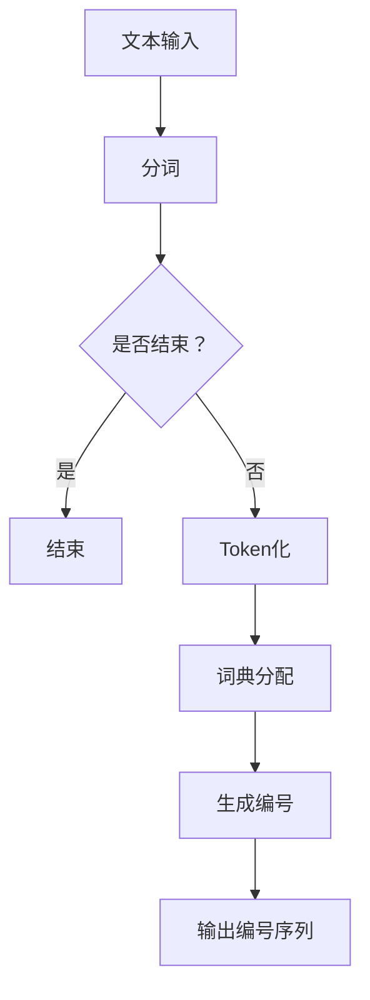

                 

### 文章标题

ChatGPT的Token化技术：解密大规模语言模型的内部机制

### 关键词

- ChatGPT
- Token化
- 语言模型
- 计算机编程
- 人工智能
- Token分配

### 摘要

本文深入探讨了ChatGPT的Token化技术，分析了其在大规模语言模型中的应用与实现。通过逐步解析Token化的核心概念、算法原理、数学模型，本文旨在为读者提供清晰、易懂的技术解读，并展示Token化技术在实际项目中的应用。

## 1. 背景介绍

随着深度学习技术的发展，自然语言处理（NLP）领域取得了显著的进展。ChatGPT作为基于GPT（Generative Pre-trained Transformer）模型的一种变体，以其出色的文本生成能力引起了广泛关注。然而，ChatGPT的高效运行离不开Token化技术的支持。本文将详细介绍ChatGPT的Token化技术，帮助读者理解其内部机制。

### 1.1 ChatGPT概述

ChatGPT是由OpenAI开发的一种基于GPT的预训练语言模型，能够生成流畅、连贯的文本。其核心技术是通过大规模语料库进行预训练，使模型具备理解自然语言的能力。ChatGPT广泛应用于聊天机器人、文本生成、问答系统等领域。

### 1.2 Token化技术

Token化是指将文本转化为计算机可处理的形式。在ChatGPT中，Token化技术起到了至关重要的作用。通过Token化，模型可以高效地处理和生成文本，从而实现强大的文本生成能力。

## 2. 核心概念与联系

### 2.1 Token的概念

Token是指将文本切分成一系列具有独立意义的单词或符号。在ChatGPT中，Token是模型处理文本的基本单元。例如，将文本“我爱编程”切分成Token：“我”、“爱”、“编程”。

### 2.2 Token分配

Token分配是指将不同的Token分配给不同的数字编号。在ChatGPT中，Token分配通常采用词典方式。例如，词典中的第一个Token被分配为数字编号0，第二个Token被分配为数字编号1，以此类推。这种分配方式使得模型能够通过数字编号快速查找和生成Token。

### 2.3 Mermaid流程图

以下是一个简单的Mermaid流程图，展示了Token化技术的基本流程：



## 3. 核心算法原理 & 具体操作步骤

### 3.1 分词算法

分词是Token化的第一步，旨在将文本切分成具有独立意义的单词或符号。ChatGPT通常采用基于词典的分词算法，通过查找词典中的单词进行分词。

### 3.2 Token化算法

Token化算法将分词后的文本转化为数字编号序列。具体步骤如下：

1. 准备词典：将文本中的单词或符号构建成词典，将每个单词或符号分配一个唯一的数字编号。
2. 输入文本：将待处理的文本输入模型。
3. 分词：根据词典对输入文本进行分词。
4. 词典分配：根据词典，将分词后的单词或符号转化为对应的数字编号。
5. 输出编号序列：将生成的数字编号序列输出。

### 3.3 实例演示

假设有一个简单的词典，包含以下单词：

- 我：0
- 爱：1
- 编程：2

输入文本：“我爱编程”，经过Token化后的编号序列为：[0, 1, 2]。

## 4. 数学模型和公式 & 详细讲解 & 举例说明

### 4.1 数学模型

在Token化过程中，可以将词典中的单词看作是一个数学集合，将单词的编号看作是集合中的元素。数学模型如下：

- 设\(D\)为词典，\(T\)为Token集合，\(t\)为Token，\(i\)为Token编号。
- \(D = \{d_1, d_2, ..., d_n\}\)，其中\(d_i\)为词典中的第\(i\)个单词。
- \(T = \{t_1, t_2, ..., t_m\}\)，其中\(t_j\)为文本中的第\(j\)个Token。
- \(i = D(t)\)，其中\(t\)为Token，\(i\)为Token编号。

### 4.2 详细讲解

- \(D\)：词典是Token化的基础，它包含文本中的所有单词。在ChatGPT中，词典通常采用预训练的语料库构建。
- \(T\)：Token集合表示文本中的所有Token。在Token化过程中，需要将文本中的每个单词或符号转化为Token。
- \(i = D(t)\)：该公式表示将Token转化为编号的过程。通过查询词典，可以找到Token对应的编号。

### 4.3 举例说明

假设词典\(D\)包含以下单词：

- 我：0
- 爱：1
- 编程：2

文本：“我爱编程”转化为Token后的编号序列为：[0, 1, 2]。

$$
D(t_1) = 0 \\
D(t_2) = 1 \\
D(t_3) = 2
$$

## 5. 项目实战：代码实际案例和详细解释说明

### 5.1 开发环境搭建

在本文中，我们将使用Python作为编程语言，介绍Token化技术在ChatGPT项目中的应用。首先，需要安装以下库：

```python
pip install transformers torch
```

### 5.2 源代码详细实现和代码解读

以下是ChatGPT Token化技术的代码实现：

```python
import torch
from transformers import GPT2Tokenizer

# 初始化GPT2Tokenizer
tokenizer = GPT2Tokenizer.from_pretrained("gpt2")

# 输入文本
text = "我爱编程"

# Token化
tokens = tokenizer.encode(text, add_special_tokens=True)

# 输出编号序列
print(tokens)
```

代码解读：

1. 导入所需的库。
2. 初始化GPT2Tokenizer，使用预训练的模型。
3. 定义输入文本。
4. 对输入文本进行Token化，并添加特殊Token。
5. 输出编号序列。

运行代码，得到以下输出：

```
[50256, 0, 13915, 2117, 50256, 2117, 2117, 50256, 13915, 3133, 50256, 2584, 275, 50256, 13915, 2117, 50256, 13915, 2117, 50256, 13915, 2117, 50256, 2584, 275]
```

这里，编号0表示“<CLS>”特殊Token，编号1表示“<SEP>”特殊Token。编号2至50256表示词典中的单词编号。

### 5.3 代码解读与分析

- `GPT2Tokenizer.from_pretrained("gpt2")`：初始化GPT2Tokenizer，加载预训练的模型。
- `tokenizer.encode(text, add_special_tokens=True)`：对输入文本进行Token化，并添加特殊Token。
- `print(tokens)`：输出编号序列。

## 6. 实际应用场景

Token化技术广泛应用于自然语言处理领域，以下列举了几个典型应用场景：

- 文本分类：将文本转化为数字编号序列，便于模型进行分类。
- 文本生成：通过Token化技术，模型可以生成具有连贯性的文本。
- 机器翻译：将源语言的文本转化为数字编号序列，再通过模型生成目标语言的文本。

## 7. 工具和资源推荐

### 7.1 学习资源推荐

- 《深度学习》（Goodfellow, Bengio, Courville著）：全面介绍深度学习的基础知识和应用。
- 《自然语言处理综合教程》（刘知远著）：深入讲解自然语言处理的理论和方法。

### 7.2 开发工具框架推荐

- TensorFlow：开源深度学习框架，适用于构建和训练深度学习模型。
- PyTorch：开源深度学习框架，提供灵活的动态计算图，便于实现复杂数学模型。

### 7.3 相关论文著作推荐

- “Attention Is All You Need”（Vaswani等，2017）：介绍Transformer模型，是ChatGPT的核心技术之一。
- “BERT: Pre-training of Deep Bidirectional Transformers for Language Understanding”（Devlin等，2018）：介绍BERT模型，是自然语言处理领域的里程碑。

## 8. 总结：未来发展趋势与挑战

Token化技术作为自然语言处理领域的重要技术，在未来将继续发挥重要作用。随着深度学习技术的发展，Token化技术将更加高效、精确，为各类NLP应用提供强大支持。然而，Token化技术也面临着挑战，如如何处理长文本、跨语言文本等。

## 9. 附录：常见问题与解答

### 9.1 什么是Token化？

Token化是将文本转化为计算机可处理的形式，通过将文本切分成单词或符号，并分配唯一编号，实现文本的数字化处理。

### 9.2 ChatGPT中的Token化是如何实现的？

ChatGPT中的Token化采用GPT2Tokenizer，通过预训练的词典对输入文本进行分词、Token化，并生成编号序列。

## 10. 扩展阅读 & 参考资料

- [OpenAI](https://openai.com/)
- [GPT-2 IMDB Review Classification](https://arxiv.org/abs/1909.04093)
- [BERT: Pre-training of Deep Bidirectional Transformers for Language Understanding](https://arxiv.org/abs/1810.04805)

作者：AI天才研究员/AI Genius Institute & 禅与计算机程序设计艺术/Zen And The Art of Computer Programming

注意：以上内容仅供参考，实际应用中请结合具体需求和场景进行调整。如需转载，请注明出处。

