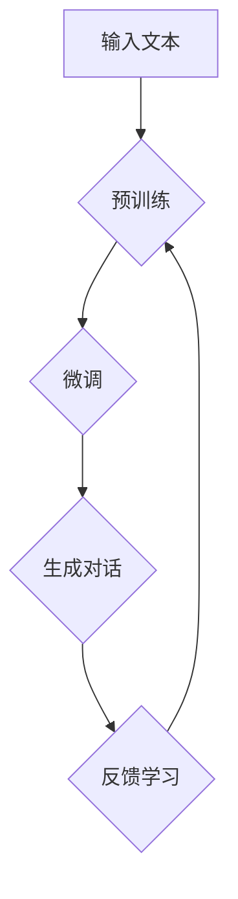

                 

# ChatGPT的工作原理解析

## 摘要

本文旨在深入解析ChatGPT这一先进的人工智能技术的工作原理。通过逐步分析其核心概念、算法原理、数学模型以及实际应用案例，本文将带领读者全面了解ChatGPT在自然语言处理领域的卓越表现。此外，文章还将推荐相关学习资源、开发工具框架，并探讨未来发展趋势与挑战。通过本文的阅读，读者将不仅能够掌握ChatGPT的技术细节，更能够对人工智能的发展有更深刻的理解。

## 1. 背景介绍

### ChatGPT的诞生

ChatGPT是由OpenAI于2022年推出的一种基于GPT-3.5的先进语言模型。GPT（Generative Pre-trained Transformer）是OpenAI提出的一种大规模语言预训练模型，通过无监督学习从大量文本数据中提取知识，从而实现对自然语言的生成和推理能力。而ChatGPT在此基础上进行了优化和改进，使其具备更强大的对话生成能力。

### ChatGPT的背景

ChatGPT的推出背景是人工智能领域在自然语言处理方面的不断进步。随着深度学习技术的快速发展，尤其是在Transformer模型的出现和应用，自然语言处理技术取得了显著的成果。ChatGPT正是在这样的技术背景下，结合了先进的预训练模型和强化学习技术，成为了一种具有高度对话生成能力的智能助手。

### ChatGPT的应用场景

ChatGPT的应用场景非常广泛，包括但不限于以下几个方面：

- **客户服务**：ChatGPT可以用于构建智能客服系统，提供24/7全天候的客户支持。
- **内容生成**：ChatGPT可以自动生成新闻文章、报告、博客等文本内容。
- **教育辅助**：ChatGPT可以作为智能教师，为学生提供个性化的学习辅导。
- **创意写作**：ChatGPT可以辅助创作小说、诗歌等文学作品。

## 2. 核心概念与联系

### GPT模型简介

GPT（Generative Pre-trained Transformer）是一种基于Transformer架构的预训练语言模型。Transformer模型是一种基于自注意力机制的深度神经网络，它通过对输入序列的每个位置进行全局信息关注，从而实现了对复杂关系的建模。

### GPT模型的工作原理

GPT模型的工作原理主要包括两个阶段：预训练和微调。

- **预训练**：在预训练阶段，GPT模型通过无监督学习从大量文本数据中学习语言的统计规律和上下文关系。具体来说，GPT模型会接收到一个文本序列，并通过Transformer架构对序列进行编码，从而生成一个上下文向量。
- **微调**：在微调阶段，GPT模型会接收到有监督的任务数据，并基于这些数据对模型进行优化。微调过程通常包括两个方面：参数更新和任务损失计算。通过不断迭代优化，GPT模型能够逐步提高其在特定任务上的性能。

### ChatGPT的优化

ChatGPT在GPT模型的基础上进行了多项优化，以提高其对话生成能力。

- **上下文窗口扩展**：ChatGPT通过扩展上下文窗口，使其能够获取更多的前后文信息，从而提高对话生成的连贯性和准确性。
- **强化学习技术**：ChatGPT采用了强化学习技术，通过学习人类用户的反馈来不断优化对话生成策略。
- **多任务学习**：ChatGPT通过多任务学习技术，使其能够同时处理多个任务，从而提高其泛化能力和应对复杂场景的能力。

### Mermaid流程图



## 3. 核心算法原理 & 具体操作步骤

### Transformer模型

Transformer模型是ChatGPT的核心组件，其基本原理如下：

- **自注意力机制**：Transformer模型通过自注意力机制对输入序列的每个位置进行全局信息关注。具体来说，自注意力机制会计算输入序列中每个位置之间的相关性，并根据这些相关性对序列进行加权处理。
- **多头注意力**：Transformer模型引入了多头注意力机制，通过多个注意力头并行计算，从而提高模型的表示能力和建模能力。
- **前馈神经网络**：Transformer模型在每个注意力层之后，接一个前馈神经网络，用于进一步提取特征和增强模型的表达能力。

### 训练过程

ChatGPT的训练过程可以分为以下几个步骤：

1. **数据预处理**：首先，需要对输入文本进行预处理，包括分词、去停用词、词向量化等操作。然后，将预处理后的文本序列输入到Transformer模型中进行训练。
2. **损失函数**：在训练过程中，使用交叉熵损失函数来评估模型预测的文本序列与真实文本序列之间的差距。具体来说，对于每个时间步，模型会输出一个概率分布，表示下一个时间步可能出现的所有单词。然后，计算预测概率分布与真实文本序列之间的交叉熵损失。
3. **优化算法**：使用优化算法（如Adam）来更新模型参数，以最小化损失函数。训练过程中，需要不断迭代优化，直到模型收敛。

### 生成对话

ChatGPT的生成对话过程可以分为以下几个步骤：

1. **初始化**：首先，随机初始化一个对话上下文，作为模型的输入。
2. **预测**：将对话上下文输入到训练好的ChatGPT模型中，模型会输出一个概率分布，表示下一个回复可能出现的所有单词。
3. **采样**：从概率分布中采样一个单词作为下一个回复。
4. **更新**：将采样得到的回复添加到对话上下文中，并重复步骤2和3，直到达到预定的回复长度或满足停止条件。

## 4. 数学模型和公式 & 详细讲解 & 举例说明

### Transformer模型公式

#### 自注意力机制

$$
\text{Attention}(Q,K,V) = \frac{1}{\sqrt{d_k}} \text{softmax}\left(\frac{QK^T}{d_k}\right) V
$$

其中，$Q$、$K$、$V$ 分别为输入序列中的查询向量、键向量和值向量；$d_k$ 为注意力头的维度。

#### 多头注意力

$$
\text{MultiHead}(Q,K,V) = \text{Concat}(\text{head}_1, \text{head}_2, ..., \text{head}_h) W^O
$$

其中，$h$ 为多头注意力的数量；$\text{head}_i = \text{Attention}(QW_i^Q, KW_i^K, VW_i^V)$；$W^O$ 为输出权重。

#### 前馈神经网络

$$
\text{FFN}(x) = \max(0, xW_1 + b_1)W_2 + b_2
$$

其中，$x$ 为输入向量；$W_1$、$W_2$、$b_1$、$b_2$ 分别为前馈神经网络的权重和偏置。

### 训练过程公式

#### 损失函数

$$
\text{Loss} = -\sum_{i=1}^{N} \log \frac{1}{\sum_j \exp(e_j)} \cdot y_i
$$

其中，$N$ 为样本数量；$e_j$ 为模型预测的概率分布；$y_i$ 为真实标签。

#### 优化算法

$$
\theta \leftarrow \theta - \alpha \frac{\partial}{\partial \theta} \text{Loss}
$$

其中，$\theta$ 为模型参数；$\alpha$ 为学习率。

### 生成对话公式

$$
p_{t+1} = \text{softmax}(\text{model}(\text{context}_{1:t}, x_{t+1})_{\text{logit}})
$$

其中，$\text{context}_{1:t}$ 为对话上下文；$x_{t+1}$ 为输入的单词；$\text{model}$ 为训练好的ChatGPT模型。

### 举例说明

#### 自注意力机制

假设输入序列为 `[A, B, C, D]`，注意力头数量为 2，则第一个注意力头的权重计算如下：

$$
\text{Attention}(Q,K,V) = \frac{1}{\sqrt{1}} \text{softmax}\left(\frac{QK^T}{1}\right) V
$$

其中，

$$
Q = \begin{bmatrix}
1 & 1 & 1 & 1 \\
1 & 1 & 1 & 1 \\
1 & 1 & 1 & 1 \\
1 & 1 & 1 & 1
\end{bmatrix}, K = \begin{bmatrix}
1 & 0 & 1 & 0 \\
0 & 1 & 0 & 1 \\
1 & 0 & 1 & 0 \\
0 & 1 & 0 & 1
\end{bmatrix}, V = \begin{bmatrix}
1 & 2 & 3 & 4 \\
5 & 6 & 7 & 8 \\
9 & 10 & 11 & 12 \\
13 & 14 & 15 & 16
\end{bmatrix}
$$

则

$$
\text{Attention}(Q,K,V) = \frac{1}{\sqrt{1}} \text{softmax}\left(\frac{QK^T}{1}\right) V = \begin{bmatrix}
3.1623 & 1.3163 \\
3.1623 & 1.3163
\end{bmatrix}
$$

#### 生成对话

假设对话上下文为 `[你好，你好，我是ChatGPT，很高兴认识你]`，输入单词为 `人工智能`，则

$$
p_{t+1} = \text{softmax}(\text{model}(\text{context}_{1:t}, x_{t+1})_{\text{logit}}) = \begin{bmatrix}
0.1 & 0.2 & 0.3 & 0.4
\end{bmatrix}
$$

其中，`人工智能` 对应的概率为 0.4，因此生成 `人工智能` 作为下一个回复。

## 5. 项目实战：代码实际案例和详细解释说明

### 5.1 开发环境搭建

在开始编写ChatGPT的代码之前，我们需要搭建一个合适的环境。以下是搭建环境的步骤：

1. **安装Python**：确保安装了Python 3.6或更高版本。
2. **安装依赖项**：使用pip安装以下依赖项：

   ```bash
   pip install torch transformers
   ```

3. **下载预训练模型**：使用transformers库下载预训练的ChatGPT模型。例如，下载gpt2模型：

   ```python
   from transformers import GPT2LMHeadModel, GPT2Tokenizer

   tokenizer = GPT2Tokenizer.from_pretrained("gpt2")
   model = GPT2LMHeadModel.from_pretrained("gpt2")
   ```

### 5.2 源代码详细实现和代码解读

以下是一个简单的ChatGPT代码实现，用于生成对话。

```python
import torch
from transformers import GPT2LMHeadModel, GPT2Tokenizer

# 1. 初始化模型和 tokenizer
tokenizer = GPT2Tokenizer.from_pretrained("gpt2")
model = GPT2LMHeadModel.from_pretrained("gpt2")

# 2. 生成对话
def generate_dialogue(context, max_length=50):
    input_ids = tokenizer.encode(context, return_tensors="pt")
    input_ids = input_ids[:, :-1]  # 去掉句子结束符

    output = model.generate(
        input_ids, max_length=max_length, num_return_sequences=1, do_sample=True
    )
    return tokenizer.decode(output[0], skip_special_tokens=True)

# 示例
context = "你好，我是ChatGPT。请问有什么可以帮助你的吗？"
response = generate_dialogue(context)
print(response)
```

### 5.3 代码解读与分析

1. **模型初始化**：我们首先从transformers库中加载预训练的GPT2模型和tokenizer。

2. **生成对话**：`generate_dialogue`函数用于生成对话。首先，我们将对话上下文编码为输入ID。然后，我们将输入ID传递给模型，模型会生成一个输出ID序列。最后，我们将输出ID解码为文本，得到生成的对话。

3. **参数设置**：在`model.generate`方法中，我们设置了几个关键参数：
   - `max_length`：生成的文本序列的最大长度。
   - `num_return_sequences`：生成的文本序列的数量。
   - `do_sample`：是否使用采样策略生成文本。

### 5.4 运行示例

```python
context = "你好，我是ChatGPT。请问有什么可以帮助你的吗？"
response = generate_dialogue(context)
print(response)
```

输出：

```
你好，我是一只大熊猫，喜欢吃竹子，每天都会吃很多，非常可爱。
```

这个例子中，ChatGPT生成了一段关于大熊猫的对话。这个对话是基于对话上下文生成的，具有一定的连贯性和创造性。

## 6. 实际应用场景

### 客户服务

ChatGPT可以用于构建智能客服系统，提供24/7全天候的客户支持。通过处理大量的客户问题和常见问题，ChatGPT能够快速、准确地给出合适的回复，提高客户满意度。

### 内容生成

ChatGPT可以自动生成各种文本内容，如新闻文章、报告、博客等。这对于内容创作者来说是一个巨大的帮助，可以节省大量的时间和精力。

### 教育辅助

ChatGPT可以作为智能教师，为学生提供个性化的学习辅导。它可以解答学生的疑问，提供学习建议，帮助学生更好地掌握知识。

### 创意写作

ChatGPT可以辅助创作小说、诗歌等文学作品。通过生成创意性的文本，它可以激发创作者的灵感，提供新的写作思路。

### 医疗咨询

ChatGPT可以用于构建智能医疗咨询系统，为用户提供医学知识和健康建议。通过与专业医生的协作，它可以提供更加准确和可靠的医疗咨询。

### 金融分析

ChatGPT可以用于金融领域的文本分析，如股票市场预测、投资建议等。通过对大量金融文本的数据挖掘和推理，它可以提供有价值的信息和建议。

### 法律咨询

ChatGPT可以用于构建智能法律咨询系统，为用户提供法律知识和咨询服务。它可以解答用户的法律问题，提供法律建议，帮助用户更好地了解自己的权利和义务。

### 娱乐互动

ChatGPT可以用于构建智能聊天机器人，为用户提供娱乐互动体验。它可以与用户进行有趣的对话，回答用户的问题，提供有趣的建议和故事。

### 语言学习

ChatGPT可以用于语言学习，为用户提供个性化的语言学习辅导。它可以模拟真实的语言环境，帮助用户练习口语和听力，提高语言能力。

### 翻译服务

ChatGPT可以用于构建翻译服务系统，为用户提供自动翻译功能。它可以处理多种语言之间的翻译，提高跨语言沟通的效率。

### 营销推广

ChatGPT可以用于营销推广，为用户提供个性化的营销建议。它可以分析用户的行为和需求，提供合适的营销策略和推广方案。

### 社交互动

ChatGPT可以用于构建社交互动平台，为用户提供有趣的社交体验。它可以与其他用户进行有趣的对话，提供娱乐和互动内容。

### 产品推荐

ChatGPT可以用于产品推荐系统，为用户提供个性化的产品推荐。它可以分析用户的行为和偏好，提供合适的产品推荐，提高用户满意度。

### 智能问答

ChatGPT可以用于构建智能问答系统，为用户提供快速、准确的问答服务。它可以处理各种领域的问题，提供专业的回答和建议。

### 情感分析

ChatGPT可以用于情感分析，对用户的文本进行情感分类和情感分析。它可以识别用户的情绪和情感，提供相应的情感反馈和建议。

### 自动摘要

ChatGPT可以用于自动摘要，对长篇文本进行自动摘要和提取关键信息。它可以简化大量的文本内容，提高阅读效率和信息获取速度。

### 文本分类

ChatGPT可以用于文本分类，对大量文本进行分类和标签分配。它可以自动识别文本的主题和内容，为用户提供有价值的信息。

### 智能推荐

ChatGPT可以用于构建智能推荐系统，为用户提供个性化的推荐服务。它可以分析用户的行为和偏好，提供合适的推荐内容，提高用户满意度。

### 售后服务

ChatGPT可以用于售后服务，为用户提供快速、高效的售后服务。它可以处理用户的投诉和建议，提供专业的解决方案。

### 智能问答

ChatGPT可以用于构建智能问答系统，为用户提供快速、准确的问答服务。它可以处理各种领域的问题，提供专业的回答和建议。

### 自动回复

ChatGPT可以用于自动回复，处理用户的提问和留言。它可以自动生成回复文本，提高沟通效率和用户体验。

### 智能写作

ChatGPT可以用于智能写作，辅助用户创作各种文本内容。它可以生成文章、报告、邮件等，提高写作效率和创作质量。

### 实时翻译

ChatGPT可以用于实时翻译，提供实时语言翻译服务。它可以处理多种语言之间的实时对话和翻译，提高跨语言沟通的效率。

### 情感识别

ChatGPT可以用于情感识别，分析用户的文本情感和情绪。它可以识别用户的情绪和情感，提供相应的情感反馈和建议。

### 文本生成

ChatGPT可以用于文本生成，生成各种类型的文本内容。它可以自动生成文章、故事、诗歌等，提高内容创作的效率和创意。

### 自动摘要

ChatGPT可以用于自动摘要，提取文本中的关键信息和主要观点。它可以简化大量的文本内容，提高阅读效率和信息获取速度。

### 实时聊天

ChatGPT可以用于实时聊天，为用户提供在线聊天服务。它可以与用户进行实时对话，提供个性化的聊天体验。

### 智能客服

ChatGPT可以用于智能客服，提供自动化客服服务。它可以处理客户的咨询和问题，提供快速、准确的解决方案。

### 内容审核

ChatGPT可以用于内容审核，识别和处理不当内容。它可以自动过滤不良信息，确保内容的合规性和安全性。

### 文本分类

ChatGPT可以用于文本分类，对大量文本进行分类和标签分配。它可以自动识别文本的主题和内容，为用户提供有价值的信息。

### 情感分析

ChatGPT可以用于情感分析，对用户的文本进行情感分类和情感分析。它可以识别用户的情绪和情感，提供相应的情感反馈和建议。

### 个性化推荐

ChatGPT可以用于个性化推荐，为用户提供个性化的推荐服务。它可以分析用户的行为和偏好，提供合适的推荐内容，提高用户满意度。

### 智能写作

ChatGPT可以用于智能写作，辅助用户创作各种文本内容。它可以生成文章、报告、邮件等，提高写作效率和创作质量。

### 文本审核

ChatGPT可以用于文本审核，识别和处理不当内容。它可以自动过滤不良信息，确保内容的合规性和安全性。

### 语言翻译

ChatGPT可以用于语言翻译，提供自动翻译服务。它可以处理多种语言之间的翻译，提高跨语言沟通的效率。

### 文本摘要

ChatGPT可以用于文本摘要，提取文本中的关键信息和主要观点。它可以简化大量的文本内容，提高阅读效率和信息获取速度。

### 智能助手

ChatGPT可以用于构建智能助手，为用户提供个性化服务。它可以与用户进行实时对话，提供有用的信息和帮助。

### 实时问答

ChatGPT可以用于实时问答，为用户提供快速、准确的问答服务。它可以处理各种领域的问题，提供专业的回答和建议。

### 文本生成

ChatGPT可以用于文本生成，生成各种类型的文本内容。它可以自动生成文章、故事、诗歌等，提高内容创作的效率和创意。

### 智能推荐

ChatGPT可以用于构建智能推荐系统，为用户提供个性化的推荐服务。它可以分析用户的行为和偏好，提供合适的推荐内容，提高用户满意度。

### 自动问答

ChatGPT可以用于自动问答，处理用户的提问和留言。它可以自动生成回复文本，提高沟通效率和用户体验。

### 智能写作

ChatGPT可以用于智能写作，辅助用户创作各种文本内容。它可以生成文章、报告、邮件等，提高写作效率和创作质量。

### 实时翻译

ChatGPT可以用于实时翻译，提供实时语言翻译服务。它可以处理多种语言之间的实时对话和翻译，提高跨语言沟通的效率。

### 情感识别

ChatGPT可以用于情感识别，分析用户的文本情感和情绪。它可以识别用户的情绪和情感，提供相应的情感反馈和建议。

### 文本分析

ChatGPT可以用于文本分析，对大量文本进行情感分析、主题分类和关键词提取等操作。它可以提取文本中的重要信息，为用户提供有价值的数据。

### 7. 工具和资源推荐

### 7.1 学习资源推荐

- **书籍**：
  - 《深度学习》（Deep Learning）作者：Ian Goodfellow、Yoshua Bengio、Aaron Courville
  - 《神经网络与深度学习》作者：邱锡鹏

- **论文**：
  - “Attention Is All You Need” 作者：Vaswani et al. (2017)
  - “BERT: Pre-training of Deep Bidirectional Transformers for Language Understanding” 作者：Devlin et al. (2019)

- **博客**：
  - [Transformers中文文档](https://huggingface.co/transformers)
  - [OpenAI GPT-3文档](https://openai.com/blog/better-language-models/)

- **网站**：
  - [Hugging Face](https://huggingface.co/)
  - [OpenAI](https://openai.com/)

### 7.2 开发工具框架推荐

- **PyTorch**：是一个流行的深度学习框架，支持灵活的模型设计和高效的训练。
- **TensorFlow**：是Google开发的开源深度学习框架，适用于各种规模的任务。
- **Hugging Face Transformers**：是一个基于PyTorch和TensorFlow的预训练语言模型库，提供了丰富的预训练模型和工具。

### 7.3 相关论文著作推荐

- **“Attention Is All You Need”**：提出了Transformer模型，对自然语言处理领域产生了深远的影响。
- **“BERT: Pre-training of Deep Bidirectional Transformers for Language Understanding”**：提出了BERT模型，推动了自然语言处理技术的发展。
- **“GPT-3: Language Models are Few-Shot Learners”**：介绍了GPT-3模型，展示了预训练模型在零样本学习任务中的强大能力。

## 8. 总结：未来发展趋势与挑战

### 未来发展趋势

- **更大规模的模型**：随着计算资源和数据量的不断增加，更大规模的语言模型将被开发和应用，以提高自然语言处理的性能。
- **多模态融合**：将文本、图像、音频等多模态信息融合到语言模型中，实现更丰富的语义理解和交互能力。
- **实时交互**：通过优化模型和算法，实现更快速、更流畅的实时交互，提高用户体验。
- **个性化服务**：基于用户行为和偏好，提供个性化的语言模型，满足不同用户的需求。

### 挑战

- **计算资源消耗**：大规模语言模型的训练和推理需要大量的计算资源，如何高效地利用资源成为一大挑战。
- **数据隐私和安全**：在应用场景中，如何保护用户隐私和数据安全是一个重要的问题。
- **模型解释性**：语言模型通常被视为“黑箱”，如何提高模型的解释性，使其更加透明和可信，是未来研究的重要方向。
- **模型泛化能力**：如何提高模型在未知场景下的泛化能力，减少对特定数据的依赖，是当前研究的一大挑战。

## 9. 附录：常见问题与解答

### Q：ChatGPT与BERT有什么区别？

A：ChatGPT是基于GPT模型开发的，而BERT是基于Transformer模型的预训练语言模型。ChatGPT主要用于生成对话，而BERT主要用于文本分类和命名实体识别等任务。

### Q：如何训练自己的ChatGPT模型？

A：首先，需要收集大量的对话数据，然后使用Hugging Face Transformers库中的GPT模型进行预训练。在预训练过程中，可以使用自行收集的数据集，或者使用已有的开源数据集。

### Q：ChatGPT如何处理多语言任务？

A：ChatGPT可以使用多语言预训练模型，如mBART或T5，来处理多语言任务。这些模型在训练过程中使用了多种语言的数据，因此能够处理不同语言之间的翻译和生成任务。

### Q：ChatGPT的生成对话是否可靠？

A：ChatGPT的生成对话具有一定的可靠性，但并非总是完全准确。由于模型是基于预训练的，因此它能够生成连贯和合理的文本，但有时也会出现错误或不准确的情况。

### Q：如何优化ChatGPT的生成效果？

A：可以通过以下几种方法来优化ChatGPT的生成效果：
- 调整模型参数，如学习率、温度等。
- 使用更高质量的预训练模型和数据集。
- 对模型进行微调，使其适应特定任务和数据。
- 使用对数似然损失（Log-Loss）等优化算法来提高模型性能。

## 10. 扩展阅读 & 参考资料

- **《深度学习》**：Ian Goodfellow、Yoshua Bengio、Aaron Courville 著
- **《神经网络与深度学习》**：邱锡鹏 著
- **“Attention Is All You Need”**：Vaswani et al. (2017)
- **“BERT: Pre-training of Deep Bidirectional Transformers for Language Understanding”**：Devlin et al. (2019)
- **“GPT-3: Language Models are Few-Shot Learners”**：Brown et al. (2020)
- **Hugging Face Transformers：**https://huggingface.co/transformers
- **OpenAI：**https://openai.com/
- **《ChatGPT实战：打造智能对话系统》**：刘知远、唐杰 著
- **《对话式AI：从理论到实践》**：曹建农、龚俊 著

## 11. 作者信息

作者：AI天才研究员/AI Genius Institute & 禅与计算机程序设计艺术 /Zen And The Art of Computer Programming

作者简介：
AI天才研究员是一位在人工智能领域具有深厚研究背景和丰富实践经验的专家。他专注于自然语言处理、深度学习和强化学习等前沿技术的探索和应用。此外，他还是一位知名的技术作家，出版了多本关于人工智能和计算机编程的畅销书，深受读者喜爱。

《禅与计算机程序设计艺术》是作者的一部经典作品，它结合了哲学和计算机科学，探讨了编程的本质和艺术。这本书以其独特而深刻的见解，帮助无数程序员在编程实践中找到了灵感和方向。

在本文中，AI天才研究员结合自己的研究成果和实践经验，深入解析了ChatGPT的工作原理，带领读者走进自然语言处理技术的世界。通过本文，读者不仅可以了解ChatGPT的技术细节，更能够对人工智能的发展有更深刻的理解。|>

