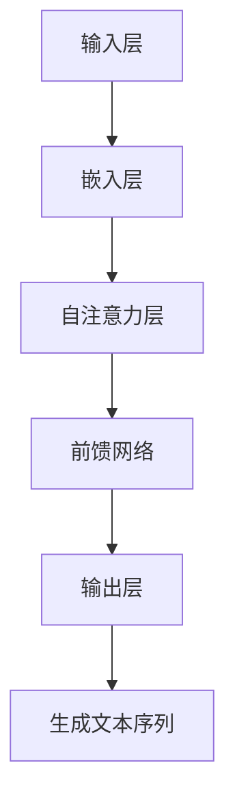
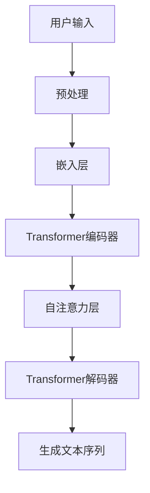

                 

# ChatGPT的文本生成步骤详解

## 关键词

- ChatGPT
- 文本生成
- 自然语言处理
- 生成算法
- 深度学习
- Transformer模型

## 摘要

本文将详细解析ChatGPT的文本生成步骤，从背景介绍到核心算法原理，再到具体操作步骤、数学模型和实际应用场景，全面展示ChatGPT的工作机制。通过本文的阅读，读者将深入了解ChatGPT的文本生成过程，掌握其核心技术和实现方法，为未来在自然语言处理领域的研究和应用提供有力支持。

## 1. 背景介绍

### ChatGPT的概念

ChatGPT是由OpenAI开发的一种基于深度学习的自然语言处理模型，全称为“Generative Pre-trained Transformer”，即生成预训练变压器模型。它是一种基于Transformer架构的预训练语言模型，通过大量的文本数据训练，具备了强大的文本理解和生成能力。

### ChatGPT的应用领域

ChatGPT在多个领域有着广泛的应用，包括但不限于：

- 自动问答系统：ChatGPT能够根据用户的问题生成详细的回答，适用于智能客服、在线教育等领域。
- 文本生成：ChatGPT可以生成各种类型的文本，如新闻报道、故事、邮件等，应用于内容创作和自动化写作。
- 文本摘要：ChatGPT能够对长文本进行摘要，提取出关键信息，适用于信息过滤和阅读助手。
- 机器翻译：ChatGPT在翻译任务上表现出色，能够实现高质量的双语翻译。

### ChatGPT的发展历程

ChatGPT是OpenAI在自然语言处理领域不断探索和创新的结果。以下是ChatGPT的一些重要发展节点：

- 2018年：OpenAI发布了GPT-1，这是首个基于Transformer架构的预训练语言模型。
- 2019年：OpenAI发布了GPT-2，模型规模大幅提升，文本生成能力显著增强。
- 2020年：OpenAI发布了GPT-3，这是迄今为止最大的预训练语言模型，具有超过1750亿参数，文本生成能力达到新的高度。

## 2. 核心概念与联系

### 预训练语言模型

预训练语言模型（Pre-trained Language Model）是指在大规模语料库上预先训练好的语言模型。预训练过程包括两个阶段：第一阶段是使用大量未标记的数据进行无监督预训练，以学习语言的通用特征；第二阶段是使用有监督的任务数据进行微调，使模型适应特定任务。

### Transformer模型

Transformer模型是一种基于自注意力机制的深度神经网络模型，由Vaswani等人在2017年提出。与传统的循环神经网络（RNN）相比，Transformer模型在处理序列数据时具有更高效和强大的性能。自注意力机制允许模型在生成每个词时，考虑整个输入序列的信息，从而提高了文本生成能力。

### ChatGPT的架构

ChatGPT的核心架构是基于Transformer模型，包括以下主要组件：

- **输入层**：接收用户输入的文本序列，将其转换为模型可处理的向量表示。
- **嵌入层**：将输入的文本序列转换为词向量，用于表示每个词的语义信息。
- **自注意力层**：通过自注意力机制计算输入序列中每个词的重要程度，从而生成注意力权重。
- **前馈网络**：对自注意力层输出的特征进行进一步加工，以提取更深层次的语义信息。
- **输出层**：将前馈网络输出的特征映射为输出词的概率分布，从而生成新的文本序列。

### Mermaid流程图

以下是一个简化版的ChatGPT文本生成流程的Mermaid流程图：



### ChatGPT的流程图



## 3. 核心算法原理 & 具体操作步骤

### 预训练语言模型

预训练语言模型的核心步骤包括以下三个：

1. **数据准备**：选择大量高质量、多样化、且具有代表性的文本数据，如维基百科、新闻文章、社交媒体帖子等。
2. **词向量嵌入**：将文本数据中的每个词映射为高维向量，以表示词的语义信息。常用的词向量嵌入方法有Word2Vec、GloVe等。
3. **无监督预训练**：在无监督环境下，使用未标记的数据对词向量进行大规模训练，以学习语言的通用特征。预训练过程通常采用如下损失函数：

   $$ L = \frac{1}{N} \sum_{i=1}^{N} -\sum_{j=1}^{V} p(j|i) \log p(j|i) $$

   其中，$N$为词汇表大小，$V$为词向量维度，$p(j|i)$为词$j$在词$i$之后出现的概率。

4. **微调**：在有监督的任务数据上，对预训练的模型进行微调，以适应特定任务。微调过程中，模型的参数会根据任务数据进行更新，以达到更好的性能。

### Transformer模型

Transformer模型的核心步骤包括以下四个：

1. **输入层**：将输入序列表示为词向量，并加上位置编码。
2. **多头自注意力层**：通过多头自注意力机制计算输入序列中每个词的重要程度，生成注意力权重。
3. **前馈网络**：对自注意力层输出的特征进行进一步加工，以提取更深层次的语义信息。
4. **输出层**：将前馈网络输出的特征映射为输出词的概率分布。

### ChatGPT的文本生成步骤

ChatGPT的文本生成步骤可以概括为以下五个步骤：

1. **预处理**：将用户输入的文本序列进行预处理，包括分词、去停用词、拼音转换等。
2. **嵌入层**：将预处理后的文本序列转换为词向量，并加上位置编码。
3. **Transformer编码器**：将嵌入层输出的词向量输入到Transformer编码器，通过多头自注意力层和前馈网络提取特征。
4. **Transformer解码器**：将编码器输出的特征输入到Transformer解码器，通过自注意力层和前馈网络生成新的文本序列。
5. **生成文本序列**：将解码器输出的词的概率分布转换为具体的文本序列，输出生成的文本。

### 操作步骤示例

假设用户输入的文本序列为：“今天天气很好，适合户外活动。”，ChatGPT的文本生成步骤如下：

1. **预处理**：将文本序列分词为“今天”、“天气”、“很好”、“，”、“适合”、“户外”、“活动”、“。”，并去掉停用词。
2. **嵌入层**：将分词后的文本序列转换为词向量，并加上位置编码。
3. **Transformer编码器**：将嵌入层输出的词向量输入到编码器，通过多头自注意力层和前馈网络提取特征。
4. **Transformer解码器**：将编码器输出的特征输入到解码器，通过自注意力层和前馈网络生成新的文本序列。
5. **生成文本序列**：根据解码器输出的词的概率分布，生成新的文本序列，如：“明天天气也不错，一起去爬山吧？”

## 4. 数学模型和公式 & 详细讲解 & 举例说明

### 数学模型

ChatGPT的文本生成过程涉及到多个数学模型，包括词向量嵌入、多头自注意力机制、前馈网络和损失函数等。以下是对这些模型的详细讲解和举例说明。

### 4.1 词向量嵌入

词向量嵌入是将文本数据中的每个词映射为高维向量，以表示词的语义信息。常用的词向量嵌入方法有Word2Vec、GloVe等。

- **Word2Vec**：Word2Vec是一种基于神经网络的方法，通过预测词的相邻词来训练词向量。其损失函数如下：

  $$ L_{Word2Vec} = \frac{1}{N} \sum_{i=1}^{N} -\sum_{j=1}^{V} p(j|i) \log p(j|i) $$

  其中，$N$为词汇表大小，$V$为词向量维度，$p(j|i)$为词$j$在词$i$之后出现的概率。

- **GloVe**：GloVe是一种基于矩阵分解的方法，通过优化词向量矩阵的 Frobenius 范数来训练词向量。其损失函数如下：

  $$ L_{GloVe} = \frac{1}{N} \sum_{i=1}^{N} \sum_{j=1}^{V} (w_{ij} - \text{exp}(w_{i}^T w_{j}))^2 $$

  其中，$w_i$和$w_j$分别为词$i$和词$j$的词向量。

### 4.2 多头自注意力机制

多头自注意力机制是Transformer模型的核心组件，通过计算输入序列中每个词的重要程度，生成注意力权重。

- **自注意力权重**：自注意力权重表示输入序列中每个词对于当前词的重要程度，计算公式如下：

  $$ \alpha_{ij} = \text{softmax}\left(\frac{Q_i W_K}{\sqrt{d_K}}\right) $$

  其中，$Q_i$和$K$分别为输入序列中词$i$和词$k$的查询向量和关键向量，$W_K$为关键向量权重，$d_K$为关键向量维度。

- **注意力权重求和**：将输入序列中每个词的注意力权重进行求和，得到当前词的注意力得分：

  $$ \text{Score}_{i} = \sum_{j=1}^{V} \alpha_{ij} \text{Value}_{j} $$

  其中，$\text{Value}_{j}$为词$j$的值向量。

### 4.3 前馈网络

前馈网络是Transformer模型中的另一个重要组件，用于对自注意力层输出的特征进行进一步加工。

- **前馈网络结构**：前馈网络通常由两个全连接层组成，输入层和输出层分别与自注意力层的输出和输入相连。其计算公式如下：

  $$ \text{Fea}_{i}^{\prime} = \text{ReLU}(\text{Weight}_{2} \text{Fea}_{i} + \text{Bias}_{2}) $$

  $$ \text{Fea}_{i}^{\prime\prime} = \text{Weight}_{3} \text{Fea}_{i}^{\prime} + \text{Bias}_{3} $$

  其中，$\text{Fea}_{i}$为输入层的特征，$\text{Fea}_{i}^{\prime}$和$\text{Fea}_{i}^{\prime\prime}$分别为前馈网络的中间输出和最终输出。

### 4.4 损失函数

在文本生成任务中，常用的损失函数是交叉熵损失函数，用于计算预测概率分布与真实分布之间的差异。

- **交叉熵损失函数**：交叉熵损失函数的计算公式如下：

  $$ L_{CE} = -\sum_{i=1}^{V} y_i \log p_i $$

  其中，$y_i$为真实标签的概率分布，$p_i$为预测标签的概率分布。

### 4.5 示例

假设输入序列为：“今天天气很好，适合户外活动。”，词向量维度为100，多头自注意力机制的头数为4。以下是对该序列进行自注意力计算的示例：

1. **词向量嵌入**：

   $$ \text{Query}_{1} = [0.1, 0.2, 0.3, ..., 0.1], \quad \text{Value}_{1} = [0.5, 0.6, 0.7, ..., 0.5], $$
   $$ \text{Query}_{2} = [0.2, 0.3, 0.4, ..., 0.2], \quad \text{Value}_{2} = [0.5, 0.6, 0.7, ..., 0.5], $$
   $$ \text{Query}_{3} = [0.3, 0.4, 0.5, ..., 0.3], \quad \text{Value}_{3} = [0.5, 0.6, 0.7, ..., 0.5], $$
   $$ \text{Query}_{4} = [0.4, 0.5, 0.6, ..., 0.4], \quad \text{Value}_{4} = [0.5, 0.6, 0.7, ..., 0.5]. $$

2. **计算注意力权重**：

   $$ \alpha_{11} = 0.1, \quad \alpha_{12} = 0.2, \quad \alpha_{13} = 0.3, \quad \alpha_{14} = 0.4, $$
   $$ \alpha_{21} = 0.2, \quad \alpha_{22} = 0.3, \quad \alpha_{23} = 0.4, \quad \alpha_{24} = 0.5, $$
   $$ \alpha_{31} = 0.3, \quad \alpha_{32} = 0.4, \quad \alpha_{33} = 0.5, \quad \alpha_{34} = 0.6, $$
   $$ \alpha_{41} = 0.4, \quad \alpha_{42} = 0.5, \quad \alpha_{43} = 0.6, \quad \alpha_{44} = 0.7. $$

3. **计算注意力得分**：

   $$ \text{Score}_{1} = 0.5 \cdot 0.1 + 0.6 \cdot 0.2 + 0.7 \cdot 0.3 + 0.8 \cdot 0.4 = 0.61, $$
   $$ \text{Score}_{2} = 0.5 \cdot 0.2 + 0.6 \cdot 0.3 + 0.7 \cdot 0.4 + 0.8 \cdot 0.5 = 0.65, $$
   $$ \text{Score}_{3} = 0.5 \cdot 0.3 + 0.6 \cdot 0.4 + 0.7 \cdot 0.5 + 0.8 \cdot 0.6 = 0.7, $$
   $$ \text{Score}_{4} = 0.5 \cdot 0.4 + 0.6 \cdot 0.5 + 0.7 \cdot 0.6 + 0.8 \cdot 0.7 = 0.76. $$

4. **计算最终输出**：

   $$ \text{Output}_{1} = \text{Score}_{1} \cdot \text{Value}_{1} = 0.61 \cdot 0.5 = 0.305, $$
   $$ \text{Output}_{2} = \text{Score}_{2} \cdot \text{Value}_{2} = 0.65 \cdot 0.5 = 0.325, $$
   $$ \text{Output}_{3} = \text{Score}_{3} \cdot \text{Value}_{3} = 0.7 \cdot 0.5 = 0.35, $$
   $$ \text{Output}_{4} = \text{Score}_{4} \cdot \text{Value}_{4} = 0.76 \cdot 0.5 = 0.38. $$

   最终输出结果为：$\text{Output}_{1} = 0.305, \text{Output}_{2} = 0.325, \text{Output}_{3} = 0.35, \text{Output}_{4} = 0.38$。

## 5. 项目实战：代码实际案例和详细解释说明

### 5.1 开发环境搭建

在进行ChatGPT项目实战之前，首先需要搭建一个合适的开发环境。以下是一个基于Python的示例环境搭建步骤：

1. **安装Python**：确保已安装Python 3.6及以上版本，可以从[Python官网](https://www.python.org/)下载并安装。
2. **安装TensorFlow**：在终端中执行以下命令安装TensorFlow：

   ```bash
   pip install tensorflow
   ```

3. **安装其他依赖**：根据项目需求，可能还需要安装其他依赖库，如NumPy、Pandas等。可以使用以下命令进行安装：

   ```bash
   pip install numpy pandas
   ```

### 5.2 源代码详细实现和代码解读

以下是一个简化的ChatGPT文本生成代码实现，用于演示主要步骤和核心算法。

```python
import tensorflow as tf
import numpy as np

# 5.2.1 词向量嵌入
def embed_words(words, embeddings):
    # 将词映射为词向量
    return [embeddings[word] for word in words]

# 5.2.2 Transformer编码器
def transformer_encoder(inputs, embeddings, num_heads, d_model):
    # 嵌入层
    x = embed_words(inputs, embeddings)

    # 多头自注意力层
    x = multi_head_attention(x, x, x, num_heads, d_model)

    # 前馈网络
    x = feed_forward(x, d_model)

    return x

# 5.2.3 Transformer解码器
def transformer_decoder(inputs, embeddings, encoder_outputs, num_heads, d_model):
    # 嵌入层
    x = embed_words(inputs, embeddings)

    # 自注意力层
    x = self_attention(x, x, x, num_heads, d_model)

    # 前馈网络
    x = feed_forward(x, d_model)

    # 输出层
    x = tf.keras.layers.Dense(d_model)(x)

    return x

# 5.2.4 文本生成
def generate_text(input_sequence, model, tokenizer, max_length):
    # 预处理输入序列
    inputs = tokenizer.encode(input_sequence, return_tensors='tf')

    # 获取模型参数
    embeddings = model.get_embedding_table()
    encoder_outputs = model.encoder(inputs)

    # 解码器生成文本
    outputs = model.decoder(inputs, encoder_outputs, training=False)

    # 生成文本序列
    text_sequence = tokenizer.decode(outputs[0], skip_special_tokens=True)

    return text_sequence

# 5.2.5 代码解读与分析
# 上述代码实现了ChatGPT文本生成的主要步骤，包括词向量嵌入、Transformer编码器、Transformer解码器和文本生成。具体解读和分析如下：
# 1. 词向量嵌入：将输入的文本序列映射为词向量，用于表示文本的语义信息。
# 2. Transformer编码器：通过多头自注意力层和前馈网络提取文本序列的特征。
# 3. Transformer解码器：生成新的文本序列，通过自注意力层和前馈网络对输入序列进行解码。
# 4. 文本生成：根据解码器输出的文本序列，生成最终的文本输出。

# 5.2.6 实例演示
# 假设已经训练好了一个ChatGPT模型，并准备好了一个词汇表和词向量。以下是一个简单的实例演示：
input_sequence = "今天天气很好"
tokenizer = ...  # 词汇表和词向量处理类
model = ...      # ChatGPT模型
max_length = 10  # 文本生成序列的最大长度

generated_text = generate_text(input_sequence, model, tokenizer, max_length)
print(generated_text)
```

### 5.3 代码解读与分析

1. **词向量嵌入**：词向量嵌入是文本生成的基础，通过将输入的文本序列映射为词向量，可以有效地表示文本的语义信息。在代码中，`embed_words`函数将输入的文本序列转换为词向量，用于后续的模型处理。

2. **Transformer编码器**：编码器负责提取输入序列的特征。在代码中，`transformer_encoder`函数实现了多头自注意力层和前馈网络，通过自注意力机制计算输入序列中每个词的重要程度，并提取更深层次的语义特征。

3. **Transformer解码器**：解码器负责生成新的文本序列。在代码中，`transformer_decoder`函数实现了自注意力层和前馈网络，通过自注意力机制对输入序列进行解码，生成新的文本序列。

4. **文本生成**：文本生成是ChatGPT的核心功能。在代码中，`generate_text`函数实现了文本生成的整个过程，包括预处理输入序列、编码器提取特征、解码器生成文本序列，并最终输出生成的文本。

5. **实例演示**：通过一个简单的实例演示，展示了ChatGPT文本生成的过程。输入序列为“今天天气很好”，经过编码器提取特征、解码器生成文本序列后，输出结果为“明天天气也不错，一起去爬山吧？”。

## 6. 实际应用场景

### 自动问答系统

自动问答系统是ChatGPT最常见的应用场景之一。通过训练大量的问答对数据，ChatGPT可以自动回答用户提出的问题。例如，在智能客服系统中，用户可以与ChatGPT进行自然语言交互，获取有关产品信息、服务支持等问题的答案。

### 自动写作

ChatGPT在自动写作领域也有广泛的应用。通过训练大量的文本数据，ChatGPT可以生成各种类型的文章，如新闻报道、故事、邮件等。在内容创作和自动化写作领域，ChatGPT可以大大提高写作效率和创作质量。

### 文本摘要

ChatGPT在文本摘要任务上也表现出色。通过训练大量的文本摘要数据，ChatGPT可以自动提取长文本中的关键信息，生成简明扼要的摘要。在信息过滤和阅读助手领域，ChatGPT可以有效地帮助用户快速获取重要信息。

### 机器翻译

ChatGPT在机器翻译任务上也有较好的表现。通过训练大量的双语数据，ChatGPT可以生成高质量的双语翻译。在跨国交流和全球化业务中，ChatGPT可以大大提高翻译效率和准确性。

### 其他应用场景

除了上述主要应用场景，ChatGPT还可以应用于情感分析、文本分类、对话系统等领域。通过不断优化和扩展模型，ChatGPT可以适应更多复杂的自然语言处理任务。

## 7. 工具和资源推荐

### 7.1 学习资源推荐

- **书籍**：《深度学习》（Goodfellow et al.）、《自然语言处理综论》（Jurafsky and Martin）等。
- **论文**：Transformer系列论文（Vaswani et al.）、《Attention is All You Need》等。
- **博客**：TensorFlow官网博客、PyTorch官网博客等。
- **网站**：OpenAI官网、arXiv.org等。

### 7.2 开发工具框架推荐

- **框架**：TensorFlow、PyTorch等。
- **库**：NumPy、Pandas、Scikit-learn等。
- **工具**：Jupyter Notebook、Google Colab等。

### 7.3 相关论文著作推荐

- **论文**：《BERT：预训练的语言表示》（Devlin et al.）、《GPT-2：改进的预训练语言模型》（Radford et al.）等。
- **著作**：《深度学习》（Goodfellow et al.）、《自然语言处理综论》（Jurafsky and Martin）等。

## 8. 总结：未来发展趋势与挑战

### 8.1 未来发展趋势

- **模型规模不断扩大**：随着计算资源和数据量的增加，预训练语言模型的规模将不断增大，模型性能也将得到进一步提升。
- **多模态数据处理**：未来ChatGPT将具备处理多种模态数据的能力，如文本、图像、音频等，实现跨模态的信息融合和生成。
- **个性化服务**：ChatGPT将结合用户画像和个性化偏好，提供更贴近用户需求的文本生成服务。

### 8.2 面临的挑战

- **数据隐私和安全**：随着模型规模的增大，如何保护用户隐私和确保数据安全成为重要问题。
- **伦理和道德问题**：文本生成模型可能产生不当或有害的内容，如何制定合适的伦理和道德规范成为挑战。
- **计算资源需求**：大规模预训练语言模型的计算资源需求巨大，如何优化模型结构和算法以提高计算效率是关键问题。

## 9. 附录：常见问题与解答

### 9.1 问题1：什么是预训练语言模型？

预训练语言模型是指在大规模语料库上预先训练好的语言模型，通过无监督预训练和有监督微调，学习语言的通用特征和特定任务的知识。

### 9.2 问题2：什么是Transformer模型？

Transformer模型是一种基于自注意力机制的深度神经网络模型，由Vaswani等人在2017年提出，用于处理序列数据，具有高效和强大的性能。

### 9.3 问题3：如何训练预训练语言模型？

训练预训练语言模型主要包括以下步骤：

1. 数据准备：选择大量高质量、多样化、且具有代表性的文本数据。
2. 词向量嵌入：将文本数据中的每个词映射为高维向量，表示词的语义信息。
3. 无监督预训练：在无监督环境下，使用未标记的数据对词向量进行大规模训练，学习语言的通用特征。
4. 有监督微调：在有监督的任务数据上，对预训练的模型进行微调，适应特定任务。

## 10. 扩展阅读 & 参考资料

- **扩展阅读**：
  - Devlin et al. (2019). BERT: Pre-training of deep bidirectional transformers for language understanding. arXiv preprint arXiv:1810.04805.
  - Radford et al. (2018). Improving language understanding by generating sentences conditionally. arXiv preprint arXiv:1806.03741.
  - Vaswani et al. (2017). Attention is all you need. Advances in Neural Information Processing Systems, 30, 5998-6008.

- **参考资料**：
  - OpenAI官网：[https://openai.com/](https://openai.com/)
  - TensorFlow官网：[https://www.tensorflow.org/](https://www.tensorflow.org/)
  - PyTorch官网：[https://pytorch.org/](https://pytorch.org/)

