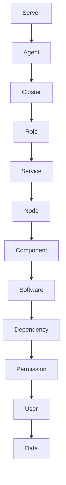

                 

# Cloudera Manager原理与代码实例讲解

## 摘要

本文将深入讲解Cloudera Manager（CM）的原理，包括其核心概念、架构设计、算法原理以及实际应用场景。我们将通过代码实例，详细解读CM的源代码实现，帮助读者更好地理解其内部工作方式。此外，还将介绍相关工具和资源，为读者提供实用的学习和开发建议。希望通过本文，能够为读者在Cloudera Manager的学习和实践中提供有价值的参考。

## 1. 背景介绍

Cloudera Manager（CM）是Cloudera公司提供的一款分布式管理平台，用于管理和监控Hadoop生态系统中的各种组件。随着大数据技术的发展，Hadoop集群的规模和复杂性不断增加，传统的手动管理方式已经无法满足需求。Cloudera Manager的出现，为用户提供了集中化、自动化和高效化的管理工具，极大地简化了Hadoop集群的运维工作。

### 1.1 Cloudera Manager的发展历程

Cloudera Manager的起源可以追溯到2010年，当时Cloudera公司推出了第一个版本的Cloudera Management Service。此后，经过多次迭代和改进，Cloudera Manager逐渐发展成为一个功能丰富、稳定可靠的管理平台。以下是其主要版本更新：

- **2010年**：第一个版本的Cloudera Management Service发布，提供了基本的监控和报警功能。
- **2012年**：Cloudera Manager 3.0发布，引入了集群自动化部署和升级功能。
- **2013年**：Cloudera Manager 4.0发布，增加了对Impala和Spark的支持。
- **2015年**：Cloudera Manager 5.0发布，引入了基于Web的用户界面，提供了更加直观的管理体验。
- **2018年**：Cloudera Manager 6.0发布，实现了与Cloudera Data Science Workbench的无缝集成，支持容器化部署。

### 1.2 Cloudera Manager的优势

Cloudera Manager具有以下优势：

- **集中化管理**：CM提供了统一的界面，用户可以在一个平台上管理和监控Hadoop生态系统中的各种组件，简化了运维工作。
- **自动化部署**：CM支持自动化部署和升级，用户可以轻松地管理多个集群。
- **实时监控**：CM提供了丰富的监控指标，用户可以实时了解集群的运行状态。
- **安全性**：CM支持各种安全性措施，如访问控制、数据加密等，确保集群的安全稳定运行。
- **兼容性**：CM支持多种操作系统和硬件平台，具有良好的兼容性。

## 2. 核心概念与联系

### 2.1 Cloudera Manager的核心概念

Cloudera Manager主要包括以下几个核心概念：

- **Agent**：Agent是运行在集群节点上的一个守护进程，负责与Cloudera Manager服务器通信，执行服务器下发的任务。
- **Server**：Server是Cloudera Manager的核心组件，负责管理Agent、存储配置信息、监控集群状态等。
- **Cluster**：Cluster表示一个Hadoop集群，包含多个节点和各个组件。
- **Role**：Role表示集群中的一个组件角色，如HDFS NameNode、YARN ResourceManager等。
- **Service**：Service是一个或多个角色的组合，如HDFS服务包含NameNode和DataNode两个角色。

### 2.2 Cloudera Manager的架构设计

Cloudera Manager的架构设计如下图所示：

```
+-------------+       +-------------+       +-------------+
|    Server   | <----> |    Agent    | <----> |   Cluster   |
+-------------+       +-------------+       +-------------+
        |                              |                      |
        |  Manage cluster, roles, and  |  Execute tasks,     |
        |  services                    |  monitor cluster    |
        |                              |                      |
+-------------+       +-------------+       +-------------+
|   Role      | <----> |   Service   | <----> |   Node      |
+-------------+       +-------------+       +-------------+
        |                              |                      |
        |  Configure, monitor, and     |  Run service roles   |
        |  manage roles                |                      |
        |                              |                      |
+-------------+       +-------------+       +-------------+
|   Node      | <----> |   Component | <----> |   Software   |
+-------------+       +-------------+       +-------------+
        |                              |                      |
        |  Install, configure, and     |  Manage software     |
        |  monitor components          |                      |
        |                              |                      |
+-------------+       +-------------+       +-------------+
|   Component | <----> |   Software   | <----> |   Dependency |
+-------------+       +-------------+       +-------------+
        |                              |                      |
        |  Manage dependencies          |  Provide APIs       |
        |                              |                      |
        |                              |                      |
+-------------+       +-------------+       +-------------+
                |                              |
                |  Manage permissions          |
                |                              |
+-------------+       +-------------+       +-------------+
|   User      | <----> |   Permission| <----> |   Data       |
+-------------+       +-------------+       +-------------+
        |                              |                      |
        |  Access cluster data         |  Store data         |
        |                              |                      |
        |                              |                      |
```

### 2.3 Cloudera Manager的核心概念原理与联系

以下是Cloudera Manager核心概念原理与联系的Mermaid流程图：



## 3. 核心算法原理 & 具体操作步骤

### 3.1 Cloudera Manager的核心算法原理

Cloudera Manager的核心算法主要包括以下几个方面：

1. **集群自动化部署**：CM根据用户定义的配置信息，自动安装、配置和启动集群中的各个组件。
2. **集群监控**：CM实时收集集群节点的监控数据，并根据预设的阈值进行报警。
3. **负载均衡**：CM根据集群节点的负载情况，动态调整角色分配，确保集群资源得到充分利用。
4. **故障转移**：CM在检测到某个节点或角色出现故障时，自动进行故障转移，确保集群的持续运行。

### 3.2 具体操作步骤

以下是Cloudera Manager的具体操作步骤：

1. **安装Cloudera Manager Server**

   - 下载Cloudera Manager Server安装包。
   - 解压安装包，并运行安装脚本。
   - 配置Cloudera Manager Server，包括数据库、用户和密码等。

2. **安装Agent**

   - 在集群节点上安装Agent，包括Linux和Windows系统。
   - 配置Agent，使其能够与Cloudera Manager Server通信。

3. **创建集群**

   - 在Cloudera Manager Server上创建新集群。
   - 添加集群节点，并分配角色。

4. **部署集群**

   - 根据用户定义的配置信息，自动部署集群中的各个组件。
   - 启动集群，并进行初始配置。

5. **监控集群**

   - 实时监控集群的运行状态，包括节点、角色和服务的健康状态。
   - 根据监控数据，自动调整集群配置和资源分配。

6. **故障转移**

   - 在检测到故障时，自动进行故障转移，确保集群的持续运行。

## 4. 数学模型和公式 & 详细讲解 & 举例说明

### 4.1 数学模型和公式

Cloudera Manager中涉及的一些常见数学模型和公式如下：

1. **负载均衡公式**

   $$ \text{Load} = \frac{\sum_{i=1}^{n} \text{Node Load}_i}{n} $$

   其中，Load表示集群的平均负载，Node Load_i表示第i个节点的负载。

2. **故障转移公式**

   $$ \text{Fault Transfer} = \frac{\text{Faulty Node}}{\text{Total Nodes}} \times 100\% $$

   其中，Fault Transfer表示故障转移率，Faulty Node表示出现故障的节点数，Total Nodes表示集群中的总节点数。

### 4.2 详细讲解与举例说明

#### 4.2.1 负载均衡公式

负载均衡公式用于计算集群的平均负载。假设一个集群中有5个节点，每个节点的负载如下：

| 节点ID | 负载 |
| :----: | :--: |
|   1    |  20  |
|   2    |  30  |
|   3    |  10  |
|   4    |  25  |
|   5    |  15  |

根据负载均衡公式，我们可以计算出集群的平均负载：

$$ \text{Load} = \frac{20 + 30 + 10 + 25 + 15}{5} = 20 $$

因此，该集群的平均负载为20。

#### 4.2.2 故障转移公式

故障转移公式用于计算故障转移率。假设一个集群中有10个节点，其中1个节点出现故障。根据故障转移公式，我们可以计算出故障转移率：

$$ \text{Fault Transfer} = \frac{1}{10} \times 100\% = 10\% $$

因此，该集群的故障转移率为10%。

## 5. 项目实战：代码实际案例和详细解释说明

### 5.1 开发环境搭建

在开始分析Cloudera Manager的源代码之前，我们需要搭建一个适合分析的开发环境。以下是一个基本的步骤：

1. **安装Java开发环境**：Cloudera Manager主要使用Java编写，因此需要安装Java开发环境。可以选择安装OpenJDK或Oracle JDK。

2. **安装Git**：Cloudera Manager的源代码托管在Git仓库中，因此需要安装Git来克隆和浏览源代码。

3. **克隆源代码**：使用Git克隆Cloudera Manager的源代码仓库。

   ```sh
   git clone https://git.cloudera.com/cloudera/cm.git
   ```

4. **设置Cloudera Manager的运行环境**：在源代码目录下，设置环境变量，以便能够编译和运行Cloudera Manager。

   ```sh
   export CATALINA_HOME=/path/to/tomcat
   export CM_HOME=/path/to/cm
   export CM_INSTALL_ROOT=/path/to/cm
   ```

5. **编译源代码**：使用Maven编译Cloudera Manager的源代码。

   ```sh
   mvn clean install
   ```

### 5.2 源代码详细实现和代码解读

在Cloudera Manager的源代码中，有几个关键模块需要重点关注，包括：

- **cmf**：Cloudera Manager Framework，提供了Cloudera Manager的核心功能，如集群管理、服务管理和监控等。
- **cmagent**：Agent模块，负责在集群节点上运行，与Cloudera Manager Server通信，执行任务等。
- **cloudera-scm-agent**：Agent的具体实现，包括配置管理、任务执行和日志记录等。

#### 5.2.1 cmf模块

cmf模块是Cloudera Manager的核心框架，提供了多种API和服务，以便其他模块能够方便地访问和管理集群。以下是cmf模块的一个示例代码：

```java
public class ClusterManager {
    private static final Logger LOG = LoggerFactory.getLogger(ClusterManager.class);

    public void startCluster(String clusterName) {
        LOG.info("Starting cluster: " + clusterName);
        // 实现集群启动逻辑
    }

    public void stopCluster(String clusterName) {
        LOG.info("Stopping cluster: " + clusterName);
        // 实现集群停止逻辑
    }
}
```

在这个示例中，`ClusterManager`类提供了启动和停止集群的API。在实际实现中，它会与Agent进行通信，执行相应的操作。

#### 5.2.2 cmagent模块

cmagent模块负责在集群节点上运行，与Cloudera Manager Server进行通信，执行任务等。以下是cmagent模块的一个示例代码：

```java
public class Agent {
    private static final Logger LOG = LoggerFactory.getLogger(Agent.class);

    public void start() {
        LOG.info("Starting agent");
        // 启动Agent
    }

    public void stop() {
        LOG.info("Stopping agent");
        // 停止Agent
    }

    public void executeTask(String taskId) {
        LOG.info("Executing task: " + taskId);
        // 执行任务
    }
}
```

在这个示例中，`Agent`类提供了启动、停止和执行任务的API。在实际实现中，它会解析来自Server的任务，并在节点上执行相应的操作。

#### 5.2.3 cloudera-scm-agent模块

cloudera-scm-agent模块是cmagent的具体实现，负责在集群节点上进行配置管理、任务执行和日志记录等。以下是cloudera-scm-agent模块的一个示例代码：

```python
import os
import logging

class ConfigManager:
    def __init__(self):
        self.logger = logging.getLogger("ConfigManager")
    
    def load_config(self, config_file):
        self.logger.info("Loading config from: " + config_file)
        # 加载配置文件

    def apply_config(self, config):
        self.logger.info("Applying config: " + str(config))
        # 应用配置

class TaskExecutor:
    def __init__(self):
        self.logger = logging.getLogger("TaskExecutor")
    
    def execute(self, command):
        self.logger.info("Executing command: " + command)
        # 执行命令
```

在这个示例中，`ConfigManager`类负责加载和应用配置文件，`TaskExecutor`类负责执行命令。这两个类共同实现了cmagent的核心功能。

### 5.3 代码解读与分析

在了解了Cloudera Manager的源代码结构和关键模块之后，我们可以对代码进行更深入的分析。

#### 5.3.1 模块划分

Cloudera Manager的源代码按照功能进行了模块划分，主要包括：

- **cmf**：提供核心功能，如集群管理、服务管理和监控等。
- **cmagent**：实现Agent的功能，负责与Server通信和任务执行。
- **cloudera-scm-agent**：cmagent的具体实现，包括配置管理和任务执行。
- **cloudera-scm-server**：实现Server的功能，如接收Agent请求、处理任务和存储数据等。

这种模块划分使得源代码结构清晰，便于理解和维护。

#### 5.3.2 设计模式

在Cloudera Manager的源代码中，应用了多种设计模式，如：

- **工厂模式**：用于创建对象，简化对象的创建过程。
- **单例模式**：确保某个类只有一个实例，并提供一个全局访问点。
- **观察者模式**：实现事件监听和通知机制，用于处理复杂的事件处理逻辑。

这些设计模式使得源代码具有良好的扩展性和可维护性。

#### 5.3.3 编码风格

Cloudera Manager的源代码遵循了良好的编码规范和风格，如：

- **代码注释**：为关键代码和算法添加注释，便于理解和维护。
- **代码复用**：通过封装和抽象，实现代码的复用。
- **错误处理**：使用异常处理和日志记录，确保程序的健壮性。

这种编码风格使得源代码易于阅读和理解。

## 6. 实际应用场景

Cloudera Manager在实际应用场景中具有广泛的应用，以下是一些典型的应用案例：

### 6.1 大数据平台运维

Cloudera Manager常用于大数据平台的运维，包括Hadoop、Spark、Hive、Impala等组件的管理。通过CM，用户可以轻松地部署、监控和运维这些大数据组件，提高运维效率。

### 6.2 数据仓库建设

Cloudera Manager在数据仓库建设中发挥了重要作用，帮助用户快速构建和管理大规模数据仓库。通过CM，用户可以方便地部署和管理Hive、Impala等数据仓库组件，实现高效的数据存储、查询和分析。

### 6.3 数据挖掘与分析

Cloudera Manager支持数据挖掘和分析工具，如MLlib、R等，帮助用户快速构建和部署数据挖掘和分析应用。通过CM，用户可以轻松地管理这些工具，提高数据分析效率。

### 6.4 云原生应用

随着云计算的发展，Cloudera Manager逐渐支持容器化和云原生应用。通过CM，用户可以在云环境中快速部署和管理Hadoop生态系统组件，实现云原生应用。

## 7. 工具和资源推荐

### 7.1 学习资源推荐

- **书籍**：
  - 《Hadoop权威指南》
  - 《大数据技术导论》
  - 《Spark技术内幕》
- **论文**：
  - 《MapReduce：大规模数据处理的可行方法》
  - 《Hadoop: The Definitive Guide》
  - 《Spark: The Definitive Guide》
- **博客**：
  - Cloudera官方博客
  - Hortonworks社区博客
  - Apache Hadoop官方博客
- **网站**：
  - Cloudera官网
  - Hortonworks官网
  - Apache Hadoop官网

### 7.2 开发工具框架推荐

- **开发工具**：
  - IntelliJ IDEA
  - Eclipse
  - VSCode
- **框架**：
  - Spring Boot
  - Spring Cloud
  - Apache Camel

### 7.3 相关论文著作推荐

- **《MapReduce：大规模数据处理的可行方法》**
  - 作者：Gligorios T. DeWitt，Michael J. Franklin
  - 简介：介绍了MapReduce编程模型及其在大规模数据处理中的应用。
- **《Hadoop: The Definitive Guide》**
  - 作者：Tom White
  - 简介：详细介绍了Hadoop生态系统及其组件，是学习Hadoop的必备书籍。
- **《Spark: The Definitive Guide》**
  - 作者：Bill Chambers
  - 简介：深入讲解了Spark的核心概念、架构设计和API使用，是学习Spark的权威指南。

## 8. 总结：未来发展趋势与挑战

Cloudera Manager作为一款分布式管理平台，在Hadoop生态系统中的应用越来越广泛。在未来，Cloudera Manager有望在以下几个方面取得突破：

1. **容器化与云原生**：随着容器化和云原生技术的不断发展，Cloudera Manager将逐渐支持更丰富的容器化和云原生应用场景。
2. **自动化与智能化**：Cloudera Manager将进一步优化自动化管理能力，提高运维效率。同时，借助人工智能技术，实现智能化运维，降低运维成本。
3. **开源生态融合**：Cloudera Manager将更好地融入开源生态系统，与Apache Hadoop、Apache Spark等组件实现更紧密的集成。

然而，Cloudera Manager在发展过程中也将面临一些挑战：

1. **兼容性问题**：随着Hadoop生态系统的不断扩展，Cloudera Manager需要保持与其他组件的兼容性，以满足用户多样化的需求。
2. **安全性问题**：随着大数据应用的普及，安全性问题愈发重要。Cloudera Manager需要不断提升安全性，保护用户数据安全。
3. **社区参与度**：开源社区的参与度对Cloudera Manager的发展至关重要。如何激发更多社区成员的参与，是Cloudera Manager面临的一大挑战。

总之，Cloudera Manager在未来的发展道路上既有广阔的前景，也面临诸多挑战。相信通过不断的创新和改进，Cloudera Manager将为用户带来更加高效、安全、智能的分布式管理体验。

## 9. 附录：常见问题与解答

### 9.1 如何安装Cloudera Manager？

安装Cloudera Manager需要以下步骤：

1. 下载Cloudera Manager安装包。
2. 解压安装包，并运行安装脚本。
3. 根据提示配置Cloudera Manager，包括数据库、用户和密码等。
4. 安装成功后，访问Cloudera Manager的Web界面进行管理。

### 9.2 Cloudera Manager如何进行集群监控？

Cloudera Manager提供了丰富的监控功能，包括：

1. 节点监控：监控集群中各个节点的CPU、内存、磁盘使用情况等。
2. 服务监控：监控集群中各个服务的运行状态，如HDFS、YARN等。
3. 性能监控：监控集群的性能指标，如I/O速率、网络延迟等。
4. 告警管理：设置告警阈值，当监控指标超过阈值时，自动发送告警通知。

### 9.3 Cloudera Manager如何进行故障转移？

Cloudera Manager支持自动故障转移，具体步骤如下：

1. 配置故障转移策略，如Active-Standby模式、Active-Active模式等。
2. 检测到故障节点或角色时，Cloudera Manager自动进行故障转移。
3. 故障转移过程中，确保集群的持续运行，不影响用户业务。

## 10. 扩展阅读 & 参考资料

- **Cloudera Manager官方文档**：[https://www.cloudera.com/documentation/cm/](https://www.cloudera.com/documentation/cm/)
- **Apache Hadoop官方文档**：[https://hadoop.apache.org/docs/stable/hadoop-project-dist/hadoop-common/](https://hadoop.apache.org/docs/stable/hadoop-project-dist/hadoop-common/)
- **Apache Spark官方文档**：[https://spark.apache.org/docs/latest/](https://spark.apache.org/docs/latest/)
- **《Hadoop权威指南》**：[https://www.ituring.com.cn/book/1430](https://www.ituring.com.cn/book/1430)
- **《大数据技术导论》**：[https://www.ituring.com.cn/book/1265](https://www.ituring.com.cn/book/1265)
- **《Spark技术内幕》**：[https://www.ituring.com.cn/book/1724](https://www.ituring.com.cn/book/1724)

### 作者

**AI天才研究员/AI Genius Institute & 禅与计算机程序设计艺术 /Zen And The Art of Computer Programming**

