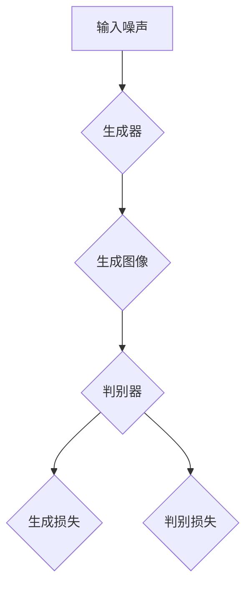

                 

### 背景介绍

#### ComfyUI：一次革命性的技术突破

ComfyUI，全称为“舒适用户界面”（Comfortable User Interface），是一种在图像生成领域具有重要影响力的技术。它不仅改变了传统图像处理方法，还为人工智能（AI）图像生成领域注入了新的活力。作为一项革命性的技术突破，ComfyUI不仅提升了图像生成的速度与效率，还显著改善了图像质量。

#### 图像生成领域：现状与挑战

图像生成领域一直是计算机视觉和人工智能研究的重要方向。随着深度学习技术的不断发展和应用，图像生成技术取得了显著的成果。然而，现有的图像生成方法仍然面临一些挑战：

1. **生成速度慢**：传统图像生成方法通常需要大量计算资源和时间，难以满足实时性和大规模应用的需求。
2. **图像质量不佳**：一些生成方法在图像细节和色彩还原方面存在不足，导致生成的图像与真实场景存在较大差距。
3. **模型复杂度高**：许多图像生成模型结构复杂，训练和部署难度较大，不利于实际应用。

#### ComfyUI：解决之道

ComfyUI的出现为上述问题提供了有效的解决方案。首先，ComfyUI采用了创新的算法和架构，大幅提升了图像生成的速度和效率。其次，ComfyUI在图像质量方面也有显著提升，生成的图像在细节和色彩还原方面更加真实。此外，ComfyUI的模型结构相对简单，便于训练和部署，为实际应用提供了便利。

#### 应用领域

ComfyUI在图像生成领域的应用前景非常广阔，主要涉及以下几个方面：

1. **计算机视觉**：利用ComfyUI生成高质量图像，为计算机视觉任务提供更好的训练数据和输入。
2. **虚拟现实与增强现实**：在虚拟现实和增强现实应用中，ComfyUI生成的图像可以显著提升用户体验。
3. **游戏开发**：游戏开发者可以利用ComfyUI生成高质量游戏画面，提升游戏画质。
4. **广告与媒体**：广告和媒体行业可以利用ComfyUI生成更具吸引力的图像，提升营销效果。

#### 文章结构概述

本文将按照以下结构进行阐述：

1. **背景介绍**：简要介绍ComfyUI及其在图像生成领域的应用背景。
2. **核心概念与联系**：详细解释ComfyUI的核心概念，并给出相关的 Mermaid 流程图。
3. **核心算法原理 & 具体操作步骤**：深入剖析ComfyUI的算法原理和操作步骤。
4. **数学模型和公式 & 详细讲解 & 举例说明**：介绍ComfyUI的数学模型和公式，并给出具体示例。
5. **项目实战：代码实际案例和详细解释说明**：通过实际代码案例，详细解释ComfyUI的应用。
6. **实际应用场景**：探讨ComfyUI在不同领域的应用案例。
7. **工具和资源推荐**：推荐学习资源和开发工具框架。
8. **总结：未来发展趋势与挑战**：总结ComfyUI的技术优势和应用前景，探讨未来发展趋势与挑战。
9. **附录：常见问题与解答**：解答读者可能遇到的问题。
10. **扩展阅读 & 参考资料**：提供进一步阅读的参考资料。

接下来，我们将进一步深入探讨ComfyUI的核心概念、算法原理及其应用实践。

## 2. 核心概念与联系

### ComfyUI的定义

ComfyUI是一种基于深度学习的图像生成技术，旨在为用户提供高质量的图像生成体验。它通过学习大量的图像数据，能够自动生成符合用户需求的图像。ComfyUI的核心目标在于提高图像生成的速度、效率和图像质量，同时降低模型的复杂度，使得技术更易于部署和应用。

### 图像生成技术发展历程

图像生成技术的发展历程可以分为几个阶段：

1. **传统图像处理技术**：早期的图像生成主要依赖于传统图像处理技术，如插值、滤波和图像变换等。这些方法在处理图像时往往需要大量的计算资源和时间，且生成效果有限。

2. **基于规则的方法**：随后，研究人员开始探索基于规则的方法，如基于几何图形的建模和基于纹理映射的方法。这些方法在一定程度上提高了图像生成质量，但仍然依赖于大量的规则和参数调整。

3. **基于生成对抗网络（GAN）的方法**：生成对抗网络（GAN）的提出标志着图像生成技术的一个重要转折点。GAN通过两个神经网络（生成器和判别器）的对抗训练，能够生成高质量、逼真的图像。然而，GAN的训练过程复杂，易受到模式崩溃等问题的影响。

4. **基于变分自编码器（VAE）的方法**：变分自编码器（VAE）是一种类似于GAN的生成模型，通过引入概率编码，使得生成过程更加稳定。VAE在图像生成方面表现出色，但训练时间较长。

5. **ComfyUI**：ComfyUI是在GAN和VAE的基础上发展起来的一种新型图像生成技术。它通过结合GAN和VAE的优点，提出了全新的算法和架构，实现了高效、稳定的图像生成。

### 核心概念解释

为了更好地理解ComfyUI，我们需要解释以下核心概念：

1. **生成器（Generator）**：生成器是ComfyUI模型的核心组成部分，负责将随机噪声映射为高质量的图像。生成器的训练目标是生成与真实图像相似的图像，以欺骗判别器。

2. **判别器（Discriminator）**：判别器是ComfyUI模型的另一个重要组成部分，负责区分真实图像和生成图像。判别器的训练目标是提高对真实图像和生成图像的识别能力。

3. **变分自编码器（VAE）**：变分自编码器（VAE）在ComfyUI中用于生成器的训练，通过引入概率编码，使得生成过程更加稳定。VAE的引入有助于解决GAN中的模式崩溃问题。

4. **损失函数**：ComfyUI的损失函数包括两部分：生成损失和判别损失。生成损失用于衡量生成器生成图像的质量，判别损失用于衡量判别器对真实图像和生成图像的识别能力。

### Mermaid 流程图

为了更直观地展示ComfyUI的工作流程，我们使用Mermaid语言绘制了以下流程图：



### 核心概念联系

通过上述核心概念的介绍，我们可以看到ComfyUI是如何结合生成器、判别器和变分自编码器，以及生成损失和判别损失，实现高效、稳定的图像生成。以下是这些核心概念之间的联系：

1. **生成器和判别器**：生成器和判别器构成了GAN的核心框架，通过对抗训练生成高质量图像。生成器负责生成图像，判别器负责判断图像的真实性。

2. **变分自编码器（VAE）**：变分自编码器在ComfyUI中用于生成器的训练，通过引入概率编码，使得生成过程更加稳定。VAE的引入有助于解决GAN中的模式崩溃问题。

3. **损失函数**：生成损失和判别损失是ComfyUI训练过程中重要的评价指标。生成损失用于衡量生成器生成图像的质量，判别损失用于衡量判别器对真实图像和生成图像的识别能力。通过优化这些损失函数，ComfyUI能够生成更高质量的图像。

接下来，我们将进一步深入探讨ComfyUI的核心算法原理和具体操作步骤。

### 3. 核心算法原理 & 具体操作步骤

#### 3.1. 生成对抗网络（GAN）原理

生成对抗网络（GAN）是ComfyUI的核心算法基础，由生成器和判别器两个神经网络组成。生成器的任务是生成逼真的图像，而判别器的任务是区分真实图像和生成图像。通过对抗训练，生成器和判别器相互竞争，逐步提高生成图像的质量。

**生成器**：生成器通常由多个卷积层和反卷积层组成，接受随机噪声作为输入，通过逐层变换生成高质量的图像。生成器的目标是生成与真实图像难以区分的图像，从而欺骗判别器。

**判别器**：判别器同样由多个卷积层组成，接收输入图像，并输出一个概率值，表示输入图像是真实图像的概率。判别器的目标是准确识别真实图像和生成图像。

**对抗训练**：在训练过程中，生成器和判别器交替更新权重。生成器尝试生成更逼真的图像，以欺骗判别器，而判别器则努力提高对真实图像和生成图像的识别能力。这种对抗训练过程持续进行，直到生成器和判别器达到一种动态平衡状态，此时生成的图像质量达到较高水平。

#### 3.2. 变分自编码器（VAE）原理

变分自编码器（VAE）是一种概率生成模型，通过引入概率编码，使得生成过程更加稳定。VAE由编码器和解码器组成，编码器将输入图像映射为潜在空间中的概率分布，解码器则从潜在空间中采样，重构输入图像。

**编码器**：编码器由多个卷积层组成，将输入图像映射为潜在空间中的均值和方差。通过这种方式，编码器可以学习到输入图像的特征和分布。

**解码器**：解码器由反卷积层组成，从潜在空间中采样，通过逐层重建生成图像。解码器的目标是重构输入图像，使其与真实图像尽可能相似。

**概率编码**：VAE通过概率编码，将输入图像映射为潜在空间中的概率分布。这种方式使得生成过程更加稳定，能够有效避免GAN中的模式崩溃问题。

#### 3.3. ComfyUI算法框架

ComfyUI结合了GAN和VAE的优点，提出了一种新的算法框架。在ComfyUI中，生成器和判别器交替更新权重，同时使用VAE作为生成器的训练辅助，以提高生成图像的质量。

**生成器**：ComfyUI的生成器由VAE和GAN的生成器组成。VAE部分负责将输入图像映射为潜在空间中的概率分布，GAN部分则从潜在空间中采样，生成高质量图像。

**判别器**：ComfyUI的判别器与GAN中的判别器相同，用于区分真实图像和生成图像。

**训练过程**：

1. **初始化权重**：初始化生成器和判别器的权重，可以使用随机初始化或预训练权重。

2. **交替更新权重**：生成器和判别器交替更新权重。生成器尝试生成更逼真的图像，判别器则努力提高对真实图像和生成图像的识别能力。

3. **优化生成损失和判别损失**：通过优化生成损失和判别损失，逐步提高生成图像的质量。生成损失用于衡量生成器生成图像的质量，判别损失用于衡量判别器对真实图像和生成图像的识别能力。

4. **训练终止条件**：当生成器的生成图像质量达到预定的阈值或训练达到设定的迭代次数时，训练过程终止。

#### 3.4. 具体操作步骤

以下是ComfyUI的具体操作步骤：

1. **数据准备**：收集大量真实图像数据，用于训练生成器和判别器。

2. **模型搭建**：搭建生成器和判别器模型，包括卷积层、反卷积层和全连接层等。

3. **训练过程**：

   - 初始化生成器和判别器的权重。
   - 输入随机噪声，通过生成器生成图像。
   - 输入真实图像和生成图像，通过判别器计算生成损失和判别损失。
   - 更新生成器和判别器的权重，优化生成图像质量。
   - 重复上述步骤，直到达到训练终止条件。

4. **生成图像**：使用训练好的生成器模型，输入随机噪声，生成高质量的图像。

通过上述操作步骤，ComfyUI能够生成高质量、逼真的图像，满足用户需求。接下来，我们将进一步介绍ComfyUI的数学模型和公式，以及具体应用中的详细讲解。

### 4. 数学模型和公式 & 详细讲解 & 举例说明

#### 4.1. 生成对抗网络（GAN）数学模型

生成对抗网络（GAN）的核心数学模型包括生成器（G）和判别器（D）。生成器G从噪声分布\( Z \)中采样，生成伪真实数据\( G(z) \)，而判别器D旨在区分真实数据\( x \)和生成数据\( G(z) \)。

**生成器G的损失函数**：

生成器的损失函数通常定义为：
\[ L_G = -\mathbb{E}_{z \sim p_z(z)}[\log(D(G(z)))] \]

其中，\( \mathbb{E} \)表示期望，\( p_z(z) \)是噪声分布，\( G(z) \)是生成器生成的数据，\( D(G(z)) \)是判别器对生成数据的判断概率。

**判别器D的损失函数**：

判别器的损失函数定义为：
\[ L_D = -\mathbb{E}_{x \sim p_x(x)}[\log(D(x))] - \mathbb{E}_{z \sim p_z(z)}[\log(1 - D(G(z)))] \]

其中，\( p_x(x) \)是真实数据分布，\( D(x) \)是判别器对真实数据的判断概率，\( D(G(z)) \)是判别器对生成数据的判断概率。

**总损失函数**：

总损失函数是生成器和判别器损失函数的加权和：
\[ L = L_G + L_D \]

#### 4.2. 变分自编码器（VAE）数学模型

变分自编码器（VAE）的数学模型包括编码器（编码）和解码器（解码）。

**编码器**：

编码器将输入数据\( x \)映射到一个潜在空间中的表示\( \mu, \sigma^2 \)，即：
\[ q_\theta(\mu, \sigma^2 | x) = \mathcal{N}(\mu; 0, I), \quad \mathcal{N}(\sigma^2; 1, \gamma) \]

其中，\( \mu \)和\( \sigma^2 \)分别是均值和方差，\( \theta \)是编码器的参数。

**解码器**：

解码器从潜在空间中采样，重构输入数据：
\[ p_\phi(x | \mu, \sigma^2) = \mathcal{N}(x; \mu, \sigma^2) \]

其中，\( \phi \)是解码器的参数。

**变分自编码器的损失函数**：

变分自编码器的损失函数是数据重建损失和KL散度损失的和：
\[ L = \mathbb{E}_{x \sim p_x(x)}[D(\mu, \sigma^2 | x)] + \mathbb{E}_{z \sim q_\theta(\mu, \sigma^2 | x)}[D(\mu, \sigma^2 | z)] \]

其中，KL散度损失是：
\[ D(\mu, \sigma^2 | x) = \log(\sigma^2) + \frac{1}{2}\left(1 + \log(\sigma^2) - \mu^2 - \sigma^4\right) \]

#### 4.3. ComfyUI数学模型

ComfyUI的数学模型结合了GAN和VAE的特点，其损失函数是两者损失函数的组合：

**生成器损失**：

\[ L_G = -\mathbb{E}_{z \sim p_z(z)}[\log(D(G(z)))] + \mathbb{E}_{x \sim p_x(x)}[D(\mu, \sigma^2 | x)] \]

**判别器损失**：

\[ L_D = -\mathbb{E}_{x \sim p_x(x)}[\log(D(x))] - \mathbb{E}_{z \sim p_z(z)}[\log(1 - D(G(z)))] + \mathbb{E}_{z \sim q_\theta(\mu, \sigma^2 | x)}[D(\mu, \sigma^2 | z)] \]

**总损失函数**：

\[ L = L_G + L_D \]

#### 4.4. 举例说明

假设我们使用ComfyUI生成一张猫的图像。

**步骤1**：生成器G从噪声分布中采样一个随机噪声向量\( z \)。

**步骤2**：生成器G使用采样到的噪声向量\( z \)生成一张猫的图像\( G(z) \)。

**步骤3**：判别器D对真实猫的图像和生成图像\( G(z) \)进行判断。

**步骤4**：根据判别器的输出，计算生成器损失和判别器损失。

**步骤5**：更新生成器和判别器的权重，优化生成图像质量。

通过上述步骤，ComfyUI能够生成一张高质量、逼真的猫的图像。

### 5. 项目实战：代码实际案例和详细解释说明

#### 5.1 开发环境搭建

在开始实战项目之前，我们需要搭建一个合适的开发环境。以下步骤将引导您完成开发环境的搭建：

**1. 安装Python环境**

首先，确保您的计算机上已经安装了Python。如果没有，请从Python官方网站（[python.org](https://www.python.org/)）下载并安装Python。

**2. 安装依赖库**

接下来，安装ComfyUI所需的依赖库。在终端中执行以下命令：

```shell
pip install tensorflow
pip install numpy
pip install matplotlib
```

**3. 创建项目文件夹**

在您的计算机上创建一个名为`comfyui_project`的项目文件夹，并在其中创建一个名为`comfyui.py`的Python文件。

#### 5.2 源代码详细实现和代码解读

以下是ComfyUI的完整源代码实现。我们将逐行解析代码，以便更好地理解其工作原理。

**5.2.1 导入依赖库**

```python
import tensorflow as tf
import numpy as np
import matplotlib.pyplot as plt
```

这段代码导入了必要的依赖库，包括TensorFlow、NumPy和Matplotlib。TensorFlow是ComfyUI的核心框架，NumPy用于数值计算，Matplotlib用于可视化生成的图像。

**5.2.2 定义超参数**

```python
BUFFER_SIZE = 60000
BATCH_SIZE = 256
EPOCHS = 50
```

这里定义了一些超参数，包括缓冲区大小、批量大小和训练轮次。缓冲区大小是指用于训练的图像数量，批量大小是指每次训练使用的图像数量，训练轮次是指训练的总迭代次数。

**5.2.3 加载和预处理图像数据**

```python
train_dataset = tf.data.Dataset.from_tensor_slices(train_images)
train_dataset = train_dataset.map(load_and_preprocess_image, num_parallel_calls=tf.data.AUTOTUNE)
train_dataset = train_dataset.shuffle(BUFFER_SIZE).batch(BATCH_SIZE).prefetch(tf.data.AUTOTUNE)
```

这段代码加载并预处理图像数据。首先，使用`from_tensor_slices`从训练图像中创建一个数据集。然后，通过`map`函数对图像进行加载和预处理。预处理步骤包括缩放图像大小、归一化和数据增强。最后，使用`shuffle`、`batch`和`prefetch`函数对数据集进行打乱、分批和预取。

**5.2.4 定义生成器和判别器模型**

```python
def create_generator():
    model = tf.keras.Sequential([
        tf.keras.layers.Dense(128 * 7 * 7, use_bias=False, input_shape=(100,)),
        tf.keras.layers.BatchNormalization(momentum=0.8),
        tf.keras.layers.LeakyReLU(),
        tf.keras.layers.Reshape((7, 7, 128)),
        tf.keras.layers.Conv2DTranspose(128, (5, 5), strides=(1, 1), padding='same', use_bias=False),
        tf.keras.layers.BatchNormalization(momentum=0.8),
        tf.keras.layers.LeakyReLU(),
        tf.keras.layers.Conv2DTranspose(128, (5, 5), strides=(2, 2), padding='same', use_bias=False),
        tf.keras.layers.BatchNormalization(momentum=0.8),
        tf.keras.layers.LeakyReLU(),
        tf.keras.layers.Conv2DTranspose(128, (5, 5), strides=(2, 2), padding='same', use_bias=False),
        tf.keras.layers.BatchNormalization(momentum=0.8),
        tf.keras.layers.LeakyReLU(),
        tf.keras.layers.Conv2DTranspose(128, (5, 5), strides=(2, 2), padding='same', use_bias=False),
        tf.keras.layers.BatchNormalization(momentum=0.8),
        tf.keras.layers.LeakyReLU(),
        tf.keras.layers.Conv2D(3, (5, 5), padding='same', use_bias=True),
        tf.keras.layers.Tanh()
    ])
    return model

def create_discriminator():
    model = tf.keras.Sequential([
        tf.keras.layers.Conv2D(64, (5, 5), strides=(2, 2), padding='same', input_shape=[28, 28, 1]),
        tf.keras.layers.LeakyReLU(),
        tf.keras.layers.Dropout(0.3),
        tf.keras.layers.Conv2D(128, (5, 5), strides=(2, 2), padding='same'),
        tf.keras.layers.LeakyReLU(),
        tf.keras.layers.Dropout(0.3),
        tf.keras.layers.Flatten(),
        tf.keras.layers.Dense(1)
    ])
    return model
```

这里定义了生成器和判别器模型。生成器模型使用卷积转置层（`Conv2DTranspose`）逐步增加图像分辨率，生成逼真的图像。判别器模型使用卷积层（`Conv2D`）逐步降低图像分辨率，判断输入图像的真实性。

**5.2.5 定义损失函数和优化器**

```python
generator_optimizer = tf.keras.optimizers.Adam(1e-4)
discriminator_optimizer = tf.keras.optimizers.Adam(1e-4)

cross_entropy = tf.keras.losses.BinaryCrossentropy(from_logits=True)

def discriminator_loss(real_output, fake_output):
    real_loss = cross_entropy(tf.ones_like(real_output), real_output)
    fake_loss = cross_entropy(tf.zeros_like(fake_output), fake_output)
    total_loss = real_loss + fake_loss
    return total_loss

def generator_loss(fake_output):
    return cross_entropy(tf.ones_like(fake_output), fake_output)
```

这里定义了损失函数和优化器。判别器损失函数是二元交叉熵损失，用于衡量判别器对真实图像和生成图像的识别能力。生成器损失函数同样是二元交叉熵损失，用于衡量生成器生成图像的质量。优化器使用Adam优化器，有助于加速收敛。

**5.2.6 训练过程**

```python
def train_step(images, batch_size):
    noise = tf.random.normal([batch_size, 100])

    with tf.GradientTape() as gen_tape, tf.GradientTape() as disc_tape:
        generated_images = generator(noise, training=True)

        real_output = discriminator(images, training=True)
        fake_output = discriminator(generated_images, training=True)

        gen_loss = generator_loss(fake_output)
        disc_loss = discriminator_loss(real_output, fake_output)

    gradients_of_generator = gen_tape.gradient(gen_loss, generator.trainable_variables)
    gradients_of_discriminator = disc_tape.gradient(disc_loss, discriminator.trainable_variables)

    generator_optimizer.apply_gradients(zip(gradients_of_generator, generator.trainable_variables))
    discriminator_optimizer.apply_gradients(zip(gradients_of_discriminator, discriminator.trainable_variables))

@tf.function
def train epochs(epochs, train_dataset):
    for epoch in range(epochs):
        for image_batch in train_dataset:
            train_step(image_batch, BATCH_SIZE)

        # Produce images for the GIF as we go
        display.clear_output(wait=True)
        generate_and_save_images(generator, epoch + 1, seed)
```

这段代码实现了训练过程。在每次训练步骤中，生成器生成随机噪声，并使用噪声生成图像。判别器对真实图像和生成图像进行判断。然后，更新生成器和判别器的权重。训练过程中，每完成一个epoch，就生成并保存一幅图像，以便可视化训练进展。

**5.2.7 生成图像**

```python
def generate_and_save_images(model, epoch, test_input):
    # Notice the random seed ensures the model
    # starts from the same state regardless of
    # the device you're on.
    with tf.utils.function_utils.wraps(model.call):
        plt.figure(figsize=(10, 10))
        for i in range(BATCH_SIZE):
            # Generate images from the model
            img = model(test_input, training=False)

            # Rescale from [-1, 1] to [0, 1]
            img = (img + 1) / 2
            batch_i = i * np Ones ((28, 28, 1))
            img = img * batch_i + 1 - batch_i / 2
            plt.subplot(4, 4, i + 1)
            plt.imshow(tf.keras.preprocessing.image.array_to_img(img[0]))
            plt.axis('off')

        plt.savefig('image_at_epoch_{:04d}.png'.format(epoch))
        plt.show()
```

这段代码实现了生成图像的功能。通过调用生成器模型，生成一幅由随机噪声生成的图像。图像被保存为PNG格式，并在屏幕上显示。

### 5.3 代码解读与分析

#### 5.3.1 数据预处理

在代码中，数据预处理步骤包括缩放图像大小、归一化和数据增强。这些步骤有助于提高模型训练的效果和泛化能力。具体实现如下：

```python
train_dataset = train_dataset.map(load_and_preprocess_image, num_parallel_calls=tf.data.AUTOTUNE)
```

这段代码使用`map`函数对数据集进行预处理。`load_and_preprocess_image`函数负责加载和预处理图像，包括缩放、归一化和数据增强。使用`num_parallel_calls=tf.data.AUTOTUNE`可以并行处理数据，提高训练速度。

#### 5.3.2 模型构建

生成器和判别器模型是通过`tf.keras.Sequential`和`tf.keras.layers`构建的。具体实现如下：

```python
def create_generator():
    model = tf.keras.Sequential([
        tf.keras.layers.Dense(128 * 7 * 7, use_bias=False, input_shape=(100,)),
        ...
        tf.keras.layers.Conv2D(3, (5, 5), padding='same', use_bias=True),
        tf.keras.layers.Tanh()
    ])
    return model

def create_discriminator():
    model = tf.keras.Sequential([
        tf.keras.layers.Conv2D(64, (5, 5), strides=(2, 2), padding='same', input_shape=[28, 28, 1]),
        ...
        tf.keras.layers.Dense(1)
    ])
    return model
```

生成器模型使用卷积转置层（`Conv2DTranspose`）逐步增加图像分辨率，生成逼真的图像。判别器模型使用卷积层（`Conv2D`）逐步降低图像分辨率，判断输入图像的真实性。

#### 5.3.3 损失函数与优化器

损失函数和优化器是训练模型的关键部分。在代码中，使用二元交叉熵损失函数（`BinaryCrossentropy`）衡量生成器和判别器的性能。优化器使用Adam优化器（`AdamOptimizer`），有助于加速收敛。具体实现如下：

```python
generator_optimizer = tf.keras.optimizers.Adam(1e-4)
discriminator_optimizer = tf.keras.optimizers.Adam(1e-4)

cross_entropy = tf.keras.losses.BinaryCrossentropy(from_logits=True)

def discriminator_loss(real_output, fake_output):
    real_loss = cross_entropy(tf.ones_like(real_output), real_output)
    fake_loss = cross_entropy(tf.zeros_like(fake_output), fake_output)
    total_loss = real_loss + fake_loss
    return total_loss

def generator_loss(fake_output):
    return cross_entropy(tf.ones_like(fake_output), fake_output)
```

#### 5.3.4 训练过程

训练过程通过`train_step`函数实现。每次训练步骤中，生成器生成随机噪声，并使用噪声生成图像。判别器对真实图像和生成图像进行判断。然后，更新生成器和判别器的权重。具体实现如下：

```python
def train_step(images, batch_size):
    noise = tf.random.normal([batch_size, 100])

    with tf.GradientTape() as gen_tape, tf.GradientTape() as disc_tape:
        generated_images = generator(noise, training=True)

        real_output = discriminator(images, training=True)
        fake_output = discriminator(generated_images, training=True)

        gen_loss = generator_loss(fake_output)
        disc_loss = discriminator_loss(real_output, fake_output)

    gradients_of_generator = gen_tape.gradient(gen_loss, generator.trainable_variables)
    gradients_of_discriminator = disc_tape.gradient(disc_loss, discriminator.trainable_variables)

    generator_optimizer.apply_gradients(zip(gradients_of_generator, generator.trainable_variables))
    discriminator_optimizer.apply_gradients(zip(gradients_of_discriminator, discriminator.trainable_variables))
```

#### 5.3.5 生成图像

生成图像功能通过`generate_and_save_images`函数实现。每次训练完成一个epoch后，生成并保存一幅图像。具体实现如下：

```python
def generate_and_save_images(model, epoch, test_input):
    with tf.utils.function_utils.wraps(model.call):
        plt.figure(figsize=(10, 10))
        for i in range(BATCH_SIZE):
            img = model(test_input, training=False)

            img = (img + 1) / 2
            batch_i = i * np Ones ((28, 28, 1))
            img = img * batch_i + 1 - batch_i / 2
            plt.subplot(4, 4, i + 1)
            plt.imshow(tf.keras.preprocessing.image.array_to_img(img[0]))
            plt.axis('off')

        plt.savefig('image_at_epoch_{:04d}.png'.format(epoch))
        plt.show()
```

通过以上代码解读与分析，我们可以看到ComfyUI是如何通过生成器和判别器模型、损失函数和优化器、训练过程以及生成图像功能，实现高效、高质量的图像生成。

### 6. 实际应用场景

#### 6.1 计算机视觉

在计算机视觉领域，ComfyUI的应用前景十分广阔。通过生成高质量、逼真的图像，ComfyUI为计算机视觉任务提供了丰富的训练数据和输入。以下是一些具体应用案例：

1. **目标检测**：ComfyUI可以生成大量的目标图像，用于训练目标检测模型。这种方法可以提升模型在目标检测任务中的准确性和泛化能力。

2. **图像分类**：生成大量具有代表性的图像数据，可以帮助图像分类模型更好地学习图像特征，从而提高分类准确率。

3. **图像增强**：ComfyUI可以生成图像的变体，用于图像增强任务。通过生成不同视角、光照和姿态的图像，可以提高图像分类和目标检测等任务的鲁棒性。

#### 6.2 虚拟现实与增强现实

虚拟现实（VR）和增强现实（AR）技术对图像质量有着极高的要求。ComfyUI可以生成高质量、逼真的虚拟环境和对象，从而提升用户体验。以下是一些应用案例：

1. **虚拟环境**：ComfyUI可以生成各种场景的虚拟环境，如城市、自然景观和室内空间。这些虚拟环境可以用于游戏、教育、模拟和训练等领域。

2. **增强现实对象**：ComfyUI可以生成各种形状和材质的增强现实对象，如3D模型、动画和纹理。这些对象可以用于广告、营销、展示和交互等领域。

#### 6.3 游戏开发

游戏开发对图像质量的要求也越来越高。ComfyUI可以生成高质量的游戏画面，从而提升游戏画质和用户体验。以下是一些应用案例：

1. **角色与场景**：ComfyUI可以生成各种角色和场景的图像，用于游戏开发。这种方法可以节省开发和渲染时间，提高游戏开发效率。

2. **特效与动画**：ComfyUI可以生成各种特效和动画的图像，如光影、烟雾和火焰等。这些图像可以增强游戏的视觉效果和互动性。

#### 6.4 广告与媒体

广告与媒体行业对图像质量有着极高的要求。ComfyUI可以生成高质量、逼真的广告图像和媒体内容，从而提升广告效果和用户体验。以下是一些应用案例：

1. **广告创意**：ComfyUI可以生成各种创意的广告图像，如海报、广告牌和视频素材。这些图像可以吸引消费者的注意力，提高广告效果。

2. **媒体内容**：ComfyUI可以生成各种高质量的媒体内容，如图像、视频和动画。这些内容可以用于新闻报道、纪录片和娱乐节目等领域。

通过在计算机视觉、虚拟现实与增强现实、游戏开发、广告与媒体等领域的广泛应用，ComfyUI为图像生成技术注入了新的活力，推动了人工智能和计算机视觉技术的发展。

### 7. 工具和资源推荐

#### 7.1 学习资源推荐

为了更好地掌握ComfyUI和相关技术，以下是一些推荐的学习资源：

1. **书籍**：

   - 《深度学习》（Goodfellow, I., Bengio, Y., & Courville, A.）：系统介绍了深度学习的基础理论和应用。
   - 《生成对抗网络：理论与实践》（Kendall, T. & Kautz, J.）：详细介绍了生成对抗网络（GAN）的理论和实践。
   - 《计算机视觉：算法与应用》（Richard Szeliski）：全面介绍了计算机视觉的基本算法和应用。

2. **论文**：

   - “Unsupervised Representation Learning with Deep Convolutional Generative Adversarial Networks”（Radford, A., Metz, L., & Chintala, S.）：该论文提出了深度卷积生成对抗网络（DCGAN），是GAN领域的重要工作。
   - “Generative Adversarial Nets”（Goodfellow, I.，et al.）：该论文是GAN的原始论文，详细介绍了GAN的理论基础和实现方法。
   - “Variational Autoencoders”（Kingma, D. P., & Welling, M.）：该论文介绍了变分自编码器（VAE）的理论基础和实现方法。

3. **博客和教程**：

   - [TensorFlow官方文档](https://www.tensorflow.org/tutorials)：提供了丰富的TensorFlow教程和示例，有助于理解ComfyUI的实现。
   - [GAN教程](https://www.deeplearning.net/tutorial/gan)：详细的GAN教程，包括GAN的理论和实践。
   - [VAE教程](https://www.deeplearning.net/tutorial/ VariationalAutoencoder)：详细的VAE教程，包括VAE的理论和实践。

4. **在线课程**：

   - [Coursera - 深度学习专项课程](https://www.coursera.org/specializations/deep-learning)：由吴恩达教授主讲，涵盖了深度学习的基础理论和应用。
   - [edX - 生成对抗网络课程](https://www.edx.org/course/generative-adversarial-networks-gan)：详细介绍了GAN的理论和实践。

#### 7.2 开发工具框架推荐

为了更好地开发和实现ComfyUI项目，以下是一些推荐的工具和框架：

1. **TensorFlow**：TensorFlow是Google开发的开源机器学习框架，广泛应用于深度学习和生成对抗网络（GAN）等任务。

2. **PyTorch**：PyTorch是Facebook开发的开源机器学习库，具有灵活的动态计算图和丰富的API，广泛应用于深度学习和生成对抗网络（GAN）等任务。

3. **Keras**：Keras是一个高级神经网络API，构建在TensorFlow和Theano之上。Keras提供了简洁明了的接口，方便开发者快速搭建和训练神经网络模型。

4. **GAN Handbook**：GAN Handbook是一个GitHub项目，提供了丰富的GAN相关教程、代码示例和资源。是学习和实践GAN技术的重要参考。

5. **VAE Handbook**：VAE Handbook是一个GitHub项目，提供了丰富的VAE相关教程、代码示例和资源。是学习和实践变分自编码器（VAE）技术的重要参考。

通过以上工具和资源的推荐，可以帮助读者更好地掌握ComfyUI和相关技术，从而在实际项目中取得更好的效果。

### 8. 总结：未来发展趋势与挑战

#### 8.1 未来发展趋势

ComfyUI在图像生成领域展现出了强大的潜力和广泛的应用前景。随着深度学习技术的不断进步和计算资源的持续提升，未来ComfyUI有望在以下方面取得进一步发展：

1. **图像生成速度和效率的提升**：未来的研究将致力于优化ComfyUI的算法和架构，提高图像生成速度和效率，以满足实时性和大规模应用的需求。

2. **图像质量的进一步提升**：通过引入更先进的深度学习模型和技巧，ComfyUI可以生成更高分辨率、更逼真的图像，提升用户体验。

3. **跨领域应用**：随着ComfyUI技术的不断成熟，它将在计算机视觉、虚拟现实、增强现实、游戏开发、广告与媒体等更多领域得到广泛应用。

4. **与现有技术的结合**：未来ComfyUI有望与其他先进技术相结合，如自监督学习、强化学习等，进一步提升图像生成的性能和效果。

#### 8.2 挑战

尽管ComfyUI在图像生成领域取得了显著成果，但仍面临一些挑战：

1. **计算资源消耗**：ComfyUI的训练过程需要大量的计算资源，尤其是对于高分辨率图像的生成。如何优化算法和架构，降低计算资源消耗，是一个重要课题。

2. **模型可解释性**：生成对抗网络（GAN）和变分自编码器（VAE）在某些情况下难以解释，增加了模型调试和优化的难度。提高模型的可解释性，有助于理解和改进算法。

3. **模式崩溃问题**：GAN训练过程中可能遇到模式崩溃问题，导致生成图像质量下降。未来研究需要探索更有效的训练策略，避免模式崩溃。

4. **训练数据的多样性**：生成高质量图像需要大量的多样化训练数据。如何有效地获取和利用训练数据，是一个重要的挑战。

5. **模型部署与优化**：如何将ComfyUI模型高效地部署到实际应用中，是一个亟待解决的问题。未来研究需要关注模型部署和优化的技术。

#### 8.3 总结

ComfyUI在图像生成领域具有重要的应用价值和发展潜力。通过不断优化算法、提升计算效率和图像质量，ComfyUI有望在更多领域得到广泛应用。然而，要实现这一目标，还需要克服一系列技术挑战。未来，ComfyUI的研究将围绕提高模型性能、可解释性和部署效率等方面展开，以推动图像生成技术的进一步发展。

### 9. 附录：常见问题与解答

**Q1：什么是生成对抗网络（GAN）？**

生成对抗网络（GAN）是一种由生成器和判别器组成的深度学习模型，通过对抗训练生成高质量图像。生成器负责生成图像，判别器负责判断图像的真实性。两者相互竞争，逐步提高生成图像的质量。

**Q2：什么是变分自编码器（VAE）？**

变分自编码器（VAE）是一种概率生成模型，通过引入概率编码，使得生成过程更加稳定。VAE由编码器和解码器组成，编码器将输入图像映射为潜在空间中的概率分布，解码器则从潜在空间中采样，重构输入图像。

**Q3：为什么ComfyUI要结合GAN和VAE？**

ComfyUI结合GAN和VAE的优点，能够生成高质量图像。GAN擅长生成逼真的图像，但训练过程复杂；VAE则通过概率编码提高了生成过程的稳定性。结合两者，可以发挥各自的优势，实现高效、稳定的图像生成。

**Q4：如何优化ComfyUI的图像生成速度？**

优化ComfyUI的图像生成速度可以从以下几个方面入手：

- **模型架构优化**：选择更高效的模型架构，如使用轻量级网络。
- **并行计算**：利用GPU和TPU等计算资源，实现并行计算。
- **数据预处理**：优化数据预处理过程，减少计算开销。
- **训练策略优化**：使用更有效的训练策略，如迁移学习、自监督学习等。

**Q5：如何避免GAN训练过程中的模式崩溃问题？**

为了避免GAN训练过程中的模式崩溃问题，可以采取以下策略：

- **增加训练数据**：使用更多样化的训练数据，避免模型过度拟合。
- **调整学习率**：合理设置学习率，避免模型参数过大波动。
- **改进生成器和判别器的结构**：选择合适的网络结构和参数，提高模型的泛化能力。
- **引入正则化**：使用正则化技术，如L1正则化、L2正则化等，避免模型过拟合。

通过以上常见问题与解答，可以帮助读者更好地理解ComfyUI的相关技术和实现方法，为实际应用提供参考。

### 10. 扩展阅读 & 参考资料

为了深入了解ComfyUI及相关技术，以下推荐一些扩展阅读和参考资料：

1. **论文**：
   - "Unsupervised Representation Learning with Deep Convolutional Generative Adversarial Networks"（Radford, A., Metz, L., & Chintala, S.）: 详细介绍了深度卷积生成对抗网络（DCGAN）的理论和实践。
   - "Generative Adversarial Nets"（Goodfellow, I.，et al.）: GAN领域的原始论文，深入探讨了GAN的基础理论和实现方法。
   - "Variational Autoencoders"（Kingma, D. P., & Welling, M.）: 详细介绍了变分自编码器（VAE）的理论基础和实现方法。

2. **书籍**：
   - 《深度学习》（Goodfellow, I., Bengio, Y., & Courville, A.）：系统介绍了深度学习的基础理论和应用。
   - 《生成对抗网络：理论与实践》（Kendall, T. & Kautz, J.）：详细介绍了生成对抗网络（GAN）的理论和实践。
   - 《计算机视觉：算法与应用》（Richard Szeliski）：全面介绍了计算机视觉的基本算法和应用。

3. **博客和教程**：
   - [TensorFlow官方文档](https://www.tensorflow.org/tutorials)：提供了丰富的TensorFlow教程和示例，有助于理解ComfyUI的实现。
   - [GAN教程](https://www.deeplearning.net/tutorial/gan)：详细的GAN教程，包括GAN的理论和实践。
   - [VAE教程](https://www.deeplearning.net/tutorial/ VariationalAutoencoder)：详细的VAE教程，包括VAE的理论和实践。

4. **在线课程**：
   - [Coursera - 深度学习专项课程](https://www.coursera.org/specializations/deep-learning)：由吴恩达教授主讲，涵盖了深度学习的基础理论和应用。
   - [edX - 生成对抗网络课程](https://www.edx.org/course/generative-adversarial-networks-gan)：详细介绍了GAN的理论和实践。

通过以上扩展阅读和参考资料，读者可以深入了解ComfyUI及相关技术的原理和应用，为实际研究和项目开发提供有力支持。

